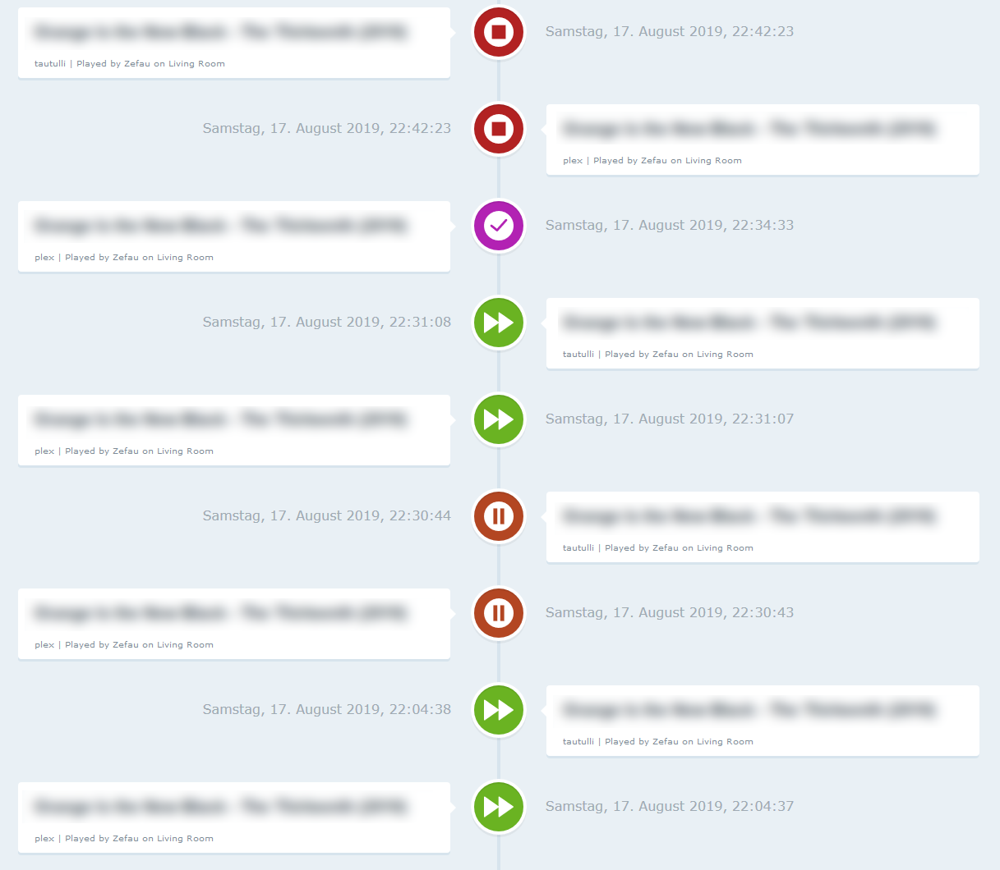
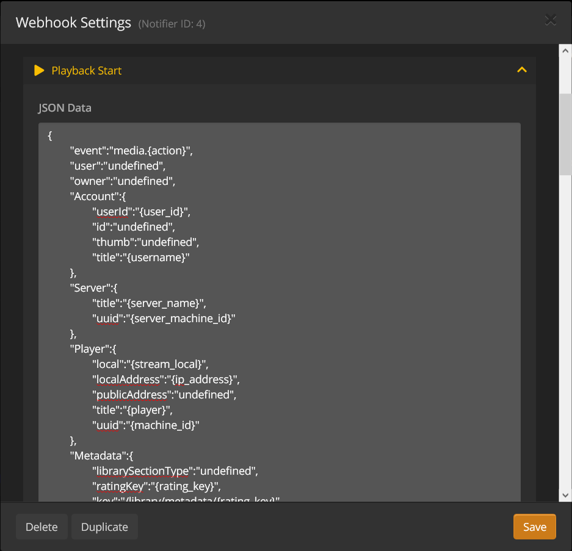

# IoBroker.plex Интеграция Plex Media Server в ioBroker (с Plex Pass или без него). Кроме того, интеграция Tautulli.
[](https://weblate.iobroker.net/engage/adapters/?utm_source=widget)

**Оглавление**

1. [Особенности](#1-особенности)
2. [Инструкции по настройке](#2-setup-instructions)
1. [Базовая настройка](#21-basic-setup)
2. [Расширенная настройка](#22-advanced-setup-plex-pass-or-tautulli)
3. [Каналы и состояния](#3-каналы--состояния)
1. [с базовой настройкой](#31-with-basis-setup)
2. [с расширенной настройкой](#32-with-advanced-setup)
4. [Журнал изменений](#журнал изменений)
5. [Лицензия](#лицензия)

## 1. Особенности
- Получать подробную информацию о текущем воспроизводимом элементе мультимедиа (например, битрейт видео, кодек, информацию о субтитрах, аудио; см. [Расширенная настройка](https://github.com/iobroker-community-adapters/ioBroker.plex/blob/master/README-states.md#with-advanced-setup) для получения полного списка)
- Получайте `события` от Plex (через [Plex Webhook](https://support.plex.tv/articles/115002267687-webhooks/#toc-0) и [Plex Notifications](https://support.plex.tv/articles/push-notifications/#toc-0) с помощью Plex Pass или через Tautulli, [__см. настройку!__](#22-advanced-setup-plex-pass-or-tautulli))
- Управление воспроизведением для игроков
- Получить `серверы`
- Получить `библиотеки`
- Получить все элементы в библиотеке
- Извлечь `users` (только с Tautulli)
- Получить `statistics` (только с Tautulli)
- Получить `плейлисты`
- Получить `настройки`
- Извлечение всех данных из контролируемых клиентов
- Веб-интерфейс, показывающий последние события из Plex:

  

## 2. Инструкции по настройке
### 2.1. Базовая настройка
Для базовой настройки необходимо указать IP-адрес (и порт) вашей установки Plex. Кроме того, вам необходимо получить выделенный токен для адаптера, чтобы получить данные из Plex.

После этого ioBroker.plex извлечет все основные данные (включая серверы, библиотеки). Полный список основных данных см. в [Каналы и состояния](#21-with-basis-setup).

### 2.2. Расширенная настройка (Plex Pass или Tautulli)
#### 2.2.1.Плекс Пасс
__Вебхук__

Если вы являетесь пользователем Plex Pass, вы можете [настроить вебхук](https://support.plex.tv/articles/115002267687-webhooks/#toc-0) в настройках Plex, чтобы получить текущее событие/действие с вашего Plex Media Server (воспроизведение, пауза, возобновление, остановка, просмотр и оценка).

Перейдите на свой Plex Media Server и перейдите к ```Settings``` и ```Webhook```. Создайте новый вебхук, нажав ```Add Webhook``` и введите свой IP-адрес ioBroker с пользовательским портом, указанным в настройках ioBroker.plex, и завершающим путем ```/plex```, например ```http://192.168.178.29:41891/plex```:


__События__

Для получения информации об уведомлениях Plex, пожалуйста, [см. официальную документацию](https://support.plex.tv/articles/push-notifications/#toc-0). Чтобы включить уведомления на вашем Plex Media Server, перейдите в `Settings` > `Server` > `General`, а затем включите параметр `Push Notifications`.

#### 2.2.2.Таутулли
[Tautulli — это стороннее приложение](https://tautulli.com/#about), которое вы можете запустить вместе с вашим Plex Media Server для мониторинга активности и отслеживания различных статистических данных. Самое главное, что эти статистические данные включают в себя то, что было просмотрено, кто это смотрел, когда и где они это смотрели, и как это было просмотрено. Вся статистика представлена в приятном и чистом интерфейсе со множеством таблиц и графиков, что позволяет легко хвастаться вашим сервером перед всеми остальными. Ознакомьтесь с [Tautulli Preview](https://tautulli.com/#preview) и [установите его на вашей предпочтительной системе](https://github.com/Tautulli/Tautulli-Wiki/wiki/Installation) если вам интересно.

Этот адаптер подключается к [API Таутулли](https://github.com/Tautulli/Tautulli/blob/master/API.md), а также получает события веб-перехватчика от Tautulli.

##### 2.2.2.1.API
После установки Tautulli откройте страницу _Настройки_ на панели инструментов Tautulli и перейдите в _Веб-интерфейс_. Прокрутите вниз до раздела _API_ и убедитесь, что отмечен ```Enable API```. Скопируйте ```API key``` и введите его в настройки ioBroker.plex. Кроме того, добавьте IP-адрес и порт Tautulli, чтобы разрешить связь API.

##### 2.2.2.2. Вебхук
###### Обзор
Чтобы настроить веб-книгу с помощью Tautulli, следуйте инструкциям ниже и убедитесь, что вы выполнили все 4 шага:

1. Добавить агента уведомлений
2. Настройте Webhook в Notification Agent
3. Настройте триггеры в Notification Agent
4. Настройте данные в Notification Agent
5. Настройте параметры уведомлений

###### Описание
После установки откройте страницу настроек на панели инструментов Tautulli и перейдите в раздел «Агенты уведомлений», как показано ниже:


1. Нажмите _Добавить новый агент уведомлений_ и _Webhook_.
2. Введите IP-адрес вашего ioBroker с пользовательским портом, указанным в настройках ioBroker.plex, и конечным путем ```/tautulli```, например ```http://192.168.178.29:41891/tautulli```:

 Кроме того, выберите ```POST``` для _Webhook Method_ и введите любое описание в _Description_.

3. Далее перейдите на вкладку _Триггеры_, выберите нужные (или просто все) агенты уведомлений. Включенный агент уведомлений вызовет событие, которое затем будет отправлено в ioBroker. __Обязательно__ предоставьте необходимые данные для каждого включенного агента уведомлений на следующем шаге!
4. Теперь, __самое главное__, заполните соответствующие данные на вкладке _Данные_ в соответствии с __[Конфигурацией уведомлений, которая находится здесь](README-tautulli.md#notification-configuration)__.

Скопируйте конфигурацию уведомлений соответствующих агентов уведомлений из предыдущего шага (например, ```Playback Start```, ```Playback Stop```, ```Playback Pause``` и ```Playback Resume```) в каждое из текстовых полей, как показано ниже для ```Playback Start```:

   

5. Наконец, установите флажок «Разрешить последовательные уведомления», чтобы разрешить отправку последовательных уведомлений (например, как просмотренных, так и остановленных уведомлений):

   

## 3. Каналы и состояния
После настройки как базовой, так и расширенной настройки появятся следующие каналы (библиотеки, серверы и пользователи, конечно, являются только примерами). Подробнее см. ниже для [полный список каналов и штатов](#21-with-basis-setup).


### 3.1. С базовой настройкой
После успешной базовой настройки будут созданы каналы в соответствии со следующей таблицей. Для получения списка всех состояний, которые будут созданы, пожалуйста, [см. специальный список штатов](README-states.md#with-basis-setup).

| Канал / Папка | Описание |
| ------- | ----------- |
| __библиотеки__ | Библиотеки Plex |
| __серверы__ | Серверы Plex |
| __настройки__ | Настройки Plex |

### 3.2. С расширенной настройкой
После успешной расширенной настройки будут _дополнительно_ созданы следующие каналы. Для списка всех состояний, которые будут созданы, пожалуйста, [см. специальный список штатов](README-states.md#with-advanced-setup).

| Канал / Папка | Описание | Примечание |
| ---------------- | ----------- | ------ |
| __\_воспроизведение__ | Plex Media воспроизводится | с помощью Plex Pass или Tautulli |
| __статистика__ | Статистика Plex Watch | только с Tautulli |
| __users__ | Пользователи Plex | только с Tautulli |

## Кредиты
Этот адаптер был бы невозможен без огромной работы @Zefau (https://github.com/Zefau), который создал его и поддерживал до 2021 года.

## Changelog
<!--
    Placeholder for the next version (at the beginning of the line):
    ### **WORK IN PROGRESS**
-->
### **WORK IN PROGRESS**
- (ticaki) Dependencies updated
- (mcm1957) Adapter requires nodejs >= 18 now

### 1.1.4 (2023-11-06)
- (ticaki) move logmessage into debug

### 1.1.3 (2023-10-05)
- (ticaki) fixed: bug in readable offset

### 1.1.2 (2023-09-16)
- (ticaki) prevent Plex from crashing due to incorrect tautulli configuration

### 1.1.1 (2023-09-16)
- (ticaki) Fixed: State common.name english/german
- (ticaki) some minor improvements

### 1.1.0 (2023-09-11)
- (ticaki) Added: Lyrics are written as link and text in _playing.device.Metadata.Music.Lyric
- (ticaki) Added: Connection to players with refresh of playerdetail
- (ticaki) Added: New states with player data.
- (ticaki) Added: Refresh of player can be activate by set _Controls.timeline.refreshDetails to true

### 1.0.5 (2023-08-31)
- (ticaki) Fixed: Control did not work with Plexamp.
- (ticaki) some minor improvements.

### 1.0.4 (2023-08-27)
- (ticaki) Fixed: [#184](https://github.com/iobroker-community-adapters/ioBroker.plex/issues/184)

### 1.0.3 (2023-08-25)
- (ticaki) Fixed: Don't add empty notifications to history [#183](https://github.com/iobroker-community-adapters/ioBroker.plex/issues/183)
- (ticaki) Fixed: prevent the creation of duplicate history entries in most cases

### 1.0.2 (2023-08-23)
- (ticaki) Added: a play/pause switch for mediaplayer
- (ticaki) Added: links to artworks (ready to use)
- (ticaki) Added: state viewOffsetSeconds refresh every second while playing media(internal counter)

### 1.0.1 (2023-08-21)
- (ticaki) Xmlparser call fixed

### 1.0.0 (2023-08-20)
- (ticaki) fixed: several minor issues have been fixed

### 1.0.0-alpha.3 (2023-08-16)
- (ticaki) fixed: common.type warnings have been fixed and missing state definitions have been added #114 #101 #100
- (ticaki) fixed: player controls  
- (ticaki) fixed: history page has been fixed 
- (ticaki) fixed: translation error has been fixed #108

### 0.9.0 (2020-05-23)
- (Zefau) added option for webhook IP address in case Plex is running in a Docker environment (see [#53](https://github.com/iobroker-community-adapters/ioBroker.plex/issues/53))
- (Zefau) updated dependencies

### 0.8.11 (2020-02-26)
- (Zefau) fixed error with state retrieval on startup when no states are given
- (Zefau) updated dependencies

### 0.8.10 (2020-02-16)
- (Zefau) fixed error with state retrieval on startup when no states are given
- (Zfeau) fixed incorrect handling of certificates when using secure connection
- (Zefau) updated dependencies

### 0.8.9 (2019-12-14)
- (Zefau) updated dependencies
- (Zefau) fixed missing spaces in events (and thus Adapter Web View)
- (Zefau) fixed using username instead of email for statistics (see [#17](https://github.com/iobroker-community-adapters/ioBroker.plex/issues/17))

### 0.8.8 (2019-12-05)
- (Zefau) fixed player controls

### 0.8.7 (2019-12-02)
- (Zefau) fixed error with http / https settings

### 0.8.6 (2019-12-02)
- (Zefau) added further states to Tautulli Notification (see [README-tautulli.md](https://github.com/iobroker-community-adapters/ioBroker.plex/blob/master/README-tautulli.md))
- (Zefau) fixed design issue with select-box in the adapter settings
- (Zefau) fixed not showing thumbnails in adapter web view (when not using a secure connection)

### 0.8.5 (2019-12-01)
- (Zefau) fixed missing user / library statistics
- (Zefau) fixed using username instead of email for statistics (see [#17](https://github.com/iobroker-community-adapters/ioBroker.plex/issues/17))

### 0.8.4 (2019-11-07)
- (Zefau) added support for remote player control via cloud / iot adapter
- (Zefau) added thumbnail to notifications as well as web interface of adapter
- (Zefau) fixed icons within the web interface of adapter

### 0.8.3 (2019-11-06)
- (Zefau) fixed player controls (error when triggering `start`, `stop`, etc.)
- (Zefau) added additional states to `event` channel

### 0.8.1 (2019-11-02)
- (Zefau) fixed error `Cannot read property 'forEach' of undefined`

### 0.8.0 (2019-10-28)
- (Zefau) added support for Plex Notifications including customization in adapter settings
- (Zefau) added count of streams (see [#14](https://github.com/iobroker-community-adapters/ioBroker.plex/issues/14))
- (Zefau) reworked cleaning up states when new webhook is received (see [#11](https://github.com/iobroker-community-adapters/ioBroker.plex/issues/11))

### 0.7.0 (2019-10-17)
- (Zefau) reworked duty cycle (clean up of outdated / old states)
- (Zefau) fixed incorrect states (see [#15](https://github.com/iobroker-community-adapters/ioBroker.plex/issues/15))

### 0.6.0 (2019-08-19)
- (Zefau) replaced password with token authentication

### 0.5.0 (2019-08-18)
- (Zefau) added support for Plex Notifications (see [#9](https://github.com/iobroker-community-adapters/ioBroker.plex/issues/9))
- (Zefau) added support for all Tautulli triggers
- (Zefau) added Adapter Web Interface that shows the recent events

### 0.4.3 (2019-08-11)
- (Zefau) Performance improvements (dutyCycleRun and state comparison)
- (Zefau) added refresh button (to scan library files) to libraries

### 0.4.1 / 0.4.2 (2019-08-03)
- (Zefau) fixed newly introduced playback control not working for certain players
- (Zefau) removed unnecessary dependencies

### 0.4.0 (2019-08-01)
- (Zefau) added playback control for players
- (Zefau) added configuration options to only retrieve specific objects from Plex

### 0.3.2 / 0.3.3 (2019-07-25)
- (Zefau) added file, streaming and transcoding information to Tautulli event
- (Zefau) fixed bug when no playlists exist
- (Zefau) fixed missing `EVENTS.json`

### 0.3.1 (2019-07-20)
- (Zefau) updated dependencies to fix security vulnerabilities in depending packages

### 0.3.0 (2019-05-16)
- ([@Apollon77](https://github.com/Apollon77)) updated testing for Node.js v12 (see [#6](https://github.com/iobroker-community-adapters/ioBroker.plex/pull/6))
- (Zefau) added support / discovery in [iobroker.discovery](https://github.com/ioBroker/ioBroker.discovery) (see [#62](https://github.com/ioBroker/ioBroker.discovery/pull/62))
- (Zefau) added playlists to states
- (Zefau) added state description for object tree ```_playing```
- (Zefau) updated German translation (instead of generating it from English)

### 0.2.0 (2019-05-14)
- (Zefau) added authentication method (using Plex user and Plex password)
- (Zefau) fixed @iobroker/adapter-core dependency

### 0.1.0 (2019-04-26)
- (Zefau) get initial data from Plex API
- (Zefau) receive events from Plex Webhook (Plex Pass only)
- (Zefau) receive events from Tatulli (if used)

## License
The MIT License (MIT)

Copyright (c) 2023-2024 iobroker-community-adapters
Copyright (c) 2019-2020 Zefau <zefau@mailbox.org>


Permission is hereby granted, free of charge, to any person obtaining a copy
of this software and associated documentation files (the "Software"), to deal
in the Software without restriction, including without limitation the rights
to use, copy, modify, merge, publish, distribute, sublicense, and/or sell
copies of the Software, and to permit persons to whom the Software is
furnished to do so, subject to the following conditions:

The above copyright notice and this permission notice shall be included in
all copies or substantial portions of the Software.

THE SOFTWARE IS PROVIDED "AS IS", WITHOUT WARRANTY OF ANY KIND, EXPRESS OR
IMPLIED, INCLUDING BUT NOT LIMITED TO THE WARRANTIES OF MERCHANTABILITY,
FITNESS FOR A PARTICULAR PURPOSE AND NONINFRINGEMENT. IN NO EVENT SHALL THE
AUTHORS OR COPYRIGHT HOLDERS BE LIABLE FOR ANY CLAIM, DAMAGES OR OTHER
LIABILITY, WHETHER IN AN ACTION OF CONTRACT, TORT OR OTHERWISE, ARISING FROM,
OUT OF OR IN CONNECTION WITH THE SOFTWARE OR THE USE OR OTHER DEALINGS IN
THE SOFTWARE.