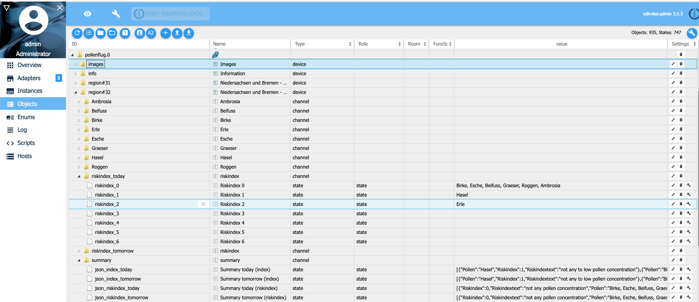

# Индекс риска пыльцы


Немецкая метеорологическая служба DWD готовит ежедневные прогнозы индекса пыльцевого риска.
Прогнозируются следующие виды пыльцы: орешник, ольха, ясень, береза, трава, рожь, полынь и амброзия на сегодня и завтра, в пятницу также на послезавтра (воскресенье).
Обновляется ежедневно утром.
Информация о пыльцевых округах доступна по адресу: https://www.dwd.de/pollenflug Авторские права на используемые данные о пыльце: © Deutscher Wetterdienst (Quelle: Deutscher Wetterdienst)

## Установка и настройка
Выберите округ в конфигурации адаптера ioBroker. Вы получите индекс риска пыльцы для этого округа. Индекс будет обновляться один раз в день, около 11 часов.
В объектах info.today, info.tomorrow и info.dayaftertomorrow будет показан период действия.
Возможно, например, сегодня пятница, но в объекте info.today день — четверг.
Это верно, потому что данные DWD все еще с четверга и не обновлялись до сих пор. Обновление будет происходить в 11 часов, как правило.

Предоставленные немецкие округа:

* Шлезвиг-Гольштейн и Гамбург (регионы 11 и 12)
    * Инсельн и Маршен (регион 11)
    * Гест, земли Шлезвиг-Гольштейн и Гамбург (регион 12)
* Мекленбург-Передняя Померания (регион 20)
* Нидерсаксония и Бремен (регионы 31 и 32)
    * Вестл. Нидерсаксен/Бремен (регион 31)
    * Эстл. Нидерсаксен (регион 32)
* Северный Рейн-Вестфалия (регионы 41, 42 и 43)
    * Рейн.-Вестфаль. Тифланд (регион 41)
    * Оствестфален (регион 42)
    * Миттельгебирге NRW (регион 43)
* Бранденбург и Берлин (регион 50)
* Саксония-Анхальт (регионы 61 и 62)
    * Тифланд Саксония-Анхальт (регион 61)
* Гарц (регион 62)
* Тюрингия (регионы 71 и 72)
    * Тифланд Тюринген (регион 71)
    * Миттельгебирге Тюрингия (регион 72)
* Саксония (регионы 81 и 82)
    * Тифланд Саксония (регион 81)
    * Миттельгебирге Саксония (регион 82)
* Гессен (регионы 91 и 92)
    * Нордессен и Гесс. Миттельгебирге (регион 91)
* Рейн-Майн (регион 92)
* Рейнланд-Пфальц и Саар (регионы 101, 102 и 103)
    * Рейн, Пфальц, Наэ и Мозель (регион 101)
    * Mittelgebirgsbereich Rheinland-Pfalz (регион 102)
* Саар (регион 103)
* Баден-Вюртемберг (регионы 111, 112 и 113)
    * Oberrhein und unteres Neckartal (регион 111)
    * Гогенлоэ/миттлерер Неккар/Обершвабен (регион 112)
    * Миттельгебирге Баден-Вюртемберг (регион 113)
* Бавария (регионы 121, 122, 123 и 124)
    * Альгой/Обербайерн/Бэй. Вальд (121 регион)
    * Донауниедерунген (регион 122)
    * Бавария Нёрдль. дер Донау, о. Байр. Вальд, о. Майнфранкен (регион 123)
    * Майнфранкен (регион 124)


Первоначальный индекс риска DWD 0, 0-1, 1, 1-2, 2, 2-3 и 3 изменен на 0, 1, 2, 3, 4, 5 и 6. Этот формат можно проще использовать в ioBroker.

| Индекс | Индекс DWD | описание |
|-----	|---------- |------------------------------------ |
| -1 | -1 | данные отсутствуют |
| 0 | 0 | нет концентрации пыльцы |
| 1 | 0-1 | от нуля до низкой концентрации пыльцы |
| 2 | 1 | низкая концентрация пыльцы |
| 3 | 1-2 | низкая или средняя концентрация пыльцы |
| 4 | 2 | средняя концентрация пыльцы |
| 5 | 2-3 | средняя или высокая концентрация пыльцы |
| 6 | 3 | высокая концентрация пыльцы |

**Пример полета пыльцы:** 


URL-адрес изображений пыльцы из DWD


## Пример
Если поступят новые данные от DWD (сегодняшняя дата изменится), скрипт покажет индекс риска пыльцы для Хазела и Эрла.

```
on({id: "pollenflug.0.info.today"/*Today*/, change: "ne"}, (obj) => {
    let hasel = getState("pollenflug.0.region#12.Hasel.text_today"/*today*/).val;
    let erle  = getState("pollenflug.0.region#12.Erle.text_today"/*today*/).val;
    console.log("Haselnuss Belastung " + hasel);
    console.log("Erle Belastung " + erle);
});
```

## Кредиты
Создание этого адаптера было бы невозможно без выдающейся работы schmupu (https://github.com/schmupu), который создал версию V1.x.x этого адаптера.

## Changelog
<!--
	Placeholder for the next version (at the beginning of the line):
    ### **WORK IN PROGRESS**
-->
### 2.0.0 (2024-07-24)
* (mcm1957) This adapter hase been moved to iobroker-community-adapters organization
* (mcm1957) Adapter requires node.js >= 18 and js-controller >= 5 now.
* (mcm1957) Dependencies have been updated

### 1.0.6 (03.05.2019)
* (Stübi) User can enable/disable sentry logging

### 1.0.5 (29.04.2019)
* (Stübi) Add Sentry to adapter

### 1.0.4 (19.10.2019)
* (Stübi) Bugfixing

### 1.0.3 (12.04.2019)
* (Stübi) Bugfixing, changing logo size

### 1.0.2 (12.03.2019)
* (Stübi) Bugfixing, of changing sepaation of entries in riskindex_x from ',' to ', '
* (Stübi) unnecessary states will be deleted

### 1.0.1 (11.03.2019)
* (Stübi) Delete all states for day after tommorrow 
* (Stübi) Changed type of object riskindex_x from number to string
* (Stübi) Changed sepaation of entries in riskindex_x from ',' to ', '
* (Stübi) Deleted in summary (json) alle -1 entries

### 1.0.0 (10.03.2019)
* (Stübi) Changed the pollen index for better use in VIS. Now you you values -1, 0, 1, 2, 3, 4, 5 ,6
* (Stübi) Add summary for today, tomorrow and the day after tomorrow in json format for every region

### 0.1.9 (25.02.2019)
* (Stübi) Link to DWD Image of pollen flight added

### 0.1.8 (24.02.2019)
* (Stübi) Bugfixing deleting object

### 0.1.6 (20.02.2019)
* (Stübi) First Version of pollen index adapter

## License
The MIT License (MIT)

Copyright (c) 2024 iobroker-community <iobroker-community-adapters@gmx.de>
Copyright (c) 2020 Thorsten Stueben <thorsten@stueben.de> / <https://github.com/schmupu>

Permission is hereby granted, free of charge, to any person obtaining a copy
of this software and associated documentation files (the "Software"), to deal
in the Software without restriction, including without limitation the rights
to use, copy, modify, merge, publish, distribute, sublicense, and/or sell
copies of the Software, and to permit persons to whom the Software is
furnished to do so, subject to the following conditions:

The above copyright notice and this permission notice shall be included in
all copies or substantial portions of the Software.

THE SOFTWARE IS PROVIDED "AS IS", WITHOUT WARRANTY OF ANY KIND, EXPRESS OR
IMPLIED, INCLUDING BUT NOT LIMITED TO THE WARRANTIES OF MERCHANTABILITY,
FITNESS FOR A PARTICULAR PURPOSE AND NONINFRINGEMENT. IN NO EVENT SHALL THE
AUTHORS OR COPYRIGHT HOLDERS BE LIABLE FOR ANY CLAIM, DAMAGES OR OTHER
LIABILITY, WHETHER IN AN ACTION OF CONTRACT, TORT OR OTHERWISE, ARISING FROM,
OUT OF OR IN CONNECTION WITH THE SOFTWARE OR THE USE OR OTHER DEALINGS IN
THE SOFTWARE.