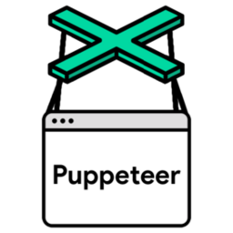

# ioBroker.puppeteer

## Адаптер Puppeteer для ioBroker

Безголовый браузер для создания скриншотов на основе Chrome

## Отказ от ответственности

Puppeteer — продукт компании Google Inc. Разработчики этого модуля никоим образом не связаны с компанией Google Inc., ее дочерними компаниями, логотипами или товарными знаками и не получают от них никакой поддержки.

## Инструкция

Адаптер полностью настраивается через состояния и не предоставляет настроек в административном интерфейсе. Состояния (помимо)`url` ) не получит никаких флагов подтверждения от адаптера, и флаги подтверждения, как правило, игнорируются.

### Штаты

#### имя файла

Укажите имя файла (полный путь) изображения.

#### url

Укажите URL-адрес, с которого вы хотите сделать снимок экрана. Если состояние указано, снимок экрана будет создан немедленно. После создания снимка экрана адаптер установит флаг подтверждения (ack) состояния URL-адреса в значение true.

#### полная страница

Если это условие выполняется, будет сделан снимок экрана всей страницы. Параметры обрезки будут проигнорированы.

#### cropLeft/Hop/Height/Width

Настройте параметры обрезки в`px` Чтобы сделать снимок экрана только нужного сегмента страницы. Если`fullPage` Если установлено значение true, обрезка выполняться не будет.

#### waitForSelector

Скриншот будет сделан после того, как селектор станет видимым на странице, например.`#time` . Если`waitForSelector` активен, другие ожидают операций, таких как`renderTime` игнорируются.

#### renderTime

Интервал в миллисекундах, в течение которого страница будет отрисована.

### Сообщения

В качестве альтернативы вы можете делать снимки экрана, отправляя сообщения адаптеру. Все варианты, кроме...`url` и`ioBrokerOptions` Параметры передаются непосредственно в API Puppeteer; список поддерживаемых параметров приведен ниже; для получения более актуальной информации ознакомьтесь [с описанием API](https://pptr.dev/api/puppeteer.screenshotoptions) . Кроме того, вы можете определить`waitOption` Дождитесь заданного времени или выбора селектора. Наконец, вы можете использовать`ioBrokerOptions.storagePath` опция для сохранения скриншотов непосредственно в хранилище ioBroker в разделе`0_userdata.0` которые затем можно просмотреть через административные и визуализационные адаптеры.

```typescript
sendTo('puppeteer.0', 'screenshot', { url: 'https://www.google.com',
      ioBrokerOptions?: {
        /**
         * Define a filename for the ioBroker storage e.g. test.png
         */
        storagePath: string;
      },
      /**
       * Define at most one wait option
       * You can also look for other waitOptions currently supported by Puppeteer API
       * see e.g. https://puppeteer.github.io/puppeteer/docs/puppeteer.page.waitforfilechooser
       */
      waitOption?: {
        /**
         * Define a Timeout in ms
         */
        waitForTimeout?: 5000,
    
        /**
         * Wait for a given id/tag/etc to be occured
         */
        waitForSelector?: '#testId'
      },
      /**
       * Optionally, specify the viewport manually, see https://pptr.dev/api/puppeteer.viewport
       */
      viewportOptions?: {
        width: 800,
        height: 600
      },
      /**
       * The file path to save the image to. The screenshot type will be inferred
       * from file extension. If path is a relative path, then it is resolved
       * relative to current working directory. If no path is provided, the image
       * won't be saved to the disk.
       */
      path?: string,
      /**
       * When true, takes a screenshot of the full page.
       * @defaultValue false
       */
      fullPage?: boolean,
      /**
       * An object which specifies the clipping region of the page.
       */
      clip?: {         
        x: number,
        y: number,
        width: number,
        height: number 
      };
      /**
       * Quality of the image, between 0-100. Not applicable to `png` images.
       */
      quality?: number,
      /**
       * Hides default white background and allows capturing screenshots with transparency.
       * @defaultValue false
       */
      omitBackground?: boolean,
      /**
       * Encoding of the image.
       * @defaultValue 'binary'
       */
      encoding?: 'base64' | 'binary',
      /**
       * If you need a screenshot bigger than the Viewport
       * @defaultValue true
       */
      captureBeyondViewport?: boolean,
  }, obj => {
      if (obj.error) {
        log(`Error taking screenshot: ${obj.error.message}`, 'error');
      } else {
        // the binary representation of the image is contained in `obj.result`
        log(`Successfully took screenshot: ${obj.result}`);
      }
});
```

## Changelog
<!--
    Placeholder for the next version (at the beginning of the line):
    ### **WORK IN PROGRESS**
-->
### 0.4.0 (2024-09-17)
* (@foxriver76) updated puppeteer dependency
* (@foxriver76) allow to specify an external browser for puppeteer

### 0.3.0 (2024-05-19)
* (foxriver76) allowed to specify additional arguments for the puppeteer process
* (foxriver76) updated puppeteer dependency

### 0.2.8 (2024-01-09)
* (foxriver76) update puppeteer dependency

### 0.2.7 (2023-03-18)
* (foxriver76) update puppeteer dependency

### 0.2.6 (2022-08-14)
* (foxriver76) we now close the page also when screenshot taken via message

### 0.2.5 (2022-08-14)
* (foxriver76) we have optimized the viewport option

### 0.2.4 (2022-08-12)
* (foxriver76) allow settings viewport options
* (foxriver76) the default viewport is now the max resolution

### 0.2.3 (2022-08-12)
* (foxriver76) optimized path check for relative paths

### 0.2.1 (2022-06-09)
* (foxriver76) we now install required shared libraries on adapter installation on linux

### 0.2.0 (2022-05-20)
* (foxriver76) added option to save files to the ioBroker storage via messages by using `ioBrokerOptions.storagePath` (closes #2)

### 0.1.0 (2022-05-16)
* (foxriver76) initial release

## License
MIT License

Copyright (c) 2024 Moritz Heusinger <moritz.heusinger@gmail.com>

Permission is hereby granted, free of charge, to any person obtaining a copy
of this software and associated documentation files (the "Software"), to deal
in the Software without restriction, including without limitation the rights
to use, copy, modify, merge, publish, distribute, sublicense, and/or sell
copies of the Software, and to permit persons to whom the Software is
furnished to do so, subject to the following conditions:

The above copyright notice and this permission notice shall be included in all
copies or substantial portions of the Software.

THE SOFTWARE IS PROVIDED "AS IS", WITHOUT WARRANTY OF ANY KIND, EXPRESS OR
IMPLIED, INCLUDING BUT NOT LIMITED TO THE WARRANTIES OF MERCHANTABILITY,
FITNESS FOR A PARTICULAR PURPOSE AND NONINFRINGEMENT. IN NO EVENT SHALL THE
AUTHORS OR COPYRIGHT HOLDERS BE LIABLE FOR ANY CLAIM, DAMAGES OR OTHER
LIABILITY, WHETHER IN AN ACTION OF CONTRACT, TORT OR OTHERWISE, ARISING FROM,
OUT OF OR IN CONNECTION WITH THE SOFTWARE OR THE USE OR OTHER DEALINGS IN THE
SOFTWARE.