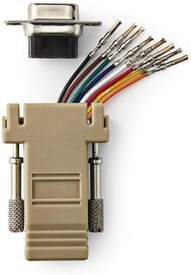
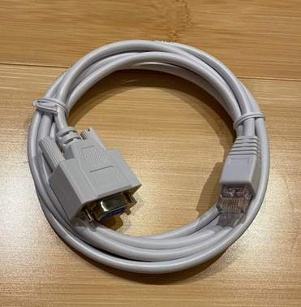
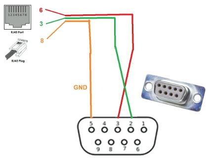
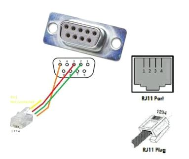
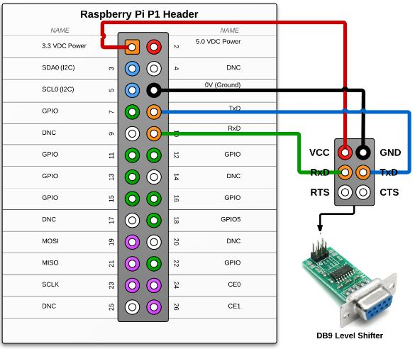
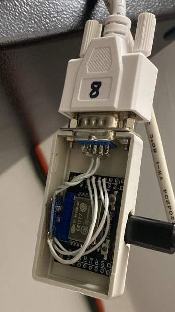
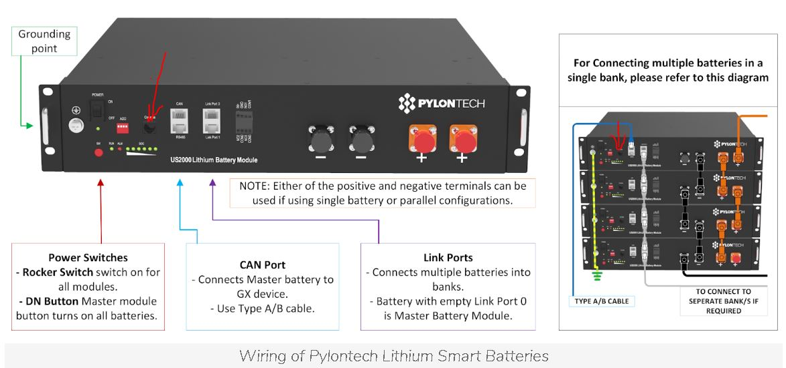
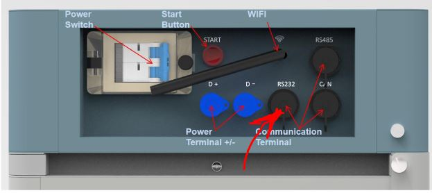

# ioBroker.pylontech

## адаптер pylontech и pytes для ioBroker

Запросите напряжение элементов и состояние батарей Pylontech или Pytes через консоль. Я не связан с этими компаниями.

**Обратите внимание, что ответственность за все, что вы собираете или подключаете, всегда лежит на вас. Разработчик данного адаптера не несет никакой ответственности за любой ущерб!**

## как это работает

Этот адаптер используется для определения состояния и функций массива Pylontech или Pytes, который может состоять из одной или до пятнадцати батарей. Адаптер не используется для управления батареей. Он является частью зарядного и силового блока или инвертора. Батареи имеют консольный разъем, обеспечивающий интерфейс RS232 или V24. Этот адаптер подключается к нему через последовательный интерфейс. Первая батарея предоставляет все данные и запрашивает остальные через восходящий канал. Внимание, прямое подключение Raspberry Pi или ESP невозможно. Интерфейсы RS232 не имеют уровня TTL и не рассчитаны на 3 или 5 вольт. Для подключения требуется преобразователь уровней. Инструкции по сборке вы найдете ниже.

## Что необходимо для подключения?

Для подключения необходимы кабель и последовательный преобразователь. Для последовательного соединения требуются три линии: rxd, txd и заземление.

Сигналы Rxd и Txd должны быть перекрещены, чтобы то, что отправляет один (Txd), могло быть принято (Rxd) другим. Необходима земля, чтобы можно было создать напряжение и начать протекание электрического тока.

### Кабель последовательного соединения для Pylontech

Компания Pylontech со временем изменила разъемы RJ на батареях. Изначально использовались разъемы RJ11, как на телефонных разъемах. Теперь это RJ45, как на сетевых разъемах. На следующих рисунках показан стандартный девятиконтактный разъем D-SUB на кабеле. Этот кабель легко подключается через USB-порт с помощью адаптера RS232-USB или преобразователя RS232-LAN или Wi-Fi. Вся информация передается только от первой батареи в массиве. Вам нужен только кабель и последовательный порт.

Вы можете собрать такой кабель самостоятельно с помощью [настраиваемого разъема](https://www.amazon.de/gp/product/B0C8JFWNR7) . Он доступен с разъемом RJ45 и гнездом D-SUB9. Вы просто подключаете к нему патч-кабель. **Но будьте осторожны и хорошо изолируйте оставшиеся контакты, чтобы они не соприкасались друг с другом. Не у всех батарей оставшиеся контакты не используются.** В принципе, к такому адаптеру можно также подключить кабель RJ11. Но мне кажется, он очень шаткий и всегда кажется, что контакт плохой.



Или готовые кабели можно заказать на [форуме](https://forum.iobroker.net/topic/68707) .



#### RJ45

| RJ45 | сигнал | DSUB | сигнал |
| ---- | ------ | ---- | ------ |
| 3    | ТхД    | 2    | РхД    |
| 6    | РхД    | 3    | ТхД    |
| 8    | Земля  | 5    | Земля  |



#### RJ11 / RJ12

Разъемы RJ11 и RJ12 имеют одинаковый размер. У RJ11 всего четыре контакта, у RJ12 — шесть. Контакты RJ11 расположены посередине штекера, поэтому их количество различается. Физически контакты находятся в одном и том же месте.

| RJ11    | RJ12    | сигнал | DSUB | сигнал |
| ------- | ------- | ------ | ---- | ------ |
| 1 или 4 | 2 или 5 | Земля  | 5    | Земля  |
| 3       | 4       | ТхД    | 2    | РхД    |
| 2       | 3       | РхД    | 3    | ТхД    |



### Кабель последовательного соединения для Pytes

#### RJ45

| RJ45 | сигнал | DSUB | сигнал |
| ---- | ------ | ---- | ------ |
| 3    | ТхД    | 2    | РхД    |
| 4    | Земля  | 5    | Земля  |
| 6    | РхД    | 3    | ТхД    |

### Существуют консольные кабели RJ45 с USB-портом для маршрутизаторов Cisco. Они не имеют совместимого разъема. Однако, при наличии небольшого опыта, штекер RJ45 можно заменить.

### Обратите внимание, что из-за относительно высокой скорости передачи данных для соединений RS232 (115200 бод) длина кабеля не может быть особенно большой.

| макс. бод   | макс. длина |
| ----------- | ----------- |
| 2400        | 900 м       |
| 4800        | 300 м       |
| 9600        | 152 м       |
| 19.200      | 15 м        |
| 57.600      | 5 м         |
| **115.200** | **2 м**     |

Если поблизости нет USB-порта, можно собрать адаптер последовательного порта в Wi-Fi с помощью ESP.

Эти адаптеры используют протокол Telnet и, по сути, расширяют последовательный интерфейс через Wi-Fi. Здесь важно установить модуль драйвера для последовательного интерфейса, например, MAX3232. Обратите внимание на напряжение, но в большинстве случаев оно составляет 3 В.

#### Raspberry Pi с MAX

Поскольку Raspberry Pi также имеет интерфейс TTL с напряжением 3 В, к нему можно подключить MAX3232.



Подробнее читайте здесь [: http://www.savagehomeautomation.com/projects/raspberry-pi-rs232-serial-interface-options-revisit.html](http://www.savagehomeautomation.com/projects/raspberry-pi-rs232-serial-interface-options-revisit.html)

#### Найдите порт в Linux (Debian / Raspberry Pi)

В Linux можно установить связь с портом, к которому подключен USB-последовательный преобразователь. После этого можно присвоить устройствам описательные имена.

```
$ ls -l /dev
crw-rw---- 1 root dialout 188,     0 29. Sep 21:32 ttyUSB0
lrwxrwxrwx 1 root root             7 29. Sep 21:32 ttyUSB_pylontech -> ttyUSB0
```

Серийный номер можно определить, если он есть у USB-конвертера.

```
$ udevadm info -a /dev/ttyUSB0 | grep ATTRS{serial}
      ATTRS{serial}=="thisisit"
```

Если здесь нет серийного номера, значит, вы его потеряли. Пожалуйста, убедитесь, что устройство адаптировано под ttyUSBx.

Создайте новый конфигурационный файл. Используйте любой редактор на ваш выбор, также можно использовать VI.

```
sudo nano /etc/udev/rules.d/20_pylontech.rules
```

Со следующим содержимым

```
# File: /etc/udev/rules.d/20_pylontech.rules
# FTDI USB <-> Serial
SUBSYSTEM=="tty", \
ATTRS{serial}=="thisisit", \
SYMLINK+="ttyUSB_pylontech"
```

Затем следует перезапустить udev, отключить и снова подключить устройство.

```
sudo /etc/init.d/udev restart
```

#### Найти порт в Linux (второй метод)

Для каждого устройства можно присвоить уникальное имя. Оно не меняется, например, при использовании FTDI. Это имя также можно ввести в адаптер.

```
$ ls -l /dev/serial/by-id
lrwxrwxrwx 1 root root 13 10. Okt 11:37 usb-ftdi_usb_serial_converter_ftDZ0DGP-if00-port0 -> ../../ttyUSB0
```

Таким образом, устройство`/dev/serial/by-id/usb-ftdi_usb_serial_converter_ftDZ0DGP-if00-port0`

### com через TCP

Вместо локального подключения:

```
+--------+   comport  +----------+
| DEVICE | ~~~~~~~~~~ | ioBroker |
+--------+            +----------+
```

Поддерживает ли данный адаптер также подключение к сети?

```
+--------+   comport  +--------+       network        +----------+
| DEVICE | ~~~~~~~~~~ | SERVER |========....==========| ioBroker |
+--------+            +--------+                      +----------+
```

#### ESP с MAX

Существует несколько проектов, которые подключают ESP или ESP32 к Telnet. Пожалуйста, запомните MAX. Если MAX сильно нагревается, это может означать либо слишком высокий уровень сигнала 5 В (поскольку у вас модель на 3,3 В), либо подключение версии на 3,3 В к рабочему напряжению 5 В.



Вот несколько примеров:

ESP-LINK: <https://github.com/jeelabs/esp-link>

ESP-Serial-Bridge: <https://github.com/yuri-rage/ESP-Serial-Bridge>

Подключение через последовательный порт по Wi-Fi: <https://www.instructables.com/Serial-Port-Over-WiFi/>

Tasmota вызвала проблемы, поскольку блоки передавались не в правильном порядке, поэтому в данный момент её не следует использовать: <https://tasmota.github.io/docs/Serial-to-TCP-Bridge/>

В качестве исполняемых файлов можно использовать только следующие или самостоятельно скомпилированные версии, в противном случае TCP-сервер не будет включен:

- <http://ota.tasmota.com/tasmota32/release/tasmota32-zbbrdgpro.bin>
- <http://ota.tasmota.com/tasmota/release/tasmota-zbbrdgpro.bin>

Параметры Gipos необходимо установить заранее. По одному на TCP Rx и TCP Tx.

```
TCPBaudRate 115200
TCPStart 23
Rule1 ON System#Boot do TCPStart 23 endon
Rule1 1
```

Это работает, потому что на порту 23 предоставляется прозрачный TCP-сервер. Порт можно выбрать, просто заменив, например, 23 на 9000. **И, конечно же, припаяйте MAX2323 между контактами Gipo и разъемом RJ/DSUB!!!!**

#### Linux в сеть

С помощью ser2net можно совместно использовать порт ПК или мини-Raspberry Pi по сети.

```
sudo apt-get ser2net            #install
sudo vim /etc/ser2net.conf      #configure
ser2net                         #run service
```

Строка конфигурации (для /etc/ser2net.conf), соответствующая описанной выше настройке Windows.

```
7000:telnet:0:/dev/ttyUSB0:115200 8DATABITS NONE 1STOPBIT remctl
```

RFC. Вот настройки вышеуказанной конфигурации. Порт устройства — 7000.

- 7000 - порт
- /dev/ttyUSB0 - имя последовательного порта
- 115200 ... - скорость передачи данных и т.д. (на самом деле, вы можете пропустить этот параметр из-за remctl)
- remctl - означает использование конфигурации удаленного порта в соответствии с RFC2217

Более подробную информацию можно найти здесь: <https://gist.github.com/DraTeots/e0c669608466470baa6c>

#### Готовое оборудование

Существует готовое оборудование, которое можно подключить через Wi-Fi и/или локальную сеть. Главное, чтобы оно использовало прозрачный TCP-сервер.

Пример:

- Waveshare RS232/485 TO ETH (для ЕС)

## В любом случае, если вам что-нибудь понадобится, вы также можете связаться со мной через личные сообщения на форуме ioBroker.

Ещё один совет: существуют как дешёвые, так и дорогие USB-конвертеры последовательного порта. Конвертеры с CHxxx PLxxx и CPxxx в названии не имеют никаких идентификационных признаков. Если вы соедините два таких устройства, а затем поменяете порты местами или загрузите систему в первый раз, вы уже не будете знать, какой из них какой. Поэтому лучше брать качественные устройства с чипом FTDI и серийным номером. Существуют также хорошие последовательные конвертеры без чипа FTDI, которые имеют серийный номер.

### Протестированное оборудование

Я пока только в начале. Что было протестировано:

#### RS232 к ioBroker

| Коммуникационное оборудование       | Тип     | Работает | Комментарии                                                                                                                                                                                                                                                            |
| ----------------------------------- | ------- | -------- | ---------------------------------------------------------------------------------------------------------------------------------------------------------------------------------------------------------------------------------------------------------------------- |
| Последовательный порт в USB         | местный | да       | Для адаптеров доступен большой выбор микросхем. В зависимости от модели, могут возникнуть проблемы с идентификацией, если у адаптеров нет серийного номера и подключено более одного устройства. Windows уже назначает каждому USB-разъему отдельный COM-порт.         |
| LogiLink AU0034                     | местный | да       |                                                                                                                                                                                                                                                                        |
| ESP-LINK                            | сеть    | да       | Присвойте устройству IP-адрес в сети. Проверьте скорость передачи 115200 8 N 1. Все остальное оставьте без изменений. Не забудьте использовать конвертер, например, MAX.                                                                                               |
| Тасмота                             | сеть    | нет      | При использовании Tasmota на ESP8266 блоки передавались не в правильном порядке, что приводило к некорректным объектам и данным. Поэтому использование Tasmota не рекомендуется.                                                                                       |
| Waveshare RS232/485 TO ETH (для ЕС) | сеть    | да       | Присвойте устройству IP-адрес в сети. Проверьте скорость передачи 115200 8 N 1. Все остальное оставьте без изменений. Используйте порт RS232 SUBD.                                                                                                                     |
| Waveshare RS232/485/422 TO POE ETH  | сеть    | да       | Присвойте устройству IP-адрес в сети. Проверьте скорость передачи 115200 8 N 1. Все остальное оставьте без изменений. Используйте порт RS232 SUBD. Преобразователь может питаться через PoE. Если PoE доступен, вам не потребуется источник питания рядом с батареями. |
| Эльфин EW10A                        | сеть    | да       | Убедитесь, что вашей сети Wi-Fi достаточно пропускной способности и мощности сигнала для стабильного соединения. Проверьте скорость передачи 115200 8 N 1.                                                                                                             |
| Эльфин EW10A-0                      | сеть    | да       | Убедитесь, что вашей сети Wi-Fi достаточно пропускной способности и мощности сигнала для стабильного соединения. Проверьте скорость передачи 115200 8 N 1.                                                                                                             |
| Эльфин EE10-A                       | сеть    | да       | Присвойте устройству IP-адрес в сети. Проверьте скорость передачи 115200 8 N 1. Все остальное оставьте без изменений.                                                                                                                                                  |

#### Батареи

| модель Пилонтех   | Модель | Прошивка      | Работает | Комментарий                                                                                                                                                     |
| ----------------- | ------ | ------------- | -------- | --------------------------------------------------------------------------------------------------------------------------------------------------------------- |
| 5000 долларов США | НАС    | V1.3 22-08-10 | отлично  |                                                                                                                                                                 |
| US2000C           | НАС    | V2.6 21-09-26 | отлично  |                                                                                                                                                                 |
| US2000C           | НАС    | V2.1          | отлично  |                                                                                                                                                                 |
| US2000C           | НАС    | V2.8          | отлично  |                                                                                                                                                                 |
| US2000 (US2KBPL)  | НАС    | V2.8 21-04-29 | отлично  | Температура изменяется только с шагом в один градус.                                                                                                            |
| Сила H2           | Сила   | V1.5 21-06-18 | отлично  | Внимание: в некоторых руководствах Force в описании разъема указаны только контакты RX и TX. Заземление находится на контакте 8 и также должно быть подключено. |

| Модель Пита    | Модель | Прошивка       | Работает | Комментарий                                                                                                                                                                                      |
| -------------- | ------ | -------------- | -------- | ------------------------------------------------------------------------------------------------------------------------------------------------------------------------------------------------ |
| E-BOX-4850P    | НАС    | V1.3 22-12-20  | отлично  | Благодарим kletternaut за предоставленные тестовые данные.                                                                                                                                       |
| E-BOX-48100V-D | НАС    | V1.10 23-10-13 | отлично  | Версия адаптера >=0.0.9. Необходимо отключить параметры "Загрузка состояния батарейных элементов" и "Загрузка статистических данных о батарее". (Параметры soh -n- и stst -n- не поддерживаются) |

Если вы используете данное оборудование, пожалуйста, напишите мне на форуме или в Github, создав заявку. Мы будем рады продолжить этот список рассылки.

Форум ioBroker: <https://forum.iobroker.net/topic/68707>

### Связь

Только первый аккумулятор в массиве предоставляет всю информацию. Если вы подключите этот адаптер к одному из следующих аккумуляторов, он перестанет работать, поскольку этот аккумулятор не сможет ответить на все запросы.

Обратите внимание: **интерфейсы RS485 и Canbus не предназначены для этого адаптера. Они работают на другом языке.**



В подразделении полиции также есть терминал.



## Административный интерфейс

Настройки в административном интерфейсе IoBroker:

### Связь

#### Подключение через

Вы можете выбрать в качестве интерфейса локальное устройство, то есть интерфейс, подключенный к компьютеру локально, например, USB-конвертер, или сетевой сервер TCP-IP.

Параметры:

- Локальное устройство
- Сетевое устройство

### Локальное устройство

Следующие поля отображаются только в том случае, если в поле «Подключение через» выбрано «Локальное устройство».

#### Путь к локальному устройству

Если выбрано «локальное устройство», необходимо указать путь или порт. NodeJs работает в Linux, поэтому сообщение «путь не найден» также появляется, если указанное устройство Windows не найдено. Адаптер ищет стандартные устройства и предлагает их в виде списка, но это работает только при запущенном адаптере, поскольку для этого требуется связь с экземпляром. Предлагаются только устройства, без альтернативных идентификаторов устройств и без имен unicname, но их можно ввести вручную. См. раздел «Локальные интерфейсы».

#### Скорость передачи

Здесь можно установить скорость передачи. На более новых моделях она установлена на 115200. Для более старых моделей — на 1200. Если соединение не устанавливается, можно попробовать запустить адаптер на скорости 1200. В этом случае скорость можно установить на 115200, используя команду \`status "pylontech. -n- . config.set\_speed"\`. После этого скорость адаптера необходимо снова установить на 115200.

### сетевое устройство

Следующие поля отображаются только в том случае, если в поле «Подключение через» выбрано сетевое устройство. Зашифрованные сетевые соединения пока установить невозможно.

#### Сетевой хост

Введите здесь имя COM-сервера. Не используйте http или что-либо подобное в начале имени. Можно ввести IP-адрес или имена, например, ESP-LINK.FRITZ.BOX. Для DHCP-устройств обратите внимание на то, что IP-адрес может меняться.

#### Сетевой порт

Для установления связи необходимо указать порт, через который сервер осуществляет обмен данными. Например, для ESP-Link это порт 23.

#### Скорость передачи

Скорость необходимо установить на сетевом устройстве.

### Время цикла в минутах

Здесь можно установить время цикла. Лично я считаю, что 5 минут достаточно, чтобы понять, хорошо ли работают батареи. Обратите внимание, что батареи должны в первую очередь взаимодействовать с инвертором, а не с отладчиком.

### Модель

Здесь вы можете выбрать модель. В данный момент доступны варианты US и Force. Ничего нельзя повредить. Поэтому смело проверяйте, какие настройки установлены на вашем Pylontech. Некоторые из них также указаны в верхней части списка совместимости. Если это не сработает, вы можете связаться со мной через форум ioBroker, и мы выясним, почему данные не считываются.

Форум ioBroker: <https://forum.iobroker.net/topic/68707>

### Определите, какие данные считываются для модели США.

Если ошибки возникают из-за того, что адаптер запрашивает данные, которые батареи не предоставляют, запрос можно остановить здесь. Адаптер был разработан на основе модернизации, поэтому мне, возможно, придётся внести улучшения. Если объектов слишком много, вы также можете уменьшить объём данных здесь.

#### Загрузите данные об элементах батареи.

Команда “bat -n-” будет выведена на консоль только в том случае, если это указано здесь.

#### Загрузите данные о состоянии аккумуляторных элементов.

Команда “soh -n-” будет выведена в консоль только в том случае, если этот параметр задан здесь.

#### Загрузите данные об аккумуляторе.

Команда «info -n-» всегда выводится в консоль. Здесь вы найдете информацию о серийных номерах отдельных батарей. Она необходима для дерева объектов. Если эта функция отключена, информация не будет передаваться в ioBroker.

#### Загрузите данные журнала.

Команда «log» будет выведена в консоль только в том случае, если это указано здесь.

#### Загрузите данные о заряде батареи.

Команда "pwr" всегда выводится на консоль. Команда "pwr -n-" выводится на консоль только в том случае, если здесь это указано. Здесь вы найдете информацию о положении отдельных батарей. Она необходима для дерева объектов. Если это отключено, информация из команды "pwr" не передается в ioBroker, и команда "pwr -n-" не выполняется.

#### Загрузите статистические данные о состоянии батареи.

Команда “stat -n-” выводится в консоль только в том случае, если здесь задан соответствующий параметр.

#### Загрузите информацию о времени.

Команда «time» будет выведена в консоль только в том случае, если это указано здесь.

### Определите, какие данные считываются для модели «Сила».

Если ошибки возникают из-за того, что адаптер запрашивает данные, которые батареи не предоставляют, запрос можно остановить здесь. Адаптер был разработан на основе модернизации, поэтому мне, возможно, придётся внести улучшения. Если объектов слишком много, вы также можете уменьшить объём данных здесь.

#### Загрузите данные об элементах батареи.

Команда «bat» будет выведена на консоль только в том случае, если это указано здесь.

#### Загрузите данные о состоянии аккумуляторных элементов.

Команда «soh» будет выведена на консоль только в том случае, если здесь задан соответствующий параметр.

#### Загрузите данные об аккумуляторе.

Команда «info» будет выведена в консоль только в том случае, если это указано здесь.

#### Загрузите данные журнала.

Команда «log» будет выведена в консоль только в том случае, если это указано здесь.

#### Загрузите данные о заряде батареи.

Команда «pwr» будет выведена в консоль только в том случае, если это указано здесь.

#### Загрузите статистические данные о состоянии батареи.

Команда «stat» будет выведена в консоль только в том случае, если это указано здесь.

#### Загрузите данные об аккумуляторной системе.

Команда “sysinfo” выводится в консоль только в том случае, если здесь задан соответствующий параметр.

#### Загрузите данные по устройству.

Команда "unit" выводится на консоль только в том случае, если этот параметр задан здесь.

#### Загрузите информацию о времени.

Команда «time» будет выведена в консоль только в том случае, если это указано здесь.

## Ценности и принципы работы модели США

Здесь почти все измерения хранятся в милли (одна тысячная часть).

- миллиградусы Цельсия
- миллиамперы
- миллиампер-часов

Для отображения большинства значений необходимо разделить их на тысячи.

### канал -SN-.battery-nn-

Информация о следующих командах хранится здесь.

- команда «сох -н-»
- команда “bat -n-”

### канал -SN-.info

Информация о следующей команде хранится здесь.

- команда “info -n-”

### канал -SN-.power

Информация о следующих командах хранится здесь.

- команда “pwr”
- команда “pwr -n-”

### канал -SN-.статистика

Информация о следующей команде хранится здесь.

- команда “stat -n-”

## Значения и операции для модели Силы

дело

### конфигурация канала

#### состояние set\_speed

Вы можете установить значение параметра «set\_speed» в «true» без подтверждения. На старых моделях на батарею отправляется команда, корректирующая скорость. На новых моделях возвращается сообщение об ошибке. При отправке команды значение ack устанавливается в true.

### Информация о канале США

#### соединение состояния

Это верно, если адаптер смог установить связь.

#### состояние -n-.связанный

Устанавливается в значение true, когда батарея обнаружена.

#### state-n-.barcode

Содержит штрихкод (серийный номер) для отслеживания того, какая батарея установлена в какой точке блока.

### журнал канала

Канал журнала содержит 31 канал с последними 31 сообщениями журнала. Neuset всегда находится в состоянии 31 и затем переключается на более низкий уровень при появлении новых сообщений.

### время канала

#### состояние ds3231, rtc или время

Здесь сохраняется время, считанное с инвертора. На US3000 оно называется RTC, а на старой модели VS2000 — ds3231. Если вы запишете время, оно будет перенесено в батарею, и время работы батареи будет скорректировано.

#### набор состояний

Если в поле set указано true без ack, текущее время отправляется на Pylontech. После выполнения команды статус устанавливается в ack = true.

### Информация о канале Force

#### соединение состояния

Это верно, если адаптер смог установить связь.

### журнал канала

Канал журнала содержит 31 канал с последними 31 сообщениями журнала. Neuset всегда находится в состоянии 31 и затем переключается на более низкий уровень при появлении новых сообщений.

### время канала

#### состояние ds3231, rtc или время

Здесь сохраняется время, считанное с инвертора. На US3000 оно называется RTC, а на старой модели VS2000 — ds3231. Если вы запишете время, оно будет перенесено в батарею, и время работы батареи будет скорректировано.

#### набор состояний

Если в поле set указано true без ack, текущее время отправляется на Pylontech. После выполнения команды статус устанавливается в ack = true.

## Changelog

<!--
  Placeholder for the next version (at the beginning of the line):
  ### **WORK IN PROGRESS**
-->

### 0.0.10 (2024-03-01)

- (PLCHome) Hex numbers are also recognized as such if text follows them.

### 0.0.9 (2024-02-29)

- (PLCHome) Configure this adapter to use the release script.
- (PLCHome) Improved "bat n" for E-BOX-48100V-D on 100%.
- (PLCHome) Waiting time between commands of 20ms.
- (PLCHome) If the timeout occurs, send the last command again.
- (PLCHome) No further commands after a timeout.

### 0.0.8 (16.02.2024)

- (PLCHome) improved "bat n" for E-BOX-48100V-D

### 0.0.7 (01.11.2023)

- (PLCHome) issue "Cannot read properties of undefined (reading 'trim') at Parser" fixed, so E-BOX-4850P works now.

### 0.0.6 (09.10.2023)

- (PLCHome) The sent command was recognized from the response. Now the command is passed to the parser.

### 0.0.5 (05.10.2023)

- (PLCHome) Implemenmt the force H2. Thanx to radi for suppoting this project!

### 0.0.4 (04.10.2023)

- (PLCHome) Removed RFC2217.
- (PLCHome) Changed interval to this.interval.
- (PLCHome) Change the connection procedure to catch the exception.

### 0.0.3

- (PLCHome) initial release

## License

MIT License

Copyright (c) 2024 PLCHome

Permission is hereby granted, free of charge, to any person obtaining a copy
of this software and associated documentation files (the "Software"), to deal
in the Software without restriction, including without limitation the rights
to use, copy, modify, merge, publish, distribute, sublicense, and/or sell
copies of the Software, and to permit persons to whom the Software is
furnished to do so, subject to the following conditions:

The above copyright notice and this permission notice shall be included in all
copies or substantial portions of the Software.

THE SOFTWARE IS PROVIDED "AS IS", WITHOUT WARRANTY OF ANY KIND, EXPRESS OR
IMPLIED, INCLUDING BUT NOT LIMITED TO THE WARRANTIES OF MERCHANTABILITY,
FITNESS FOR A PARTICULAR PURPOSE AND NONINFRINGEMENT. IN NO EVENT SHALL THE
AUTHORS OR COPYRIGHT HOLDERS BE LIABLE FOR ANY CLAIM, DAMAGES OR OTHER
LIABILITY, WHETHER IN AN ACTION OF CONTRACT, TORT OR OTHERWISE, ARISING FROM,
OUT OF OR IN CONNECTION WITH THE SOFTWARE OR THE USE OR OTHER DEALINGS IN THE
SOFTWARE.