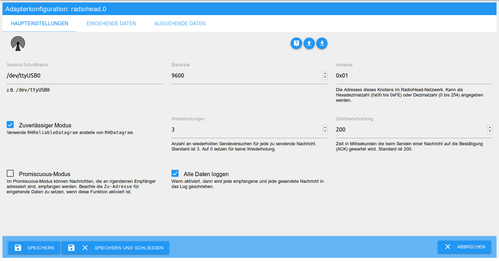
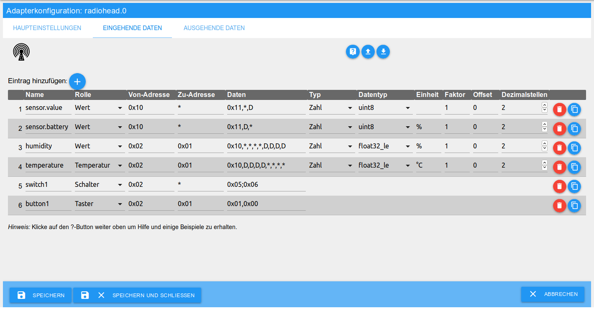
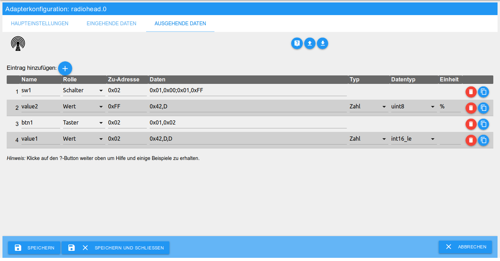

# ioBroker.radiohead

адаптер`radiohead` Обеспечивает подключение сети RadioHead к ioBroker.

Связь осуществляется через последовательный интерфейс. Небольшой микропроцессор (например, Arduino nano) может использоваться в качестве шлюза для подключения беспроводного оборудования.

[RadioHead](http://www.airspayce.com/mikem/arduino/RadioHead/) — это библиотека модулей пакетной радиосвязи с открытым исходным кодом для микропроцессоров. Она обеспечивает адресованные, надежные, повторно передаваемые и подтвержденные сообщения переменной длины.

## Функции

- Получение сообщений/команд от других узлов в сети RadioHead.
- Отправка сообщений/команд другим узлам в сети RadioHead.
- Объекты, настраиваемые индивидуально для входящих и исходящих данных.
- Возможность отправлять сообщения RadioHead с помощью скриптов.
- Возможность анализировать полученные сообщения RadioHead с помощью скриптов.

Если через последовательный интерфейс поступает сообщение, соответствующее шаблону объекта в входящих данных, адаптер извлекает из него данные и записывает их в состояние объекта.

Для отправки данных, они просто записываются в состояние настроенного объекта исходящих данных, после чего адаптер отправляет данные в соответствии с заданным шаблоном.

## установка

Адаптер доступен в _стабильном_ репозитории и, следовательно, может быть установлен обычным способом через административный интерфейс или командную строку.

В качестве альтернативы, любую существующую предварительную версию можно получить через _последний_ репозиторий или по URL-адресу.`https://github.com/crycode-de/ioBroker.radiohead.git` установить.

## конфигурация

Окно настроек состоит из трех вкладок:

- Основные настройки
- Входящие данные
- Исходящие данные

### Основные настройки



#### Последовательный интерфейс

Последовательный интерфейс, через который осуществляется связь между устройствами RadioHead.

Примеры:

- `/dev/ttyUSB0` (Linux)
- `COM1` (Windows)

#### скорость передачи данных

Скорость передачи данных (бод), с которой осуществляется обмен данными. Она должна быть одинаковой для всех узлов в сети RadioHead.

Стандарт —`9600` .

#### адрес

Адрес адаптера ioBroker в сети RadioHead.

Может быть выражено в шестнадцатеричном формате (`0x00` до`0xFE` ) или десятичное число (`0` до`254` Необходимо указать ). Использование`0xFF` (или`255` ) это невозможно, так как это широковещательный адрес.

#### Надежный режим

В надежном режиме от получателя ожидается подтверждение (ACK) для каждого отправленного сообщения. Если сообщение не подтверждено в течение установленного времени, оно отправляется повторно.

При активации`RHReliableDatagram` вместо`RHDatagram` Используется компанией RadioHead.

#### Повторения

Количество повторных попыток отправки каждого сообщения, если подтверждение не получено.

Стандарт —`3` . На`0` Установите параметр "без повторений".

#### Тайм-аут

Время в миллисекундах, затраченное на ожидание подтверждения (ACK) при отправке сообщения.

Стандарт —`200` .

#### беспорядочный режим

В режиме "неразборчиво" можно получать сообщения, адресованные любому получателю.

При включении этой функции адрес назначения для входящих данных должен быть указан корректно.

#### Зарегистрируйте все данные

Если эта функция включена, каждое полученное и каждое отправленное сообщение будет записываться в журнал.

### Входящие данные



#### имя

Имя объекта ioBroker. Должно быть уникальным для входящих данных экземпляра адаптера.

Группы можно формировать, используя точки в именах.

Для каждой записи данных создается объект в соответствии с заданным шаблоном.`radiohead.<instanz>.data.in.<name>` созданный.

#### роль

Роль данных важна для обработки полученных данных.

Переключатели, кнопки и индикаторы оцениваются как значения истинности. Для всех остальных функций из полученных данных извлекаются и оцениваются числовые значения.

#### От адреса

Адрес отправителя в сети RadioHead.

Может быть выражено в шестнадцатеричном формате (`0x00` до`0xFE` ) или десятичное число (`0` до`254` ) можно указать. Также можно указать`*` Может использоваться для любого адреса отправителя.

#### Для решения

Адрес получателя в сети RadioHead.

Может быть выражено в шестнадцатеричном формате (`0x00` до`0xFF` ) или десятичное число (`0` до`255` ) можно указать. Также можно указать`*` Может использоваться для любого адреса.

_Примечание:_ Без включенного режима promiscuous сообщения могут отправляться только на собственный адрес пользователя и на широковещательный адрес.`0xFF` (или`255` ) будет получено.

#### Данные

Это данные полученного сообщения в виде отдельных байтов, разделенных запятыми. Эти данные используются для анализа и обработки полученного сообщения.

Байты могут быть представлены в виде шестнадцатеричного числа (`0x00` до`0xFF` ) или десятичное число (`0` до`255` ) может быть указан. Заполнитель для любого байта может быть`*` быть использован.

Байты данных, которые необходимо извлечь из полученного значения, определяются большим числом.`D` Пометить их, чтобы данные можно было распознать в процессе обработки. Количество последовательных`D` Количество байтов зависит от выбранного типа данных.

**Особый случай: Переключатель и индикатор:**

Переключатели и индикаторы могут указывать две группы байтов данных, разделенных точкой с запятой. Первая группа предназначена для`true` -значение и второе для`false` -Значение. Если указана только одна группа, текущее состояние меняется при получении.

**Примеры:**

- Фиксированный байт`0x10` 32-битное число с плавающей запятой, 4 произвольных байта:`0x01,D,D,D,D,*,*,*,*`
- Для одной кнопки требуется два фиксированных байта:`0x01,0x00`
- Две группы, каждая с одним байтом для переключателя:`0x05;0x06`

#### тип

Это тип данных в ioBroker. Вы можете выбрать между _числом_ и _логическим значением (Boolean_ ). В случае с логическим значением полученное значение преобразуется в логическое значение.`true` или`false` ) преобразовано.

#### Тип данных

Тип данных определяет тип получаемых данных и, следовательно, метод чтения байтов данных.

См. [Типы данных](#datentypen) .

#### Единица

Единица измерения соответствующего значения в ioBroker.

#### Фактор и компенсация

Множитель, на который умножается полученное значение, и добавленное смещение.

`Wert = (Wert * Faktor) + Offset`

#### Десятичные знаки

Количество десятичных знаков, до которых округляется полученное значение (после вычисления с коэффициентом и смещением).

### Исходящие данные



#### имя

Имя объекта ioBroker. Должно быть уникальным для исходящих данных экземпляра адаптера.

Группы можно формировать, используя точки в именах.

Для каждой записи данных создается объект в соответствии с заданным шаблоном.`radiohead.<instanz>.data.out.<name>` созданный.

#### роль

Роль данных важна для обработки передаваемых данных.

Переключатели, кнопки и индикаторы передаются в виде логических значений (Boolean). Для всех остальных ролей в передаваемые данные встраиваются числовые значения.

#### Для решения

Адрес получателя в сети RadioHead.

Может быть выражено в шестнадцатеричном формате (`0x00` до`0xFF` ) или десятичное число (`0` до`255` Необходимо указать ).

Адрес для широковещательных сообщений всем узлам: ...`0xFF` (или`255` использовать.

#### Данные

Это данные для отправляемого сообщения, представленные в виде отдельных байтов, разделенных запятыми. Эти данные используются для формирования отправляемого сообщения.

Байты могут быть представлены в виде шестнадцатеричного числа (`0x00` до`0xFF` ) или десятичное число (`0` до`255` Необходимо указать ).

Байты, в которые должны быть вставлены отправляемые данные, разделены большим символом.`D` отметить. Количество последовательных`D` Количество байтов зависит от выбранного типа данных.

**Особый случай: Переключатель и индикатор:**

Переключатели и индикаторы могут указывать две группы байтов данных, разделенных точкой с запятой. Первая группа предназначена для`true` -значение и второе для`false` -Значение. Если указана только одна группа, будет отправлена именно эта группа.

**Примеры:**

- Фиксированный байт`0x42` 16-битное целое число:`0x42,D,D`
- Для одной кнопки требуется два фиксированных байта:`0x01,0x02`
- Для переключателя используются две группы по два байта в каждой:`0x01,0x00;0x01,0xFF`

#### тип

Это тип данных в ioBroker. Вы можете выбрать между _числом_ и _логическим значением (Boolean)_ . В случае логического значения отправляемое значение выражается следующим образом...`0x01` (`true` ) или`0x00` (`false` ) преобразовано.

#### Тип данных

Тип данных определяет тип передаваемых данных, а следовательно, и метод записи их в байты данных.

См. [Типы данных](#datentypen) .

#### Единица

Единица измерения соответствующего значения в ioBroker.

## Типы данных

При приеме и отправке данных доступны следующие типы данных:

| Тип данных                   | Описание                            | диапазон значений                                 | Байты данных |
| ---------------------------- | ----------------------------------- | ------------------------------------------------- | ------------ |
| `int8`                       | Знаковое 8-битное целое число       | -128 до 127                                       | 1            |
| `uint8`                      | Беззнаковое 8-битное целое число    | от 0 до 255                                       | 1            |
| `int16_le` ,`int16_be`       | 16-битное знаковое целое число      | от 0 до 32767                                     | 2            |
| `uint16_le` ,`uint16_be`     | 16-битное беззнаковое целое число   | от 0 до 65535                                     | 2            |
| `int32_le` ,`int32_be`       | 32-битное знаковое целое число      | от 0 до 4294967295                                | 4            |
| `uint32_le` ,`uint32_be`     | 32-битное беззнаковое целое число   | от 0 до 4294967295                                | 4            |
| `float32_le` ,`float32_be`   | 32-битное число с плавающей запятой | От -3,4E+38 до +3,4E+38, 7 знаков после запятой   | 4            |
| `double64_le` ,`double64_be` | 64-битное число с плавающей запятой | от -1,7E+308 до +1,7E+30, 16 знаков после запятой | 8            |

Концовки`_le` и`_be` Эти термины обозначают порядок байтов (эндианность) для типов данных, содержащих более одного байта. Это зависит от того, как принимающая система отправляет или обрабатывает данные.

- `_le` - _little-endian_ : младший байт первым
- `_be` - _big-endian_ : старший байт первым

## Использовать в скриптах

С помощью скриптов можно отправлять сообщения RadioHead и обрабатывать полученные сообщения.

### Отправка с помощью скрипта

Для отправки через скрипт можно использовать эту функцию.`sendTo` быть использован.

**Пример:**

```js
sendTo('radiohead.0', 'send', {
    to: 0x02, // Zu-Adresse
    data: [0x01,0x02,255] // zu sendende Daten-Bytes als Array oder Buffer
}, (ret) => {
    log('ret: ' + JSON.stringify(ret));
    // -> ret: {}
    if (ret.error) {
        log('error sending message', 'warn');
    }
});
```

Если сообщение не было успешно отправлено, то`ret.error` Была обнаружена соответствующая ошибка.

### Оценка полученных сообщений с помощью скрипта.

С каждым полученным сообщением объект`radiohead.<instanz>.data.incoming` Значение обновляется и устанавливается в объект с полученными данными. Затем это изменение может быть соответствующим образом оценено.

**Пример:**

```js
on({id: "radiohead.0.data.incoming", change:'any'}, (obj) => {
    log('incoming changed: ' + JSON.stringify(obj.state.val));
    // -> incoming changed: {"data":[1,0],"length":2,"headerTo":1,"headerFrom":2,"headerId":47,"headerFlags":0}
});
```

## Информация об адаптере

Каждый экземпляр адаптера предоставляет следующую информацию:

| объект                    | Описание                                                             |
| ------------------------- | -------------------------------------------------------------------- |
| info.connection           | Индикатор подключения адаптера к последовательному интерфейсу.       |
| info.lastReceived         | Время получения последнего сообщения от RadioHead                    |
| info.lastSentOk           | Время, когда было успешно отправлено последнее сообщение RadioHead.  |
| info.lastSentError        | Время, когда было ошибочно отправлено последнее сообщение RadioHead. |
| info.receivedCount        | Количество полученных сообщений RadioHead                            |
| info.retransmissionsCount | Количество повторных попыток отправки сообщений                      |
| info.sentErrorCount       | Количество ошибочно отправленных сообщений                           |
| info.sentOkCount          | Количество успешно отправленных сообщений                            |

При необходимости счетчики сообщений можно отрегулировать, записав данные в объект.`actions.resetCounters` обнулить.

## Changelog
<!--
    Placeholder for the next version (at the beginning of the line):
    ### **WORK IN PROGRESS**
-->
### 1.4.0 (2025-11-01)

* (crycode-de) Node.js >= 20, js-controller >= 6.0.11, Admin >= 7.6.17 required
* (crycode-de) Updated to latest ioBroker adapter toolset
* (crycode-de) Updated dependencies and fixed resulting issues
* (crycode-de) Updated Sentry DSN

### 1.3.0 (2022-01-07)

* (crycode-de) Handling of serial port close events
* (crycode-de) Try to reinitialize the serial port on close/errors
* (crycode-de) Fixed spelling of indicator role
* (crycode-de) Log messages now starts with an uppercase letter
* (crycode-de) Debug log RHS version on adapter startup
* (crycode-de) Some internal refracturing
* (crycode-de) Updated dependencies

### 1.2.0 (2021-09-17)

* (crycode-de) Use stringified json for data.incoming state

### 1.1.1 (2021-01-09)

* (crycode-de) Small fixes
* (crycode-de) Updated dependencies

### 1.1.0 (2020-12-23)

* (crycode-de) Added Sentry error reporting
* (crycode-de) Updated dependencies
* (crycode-de) Compatibility with Node.js 14.x
* (crycode-de) Optimized npm package

### 1.0.7 (2020-06-01)

* (crycode-de) Fixed bug on deleting incoming data entries.

### 1.0.5 (2020-04-14)

* (crycode-de) Fixed bug in grouping in/out data.
* (crycode-de) Added missing translations.
* (crycode-de) Fixed bug with promiscuous mode.
* (crycode-de) Updated dependencies.

### 1.0.4 (2020-02-03)

* (crycode-de) Updated connectionType and dataSource in io-package.json.

### 1.0.3 (2020-01-23)

* (crycode-de) Better handling of changed objects in admin.
* (crycode-de) Added `connectionType` in `io-package.json` and updated dependencies.

### 1.0.2 (2019-09-08)

* (crycode-de) dependency updates and bugfixes

### 1.0.1 (2019-07-30)

* (crycode-de) license  update

### 1.0.0 (2019-07-28)

* (crycode-de) initial release

## License

GNU General Public License Version 2

Copyright (c) 2019-2026 Peter Müller <peter@crycode.de>

See [LICENSE](./LICENSE) for details.