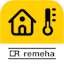

# IoBroker.remeha-home

Этот адаптер использует службу `Sentry.io` для автоматического сообщения мне как разработчику об исключениях, ошибках кода и новых схемах устройств. Подробнее см. ниже!

---

## Поддержка разработки адаптера
**Если вам нравится ioBroker.remeha-home, пожалуйста, рассмотрите возможность сделать пожертвование:**

---

## Адаптер Remeha Home для ioBroker
---

## Описание
Адаптер ioBroker.remeha-home позволяет интегрировать и контролировать системы отопления Remeha через [Платформа Remeha Home](https://www.remeha.de/produkte/speicher-und-zubehoer/regelungen/home-app). Адаптер постоянно подключается к API Remeha Home и извлекает текущие данные, чтобы сделать их доступными в системе ioBroker. Это позволяет оптимально контролировать и управлять системой отопления.

## Функции
* Извлечение данных: Постоянное извлечение данных об отоплении, таких как температура в помещении, температура наружного воздуха, состояние отопления и т. д.
* Режим управления зоной: включение и выключение зон отопления (например, для разных комнат или этажей).
* Установка целевой температуры: установка желаемой температуры в помещении для разных зон.
* Переключение режима камина: активация режима камина для регулировки нагрева внешних источников тепла, таких как камин.

## Конфигурация адаптера
Настройка адаптера очень проста.
Требуется только имя пользователя (адрес электронной почты) и пароль учетной записи Remeha Home.

Их необходимо ввести в конфигурацию адаптера.

---

## Changelog
<!-- ### **WORK IN PROGRESS** -->
### 1.0.4 (2025-03-07)
* (simatec) Fix Post Update

### 1.0.3 (2025-03-07)
* (simatec) Fix Post Update

### 1.0.2 (2025-03-06)
* (simatec) Code Fix
* (simatec) eslint Fix

### 1.0.1 (2025-03-04)
* (simatec) Code clean
* (simatec) Dependencies updated

### 1.0.0 (2025-03-02)
* (simatec) Fix Update Settings
* (simatec) Rewrite in Typescript

### 0.2.8 (2025-02-22)
* (simatec) Dependencies updated
* (simatec) small Fix

### 0.2.7 (2025-01-09)
* (simatec) Fix Update Intervall

### 0.2.6 (2025-01-09)
* (simatec) eslint-config fix
* (simatec) Dependencies updated
* (simatec) Update License

### 0.2.5 (2024-11-27)
* (simatec) Dependencies updated
* (simatec) Fix jsonConfig
* (simatec) Issue Action added
* (simatec) eslint-config added

### 0.2.4 (2024-09-28)
* (simatec) Fix request error
* (simatec) Dependencies updated

### 0.2.3 (2024-09-26)
* (simatec) Fix jsonConfig
* (simatec) Fix for Admin 7.1.5

### 0.2.2 (2024-09-19)
* (simatec) small State Fix

### 0.2.1 (2024-09-18)
* (simatec) States Fix
* (simatec) Readme Fix
* (simatec) Test & Release Fix

### 0.2.0 (2024-09-16)
* (simatec) Translation Fix
* (simatec) Code cleaning
* (simatec) Ready for Betatest

### 0.1.3 (2024-09-12)
* (simatec) Fix Zonemode
* (simatec) Translation added

### 0.1.2 (2024-09-11)
* (simatec) Fix Zonemode

### 0.1.1 (2024-09-10)
* (simatec) Fix Release Script

### 0.1.0 (2024-09-10)
* (simatec) First Beta

### 0.0.1 (2024-09-09)
* (simatec) First Commit
---

## License

MIT License

Copyright (c) 2024 - 2025 simatec

Permission is hereby granted, free of charge, to any person obtaining a copy
of this software and associated documentation files (the "Software"), to deal
in the Software without restriction, including without limitation the rights
to use, copy, modify, merge, publish, distribute, sublicense, and/or sell
copies of the Software, and to permit persons to whom the Software is
furnished to do so, subject to the following conditions:

The above copyright notice and this permission notice shall be included in all
copies or substantial portions of the Software.

THE SOFTWARE IS PROVIDED "AS IS", WITHOUT WARRANTY OF ANY KIND, EXPRESS OR
IMPLIED, INCLUDING BUT NOT LIMITED TO THE WARRANTIES OF MERCHANTABILITY,
FITNESS FOR A PARTICULAR PURPOSE AND NONINFRINGEMENT. IN NO EVENT SHALL THE
AUTHORS OR COPYRIGHT HOLDERS BE LIABLE FOR ANY CLAIM, DAMAGES OR OTHER
LIABILITY, WHETHER IN AN ACTION OF CONTRACT, TORT OR OTHERWISE, ARISING FROM,
OUT OF OR IN CONNECTION WITH THE SOFTWARE OR THE USE OR OTHER DEALINGS IN THE
SOFTWARE.