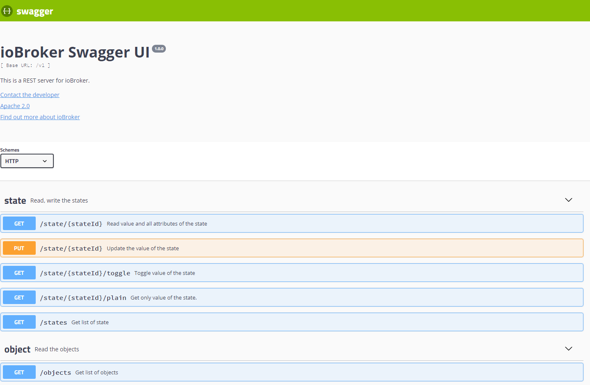

# Адаптер REST-API
**Этот адаптер использует библиотеки Sentry для автоматического сообщения разработчикам об исключениях и ошибках в коде.** Для получения более подробной информации и сведений о том, как отключить отправку сообщений об ошибках, см. [Документация по плагину Sentry](https://github.com/ioBroker/plugin-sentry#plugin-sentry)! Отправка сообщений Sentry используется начиная с js-controller 3.0.

Это RESTful-интерфейс для чтения объектов и состояний из ioBroker, а также для записи/управления состояниями посредством HTTP-запросов Get/Post.

Назначение этого адаптера аналогично simple-api. Но этот адаптер поддерживает длительное опросное время (long-polling) и URL-хуки для подписки.

Он имеет удобный веб-интерфейс для работы с запросами:



## Использование
Вызовите в браузере `http://ipaddress:8093/` и используйте Swagger UI для запроса и изменения состояний и объектов.

Примеры запросов:

- `http://ipaddress:8093/v1/state/system.adapter.rest-api.0.memHeapTotal` - чтение состояния в формате JSON
- `http://ipaddress:8093/v1/state/system.adapter.rest-api.0.memHeapTotal/plain` - чтение состояния как строки (только значение)
- `http://ipaddress:8093/v1/state/system.adapter.rest-api.0.memHeapTotal?value=5` - запись состояния с помощью GET (только для обратной совместимости с simple-api)
- `http://ipaddress:8093/v1/sendto/javascript.0?message=toScript&data={"message":"MESSAGE","data":"FROM REST-API"}` - отправить сообщение на `javascript.0` в скрипте `scriptName`

### Аутентификация
Для включения аутентификации необходимо установить параметр `Authentication` в диалоговом окне конфигурации.

Поддерживаются три типа аутентификации:

- Учетные данные в запросе
— Базовая аутентификация
- OAuth2 (Bearer)

Для аутентификации в запросе необходимо установить параметры `user` и `pass` следующим образом:

```http
http://ipaddress:8093/v1/state/system.adapter.rest-api.0.memHeapTotal?user=admin&pass=admin
```

Для базовой аутентификации необходимо установить заголовок `Authorization` со значением `Basic base64(user:pass)`.

Для аутентификации OAuth2 необходимо установить заголовок `Authorization` со значением `Bearer <AccessToken>`.

Токен доступа можно получить с помощью HTTP-запроса следующего вида:

```http
http://ipaddress:8093/oauth/token?grant_type=password&username=<user>&password=<password>&client_id=ioBroker
```

Ответ выглядит так:

```json
{
    "access_token": "21f89e3eee32d3af08a71c1cc44ec72e0e3014a9",
    "expires_in": "2025-02-23T11:39:32.208Z",
    "refresh_token": "66d35faa5d53ca8242cfe57367210e76b7ffded7",
    "refresh_token_expires_in": "2025-03-25T10:39:32.208Z",
    "token_type": "Bearer"
}
```

## Подписка на изменения состояния или объекта
Ваше приложение может получать уведомления о каждом изменении состояния или объекта.

Для этого ваше приложение должно предоставлять конечную точку HTTP(S) для приема обновлений.

Пример на Node.js см. здесь [demoNodeClient.js](examples/demoNodeClient.js)

## Долгосрочный опрос
Этот адаптер поддерживает подписку на изменения данных посредством длительного опроса (long polling).

Пример для браузера можно найти здесь: [demoNodeClient.js](examples/demoBrowserClient.html)

## Веб-расширение
Этот адаптер может работать как веб-расширение. В этом случае путь к нему доступен по адресу `http://ipaddress:8082/rest-api/`

## Уведомление
— Метод `POST` всегда используется для создания ресурса (неважно, был ли он продублирован).
— Параметр `PUT` используется для проверки существования ресурса: если ресурс существует, то обновить его, в противном случае создать новый ресурс.
— `PATCH` всегда используется для обновления ресурса.

## Команды
Кроме того, вы можете выполнять множество команд сокета через специальный интерфейс:

`http://ipaddress:8093/v1/command/<commandName>?arg1=Value2&arg2=Value2`

Например.

- `http://ipaddress:8093/v1/command/getState?id=system.adapter.admin.0.alive` - для чтения состояния `system.adapter.admin.0.alive`
- `http://ipaddress:8093/v1/command/readFile?adapter=admin.admin&fileName=admin.png` - для чтения файла `admin.admin/admin.png` в формате JSON.
- `http://ipaddress:8093/v1/command/readFile?adapter=admin.admin&fileName=admin.png?binary` - для чтения файла `admin.admin/admin.png` как файла
- `http://ipaddress:8093/v1/command/extendObject?id=system.adapter.admin.0?obj={"common":{"enabled":true}}` - для перезапуска административной панели

Вы также можете отправлять все команды методом POST. Тело запроса должно быть объектом с параметрами. Например:

```bash
curl --location --request POST 'http://ipaddress:8093/v1/command/sendTo' \
--header 'Content-Type: application/json' \
--data-raw '{
"adapterInstance": "history.0",
"command": "getHistory",
"message": {"id": "system.adapter.admin.0.memRss","options": {"aggregate": "onchange", "addId": true}}
}'
```

Вы не можете отправлять POST-запросы командам через графический интерфейс.

<!-- НАЧАЛО -->

### Штаты
- `getStates(pattern)` - получить список состояний для заданного шаблона (например, для system.adapter.admin.0.*). Визуализация результата в графическом интерфейсе может вызывать проблемы.
- `getForeignStates(pattern)` - то же самое, что и getStates
- `getState(id)` - получить значение состояния по ID
- `setState(id, state)` - устанавливает значение состояния с помощью объекта JSON (например, `{"val": 1, "ack": true}`)
- `getBinaryState(id)` - получить двоичное состояние по ID
- `setBinaryState(id, base64)` - установка бинарного состояния по ID

### Объекты
- `getObject(id)` - получить объект по ID
- `getObjects(list)` - получить все состояния и комнаты. Визуализация результата в графическом интерфейсе может вызвать проблемы.
- `getObjectView(design, search, params)` - получить конкретные объекты, например, design=system, search=state, params=`{"startkey": "system.adapter.admin.", "endkey": "system.adapter.admin.\u9999"}`
- `setObject(id, obj)` - устанавливает объект с помощью JSON-объекта (например, `{"common": {"type": "boolean"}, "native": {}, "type": "state"}`)
- `delObject(id, options)` - удалить объект по ID

### Файлы
- `readFile(adapter, fileName)` - чтение файла, например, adapter=vis.0, fileName=main/vis-views.json. Кроме того, вы можете установить параметр binary=true в запросе, чтобы получить ответ в виде файла, а не в формате JSON.
- `readFile64(adapter, fileName)` - чтение файла как строки base64, например, adapter=vis.0, fileName=main/vis-views.json. Кроме того, вы можете установить параметр binary=true в запросе, чтобы получить ответ в виде файла, а не в формате JSON.
- `writeFile64(adapter, fileName, data64, options)` - запись файла, например, adapter=vis.0, fileName=main/vis-test.json, data64=eyJhIjogMX0=
- `unlink(adapter, name)` - удалить файл или папку
- `deleteFile(adapter, name)` - удалить файл
- `deleteFolder(adapter, name)` - удалить папку
- `renameFile(adapter, oldName, newName)` - переименовать файл
- `rename(adapter, oldName, newName)` - переименовать файл или папку
- `mkdir(adapter, dirName)` - создать папку
- `readDir(adapter, dirName, options)` - чтение содержимого папки
- `chmodFile(adapter, fileName, options)` - изменить режим доступа к файлу. Например: adapter=vis.0, fileName=main/*, options = `{"mode": 0x644}`
- `chownFile(adapter, fileName, options)` - изменить владельца файла. Например: adapter=vis.0, fileName=main/*, options = `{"owner": "newOwner", "ownerGroup": "newgroup"}`
- `fileExists(adapter, fileName)` - проверка существования файла

### Администраторы
- `getHostByIp(ip)` - считывает информацию о хосте по IP-адресу. Например, по localhost
- `readLogs(host)` - чтение имени файла и размера файлов журналов. Вы можете прочитать их по адресу http://ipaddress:8093/<fileName>
- `delState(id)` - удаляет состояние и объект. Аналогично delObject.
- `getRatings(update)` - чтение рейтингов адаптера (как в административной панели)
- `getCurrentInstance()` - чтение пространства имен адаптера (всегда rest-api.0)
- `decrypt(encryptedText)` - расшифровка строки с использованием системного секрета
- `encrypt(plainText)` - шифрует строку с помощью системного секрета
- `getAdapters(adapterName)` - получает объекты типа "adapter". При желании можно указать adapterName.
- `updateLicenses(login, password)` - чтение лицензий с портала ioBroker.net
- `getCompactInstances()` - считывает список экземпляров с краткой информацией.
- `getCompactAdapters()` - считывает список установленных адаптеров с краткой информацией.
- `getCompactInstalled(host)` - считывает краткую информацию об установленных адаптерах
- `getCompactSystemConfig()` - краткое описание конфигурации системы
- `getCompactSystemRepositories()`
- `getCompactRepository(host)` - прочитать краткое описание репозитория
- `getCompactHosts()` - получить краткую информацию о хостах
- `addUser(user, pass)` - добавить нового пользователя
- `delUser(user)` - удалить пользователя
- `addGroup(group, desc, acl)` - создать новую группу
- `delGroup(group)` - удалить группу
- `changePassword(user, pass)` - изменить пароль пользователя
- `getAllObjects()` - считывает все объекты как список. В графическом интерфейсе пользователя могут возникнуть проблемы с визуализацией результата.
- `extendObject(id, obj)` - изменение объекта по ID с использованием JSON. (например, `{"common":{"enabled": true}}`)
- `getForeignObjects(pattern, type)` - то же самое, что и getObjects
- `delObjects(id, options)` - удаление объектов по шаблону

Другие
- `updateTokenExpiration(accessToken)`
- `log(text, level[info])` - нет ответа - добавить запись в лог ioBroker
- `checkFeatureSupported(feature)` - проверяет, поддерживается ли функция контроллером js.
- `getHistory(id, options)` - чтение истории. См. информацию о параметрах: https://github.com/ioBroker/ioBroker.history/blob/master/docs/en/README.md#access-values-from-javascript-adapter
- `httpGet(url)` - чтение URL-адреса с сервера. Вы можете установить binary=true, чтобы получить ответ в виде файла.
- `sendTo(adapterInstance, command, message)` - отправить команду экземпляру. Например: adapterInstance=history.0, command=getHistory, message=`{"id": "system.adapter.admin.0.memRss","options": {"aggregate": "onchange", "addId": true}}`
- `listPermissions()` - чтение статической информации с правами доступа функции.
- `getUserPermissions()` - чтение объекта с правами пользователя.
- `getVersion()` - чтение имени и версии адаптера
- `getAdapterName()` - чтение имени адаптера (всегда REST API)
- `clientSubscribe(targetInstance, messageType, data)`
- `getAdapterInstances(adapterName)` - получает объекты типа "instance". При желании можно указать adapterName.

<!-- КОНЕЦ -->

<!-- Заполнитель для следующей версии (в начале строки):

### **РАБОТА В ПРОЦЕССЕ** -->

## Changelog
### 4.0.2 (2026-06-14)
* (@GermanBluefox) Packages were updated
* (@GermanBluefox) Allowed to define the response content type by sendTo queries
* (@GermanBluefox) Corrected some minor issues

### 4.0.1 (2026-02-17)
* (@GermanBluefox) Corrected some minor issues

### 4.0.0 (2026-02-17)
* (@GermanBluefox) Packages were updated
* (@GermanBluefox) Drop Node.js 18 support

### 3.1.3 (2026-01-19)
* (@GermanBluefox) Caught a seldom race condition on the connection close

### 3.1.1 (2025-10-09)
* (@GermanBluefox) corrected a web extension path

### 3.1.0 (2025-10-05)
* (@copilot, @SimonFischer04) Fix running as web extension, own implementation of unmaintained swagger-node-runner-fork, 
* (@SimonFischer04) remove 18 and add node 24 to tests
* (@SimonFischer04) multiple null error fixes and wrong swagger schema #151
* (@GermanBluefox) updated packages

### 3.0.1 (2025-05-21)
* (@GermanBluefox) Corrected the web extension

### 3.0.0 (2025-04-27)
* (@GermanBluefox) Rewritten in TypeScript
* (@GermanBluefox) Removed binary states

### 2.1.0 (2025-02-27)
* (@GermanBluefox) Added OAuth2 support
* (@GermanBluefox) Updated packages
* (@GermanBluefox) Replaced icons with SVG

### 2.0.3 (2024-07-13)
* (jkuenemund) Changed response for the endpoint get states to the dictionary in swagger

### 2.0.1 (2024-05-23)
* (foxriver76) ported to `@iobroker/webserver`
* (theshengfui) Fixed history requests
* (bluefox) Minimum required node.js version is 16

### 1.1.0 (2023-05-03)
* (bluefox) Converting of the setState values to the according type
* (bluefox) Implemented file operations

### 1.0.5 (2023-03-27)
* (Apollon77) Prepare for future js-controller versions

### 1.0.4 (2022-08-31)
* (bluefox) Check if the port is occupied only on defined interface

### 1.0.2 (2022-07-27)
* (bluefox) Implemented binary read/write operations

### 1.0.1 (2022-07-27)
* (bluefox) Increased the max size of body to 100Mb

### 1.0.0 (2022-05-19)
* (bluefox) Final release

### 0.6.0 (2022-05-18)
* (bluefox) Added sendTo path

### 0.5.0 (2022-05-17)
* (bluefox) Some access errors were corrected

### 0.4.0 (2022-04-26)
* (bluefox) Added socket commands

### 0.3.6 (2022-04-22)
* (bluefox) Added object creation and enumeration reading

### 0.3.5 (2022-04-22)
* (bluefox) Allowed the reading of current subscriptions

### 0.3.4 (2022-04-20)
* (bluefox) Corrected subscription

### 0.3.1 (2022-04-15)
* (bluefox) First release

### 0.1.0 (2017-09-14)
* (bluefox) initial commit

## License
Apache 2.0

Copyright (c) 2017-2026 bluefox <dogafox@gmail.com>