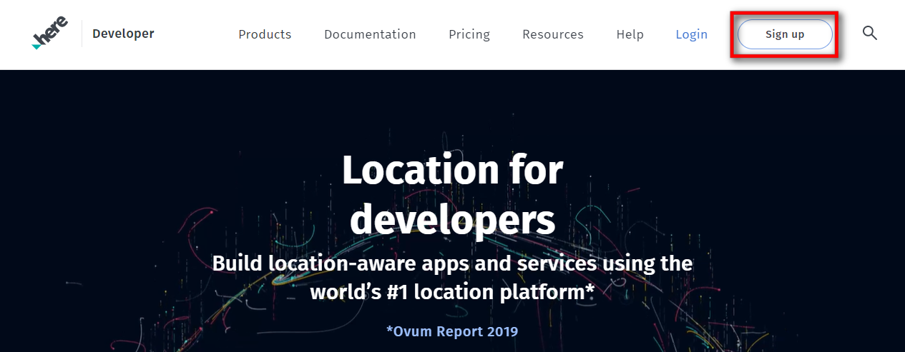
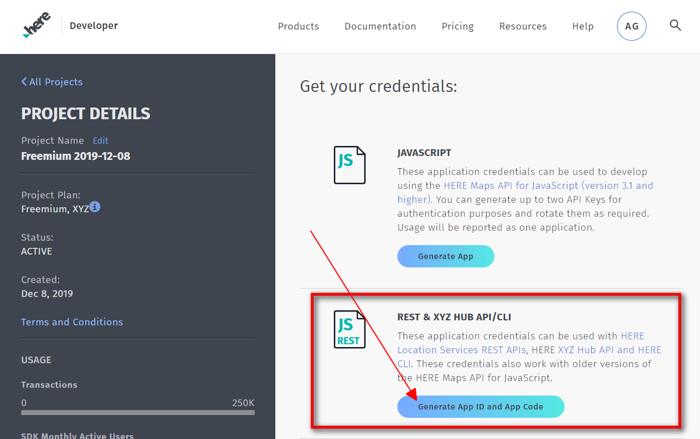
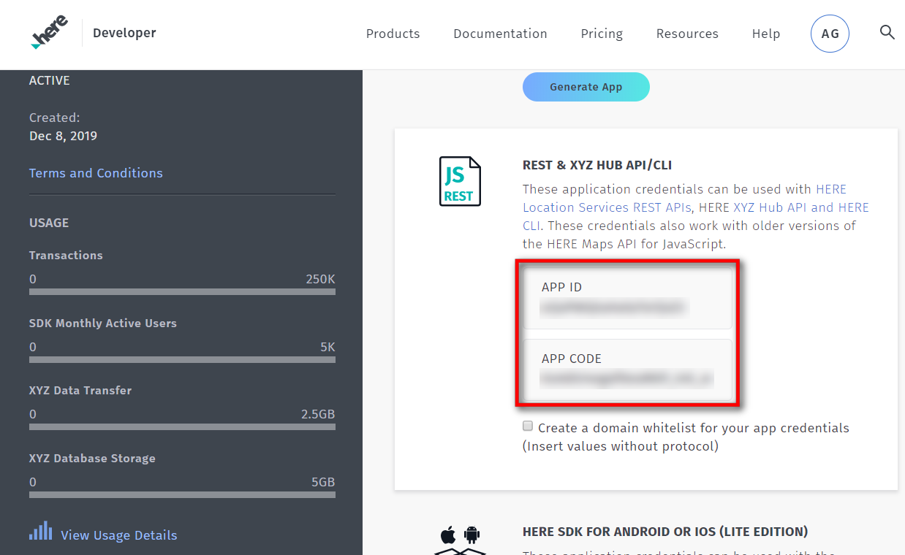

# IoBroker.roadtraffic
    **Версия:**     **Тесты:**    

<!--

## Sentry **Этот адаптер использует библиотеки Sentry для автоматического сообщения разработчикам об исключениях и ошибках кода.** Для получения более подробной информации и информации о том, как отключить отчеты об ошибках, см. [Документация плагина Sentry](https://github.com/ioBroker/plugin-sentry#plugin-sentry)! Отчеты Sentry используются начиная с js-controller 3.0.
-->
## Об этом адаптере
Этот адаптер использует API HERE.com для проверки трафика на ваших маршрутах. Вы можете настроить несколько маршрутов, и адаптер проверит фактическую дорожную ситуацию и покажет, сколько времени займет ваше путешествие.
У адаптера есть будильник — так что вы можете сообщить адаптеру, в какое время вам нужно быть на работе — и адаптер начнет воспроизводить радио и делать объявления на Alexa (требуется адаптер Alexa2) — или вы можете использовать свой собственный сценарий для реагирования на сигнализацию адаптера..

## Начиная
Итак, начнем:

1. Перейдите на https://developer.here.com/sign-up?create=Freemium-Basic&keepState=true&step=account и создайте бесплатную учетную запись разработчика HERE.com (Freemium).

2. Убедитесь, что выбран Freemium, и заполните форму слева. (Имя, Фамилия, адрес электронной почты и т. д.)

3. Нажмите «Зарегистрировать учетную запись ЗДЕСЬ»… и не забудьте поставить галочку («Согласиться с Условиями обслуживания и т. д.»).

4. Еще раз – соглашаемся с Условиями и нажимаем кнопку «Начать кодирование».

5. На следующей странице вы уже находитесь на своей панели управления HERE.com. Найдите раздел REST и нажмите «Создать приложение».

6. Нажмите «Создать ключ API» — вы получите ключ API. Откройте настройки экземпляра адаптера дорожного движения в ioBroker и вставьте ключ API в поле конфигурации.

7. Нажмите значок «Плюс» в настройках экземпляра и создайте свой первый маршрут.

После того, как вы ввели всю информацию в диалоговое окно конфигурации, нажмите «Сохранить и закрыть».
Теперь адаптер должен перезагрузиться, и вы готовы к работе!

## Будильник
В настройках экземпляра вы можете включить будильник, установив флажок «Включить функцию будильника».
У вас должен быть установлен адаптер Alexa2 и настроен на использование push-соединения в настройках экземпляра Alexa2.
Выберите устройство Alexa, которым вы хотите управлять с помощью адаптера, и введите идентификатор TuneIn StationID, который вы хотите воспроизводить при срабатывании будильника.
Громкость сигнала тревоги имеет диапазон от 0 до 100.
С помощью строки «Говорить» вы можете управлять объявлением Alexa.
По умолчанию: Guten Morgen %name. Bei aktueller Verkehrslage benötigst du %dur zur Arbeit.

Через 15 секунд после того, как Алекса начнет воспроизводить указанную станцию TuneIn, будет объявлена строка.
Например, если у вас есть маршрут с именем «Даниэль» и триггеры тревоги, Алекса скажет: Guten Morgen Daniel. Bei aktueller Verkehrslage benötigst du 29 Minuten zur Arbeit.

Оставьте строку «Произнести» пустой, если вы хотите, чтобы адаптер только начал воспроизведение TuneIn Station и не получал никаких объявлений.

Каждый маршрут имеет 7 каналов сигнализации (понедельник-воскресенье).
В каждом Канале у вас есть следующие состояния:

* Время прибытия: введите время, в которое вы хотите быть в пункте назначения (пример: 07:30 — половина восьмого утра).
* Время купания: введите время, которое вы хотите добавить к продолжительности поездки. (Пример: 45 — 45 минут. Допустим, вы установили время прибытия на 10:00, время купания на 30 минут, а текущая продолжительность путешествия — 1 час. Тогда адаптер сработает в 08:30 (время прибытия — время купания — продолжительность путешествия).
* включено: установите значение true, если вы хотите включить будильник на этот день.
* сработало: адаптер установит для этого состояния значение «истина» при срабатывании сигнализации. (Например, вы можете использовать его с собственными сценариями.) Состояние срабатывания будет сброшено на false в 00:00 соответствующего дня. (Триггер субботы будет установлен на значение «ложь» в субботу в 00:00).

## Кредиты
Адаптации кода для использования HERE v8 pi были предоставлены @icastillo15 <starwarsmalu@gmail.com>.

## Changelog
<!--
    Placeholder for the next version (at the beginning of the line):
    ### **WORK IN PROGRESS**
-->
### 1.1.1 (2023-11-28)
* (mcm1957) Role definitions have been corrected.

### 1.1.0 (2023-11-27)
* (icastillo15) Support for HERE v8 api protocoll has been added.
* (mcm1957) Dependencies have been updated.

### 1.0.2 (2023-10-27)
* (mcm1957) Error logging has been corrected.

### 1.0.1 (2023-10-26)
* (mcm1957) Issues reported by ioBroker adapter checker and lint have been fixed.

### 1.0.0 (2023-10-26)
* (mcm1957) This adapter has been moved into iobroker-community-organization.
* (mcm1957) Adapter requires nodejs 18.x or newer now.
* (mcm1957) Dependencies have been updated.

### 0.2.0 (2019-12-21)
* (BuZZy1337) Alarm-Clock implemented. (See Readme "Alarm-Clock" section for details)

### 0.1.1 (2019-12-13)
* (BuZZy1337) HERE.com changed the Authentication.
* (BuZZy1337) Prepare for Alarm.. (NOT WORKING YET!!! - But needed to push this version because of authentication changes)

### 0.1.0 (2019-12-08)
* (BuZZy1337) Using HERE.com instead of Google API (READ THE UPDATED README!!)

### 0.0.2 (2019-02-27)
* (BuZZy1337) Release to latest repository

### 0.0.1
* (BuZZy1337) initial release

## License
The MIT License (MIT)

Copyright (c) 2023 iobroker-community-adapters <mcm57@gmx.at>
Copyright (c) 2019 BuZZy1337 <buzzy1337@outlook.de>

Permission is hereby granted, free of charge, to any person obtaining a copy
of this software and associated documentation files (the "Software"), to deal
in the Software without restriction, including without limitation the rights
to use, copy, modify, merge, publish, distribute, sublicense, and/or sell
copies of the Software, and to permit persons to whom the Software is
furnished to do so, subject to the following conditions:

The above copyright notice and this permission notice shall be included in
all copies or substantial portions of the Software.

THE SOFTWARE IS PROVIDED "AS IS", WITHOUT WARRANTY OF ANY KIND, EXPRESS OR
IMPLIED, INCLUDING BUT NOT LIMITED TO THE WARRANTIES OF MERCHANTABILITY,
FITNESS FOR A PARTICULAR PURPOSE AND NONINFRINGEMENT. IN NO EVENT SHALL THE
AUTHORS OR COPYRIGHT HOLDERS BE LIABLE FOR ANY CLAIM, DAMAGES OR OTHER
LIABILITY, WHETHER IN AN ACTION OF CONTRACT, TORT OR OTHERWISE, ARISING FROM,
OUT OF OR IN CONNECTION WITH THE SOFTWARE OR THE USE OR OTHER DEALINGS IN
THE SOFTWARE.
