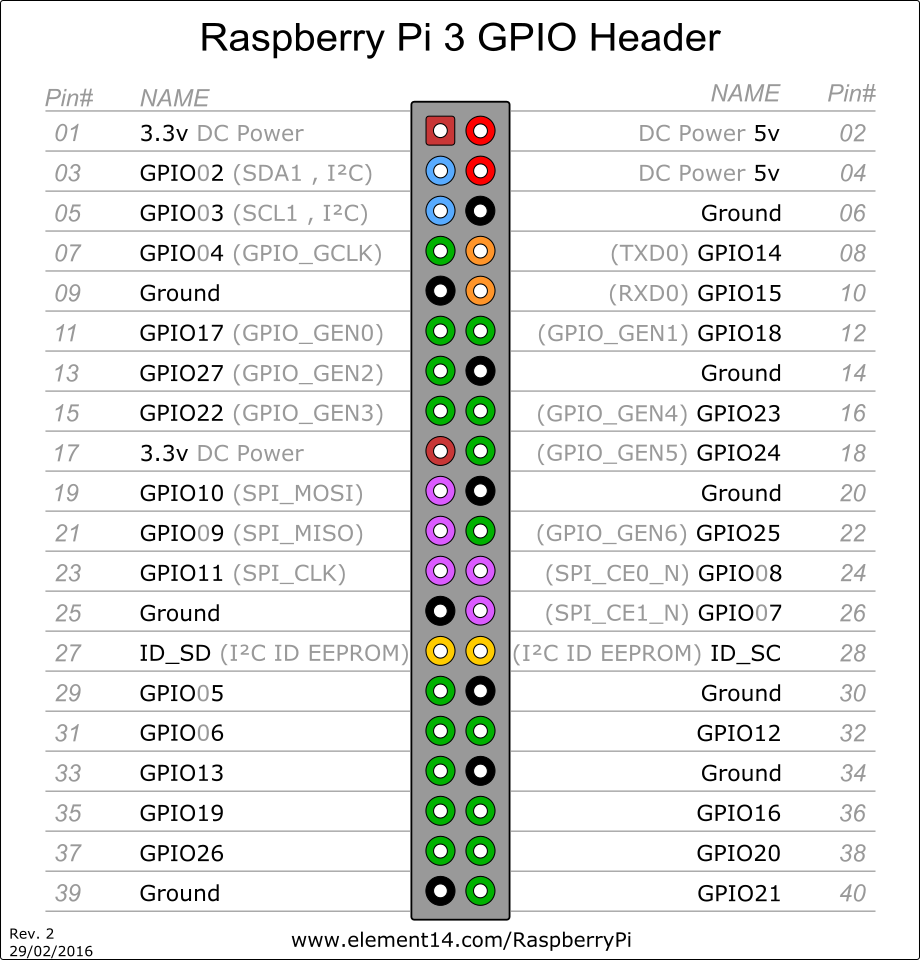

# ioBroker.rpi2


## Версии

Адаптер RPI-Monitor для ioBroker

Реализация RPI-Monitor для интеграции в ioBroker. Это та же реализация, что и для iobroker.rpi, но с использованием GPIO.

## Важная информация

**Для управления GPIO-портами ioBroker требуются специальные права доступа.** В большинстве дистрибутивов Linux это можно сделать, добавив пользователя ioBroker в список разрешений. `gpio` группа.

Для работы GPIO необходимо установить... `libgpiod` в версии `2.x` **Перед** установкой адаптера (см. ниже)!

> \[!ВНИМАНИЕ] Версия 3.xx этого адаптера поддерживает и требует Debian 13 / Trixie (ядро Linux 5.10 или новее). Не обновляйте, если вы используете более старую операционную систему.

## Установка

После установки вы можете настроить параметры монитора в параметрах экземпляра.

После начала `iobroker.rpi` При выборе всех модулей в Raspberry Pi создается дерево объектов в ioBroker.<instance> .<modulename> например `rpi.0.cpu`

Для работы адаптера требуются некоторые зависимости операционной системы. Обычно js-controller должен позаботиться об этом, но если у вас возникнут проблемы, пожалуйста, установите следующие пакеты вручную:

```bash
sudo apt update
sudo apt install -y build-essential python
sudo apt install -y libgpiod-dev
sudo apt install -y pkg-config
```

(третий необходим только в том случае, если вы хотите работать с GPIO) (последний необходим только в том случае, если вы хотите использовать датчики DHTxx/AM23xx)

### температура NVME

Начиная с версии адаптера 2.3.2, вы можете считывать температуру NVMe-накопителя. Для этого необходимо установить... `nvme-cli` пакет в вашей системе. Это можно сделать с помощью следующей команды: `sudo apt-get install nvme-cli` Вам также потребуется добавить эту команду в файл sudoers для ioBroker. `/etc/sudoers.d/iobroker` Откройте его с помощью редактора, например, nano: `sudo nano /etc/sudoers.d/iobroker` и добавьте в конец следующую строку:

`iobroker ALL=(ALL) NOPASSWD: /usr/sbin/nvme smart-log /dev/nvme0`

## GPIO

Вы также можете считывать данные с выводов GPIO и управлять ими. Все, что вам нужно сделать, это настроить параметры GPIO в параметрах (дополнительная вкладка).



После включения некоторых портов в дереве объектов появляются следующие состояния:

- rpi.0.gpio.PORT.state

Нумерация портов осуществляется по протоколу BCM (контакты BroadComm на микросхеме). Вы можете получить нумерацию с помощью... `gpio readall` Например, PI2:

```
+-----+-----+---------+------+---+---Pi 2---+---+------+---------+-----+-----+
| BCM | wPi |   Name  | Mode | V | Physical | V | Mode | Name    | wPi | BCM |
+-----+-----+---------+------+---+----++----+---+------+---------+-----+-----+
|     |     |    3.3v |      |   |  1 || 2  |   |      | 5v      |     |     |
|   2 |   8 |   SDA.1 | ALT0 | 1 |  3 || 4  |   |      | 5V      |     |     |
|   3 |   9 |   SCL.1 | ALT0 | 1 |  5 || 6  |   |      | 0v      |     |     |
|   4 |   7 | GPIO. 7 |   IN | 1 |  7 || 8  | 0 | IN   | TxD     | 15  | 14  |
|     |     |      0v |      |   |  9 || 10 | 1 | IN   | RxD     | 16  | 15  |
|  17 |   0 | GPIO. 0 |   IN | 0 | 11 || 12 | 0 | IN   | GPIO. 1 | 1   | 18  |
|  27 |   2 | GPIO. 2 |   IN | 0 | 13 || 14 |   |      | 0v      |     |     |
|  22 |   3 | GPIO. 3 |   IN | 0 | 15 || 16 | 0 | IN   | GPIO. 4 | 4   | 23  |
|     |     |    3.3v |      |   | 17 || 18 | 0 | IN   | GPIO. 5 | 5   | 24  |
|  10 |  12 |    MOSI |   IN | 0 | 19 || 20 |   |      | 0v      |     |     |
|   9 |  13 |    MISO |   IN | 0 | 21 || 22 | 1 | IN   | GPIO. 6 | 6   | 25  |
|  11 |  14 |    SCLK |   IN | 0 | 23 || 24 | 1 | IN   | CE0     | 10  | 8   |
|     |     |      0v |      |   | 25 || 26 | 1 | IN   | CE1     | 11  | 7   |
|   0 |  30 |   SDA.0 |   IN | 1 | 27 || 28 | 1 | IN   | SCL.0   | 31  | 1   |
|   5 |  21 | GPIO.21 |   IN | 1 | 29 || 30 |   |      | 0v      |     |     |
|   6 |  22 | GPIO.22 |   IN | 1 | 31 || 32 | 0 | IN   | GPIO.26 | 26  | 12  |
|  13 |  23 | GPIO.23 |   IN | 0 | 33 || 34 |   |      | 0v      |     |     |
|  19 |  24 | GPIO.24 |   IN | 0 | 35 || 36 | 0 | IN   | GPIO.27 | 27  | 16  |
|  26 |  25 | GPIO.25 |  OUT | 1 | 37 || 38 | 0 | IN   | GPIO.28 | 28  | 20  |
|     |     |      0v |      |   | 39 || 40 | 0 | IN   | GPIO.29 | 29  | 21  |
+-----+-----+---------+------+---+----++----+---+------+---------+-----+-----+
| BCM | wPi |   Name  | Mode | V | Physical | V | Mode | Name    | wPi | BCM |
+-----+-----+---------+------+---+---Pi 2---+---+------+---------+-----+-----+
```

## Датчики DHTxx/AM23xx

Вы можете считывать показания с датчиков температуры/влажности DHT11, DHT21 (AM2301), DHT22 и AM2302.

Подключите такой датчик к выводу GPIO, как описано на странице пакета [node-dht-sensor](https://www.npmjs.com/package/node-dht-sensor) . К нескольким выводам можно подключить _несколько_ датчиков (это _не_ шинная система), как обсуждалось ранее.

В таблице GPIO выберите `DHT11` для датчиков DHT11 и `DHT22/AM23xx` Для всех остальных датчиков введите интервал опроса в миллисекундах в столбец _«Отключение/Опрос»_ . Считывание показаний датчиков не может происходить чаще, чем каждые 2000 мс (DHT11: 1000 мс); при отсутствии значения адаптер опрашивает датчик каждые 30000 мс.

Адаптер считывает данные с датчика одним из двух способов и при запуске регистрирует, какой из них используется для каждого датчика.

### Драйвер ядра Linux (рекомендуется, работает на всех Raspberry Pi, включая Pi 5)

В Linux есть собственный драйвер для этих датчиков (он поддерживает как DHT11, DHT21, DHT22, так и AM2302). Для включения драйвера для каждого датчика добавьте соответствующую строку в файл конфигурации. `/boot/firmware/config.txt` (`/boot/config.txt` (на более старых системах) и перезагрузите систему:

```
dtoverlay=dht11,gpiopin=17
```

`gpiopin` Это номер GPIO (BCM), тот же, что и в таблице GPIO адаптера. Вы можете проверить его работоспособность с помощью... `cat /sys/bus/iio/devices/iio:device*/in_temp_input` (Значение указано в 1/1000 °C). Адаптер автоматически определяет драйвер и использует его, никаких дополнительных настроек не требуется.

### node-dht-sensor

Без драйвера ядра адаптер использует node-dht-sensor. На Raspberry Pi 1–4 он работает как есть.

На **Raspberry Pi 5** (а также Pi 500 и Compute Module 5) стандартная сборка node-dht-sensor не работает, поскольку она обращается к регистрам GPIO, которых нет у Pi 5. Либо используйте указанный выше драйвер ядра, либо пересоберите node-dht-sensor с поддержкой libgpiod:

```bash
sudo apt-get install -y build-essential libgpiod-dev pkg-config
cd /opt/iobroker
sudo -u iobroker -H npm rebuild node-dht-sensor --use_libgpiod=true
```

Затем перезагрузите адаптер. `pkg-config` Это необходимо: без этого сборка предполагает устаревшую libgpiod 1 и завершается с ошибкой в современных системах. При каждой переустановке или пересборке node-dht-sensor (например, после обновления Node.js) он снова получает сборку по умолчанию — адаптер затем регистрирует ошибку при запуске, и пересборку приходится повторять. У драйвера ядра такой проблемы нет.

## Changelog

<!--
	PLACEHOLDER for the next version:
	### **WORK IN PROGRESS**
-->
### 4.0.0 (2026-10-07)
- (copilot) Adapter requires node.js >= 22 now
- (copilot) Adapter requires admin >= 7.7.22 now
- (mcm1957) Dependencies have been updated.
- (copilot) **ENHANCED**: Added `temperature.fan_activity` object to monitor fan RPM via `/sys/devices/platform/cooling_fan/...`; falls back to `0` when unavailable.
- (Garfonso/Claude): Improve GPIO handling.
- (Garfonso/Claude): **FIXED**: GPIO outputs no longer switch off and on again during adapter start (#431).
- (Garfonso/Claude): Use the `@garfonso/opengpio` npm package instead of a git branch of the fork.
- (Garfonso/Claude): **FIXED**: The fan parser unit test matched the old single-hwmon path and failed since the fan reading fix.
- (Garfonso/Claude): **FIXED**: DHT sensors ignored the configured poll interval (with no interval they were read continuously, so every read failed) and every sensor's timer read all sensors.
- (Garfonso/Claude): **NEW**: DHT sensors are read through the Linux dht11 kernel driver if it is enabled (`dtoverlay=dht11,gpiopin=<n>`). This makes them work on a Raspberry Pi 5 without rebuilding node-dht-sensor (#406).
- (Garfonso/Claude): **ENHANCED**: DHT sensor problems are logged with their cause and how to fix them; the startup log shows how each sensor is read.
- (Garfonso/Claude): **FIXED**: Raspberry Pi 500 and Compute Module 5 are recognised as Raspberry Pi 5 boards and use the same GPIO chip.
- (Garfonso/Claude): **FIXED**: The humidity object of a DHT sensor was named "temperature".
- (Garfonso/Claude): **BREAKING**: GPIO and DHT sensor handling changed in several places (see above). This mostly fixes problems, but please check your GPIO setup after updating.

### 3.0.2 (2025-12-01)
* (@klein0r) Check for required libgpiod-dev package version

### 3.0.1 (2025-11-28)
* (@klein0r) Updated logo, workflows and documentation
* (@klein0r) admin 7.6.17 and js-controller 6.0.11 (or later) are required

### 3.0.0 (2025-11-28)
* (@klein0r) NodeJS 20.x (or newer) is required
* (@klein0r) Updated opengpio to v2 (works on Debian trixie)

### 2.4.0 (2025-03-06)
* (Garfonso) read the current state of GPIO outputs during adapter startup.
* (Garfonso) re-read GPIO input, if set by the user (with ack=false).
* (Garfonso) add an option to invert true/false mapping to 1/0.
* (Garfonso) Allow multiple instances of this adapter per host.
* (Garfonso) tried to improve initialization of GPIO inputs.

## License
MIT License

Copyright (c) 2026 iobroker-community-adapters <iobroker-community-adapters@gmx.de>  
Copyright (c) 2024-2025 Garfonso <garfonso@mobo.info>

Permission is hereby granted, free of charge, to any person obtaining a copy
of this software and associated documentation files (the "Software"), to deal
in the Software without restriction, including without limitation the rights
to use, copy, modify, merge, publish, distribute, sublicense, and/or sell
copies of the Software, and to permit persons to whom the Software is
furnished to do so, subject to the following conditions:

The above copyright notice and this permission notice shall be included in all
copies or substantial portions of the Software.

THE SOFTWARE IS PROVIDED "AS IS", WITHOUT WARRANTY OF ANY KIND, EXPRESS OR
IMPLIED, INCLUDING BUT NOT LIMITED TO THE WARRANTIES OF MERCHANTABILITY,
FITNESS FOR A PARTICULAR PURPOSE AND NONINFRINGEMENT. IN NO EVENT SHALL THE
AUTHORS OR COPYRIGHT HOLDERS BE LIABLE FOR ANY CLAIM, DAMAGES OR OTHER
LIABILITY, WHETHER IN AN ACTION OF CONTRACT, TORT OR OTHERWISE, ARISING FROM,
OUT OF OR IN CONNECTION WITH THE SOFTWARE OR THE USE OR OTHER DEALINGS IN THE
SOFTWARE.