# IoBroker.S7
## Подробное описание
Адаптер S7, который поставляется с ioBroker, основан на Snap7 \. Snap7 устанавливается во время первой установки адаптера и обрабатывает TCP / IP-связь между S7 PLC и ioBroker. Поэтому обязательно, чтобы S7 был оборудован интерфейсом Ethernet (встроенным или внешним CP) для связи через TCP / IP с оборудованием, на котором работает ioBroker. В качестве предварительного условия пользователь должен знать основы связи TCP / IP и уметь конфигурировать ПЛК S7 с помощью программного обеспечения Step7. Но это не должно стать проблемой для тех, кто рассматривает возможность привязки S7 к ioBroker.

## Монтаж
Это руководство основано на следующей конфигурации:

* S7-315 со встроенным интерфейсом Ethernet
* Raspberry Pi 2, ioBroker, работающий под Debian GNU / Linux 7.8 (wheezy)
* Диапазон IP-адресов 192.168.1.xxx
* ПК работает:
    * Инструмент для работы с электронными таблицами, например MS Excel, Apache Open Office
    * Браузер Google Chrome
    * Step7 V5.5 SP4 HF5

** необходим дополнительный документ: (iobroker_adapter_S7.xlsx) [iobroker_adapter_S7.xlsx] **

### Связь через блоки данных (БД)
В этом руководстве описывается связь между ioBroker и S7 PLC через блоки данных. Для связи могут быть созданы идеально выделенные БД. Базы данных должны быть интегрированы в код, работающий в S7 \. Преимущество этого подхода в том, что вы можете быть уверены, что не перезапишете данные случайно, например, в блоке данных экземпляра, что может привести к нежелательным или неожиданным реакциям в вашем программном обеспечении S7. Если вам необходимо использовать существующие блоки данных из-за ограничений памяти или вы не можете вносить какие-либо изменения в программное обеспечение S7, убедитесь, что вы заполняете соответствующие данные в ioBroker только во избежание конфликтов.

### Создание коммуникационных БД
Мы собираемся работать с 4 БД:

* DB20 - двоичные значения, отправляемые из ioBroker в S7 (цифровой ввод из представления S7)
* DB21 - двоичные значения, отправляемые в ioBroker из S7 (цифровой вывод из представления S7)
* DB22 - Реальные значения, отправленные из ioBroker в S7 (аналоговый ввод из представления S7)
* DB23 - Реальные значения, отправляемые в ioBroker из S7 (аналоговый вывод из S7-представления)

БД будут созданы с использованием электронной таблицы с одной таблицей на блок данных.


#### Подготовка DB20 - двоичные значения, отправленные из ioBroker в S7
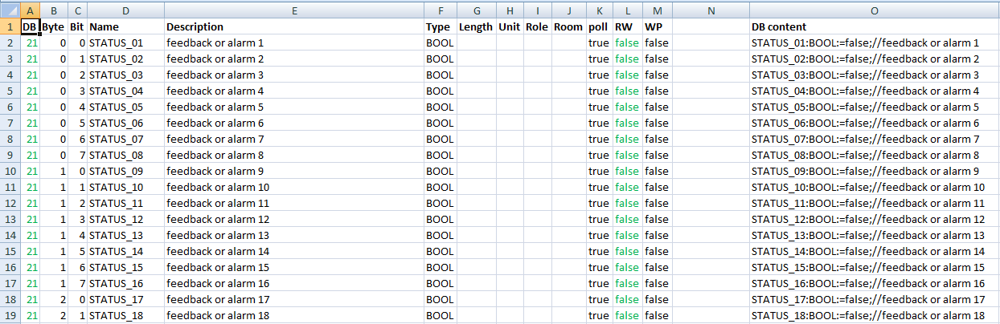


Столбцы от A до M основаны на структуре в ioBroker и должны быть заполнены пользователем на основе программного обеспечения S7. Возможно, вы захотите использовать части таблицы символов S7 (копирование - вставка). В столбце O код для S7 DB получается из содержимого столбцов с A по M.

* Столбец A: DB = номер DB в S7 и первая часть адреса в ioBroker
* Столбец B: Байт = Байт в БД в S7 и вторая часть адреса в ioBroker
* Столбец C: Бит = Бит в БД в S7 и третья часть адреса в ioBroker
* Столбец D: Имя = Имя в БД в S7 и имя в ioBroker
* Столбец E: Описание = Комментарий в БД в S7 и описание в ioBroker
* Столбец F: Type = Введите DB в S7 и введите ioBroker
* Столбец G: длина = длина в ioBroker
* Столбец H: Unit = unit в ioBroker
* Столбец I: Роль = роль в ioBroker.
* Столбец J: Комната = комната в ioBroker
* Столбец K: опрос = точка данных будет опрашиваться циклически (истина / ложь)
* Столбец L: RW = точка данных может быть записана (истина / ложь) è «истина» в DB20, поскольку мы хотим записать данные в S7.
* Столбец M: WP = точка данных будет установлена на «1» только для «времени импульса», определенного в «Общие - Общие».

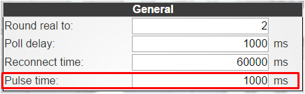

* Столбец N: намеренно оставлен пустым.
* Столбец O: содержимое БД = содержимое, которое будет скопировано в Step7 для создания БД, формула: `` `= CONCATENATE (D2;": "; F2;": = ";" false; ";" // "; E2 ) `` `

#### Подготовка DB21 - двоичные значения, отправляемые в ioBroker из S7


* Столбец L: RW è «false» в DB21, так как мы хотим читать данные из S7.

#### Подготовка DB22 - Реальные значения, отправленные из ioBroker в S7
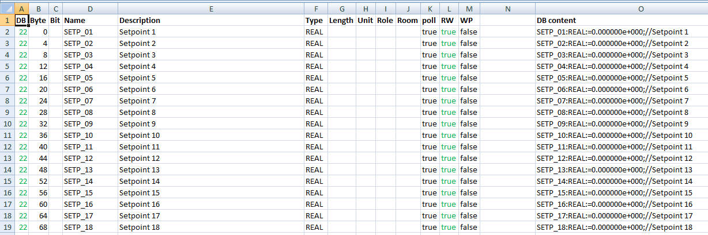


* Столбец B: байт = начальный байт действительного значения (0, 4, 8,…)
* Столбец C: бит = оставлен пустым
* Столбец L: RW è «true» в DB22, поскольку мы хотим записывать данные в S7.
* Столбец O: Формула: `` = CONCATENATE_ _ (D2; ":"; F2; ": ="; "0.000000e + 000;"; "//"; E2) `` `

#### Подготовка DB23 - Реальные значения, отправленные в ioBroker из S7
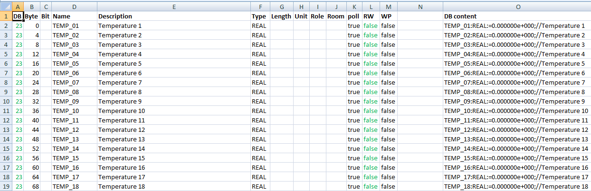


* Столбец B: байт = начальный байт действительного значения (0, 4, 8,…)
* Столбец C: бит = оставлен пустым
* Столбец L: RW è «false» в DB23, так как мы хотим читать данные из S7.
* Столбец O: Формула: `` = CONCATENATE_ _ (D2; ":"; F2; ": ="; "0.000000e + 000;"; "//"; E2) `` `

#### Создание источников БД на шаге 7
Теперь мы сгенерируем БД на шаге 7, используя код из столбца O нашей электронной таблицы. В вашу программу Step7 вставьте источник STL, щелкнув правой кнопкой мыши на «Источники». [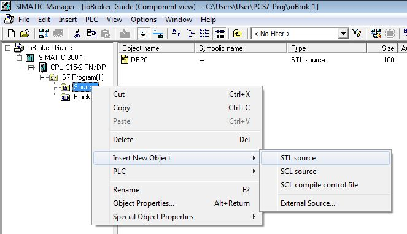

Переименуйте новый источник в «DB20».
Вставьте следующий код в пустой источник:

```
DATA_BLOCK DB 20
    TITLE =
    VERSION : 0.1
    STRUCT
    END_STRUCT ;
    BEGIN
END_DATA_BLOCK
```

Исходный код должен выглядеть так:

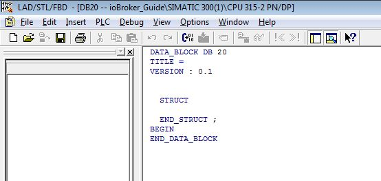

Скопируйте источник «DB20» 3 раза и назовите копии DB21, DB22, DB23, а также измените строку один в каждом источнике на:

* `` БЛОК_ДАННЫХ БД 21``
* `` БЛОК_ДАННЫХ БД 22 ''
* `` БЛОК_ДАННЫХ БД 23 ''

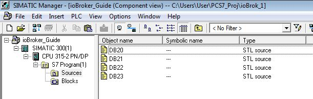

Теперь перейдите к таблице DB20 и скопируйте код в столбец O (без заголовка):

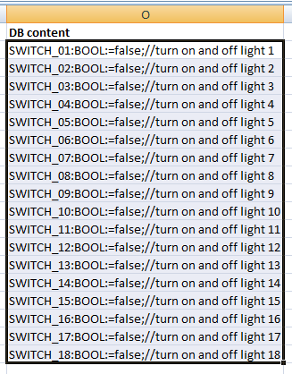

Вставьте ячейки в источник под названием «DB20» на шаге 7 между «STRUCT» и «END_STRUCT;»:

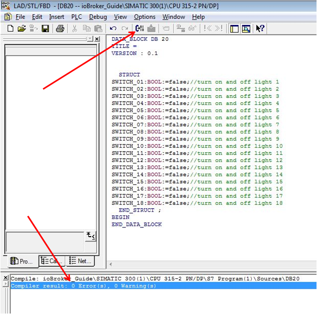

Запустите компилятор, и результат должен быть 0 ошибок, 0 предупреждений. Теперь DB20 сгенерирован, и вы найдете новый блок в своей программе S7 в разделе «Блоки».

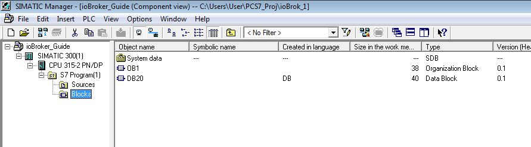

Блок выглядит так:

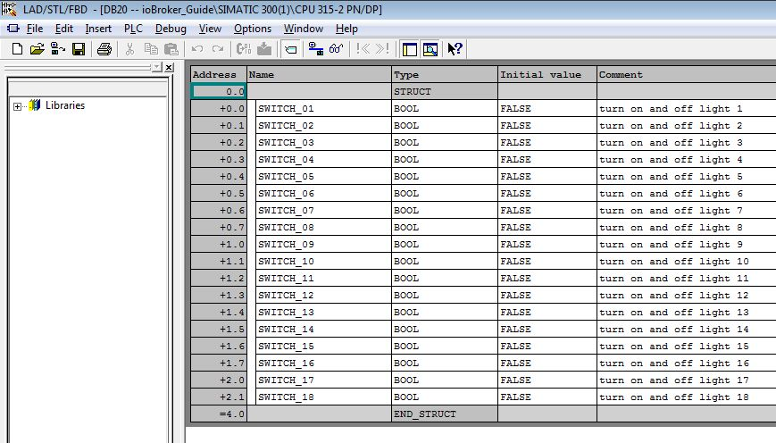

 Адрес должен соответствовать адресу в электронной таблице, просто проверьте работоспособность, сравнив комбинацию байта и бита:

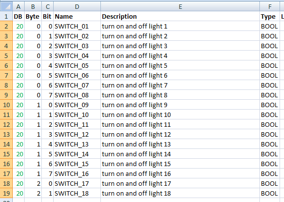

Повторите для DB21, DB22, DB23 и убедитесь, что вы выбрали столбец O из правой таблицы и вставили его в правильный источник (таблица DB21 в исходный DB21 и т. Д.) Поскольку DB22 и 23 будут иметь дело с РЕАЛЬНЫМИ значениями, вы можете найти ниже, как блоки будут смотреться.

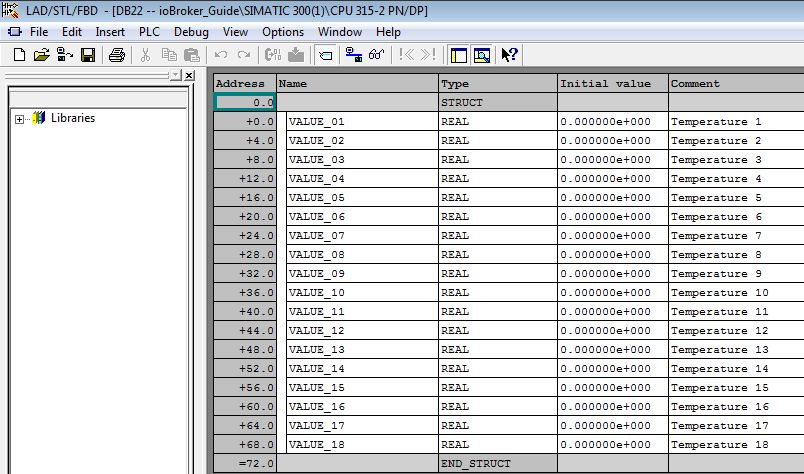

Также здесь адрес должен соответствовать электронной таблице (байт):

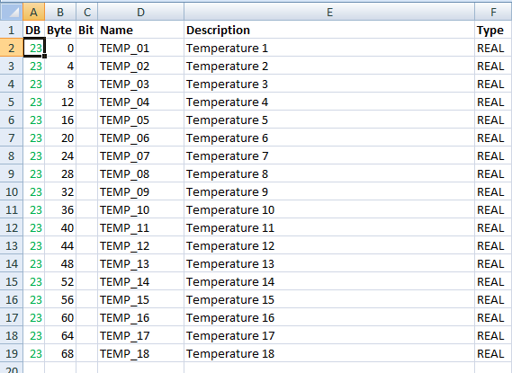

Теперь у нас есть 4 базы данных, необходимые для связи:

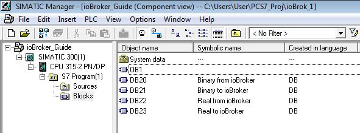

Вы должны дать им соответственно символическое имя, чтобы сохранить ясность. Не забудьте подключить их к S7 logic и загрузить измененный код.

### Заполнить базы данных в ioBroker
Теперь, когда 4 DB являются частью кода, работающего в S7, мы расскажем ioBroker, как взаимодействовать с S7.

#### Установка экземпляра S7-адаптера
Адаптеры - оборудование - Siemens S7 Adapter - +

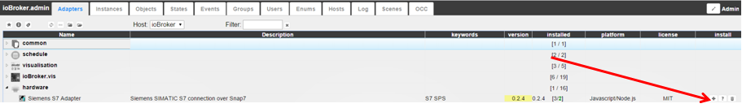

Возможно несколько экземпляров, если вы хотите, чтобы ваш ioBroker соединялся с несколькими процессорами S7. Включите новый экземпляр адаптера:

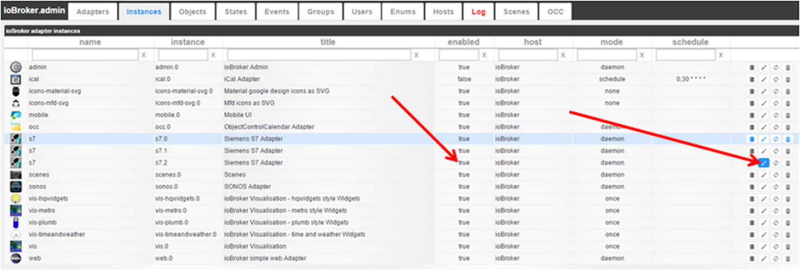

Название адаптера (стандарт: Siemens S7 Adapter) также можно изменить на этом этапе. Одной из идей было бы использование IP-адреса как части заголовка. Откройте конфигурацию адаптера

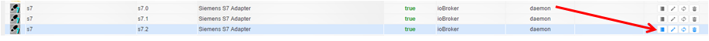

и приступаем к настройке S7-адаптера:

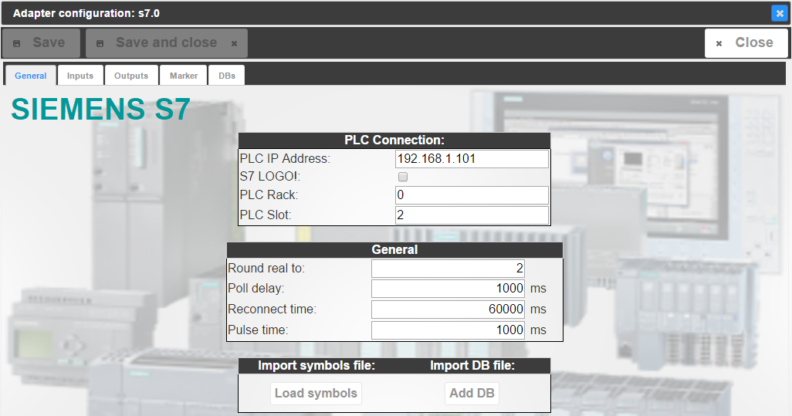

* Вкладка «Общие»
    * Подключение к ПЛК
        * IP-адрес ПЛК IP-адрес ПЛК, как определено в Step7 HW Config.

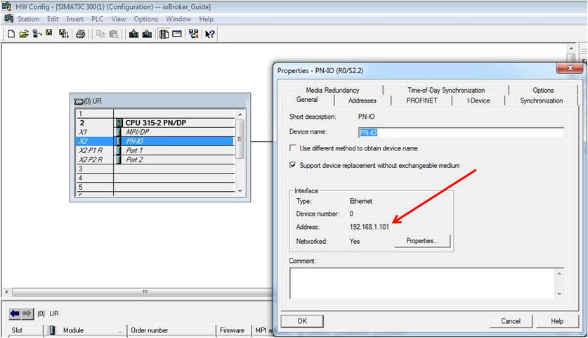

* S7 LOGO! Если вы используете ЛОГОТИП, а не ПЛК S7
* PLC Rack Номер стойки CPU, как указано в Step7 HW Config (R0 / S2)
* Слот ПЛК Номер слота ЦП, как указано в аппаратной конфигурации Step7 (R0 / S2)

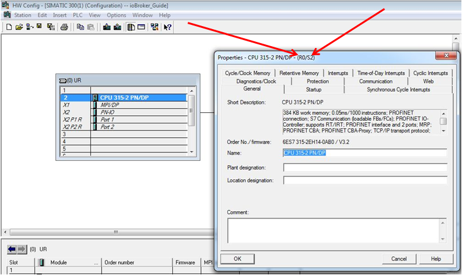

* Общий
    * Округлить действительное до: Число цифр, действительное значение будет округлено до после разделителя, например: 2 -> 12,12 3 -> 12,123… 9 -> 12,123456789
    * Задержка опроса: цикл обновления связи в миллисекундах
* Время <span style="line-height: 1.5;">повторного подключения: Продолжительность в миллисекундах после повторного подключения будет предпринята после того, как соединение с S7 было потеряно.</span>
* Время импульса: <span style="line-height: 1.5;">время в миллисекундах для «1» для точек данных, настроенных как WP = true.</span>
* Импортировать файл символов:
    * Загрузить символы Функция для импорта символов Step7 из файла ASCII - здесь не используется
* Импортировать файл БД:
    * Добавить функцию БД для импорта БД Step7 из файла ASCII - здесь не используется

#### Настройте ioBroker для связи
Пропускаем вкладки «Входы», «Выходы» и «Маркеры» и переходим сразу к «БД»:

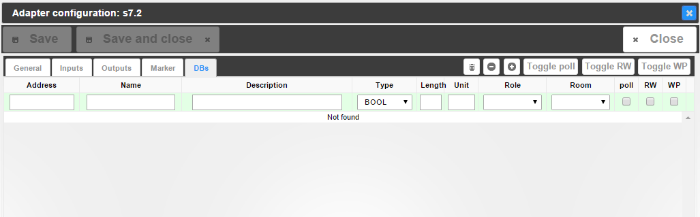

Здесь вы можете найти структуру электронной таблицы. Мы снова готовы к массовому проектированию. Нажмите кнопку «Импортировать из CSV» [

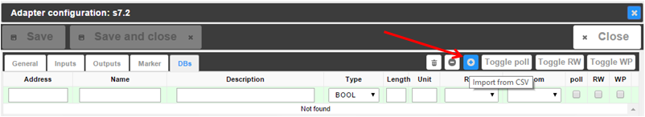

и вы получите пустое поле. Теперь снова перейдите к электронной таблице, к таблице DB20, и скопируйте столбцы от A до M (без заголовков). [

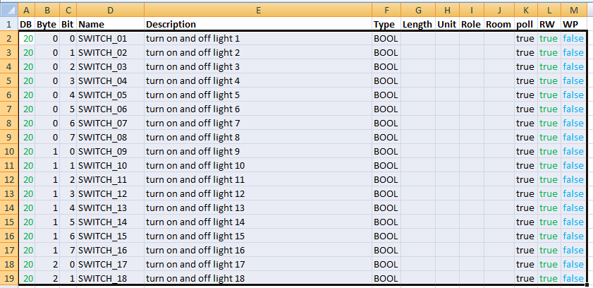

Вставьте ячейки в пустое поле импорта в ioBroker и подтвердите, нажав «Экспорт», который должен называться «Импорт». [

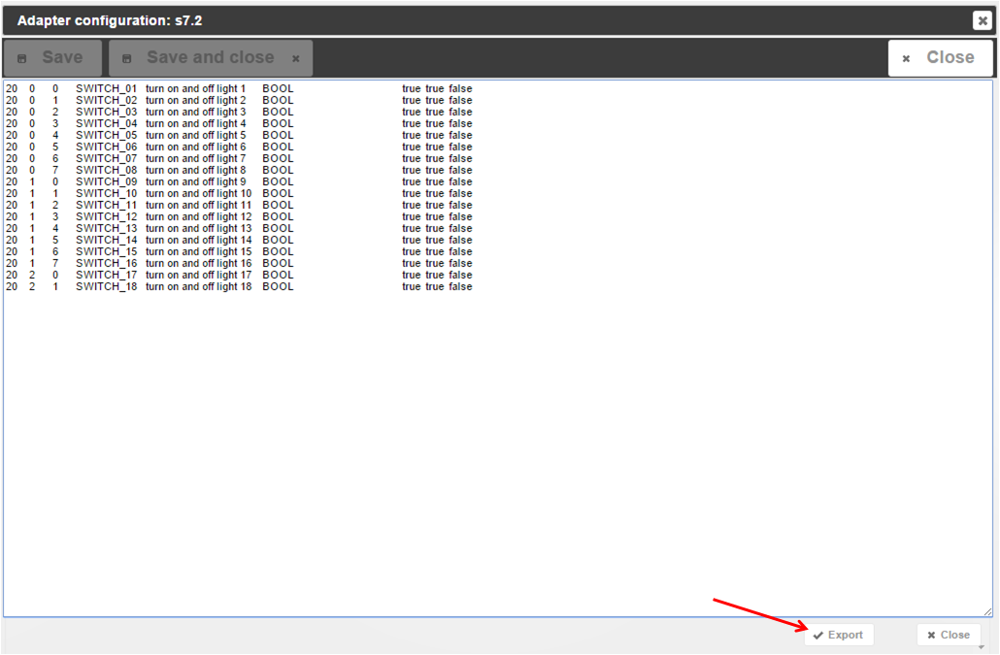

Первая БД готова и готова к обмену данными:

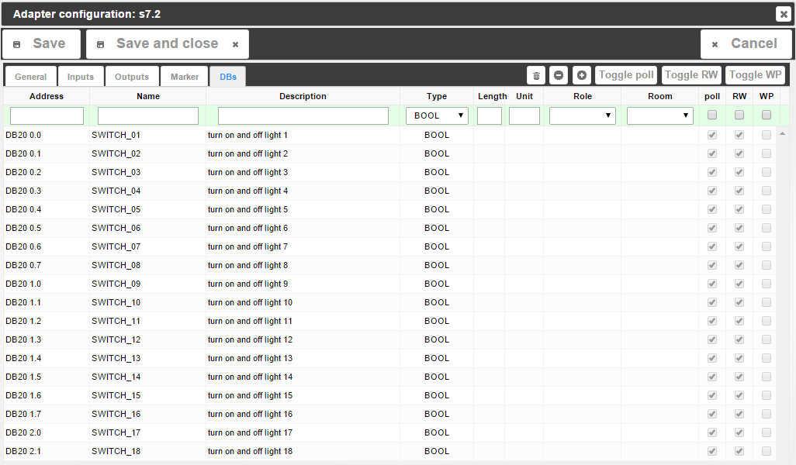

Повторите для DB21, DB22, DB23 \. Каждый раз, когда вы нажимаете «Импортировать из CSV», вы получаете пустое поле, но содержимое будет добавлено в список. Вы должны сделать это в кратчайшие сроки, независимо от того, сколько точек данных вы хотите заполнить. Если вы хотите использовать функции, которые поставляются с ioBroker, заполнив поля Length, Unit, Role, Room, вы также можете сделать это в таблице, чтобы воспользоваться преимуществами массового проектирования. Если вы решите сделать это позже или только для пары точек данных, вы также можете сделать это непосредственно в ioBroker в разделе «БД» со встроенными параметрами редактирования. Но не забывайте экономить! 12 [

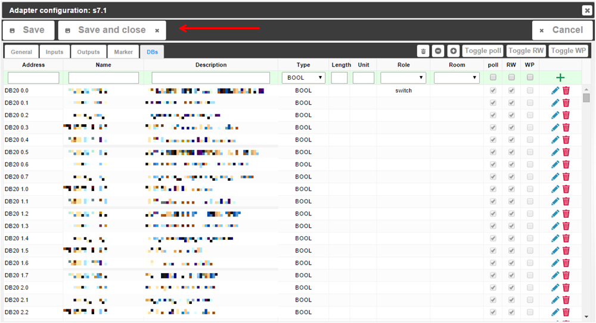

#### Проверка связи
Перейдите на вкладку «Объекты» в ioBroker и найдите экземпляр S7 (например, s7.0, а не system.adapter.S7.0). Если вам что-то не хватает: F5 (обновление веб-страницы) - король! Ее вы найдете две группы:

* БД с 4 настроенными БД:
    * DB20
    * DB21
    * DB22
    * DB23
* Информация с информацией о подключении:
    * Соединение: «истина», если S7 можно найти в сети.
    * pdu: размер PDU Snap7, подключенный к S7 (обычно 240 для S7-300, 480 для S7-400)
    * poll_time: время в миллисекундах, которое Snap7 использует для связи - должно быть меньше, чем задержка опроса, настроенная в параметрах «Общие» - «Общие» в конфигурации экземпляра адаптера.

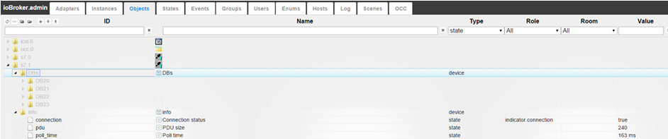

 Мы настроили DB21 и DB23 как DB, отправляющие информацию в ioBroker, т.е. если вы откроете DB в разделе «Объекты», вы должны увидеть уже поступающие значения, учитывая, что DB снабжены данными из кода S7.

## Мониторинг и работа в vis
Запустите ioBroker.vis из вкладки «Экземпляры». Я рекомендую установить vis-hqwidgets. Начнем с переключателя:

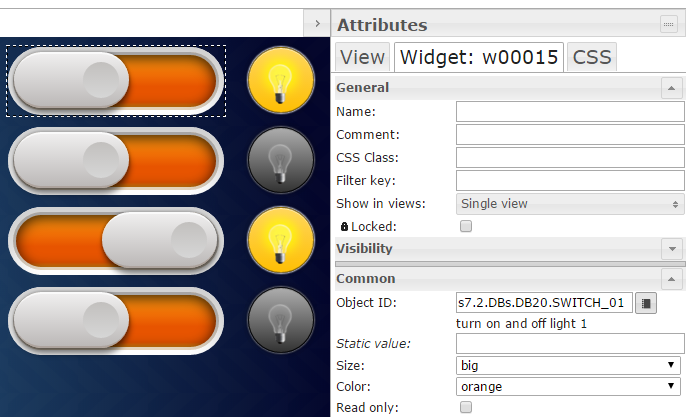

Перетащите виджет переключателя в представление, подключите его к идентификатору объекта переключателя в DB20, и все готово. Если вы сейчас задействуете переключатель, вы обнаружите, что точка данных в «Objects» - «s7.x» - «DBs» - «DB20» будет переключаться, и S7 будет включать и выключать все, что когда-либо было подключено к DB. Если вы отслеживаете БД на шаге 7 в режиме онлайн, вы увидите, что точка данных в БД изменится с «0» на «1» и т. Д. Бинарный статус работает точно так же: перетащите и отпустите виджет в вашем представлении и подключитесь соответствующая точка данных от DB21 к нему. То же самое и с реальными значениями:

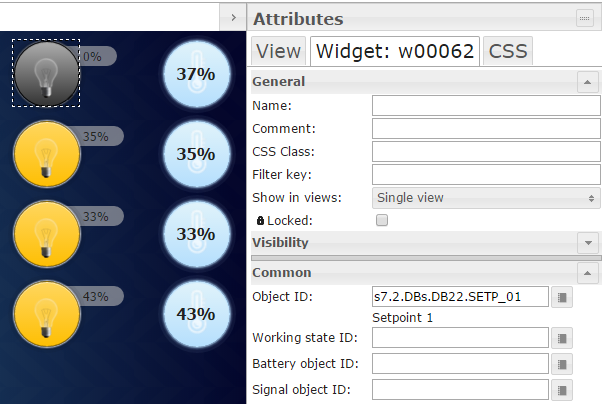

Важно: Пользователь отвечает за подключение правильных точек данных к виджетам. Вы можете связать реальное значение с двоичным статусом (например, лампочка), чтобы лампочка показывала «горит», когда реальное значение> 1.0. Вот и все, ребята, довольно просто и понятно, а?

## Changelog
### 1.3.0 (2021-06-17)
* (bluefox) New configuration page on react 

### 1.2.5 (2021-04-17)
* (Apollon77) Fix pot crash case (Sentry IOBROKER-S7-16)

### 1.2.4 (2021-02-22)
* (Apollon77) Make sure data are of correct type (Sentry IOBROKER-S7-K)

### 1.2.3 (2021-02-17)
* (Apollon77) null values will no longer be tried to send but give error message (Sentry IOBROKER-S7-8)
* (Apollon77) Prevent some more crash cases (IOBROKER-S7-1, IOBROKER-S7-9, IOBROKER-S7-E, IOBROKER-S7-F, IOBROKER-S7-G)

### 1.2.2 (2021-01-26)
* (Apollon77) Prevent warnings in js-controller 3.2

### 1.2.1 (2021-01-25)
* (Apollon77) fix info.connection state

### 1.2.0 (2021-01-25)
* (Apollon77) Prevent error case (Sentry IOBROKER-S7-4)
* (Apollon77) js-controller 2.0 is now required at minimum

### 1.1.10 (2021-01-24)
* (smiling_Jack) Bugfix in the Admin

### 1.1.9 (2020-08-02)
* (Apollon77) Fix object access issue
* (Apollon77) update node-snap7 library

### 1.1.8 (2020-05-05)
* (Steff42) Make sure objects ids/names are strings

### 1.1.6 (2019.12.27)
* (Apollon77) reconnection handling on timeouts optimized

### 1.1.4 (2018.07.10)
* (Apollon77) Support for nodejs 10 on Windows

### 1.1.3 (2018.01.19)
* (bluefox) The time offset was added

### 1.1.1 (2018.01.05)
* (Apollon77) Fix LOGO! support

### 1.1.0 (2018.01.03)
* (bluefox) Fix strings
* (bluefox) fix names if they have more than one space

### 1.0.6 (2017.12.18)
* (bluefox) Decode error codes

### 1.0.5 (2017.12.17)
* (bluefox) Error by the DB import is fixed

### 1.0.4 (2017.11.30)
* (bluefox) Fix read of DB (range error)

### 1.0.2 (2017.10.30)
* (Apollon77) Enhance object data to allow writing if available
* (bluefox) Add export from Graphpic

### 1.0.1 (2017.10.24)
* (bluefox) Detect DB and db in addresses

### 1.0.0 (2017.09.25)
* (bluefox) Activate save button if something was deleted

### 0.3.2 (2017.09.20)
* (bluefox) Fix DB bit offset bug if starting not from 0

### 0.3.0 (2017.07.12)
* (Apollon77) Upgrade node-snap7 library to current version

### 0.2.6 (2017.05.19)
* (Apollon77) Fix history handling

### 0.2.5 (2016.12.09)
* (bluefox) Fix button text: Import

### 0.2.4 (2015.10.29)
* (bluefox) add comment about python
* (bluefox) implement string read and write
* (bluefox) implement auto-increment of addresses.
* (bluefox) fix length
* (bluefox) implement export import from/to CSV
* (bluefox) fix small errors in config
* (bluefox) implement import/export for inputs and outputs too.
* (bluefox) add translation

### 0.2.3 (2015.09.24)
* (bluefox) add suppor of Logo!

### 0.2.2 (2015.09.11)
* (bluefox) add S7time
* (bluefox) support rooms and roles
* (bluefox) it works
* (bluefox) update packets

### 0.2.1 (2015.09.09)
* (bluefox) fix creation of objects

### 0.2.0 (2015.08.15)
* (bluefox) improve performance and enable DB2 3.9 addresses.

### 0.1.8 (2015.08.10)
* (smiling_Jack) Bugfix send info states
* (smiling_Jack) Remove unneeded console.log

### 0.1.7 (2015.08.06)
* (smiling_Jack) Bugfix send to SPS
* (smiling_Jack) Bugfix reconnect on connection lost

### 0.1.6 (2015.07.31)
* (smiling_Jack) Bugfix typo (Adress, Merkers)

### 0.1.5 (2015.07.29)
* (smiling_Jack) Bugfix translation Admin

### 0.1.4 (2015.07.28)
* (smiling_Jack) Add S5Time as Type
* (smiling_Jack) Bugfix History
* (smiling_Jack) Bugfix (fast value change)

### 0.1.3 (2015.06.04)
* (bluefox) translate admin
* (bluefox) remove jshint warnings
* (bluefox) add info.connected and rename info.connection to info.state

### 0.1.2
* Bugfix startup
* Bugfix add states

### 0.1.1
* change import options

### 0.1.0
* redesign Admin UI
* add write as Pulse
* Bugfix delete unused objects

### 0.0.8
* Bugfix start file
* Bugfix DB import
* Working on Admin style
* Add Units

### 0.0.6
* Bugfix start file

## License
The MIT License (MIT)

Copyright (c) 2014-2021 bluefox <dogafox@gmail.com>,

Copyright (c) 2014-2016 smiling_Jack <steffen.schorling@googlemail.com>

Permission is hereby granted, free of charge, to any person obtaining a copy
of this software and associated documentation files (the "Software"), to deal
in the Software without restriction, including without limitation the rights
to use, copy, modify, merge, publish, distribute, sublicense, and/or sell
copies of the Software, and to permit persons to whom the Software is
furnished to do so, subject to the following conditions:

The above copyright notice and this permission notice shall be included in all
copies or substantial portions of the Software.

THE SOFTWARE IS PROVIDED "AS IS", WITHOUT WARRANTY OF ANY KIND, EXPRESS OR
IMPLIED, INCLUDING BUT NOT LIMITED TO THE WARRANTIES OF MERCHANTABILITY,
FITNESS FOR A PARTICULAR PURPOSE AND NONINFRINGEMENT. IN NO EVENT SHALL THE
AUTHORS OR COPYRIGHT HOLDERS BE LIABLE FOR ANY CLAIM, DAMAGES OR OTHER
LIABILITY, WHETHER IN AN ACTION OF CONTRACT, TORT OR OTHERWISE, ARISING FROM,
OUT OF OR IN CONNECTION WITH THE SOFTWARE OR THE USE OR OTHER DEALINGS IN THE
SOFTWARE.