# ioBroker.S7

## Подробное описание

Адаптер S7, поставляемый с ioBroker, основан на Snap7. Snap7 устанавливается при первой установке адаптера и обеспечивает связь по протоколу TCP/IP между ПЛК S7 и ioBroker. Поэтому для связи по протоколу TCP/IP с оборудованием, на котором работает ioBroker, обязательно наличие у S7 интерфейса Ethernet (встроенного или внешнего CP). В качестве предварительного условия пользователь должен знать основы связи по протоколу TCP/IP и уметь настраивать ПЛК S7 с помощью программного обеспечения Step7. Но это не должно стать проблемой для тех, кто планирует подключить S7 к ioBroker.

## Установка

Данное руководство основано на следующей конфигурации:

- S7-315 со встроенным интерфейсом Ethernet
- Raspberry Pi 2, ioBroker работает под управлением Debian GNU/Linux 7.8 (wheezy)
- Диапазон IP-адресов 192.168.1.xxx
- На компьютере запущено:
  - Инструменты для работы с электронными таблицами, такие как MS Excel или Apache Open Office.
  - Браузер Google Chrome
  - Step7 V5.5 SP4 HF5

**Необходим дополнительный документ: (iobroker\_adapter\_S7.xlsx)\[iobroker\_adapter\_S7.xlsx]**

### Обмен данными посредством блоков данных (БД)

В этом руководстве описывается взаимодействие между ioBroker и ПЛК S7 посредством блоков данных. В идеале для этого взаимодействия можно создать отдельные блоки данных. Эти блоки должны быть интегрированы в код, работающий в S7. Преимущество такого подхода заключается в том, что вы можете быть уверены в отсутствии случайной перезаписи данных, например, в блоке данных экземпляра, что может привести к нежелательным или неожиданным реакциям в вашем программном обеспечении S7. Если вам необходимо использовать существующие блоки данных из-за ограничений памяти или невозможности внесения каких-либо изменений в программное обеспечение S7, убедитесь, что вы заполняете в ioBroker только соответствующие данные, чтобы избежать конфликтов.

### Создание баз данных для обмена данными

Мы будем работать с четырьмя базами данных:

- DB20 – Двоичные значения, отправляемые из ioBroker на S7 (цифровой вход с экрана S7).
- DB21 – Двоичные значения, отправляемые в ioBroker с S7 (цифровой выход из представления S7).
- DB22 – Реальные значения, передаваемые из ioBroker на S7 (аналоговый вход из представления S7).
- DB23 – Реальные значения, отправляемые в ioBroker с S7 (аналоговый выход из представления S7).

Базы данных будут созданы с использованием электронной таблицы, в которой на каждый блок данных будет приходиться одна таблица.


#### Подготовка DB20 – двоичные значения, отправляемые из ioBroker на S7

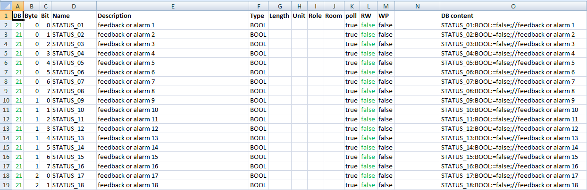


Столбцы от A до M основаны на структуре ioBroker и должны быть заполнены пользователем в соответствии с программным обеспечением S7. Возможно, вам потребуется использовать части таблицы символов S7 (скопировать и вставить). В столбце O код для базы данных S7 формируется из содержимого столбцов от A до M.

- Столбец A: DB = Номер базы данных в S7 и первая часть адреса в ioBroker
- Столбец B: Байт = Байт в базе данных S7 и вторая часть адреса в ioBroker
- Столбец C: Бит = Бит в базе данных S7 и третья часть адреса в ioBroker
- Столбец D: Имя = Имя в базе данных в S7 и имя в ioBroker
- Столбец E: Описание = Комментарий в базе данных в S7 и описание в ioBroker
- Столбец F: Тип = Введите в БД в S7 и введите в ioBroker
- Столбец G: Длина = длина в ioBroker
- Столбец H: Единица измерения = единица измерения в ioBroker
- Столбец I: Роль = роль в ioBroker
- Столбец J: Комната = комната в ioBroker
- Столбец K: Опрос = точка данных будет опрашиваться циклически (истина/ложь)
- Столбец L: RW = точка данных может быть записана как (истина/ложь) è «истина» в DB20, поскольку мы хотим записать данные в S7
- Столбец M: WP = точка данных будет установлена на «1» только для «времени импульса», определенного в разделе «Общие – Общие».

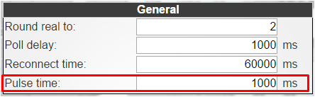

- Столбец N: намеренно оставлен пустым
- Столбец O: Содержимое БД = содержимое, которое будет скопировано на Шаг 7 для создания БД, формула:`=CONCATENATE(D2;":";F2;":=";"false;";"//";E2)`

#### Подготовка DB21 – двоичные значения, отправляемые в ioBroker с S7.


- В столбце L: RW имеет значение «false» в DB21, поскольку мы хотим прочитать данные из S7.

#### Подготовка DB22 – отправка реальных значений из ioBroker на S7

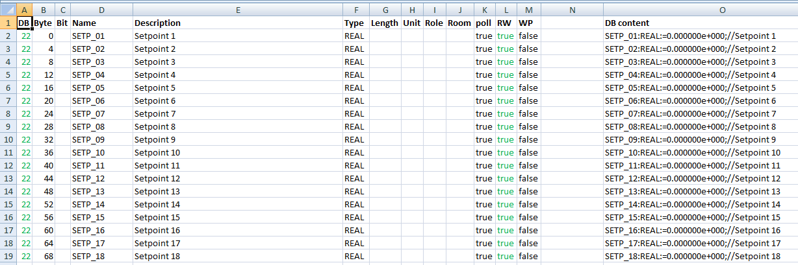


- Столбец B: Байт = начальный байт вещественного числа (0, 4, 8, …)
- Столбец C: Бит = оставить пустым
- В столбце L значение RW в DB22 равно “true”, поскольку мы хотим записать данные в S7.
- Столбец O: Формула:`=CONCATENATE_ _(D2;":";F2;":=";"0.000000e+000;";"//";E2)`

#### Подготовка DB23 – отправка реальных значений в ioBroker с S7

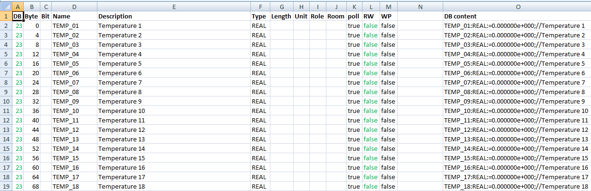


- Столбец B: Байт = начальный байт вещественного числа (0, 4, 8, …)
- Столбец C: Бит = оставить пустым
- В столбце L: RW имеет значение «false» в DB23, поскольку мы хотим прочитать данные из S7.
- Столбец O: Формула:`=CONCATENATE_ _(D2;":";F2;":=";"0.000000e+000;";"//";E2)`

#### Создайте источники баз данных на шаге 7.

Теперь мы сгенерируем базы данных в Step7, используя код из столбца O нашей электронной таблицы. В вашей программе Step7 вставьте исходный файл STL, щелкнув правой кнопкой мыши по пункту «Источники».

Переименуйте новый источник в «DB20». Вставьте следующий код в пустой источник:

```
DATA_BLOCK DB 20
    TITLE =
    VERSION : 0.1
    STRUCT 
    END_STRUCT ;         
    BEGIN
END_DATA_BLOCK
```

Исходный код должен выглядеть следующим образом:

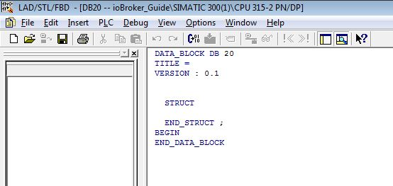

Скопируйте исходный файл «DB20» 3 раза и назовите копии DB21, DB22, DB23, при этом изменив первую строку в каждом исходном файле следующим образом:

- `DATA_BLOCK DB 21`
- `DATA_BLOCK DB 22`
- `DATA_BLOCK DB 23`

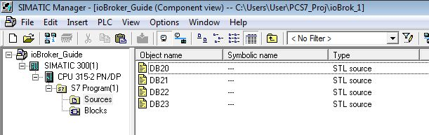

Теперь перейдите в электронную таблицу DB20 и скопируйте код из столбца O (без заголовка):

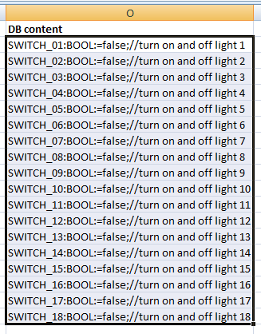

Вставьте ячейки из источника с именем «DB20» из шага 7 между «STRUCT» и «END\_STRUCT;»:

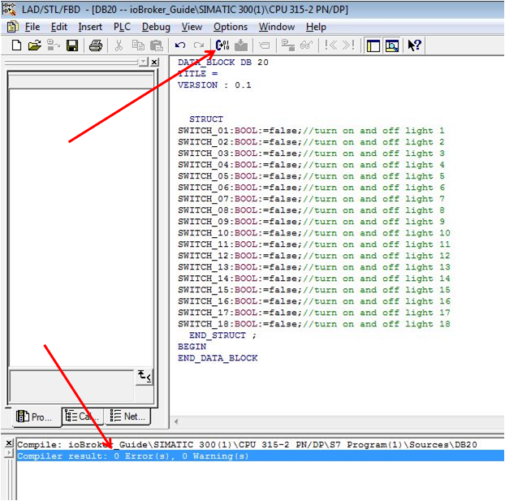

Запустите компилятор, и результат должен быть 0 ошибок, 0 предупреждений. DB20 теперь сгенерирован, и вы найдете новый блок в разделе «Блоки» вашей программы S7.

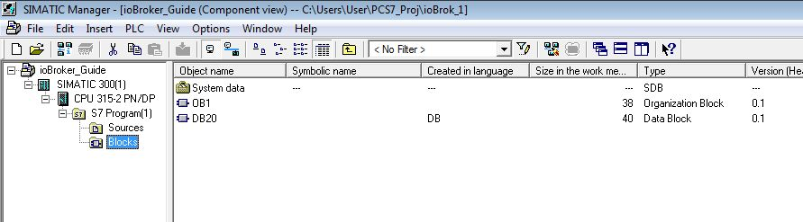

Блок выглядит так:

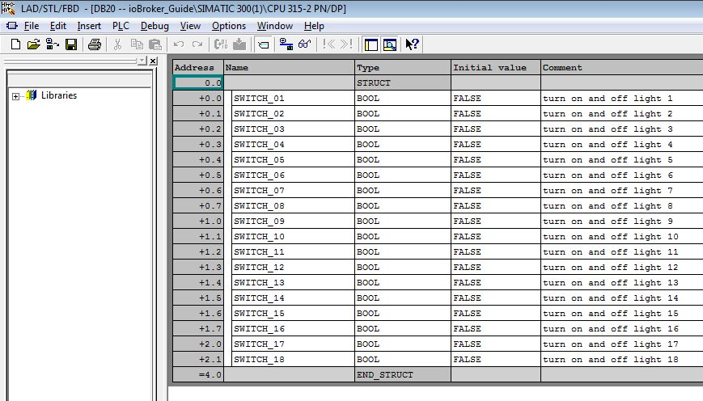

Адрес должен совпадать с адресом в электронной таблице, просто проверьте правильность, сравнив комбинацию байта и бита:

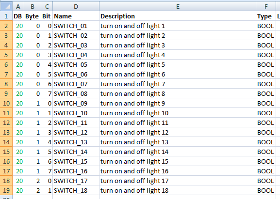

Повторите то же самое для DB21, DB22, DB23, убедившись, что вы выбрали столбец O из нужной таблицы и вставили его в правильный источник (таблица DB21 в источник DB21 и т. д.). Поскольку DB22 и DB23 будут работать с вещественными значениями, ниже вы можете увидеть, как будут выглядеть блоки.

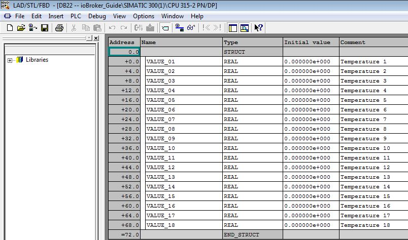

Здесь адрес также должен соответствовать электронной таблице (байтам):

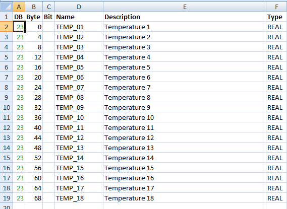

Теперь у нас есть 4 базы данных, необходимые для связи:

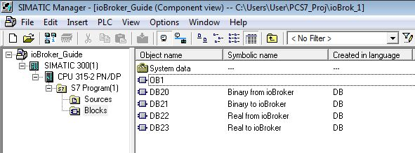

Для большей ясности дайте им соответствующие символические имена. Не забудьте подключить их к логике S7 и загрузить измененный код.

### Заполните базы данных в ioBroker

Теперь, когда 4 базы данных являются частью кода, работающего в S7, мы сообщим ioBroker, как взаимодействовать с S7.

#### Установка экземпляра адаптера S7

Адаптеры – аппаратное обеспечение – Адаптер Siemens S7 – +

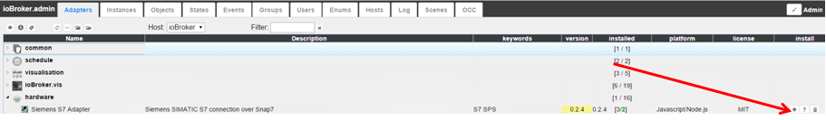

Возможно создание нескольких экземпляров, если вы хотите, чтобы ваш ioBroker подключался к нескольким процессорам S7. Включите новый экземпляр адаптера:

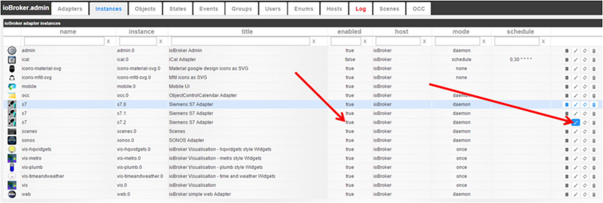

На этом этапе также можно изменить название адаптера (стандартное: Siemens S7 Adapter). Можно использовать IP-адрес в качестве части названия. Откройте конфигурацию адаптера.

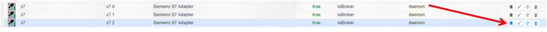

и начать настройку адаптера S7:

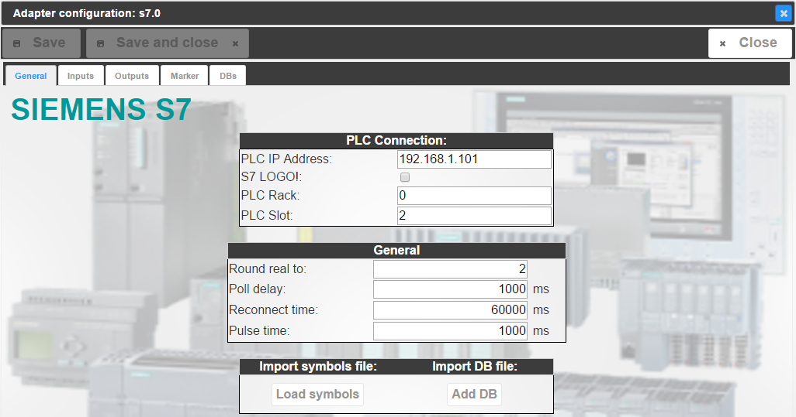

- Вкладка «Общие»
  - Подключение ПЛК
    - IP-адрес ПЛК: IP-адрес ПЛК, определенный в конфигурации оборудования Step7.

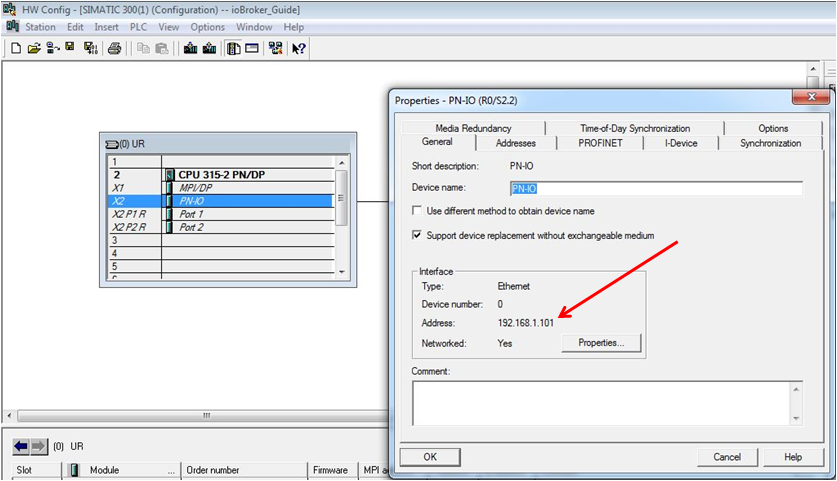

- Логотип S7! Если вы используете логотип, а не ПЛК S7.
- Номер стойки ПЛК. Номер стойки ЦП, указанный в конфигурации оборудования Step7 (R0/S2).
- Номер слота ПЛК (PLC Slot) процессора, указанный в конфигурации оборудования Step7 (R0/S2).

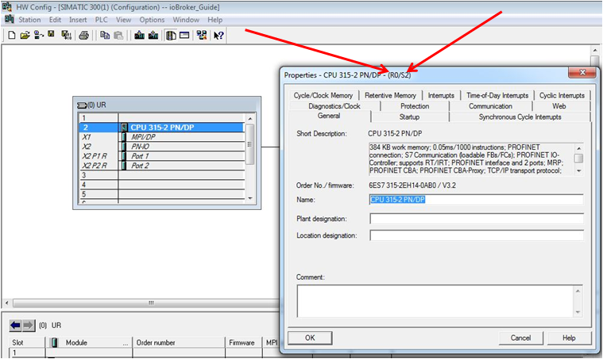

- Общий
  - Округление действительных чисел до: Количество знаков после запятой, до которого будут округлены действительные значения после разделителя, например: 2 -> 12,12 3 -> 12,123 … 9 -> 12,123456789
  - Задержка опроса: цикл обновления связи в миллисекундах.
  - Время повторного подключения:<span style="line-height: 1.5;"> После потери соединения с S7 будет предпринята попытка повторного подключения, длительность которой будет указана в миллисекундах.</span>
  - Время импульса:<span style="line-height: 1.5;"> Время в миллисекундах для значения «1» для точек данных, настроенных как WP = true.</span>
- Импорт файла символов:
  - Функция «Загрузка символов» позволяет импортировать символы Step7 из ASCII-файла (здесь не используется).
- Импорт файла базы данных:
  - Добавить функцию базы данных для импорта баз данных Step7 из ASCII-файла – здесь не используется.

#### Настройте ioBroker для обмена данными.

Мы пропускаем вкладки «Входы», «Выходы» и «Маркеры» и сразу переходим к «БД»:

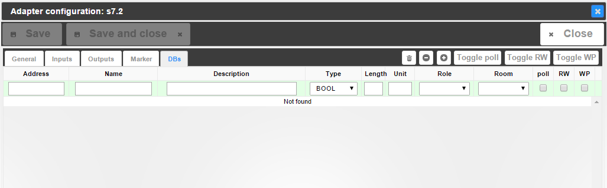

Здесь вы можете найти структуру электронной таблицы. Мы снова готовы к массовому проектированию. Нажмите кнопку «Импорт из CSV» \[


и вы получите пустое поле. Теперь снова перейдите к электронной таблице, таблице DB20, и скопируйте столбцы от A до M (без заголовков).


Вставьте ячейки в пустое поле импорта в ioBroker и подтвердите нажатием кнопки «Экспорт» (которая должна называться «Импорт»).


Первая база данных готова к работе и обмену данными:

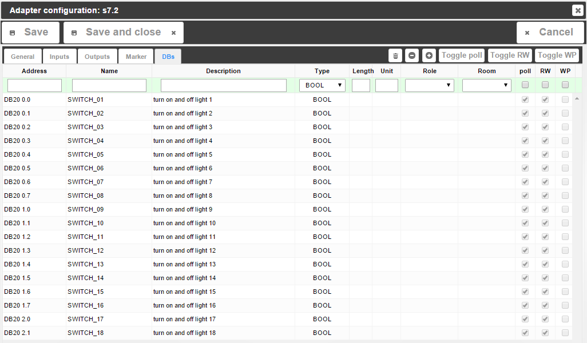

Повторите то же самое для DB21, DB22, DB23. Каждый раз, когда вы нажимаете «Импорт из CSV», вы получаете пустое поле, но его содержимое будет добавлено в список. Вы должны закончить работу очень быстро, независимо от того, сколько точек данных вы хотите заполнить. Если вы хотите использовать функции ioBroker, заполнив поля «Длина», «Единица», «Роль», «Комната», вы также можете сделать это в электронной таблице, чтобы воспользоваться преимуществами пакетного проектирования. Если вы решите сделать это позже или только для нескольких точек данных, вы также можете сделать это непосредственно в ioBroker в разделе «БД» с помощью встроенных параметров редактирования. Не забудьте сохранить! 12 \[


#### Тест на коммуникативные навыки

Перейдите на вкладку «Объекты» в ioBroker и найдите экземпляр S7 (например, s7.0, а не system.adapter.S7.0). Если чего-то не хватает: F5 (обновление веб-страницы) — это ключ к успеху! Здесь вы найдете две группы:

- Базы данных с четырьмя настроенными нами базами данных:
  - DB20
  - DB21
  - DB22
  - DB23
- Информация, содержащая сведения о подключении:
  - Подключение: «true», если S7 обнаружен в сети.
  - PDU: Размер блока распределения питания (PDU), к которому подключается Snap7 (обычно 240 для S7-300, 480 для S7-400).
  - poll\_time: время в миллисекундах, которое Snap7 тратит на обмен данными — должно быть меньше задержки опроса, настроенной в разделе «Общие» — «Общие» в конфигурации экземпляра адаптера.

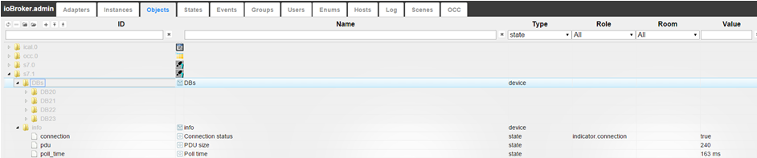

Мы настроили DB21 и DB23 как базы данных, отправляющие информацию в ioBroker, то есть, если вы откроете эти базы данных в разделе «Объекты», вы уже должны увидеть поступающие значения, учитывая, что базы данных получают данные из кода S7.

## Мониторинг и эксплуатация в условиях видимости

Запустите ioBroker.vis из вкладки «Экземпляры». Рекомендую установить vis-hqwidgets. Давайте начнём с переключателя:

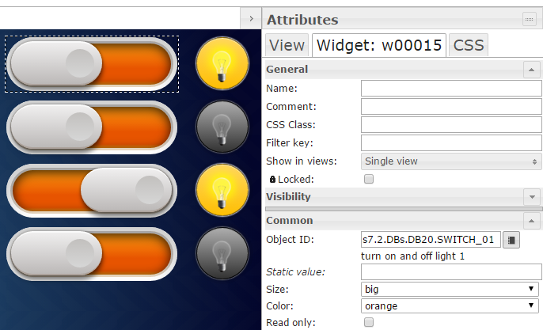

Перетащите виджет переключателя на ваше представление, соедините его с идентификатором объекта переключателя в DB20, и готово. Если вы теперь включите переключатель, вы увидите, что точка данных в разделе «Объекты» – «s7.x» – «DBs» – «DB20» будет переключаться, и S7 будет включать и выключать все, что подключено к базе данных. Если вы будете отслеживать базу данных в Step7 онлайн, вы увидите, что точка данных в базе данных будет меняться с «0» на «1» и т. д. Бинарный статус работает точно так же: перетащите виджет на ваше представление и соедините с ним соответствующую точку данных из DB21. И то же самое происходит для реальных значений:

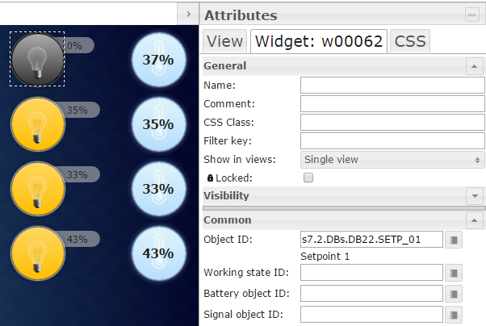

Важно: Пользователь отвечает за правильное подключение точек данных к виджетам. Вы можете подключить действительное значение к двоичному состоянию (например, лампочка), так что лампочка будет гореть, как только действительное значение станет больше 1,0. Вот и всё, друзья, довольно просто и понятно, не правда ли?

## Changelog
### 3.0.0 (2026-08-04)
* IMPORTANT: js-controller 5+ is required to install this version!
* IMPORTANT: Migrated to TypeScript and Vite for GUI

### 1.5.0 (2025-08-25)
* (Apollon77) Dependency updates
* (bluefox) GUI was moved to vite

### 1.4.4 (2025-08-16)
* (Apollon77) Ensures that the adapter works with node.js 22.x and 24.x
* (bluefox) Updated GUI packages

### 1.4.3 (2024-02-17)
* (Bettman66) Fix REAL number parsing error

### 1.4.2 (2023-12-04)
* IMPORTANT: Node.js 16+ is required to run this version!
* (Apollon77) Update dependencies to make adapter work with Node.js 20+

### 1.3.15 (2022-12-23)
* (bluefox) Updated GUI packages
* (bluefox) Added ukrainian translation

### 1.3.14 (2022-09-27)
* (bluefox) Updated GUI packages

### 1.3.13 (2022-08-02)
* (bluefox) Added preparations for ioBroker cloud
* (bluefox) Migrate GUI tu muiV5

### 1.3.12 (2022-04-03)
* (jogibear9988) Removed duplicated code
* (jogibear9988) Implemented S5TIME support (must be tested on a real device)

### 1.3.11 (2022-02-13)
* (bluefox) Updated releaser

### 1.3.10 (2021-11-13)
* (Apollon77) Better handle invalid entries with empty Address

### 1.3.9 (2021-11-09)
* (Apollon77) make sure strings work correctly
* (Apollon77) Fix several crash cases (IOBROKER-S7-17, IOBROKER-S7-19, IOBROKER-S7-1C, IOBROKER-S7-18)

### 1.3.7 (2021-11-08)
* (bluefox) Corrected type of "write" attribute

### 1.3.6 (2021-07-31)
* (bluefox) Corrected import of last line

### 1.3.5 (2021-07-07)
* (bluefox) Change edit mode behaviour

### 1.3.3 (2021-06-28)
* (bluefox) Corrected the error in GUI

### 1.3.2 (2021-06-23)
* (Apollon77) Add adapter tier for js-controller 3.3

### 1.3.1 (2021-06-23)
* (bluefox) Corrected the type of states

### 1.3.0 (2021-06-17)
* (bluefox) New configuration page on react

### 1.2.5 (2021-04-17)
* (Apollon77) Fix pot crash case (Sentry IOBROKER-S7-16)

### 1.2.4 (2021-02-22)
* (Apollon77) Make sure data are of correct type (Sentry IOBROKER-S7-K)

### 1.2.3 (2021-02-17)
* (Apollon77) null values will no longer be tried to send but give error message (Sentry IOBROKER-S7-8)
* (Apollon77) Prevent some more crash cases (IOBROKER-S7-1, IOBROKER-S7-9, IOBROKER-S7-E, IOBROKER-S7-F, IOBROKER-S7-G)

### 1.2.2 (2021-01-26)
* (Apollon77) Prevent warnings in js-controller 3.2

### 1.2.1 (2021-01-25)
* (Apollon77) fix `info.connection` state

### 1.2.0 (2021-01-25)
* (Apollon77) Prevent error case (Sentry IOBROKER-S7-4)
* (Apollon77) js-controller 2.0 is now required at minimum

### 1.1.10 (2021-01-24)
* (smiling_Jack) Bugfix in the Admin

### 1.1.9 (2020-08-02)
* (Apollon77) Fix object access issue
* (Apollon77) update node-snap7 library

### 1.1.8 (2020-05-05)
* (Steff42) Make sure objects ids/names are strings

### 1.1.6 (2019.12.27)
* (Apollon77) reconnection handling on timeouts optimized

### 1.1.4 (2018.07.10)
* (Apollon77) Support for nodejs 10 on Windows

### 1.1.3 (2018.01.19)
* (bluefox) The time offset was added

### 1.1.1 (2018.01.05)
* (Apollon77) Fix LOGO! support

### 1.1.0 (2018.01.03)
* (bluefox) Fix strings
* (bluefox) fix names if they have more than one space

### 1.0.6 (2017.12.18)
* (bluefox) Decode error codes

### 1.0.5 (2017.12.17)
* (bluefox) Error by the DB import is fixed

### 1.0.4 (2017.11.30)
* (bluefox) Fix read of DB (range error)

### 1.0.2 (2017.10.30)
* (Apollon77) Enhance object data to allow writing if available
* (bluefox) Add export from Graphpic

### 1.0.1 (2017.10.24)
* (bluefox) Detect DB and db in addresses

### 1.0.0 (2017.09.25)
* (bluefox) Activate save button if something was deleted

### 0.3.2 (2017.09.20)
* (bluefox) Fix DB bit offset bug if starting not from 0

### 0.3.0 (2017.07.12)
* (Apollon77) Upgrade node-snap7 library to current version

### 0.2.6 (2017.05.19)
* (Apollon77) Fix history handling

### 0.2.5 (2016.12.09)
* (bluefox) Fix button text: Import

### 0.2.4 (2015.10.29)
* (bluefox) add comment about python
* (bluefox) implement string read and write
* (bluefox) implement auto-increment of addresses.
* (bluefox) fix length
* (bluefox) implement export import from/to CSV
* (bluefox) fix small errors in config
* (bluefox) implement import/export for inputs and outputs too.
* (bluefox) add translation

### 0.2.3 (2015.09.24)
* (bluefox) added support of Logo!

### 0.2.2 (2015.09.11)
* (bluefox) add S7time
* (bluefox) support rooms and roles
* (bluefox) it works
* (bluefox) update packets

### 0.2.1 (2015.09.09)
* (bluefox) fix creation of objects

### 0.2.0 (2015.08.15)
* (bluefox) improve performance and enable DB2 3.9 addresses.

### 0.1.8 (2015.08.10)
* (smiling_Jack) Bugfix send info states
* (smiling_Jack) Remove unneeded console.log

### 0.1.7 (2015.08.06)
* (smiling_Jack) Bugfix send to SPS
* (smiling_Jack) Bugfix reconnect on connection lost

### 0.1.6 (2015.07.31)
* (smiling_Jack) Bugfix typo (Adress, Merkers)

### 0.1.5 (2015.07.29)
* (smiling_Jack) Bugfix translation Admin

### 0.1.4 (2015.07.28)
* (smiling_Jack) Add S5Time as Type
* (smiling_Jack) Bugfix History
* (smiling_Jack) Bugfix (fast value change)

### 0.1.3 (2015.06.04)
* (bluefox) translate admin
* (bluefox) remove jshint warnings
* (bluefox) add `info.connected` and rename `info.connection` to `info.state`

### 0.1.2
* Bugfix startup
* Bugfix add states

### 0.1.1
* change import options

### 0.1.0
* redesign Admin UI
* add write as Pulse
* Bugfix delete unused objects

### 0.0.8
* Bugfix start file
* Bugfix DB import
* Working on Admin style
* Add Units

### 0.0.6
* Bugfix start file

## License
The MIT License (MIT)

Copyright (c) 2014-2026 bluefox <dogafox@gmail.com>,

Copyright (c) 2014-2016 smiling_Jack <steffen.schorling@googlemail.com>

Permission is hereby granted, free of charge, to any person obtaining a copy
of this software and associated documentation files (the "Software"), to deal
in the Software without restriction, including without limitation the rights
to use, copy, modify, merge, publish, distribute, sublicense, and/or sell
copies of the Software, and to permit persons to whom the Software is
furnished to do so, subject to the following conditions:

The above copyright notice and this permission notice shall be included in all
copies or substantial portions of the Software.

THE SOFTWARE IS PROVIDED "AS IS", WITHOUT WARRANTY OF ANY KIND, EXPRESS OR
IMPLIED, INCLUDING BUT NOT LIMITED TO THE WARRANTIES OF MERCHANTABILITY,
FITNESS FOR A PARTICULAR PURPOSE AND NONINFRINGEMENT. IN NO EVENT SHALL THE
AUTHORS OR COPYRIGHT HOLDERS BE LIABLE FOR ANY CLAIM, DAMAGES OR OTHER
LIABILITY, WHETHER IN AN ACTION OF CONTRACT, TORT OR OTHERWISE, ARISING FROM,
OUT OF OR IN CONNECTION WITH THE SOFTWARE OR THE USE OR OTHER DEALINGS IN THE
SOFTWARE.