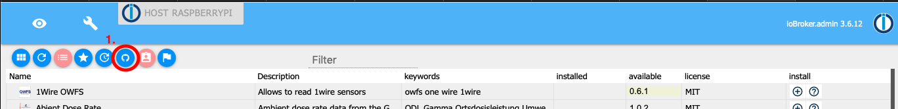
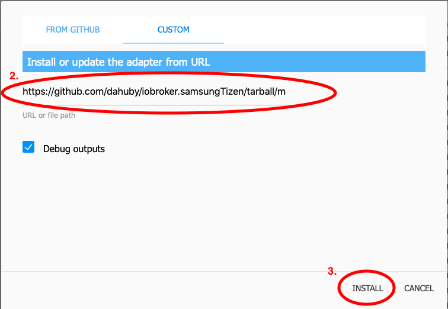
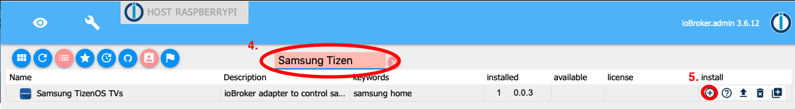
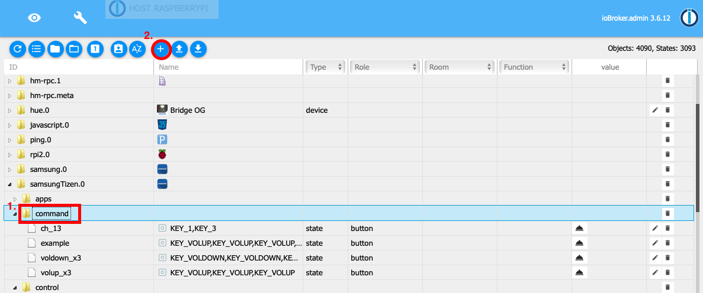
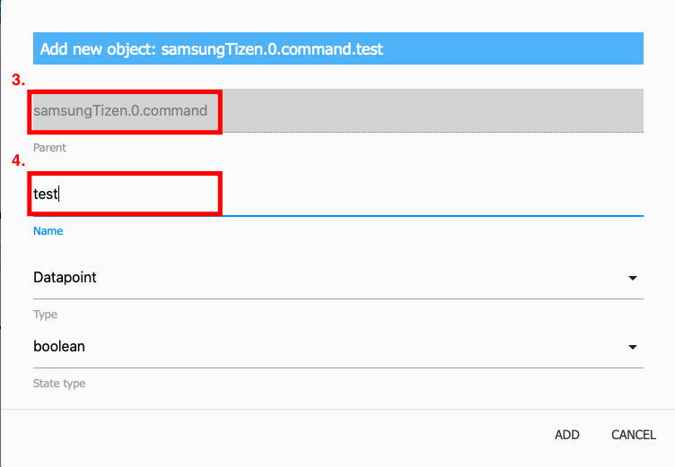
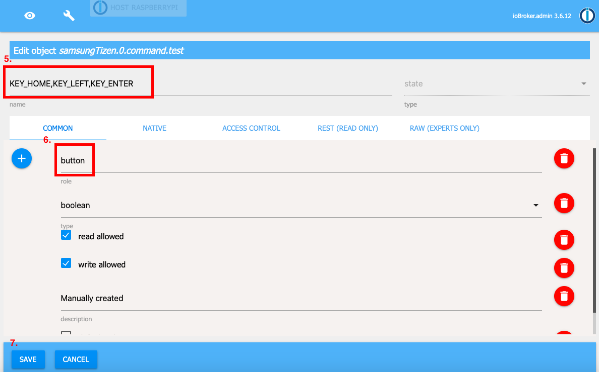
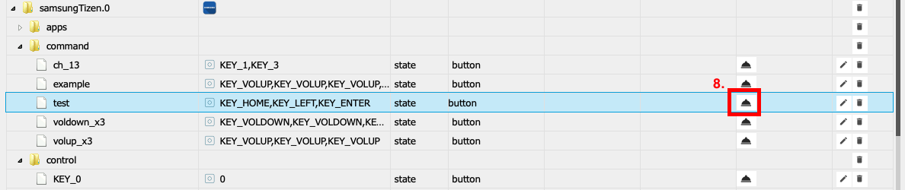

# Iobroker.samsung_tizen
=====================

Этот адаптер предназначен для управления телевизорами Samsung с tizenOS (>=2016).

1. [Установка](#1-установка)
2. [Конфигурация] (#2-Конфигурация)

2.1. [Протокол](#21-protocol) 2.2. [IP адрес](#22-ip-address) 2.3. [Порт](#23-port) 2.4. [Токен](#24-token) 2.5. [Mac-адрес](#25-mac-adress) 2.6. [Государственный опрос телевидения](#26-tv-state-polling) 2.7. [Задержка команды](#27-command-delay)

3. [Использование] (#3-использование)

3.1. [Контроль](#31-control) 3.2. [Программы](#32-apps) 3.3. [Команды](#33-commands)

4. [Лицензия](#4-Лицензия)

## 1. Установка
откройте админку iobroker, перейдите на вкладку адаптеров и установите адаптер из специального источника.

<details><summary>детальная установка</summary><p>

1. щелкните значок github (установить по собственному URL-адресу)



2. введите этот URL-адрес GitHub https://github.com/dahuby/iobroker.samsung_tizen/tarball/master.
3. нажмите «Установить»



4. вернитесь на вкладку адаптеров и выполните поиск «Samsung Tizen».
5. нажмите «+», чтобы добавить новый экземпляр



6. настроить адаптер


</p> </подробнее>

## 2. Конфигурация
Как настроить этот адаптер.
Сначала проверьте настройки телевизора, включите телевизор и перейдите в «Настройки» / «Основные» / «Диспетчер внешних устройств» / «Диспетчер подключений устройств», там должно быть активировано уведомление о доступе «только в первый раз».

### 2.1. Протокол
Протокол для подключения через веб-сокет к вашему телевизору.
возможные значения: http или wss, на новых устройствах используйте wss

### 2.2. Айпи адрес
IP-адрес вашего телевизора Samsung

### 2.3. Порт
Порт для подключения к телевизору через веб-сокет.
8001 незащищенный порт 8002 защищенный порт

### 2.4. Токен
Токен для безопасного подключения к вашему телевизору.
Сохраните адаптер с токеном = 0 и перейдите на вкладку объекта администрирования iobroker.
Затем перейдите к объекту iobroker.samsung_tizen.0.config.getToken и нажмите кнопку.
Если все работает нормально, должен появиться новый объект iobroker.samsung_tizen.0.config.token с идентификатором iobroker.samsung_tizen.0.config.token и именем вашего токена — скопируйте имя (например, 123456789) и вернитесь к конфигурации адаптера. и вставьте его в поле токена.
можно деактивировать значением «0»

<details><summary>Как получить токен вручную</summary><p> Установите «wscat» на устройство, на котором работает ioBroker, с помощью следующей команды:

```sh
npm install wscat
```

Включите телевизор и запросите токен через соединение через веб-сокет.

```sh
wscat -n -c wss://tvIp:8002/api/v2/channels/samsung.remote.control?name=aW9Ccm9rZXI=
```

На вашем телевизоре появится всплывающее окно, которое необходимо принять.
возьмите токен из возвращенного ответа JSON

```json
{"name":"aW9Ccm9rZXI="},"connectTime":1575818900205,"deviceName":"aW9Ccm9rZXI=","id":"12345678-797c-45b0-b0f1-233535918548","isHost":false}],"id":"12345678-797c-45b0-b0f1-233535918548","token":"10916644"},"event":"ms.channel.connect"}
```

</p> </подробнее>

### 2.5. MAC-адрес
MAC-адрес вашего телевизора Samsung будет использоваться для WakeOnLAN.
Работает только в том случае, если ваш телевизор подключен по проводу, а не по беспроводной сети.
Если ваш телевизор подключен по беспроводной сети, его можно включить только из режима ShortStandby.
WakeOnLan можно деактивировать значением «0».

### 2.6. государственный опрос на телевидении
#### Порт опроса
порт для получения состояния питания по умолчанию: 9110. Известные доступные порты: 9110, 9119, 9197.

#### Интервал опроса, как часто будет отправляться запрос на опрос. По умолчанию: 60 секунд можно отключить со значением «0».
### 2.7. Задержка команды
задержка в миллисекундах между командами, отправленными через объект iobroker.samsung_tizen.0.control.sendCmd.

## 3. Использование
### 3.1. Контроль
#### Отправьте один ключ
чтобы отправить один ключ, нажмите кнопку, например, под iobroker.samsung_tizen.0.control.KEY_MUTE

#### Отправьте ключ для неопределенной кнопки
вы можете отправить собственный (не определенный) ключ с помощью объекта iobroker.samsung_tizen.0.control.sendCmd.
Введите ключ, который вы хотите отправить, например. KEY_POWER.

#### Отправка нескольких ключей одной командой
для отправки нескольких ключей в одной команде используйте объект iobroker.samsung_tizen.0.control.sendCmd.
введите ключи, разделенные знаком "," например. KEY_POWER, KEY_HDMI, KEY_VOLUP.

#### Создание макросов для команд
Перейдите на страницу iobroker.samsung_tizen.0.command. Здесь вы можете найти примеры макросов и создать свои собственные макросы. <a name="use_cmd">Как создать новый макрос</a>

### 3.2. ПРОГРАММЫ
#### Загрузка установленных приложений
чтобы загрузить установленные приложения, нажмите кнопку iobroker.samsung_tizen.0.apps.getInstalledApps.
После этого для каждого установленного приложения создается отдельный объект с именем start_app_name.

#### Запустить приложение
вы можете запустить приложение, щелкнув объект iobroker.samsung_tizen.0.apps.start_app_name.

### Состояние электропитания
Если у вас настроен опрос состояния питания, как указано выше, в разделе iobroker.samsung_tizen.0.powerOn вы получите состояние true, если ваш телевизор включен, или false, если он выключен.

### 3.3. Команды
Команды можно отправлять вручную через объект iobroker.samsung_tizen.0.control.sendCmd, как указано в <a name="use_ctrl">разделе «Управление»</a> , или через специально созданные объекты в разделе iobroker.samsung_tizen.0.command. Примеров команд немного, но вы также можете создавать свои собственные макросы.<details><summary> Как создать командный макрос</summary><p>

1. заходим в адаптеры и открываем iobroker.samsung_tizen.0.command
2. щелкните значок +, чтобы создать новый объект.



3. проверьте, что родительский объект — iobroker.samsung_tizen.0.command
4. введите новое имя для своей команды и убедитесь, что тип — это точка данных, а тип состояния = логическое значение.



5. под именем введите ключи, которые хотите отправить.
6. роль должна быть кнопкой
7. и сохрани



8. затем вы можете отправить свою команду с вновь созданным объектом.

 </p> </details>

## Кредиты
Первое поколение этого адаптера было разработано Stefan0875 (https://github.com/Stefan0875), которое было адаптировано и поддерживается компаниями highpressure (https://github.com/Highpressure) и Finaly Dahuby (https://github .com/dahuby). Большое спасибо за их работу и предоставление публичной лицензии.

## Changelog

<!--
    Placeholder for the next version (at the beginning of the line):
    ### **WORK IN PROGRESS**
-->
### 1.0.0 (2023-09-30)
- (mcm1957) An official release has been created

### 1.0.0-alpha.2 (2023-09-24)
- (mcm1957) Dependencies have been updated

### 1.0.0-alpha.1 (2023-09-24)
- (mcm1957) Adapter requires node 16 or newer now.
- (mcm1957) Adapter has been moved to iobroker-community-adapters organization.

## License

MIT License 

Copyright (c) 2023 iobroker-community-adapters <mcm57@gmx.at>
Copyright (c) 2020 dahuby

Permission is hereby granted, free of charge, to any person obtaining a copy
of this software and associated documentation files (the "Software"), to deal
in the Software without restriction, including without limitation the rights
to use, copy, modify, merge, publish, distribute, sublicense, and/or sell
copies of the Software, and to permit persons to whom the Software is
furnished to do so, subject to the following conditions:

The above copyright notice and this permission notice shall be included in all
copies or substantial portions of the Software.

THE SOFTWARE IS PROVIDED "AS IS", WITHOUT WARRANTY OF ANY KIND, EXPRESS OR
IMPLIED, INCLUDING BUT NOT LIMITED TO THE WARRANTIES OF MERCHANTABILITY,
FITNESS FOR A PARTICULAR PURPOSE AND NONINFRINGEMENT. IN NO EVENT SHALL THE
AUTHORS OR COPYRIGHT HOLDERS BE LIABLE FOR ANY CLAIM, DAMAGES OR OTHER
LIABILITY, WHETHER IN AN ACTION OF CONTRACT, TORT OR OTHERWISE, ARISING FROM,
OUT OF OR IN CONNECTION WITH THE SOFTWARE OR THE USE OR OTHER DEALINGS IN THE
SOFTWARE.