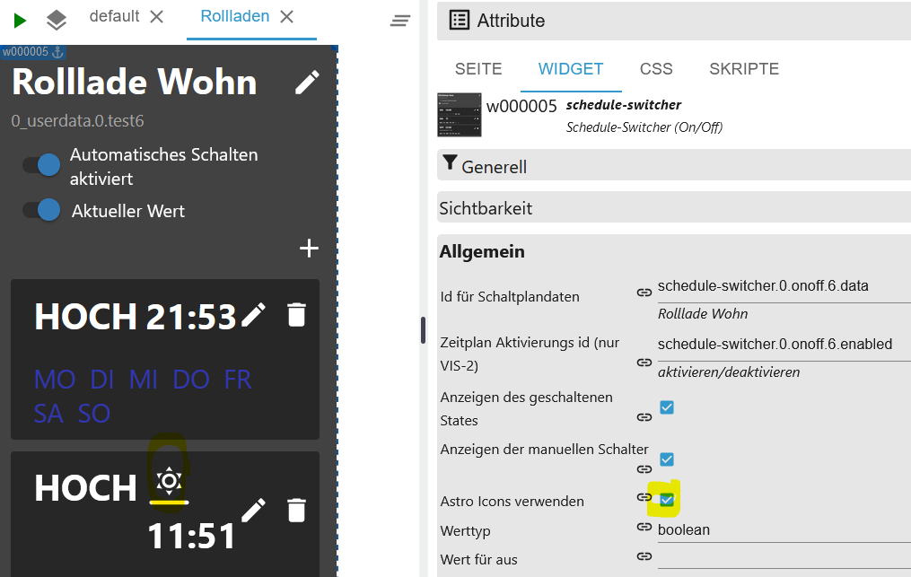

# IoBroker.schedule-switcher
[Вернуться к README](/README.md)

# Введение
Этот адаптер позволяет пользователям включать/выключать устройства по расписаниям.

Расписания можно полностью настроить с помощью виджета Vis или Vis 2.

Расписание переключает одно или несколько состояний ioBroker и состоит из одного или нескольких триггеров, которые определяют, когда и как должно меняться состояние.

Вы можете настроить время и дни недели срабатывания триггера. Также можно создавать астротриггеры и обратные отсчёты.

# Краткое содержание
- [Настройки экземпляра](#instance-setting-schedule-switcher)
- [Объекты](#состояния)
- [Пример событий триггера в формате JSON](#example-triggerevents-json)
- [Пример триггера в формате JSON](#example-trigger-json)
- [Пример sendTo триггера только для экспертов](#example-trigger-with-sendto-create-or-edit-experts)
- [Пример виджета в формате JSON](#example-widgets-json)
- [Пример истории в формате JSON](#example-history-json)
- [Создать виджет](#create-widget)
- [Изменить имя](#name-change)
- [Добавить условия](#add-condition)
- [Заменить текст](#replace-text)
- [Настройки CSS](#css-apply-description-see-css)
- [Иконки и пути CSS](#icon-sizes-and-custom-icons)
- [Создать триггер](#trigger)
- [Создать астротриггер](#astro-trigger)
- [Создать одноразовый триггер](#one-time-trigger)
- [Астро-иконки](#astro-icons)
- [Обзор виджетов](#html-overview-of-widgets)
- [настройка HTML](#html-for-vis-and-vis-2)
- [HTML-функция ТОЛЬКО VIS-2](#function-only-for-vis-2)
- [CSS](#css)

### Настройка экземпляра расписания-переключателя
[Краткое содержание](#zusammenfassung)

- `+ знак`: Добавить новое расписание
- `Идентификатор данных схемы`: Созданные объекты
- `Имя`: Имя виджета
- `Количество триггеров`: Количество триггеров
- `Активный`: Активный
- `Удалить`: Удалить расписание
- `Задержка между 2 операциями переключения в мс`: предотвращает одновременную установку состояний
- `История переключений в формате JSON (макс. 100/0 для выключения)` Максимальное количество хранимых историй
- `Создать HTML для VIS и VIS-2 (VIS-2 см. описание)` Обзор HTML активации

</br> 

### Штаты
[Краткое содержание](#zusammenfassung)

- вкл.выкл.
- `schedule-switcher.0.onoff.6.data` Все триггеры в формате JSON
- `schedule-switcher.0.onoff.6.enabled` Активен или Неактивен
- `schedule-switcher.0.onoff.6.views` Где были созданы виджеты для объектов?
- Статус
- `schedule-switcher.0.counterTrigger` Количество триггеров (активных и неактивных)
- `schedule-switcher.0.history` История схем
- `schedule-switcher.0.nextEvents` Следующие операции переключения в виде таблицы JSON
- `schedule-switcher.0.sendto` В VIS-2 изменения передаются адаптеру через этот объект.
- `schedule-switcher.0.widgetOverview` Обзор всех виджетов для поиска ошибок


# Пример событий триггера JSON
[Краткое содержание](#zusammenfassung)

```json
[
    {
        "type": "TimeTrigger", // TimeTrigger, AstroTrigger oder OneTimeTrigger
        "name": "Rollloade Wohn", // Name
        "triggerid": 0, // Trigger ID
        "action": "OnOffStateAction", // OnOffStateAction oder Condition
        "states": ["0_userdata.0.test", "0_userdata.0.test5"], // States
        "active": true, // enabled true oder false
        "hour": 16, // Stunde
        "minute": 22, // Minute
        "day": 6, // Tag
        "valueCheck": false, // States vergleichen
        "dateISO": "2024-11-09T15:22:00.000Z", // Zeit ohne Zeitzone
        "timestamp": 1731165720000, // Timestamp ohne Zeitzone
        "objectId": 1 // ObejektId schedule-switcher.0.onoff.<objectid>.data
    }
]
```

# Пример триггера JSON
[Краткое содержание](#zusammenfassung)

```json
{
    "type": "OnOffSchedule",
    "name": "Rolllade Wohn", // Name vom letzten erstellte Widget
    "active": false, // Alle 24h wird geprüft, ob es ein Widget gibt. Wird keins gefunden wird der Zeitplan deaktiviert. Mit TRUE wird nicht deaktiviert.
    "onAction": {
        // Action für On
        "type": "OnOffStateAction",
        "valueType": "number",
        "onValue": 0,
        "offValue": 100,
        "booleanValue": true,
        "idsOfStatesToSet": ["0_userdata.0.test4"] // States max. 10
    },
    "offAction": {
        // Action für Off
        "type": "OnOffStateAction",
        "valueType": "number",
        "onValue": 0,
        "offValue": 100,
        "booleanValue": false,
        "idsOfStatesToSet": ["0_userdata.0.test4"] // States max. 10
    },
    "triggers": [
        {
            "type": "AstroTrigger", // Trigger - AstroTrigger - OneTimeTrigger
            "astroTime": "sunrise",
            "shiftInMinutes": 0,
            "weekdays": [1, 2, 3, 4, 5, 6],
            "valueCheck": false,
            "id": "0",
            "action": {
                "type": "ConditionAction",
                "condition": {
                    "type": "StringStateAndConstantCondition",
                    "constant": "true",
                    "stateId": "0_userdata.0.test",
                    "sign": "=="
                },
                "action": {
                    "type": "OnOffStateAction",
                    "name": "On"
                }
            }
        }
    ]
}
```

# Примеры виджетов JSON
[Краткое содержание](#zusammenfassung)

```json
{
    "vis-2.0": {
        // Welche VIS Version
        "main": {
            // Projekt
            "w000005": {
                // Widget ID
                "prefix": "main", // Projekt
                "namespace": "vis-2.0", // Welche VIS Version
                "view": "Rollladen", // Welche View
                "widgetId": "w000005", // Widget ID
                "newId": "schedule-switcher.0.onoff.6.data", // Neues Objekt
                "oldId": "timer-switch.0.onoff.1.data", // Altes Objekt
                "enabled": "schedule-switcher.0.onoff.6.enabled", // Enabled Objekt
                "stateCount": 1, // Counter Zustände
                "state": [
                    // Zustände
                    {
                        "oid-stateId1": "0_userdata.0.test5"
                    }
                ],
                "conditionCount": 1, // Counter Bedingung
                "condition": [
                    // Zustände Bedingungen
                    {
                        "oid-conditionStateId1": "0_userdata.0.test"
                    }
                ],
                "valueType": "number", // Wertetyp
                "offValue": "100", // Wert für An - Fehlt wenn nicht gesetzt
                "onValue": "0", // Wert für Aus - Fehlt wenn nicht gesetzt
                "newOff": "Hoch", // Ersetzt AN - Fehlt wenn nicht gesetzt
                "newOn": "Runter" // Ersetzt AUS - Fehlt wenn nicht gesetzt
            },
            "w000006": {
                // Widget ID
                "prefix": "main", // Projekt
                "namespace": "vis-2.0", // Welche VIS Version
                "view": "Test", // Welche View
                "widgetId": "w000006", // Widget ID
                "newId": "schedule-switcher.0.onoff.6.data", // Neues Objekt
                "oldId": "timer-switch.0.onoff.1.data", // Altes Objekt
                "enabled": "schedule-switcher.0.onoff.6.enabled", // Enabled Objekt
                "stateCount": 1, // Counter Zustände
                "state": [
                    // Zustände
                    {
                        "oid-stateId1": "0_userdata.0.test4"
                    }
                ],
                "conditionCount": 1, // Counter Bedingung
                "condition": [], // Zustände Bedingungen
                "valueType": "boolean" // Wertetyp
            }
        }
    }
}
```

# Пример: Создание или редактирование триггера с помощью sendTo (эксперты)
[Краткое содержание](#zusammenfassung)

```JSON
sendTo("schedule-switcher.0", "add-trigger", { // Neuen Auslöser anlegen
    "dataId":"schedule-switcher.0.onoff.6.data",
    "triggerType":"TimeTrigger",
    "actionType":"OnOffStateAction"
});

sendTo("schedule-switcher.0", "update-trigger", { // Aktion für den neuen Auslöser festlegen
    "dataId":"schedule-switcher.0.onoff.6.data",
    "trigger":{
        "type":"TimeTrigger",
        "hour":12,
        "minute":32,
        "weekdays":[1,2,3,4,5],
        "valueCheck": false,
        "id":"0", // ID abgleichen
        "action":{
            "type":"OnOffStateAction",
            "name":"On"
        }
    }
});

sendTo("schedule-switcher.0", "add-trigger", { // Neuen Astrotrigger anlegen
    "dataId":"schedule-switcher.0.onoff.6.data",
    "triggerType":"AstroTrigger",
    "actionType":"OnOffStateAction"
});

sendTo("schedule-switcher.0", "update-trigger", { // Aktion für den neuen Auslöser festlegen
    "dataId":"schedule-switcher.0.onoff.6.data",
    "trigger":{
        "type":"AstroTrigger",
        "astroTime":"sunrise", // sunrise, sunset or solarNoon
        "shiftInMinutes":0,
        "weekdays":[1,2,3,4,5],
        "valueCheck": false,
        "id":"0", // ID abgleichen
        "action":{
            "type":"OnOffStateAction",
            "name":"On"
        }
    }
});

sendTo("schedule-switcher.0", "disable-schedule", { // Auslöser deaktivieren
    "dataId":"schedule-switcher.0.onoff.6.data"
});

sendTo("schedule-switcher.0", "enable-schedule", { // Auslöser aktivieren
    "dataId":"schedule-switcher.0.onoff.6.data"
});

sendTo("schedule-switcher.0", "add-one-time-trigger", { // Einmalauslöser anlegen
    "dataId":"schedule-switcher.0.onoff.6.data",
    "trigger":"{\"type\":\"OneTimeTrigger\",\"date\":\"2024-10-17T06:14:22.660Z\",\"valueCheck\": false,\"timedate\":false,\"action\":{\"type\":\"OnOffStateAction\",\"name\":\"On\"}}"
});

sendTo("schedule-switcher.0", "delete-trigger", { // Auslöser mit bekannter ID löschen
    "dataId":"schedule-switcher.0.onoff.6.data",
    "triggerId":"0"
});

sendTo("schedule-switcher.0", "change-active", { // Zeitplan ohne Widget aktiv lassen (wird bei restart oder alle 24h geprüft)
    "dataId":"schedule-switcher.0.onoff.6.data",
    "active":false, // false: Automatische Deaktivierung wenn kein Widget vorhanden ist
});

sendTo("schedule-switcher.0", "change-active", { // Zeitplan ohne Widget aktiv lassen (wird bei restart oder alle 24h geprüft)
    "dataId":"schedule-switcher.0.onoff.6.data",
    "active":true, // true: Zeitplan wird nicht deaktiviert wenn kein Widget vorhanden ist
});
```

# Пример истории JSON
[Краткое содержание](#zusammenfassung)

```JSON
[
  {
    "setObjectId": "0_userdata.0.test4",
    "objectId": 0,
    "actualValue": true,
    "oldValue": false,
    "checkValue": false,
    "object": "0_userdata.0.test4",
    "trigger": "TimeTrigger",
    "astroTime": "unknown",
    "shiftInMinutes": 0,
    "date": 0,
    "hour": 20,
    "minute": 48,
    "weekdays": [
      [
        1,
        2,
        3,
        4,
        5,
        6,
        0
      ]
    ],
    "timestamp": 1761384780017,
    "dateTime": "2025-10-25T09:33:00.017Z",
    "dateTimeWithTimezone": "2025-10-25T11:33:00.017Z"
  },
  {
    "setObjectId": "0_userdata.0.test4",
    "objectId": 0,
    "actualValue": true,
    "oldValue": false,
    "checkValue": false,
    "object": "0_userdata.0.test4",
    "astroTime": "unknown",
    "shiftInMinutes": 0,
    "date": 0,
    "hour": 20,
    "minute": 47,
    "weekdays": [
      [
        1,
        2,
        3,
        4,
        5,
        6,
        0
      ]
    ],
    "timestamp": 1761383520527,
    "dateTime": "2025-10-25T09:12:00.527Z",
    "dateTimeWithTimezone": "2025-10-25T11:12:00.527Z"
  }
]
```

# Пример представления виджета JSON
[Краткое содержание](#zusammenfassung)

```json
{
    "vis-2.0": {
        "main": {
            "w000004": {
                "prefix": "main", // Projekt
                "namespace": "vis-2.0", // VIS
                "view": "default", // View
                "widgetId": "w000004", // Widget ID
                "newId": "schedule-switcher.0.onoff.3.data" // Objekt ID
            }
        }
    },
    "vis.0": {
        "main": {
            "w00001": {
                "prefix": "main",
                "namespace": "vis.0",
                "view": "Rollo",
                "widgetId": "w00001",
                "newId": "schedule-switcher.0.onoff.3.data"
            }
        }
    }
}
```

### Создать виджет
[Краткое содержание](#zusammenfassung)

- Вставить виджет в представление


- Выберите идентификатор для схематических данных
- Выберите идентификатор активации расписания
- Выберите идентификатор переключенного состояния (макс. 10 возможных)


- Определите тип значения и значения, которые необходимо установить.


- Теперь создайте схему цепи.


### Изменить имя
[Краткое содержание](#zusammenfassung)

- Изменить имена. Это также будет применено к объектам.


### Добавить условие
[Краткое содержание](#zusammenfassung)

- Установите условие.


### Заменить текст
[Краткое содержание](#zusammenfassung)

- Включение/выключение текста и всего остального

 

### Применить CSS [См. CSS для описания.](#css)
[Краткое содержание](#zusammenfassung)

- Используйте `enable CSS` для настройки стиля</br>

</br> </br> </br> </br> </br> </br> </br> </br> 

### Размеры иконок и пользовательские иконки
[Краткое содержание](#zusammenfassung)


Для пути к вашим пользовательским значкам не нужно активировать `CSS aktivieren`. Если у вас уже есть виджеты, необходимо один раз изменить расширение файла; в противном случае атрибут не будет создан. То же самое относится к настройкам ширины/высоты.

Значки можно загрузить или скопировать в отдельный каталог.

Пример пути с использованием `Dateien`:

- http://192.168.2.18:8081/files/0_userdata.0/
- /opt/iobroker/iobroker-data/files/0_userdata.0/

Или отдельный каталог.

- /home/iobroker/<моя_папка>/

Виджеты должны быть названы следующим образом. ВСЕ иконки должны быть размещены в каталоге:

| Значок | Имя файла |
| ------------------------------------------------------------------------------------------- | --------------------- |
|  | восход солнца |
|  | закат |
|  | восход солнцаКонец |
|  | goldenHourEnd |
|  | goldenHour |
|  | sunsetStart |
|  | сумерки |
|  | nauticalDusk |
|  | ночь |
|  | надир |
|  | nightEnd |
|  | nauticalDawn |
|  | рассвет |
|  | добавить |
|  | отменить |
|  | редактировать |
|  | удалить |
|  | один раз |
|  | remove_circle_outline |
|  | сохранить |
|  | время |
|  | valueCheck |
|  | значениеNoCheck |
|  | неизвестно |
|  | неизвестный |


### Курок
[Краткое содержание](#zusammenfassung)

- Нажмите на карандаш, чтобы ввести время, или на корзину, чтобы удалить триггер.


- Выберите состояние переключения
- Выберите условие (необязательно)
- Устанавливайте значение только в том случае, если оно неравно
- Введите время (чч:мм)

```:warning:
 ⚠ Zeigt in Firefox kein Uhrzeit-Feld an!
```


- Выберите будний день
- Нажмите «Сохранить» в правом верхнем углу.


- Полный


### Астротриггер
[Краткое содержание](#zusammenfassung)

- Нажмите на карандаш, чтобы выбрать астрономическое время, или на корзину, чтобы удалить триггер.


- Выберите состояние переключения
- Выберите условие (необязательно)
- Устанавливайте значение только в том случае, если оно неравно
- Выберите астрономическое время (восход, закат или полдень)


- Введите смещение в минутах (необязательно)
- Выберите будний день
- Нажмите «Сохранить» в правом верхнем углу.


- Полный


### Астро-иконки
[Краткое содержание](#zusammenfassung)

| Значок | Описание |
| --------------------------------------------------------------------------------- | ------------- |
|  | восход солнца |
|  | закат |
|  | восход солнцаКонец |
|  | goldenHourEnd |
|  | goldenHour |
|  | sunsetStart |
|  | сумерки |
|  | nauticalDusk |
|  | ночь |
|  | надир |
|  | nightEnd |
|  | nauticalDawn |
|  | рассвет |
|  | рассвет |

### Одноразовый триггер
[Краткое содержание](#zusammenfassung)

- Выберите состояние переключения
- Выберите условие (необязательно)
- Устанавливайте значение только в том случае, если оно неравно
- Введите время (чч:мм:сс)
- Нажмите «Сохранить» в правом верхнем углу.


- Полный


- Выберите состояние переключения
- Выберите условие (необязательно)
- Устанавливайте значение только в том случае, если оно неравно
- Введите/выберите время (дд.мм.гггг чч:мм:сс)
- Нажмите «Сохранить» в правом верхнем углу.

```:warning:
 ⚠ Zeigt in Firefox kein Uhrzeit-Feld an!
```

</br> 

- Полный


### HTML-обзор виджетов
[Краткое содержание](#summary)


### HTML для VIS и VIS-2
[Краткое содержание](#zusammenfassung)

- `html.background_color_body` Цвет фона тела. Для VIS применяется ко всему телу; для VIS-2 — только к виджету. Значение по умолчанию: #000000
- `html.background_color_even` Триггер цвета фона для четного числа - По умолчанию #1E1E1E
- `html.background_color_odd` Нечетное число триггеров цвета фона - По умолчанию #18171C
- `html.background_color_trigger` Объект триггера цвета фона - По умолчанию #000000
- `html.background_color_weekdays_hover` Цвет фона при наведении курсора на дни недели - Щелкните, чтобы включить/выключить - По умолчанию синий
- `html.column_align_01` Выравнивание текста заголовка, столбец 1 - По центру по умолчанию
- `html.column_align_02` Выравнивание текста заголовка, столбец 2 - По центру по умолчанию
- `html.column_align_03` Выравнивание текста заголовка, столбец 3 - По центру по умолчанию
- `html.column_align_04` Выравнивание текста заголовка, столбец 4 - По центру по умолчанию
- `html.column_align_05` Выравнивание текста заголовка, столбец 5 - По центру по умолчанию
- `html.column_align_06` Выравнивание текста заголовка, столбец 6 - По центру по умолчанию
- `html.column_align_07` Выравнивание текста заголовка, столбец 7 - По центру по умолчанию
- `html.column_align_08` Выравнивание текста заголовка, столбец 8 - По центру по умолчанию
- `html.column_align_09` Выравнивание текста заголовка, столбец 9 - По центру по умолчанию
- `html.column_align_10` Выравнивание текста заголовка по столбцу 10 - По центру по умолчанию
- `html.column_text_01` Текст заголовка столбца 1 - Стандартное расписание
- `html.column_text_02` Текст заголовка столбца 2 - Стандартные устройства
- `html.column_text_03` Текст заголовка столбца 3 - Стандартный переключатель
- `html.column_text_04` Текст заголовка столбца 4 - Стандартный понедельник
- `html.column_text_05` Текст заголовка столбца 5 - Стандартный Tu
- `html.column_text_06` Текст заголовка столбца 6 - Стандартный Мы
- `html.column_text_07` Текст заголовка столбца 7 - Стандартный
- `html.column_text_08` Текст заголовка столбца 8 - Стандартная пятница
- `html.column_text_09` Текст заголовка столбца 9 - Стандартный Sa
- `html.column_text_10` Текст заголовка столбца 10 - Стандартный
- `html.column_width_01` Ширина столбца 1 - По умолчанию авто
- `html.column_width_02` Ширина столбца 2 - По умолчанию авто
- `html.column_width_03` Ширина столбца 3 - По умолчанию авто
- `html.column_width_04` Ширина столбца 4 - По умолчанию авто
- `html.column_width_05` Ширина столбца 5 - По умолчанию авто
- `html.column_width_06` Ширина столбца 6 - По умолчанию авто
- `html.column_width_07` Ширина столбца 7 - По умолчанию авто
- `html.column_width_08` Ширина столбца 8 - По умолчанию авто
- `html.column_width_09` Ширина столбца 9 - По умолчанию авто
- `html.column_width_70` Ширина столбца 10 - По умолчанию авто
- `html.font_color_text_disabled` Цвет текста отключенного объекта — по умолчанию красный
- `html.font_color_text_enabled` Цвет текста активированного объекта — по умолчанию желтый
- `html.font_color_weekdays_disabled` Цвет текста отключенных дней недели — по умолчанию красный
- `html.font_color_weekdays_enabled` Цвет текста включенных дней недели — по умолчанию желтый
- поле заголовка `html.header_border` в пикселях - по умолчанию 2
- `html.header_font_family` Семейство шрифтов заголовков - По умолчанию Helvetica
- `html.header_font_size` Размер шрифта заголовка - По умолчанию 15
- `html.header_linear_color_1` Фоновое изображение заголовка: линейный градиент 1 - По умолчанию #BDBDBD
- `html.header_linear_color_2` Фоновое изображение заголовка: Линейный градиент 2 — По умолчанию #BDBDBD
- `html.header_tag_border_color` HTML-тег заголовка`<td> ` Цвет границы - по умолчанию #424242
- `html.header_width` тег заголовка`<table> Стандартный размер автомобиля
- `html.column_align_row_01` Выравнивание текста строк в столбце 1 - По умолчанию слева
- `html.column_align_row_02` Выравнивание текста строк в столбце 2 - По умолчанию слева
- `html.column_align_row_03` Выравнивание текста строк в столбце 3 - По умолчанию слева
- `html.column_align_row_04` Выравнивание текста строк в столбце 4 - По умолчанию слева
- `html.column_align_row_05` Выравнивание текста строк в столбце 5 - По умолчанию слева
- `html.column_align_row_06` Выравнивание текста строк в столбце 6 - По умолчанию слева
- `html.column_align_row_07` Выравнивание текста строк в столбце 7 - По умолчанию слева
- `html.column_align_row_08` Выравнивание текста строк в столбце 8 - По умолчанию слева
- `html.column_align_row_09` Выравнивание текста строк в столбце 9 - По умолчанию слева
- `html.column_align_row_10` Выравнивание текста строк в столбце 10 - По умолчанию слева
- `html.headline_color` Цвет шрифта заголовка (расписание, устройство ...) - По умолчанию #ffffff
- `html.headline_font_size` Размер шрифта заголовка в пикселях - По умолчанию 16
- `html.headline_height` Высота строки заголовка в пикселях - По умолчанию 35
- `html.headline_underlined` Нижнее поле заголовка в пикселях - По умолчанию 3
- `html.headline_underlined_color` Цвет нижней границы заголовка - По умолчанию #ffffff
- `html.headline_weight` Насыщенность шрифта заголовка — Стандартный нормальный
- `html.html_code` HTML-код для VIS, VIS-2, Jarvis, IQontrol и т. д.
- `html.icon_false` Значок переключения состояния выкл. - По умолчанию ⚪
- `html.icon_state_check_no` Сравнение статусов отключено 🔴
- `html.icon_state_check_yes` Сравнение состояний включено 🟢
- `html.icon_switch_symbol` Значок переключателя для включения/выключения таймера - По умолчанию ⏱
- `html.icon_true` Значок переключателя состояния включен - По умолчанию 🟡
- `html.jarvis` Совместимо с Jarvis - Значение по умолчанию: false
- `html.p_tag_text_algin` HTML `<p> Выравнивание текста (последнее обновление и нижний колонтитул) — по центру по умолчанию
- `html.table_tag_border_color` Цвет границы тега `<table> ` - Стандарт № 424242
- `html.table_tag_cell` граничное расстояние от ТЕГА `<table> ` в пикселях - Стандарт 6
- `html.table_tag_text_align` Выравнивание текста тега `<table> ` - Стандартный центр
- `html.table_tag_width` Размер ТЕГА `<table> ` - Стандартный авто
- `html.td_tag_border_bottom` нижний край тега `<td> ` в пикселях - Стандарт 1
- `html.td_tag_border_color` Цвет нижней границы тега `<td> ` - Стандарт № 424242
- `html.td_tag_border_right` граница справа от тега `<td> ` в пикселях - Стандарт 1
- `html.td_tag_cell` Пространство вокруг текста ТЕГА `<td> ` в пикселях (отступ) - по умолчанию 6
- `html.top_font_family` Семейство шрифтов для верхнего и нижнего колонтитула - Стандартная Helvetica
- `html.top_font_size` Размер шрифта верхнего и нижнего колонтитула в пикселях - По умолчанию 20
- `html.top_font_weight` Толщина шрифта верхнего и нижнего колонтитулов — по умолчанию «нормальная»
- `html.top_text` Пользовательский текст для заголовка - Стандартный ваш текст
- `html.top_text_color` Цвет шрифта верхнего и нижнего колонтитула - По умолчанию #ffffff
- `html.update` Запустить ручное обновление


- Создайте HTML-виджет и введите объект `{schedule-switcher.0.html.html_code}` в HTML.
- Щелкните текст «Последнее обновление», чтобы выполнить обновление вручную.
- Нажмите на значок, чтобы активировать/деактивировать виджет.
- Чтобы удалить триггер, необходимо сначала установить флажок, а затем нажать кнопку «удалить».
- Измените время/астрономические данные и нажмите кнопку «сохранить», чтобы применить изменения.
- Нажмите на день недели, чтобы активировать/деактивировать его.
- В строке имени триггера отображается следующее событие включения/выключения по дням недели.


### Функция ТОЛЬКО для VIS-2!!!
[Краткое содержание](#zusammenfassung)

ТОЛЬКО при использовании VIS-2 перечисленные ниже функции необходимо вставлять вручную (см. изображения).

</br> 

```java
function deleteTrigger(stateId, command, id, dataid, count) {
    var checked = document.getElementById('delete' + count).checked;
    if (checked) {
        var data = {
			"command": command,
			"message": {
				"triggerId": id,
				"dataId": dataid,
			}
		};
		vis.conn.setState(stateId + '.sendto', { val: JSON.stringify(data), ack: false });
	}
}
function changeweekdays(stateId, command, dataid, id, changeid, type) {
    if (type === "OneTimeTrigger") return;
    var data = {
		"command": command,
		"message": {
			"changeid": changeid,
			"triggerid": id,
			"dataid": dataid
		}
    };
	vis.conn.setState(stateId + '.sendto', { val: JSON.stringify(data), ack: false });
}
function changeValueCheck(stateId, command, dataid, id, value) {
    var data = {
		"command": command,
		"message": {
            "changeval": value,
            "triggerid": id,
            "dataid": dataid
		}
    };
    vis.conn.setState(stateId + '.sendto', { val: JSON.stringify(data), ack: false });
}
function updateTrigger(stateId) {
	vis.conn.setState(stateId + '.html.update', { val: true, ack: false });
}
function setState(stateId, value) {
	vis.conn.setState(stateId, { val: value == 'false' ? false : true, ack: false });
}
function sendToAstro(stateId, command, dataid, id, count) {
    var timeselect = document.getElementById('timeselect' + count).value;
    var shift = document.getElementById('shift' + count).value;
    var data = {
		"command": command,
		"message": {
			"astrotime": timeselect,
			"shift": shift,
			"triggerid": id,
			"dataid": dataid
		}
    };
	vis.conn.setState(stateId + '.sendto', { val: JSON.stringify(data), ack: false });
}
function sendToDateTime(stateId, command, id, dataid, count) {
    var value = document.getElementById('datetime' + count).value;
    var data = {
		"command": command,
		"message": {
			"time": value,
			"triggerid": id,
			"dataid": dataid
		}
    };
	vis.conn.setState(stateId + '.sendto', { val: JSON.stringify(data), ack: false });
}
function sendToTime(stateId, command, id, dataid, count) {
    var value = document.getElementById('nexttime' + count).value;
    var data = {
		"command": command,
		"message": {
			"time": value,
			"triggerid": id,
			"dataid": dataid
		}
    };
	vis.conn.setState(stateId + '.sendto', { val: JSON.stringify(data), ack: false });
}
```

### CSS
[Краткое содержание](#zusammenfassung)

```
app-on-off-schedules-widget {
    /* Primary color (button background, toggle switch color) */
    --ts-widget-primary-color: #337ab7;

    /* Background color of the widget */
    --ts-widget-bg-color: #424242;
    /* Background color of the triggers */
    --ts-widget-trigger-bg-color: #272727;

    /* Foreground color (font color and scrollbar color) */
    --ts-widget-fg-color: white;
    /* Font color of the switched states id */
    --ts-widget-oid-fg-color: #a5a5a5;
    /* Font color in buttons */
    --ts-widget-btn-fg-color: white;
    /* Font color of a disabled weekday */
    --ts-widget-weekdays-disabled-fg-color: #5D5D5D;
    /* Font color of an enabled weekday */
    --ts-widget-weekdays-enabled-fg-color: white;
    /* Font color of the name of the widget (defaults to --ts-widget-fg-color) */
    --ts-widget-name-fg-color: white;
    /* Font color of switched time (defaults to --ts-widget-fg-color) */
    --ts-widget-switched-time-fg-color: white;
    /* Font color of switched value (defaults to --ts-widget-fg-color)*/
    --ts-widget-switched-value-fg-color: white;
    /* Font color of the astro time (defaults to --ts-widget-fg-color) */
    --ts-widget-astro-time-fg-color: black;
    /* Font color of the astro time's shift */
    --ts-widget-astro-shift-fg-color: #5d5d5d;
    /* Font color of condition (defaults to --ts-widget-fg-color) */
    --ts-widget-condition-fg-color: white;
    /* Font color of toogle button off */
    --ts-widget-off-color: #c0c0c0;
    /* Color background toogle button off */
    --ts-widget-off-color-container: #808080;
    /* Color of next astro switching time */
    --ts-widget-astro-next-fg-color: white;

    /* Font family used in the whole widget */
    --ts-widget-font-family: 'Roboto', 'Segoe UI', BlinkMacSystemFont, system-ui, -apple-system;
    /* Font size of the name of the widget */
    --ts-widget-name-font-size: 2em;
    /* Font size of the switched oid */
    --ts-widget-oid-font-size: 30px;
    /* Font size of switch text */
    --ts-widget-state-action-width: 65px;
    /* Font size of next astro switching time */
    --ts-widget-astro-next-font-size: 2em;
    /* Width of date time input */
    --ts-widget-datetime-width: 230px;

    /* Display of edit name button. Use 'none' to hide the button and 'block' to show it
    --ts-widget-edit-name-button-display: block;
    /* Display of condition. Use 'none' to hide the condition and 'block' to show it
    -ts-widget-condition-display: block;
    /* Display of time icon. Use 'none' to hide the button and 'block' to show it
    --ts-widget-time-icon-display: none;

    /* Applies a filter to icons used in buttons (safe, edit, remove, cancel), for
       white use invert(1) and for black invert(0) */
    --ts-widget-img-btn-filter: invert(1);

    /* Add trigger dropdown background color */
    --ts-widget-add-trigger-dropdown-bg-color: #f1f1f1;
    /* Add trigger dropdown font color */
    --ts-widget-add-trigger-dropdown-fg-color: black;
    /* Add trigger dropdown hover background color */
    --ts-widget-add-trigger-dropdown-hover-bg-color: #ddd;

    /* ! Changing these may break the layout, change at your own risk */

    /* Font size of weekdays */
    --ts-widget-weekdays-font-size: 23px;
    /* Font size of switched value (on/off) */
    --ts-widget-switched-value-font-size: 2em;
    /* Font size of switched time */
    --ts-widget-switched-time-font-size: 2em;
    /* Font size of the astro time (e.g. Sunrise, ...) */
    --ts-widget-astro-time-font-size: 1.5em;
    /* Font size of the astro time's shift */
    --ts-widget-astro-shift-font-size: 1em;
    /* Font size of condition */
    --ts-widget-condition-font-size: 1em;

    /* Icons width and height in px */

    /* Astro icons */
    --ts-widget-astro-icon-width, 42px;
    --ts-widget-astro-icon-height, 42px;
    /* Display icons (rename and add icon) */
    --ts-widget-display-icon-width, 28px;
    --ts-widget-display-icon-height, 28px;
    /* Trigger view icons */
    --ts-widget-trigger-view-icon-width, 28px;
    --ts-widget-trigger-view-icon-height, 28px;
    /* Trigger edit icons */
    --ts-widget-trigger-edit-icon-width, 28px;
    --ts-widget-trigger-edit-icon-height, 28px;
}
```

## Changelog

<!--
    Placeholder for the next version (at the beginning of the line):
    ### **WORK IN PROGRESS**
-->

### **WORK IN PROGRESS**

- (Lucky-ESA) Fixed warn log (Cannot read dir...)
- (Lucky-ESA) Added state comparison enabled/disabled
- (Lucky-ESA) Fixed small some bugs
- (Lucky-ESA) History JSON changed
- (Lucky-ESA) Using your own icons

### 0.0.12 (2025-08-27)

- (Lucky-ESA) Astro time in widget fixed

### 0.0.11 (2025-08-16)

- (Lucky-ESA) Admin 7.6.17 required
- (Lucky-ESA) Node 20 required

### 0.0.10 (2025-02-11)

- (Lucky-ESA) Dependencies updated
- (Lucky-ESA) Fixed: In the HTML overview, enabled / disabled does not work
- (Lucky-ESA) Fixed: Astrotime incorrectly
- (Lucky-ESA) Added: Current day in font weight bold

### 0.0.9 (2024-12-20)

- (Lucky-ESA) Fixed: Reading files from Redis database
- (Lucky-ESA) Added: Automatic deactivation control
- (Lucky-ESA) Fixed: Visibility
- (Lucky-ESA) Fixed: Bug in type check

### 0.0.8 (2024-12-07)

- (Lucky-ESA) Migration to ESLint9
- (Lucky-ESA) Bugfixes

## License

MIT License

Copyright (c) 2024-2025 Lucky_ESA <github@luckyskills.de>

Permission is hereby granted, free of charge, to any person obtaining a copy
of this software and associated documentation files (the "Software"), to deal
in the Software without restriction, including without limitation the rights
to use, copy, modify, merge, publish, distribute, sublicense, and/or sell
copies of the Software, and to permit persons to whom the Software is
furnished to do so, subject to the following conditions:

The above copyright notice and this permission notice shall be included in all
copies or substantial portions of the Software.

THE SOFTWARE IS PROVIDED "AS IS", WITHOUT WARRANTY OF ANY KIND, EXPRESS OR
IMPLIED, INCLUDING BUT NOT LIMITED TO THE WARRANTIES OF MERCHANTABILITY,
FITNESS FOR A PARTICULAR PURPOSE AND NONINFRINGEMENT. IN NO EVENT SHALL THE
AUTHORS OR COPYRIGHT HOLDERS BE LIABLE FOR ANY CLAIM, DAMAGES OR OTHER
LIABILITY, WHETHER IN AN ACTION OF CONTRACT, TORT OR OTHERWISE, ARISING FROM,
OUT OF OR IN CONNECTION WITH THE SOFTWARE OR THE USE OR OTHER DEALINGS IN THE
SOFTWARE.