# ioBroker.schedule-switcher

[Вернуться к файлу README](https://github.com/Lucky-ESA/ioBroker.schedule-switcher/blob/main/README.md)

# Введение

Этот адаптер позволяет пользователям включать/выключать устройства (100/0) с помощью расписаний. Расписания можно полностью настроить с помощью виджета Vis или Vis 2. Расписание переключает одно или несколько состояний ioBroker и состоит из одного или нескольких триггеров, определяющих, когда и как должно изменяться состояние. Вы можете настроить время и дни недели для каждого триггера. Также можно создавать астрономические триггеры и таймеры обратного отсчета.

# Краткое содержание

- [Настройки экземпляра](#instanz-einstellung-schedule-switcher)
- [объекты](#states)
- [Примеры событий-триггеров в формате JSON](#beispiel-triggerevents-json)
- [Пример триггера в формате JSON](#beispiel-auslöser-json)
- [Пример триггера sendTo (только для экспертов)](#beispiel-auslöser-mit-sendto-anlegen-oder-editieren-experten)
- [Пример виджета в формате JSON](#beispiel-widgets-json)
- [Пример истории в формате JSON](#beispiel-historie-json)
- [Создать виджет](#widget-anlegen)
- [Изменить имя](#namen-ändern)
- [Добавить условия](#bedingung-hinzufügen)
- [Заменить текст](#text-ersetzen)
- [Настройки CSS](#css-anwenden-beschreibung-siehe-css)
- [CSS-иконки и путь](#icongrößen-und-eigene-icons)
- [Создание триггеров](#trigger)
- [Создать Astrotrigger](#astro-trigger)
- [Создать одноразовый триггер](#one-time-trigger)
- [Астроиконы](#astro-icons)
- [Обзор виджетов](#html-übersicht-der-widgets)
- [Настройки HTML](#html-für-vis-und-vis-2)
- [Функция HTML ТОЛЬКО VIS-2](#function-nur-für-vis-2)
- [CSS](#css)

### Настройка экземпляра переключателя расписания

[Краткое содержание](#zusammenfassung)

- `+ Zeichen` Добавить новое расписание
- `Schaltplandaten Id` Созданные объекты
- `Name` : Название виджета
- `Anzahl Auslöser` Количество триггеров
- `Aktiv` Активный
- `Löschen` Удалить расписание
- `Verzögerung zwischen 2 Schaltvorgängen in ms` Предотвращает одновременную установку состояний.
- `Historie Umschaltung als JSON (max. 100/0 für Aus)` Максимальное хранение истории
- `HTML für VIS und VIS-2 erstellen (VIS-2 siehe Beschreibung)` Обзор активации HTML

  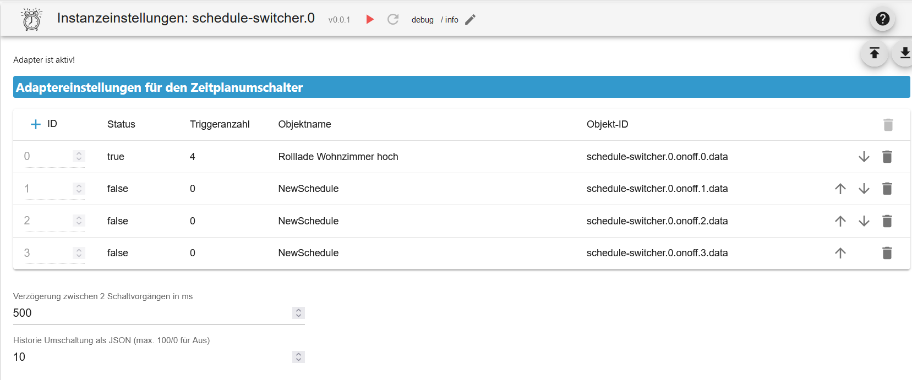</br>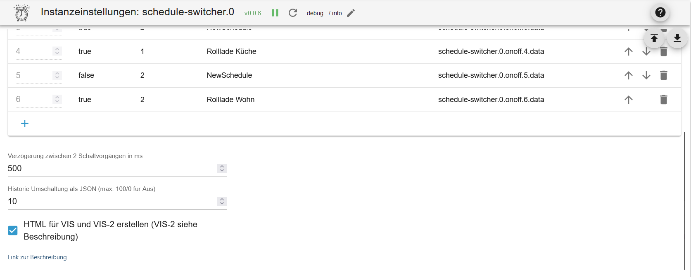

### Штаты

[Краткое содержание](#zusammenfassung)

- вкл/выкл
- `schedule-switcher.0.onoff.6.data` Все триггеры представлены в формате JSON.
- `schedule-switcher.0.onoff.6.enabled` Активный или неактивный
- `schedule-switcher.0.onoff.6.views` Где были созданы виджеты для этих объектов?
- статус
- `schedule-switcher.0.counterTrigger` Количество триггеров (активных и неактивных)
- `schedule-switcher.0.history` Историография цепей
- `schedule-switcher.0.nextEvents` Следующие операции переключения в виде таблицы JSON.
- `schedule-switcher.0.sendto` В VIS-2 изменения этого объекта передаются адаптеру.
- `schedule-switcher.0.widgetOverview` Обзор всех виджетов для поиска ошибок.

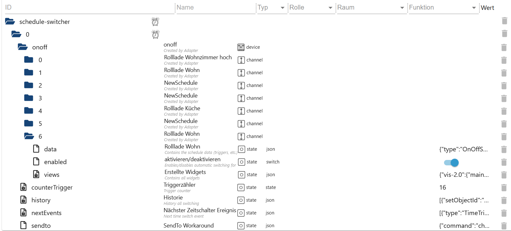

# Пример JSON-файлов событий-триггеров

[Краткое содержание](#zusammenfassung)

```json
[
    {
        "type": "TimeTrigger", // TimeTrigger, AstroTrigger oder OneTimeTrigger
        "name": "Rollloade Wohn", // Name
        "triggerid": 0, // Trigger ID
        "action": "OnOffStateAction", // OnOffStateAction oder Condition
        "states": ["0_userdata.0.test", "0_userdata.0.test5"], // States
        "active": true, // enabled true oder false
        "hour": 16, // Stunde
        "minute": 22, // Minute
        "day": 6, // Tag
        "valueCheck": false, // States vergleichen
        "dateISO": "2024-11-09T15:22:00.000Z", // Zeit ohne Zeitzone
        "timestamp": 1731165720000, // Timestamp ohne Zeitzone
        "objectId": 1 // ObejektId schedule-switcher.0.onoff.<objectid>.data
    }
]
```

# Пример JSON-файла триггера

[Краткое содержание](#zusammenfassung)

```json
{
    "type": "OnOffSchedule",
    "name": "Rolllade Wohn", // Name vom letzten erstellte Widget
    "active": false, // Alle 24h wird geprüft, ob es ein Widget gibt. Wird keins gefunden wird der Zeitplan deaktiviert. Mit TRUE wird nicht deaktiviert.
    "onAction": {
        // Action für On
        "type": "OnOffStateAction",
        "valueType": "number",
        "onValue": 0,
        "offValue": 100,
        "booleanValue": true,
        "idsOfStatesToSet": ["0_userdata.0.test4"] // States max. 10
    },
    "offAction": {
        // Action für Off
        "type": "OnOffStateAction",
        "valueType": "number",
        "onValue": 0,
        "offValue": 100,
        "booleanValue": false,
        "idsOfStatesToSet": ["0_userdata.0.test4"] // States max. 10
    },
    "triggers": [
        {
            "type": "AstroTrigger", // Trigger - AstroTrigger - OneTimeTrigger
            "astroTime": "sunrise",
            "shiftInMinutes": 0,
            "weekdays": [1, 2, 3, 4, 5, 6],
            "valueCheck": false,
            "id": "0",
            "action": {
                "type": "ConditionAction",
                "condition": {
                    "type": "StringStateAndConstantCondition",
                    "constant": "true",
                    "stateId": "0_userdata.0.test",
                    "sign": "=="
                },
                "action": {
                    "type": "OnOffStateAction",
                    "name": "On"
                }
            }
        }
    ]
}
```

# Пример JSON-файлов виджетов

[Краткое содержание](#zusammenfassung)

```json
{
    "vis-2.0": {
        // Welche VIS Version
        "main": {
            // Projekt
            "w000005": {
                // Widget ID
                "prefix": "main", // Projekt
                "namespace": "vis-2.0", // Welche VIS Version
                "view": "Rollladen", // Welche View
                "widgetId": "w000005", // Widget ID
                "newId": "schedule-switcher.0.onoff.6.data", // Neues Objekt
                "oldId": "timer-switch.0.onoff.1.data", // Altes Objekt
                "enabled": "schedule-switcher.0.onoff.6.enabled", // Enabled Objekt
                "stateCount": 1, // Counter Zustände
                "state": [
                    // Zustände
                    {
                        "oid-stateId1": "0_userdata.0.test5"
                    }
                ],
                "conditionCount": 1, // Counter Bedingung
                "condition": [
                    // Zustände Bedingungen
                    {
                        "oid-conditionStateId1": "0_userdata.0.test"
                    }
                ],
                "valueType": "number", // Wertetyp
                "offValue": "100", // Wert für An - Fehlt wenn nicht gesetzt
                "onValue": "0", // Wert für Aus - Fehlt wenn nicht gesetzt
                "newOff": "Hoch", // Ersetzt AN - Fehlt wenn nicht gesetzt
                "newOn": "Runter" // Ersetzt AUS - Fehlt wenn nicht gesetzt
            },
            "w000006": {
                // Widget ID
                "prefix": "main", // Projekt
                "namespace": "vis-2.0", // Welche VIS Version
                "view": "Test", // Welche View
                "widgetId": "w000006", // Widget ID
                "newId": "schedule-switcher.0.onoff.6.data", // Neues Objekt
                "oldId": "timer-switch.0.onoff.1.data", // Altes Objekt
                "enabled": "schedule-switcher.0.onoff.6.enabled", // Enabled Objekt
                "stateCount": 1, // Counter Zustände
                "state": [
                    // Zustände
                    {
                        "oid-stateId1": "0_userdata.0.test4"
                    }
                ],
                "conditionCount": 1, // Counter Bedingung
                "condition": [], // Zustände Bedingungen
                "valueType": "boolean" // Wertetyp
            }
        }
    }
}
```

# Пример: Создание или редактирование триггера с помощью функции sendTo (эксперты)

[Краткое содержание](#zusammenfassung)

```JSON
sendTo("schedule-switcher.0", "add-trigger", { // Neuen Auslöser anlegen
    "dataId":"schedule-switcher.0.onoff.6.data",
    "triggerType":"TimeTrigger",
    "actionType":"OnOffStateAction"
});

sendTo("schedule-switcher.0", "update-trigger", { // Aktion für den neuen Auslöser festlegen
    "dataId":"schedule-switcher.0.onoff.6.data",
    "trigger":{
        "type":"TimeTrigger",
        "hour":12,
        "minute":32,
        "weekdays":[1,2,3,4,5],
        "valueCheck": false,
        "id":"0", // ID abgleichen
        "action":{
            "type":"OnOffStateAction",
            "name":"On"
        }
    }
});

sendTo("schedule-switcher.0", "add-trigger", { // Neuen Astrotrigger anlegen
    "dataId":"schedule-switcher.0.onoff.6.data",
    "triggerType":"AstroTrigger",
    "actionType":"OnOffStateAction"
});

sendTo("schedule-switcher.0", "update-trigger", { // Aktion für den neuen Auslöser festlegen
    "dataId":"schedule-switcher.0.onoff.6.data",
    "trigger":{
        "type":"AstroTrigger",
        "astroTime":"sunrise", // sunrise, sunset or solarNoon
        "shiftInMinutes":0,
        "weekdays":[1,2,3,4,5],
        "valueCheck": false,
        "id":"0", // ID abgleichen
        "action":{
            "type":"OnOffStateAction",
            "name":"On"
        }
    }
});

sendTo("schedule-switcher.0", "disable-schedule", { // Auslöser deaktivieren
    "dataId":"schedule-switcher.0.onoff.6.data"
});

sendTo("schedule-switcher.0", "enable-schedule", { // Auslöser aktivieren
    "dataId":"schedule-switcher.0.onoff.6.data"
});

sendTo("schedule-switcher.0", "add-one-time-trigger", { // Einmalauslöser anlegen
    "dataId":"schedule-switcher.0.onoff.6.data",
    "trigger":"{\"type\":\"OneTimeTrigger\",\"date\":\"2024-10-17T06:14:22.660Z\",\"valueCheck\": false,\"timedate\":false,\"action\":{\"type\":\"OnOffStateAction\",\"name\":\"On\"}}"
});

sendTo("schedule-switcher.0", "delete-trigger", { // Auslöser mit bekannter ID löschen
    "dataId":"schedule-switcher.0.onoff.6.data",
    "triggerId":"0"
});

sendTo("schedule-switcher.0", "change-active", { // Zeitplan ohne Widget aktiv lassen (wird bei restart oder alle 24h geprüft)
    "dataId":"schedule-switcher.0.onoff.6.data",
    "active":false, // false: Automatische Deaktivierung wenn kein Widget vorhanden ist
});

sendTo("schedule-switcher.0", "change-active", { // Zeitplan ohne Widget aktiv lassen (wird bei restart oder alle 24h geprüft)
    "dataId":"schedule-switcher.0.onoff.6.data",
    "active":true, // true: Zeitplan wird nicht deaktiviert wenn kein Widget vorhanden ist
});
```

# Пример истории в формате JSON

[Краткое содержание](#zusammenfassung)

```JSON
[
  {
    "setObjectId": "0_userdata.0.test4",
    "objectId": 0,
    "actualValue": true,
    "oldValue": false,
    "checkValue": false,
    "object": "0_userdata.0.test4",
    "trigger": "TimeTrigger",
    "astroTime": "unknown",
    "shiftInMinutes": 0,
    "date": 0,
    "hour": 20,
    "minute": 48,
    "weekdays": [
      [
        1,
        2,
        3,
        4,
        5,
        6,
        0
      ]
    ],
    "timestamp": 1761384780017,
    "dateTime": "2025-10-25T09:33:00.017Z",
    "dateTimeWithTimezone": "2025-10-25T11:33:00.017Z"
  },
  {
    "setObjectId": "0_userdata.0.test4",
    "objectId": 0,
    "actualValue": true,
    "oldValue": false,
    "checkValue": false,
    "object": "0_userdata.0.test4",
    "astroTime": "unknown",
    "shiftInMinutes": 0,
    "date": 0,
    "hour": 20,
    "minute": 47,
    "weekdays": [
      [
        1,
        2,
        3,
        4,
        5,
        6,
        0
      ]
    ],
    "timestamp": 1761383520527,
    "dateTime": "2025-10-25T09:12:00.527Z",
    "dateTimeWithTimezone": "2025-10-25T11:12:00.527Z"
  }
]
```

# Пример представления виджета в формате JSON.

[Краткое содержание](#zusammenfassung)

```json
{
    "vis-2.0": {
        "main": {
            "w000004": {
                "prefix": "main", // Projekt
                "namespace": "vis-2.0", // VIS
                "view": "default", // View
                "widgetId": "w000004", // Widget ID
                "newId": "schedule-switcher.0.onoff.3.data" // Objekt ID
            }
        }
    },
    "vis.0": {
        "main": {
            "w00001": {
                "prefix": "main",
                "namespace": "vis.0",
                "view": "Rollo",
                "widgetId": "w00001",
                "newId": "schedule-switcher.0.onoff.3.data"
            }
        }
    }
}
```

### Создать виджет

[Краткое содержание](#zusammenfassung)

- Вставить виджет в представление

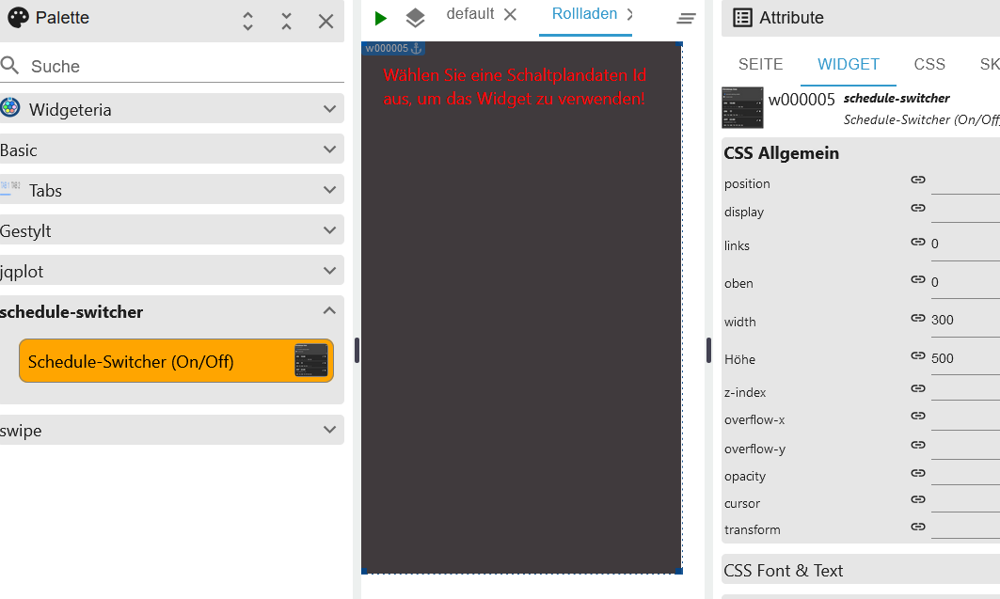

- Выберите идентификатор для получения схематических данных.
- Выберите идентификатор активации расписания
- Выберите идентификатор переключаемого состояния (максимум 10 вариантов).

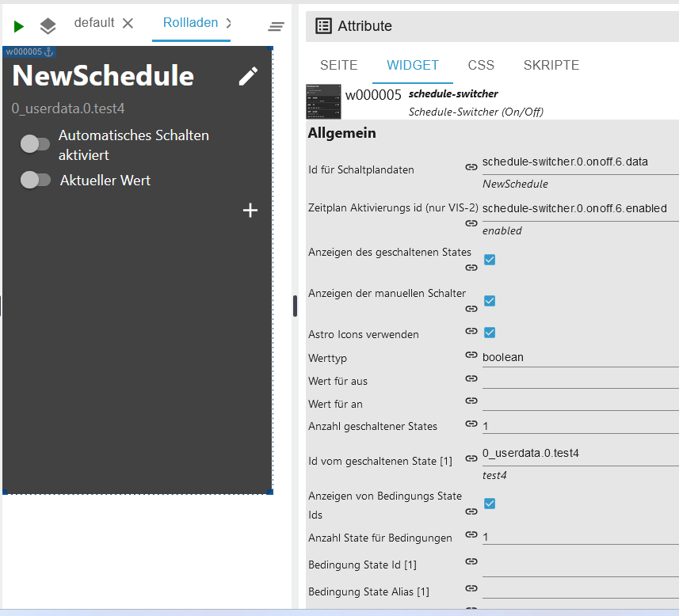

- Укажите тип значения и значения, которые необходимо установить.

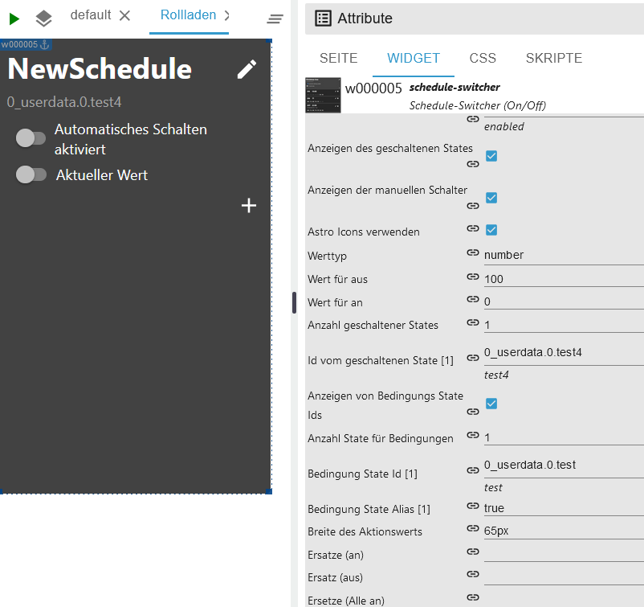

- Теперь создайте принципиальную схему.

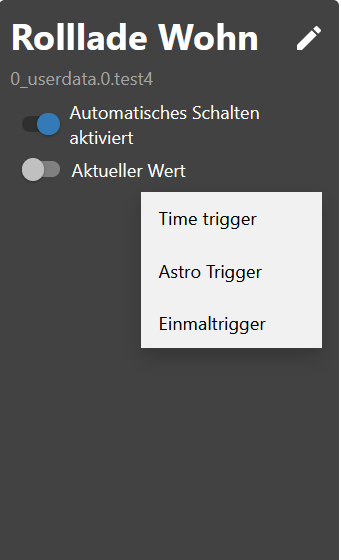

### Изменить имя

[Краткое содержание](#zusammenfassung)

- Изменение имени — это также будет применено к объектам.

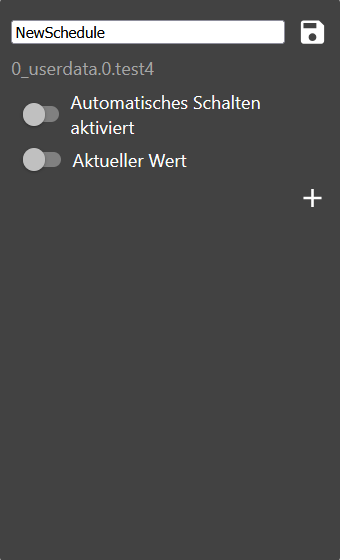

### Добавить условие

[Краткое содержание](#zusammenfassung)

- Установить условие.

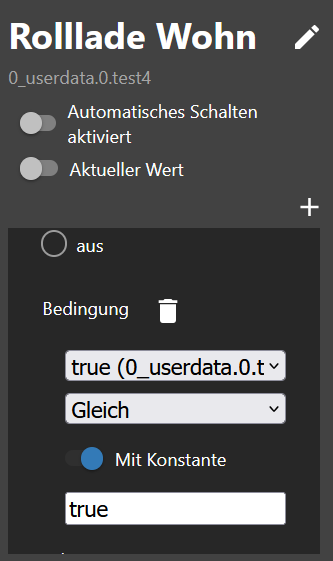

### Заменить текст

[Краткое содержание](#zusammenfassung)

- Включение/выключение текста и включение/выключение всего содержимого.

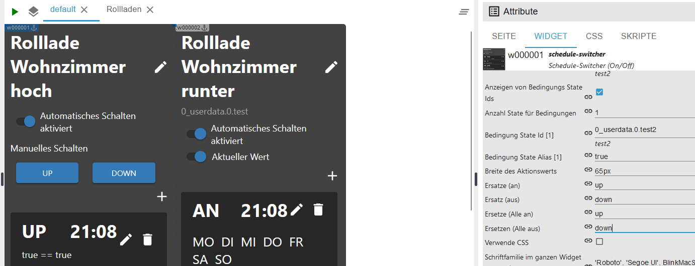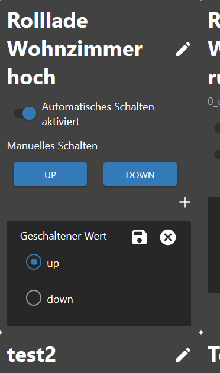

### Применение CSS: [см. CSS для получения инструкций.](#css)

[Краткое содержание](#zusammenfassung)

- Использовать`CSS aktivieren` изменить стиль </br>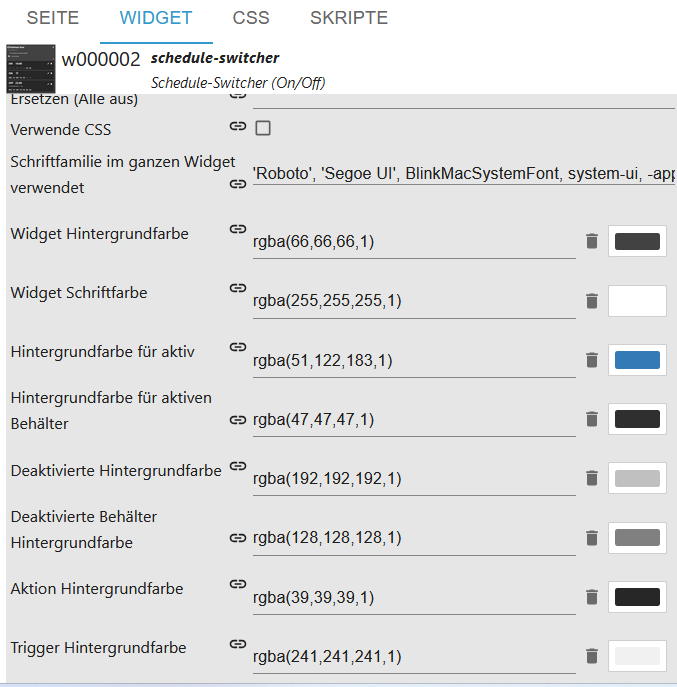</br>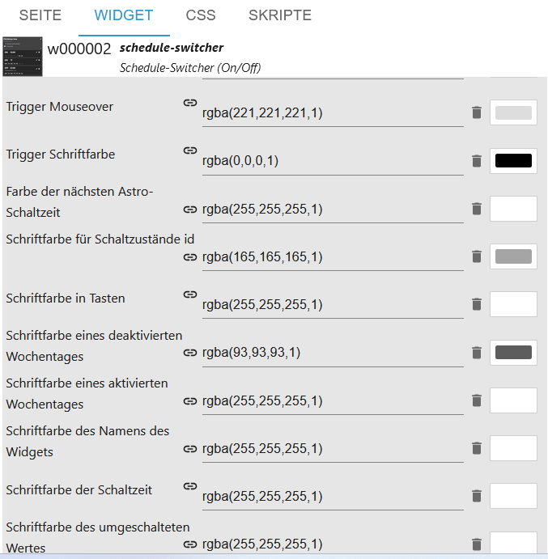</br>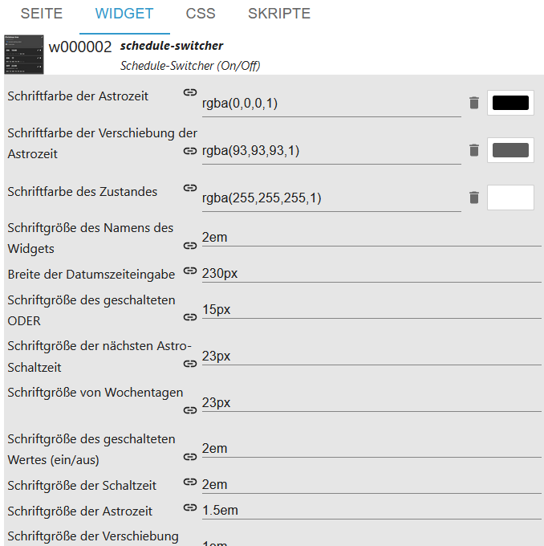</br>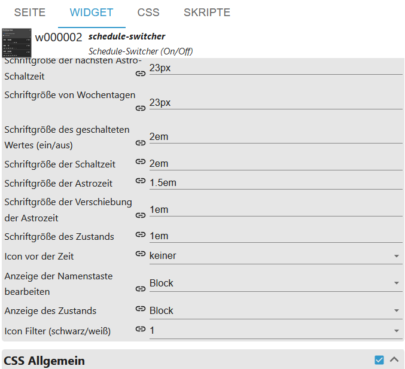</br>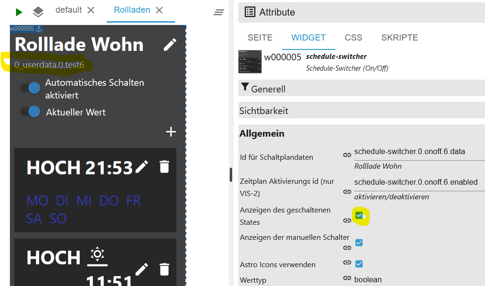</br>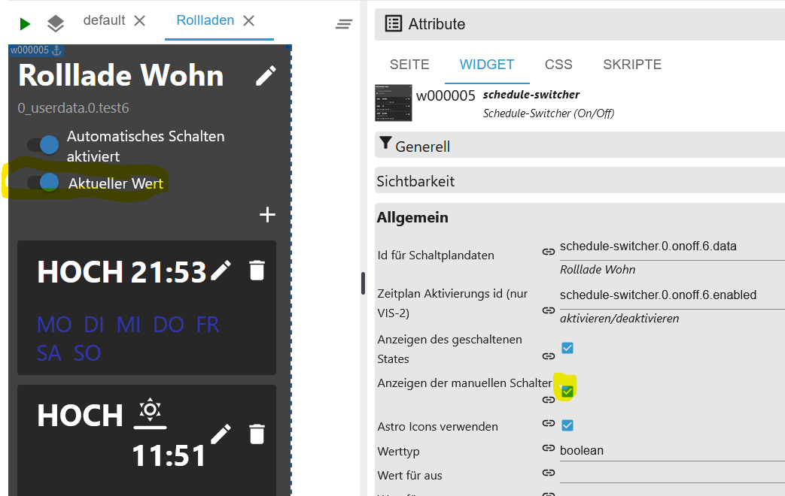</br>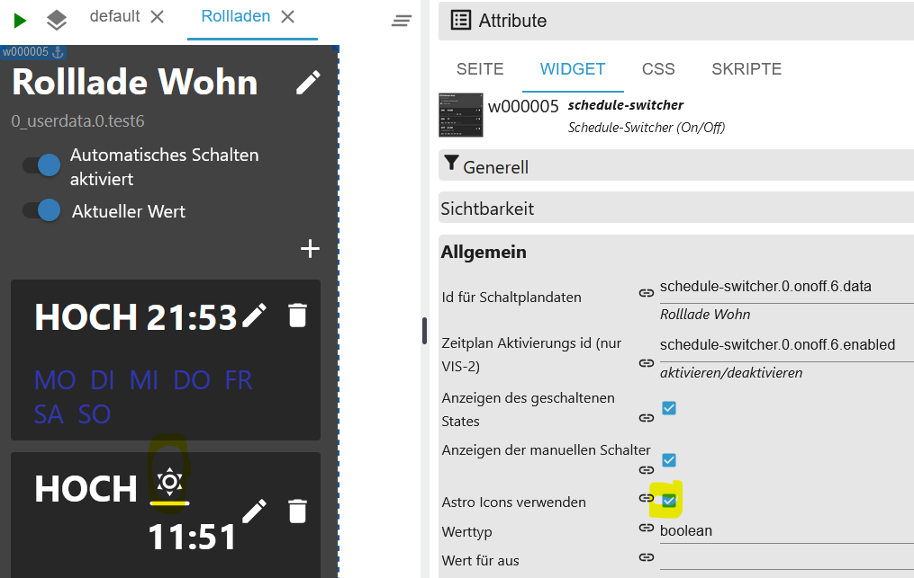</br>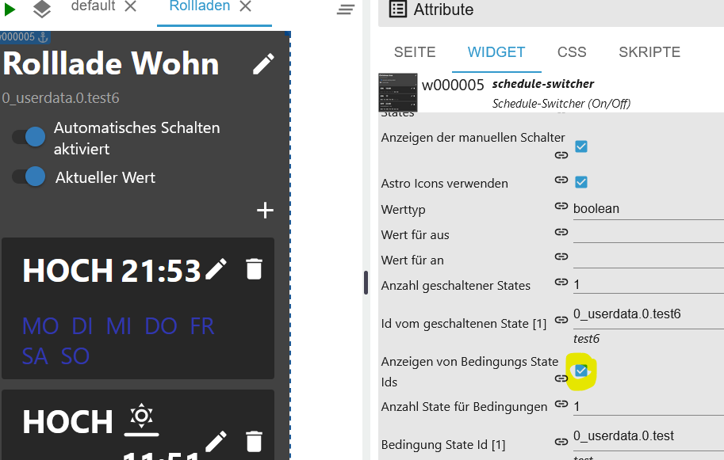</br>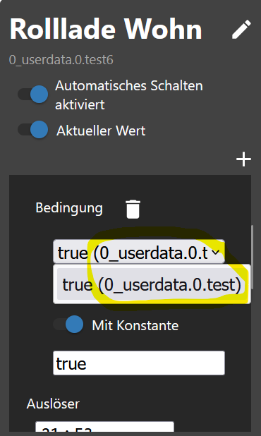

### Размеры значков и пользовательские значки

[Краткое содержание](#zusammenfassung)

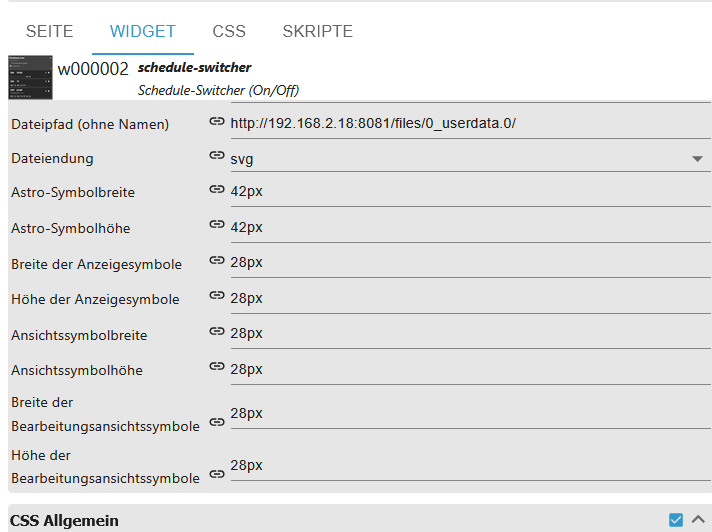

Чтобы найти путь к своим собственным иконкам, вам нужно...`CSS aktivieren` Эту функцию нельзя активировать. Для существующих виджетов расширение файла необходимо изменить один раз; в противном случае атрибут не будет создан. То же самое относится к настройкам ширины/высоты. Иконки можно загрузить или скопировать в отдельную директорию. Пример пути:`Dateien` :

- <http://192.168.2.18:8081/files/0_userdata.0/>
- /opt/iobroker/iobroker-data/files/0\_userdata.0/

Или отдельная директория.

- /home/iobroker/<meinOrdner> /

Виджеты должны быть названы следующим образом. ВСЕ значки должны быть размещены в каталоге:

| Икона                                                                                         | Имя файла               |
| --------------------------------------------------------------------------------------------- | ----------------------- |
|                          | восход                  |
|                      | солнечный полдень       |
|                             | закат                   |
|                    | восход солнцаКонец      |
|              | goldenHourEnd           |
|                    | золотой час             |
|                  | начало заката           |
|                                | сумерки                 |
|                | морские сумерки         |
|                               | ночь                    |
|                              | надир                   |
|                        | ночной конец            |
|                | nauticalDawn            |
|                                | рассвет                 |
|                                        | добавлять               |
|                                | отмена                  |
|                                      | редактировать           |
|                                  | удалить                 |
|                                | один раз                |
|  | remove\_circle\_outline |
|                                 | сохранять               |
|                                     | время                   |
|                          | проверка значения       |
|                      | valueNoCheck            |
|                                | неизвестный             |

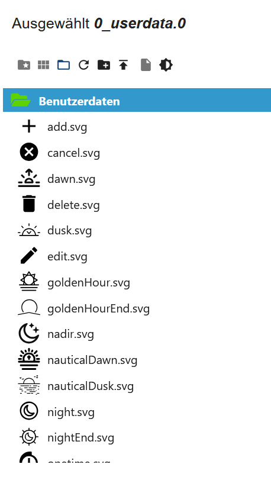

### Курок

[Краткое содержание](#zusammenfassung)

- Нажмите на значок карандаша, чтобы ввести время, или на значок корзины, чтобы удалить триггер.

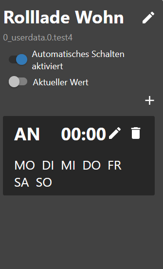

- Выберите состояние переключения
- Выберите условие (необязательно)
- Устанавливайте значение только в том случае, если оно не равно.
- Введите время (чч:мм)

```:warning:
 ⚠ Zeigt in Firefox kein Uhrzeit-Feld an!
```

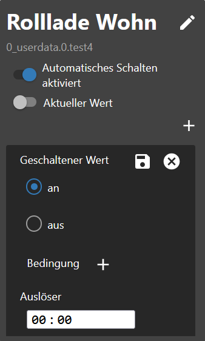

- Выберите день недели
- Нажмите кнопку «Сохранить» в правом верхнем углу.

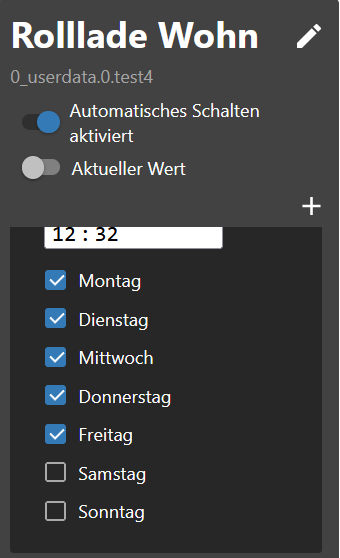

- Готовый

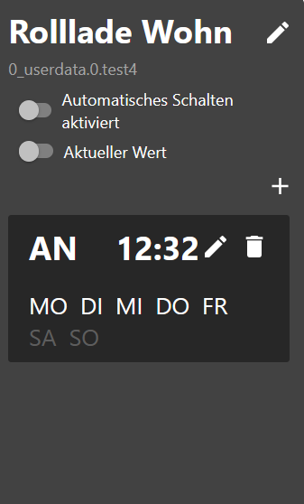

### Астро Триггер

[Краткое содержание](#zusammenfassung)

- Нажмите на значок карандаша, чтобы выбрать астрономическое время, или на значок корзины, чтобы удалить триггер.

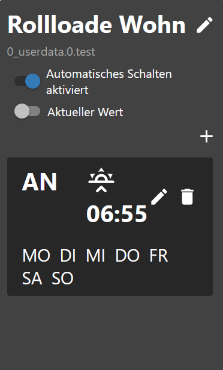

- Выберите состояние переключения
- Выберите условие (необязательно)
- Устанавливайте значение только в том случае, если оно не равно.
- Выберите астрономическое время (восход, закат или полдень).

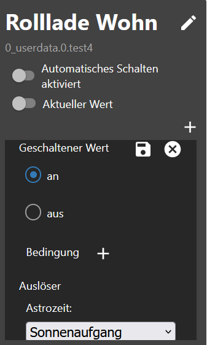

- Введите смещение в минутах (необязательно)
- Выберите день недели
- Нажмите кнопку «Сохранить» в правом верхнем углу.

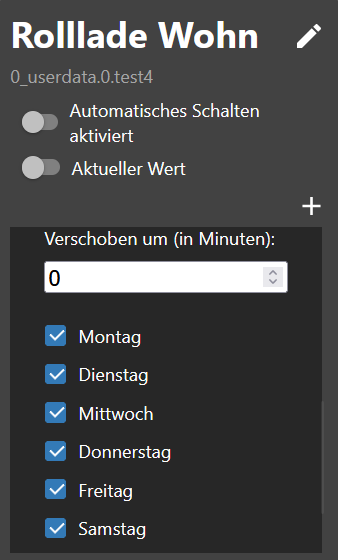

- Готовый


### Астроиконы

[Краткое содержание](#zusammenfassung)

| Икона                                                                             | Описание           |
| --------------------------------------------------------------------------------- | ------------------ |
|              | восход             |
|          | солнечный полдень  |
|                 | закат              |
|        | восход солнцаКонец |
|  | goldenHourEnd      |
|        | золотой час        |
|      | начало заката      |
|                    | сумерки            |
|    | морские сумерки    |
|                   | ночь               |
|                  | надир              |
|            | ночной конец       |
|    | nauticalDawn       |
|                    | рассвет            |

### Одноразовый триггер

[Краткое содержание](#zusammenfassung)

- Выберите состояние переключения
- Выберите условие (необязательно)
- Устанавливайте значение только в том случае, если оно не равно.
- Введите время (чч:мм:сс)
- Нажмите кнопку «Сохранить» в правом верхнем углу.

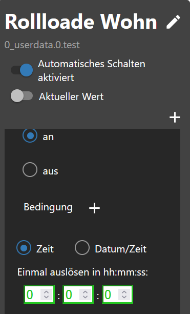

- Готовый

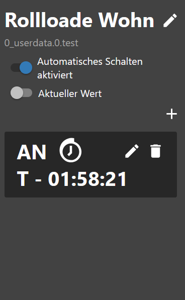

- Выберите состояние переключения
- Выберите условие (необязательно)
- Устанавливайте значение только в том случае, если оно не равно.
- Введите/выберите время (дд.мм.гггг чч:мм:сс)
- Нажмите кнопку «Сохранить» в правом верхнем углу.

```:warning:
 ⚠ Zeigt in Firefox kein Uhrzeit-Feld an!
```

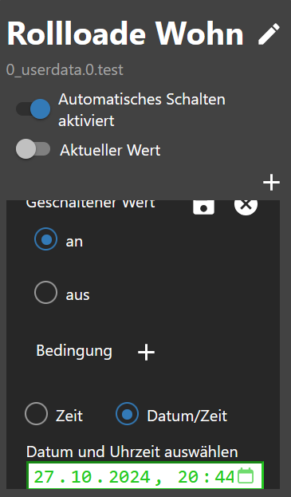</br>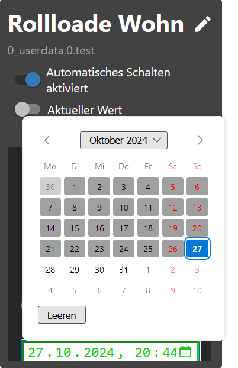

- Готовый

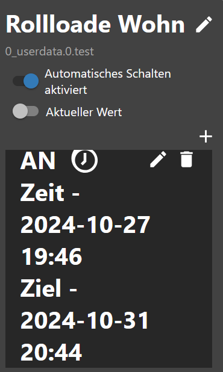

### HTML-обзор виджетов

[Краткое содержание](#summary)

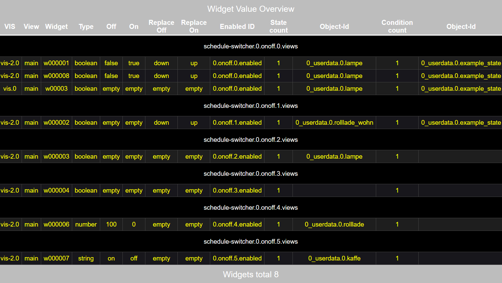

### HTML для VIS и VIS-2

[Краткое содержание](#zusammenfassung)

- `html.background_color_body` Цвет фона основного содержимого. Для VIS — всё изображение; для VIS-2 — только виджет (по умолчанию #000000).
- `html.background_color_even` Срабатывание триггера цвета фона по четному числу - по умолчанию #1E1E1E
- `html.background_color_odd` Срабатывание триггера цвета фона: нечетное число - значение по умолчанию #18171C
- `html.background_color_trigger` Цвет фона объекта-триггера — по умолчанию #000000
- `html.background_color_weekdays_hover` Цвет фона при наведении курсора мыши на дни недели — активация/деактивация по щелчку мыши — по умолчанию синий.
- `html.column_align_01` Выравнивание текста заголовка в столбце 1 — по центру (стандартное).
- `html.column_align_02` Выравнивание текста заголовка по столбцу 2 — по центру (стандартное).
- `html.column_align_03` Выравнивание верхнего колонтитула (3 столбца) - по центру (стандартное).
- `html.column_align_04` Выравнивание текста заголовка по столбцу 4 — по центру (стандартное).
- `html.column_align_05` Выравнивание текста заголовка по столбцу 5 — по центру (стандартное).
- `html.column_align_06`Выравнивание верхнего колонтитула по столбцу 6 — по центру (стандартное).
- `html.column_align_07` Выравнивание верхнего колонтитула (7 столбцов) - по центру (стандартное).
- `html.column_align_08` Выравнивание текста заголовка по 8 столбцам - по центру (стандартное).
- `html.column_align_09` Выравнивание текста заголовка по 9 столбцам - по центру (стандартное).
- `html.column_align_10` Выравнивание верхнего колонтитула (10 столбцов) - по центру (стандартное).
- `html.column_text_01` Заголовочный текст, столбец 1 - Стандартный график
- `html.column_text_02` Заголовочный текст, столбец 2 - Стандартные устройства
- `html.column_text_03` Заголовочный текст, столбец 3 - Стандартный переключатель
- `html.column_text_04` Заголовочный текст, столбец 4 - Стандартный понедельник
- `html.column_text_05` Заголовочный текст, столбец 5 - Стандартный Tu
- `html.column_text_06` Заголовочный текст, столбец 6 - Стандартный We
- `html.column_text_07` Заголовочный текст, столбец 7 - Стандартный Th
- `html.column_text_08` Заголовочный текст, столбец 8 - Стандартный французский
- `html.column_text_09` Заголовочный текст, столбец 9 - Стандартный Sa
- `html.column_text_10` Заголовочный текст, столбец 10 - Стандартное снабжение
- `html.column_width_01` Ширина столбца 1 - Стандартная автоматическая
- `html.column_width_02` Ширина столбца 2 - Стандартная автоматическая
- `html.column_width_03` Ширина столбца 3 - Стандартная автоматическая
- `html.column_width_04` Ширина столбца 4 - Стандартный автоматический режим
- `html.column_width_05` Ширина столбца 5 - Стандартный автоматический режим
- `html.column_width_06` Ширина столбца 6 - Стандартный автоматический режим
- `html.column_width_07` Ширина столбца 7 - Стандартный автоматический режим
- `html.column_width_08` Ширина столбца 8 - Стандартный авто
- `html.column_width_09` Ширина столбца 9 - Стандартный автоматический режим
- `html.column_width_70` Ширина столбца 10 - Стандартный авто
- `html.font_color_text_disabled` Цвет текста отключенного объекта — по умолчанию красный.
- `html.font_color_text_enabled` Цвет текста активированного объекта — по умолчанию жёлтый.
- `html.font_color_weekdays_disabled` Цвет текста для отключенных дней недели — по умолчанию красный.
- `html.font_color_weekdays_enabled` Цвет текста активированных дней недели — по умолчанию жёлтый.
- `html.header_border` Отступы заголовка в пикселях — по умолчанию 2
- `html.header_font_family` Семейство шрифтов заголовка - Standard Helvetica
- `html.header_font_size` Размер шрифта заголовка - стандартный 15
- `html.header_linear_color_1` Фоновое изображение заголовка: линейный градиент 1 - Стандартный #BDBDBD
- `html.header_linear_color_2` Фоновое изображение заголовка: линейный градиент 2 - Стандартный #BDBDBD
- `html.header_tag_border_color` HTML-тег заголовка`<td>` Цвет кромки - Стандартный №424242
- `html.header_width` День головы`<table>` Стандартный размер автомобиля
- `html.column_align_row_01` Выравнивание текста строк в первом столбце — по умолчанию по левому краю.
- `html.column_align_row_02` Выравнивание текста по строкам во втором столбце — по умолчанию по левому краю.
- `html.column_align_row_03` Выравнивание текста по строкам в 3-м столбце — по умолчанию по левому краю.
- `html.column_align_row_04` Выравнивание текста по строкам в 4-м столбце — по умолчанию по левому краю.
- `html.column_align_row_05` Выравнивание текста по строкам в 5-м столбце — по умолчанию по левому краю.
- `html.column_align_row_06` Выравнивание текста по строкам в 6-м столбце — по умолчанию по левому краю.
- `html.column_align_row_07` Выравнивание текста по строкам в 7-м столбце — по умолчанию по левому краю.
- `html.column_align_row_08` Выравнивание текста по строкам в 8-м столбце — по умолчанию по левому краю.
- `html.column_align_row_09` Выравнивание текста по строкам в 9-м столбце — по умолчанию по левому краю.
- `html.column_align_row_10` Выравнивание текста строк в 10-м столбце — по умолчанию по левому краю.
- `html.headline_color` Цвет шрифта заголовка (расписание, устройство и т. д.) - по умолчанию #ffffff
- `html.headline_font_size` Размер шрифта заголовка в пикселях — по умолчанию 16.
- `html.headline_height` Высота строки заголовка в пикселях — по умолчанию 35.
- `html.headline_underlined` Нижняя граница заголовка в пикселях - Стандарт 3
- `html.headline_underlined_color` Цвет нижней границы заголовка - Стандартный #ffffff
- `html.headline_weight` Толщина шрифта в заголовке - Стандартная обычная
- `html.html_code` HTML-код для VIS, VIS-2, Jarvis, IQontrol и т. д.
- `html.icon_false` Состояние переключателя значка: выключено - Стандартный ⚪
- `html.icon_state_check_no` Сравнение статусов отключено 🔴
- `html.icon_state_check_yes` Сравнение штатов включено 🟢
- `html.icon_switch_symbol` Значок переключателя для включения/выключения таймера — по умолчанию ⏱
- `html.icon_true` Статус переключателя значков: включен - Стандартный 🟡
- `html.jarvis` Совместимо с Jarvis - Standard false
- `html.p_tag_text_algin` HTML`<p>` Выравнивание текста (последнее обновление и нижний колонтитул) — по центру по умолчанию.
- `html.table_tag_border_color` Цвет рамки дня`<table>` - Стандарт № 424242
- `html.table_tag_cell` Граница расстояния от дня`<table>` в пикселях - Стандарт 6
- `html.table_tag_text_align` Выравнивание текста по тегу`<table>` - Стандартный центр
- `html.table_tag_width` Размер дня`<table>` - Стандартный автомобиль
- `html.td_tag_border_bottom` нижний край TAG`<td>` в пикселях - Стандарт 1
- `html.td_tag_border_color` Цвет нижней границы бирки`<td>` - Стандарт № 424242
- `html.td_tag_border_right` правый край TAG`<td>` в пикселях - Стандарт 1
- `html.td_tag_cell`Пространство вокруг текста из тега`<td>` в пикселях (отступы) - по умолчанию 6
- `html.top_font_family` Семейство шрифтов для верхнего и нижнего колонтитулов — Standard Helvetica
- `html.top_font_size` Размер шрифта в верхнем и нижнем колонтитулах в пикселях — по умолчанию 20.
- `html.top_font_weight` Толщина шрифта в верхнем и нижнем колонтитулах — стандартная "normal"
- `html.top_text` Пользовательский текст для заголовка - Стандартный текст
- `html.top_text_color` Цвет шрифта в заголовке и нижнем колонтитуле — по умолчанию #ffffff
- `html.update` Запустить обновление вручную

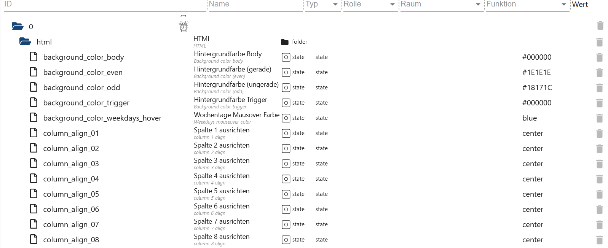

- Создайте HTML-виджет и вставьте объект в поле HTML.`{schedule-switcher.0.html.html_code}`
- Нажмите на текст`Letzte Aktualisierung` выполнить обновление вручную
- Нажмите на значок, чтобы активировать/деактивировать виджет.
- Чтобы удалить триггер, сначала нужно поставить галочку, а затем нажать кнопку.`delete` нажимать
- Изменить время/астрономическое и нажать кнопку.`save` Нажмите, чтобы применить изменения.
- Нажмите на день недели, чтобы активировать/деактивировать его.
- В строке с названием триггера отображается следующее событие включения/выключения в зависимости от дня недели.

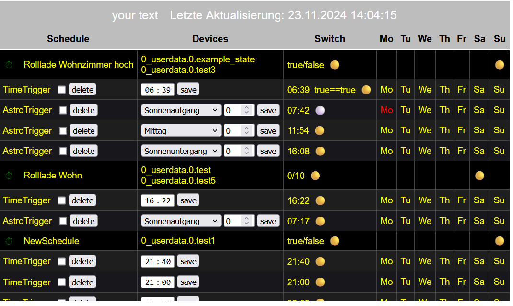

### Эта функция предназначена ТОЛЬКО для VIS-2!!!

[Краткое содержание](#zusammenfassung)

Только в VIS-2 перечисленные ниже функции необходимо вставлять вручную (см. изображения).

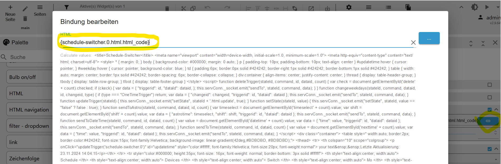</br>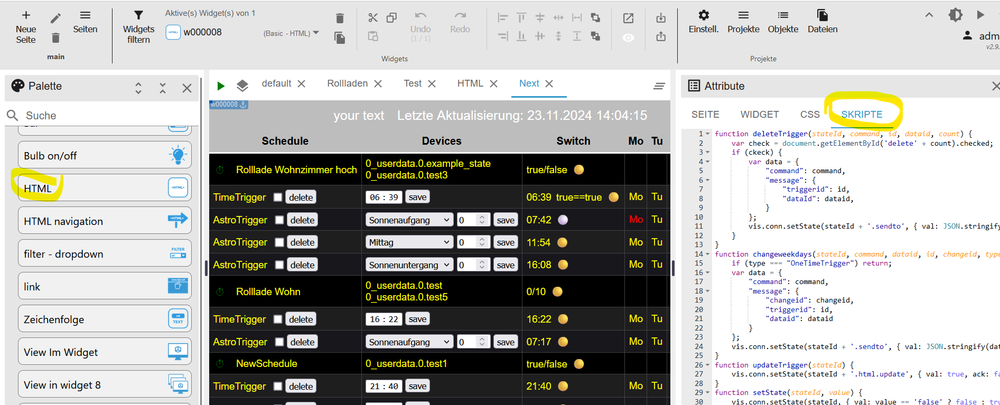

```java
function deleteTrigger(stateId, command, id, dataid, count) {
    var checked = document.getElementById('delete' + count).checked;
    if (checked) {
        var data = {
			"command": command,
			"message": {
				"triggerId": id,
				"dataId": dataid,
			}
		};
		vis.conn.setState(stateId + '.sendto', { val: JSON.stringify(data), ack: false });
	}
}
function changeweekdays(stateId, command, dataid, id, changeid, type) {
    if (type === "OneTimeTrigger") return;
    var data = {
		"command": command,
		"message": {
			"changeid": changeid,
			"triggerid": id,
			"dataid": dataid
		}
    };
	vis.conn.setState(stateId + '.sendto', { val: JSON.stringify(data), ack: false });
}
function changeValueCheck(stateId, command, dataid, id, value) {
    var data = {
		"command": command,
		"message": {
            "changeval": value,
            "triggerid": id,
            "dataid": dataid
		}
    };
    vis.conn.setState(stateId + '.sendto', { val: JSON.stringify(data), ack: false });
}
function updateTrigger(stateId) {
	vis.conn.setState(stateId + '.html.update', { val: true, ack: false });
}
function setState(stateId, value) {
	vis.conn.setState(stateId, { val: value == 'false' ? false : true, ack: false });
}
function sendToAstro(stateId, command, dataid, id, count) {
    var timeselect = document.getElementById('timeselect' + count).value;
    var shift = document.getElementById('shift' + count).value;
    var data = {
		"command": command,
		"message": {
			"astrotime": timeselect,
			"shift": shift,
			"triggerid": id,
			"dataid": dataid
		}
    };
	vis.conn.setState(stateId + '.sendto', { val: JSON.stringify(data), ack: false });
}
function sendToDateTime(stateId, command, id, dataid, count) {
    var value = document.getElementById('datetime' + count).value;
    var data = {
		"command": command,
		"message": {
			"time": value,
			"triggerid": id,
			"dataid": dataid
		}
    };
	vis.conn.setState(stateId + '.sendto', { val: JSON.stringify(data), ack: false });
}
function sendToTime(stateId, command, id, dataid, count) {
    var value = document.getElementById('nexttime' + count).value;
    var data = {
		"command": command,
		"message": {
			"time": value,
			"triggerid": id,
			"dataid": dataid
		}
    };
	vis.conn.setState(stateId + '.sendto', { val: JSON.stringify(data), ack: false });
}
```

### CSS

[Краткое содержание](#zusammenfassung)

```
app-on-off-schedules-widget {
    /* Primary color (button background, toggle switch color) */
    --ts-widget-primary-color: #337ab7;

    /* Background color of the widget */
    --ts-widget-bg-color: #424242;
    /* Background color of the triggers */
    --ts-widget-trigger-bg-color: #272727;

    /* Foreground color (font color and scrollbar color) */
    --ts-widget-fg-color: white;
    /* Font color of the switched states id */
    --ts-widget-oid-fg-color: #a5a5a5;
    /* Font color in buttons */
    --ts-widget-btn-fg-color: white;
    /* Font color of a disabled weekday */
    --ts-widget-weekdays-disabled-fg-color: #5D5D5D;
    /* Font color of an enabled weekday */
    --ts-widget-weekdays-enabled-fg-color: white;
    /* Font color of the name of the widget (defaults to --ts-widget-fg-color) */
    --ts-widget-name-fg-color: white;
    /* Font color of switched time (defaults to --ts-widget-fg-color) */
    --ts-widget-switched-time-fg-color: white;
    /* Font color of switched value (defaults to --ts-widget-fg-color)*/
    --ts-widget-switched-value-fg-color: white;
    /* Font color of the astro time (defaults to --ts-widget-fg-color) */
    --ts-widget-astro-time-fg-color: black;
    /* Font color of the astro time's shift */
    --ts-widget-astro-shift-fg-color: #5d5d5d;
    /* Font color of condition (defaults to --ts-widget-fg-color) */
    --ts-widget-condition-fg-color: white;
    /* Font color of toogle button off */
    --ts-widget-off-color: #c0c0c0;
    /* Color background toogle button off */
    --ts-widget-off-color-container: #808080;
    /* Color of next astro switching time */
    --ts-widget-astro-next-fg-color: white;

    /* Font family used in the whole widget */
    --ts-widget-font-family: 'Roboto', 'Segoe UI', BlinkMacSystemFont, system-ui, -apple-system;
    /* Font size of the name of the widget */
    --ts-widget-name-font-size: 2em;
    /* Font size of the switched oid */
    --ts-widget-oid-font-size: 30px;
    /* Font size of switch text */
    --ts-widget-state-action-width: 65px;
    /* Font size of next astro switching time */
    --ts-widget-astro-next-font-size: 2em;
    /* Width of date time input */
    --ts-widget-datetime-width: 230px;

    /* Display of edit name button. Use 'none' to hide the button and 'block' to show it
    --ts-widget-edit-name-button-display: block;
    /* Display of condition. Use 'none' to hide the condition and 'block' to show it
    -ts-widget-condition-display: block;
    /* Display of time icon. Use 'none' to hide the button and 'block' to show it
    --ts-widget-time-icon-display: none;

    /* Applies a filter to icons used in buttons (safe, edit, remove, cancel), for
       white use invert(1) and for black invert(0) */
    --ts-widget-img-btn-filter: invert(1);

    /* Add trigger dropdown background color */
    --ts-widget-add-trigger-dropdown-bg-color: #f1f1f1;
    /* Add trigger dropdown font color */
    --ts-widget-add-trigger-dropdown-fg-color: black;
    /* Add trigger dropdown hover background color */
    --ts-widget-add-trigger-dropdown-hover-bg-color: #ddd;

    /* ! Changing these may break the layout, change at your own risk */

    /* Font size of weekdays */
    --ts-widget-weekdays-font-size: 23px;
    /* Font size of switched value (on/off) */
    --ts-widget-switched-value-font-size: 2em;
    /* Font size of switched time */
    --ts-widget-switched-time-font-size: 2em;
    /* Font size of the astro time (e.g. Sunrise, ...) */
    --ts-widget-astro-time-font-size: 1.5em;
    /* Font size of the astro time's shift */
    --ts-widget-astro-shift-font-size: 1em;
    /* Font size of condition */
    --ts-widget-condition-font-size: 1em;

    /* Icons width and height in px */

    /* Astro icons */
    --ts-widget-astro-icon-width, 42px;
    --ts-widget-astro-icon-height, 42px;
    /* Display icons (rename and add icon) */
    --ts-widget-display-icon-width, 28px;
    --ts-widget-display-icon-height, 28px;
    /* Trigger view icons */
    --ts-widget-trigger-view-icon-width, 28px;
    --ts-widget-trigger-view-icon-height, 28px;
    /* Trigger edit icons */
    --ts-widget-trigger-edit-icon-width, 28px;
    --ts-widget-trigger-edit-icon-height, 28px;
}
```

## Changelog

<!--
    Placeholder for the next version (at the beginning of the line):
    ### **WORK IN PROGRESS**
-->
### 0.2.1 (2026-07-09)

- (Lucky-ESA) Fixed refresh astrotime

### 0.2.0 (2026-05-30)

- (copilot) Adapter requires node.js >= 22 now
- (Lucky-ESA) Code optimized
- (Lucky-ESA) Adapter requires admin >= 7.7.22 now

### 0.1.0 (2025-11-25)

- (Lucky-ESA) Fixed warn log (Cannot read dir...)
- (Lucky-ESA) Added state comparison enabled/disabled
- (Lucky-ESA) Fixed small some bugs
- (Lucky-ESA) History JSON changed
- (Lucky-ESA) Using your own icons

### 0.0.12 (2025-08-27)

- (Lucky-ESA) Astro time in widget fixed

### 0.0.11 (2025-08-16)

- (Lucky-ESA) Admin 7.6.17 required
- (Lucky-ESA) Node 20 required

[Older changelogs can be found there](CHANGELOG_OLD.md)

## License

MIT License

Copyright (c) 2024-2026 Lucky_ESA <github@luckyskills.de>

Permission is hereby granted, free of charge, to any person obtaining a copy
of this software and associated documentation files (the "Software"), to deal
in the Software without restriction, including without limitation the rights
to use, copy, modify, merge, publish, distribute, sublicense, and/or sell
copies of the Software, and to permit persons to whom the Software is
furnished to do so, subject to the following conditions:

The above copyright notice and this permission notice shall be included in all
copies or substantial portions of the Software.

THE SOFTWARE IS PROVIDED "AS IS", WITHOUT WARRANTY OF ANY KIND, EXPRESS OR
IMPLIED, INCLUDING BUT NOT LIMITED TO THE WARRANTIES OF MERCHANTABILITY,
FITNESS FOR A PARTICULAR PURPOSE AND NONINFRINGEMENT. IN NO EVENT SHALL THE
AUTHORS OR COPYRIGHT HOLDERS BE LIABLE FOR ANY CLAIM, DAMAGES OR OTHER
LIABILITY, WHETHER IN AN ACTION OF CONTRACT, TORT OR OTHERWISE, ARISING FROM,
OUT OF OR IN CONNECTION WITH THE SOFTWARE OR THE USE OR OTHER DEALINGS IN THE
SOFTWARE.