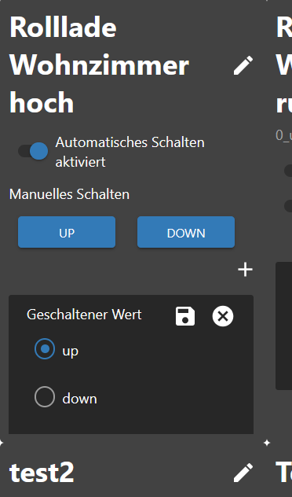
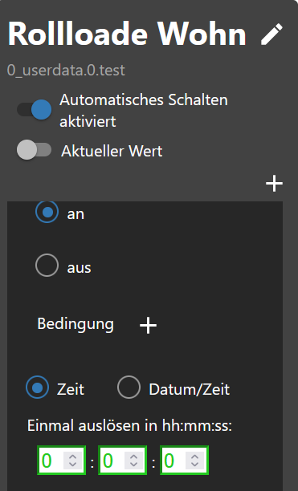
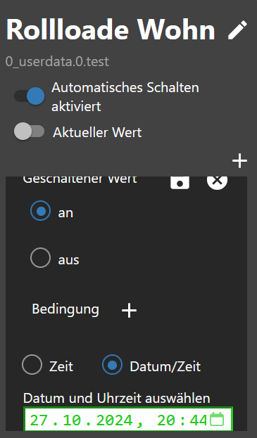

# IoBroker.schedule-switcher
[Вернуться к README](/README.md)

# Введение
Этот адаптер позволяет пользователю включать/выключать устройства по расписанию или 100/0.
Расписания полностью настраиваются с помощью виджета Vis или Vis 2.
Расписание изменяет одно или несколько состояний ioBroker и состоит из одного или нескольких триггеров, которые определяют, когда и как следует изменить состояние.
Можно настроить, в какое время и в какие дни недели должен срабатывать триггер. Также можно создать астро-триггеры или обратный отсчет.

# Краткое содержание
- [Настройки экземпляра](#instance-setting-schedule-switcher)
- [Объекты](#состояния)
- [Пример триггерных событий в формате JSON](#example-triggerevents-json)
- [Пример триггера в формате JSON](#example-trigger-json)
- [Пример sendTo запускает только экспертов](#example-trigger-with-sendto-create-or-edit-experts)
- [Пример виджета в формате JSON](#example-widgets-json)
- [Пример истории в формате JSON](#example-history-json)
- [Создать виджет](#создать виджет)
- [изменить имя](#changename)
- [Добавить условия](#condition-add)
- [заменить текст](#текст-заменить)
- [Настройки CSS](#css-apply-description-see-css)
- [Создать триггер](#trigger)
- [Создать астротриггер](#astro-trigger)
- [Создать одноразовый триггер](#one-time-trigger)
- [CSS](#css)

### Настройка экземпляра переключателя расписания
[Краткое содержание](#zusammenfassung)

- `+ знак`: добавить новое расписание.
- `Идентификатор схематических данных`: созданные объекты.
- `Имя`: название виджета.
- `Количество триггеров`: количество триггеров.
- «Активный»: Активный
- `Удалить`: удалить расписание.
- `Задержка между двумя процессами переключения в мс`: предотвращает одновременную установку состояний.
- `Переключение истории в формате JSON (макс. 100/0 для выключения)` Макс. хранение истории.

    

###Государства
[Краткое содержание](#zusammenfassung)

- вкл выкл
- `schedule-switcher.0.onoff.6.data` Все триггеры в формате JSON.
- `schedule-switcher.0.onoff.6.enabled` Активен или Неактивен
- `schedule-switcher.0.onoff.6.views` Где виджеты были созданы для объектов
- Статус
- `schedule-switcher.0.counterTrigger` количество триггеров (активных и неактивных)
- `schedule-switcher.0.history` История схем
- `schedule-switcher.0.nextEvents` Следующие события переключения в виде таблицы JSON.
- `schedule-switcher.0.sendto` В VIS-2 изменения передаются адаптеру через этот объект.


# Пример триггерных событий JSON
[Краткое содержание](#zusammenfassung)

```json
[
    {
        "type": "TimeTrigger", // TimeTrigger, AstroTrigger oder OneTimeTrigger
        "name": "Rollloade Wohn", // Name
        "triggerid": 0, // Trigger ID
        "action": "OnOffStateAction", // OnOffStateAction oder Condition
        "states": ["0_userdata.0.test", "0_userdata.0.test5"], // States
        "active": true, // enabled true oder false
        "hour": 16, // Stunde
        "minute": 22, // Minute
        "day": 9, // Tag
        "dateISO": "2024-11-09T15:22:00.000Z", // Zeit ohne Zeitzone
        "timestamp": 1731165720000, // Timestamp ohne Zeitzone
        "objectId": 1 // ObejektId schedule-switcher.0.onoff.<objectid>.data
    }
]
```

# Пример триггера JSON
[Краткое содержание](#zusammenfassung)

```json
{
    "type": "OnOffSchedule",
    "name": "Rolllade Wohn", // Name vom letzten erstellte Widget
    "onAction": {
        // Action für On
        "type": "OnOffStateAction",
        "valueType": "number",
        "onValue": 0,
        "offValue": 100,
        "booleanValue": true,
        "idsOfStatesToSet": ["0_userdata.0.test4"] // States max. 10
    },
    "offAction": {
        // Action für Off
        "type": "OnOffStateAction",
        "valueType": "number",
        "onValue": 0,
        "offValue": 100,
        "booleanValue": false,
        "idsOfStatesToSet": ["0_userdata.0.test4"] // States max. 10
    },
    "triggers": [
        {
            "type": "AstroTrigger", // Trigger - AstroTrigger - OneTimeTrigger
            "astroTime": "sunrise",
            "shiftInMinutes": 0,
            "weekdays": [1, 2, 3, 4, 5, 6],
            "id": "0",
            "action": {
                "type": "ConditionAction",
                "condition": {
                    "type": "StringStateAndConstantCondition",
                    "constant": "true",
                    "stateId": "0_userdata.0.test",
                    "sign": "=="
                },
                "action": {
                    "type": "OnOffStateAction",
                    "name": "On"
                }
            }
        }
    ]
}
```

# Пример виджетов JSON
[Краткое содержание](#zusammenfassung)

```json
{
    "vis-2.0": {
        // Welche VIS Version
        "main": {
            // Projekt
            "w000005": {
                // Widget ID
                "prefix": "main", // Projekt
                "namespace": "vis-2.0", // Welche VIS Version
                "view": "Rollladen", // Welche View
                "widgetId": "w000005", // Widget ID
                "newId": "schedule-switcher.0.onoff.6.data", // Neues Objekt
                "oldId": "timer-switch.0.onoff.1.data", // Altes Objekt
                "enabled": "schedule-switcher.0.onoff.6.enabled", // Enabled Objekt
                "stateCount": 1, // Counter Zustände
                "state": [
                    // Zustände
                    {
                        "oid-stateId1": "0_userdata.0.test5"
                    }
                ],
                "conditionCount": 1, // Counter Bedingung
                "condition": [
                    // Zustände Bedingungen
                    {
                        "oid-conditionStateId1": "0_userdata.0.test"
                    }
                ]
            },
            "w000006": {
                // Widget ID
                "prefix": "main", // Projekt
                "namespace": "vis-2.0", // Welche VIS Version
                "view": "Test", // Welche View
                "widgetId": "w000006", // Widget ID
                "newId": "schedule-switcher.0.onoff.6.data", // Neues Objekt
                "oldId": "timer-switch.0.onoff.1.data", // Altes Objekt
                "enabled": "schedule-switcher.0.onoff.6.enabled", // Enabled Objekt
                "stateCount": 1, // Counter Zustände
                "state": [
                    // Zustände
                    {
                        "oid-stateId1": "0_userdata.0.test4"
                    }
                ],
                "conditionCount": 1, // Counter Bedingung
                "condition": [] // Zustände Bedingungen
            }
        }
    }
}
```

# Пример создания или редактирования триггеров с помощью sendTo (эксперты)
[Краткое содержание](#zusammenfassung)

```JSON
sendTo("schedule-switcher.0", "add-trigger", { // Neuen Auslöser anlegen
    "dataId":"schedule-switcher.0.onoff.6.data",
    "triggerType":"TimeTrigger",
    "actionType":"OnOffStateAction"
});

sendTo("schedule-switcher.0", "update-trigger", { // Aktion für den neuen Auslöser festlegen
    "dataId":"schedule-switcher.0.onoff.6.data",
    "trigger":{
        "type":"TimeTrigger",
        "hour":12,
        "minute":32,
        "weekdays":[1,2,3,4,5],
        "id":"0", // ID abgleichen
        "action":{
            "type":"OnOffStateAction",
            "name":"On"
        }
    }
});

sendTo("schedule-switcher.0", "add-trigger", { // Neuen Astrotrigger anlegen
    "dataId":"schedule-switcher.0.onoff.6.data",
    "triggerType":"AstroTrigger",
    "actionType":"OnOffStateAction"
});

sendTo("schedule-switcher.0", "update-trigger", { // Aktion für den neuen Auslöser festlegen
    "dataId":"schedule-switcher.0.onoff.6.data",
    "trigger":{
        "type":"AstroTrigger",
        "astroTime":"sunrise", // sunrise, sunset or solarNoon
        "shiftInMinutes":0,
        "weekdays":[1,2,3,4,5],
        "id":"0", // ID abgleichen
        "action":{
            "type":"OnOffStateAction",
            "name":"On"
        }
    }
});

sendTo("schedule-switcher.0", "disable-schedule", { // Auslöser deaktivieren
    "dataId":"schedule-switcher.0.onoff.6.data"
});

sendTo("schedule-switcher.0", "enable-schedule", { // Auslöser aktivieren
    "dataId":"schedule-switcher.0.onoff.6.data"
});

sendTo("schedule-switcher.0", "add-one-time-trigger", { // Einmalauslöser anlegen
    "dataId":"schedule-switcher.0.onoff.6.data",
    "trigger":"{\"type\":\"OneTimeTrigger\",\"date\":\"2024-10-17T06:14:22.660Z\",\"timedate\":false,\"action\":{\"type\":\"OnOffStateAction\",\"name\":\"On\"}}"
});

sendTo("schedule-switcher.0", "delete-trigger", { // Auslöser mit bekannter ID löschen
    "dataId":"schedule-switcher.0.onoff.6.data",
    "triggerId":"0"
});
```

# Пример истории в формате JSON
[Краткое содержание](#zusammenfassung)

```JSON
[
  {
    "setObjectId": "0_userdata.0.test4",
    "objectId": 0,
    "value": "true",
    "object": "0_userdata.0.test4",
    "trigger": "TimeTrigger",
    "astroTime": "unknown",
    "shift": 0,
    "date": 0,
    "hour": 20,
    "minute": 48,
    "weekdays": [
      [
        1,
        2,
        3,
        4,
        5,
        6,
        0
      ]
    ],
    "time": 1729622880040
  },
  {
    "setObjectId": "0_userdata.0.test4",
    "objectId": 0,
    "value": "true",
    "object": "0_userdata.0.test4",
    "astroTime": "unknown",
    "shift": 0,
    "date": 0,
    "hour": 20,
    "minute": 47,
    "weekdays": [
      [
        1,
        2,
        3,
        4,
        5,
        6,
        0
      ]
    ],
    "time": 1729622820071
  }
]
```

# Пример представления виджета в формате JSON
[Краткое содержание](#zusammenfassung)

```json
{
    "vis-2.0": {
        "main": {
            "w000004": {
                "prefix": "main", // Projekt
                "namespace": "vis-2.0", // VIS
                "view": "default", // View
                "widgetId": "w000004", // Widget ID
                "newId": "schedule-switcher.0.onoff.3.data" // Objekt ID
            }
        }
    },
    "vis.0": {
        "main": {
            "w00001": {
                "prefix": "main",
                "namespace": "vis.0",
                "view": "Rollo",
                "widgetId": "w00001",
                "newId": "schedule-switcher.0.onoff.3.data"
            }
        }
    }
}
```

### Создать виджет
[Краткое содержание](#zusammenfassung)

- Вставить виджет в представление


- Выберите идентификатор для схематических данных.
- Выберите идентификатор активации расписания.
- Выберите идентификатор переключаемого состояния (максимум 10)


- Определить тип значения и значения, которые следует установить


- Теперь создадим принципиальную схему.


### Изменить имя
[Краткое содержание](#zusammenfassung)

- Изменить имя - Также принято в объектах


### Добавить условие
[Краткое содержание](#zusammenfassung)

- Установите условие.


### Заменить текст
[Краткое содержание](#zusammenfassung)

- Изменение текста вкл/выкл и все вкл/выкл

 

### Применить CSS [Описание см. css](#css)
[Краткое содержание](#zusammenfassung)

– Используйте «Включить CSS», чтобы настроить стиль.</br>

</br> </br> </br> </br> </br>  </br> </br> </br> 

### Триггеры
[Краткое содержание](#zusammenfassung)

- Нажмите на ручку, чтобы ввести время, или нажмите на мусорную корзину, чтобы удалить триггер.


- Выберите состояние переключения
- Выберите условие (необязательно)
- Введите время (чч:мм)

```:warning:
 ⚠ Zeigt in Firefox kein Uhrzeit-Feld an!
```


- Выберите день недели
- Нажмите «Сохранить» вверху справа.


-   Полный


### Астротриггеры
[Краткое содержание](#zusammenfassung)

- Нажмите на ручку, чтобы выбрать астрономическое время, или нажмите на мусорную корзину, чтобы удалить триггер.


- Выберите состояние переключения
- Выберите условие (необязательно)
- Выберите астрономическое время (восход солнца, закат или полдень)


- Введите смещение в минутах (необязательно)
- Выберите день недели
- Нажмите «Сохранить» вверху справа.


-   Полный


### Одноразовый триггер
[Краткое содержание](#zusammenfassung)

- Выберите состояние переключения
- Выберите условие (необязательно)
- Введите время (чч:мм:сс)
- Нажмите «Сохранить» вверху справа.



-   Полный


- Выберите состояние переключения
- Выберите условие (необязательно)
- Введите/выберите время (дд.мм.гггг чч:мм:сс)
- Нажмите «Сохранить» вверху справа.

```:warning:
 ⚠ Zeigt in Firefox kein Uhrzeit-Feld an!
```

</br> 

-   Полный


### CSS
[Краткое содержание](#zusammenfassung)

```
app-on-off-schedules-widget {
    /* Primary color (button background, toggle switch color) */
    --ts-widget-primary-color: #337ab7;

    /* Background color of the widget */
    --ts-widget-bg-color: #424242;
    /* Background color of the triggers */
    --ts-widget-trigger-bg-color: #272727;

    /* Foreground color (font color and scrollbar color) */
    --ts-widget-fg-color: white;
    /* Font color of the switched states id */
    --ts-widget-oid-fg-color: #a5a5a5;
    /* Font color in buttons */
    --ts-widget-btn-fg-color: white;
    /* Font color of a disabled weekday */
    --ts-widget-weekdays-disabled-fg-color: #5D5D5D;
    /* Font color of an enabled weekday */
    --ts-widget-weekdays-enabled-fg-color: white;
    /* Font color of the name of the widget (defaults to --ts-widget-fg-color) */
    --ts-widget-name-fg-color: white;
    /* Font color of switched time (defaults to --ts-widget-fg-color) */
    --ts-widget-switched-time-fg-color: white;
    /* Font color of switched value (defaults to --ts-widget-fg-color)*/
    --ts-widget-switched-value-fg-color: white;
    /* Font color of the astro time (defaults to --ts-widget-fg-color) */
    --ts-widget-astro-time-fg-color: black;
    /* Font color of the astro time's shift */
    --ts-widget-astro-shift-fg-color: #5d5d5d;
    /* Font color of condition (defaults to --ts-widget-fg-color) */
    --ts-widget-condition-fg-color: white;
    /* Font color of toogle button off */
    --ts-widget-off-color: #c0c0c0;
    /* Color background toogle button off */
    --ts-widget-off-color-container: #808080;
    /* Color of next astro switching time */
    --ts-widget-astro-next-fg-color: white;

    /* Font family used in the whole widget */
    --ts-widget-font-family: 'Roboto', 'Segoe UI', BlinkMacSystemFont, system-ui, -apple-system;
    /* Font size of the name of the widget */
    --ts-widget-name-font-size: 2em;
    /* Font size of the switched oid */
    --ts-widget-oid-font-size: 30px;
    /* Font size of switch text */
    --ts-widget-state-action-width: 65px;
    /* Font size of next astro switching time */
    --ts-widget-astro-next-font-size: 2em;
    /* Width of date time input */
    --ts-widget-datetime-width: 230px;

    /* Display of edit name button. Use 'none' to hide the button and 'block' to show it
    --ts-widget-edit-name-button-display: block;
    /* Display of condition. Use 'none' to hide the condition and 'block' to show it
    -ts-widget-condition-display: block;
    /* Display of time icon. Use 'none' to hide the button and 'block' to show it
    --ts-widget-time-icon-display: none;

    /* Applies a filter to icons used in buttons (safe, edit, remove, cancel), for
       white use invert(1) and for black invert(0) */
    --ts-widget-img-btn-filter: invert(1);

    /* Add trigger dropdown background color */
    --ts-widget-add-trigger-dropdown-bg-color: #f1f1f1;
    /* Add trigger dropdown font color */
    --ts-widget-add-trigger-dropdown-fg-color: black;
    /* Add trigger dropdown hover background color */
    --ts-widget-add-trigger-dropdown-hover-bg-color: #ddd;

    /* ! Changing these may break the layout, change at your own risk */

    /* Font size of weekdays */
    --ts-widget-weekdays-font-size: 23px;
    /* Font size of switched value (on/off) */
    --ts-widget-switched-value-font-size: 2em;
    /* Font size of switched time */
    --ts-widget-switched-time-font-size: 2em;
    /* Font size of the astro time (e.g. Sunrise, ...) */
    --ts-widget-astro-time-font-size: 1.5em;
    /* Font size of the astro time's shift */
    --ts-widget-astro-shift-font-size: 1em;
    /* Font size of condition */
    --ts-widget-condition-font-size: 1em;
}
```

## Changelog

<!--
    Placeholder for the next version (at the beginning of the line):
    ### **WORK IN PROGRESS**
-->
### 0.0.6 (2024-11-16)

-   (Lucky_ESA) Put value of state correctly
-   (Lucky_ESA) Added next triggers as JSON
-   (Lucky_ESA) Added counter trigger
-   (Lucky_ESA) Updating astro time fixed

### 0.0.5 (2024-11-06)

-   (Lucky_ESA) Crash when updating astro time fixed
-   (Lucky_ESA) Fixed some bugs

### 0.0.4 (2024-11-04)

-   (Lucky_ESA) Temporary function removed
-   (Lucky_ESA) Creation of objects adjusted
-   (Lucky_ESA) Validation check of the states
-   (Lucky_ESA) Validation check for 2 widgets with one object

### 0.0.3 (2024-10-30)

-   (Lucky_ESA) Fixed VIS translate
-   (Lucky_ESA) Added astro time in trigger
-   (Lucky_ESA) Fixed OneTimeTrigger
-   (Lucky_ESA) Added date for OneTimeTrigger
-   (Lucky_ESA) Fixed some bugs

### 0.0.2 (2024-10-22)

-   (Lucky_ESA) Fix translate
-   (Lucky_ESA) Fix background color disable Weekdays
-   (Lucky_ESA) Fix sendTo
-   (Lucky_ESA) Added jsonConfig
-   (Lucky_ESA) Added history

### 0.0.1 (2024-10-19)

-   (Lucky_ESA) initial release

## License

MIT License

Copyright (c) 2024 Lucky_ESA <github@luckyskills.de>

Permission is hereby granted, free of charge, to any person obtaining a copy
of this software and associated documentation files (the "Software"), to deal
in the Software without restriction, including without limitation the rights
to use, copy, modify, merge, publish, distribute, sublicense, and/or sell
copies of the Software, and to permit persons to whom the Software is
furnished to do so, subject to the following conditions:

The above copyright notice and this permission notice shall be included in all
copies or substantial portions of the Software.

THE SOFTWARE IS PROVIDED "AS IS", WITHOUT WARRANTY OF ANY KIND, EXPRESS OR
IMPLIED, INCLUDING BUT NOT LIMITED TO THE WARRANTIES OF MERCHANTABILITY,
FITNESS FOR A PARTICULAR PURPOSE AND NONINFRINGEMENT. IN NO EVENT SHALL THE
AUTHORS OR COPYRIGHT HOLDERS BE LIABLE FOR ANY CLAIM, DAMAGES OR OTHER
LIABILITY, WHETHER IN AN ACTION OF CONTRACT, TORT OR OTHERWISE, ARISING FROM,
OUT OF OR IN CONNECTION WITH THE SOFTWARE OR THE USE OR OTHER DEALINGS IN THE
SOFTWARE.