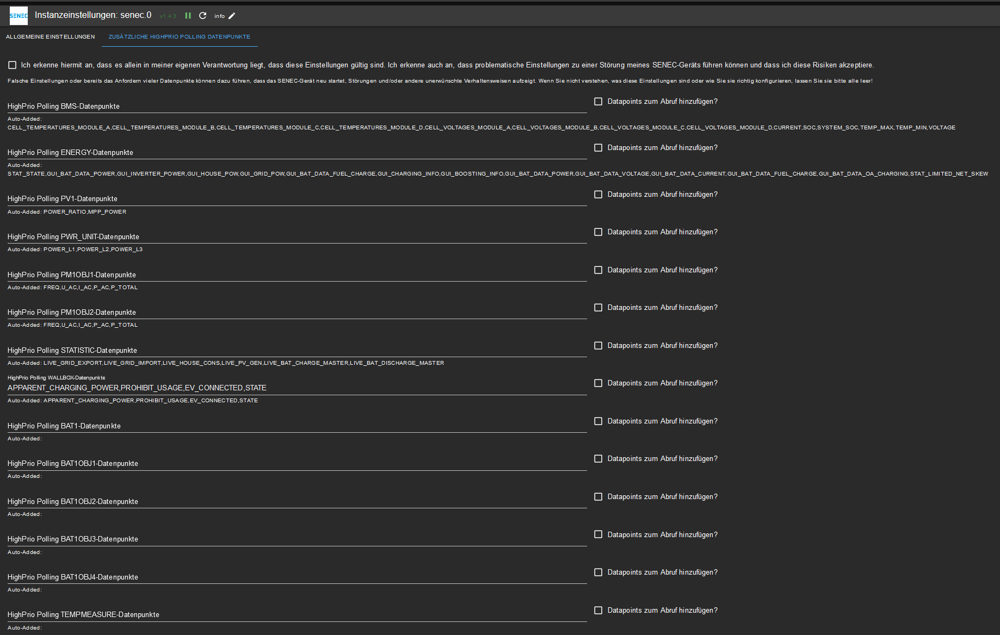

# IoBroker.senec
## Адаптер SENEC для ioBroker
Адаптер был разработан для систем Senec Home V2.1.
Никакие значения не могут быть изменены в системе Senec.Home. Включение нагрузки безопасности намеренно избегалось.
В настоящее время Senec больше не предоставляет надежный способ снижения пиковой нагрузки через веб-интерфейс. Для этого необходимо приложить усилия к mein-senec.de.
Работают ли с ним другие системы (например, V3), зависит от того, основаны ли они также на lala.cgi и предоставляют ли ту же информацию JSON.
Даже при интеграции в Senec.Clound нет гарантии, что к данным можно будет получить доступ через веб-интерфейс (см. отчеты об опыте).

Ниже перечислены системы, которые могут работать, поскольку используют один и тот же интерфейс. Однако точки данных могут быть разными (отсутствующими, дополнительными, измененными).

* Senec Home 4.0 / Ведущий
* Сенец Домашний 6.0 Пб
* Senec Home 8.0 / Ведущий
* Сенец Дом 10.0 Пб
* Senec Home 5.0/7.5/10.0/Литий
* Senec Home 15.0 / Литий
* Сенек Домашняя V2 5.0/7.5/10.0
* Senec Home V2 10.0 / Ведущий
* Senec Home V2.1 1ф/литиевый
* Senec.Home V3 Гибрид
* Senec.Home V3 Гибридный дуэт
* Сенец Бизнес 30.0 / Ведущий
* Senec Business V2 30.0 / Ведущий
* Сенек Бизнес 25.0/Литий
* Senec Business V2_2ph/литиевый
* Senec Business V2 3-фазный/литиевый
*АДС Тех
*ОЕМ LG
* Солнечная инвертированная память 10,0/свинец

## Отказ от ответственности
**Все названия и логотипы продуктов и компаний являются товарными знаками™ или зарегистрированными® товарными знаками соответствующих владельцев. Их использование не подразумевает какой-либо принадлежности или одобрения со стороны них самих или их аффилированных лиц! Этот личный проект осуществляется в свободное от работы время и не имеет деловой цели.

### SENEC.Главная
Это система, сердцем которой является литий-ионный аккумулятор, который хранит и высвобождает электроэнергию, вырабатываемую солнечной системой на крыше. Это работает так же, как аккумулятор в смартфоне, ноутбуке или беспроводной отвертке. В принципе, он также содержит ту же проверенную технологию. Если вы производите на крыше больше электроэнергии, чем можете использовать в доме, электричество будет поступать не в сеть, а в вашу систему хранения. Вы можете использовать его, когда стемнеет или собираются облака, и вы производите меньше или вообще не производите больше электроэнергии. Тогда вы сможете использовать собственную солнечную энергию для работы телевизора или приготовления ужина вечером.

## Предварительные условия перед установкой
Обязательным условием для работы системы хранения Senec.Home с ioBroker является успешная настройка системы электриком. Система также должна находиться в той же сети, что и ioBroker.

### Монтаж
Экземпляр адаптера устанавливается через интерфейс администратора ioBroker.
После завершения установки экземпляра адаптера автоматически откроется окно конфигурации.

## Конфигурация
### Окно общих настроек

| поле | Описание |
|:-------------|:-------------|
|Система SENEC |Здесь будет указан IP-адрес желаемой системы Senec.Home. Если в сети есть работающий DNS, можно также указать полное доменное имя.|
|Использовать https?|Если система SENEC уже преобразована в https, эту опцию необходимо активировать.|
|Интервал запроса, высокий приоритет|Здесь вы вводите временные интервалы (миллисекунды), через которые системы Senec.Home извлекают элементы с высоким приоритетом. (По умолчанию: 10 секунд) |

|Интервал запроса, низкий приоритет|Здесь вы вводите интервалы времени (миллисекунды), через которые системы Senec.Home извлекают элементы с низким приоритетом. (По умолчанию: 60 минут)  Опасность! Если система SENEC запрашивается слишком часто, это может означать, что данные больше не могут передаваться на сервер SENEC! (например, в приложении или на сайте mein-senec.de нет текущих значений)|

|Тайм-аут запроса|Здесь вы вводите количество миллисекунд, по истечении которого система Senec.Home должна ответить на запрос, прежде чем запрос будет отменен. (По умолчанию: 5000)|
|Повторные попытки|Указывает, как часто следует предпринимать попытки запросить систему Senec в случае возникновения ошибки. Это не касается запуска адаптера - если система недоступна, адаптер перестает работать. (По умолчанию: 10)|
|Коэффициент повтора опроса|Это значение можно использовать для влияния на интервал между повторными попытками. Применяется следующее: n-я попытка повторения происходит через интервал *множитель* n секунд после попытки n-1. Пример. При значениях по умолчанию первая повторная попытка происходит через 20 секунд после первоначальной попытки, а вторая повторная попытка происходит через 40 секунд после первой. Успешное получение данных сбрасывает счетчик повторных попыток.|

После завершения настройки диалог конфигурации закрывается с помощью `SPEICHERN UND SCHLIEßEN`.
После этого адаптер будет перезапущен.

### Окно «Дополнительные точки данных опроса HighPrio»

| поле | Описание |
|:-------------|:-------------|
|Отказ от ответственности |Чтобы внести изменения в поведение адаптера при опросе, вы должны подтвердить, что вы осведомлены о возможных рисках и что вы добровольно и сознательно принимаете их. Разработчик адаптера ответственности не несет.|
|Точки данных для разных областей|Здесь вы можете указать дополнительные точки данных, которые следует получить с высоким приоритетом. Для разделения можно использовать только символы A-Z и цифры 0-9 и .|
|Добавить точки данных в опрос?|Подтвердите здесь еще раз, что вы действительно хотите добавить указанные вами точки данных в опрос с высоким приоритетом.|

Опасность! Если к системе SENEC запрашивается слишком высокая частота и/или слишком много точек данных, это может привести к тому, что данные больше не смогут передаваться на сервер SENEC (например, в приложении или на mein-senec отсутствуют текущие значения). .де)! Система SENEC также может перезапуститься без мотивации и/или перестать отвечать на запросы. В этом случае помогает остановка адаптера и последующая коррекция настроек.

После завершения настройки диалог конфигурации закрывается с помощью `SPEICHERN UND SCHLIEßEN`.
После этого адаптер будет перезапущен.

## Экземпляры
Установка адаптера создала активный экземпляр адаптера Senec в области `Objekte`.

На сервере ioBroker можно создать несколько экземпляров адаптера Senec. И наоборот, система Senec.Home также может работать с несколькими серверами ioBroker. Если один сервер ioBroker будет управлять несколькими устройствами, для каждой системы необходимо создать один экземпляр.   Активирован ли адаптер и подключен к системе, указывает цвет поля состояния экземпляра. Если указатель мыши указывает на символ, отображается дополнительная подробная информация.

## Объекты адаптера
В области `Objekte` все устройства и действия, распознаваемые адаптером в концентраторе, перечислены в древовидной структуре.

Затем объекты делятся на состояния.
Каждая точка данных указана со связанным с ней типом данных и разрешениями.
Разрешения в настоящее время доступны только для чтения (R). Каждую точку данных можно как минимум прочитать (R).
Для поиска конкретной точки данных мы рекомендуем выполнять поиск с помощью комбинации клавиш «CTRL + F».
В зависимости от конкретной системы состояния могут не существовать или могут возникать недокументированные состояния.
Если документации по состоянию нет, но кто-то знает, что оно представляет собой, отправьте запрос на включение (или откройте заявку с соответствующей информацией).

### Примеры состояний (доступные состояния зависят от версии системы и ПО, список обычно неполный)
#### Канал: информация
* информация.соединение

    |Тип данных|Разрешение|
    |:---:|:---:|
    |логическое значение|R|

   *Логическое значение только для чтения, которое истинно, когда установлено соединение между ioBroker и Senec.Home.*

#### Канал: _calc
Этот канал содержит расчетные значения. В настоящее время это ежедневные/еженедельные/месячные/годовые значения для конкретных точек данных.

* xxx.refDay/Неделя/Месяц/Год

    |Тип данных|Разрешение|
    |:---:|:---:|
    |число|В|

   *Изменяемое число, указывающее, к какому дню/неделе/месяцу/году относятся данные.*

* xxx.refValue/Неделя/Месяц/Год

    |Тип данных|Разрешение|
    |:---:|:---:|
    |число|В|

   *Изменяемое число, указывающее опорное значение для расчета текущего значения.*

* xxx.сегодня/неделя/месяц/год

    |Тип данных|Разрешение|
    |:---:|:---:|
    |число|В|

   *Изменяемое число, которое представляет текущее значение дня/недели/месяца/года соответствующей точки данных.*

* xxx.yesterday/lastWeek/lastMonth/lastYear

    |Тип данных|Разрешение|
    |:---:|:---:|
    |число|В|

   *Изменяемое число, которое представляет значение предыдущего дня/недели/месяца/года соответствующей точки данных.*

#### Канал: БМС
* БЛ[0-3]

    |Тип данных|Разрешение|
    |:---:|:---:|
    |номер|R|

   *Число только для чтения, обозначающее: ? за каждый аккумулятор.*

* CHARGED_ENERGY[0-3]

    |Тип данных|Разрешение|
    |:---:|:---:|
    |номер|R|

   *Только читаемое число, которое указывает, сколько энергии было заряжено на один аккумулятор. Единица: ?*

* CHARGE_CURRENT_LIMIT[0-3]

    |Тип данных|Разрешение|
    |:---:|:---:|
    |номер|R|

   *Только читаемое число, указывающее, насколько велика зарядная емкость аккумуляторной батареи в амперах.*

* ТЕКУЩИЙ[0-3]

    |Тип данных|Разрешение|
    |:---:|:---:|
    |номер|R|

   *Только читаемое число, которое указывает, сколько ампер в настоящее время имеет каждый аккумулятор.*

* ЦИКЛЫ[0-3]

    |Тип данных|Разрешение|
    |:---:|:---:|
    |номер|R|

   *Число, доступное только для чтения, указывает количество циклов зарядки каждого аккумуляторного блока.*

* DISCHARGED_ENERGY[0-3]

    |Тип данных|Разрешение|
    |:---:|:---:|
    |номер|R|

   *Только читаемое число, указывающее, сколько энергии было израсходовано из аккумуляторной батареи. Единица: ?*

* DISCHARGE_CURRENT_LIMIT[0-3]

    |Тип данных|Разрешение|
    |:---:|:---:|
    |номер|R|

   *Только читаемое число, указывающее, какую разрядную емкость имеет в данный момент каждый аккумулятор.*

* ПРОГРАММА[0-3]

    |Тип данных|Разрешение|
    |:---:|:---:|
    |номер|R|

   *Номер, доступный только для чтения, который указывает текущую версию прошивки аккумуляторной батареи.*

* HW_EXTENSION[0-3]

    |Тип данных|Разрешение|
    |:---:|:---:|
    |номер|R|

   *Только читаемый номер, указывающий, какое аппаратное расширение имеет соответствующий аккумулятор.*

* HW_MAINBOARD[0-3]

    |Тип данных|Разрешение|
    |:---:|:---:|
    |номер|R|

   *Только читаемый номер, указывающий, какую аппаратную версию имеет материнская плата соответствующего аккумуляторного блока.*

* MAX_CELL_VOTAGE[0-3]

    |Тип данных|Разрешение|
    |:---:|:---:|
    |номер|R|

   *Число, доступное только для чтения, которое указывает максимальное напряжение отдельного аккумуляторного блока.*

* MIN_CELL_VOTAGE[0-3]

    |Тип данных|Разрешение|
    |:---:|:---:|
    |номер|R|

   *Число, доступное только для чтения, которое указывает минимальное напряжение отдельного аккумуляторного блока.*

*СН[0-3]

    |Тип данных|Разрешение|
    |:---:|:---:|
    |номер|R|

   *Номер, доступный только для чтения, указывающий серийный номер отдельного аккумуляторного блока.*

* СОЦ[0-3]

    |Тип данных|Разрешение|
    |:---:|:---:|
    |номер|R|

   *Номер, доступный только для чтения, который указывает состояние заряда отдельного аккумуляторного блока.*

* СОХ[0-3]

    |Тип данных|Разрешение|
    |:---:|:---:|
    |номер|R|

   *Номер, доступный только для чтения, который указывает состояние здоровья каждого аккумуляторного блока.*

* СТАТУС[0-3]

    |Тип данных|Разрешение|
    |:---:|:---:|
    |номер|R|

   *Номер, доступный только для чтения, указывающий состояние каждого аккумуляторного блока.*

* TEMP_MAX[0-3]

    |Тип данных|Разрешение|
    |:---:|:---:|
    |номер|R|

   *Число, доступное только для чтения, которое указывает максимальную температуру каждого аккумуляторного блока.*

* ТЕМП_МИН[0-3]

    |Тип данных|Разрешение|
    |:---:|:---:|
    |номер|R|

   *Число, доступное только для чтения, которое указывает минимальную температуру отдельного аккумуляторного блока.*

* НАПРЯЖЕНИЕ[0-3]

    |Тип данных|Разрешение|
    |:---:|:---:|
    |номер|R|

   *Только читаемое число, которое указывает, насколько велико напряжение отдельного аккумуляторного блока.*

* BMS_READY_FLAG

    |Тип данных|Разрешение|
    |:---:|:---:|
    |логическое значение|R|

   *Логическое значение только для чтения, что истинно, если BMS готова.*

* МОДУЛИ_CONFIGURED

    |Тип данных|Разрешение|
    |:---:|:---:|
    |номер|R|

   *Число, доступное только для чтения, указывающее, сколько модулей настроено в системе.*

* MODULE_COUNT

    |Тип данных|Разрешение|
    |:---:|:---:|
    |номер|R|

   *Число, доступное только для чтения, указывающее, сколько модулей подключено в системе (включая ненастроенные).*

* НАЧАТЬ ОБНОВЛЕНИЕ

    |Тип данных|Разрешение|
    |:---:|:---:|
    |логическое значение|R|

   *Логическое значение только для чтения, которое истинно, если должно быть запущено обновление.*

* МАСТЕР_АБОРТ

    |Тип данных|Разрешение|
    |:---:|:---:|
    |логическое значение|R|

   *Булевое значение только для чтения, что соответствует действительности, процесс установки был прерван.*

* МАСТЕР_ПОДТВЕРДИТЬ

    |Тип данных|Разрешение|
    |:---:|:---:|
    |логическое значение|R|

   *Булевое значение, доступное только для чтения, что соответствует действительности, процесс установки подтвержден.*

* WIZARD_DCCONNECT

    |Тип данных|Разрешение|
    |:---:|:---:|
    |логическое значение|R|

   * Логическое значение только для чтения, что соответствует истине, процесс установки ?.*

* МАСТЕР_СТАРТ

    |Тип данных|Разрешение|
    |:---:|:---:|
    |логическое значение|R|

   *Булевое значение, доступное только для чтения, которое истинно при запуске процесса установки.*

* МАСТЕР_ГОСУДАРСТВЕННЫЙ

    |Тип данных|Разрешение|
    |:---:|:---:|
    |номер|R|

   *Читаемый номер указывает только на статус процесса установки.*

#### Канал: ЭНЕРГИЯ
* GUI_BAT_DATA_CURRENT

    |Тип данных|Разрешение|
    |:---:|:---:|
    |номер|R|

   *Число, доступное только для чтения, обозначающее текущий ток аккумулятора в амперах.*

* GUI_BAT_DATA_FUEL_CHARGE

    |Тип данных|Разрешение|
    |:---:|:---:|
    |номер|R|

   *Читаемое число указывает только уровень в % от системы.*

* GUI_BAT_DATA_VOLTAGE

    |Тип данных|Разрешение|
    |:---:|:---:|
    |номер|R|

   *Число, доступное только для чтения, указывающее текущее напряжение аккумулятора в вольтах*

* GUI_BAT_DATA_POWER

    |Тип данных|Разрешение|
    |:---:|:---:|
    |номер|R|

   *Число, доступное только для чтения, указывающее, сколько ватт в настоящее время поступает в батарею или извлекается из нее (отрицательное значение).*

* GUI_BOOSTING_INFO

    |Тип данных|Разрешение|
    |:---:|:---:|
    |логическое значение|R|

   *Только читаемое логическое значение, смысл которого пока не ясен.*

* GUI_CHARGING_INFO

    |Тип данных|Разрешение|
    |:---:|:---:|
    |логическое значение|R|

   *Логическое значение, доступное только для чтения, указывающее, заряжается ли аккумулятор в данный момент.*

* GUI_GRID_POW

    |Тип данных|Разрешение|
    |:---:|:---:|
    |номер|R|

   *Только читаемое число, которое указывает, сколько ватт в данный момент потребляется из сети или подается в сеть (отрицательное значение).*

* GUI_HOUSE_POW

    |Тип данных|Разрешение|
    |:---:|:---:|
    |номер|R|

   *Только читаемое число, указывающее, сколько ватт потребляет дом в данный момент.*

* GUI_INVERTER_POWER

    |Тип данных|Разрешение|
    |:---:|:---:|
    |номер|R|

   *Только читаемое число, которое указывает, сколько ватт в настоящее время генерируется фотоэлектрической системой.*

* STAT_HOURS_OF_OPERATION

    |Тип данных|Разрешение|
    |:---:|:---:|
    |номер|R|

   *Число, доступное только для чтения, обозначающее часы работы системы.*

* STAT_MAINT_REQUIRED

    |Тип данных|Разрешение|
    |:---:|:---:|
    |логическое значение|R|

   *Логическое значение, доступное только для чтения, указывающее, требует ли система обслуживания.*

* СТАТ_ГОСУДАРСТВО

    |Тип данных|Разрешение|
    |:---:|:---:|
    |номер|R|

   *Только читаемое число, обозначающее состояние системы.*

* STAT_STATE_Text

    |Тип данных|Разрешение|
    |:---:|:---:|
    |строка|R|

   *Строка, доступная только для чтения, которая указывает состояние системы в виде обычного текста. К сожалению, у нас есть только оригинальные тексты Сенца на немецком языке.*

#### Канал: СТАТИСТИКА
* STAT_DAY_BAT_CHARGE

    |Тип данных|Разрешение|
    |:---:|:---:|
    |номер|R|

   *Число, доступное только для чтения, указывающее, сколько кВтч было сохранено в аккумуляторе сегодня.*

* STAT_DAY_BAT_DISCHARGE

    |Тип данных|Разрешение|
    |:---:|:---:|
    |номер|R|

   *Читаемое число указывает только на то, сколько кВтч было снято сегодня с аккумулятора.*

* STAT_DAY_E_GRID_EXPORT

    |Тип данных|Разрешение|
    |:---:|:---:|
    |номер|R|

   *Только читаемое число, указывающее, сколько кВтч было подано сегодня в сеть.*

* STAT_DAY_E_GRID_IMPORT

    |Тип данных|Разрешение|
    |:---:|:---:|
    |номер|R|

   *Только читаемое число, указывающее, сколько кВтч было получено из сети сегодня.*

* STAT_DAY_E_HOUSE

    |Тип данных|Разрешение|
    |:---:|:---:|
    |номер|R|

   *Только читаемое число, обозначающее сегодняшнее потребление дома в кВтч.*

* STAT_DAY_E_PV

    |Тип данных|Разрешение|
    |:---:|:---:|
    |номер|R|

   *Только читаемое число, указывающее, сколько кВтч было произведено фотоэлектрической системой сегодня.*

#### Канал: SYS_UPDATE
* NPU_IMAGE_VERSION

    |Тип данных|Разрешение|
    |:---:|:---:|
    |номер|R|

   *Номер только для чтения, со значением для версии NPU-IMAGE (*

* НПУ_ВЕР

    |Тип данных|Разрешение|
    |:---:|:---:|
    |номер|R|

   *Номер только для чтения, соответствующий значению версии NPU-REGS*

* ДОСТУПНО ОБНОВЛЕНИЕ

    |Тип данных|Разрешение|
    |:---:|:---:|
    |логическое значение|R|

   *Только читаемое логическое значение, указывающее, доступно ли обновление (однако оно предоставляется Senec и также устанавливается автоматически).*

#### Канал: ВОЛШЕБНИК
* ПРИЛОЖЕНИЕ_ВЕРСИЯ

    |Тип данных|Разрешение|
    |:---:|:---:|
    |строка|R|

   *Только читаемый текст со значением для версии MCU.*

* КОНФИГ_ЗАГРУЗИТЬ

    |Тип данных|Разрешение|
    |:---:|:---:|
    |логическое значение|R|

   *Булевое значение, доступное только для чтения, указывающее, была ли загружена конфигурация (это значение не должно быть постоянно ложным).*

* ИНТЕРФЕЙС_ВЕРСИЯ

    |Тип данных|Разрешение|
    |:---:|:---:|
    |строка|R|

   *Только читаемый текст со значением Revision GUI.*

* SETUP_NUMBER_WALLBOXES

    |Тип данных|Разрешение|
    |:---:|:---:|
    |номер|R|

   *Только читаемое число, указывающее, сколько настенных коробок настроено в системе.*

* SETUP_WALLBOX_SERIAL[0..3]

    |Тип данных|Разрешение|
    |:---:|:---:|
    |строка|R|

   *Только читаемый текст, в котором указаны серийные номера любых настенных коробок 0–3.*

## Changelog
### 1.6.1 (NoBl)
* Bugfixes

### 1.6.0 (NoBl)
* Added option to also poll SENEC App API. This requires user credentials for mein-senec.de
* We are starting with just some information - more to follow. But with Dashboard we at least have current values and day statistics back.

### 1.5.1 (NoBl)
* Added more datapoints. If you experience messages in log - feel free to add them yourself to state_attr on github (pull request)
* Autarky calculations will stopp working because SENEC removed STATISTICS branch.
* If you experience issues with connecting to your appliance after it got updated, please activate https connection in settings.

### 1.5.0 (NoBl)
* Added configuration section to add datapoints to high priority polling. Please be aware of the possible issues this could cause (if too many datapoints added) and use at your own risk.
* ALL Wallbox datapoints have been removed from high priority polling. Only some users even have a SENEC wallbox. Please reconfigure via the new config dialogue.
* Possible Candidate for stable. Please report any findings!

### 1.4.3 (NoBl)
* Working on https connection. Please test and report!

### 1.4.2 (NoBl)
* Added option to use https for connecting to SENEC (only activate if your appliance supports / requires this!)

### 1.4.1 (NoBl)
* Fix: Autarky calculations are working again.

### 1.4.0 (NoBl)
* Added object caching along with some minor code updates. Due to the amount of objects we deal with caching is about mandatory.

### 1.3.10 (NoBl)
* Fixed wrong Unit for STATISTIC.LIVE_WB_ENERGY
* Updated to json Admin UI
* Technical Updates
* Added more state_attr definitions

### [Former Updates](CHANGELOG_old.md)

## License
MIT License

Copyright (c) 2023 Norbert Bluemle <github@bluemle.org>

Permission is hereby granted, free of charge, to any person obtaining a copy
of this software and associated documentation files (the "Software"), to deal
in the Software without restriction, including without limitation the rights
to use, copy, modify, merge, publish, distribute, sublicense, and/or sell
copies of the Software, and to permit persons to whom the Software is
furnished to do so, subject to the following conditions:

The above copyright notice and this permission notice shall be included in all
copies or substantial portions of the Software.

THE SOFTWARE IS PROVIDED "AS IS", WITHOUT WARRANTY OF ANY KIND, EXPRESS OR
IMPLIED, INCLUDING BUT NOT LIMITED TO THE WARRANTIES OF MERCHANTABILITY,
FITNESS FOR A PARTICULAR PURPOSE AND NONINFRINGEMENT. IN NO EVENT SHALL THE
AUTHORS OR COPYRIGHT HOLDERS BE LIABLE FOR ANY CLAIM, DAMAGES OR OTHER
LIABILITY, WHETHER IN AN ACTION OF CONTRACT, TORT OR OTHERWISE, ARISING FROM,
OUT OF OR IN CONNECTION WITH THE SOFTWARE OR THE USE OR OTHER DEALINGS IN THE
SOFTWARE.