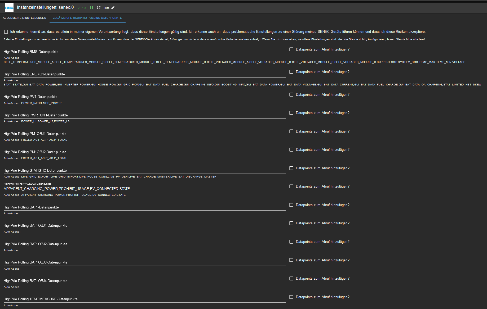

# IoBroker.senec
## Адаптер SENEC для ioBroker
Адаптер изначально был разработан для систем Senec Home V2.1.

В системе Senec.Home адаптер может изменять только выбранные значения. Использование этой функции осуществляется на ваш собственный риск и должно быть предварительно активировано вручную в конфигурации.

В настоящее время Senec больше не предоставляет надежного способа управления пиковым снижением потребления энергии через веб-интерфейс. Для этого необходимо использовать mein-senec.de.

Будут ли другие системы (например, V3) также работать с ним, зависит от того, основаны ли они на lala.cgi и предоставляют ли ту же информацию в формате JSON.

Даже при интеграции в Senec.Cloud не гарантируется, что данные останутся доступными через веб-интерфейс (для получения дополнительной информации см. отзывы пользователей).

Адаптер поддерживает локальный опрос через lala.cgi, а также через веб-API.

Ниже перечислены системы, которые должны работать, поскольку используют один и тот же интерфейс. Однако данные могут отличаться (отсутствовать, добавляться или изменяться).

* Senec Home 4.0, 6.0, 8.0, 10.0 / Ведущий
* Senec Home 5.0, 7.5, 10.0, 15.0 / Литиевый
* Senec Home V2 5.0, 7.5, 10.0
* Senec Home V2.1
* Senec.Home V3
* Senec.Home V4
* Senec Business 30.0 / Лидер
* Senec Business V2 30.0 / Lead
* Сенек Бизнес 25.0/Литий
* Senec Business V2_2ph / Литий
* Senec Business V2 3ph / Литий
* ADS Tec
* OEM LG
* Инверторный солнечный аккумулятор 10,0 л.с.

Системы Senec, не имеющие локального веб-интерфейса, по-прежнему могут отслеживаться через API. Будем рады любым отзывам по этому поводу.

## Отказ от ответственности
**Все названия продуктов и компаний, а также логотипы являются товарными знаками™ или зарегистрированными® товарными знаками соответствующих владельцев. Их использование не подразумевает принадлежности к этим компаниям или их аффилированным лицам и не подразумевает одобрения с их стороны! Этот личный проект создан в свободное время и не преследует коммерческих целей.

### SENEC.Home
Это система, основным компонентом которой является литий-ионный аккумулятор, который накапливает и высвобождает электроэнергию, вырабатываемую солнечными панелями на крыше. Она работает так же, как аккумулятор в смартфоне, ноутбуке или аккумуляторной дрели. По сути, она использует ту же проверенную технологию. Если вы вырабатываете на крыше больше электроэнергии, чем можете использовать в доме, излишки не поступают в сеть, а поступают в вашу систему хранения. Затем вы можете использовать её, когда стемнеет или появятся облака, и вы будете вырабатывать меньше электроэнергии или совсем не будете её вырабатывать. Это позволяет вам использовать собственную солнечную энергию для работы телевизора или приготовления ужина вечером.

## Необходимые условия перед установкой
Для работы системы хранения данных Senec.Home с ioBroker система должна быть успешно установлена квалифицированным электриком. Система также должна находиться в той же сети, что и ioBroker.

## Конфигурация
### Окно «Общие настройки»

| Поле | Описание |
|:-------------|:-------------|
|Система SENEC|Здесь вы введете IP-адрес нужной системы Senec.Home. Если в сети есть работающий DNS-сервер, можно также ввести полное доменное имя (FQDN).|
| Использовать HTTPS?|Если система SENEC уже переключена на HTTPS, эту опцию необходимо активировать.|
|Интервал запроса с высоким приоритетом| Здесь вы указываете временные интервалы (миллисекунды), через которые значения с высоким приоритетом извлекаются из системы Senec.Home. (По умолчанию: 10 секунд)|

|Интервал запроса с низким приоритетом| Здесь вы указываете временные интервалы (миллисекунды), через которые значения с низким приоритетом извлекаются из системы Senec.Home. (По умолчанию: 60 минут)  Внимание! Слишком частые запросы к системе SENEC могут привести к ситуации, когда данные на серверы SENEC не будут передаваться! (например, в приложении или на сайте mein-senec.de не отображаются текущие значения)

|Тайм-аут запроса|Этот параметр определяет максимальное количество миллисекунд, по истечении которых система Senec.Home должна ответить на запрос, прежде чем он будет прерван. (По умолчанию: 5000)|
|Попытки повтора| Этот параметр определяет, сколько раз следует запросить систему Senec в случае ошибки. Это не применяется при запуске адаптера — если система недоступна, адаптер завершает работу. (По умолчанию: 10)|
|Коэффициент повторения опроса| Это значение влияет на интервал между повторными попытками. n-я повторная попытка происходит через интервал *множитель* n секунд после повторной попытки n-1. Пример: При значениях по умолчанию первая повторная попытка происходит через 20 секунд после первой, а вторая — через 40 секунд после первой. Успешное получение данных сбрасывает счетчик повторных попыток.  |

После завершения настройки диалоговое окно настройки закрывается с кодом `SPEICHERN UND SCHLIEßEN`.

Это приводит к перезапуску адаптера.

### Окно «Дополнительные точки данных опроса с высоким приоритетом»

| Поле | Описание |
|:-------------|:-------------|
|Отказ от ответственности|Для внесения изменений в поведение адаптера при опросе необходимо подтвердить, что вы осведомлены о потенциальных рисках и добровольно и осознанно принимаете их. Разработчик адаптера не несет никакой ответственности.|
|Точки данных для разных областей|Здесь вы можете указать дополнительные точки данных, которые следует извлекать с высоким приоритетом. Для разделения можно использовать только символы от A до Z и цифры от 0 до 9, а также запятые.|
|Добавить точки данных для получения?|Подтвердите здесь, что вы действительно хотите добавить указанные точки данных для опроса с высоким приоритетом.|

Внимание! Если система SENEC запрашивается слишком часто и/или с большим количеством точек данных, это может привести к ситуации, когда данные не могут быть переданы на серверы SENEC (например, отсутствуют текущие значения в приложении или на mein-senec.de)! Система SENEC также может неожиданно перезапуститься и/или перестать отвечать на запросы. В этом случае проблему можно решить, остановив адаптер и затем скорректировав настройки.

После завершения настройки диалоговое окно настройки закрывается с кодом `SPEICHERN UND SCHLIEßEN`.

Это приводит к перезапуску адаптера.

## Пример
В результате установки адаптера был создан активный экземпляр адаптера Senec в области `Objekte`.

На одном сервере ioBroker можно создать несколько экземпляров адаптера Senec. И наоборот, система Senec.Home также может работать с несколькими серверами ioBroker. Если несколько устройств должны управляться одним сервером ioBroker, для каждой системы следует создать отдельный экземпляр.   Цвет поля состояния экземпляра указывает на то, активирован ли адаптер и подключен ли он к системе. При наведении курсора мыши на значок отображаются дополнительные сведения.

## Объекты-адаптеры
В области `Objekte` все устройства и действия, обнаруженные адаптером в хабе, отображаются в древовидной структуре.

Ниже объекты классифицированы по состояниям.

Каждая точка данных указана с соответствующим типом данных и правами доступа.

В настоящее время права доступа ограничены режимом «только чтение» (R). Как минимум, каждая точка данных может быть доступна для чтения (R).

Для поиска конкретной точки данных рекомендуется использовать сочетание клавиш «Ctrl + F».

В зависимости от конкретной системы, состояния могут отсутствовать или могут существовать недокументированные состояния.

Если документация по состоянию отсутствует, но кто-то знает, что оно представляет, пожалуйста, отправьте запрос на изменение (или откройте заявку с соответствующей информацией).

### Примеры состояний (доступные состояния зависят от версии системы и программного обеспечения; список, как правило, неполный)
#### Канал: информация
* info.connection

|Тип данных|Разрешение|
    |:---:|:---:|
|логическое значение|R|

*Только читаемое логическое значение, истинное при установлении соединения между ioBroker и Senec.Home.*

#### Канал: _api
Значения, полученные из веб-API.

#### Канал: BMS
* MODULES_CONFIGURED

|Тип данных|Разрешение|
    |:---:|:---:|
|номер|R|

*Только читаемое число, указывающее, сколько модулей настроено в системе.*

* MODULE_COUNT

|Тип данных|Разрешение|
    |:---:|:---:|
|номер|R|

*Только читаемое число, указывающее, сколько модулей подключено к системе (включая неконфигурированные).*

#### Канал: ЭНЕРГИЯ
* GUI_BAT_DATA_CURRENT

|Тип данных|Разрешение|
    |:---:|:---:|
|номер|R|

*Только читаемое число, указывающее текущий ток батареи в амперах.*

* GUI_BAT_DATA_FUEL_CHARGE

|Тип данных|Разрешение|
    |:---:|:---:|
|номер|R|

*Только читаемое число, указывающее уровень заполнения системы в процентах.*

* GUI_BAT_DATA_VOLTAGE

|Тип данных|Разрешение|
    |:---:|:---:|
|номер|R|

*Только читаемое число, указывающее текущее напряжение батареи в вольтах*

* GUI_BAT_DATA_POWER

|Тип данных|Разрешение|
    |:---:|:---:|
|номер|R|

*Только читаемое число, указывающее, сколько ватт в данный момент поступает в батарею или потребляется от нее (отрицательное значение).*

* GUI_CHARGING_INFO

|Тип данных|Разрешение|
    |:---:|:---:|
|логическое значение|R|

*Только читаемое логическое значение, указывающее, заряжается ли батарея в данный момент.*

* GUI_GRID_POW

|Тип данных|Разрешение|
    |:---:|:---:|
|номер|R|

*Только читаемое число, указывающее, сколько ватт в данный момент потребляется из сети или подается в сеть (отрицательное значение).*

* GUI_HOUSE_POW

|Тип данных|Разрешение|
    |:---:|:---:|
|номер|R|

*Только читаемое число, указывающее, сколько ватт в данный момент потребляет дом.*

* GUI_INVERTER_POWER

|Тип данных|Разрешение|
    |:---:|:---:|
|номер|R|

*Только читаемое число, указывающее, сколько ватт в данный момент вырабатывает фотоэлектрическая система.*

* STAT_HOURS_OPERATION

|Тип данных|Разрешение|
    |:---:|:---:|
|номер|R|

*Только читаемое число, указывающее на часы работы системы.*

* STAT_STATE

|Тип данных|Разрешение|
    |:---:|:---:|
|номер|R|

*Только читаемое число, отображающее состояние системы.*

* STAT_STATE_Text

|Тип данных|Разрешение|
    |:---:|:---:|
|строка|R|

*Только читаемая строка, указывающая на состояние системы в текстовом виде. К сожалению, у нас есть только оригинальные тексты Сенека на немецком языке.*

#### Канал: SYS_UPDATE
* NPU_IMAGE_VERSION

|Тип данных|Разрешение|
    |:---:|:---:|
|номер|R|

*Только читаемый номер со значением ревизии NPU-IMAGE (*)

* NPU_VER

|Тип данных|Разрешение|
    |:---:|:---:|
|номер|R|

*Только читаемый номер, соответствующий значению для версии NPU-REGS*

* UPDATE_AVAILABLE

|Тип данных|Разрешение|
    |:---:|:---:|
|логическое значение|R|

*Читаемое логическое значение, указывающее, доступно ли обновление (они предоставляются Senec и устанавливаются автоматически).*

#### Канал: ВОЛШЕБНИК
* ВЕРСИЯ_ПРИЛОЖЕНИЯ

|Тип данных|Разрешение|
    |:---:|:---:|
|строка|R|

*Только читаемый текст, содержащий значение версии микроконтроллера.*

* CONFIG_LOADED

|Тип данных|Разрешение|
    |:---:|:---:|
|логическое значение|R|

*Логическое значение только для чтения, указывающее, загружена ли конфигурация (это значение не должно быть постоянно ложным).*

* INTERFACE_VERSION

|Тип данных|Разрешение|
    |:---:|:---:|
|строка|R|

*Только читаемый текст со значением для графического интерфейса ревизии.*

* SETUP_NUMBER_WALLBOXES

|Тип данных|Разрешение|
    |:---:|:---:|
|номер|R|

*Только читаемое число, указывающее, сколько настенных розеток подключено к системе.*

* SETUP_WALLBOX_SERIAL[0..3]

|Тип данных|Разрешение|
    |:---:|:---:|
|строка|R|

*Только читаемый текст, указывающий серийные номера имеющихся настенных коробок 0-3.*

### Больше недоступно или удалено
* СТАТИСТИКА
* Отображать
* _calc (больше не актуально после удаления STATISTIC)
* BAT1OBJ[2-4]

## Changelog

<!--
  Placeholder for the next version (at the beginning of the line):
  ### **WORK IN PROGRESS**
-->
### 2.5.3 (2026-04-13)
- Clamping end-dates to current time if they are in the future to avoid issues with API
- Dependency updates
- Updated iobroker\testing-action-* versions

### 2.5.2 (2026-03-31)
- Rewrote AllTime History Rebuild: We should now be able to rebuild AllTime History even if the senec server struggles with timeouts. Warning! Rebuild will take considerable time now depending on the server. Current state of rebuild will be reported to log (info).
- You will now need to supply the installation year of your appliance upon AllTime History rebuild if you don't want empty yearly folders in the measurements path for yours you don't have data.
- More comprehensive logging on what is being polled from API.
- Better debug-logging for polling

### 2.5.1 (2026-03-31)
- Increased default API poll interval to 6 minutes. This appears to be causing less issues with the server than 5 minutes.
- You can now define different polling intervals for dashboard (frequently), details (usually hourly and daily information), heavy (for everything else that usually is done per month or year). Please be careful with high frequency polling as this can and will lead to problems and the senec server will stop responding to your requests. Longer delays between polls are preferred.
- Dependency updates
- Code optimizations

### 2.5.0 (2026-03-28)
- Added control.RebootAppliance to initiate appliance reboot. Only works if local lala.cgi is available and connected. Function requires extra permission via adapter settings. Please use responsible!
- We are now revealing that an ioBroker integration is accessing the API per default (UserAgent is set to 'integration'). Please consider leaving that to 'integration' so SENEC knows there are many users using the ioBroker integration. If you don't want this or experience issues with 'integration' UserAgent, check settings and revert UserAgent to 'Browser' or define your 'custom' UserAgent.
- Fixed incremential back-off for local polling.
- Moved local appliance control settings into own tab.
- Concurrency for API requests can now be controlled via settings. Please be cautious! Senec API is fragile. Go with 1 concurrent request if you experience issues.
- You can now enable diagnostics for api-request-queue. You can log them to 'info' log or have them in _api.diagnostics.queue.*
- Reduced local polling interval for lowPrio to 5 minutes.
- UI now hides unavailable options.
- Added option to remove API log spam. If you don't need to know every few minutes we are refreshing tokens or polling the API: Deactivate it.
- Partial code rewrite (you can now safely have several instances of adapter - if you ever wanted)
- Dependency updates

### 2.4.8 (2026-03-14)
 - Connection type now is "cloud" (ioBroker internal setting) - although we still support local interaction (if possible per individual appliance)
 - Dependency updates

### 2.4.7 (2026-03-14)
- Clearly indicating that initial API login busted and adapter will turn off API polling until restart
- Certain warnings moved to debug (as they are pretty much for debug purposes only)
- Made usage of axios-cookiejar-support ESM compatible (dynamic import). Solves issues with node 22.
- RND made node22+ safe.
- Code optimizations

### 2.4.6 (2026-03-09)
- Optimizations in Token Refesh Szenarios
- Optimizations in case of authentication issues
- Persisted RefreshToken across adapter restarts (less logins)
- Reworded errors/warning messages
- Dependency updates

### 2.4.5 (2026-03-03)
- fixed typo that made today/hourly today/horly. You can safely delete the horly branch Measurements/Daily/horly
- Updated delay for token refresh (it can be up to 2 min now).

### 2.4.4 (2026-03-03)
- Exponential backoff, if all systems cannot get polled. If at least 1 system can be polled we resume normal action. Now - if all systems fail polling (like 1 if you only have 1) this would be example backoff times for a 5min base interval: 1 Failure -> 0-10 min, 2 Failure -> 0-20 min, 3 Failures -> 0-40 min, 4+ Failures -> 0-40 min. Once polling works again we will resume normal operations.

### 2.4.3 (2026-03-03)
- API uses its own backoff settings when polling. You can only configure delay between polls. Instead we are using strategy used by: AWS SDK, Google Cloud SDK, Stripe API client, Kubernetes controllers or Distributed message brokers to prevent: retry storms, thundering herd, burst collapse after outage recovery, adapter lockups or permanent dead loops. This leads to: IF (SENEC API down for 2 hours, or Token refresh fails 20 times, or 429 rate limiting kicks in, or Internet drops temporarily) ? (Never dies, never overlaps, never floods API, always recovers)
- API polling no longer honors retries-setting. It will just keep backing off exponentially if errors persist -> we keep trying until you stop the adapter.
- Using Token-Refresh strategy. No unnecessary logins anymore.
- 401 won't throw warning anymore
- ReAuth shouldn't stop polling anymore

### 2.4.2 (2026-03-03)
- AuthToken in _api is no longer used. You can safely delete it.
- Decoupled frequencies to lower API load. Every poll: Dashboard and today values; Once per day: Yesterday, Monthly, Yearly values (we reduce load by about 65% compared to polling everything every time)
- AccessToken logic centralized
- True Single Flight Token refresh (avoiding duplicate logins, duplicate login storms)
- Avoiding overlapping Polls
- exponential backoff on auth failure
- retry backoff
- proper lifecycle safety
- Automatic 401 retry

### 2.4.1 (2026-03-01)
- Fixing issues with polling from senec api when token expires
- Old entries in changelog moved to old.

### 2.4.0 (2026-02-28)
- Senec changed login procedure (again). Adapter now also works with 2-stage login where senec asks for username/email first and password second.
- Dependency updates

### 2.3.0 (2026-02-17)
- Measurements for today and yesterday are also available by the hour
- Measurements for month and previous month are also available by day
- Measurements for year are also available by month
- Unit calculation fixed if we don't know the unit yet per state_attr.js
- Added definitions for cascadeDevicesCount and mode
- Dependency update

### 2.2.2 (2026-02-06)
- Migrated to i18n
- Update handling of "new" states that are just an "extra" to an existing state like state and state.1 or state.42
- Dependency Updates

### 2.2.1 (2026-02-06)
- Fixed: History rebuild will only run once now when requested (remember: To force rebuild you need to configure this in settings)

### 2.2.0 (2026-02-05)
- Polling yearly measurements as year from API - not months (and summing them up)
- Added back AllTimeHistory with BATTERY_LEVEL_IN_PERCENT averaged and AUTARKY_IN_PERCENT calculated
- Removed selection to use https or http for lala.cgi. https is enforced now.

### 2.1.3 (2026-02-04)
- reading all previous years (up to inception of SENEC) added again (to make this happen: activate recalculation of full history via settings)
- added today / yesterday again
- optimizations for measurements handling
- less log noise

### 2.1.2 (2026-02-04)
- more silencing log messages
- housekeeping

### 2.1.1 (2026-02-04)
- fixed datatype for WIZARD.SG_READY_CURR_MODE
- less logging (moved some info to debug again)

### 2.1.0 (2026-02-04) - the API returns - finally finally hopefully finally
- Complete rewrite of the Senec API functionality. Thanks to @timfxtones for pointing me in the right direction
- No longer using the web-interface at mein-senec.de - it didn't work properly on the long run ...
- Still missing some datapoints so far. They will be implemented in the future.

### 2.0.0 (maett81, NoBl)
* Updated to use new SENEC API via mein-senec.de - Thanks to @maett81
* Some code and dependency housekeeping

### [Former Updates](CHANGELOG_old.md)

## License
MIT License

Copyright (c) 2020-2026 Norbert Bluemle <github@bluemle.org>

Permission is hereby granted, free of charge, to any person obtaining a copy
of this software and associated documentation files (the "Software"), to deal
in the Software without restriction, including without limitation the rights
to use, copy, modify, merge, publish, distribute, sublicense, and/or sell
copies of the Software, and to permit persons to whom the Software is
furnished to do so, subject to the following conditions:

The above copyright notice and this permission notice shall be included in all
copies or substantial portions of the Software.

THE SOFTWARE IS PROVIDED "AS IS", WITHOUT WARRANTY OF ANY KIND, EXPRESS OR
IMPLIED, INCLUDING BUT NOT LIMITED TO THE WARRANTIES OF MERCHANTABILITY,
FITNESS FOR A PARTICULAR PURPOSE AND NONINFRINGEMENT. IN NO EVENT SHALL THE
AUTHORS OR COPYRIGHT HOLDERS BE LIABLE FOR ANY CLAIM, DAMAGES OR OTHER
LIABILITY, WHETHER IN AN ACTION OF CONTRACT, TORT OR OTHERWISE, ARISING FROM,
OUT OF OR IN CONNECTION WITH THE SOFTWARE OR THE USE OR OTHER DEALINGS IN THE
SOFTWARE.