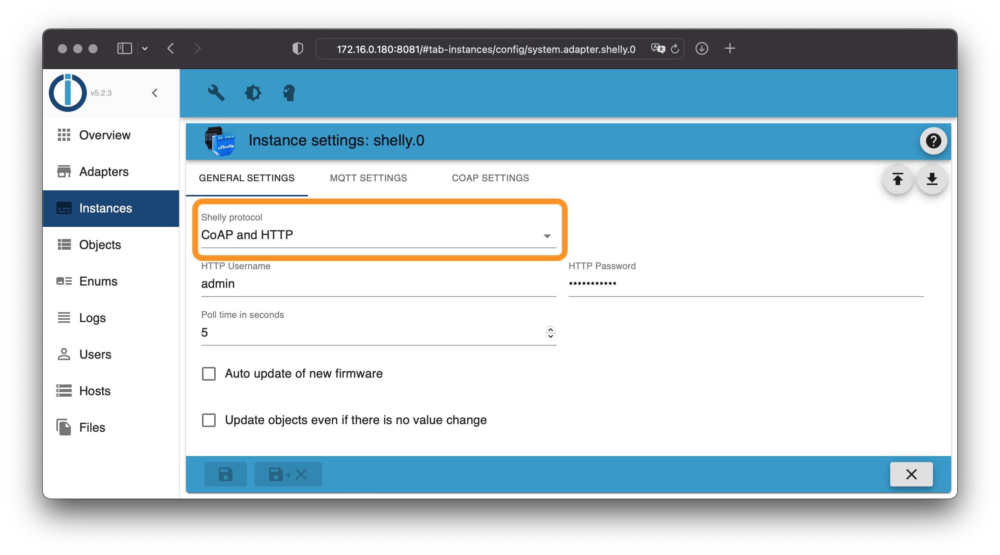
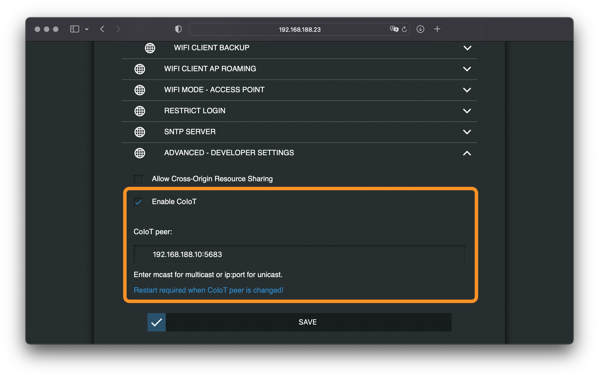
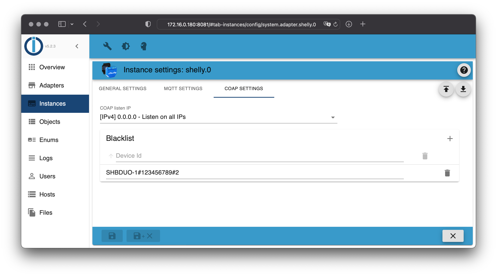

# IoBroker.shelly
Это немецкая документация - [🇺🇸 Английская версия](../en/protocol-coap.md)

## CoAP (CoIoT)
**Протокол CoAP/CoIoT поддерживается только устройствами первого поколения (Gen1) — устройства Plus и Pro (Gen2) этот протокол не поддерживают!**

**Если используется версия прошивки выше 1.9.4, на устройствах Shelly необходимо настроить сервер CoIoT (одноадресная передача).**

В качестве IP-адреса сервера ioBroker необходимо указать сервер CoIoT, а затем порт `5683`. Например, если ioBroker доступен по адресу `192.168.1.2`, то необходимо указать `192.168.1.2:5683` и активировать CoIoT.

**После внесения этих изменений устройство Shelly необходимо перезагрузить!**

CoAP/CoIoT добавляет все устройства в сеть. Если необходимо исключить отдельные устройства, их можно настроить в черном списке. Для этого необходимо ввести их серийные номера в таблицу.

### Более старые версии прошивки
Если используется устройство Shelly с версией прошивки 1.9.4 или ниже, дополнительная настройка не требуется. Адаптер автоматически обнаружит устройство.

**Важно: Поскольку CoAP/CoIoT использует многоадресные UDP-пакеты, устройства Shelly должны находиться в той же подсети, что и сервер ioBroker.**

### Важные инструкции
#### Docker
Если ioBroker работает в контейнере Docker, контейнер должен быть настроен в сетевом режиме `host` или `macvlan`. Если контейнер Docker работает в сетевом режиме `bridge`, устройства Shelly обнаружены не будут.

#### Прошивка Shelly 1.8.0 (или новее)
- При использовании протокола CoAP/CoIoT, начиная с этой версии, адаптер должен быть версии 4.0.0 (или новее).
Для устройств со старой версией прошивки (кроме Shelly 4 Pro) необходимо использовать адаптер версии 3.3.6 (или более раннюю). Адаптер версии 4.0.0 (или более поздняя) несовместим со старыми версиями прошивки!

#### Прошивка Shelly 1.9.4 (или новее)
Начиная с этой версии, при использовании протокола CoAP/CoIoT (одноадресная передача) на каждом устройстве Shelly необходимо настроить сервер CoAP/CoIoT.