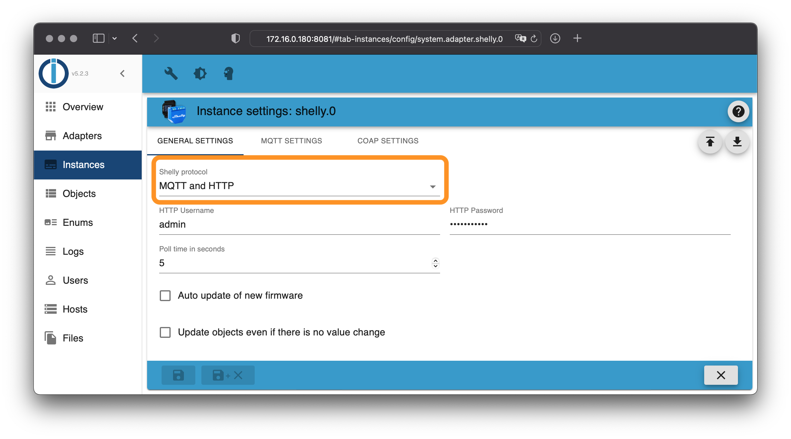
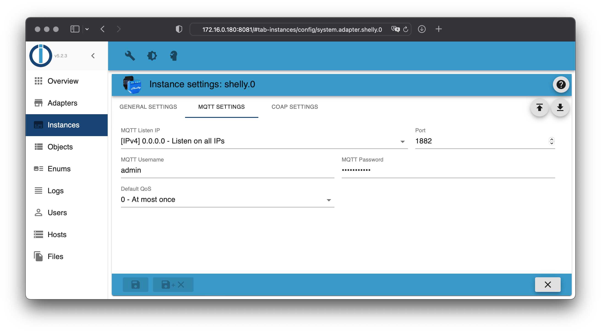
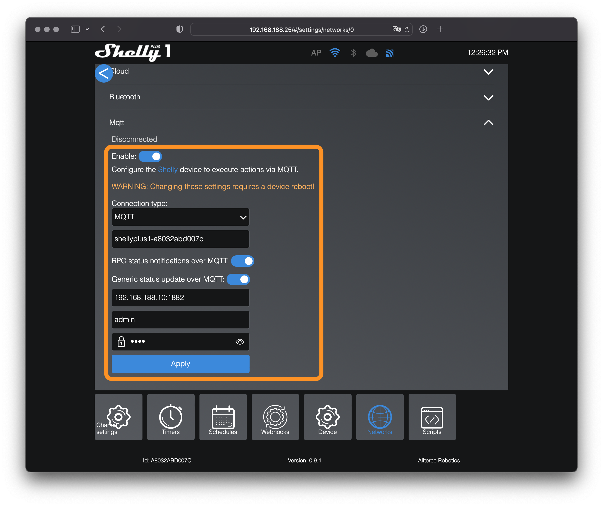
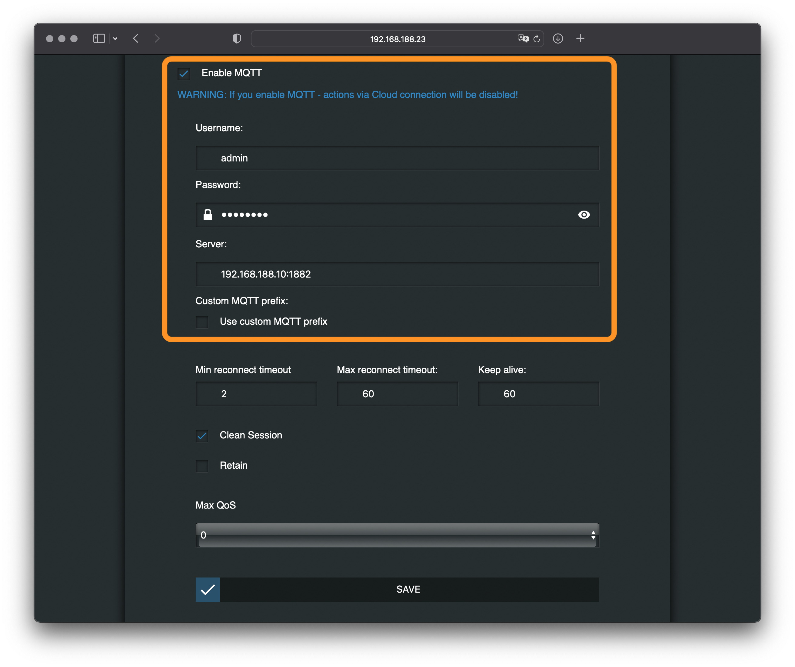

# ioBroker.shelly

Это немецкая версия документации - [🇺🇸 Английская версия](https://github.com/iobroker-community-adapters/ioBroker.shelly/blob/master/docs/en/protocol-mqtt.md)

## MQTT

### Важные инструкции

- Подключить адаптер Shelly к существующему MQTT-брокеру невозможно.
- Адаптер Shelly запускает собственный MQTT-брокер, работающий на этом порту.`1882` Запуск осуществляется во избежание конфликта с другими MQTT-брокерами в той же системе (стандартный порт для MQTT —`1883` )
- Невозможно подключить MQTT-клиент (например, MQTT Explorer) к внутреннему MQTT-брокеру.
- Порт по умолчанию для внутреннего MQTT-брокера можно изменить в конфигурации адаптера.
- **Знание протокола MQTT не требуется** — вся связь осуществляется внутри системы.

Есть вопросы? Сначала ознакомьтесь с [разделом часто задаваемых вопросов](/#/docs/adapterref/iobroker.shelly/faq.md) !

> \[!ВАЖНО] Адаптер Shelly не поддерживает подключение устройств Shelly через NAT (например, во многих конфигурациях VPN или с помощью расширителя диапазона Shelly).

### конфигурация

1. Откройте конфигурацию адаптера Shelly в ioBroker.
2. Выбирать`MQTT (und HTTP)` в качестве _протокола_ в _общих условиях_
3. Откройте вкладку **настроек MQTT** .
4. Выберите имя пользователя и надежный пароль (эту информацию необходимо ввести на всех устройствах Shelly).

> Адаптер Shelly запускает собственный внутренний MQTT-брокер. На всех устройствах Shelly, которые должны подключаться к этому брокеру, необходимо ввести настроенное имя пользователя и пароль.

На всех устройствах Shelly должна быть включена поддержка MQTT.

### Устройства 2-го поколения и старше (Plus и Pro)

1. Откройте веб-интерфейс Shelly в браузере (не в приложении Shelly!).
2. Откройте вкладку`Settings` и перейти к`Networks -> Mqtt`
3. Активируйте MQTT и введите только что настроенные данные пользователя и IP-адрес системы, на которой установлен ioBroker, а затем настроенный порт (например,`192.168.1.2:1882` )
4. Сохраните конфигурацию — Shelly автоматически перезагрузится.

- **В данной конфигурации не следует изменять параметр "идентификатор клиента".**
- **Для устройств второго поколения (Gen2+) необходимо включить все параметры RPC (см. скриншоты)!**
- Протоколы SSL/TLS не должны быть включены.

### Устройства первого поколения

1. Откройте веб-интерфейс Shelly в браузере (не в приложении Shelly!).
2. Перейти к`Internet & Security settings -> Advanced - Developer settings`
3. Активируйте MQTT и введите только что настроенные данные пользователя и IP-адрес системы, на которой установлен ioBroker, а затем настроенный порт (например,`192.168.1.2:1882` )
4. Сохраните конфигурацию — Shelly автоматически перезагрузится.

### Качество обслуживания (QoS)

В протоколе MQTT существует 3 уровня качества обслуживания (QoS):

- Не более одного раза (0) - гарантия доставки отсутствует (запустил и забыл)
- «По крайней мере один раз» (1) — гарантирует, что сообщение дойдёт до получателя хотя бы один раз.
- Ровно один раз (2) - гарантирует, что каждое сообщение дойдёт до получателя ровно один раз.