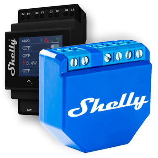
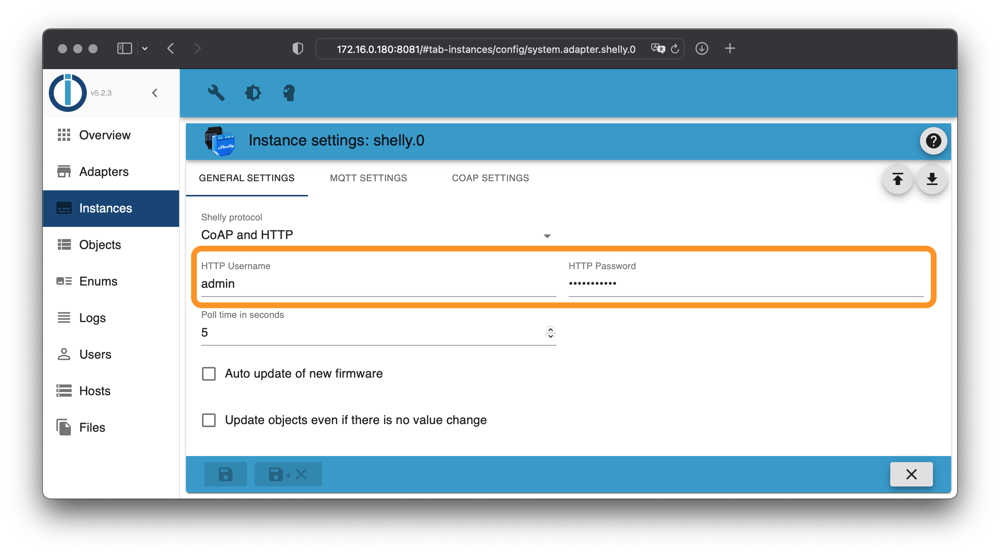
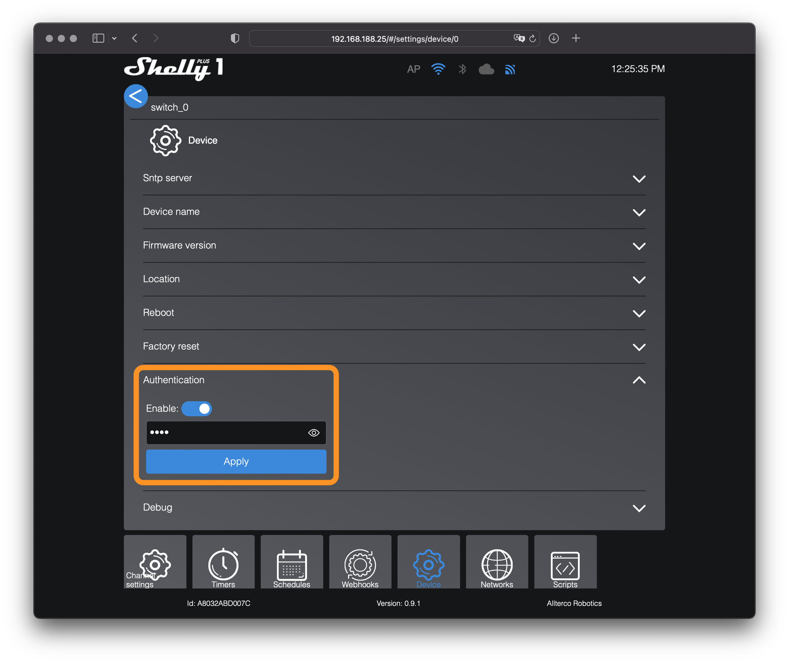
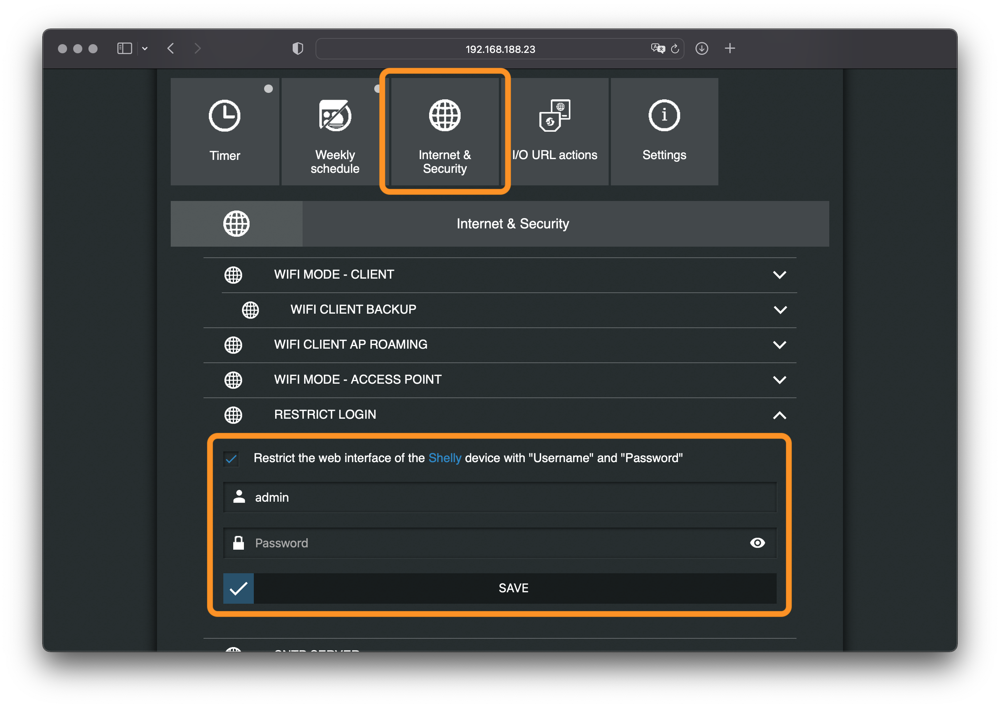

# IoBroker.shelly
Это немецкая документация - [🇺🇸 Английская версия](../en/restricted-login.md)

## Защищенный вход
Для защиты устройств Shelly от несанкционированного доступа необходимо указать имя пользователя и пароль на вкладке «Общие настройки» в конфигурации ioBroker.

Затем на всех устройствах Shelly необходимо включить защищенный доступ.

**Важный:**

- Устройства второго поколения и старше не предоставляют возможность выбора имени пользователя — имя пользователя можно выбрать произвольно, но это актуально только для устройств первого поколения.
- На всех устройствах должен быть установлен один и тот же пароль.
- Поколение 1: Необходимо настроить имя пользователя и пароль от экземпляра.
- Поколение 2+: Необходимо настроить только пароль из настроек экземпляра.

### Предупреждения
Если в ioBroker настроен пароль для устройства, адаптер будет записывать предупреждения в журнал, если некоторые устройства Shelly окажутся незащищенными!

Чтобы перестать получать предупреждения, вы можете либо...

- пароль удаляется из конфигурации адаптера (= пароль не требуется) или
— На всех устройствах Shelly должен быть включен защищенный доступ.

### Устройства 2-го поколения и старше (Plus и Pro)
1. Откройте веб-интерфейс конфигурации Shelly в браузере (не в приложении Shelly!).
2. Перейдите в «Настройки -> Аутентификация».
3. Активируйте функцию ввода пароля и введите только что настроенный пароль.
4. Сохраните конфигурацию.

### Устройства первого поколения
1. Откройте веб-интерфейс конфигурации Shelly в браузере (не в приложении Shelly!).
2. Перейдите в раздел «Настройки интернета и безопасности» -> «Ограниченный вход в систему».
3. Установите флажок для безопасного доступа и введите только что настроенные данные доступа.
4. Сохраните конфигурацию — Shelly автоматически перезагрузится.
5. Убедитесь, что на всех устройствах Shelly настроены идентичные данные доступа.

