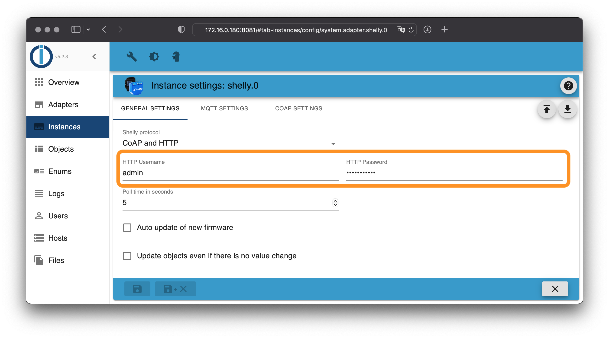
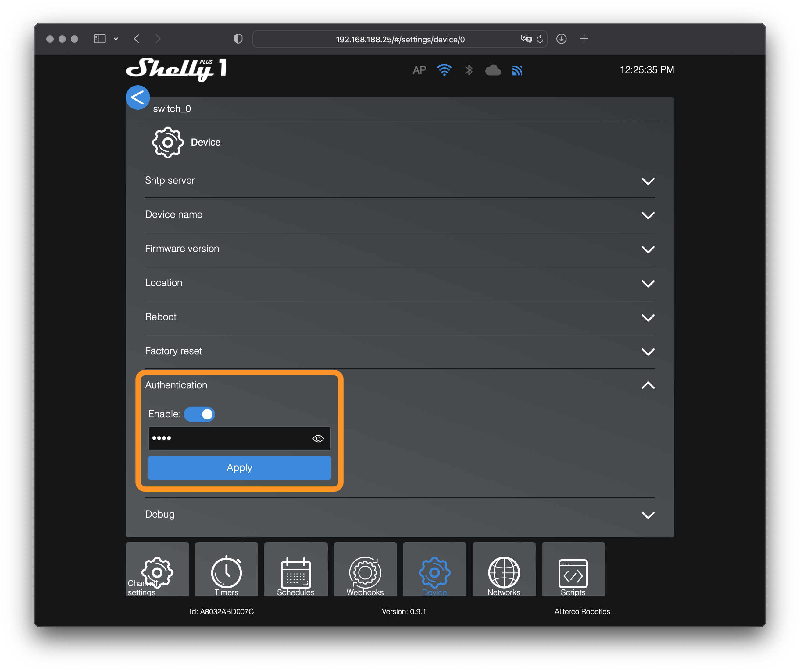
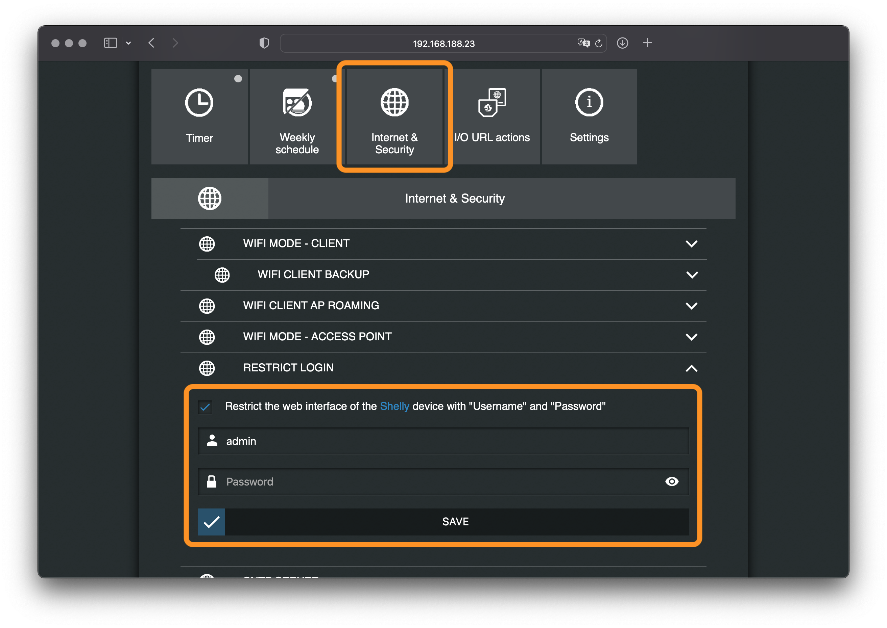

# ioBroker.shelly

Это немецкая версия документации - [🇺🇸 Английская версия](https://github.com/iobroker-community-adapters/ioBroker.shelly/blob/master/docs/en/restricted-login.md)

## Защищенный вход

Для защиты устройств Shelly от несанкционированного доступа необходимо указать имя пользователя и пароль на вкладке _«Общие настройки»_ в конфигурации ioBroker.

Затем на всех устройствах Shelly необходимо включить защищенный доступ.

**Важный:**

- В устройствах второго поколения и старше отсутствует возможность выбора имени пользователя — имя пользователя можно выбрать произвольно, но это актуально только для устройств первого поколения.
- На всех устройствах необходимо установить один и тот же пароль.
  - Поколение 1: Необходимо настроить имя пользователя и пароль от экземпляра.
  - Поколение 2+: Необходимо настроить только пароль из настроек экземпляра.

### Предупреждения

Если в ioBroker настроен пароль для устройства, адаптер будет записывать предупреждения в журнал, если некоторые устройства Shelly окажутся незащищенными!

Чтобы перестать получать предупреждения, вы можете либо...

- Пароль можно удалить из конфигурации адаптера (= пароль не требуется) или
- На всех устройствах Shelly необходимо включить функцию защищенного доступа.

### Устройства 2-го поколения и старше (Plus и Pro)

1. Откройте веб-интерфейс Shelly в браузере (не в приложении Shelly!).
2. Перейти к`Settings -> Authentication`
3. Активируйте функцию ввода пароля и введите только что настроенный пароль.
4. Сохраните конфигурацию

### Устройства первого поколения

1. Откройте веб-интерфейс Shelly в браузере (не в приложении Shelly!).
2. Перейти к`Internet & Security settings -> Restricted Login`
3. Установите флажок для безопасного доступа и введите только что настроенные данные доступа.
4. Сохраните конфигурацию — Shelly автоматически перезагрузится.
5. Убедитесь, что на всех устройствах Shelly настроены одинаковые данные доступа.

