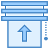


# Документация и инструкции по использованию Shuttercontrol


---

## Поддержка разработки адаптеров
**Если вам понравился адаптер, пожалуйста, рассмотрите возможность пожертвования:**

[](https://paypal.me/mk1676)

---

## Основы
>:grey_exclamation: Данное руководство действительно начиная со стабильной версии 1.6.2 :grey_exclamation:

Shuttercontrol — это адаптер для комплексного управления рольставнями, жалюзи или навесами, включающий в себя как автоматическое затенение, так и ночное затемнение.

Для простоты здесь упоминаются только рольставни.

Для управления доступно большое количество настраиваемых параметров, например:

* Три разных глобальных таймера, например, для гостиной, спальни и детской комнаты.
* Различные параметры, зависящие от положения солнца, которые можно устанавливать индивидуально для каждой рольставни.

можно настраивать индивидуально для каждой рольставни.

* Триггеры для датчиков дверей/окон, которые служат для защиты от блокировки или автоматического открытия на индивидуальном уровне.

Открытие происходит на индивидуальном уровне при открытии двери или окна.

* Различные регулируемые параметры затенения в зависимости, например, от

внутренняя температура, наружная температура, яркость, датчик тепла или аналогичный датчик.

* Учет положения солнца позволяет затемнять только те комнаты, которые действительно находятся в тени.

освещены.

Все параметры конфигурации уже предварительно заданы с примерами, поэтому адаптер быстро готов к использованию после установки и ввода идентификаторов затвора, готового к работе.

Дальнейшая настройка затем используется для адаптации к личным пожеланиям.

> Shuttercontrol может управлять приводами только по положению, например, по уровню, со значениями от 0 до 100 или от 0 до 255 соответственно. Время срабатывания жалюзи или штор должно управляться приводом.
Управление приводами жалюзи, предлагающими по одному объекту для «высоты» и «угла ламелей», может осуществляться с помощью двух жалюзи.
Можно использовать с двумя объектами жалюзи с одинаковой параметризацией.
Можно использовать.

---

## Установка
Адаптер находится в «стабильном» репозитории ioBroker. На вкладке «Адаптер» выбирается «shuttercontrol», и экземпляр адаптера shuttercontrol создается с помощью (+).

## Конфигурация
После создания экземпляра автоматически открывается окно конфигурации с вкладками «ОСНОВНЫЕ НАСТРОЙКИ», «НАСТРОЙКИ ВРЕМЕНИ» и «ДОПОЛНИТЕЛЬНЫЕ НАСТРОЙКИ».

>:point_right: Сначала следует редактировать вкладки [[Настройки времени](#настройки времени) и [Дополнительные настройки]](#extra-settings), то есть до добавления ставней с помощью стилуса в ГЛАВНЫХ НАСТРОЙКАХ.

---

### ОСНОВНЫЕ НАСТРОЙКИ
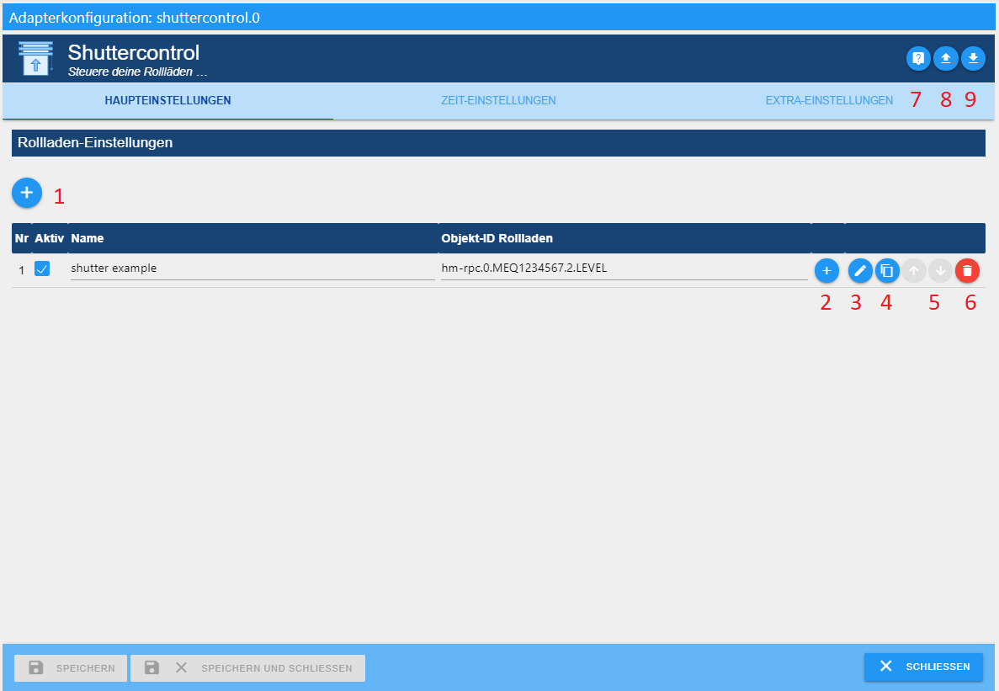 --- >:point_right: Доступ к документации на GitHub можно получить через вопросительный знак в правом верхнем углу (7).

#### Сохранение или загрузка конфигурации адаптера
Нажмите на стрелку вниз (9) в правом верхнем углу, чтобы сохранить конфигурацию адаптера в виде файла .json.
Нажмите на стрелку вверх (8), чтобы загрузить существующую конфигурацию адаптера в формате .json.

_[Вернуться наверх](#documentation-and-instructions-for-shuttercontrol)_

---

### НАСТРОЙКИ ВРЕМЕНИ
Здесь выполняются основные настройки времени или астрономические настройки, которые впоследствии используются в [Настройки затвора](#shutter-settings) для каждого затвора.

[Настройки затвора](#shutter-settings) для каждого затвора.

>:heavy_exclamation_mark: Shuttercontrol всегда закрывает ставни **в пятницу** в установленное время **выходных**.

и **в воскресенье** всегда в установленное время **рабочей недели** :heavy_exclamation_mark:

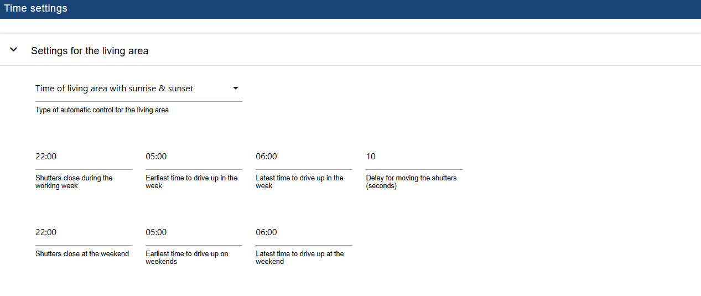

#### Настройки гостиной, спальни и детской зоны
Индивидуальные настройки открываются через выпадающее меню. Описание приведено в качестве примера для гостиной и аналогично применяется ко всем зонам.
для всех зон.

Конечно, эта категоризация не обязательно должна использоваться для гостиной, спальни или детской зоны.
Детская зона, но позволяет определить три зоны в здании с разным временем срабатывания рольставней.

**Тип автоматического управления для жилой зоны**

Выпадающее меню используется для выбора между:

* **Только время пребывания в гостиной:**

*Роллетные ворота управляются только по таймеру.

* Время в жилой зоне с восходом и закатом солнца.

*Управление рольставнями осуществляется в соответствии с восходом и закатом солнца, но они не поднимаются раньше самого раннего времени и не опускаются позже самого позднего времени.

* **Зона отдыха с эффектом «золотого часа»:**

*По аналогии с восходом и закатом солнца, но с учетом начала и конца «золотого часа».

**Закрытие ставней в течение рабочей недели:** *Обычное время для затемнения помещений в будние дни*.

**Самое раннее время для поднятия ставней в будние дни:** *Это самое раннее время для поднятия ставней в будние дни.

**Последнее время подъема в течение недели:** *Это самое позднее время, когда рольставни будут подняты в течение недели*.

**Задержка по времени для поэтапного подъема рольставней (в секундах):** *Расстояние между отдельными подъемами рольставней данного диапазона, например, для предотвращения радиопомех или для создания впечатления, что они перемещаются вручную.

**Закрытие рольставней в выходные дни:** *Обычное время затемнения в выходные дни **и** в праздничные дни.

**Самое раннее время поднятия ставней в выходные дни:** *Это самое раннее время, когда ставни поднимаются в выходные дни **и** в праздничные дни.

**Крайнее время подъема рольставней в выходные дни:** *В настоящее время рольставни поднимаются в выходные дни **и** самое позднее в праздничные дни*.

>:point_right: Если рольставни никогда не должны подниматься, если солнце еще не прошло определенное положение, то это время должно быть установлено на самое позднее время для этого положения солнца (на 21.12.).

_[Вернуться наверх](#documentation-and-instructions-for-shuttercontrol)_

---

### ДОПОЛНИТЕЛЬНЫЕ НАСТРОЙКИ
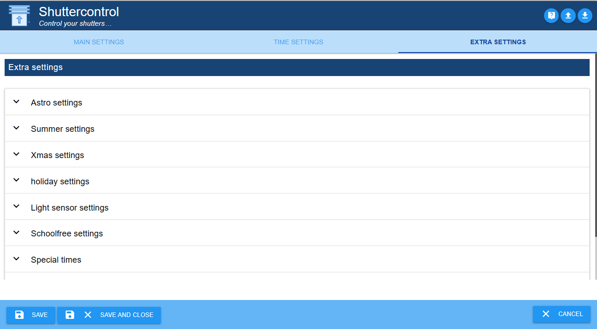

#### Настройки астрономии
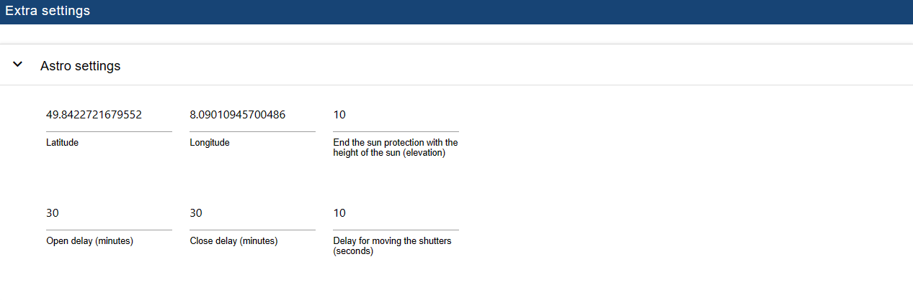

**Широта и долгота:** *Shuttercontrol берет широту и долготу из системных настроек ioBroker.

Shuttercontrol использует эти значения для расчета положения солнца.

**Выход из функции защиты от солнца при изменении высоты солнца:** *Как только солнце опустится ниже заданной здесь высоты, затенение прекратится.
Затенение, заданное Shuttercontrol, прекращается.

>:point_right: Возможно, преждевременное затенение, вызванное зданиями или высокими деревьями, можно учесть и прекратить автоматическое затенение раньше.

**Задержка подъема или опускания (минуты):** *Здесь можно ввести смещение +/-, на которое следует задержать движение затвора относительно типа автоматического управления, выбранного в [Настройки времени](#time-settings).

**Задержка по времени для пошагового перемещения затворов (в секундах):** *Чтобы предотвратить одновременное перемещение всех затворов, здесь можно установить общую задержку по времени в секундах.

_[Вернуться наверх](#documentation-and-instructions-for-shuttercontrol)_

---

#### Летние настройки
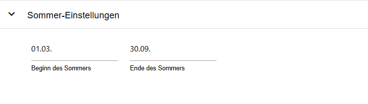

**Начало лета** и **Конец лета**: *Здесь начало или конец лета можно установить по вашему желанию.

В соответствии с разделом [Настройки затвора](#shutter-settings) соответствующей ставни, установка флажка в значение ``Do not close shutter in summer`` предотвращает закрытие этой ставни летом.

_[Вернуться наверх](#documentation-and-instructions-for-shuttercontrol)_

---

Рождественские настройки
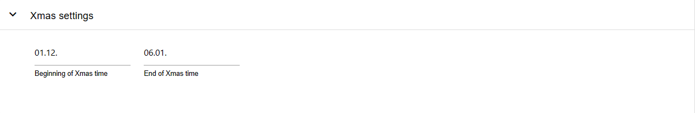

**Начало рождественского периода** и **конец рождественского периода**: *Здесь вы можете установить начало или конец рождественского периода по своему усмотрению.**

В разделе [Дополнительные настройки для рольставней](#extra-settings-roller-shutter) Рождественские настройки включается желаемая в данный момент функция и устанавливается желаемое положение рольставни.

_[Вернуться наверх](#documentation-and-instructions-for-shuttercontrol)_

---

#### Настройки для праздников и государственных праздников
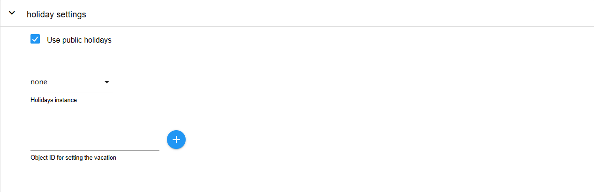

**Использование в праздничные дни:** *Установив этот флажок и выбрав соответствующий экземпляр адаптера для праздничных дней, вы сможете перемещать жалюзи в праздничные дни в установленное время, начиная с выходных.**

>:point_right: При необходимости можно создать два экземпляра адаптера государственных праздников: > один для отображения всех возможных государственных праздников, а другой — с государственными праздниками, относящимися к рабочему времени, к которому затем будет обращаться shuttercontrol.

**Идентификатор объекта для установки праздника:** Этот идентификатор объекта устанавливает внутреннее состояние «Праздник».

Здесь, например, можно использовать точку данных из адаптера iCal, которая возвращает значение ``true`` в случае праздника и, таким образом, позволяет жалюзи перемещаться в выходные дни.

_[Вернуться наверх](#documentation-and-instructions-for-shuttercontrol)_

---

#### Настройки датчика яркости
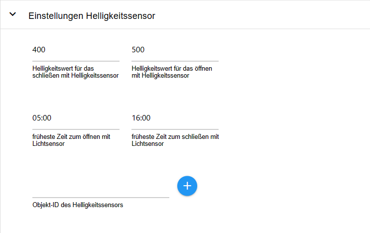

Если необходимо, чтобы жалюзи перемещались автоматически с помощью датчика яркости, это настраивается здесь.

Затем активация выполняется индивидуально для каждой ставни в соответствии с [Основные настройки затвора](#main-shutter-settings).
В разделе **Тип управления закрытием (или открытием) рольставни** выберите пункт «Датчик яркости».

**Значение яркости для закрытия с помощью датчика яркости** *Значение яркости, при достижении которого жалюзи должны быть закрыты.

**Значение яркости для открытия с помощью датчика яркости** *Значение яркости, при достижении которого должны открываться жалюзи*.

**Идентификатор объекта датчика яркости** *Ссылка на датчик яркости, например, с метеостанции, наружного датчика движения или отдельного датчика яркости.

_[Вернуться наверх](#documentation-and-instructions-for-shuttercontrol)_

---

#### Настройки школьных каникул
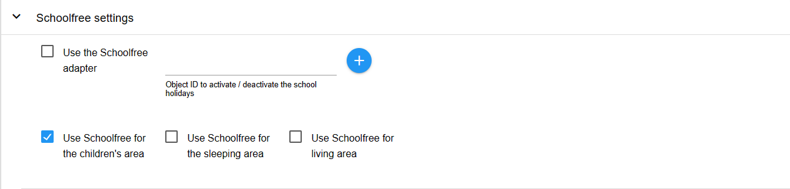

Здесь период каникул можно активировать либо через отдельную точку данных с **идентификатором объекта для активации/деактивации школьных каникул**, либо установив флажок для экземпляра установленного адаптера Schoolfree.
В этом случае жалюзи открываются в течение периода каникул в установленное время для поездок в выходные дни.
Режим каникул можно активировать индивидуально для каждого региона.

_[Вернуться наверх](#documentation-and-instructions-for-shuttercontrol)_

---

#### Особые времена
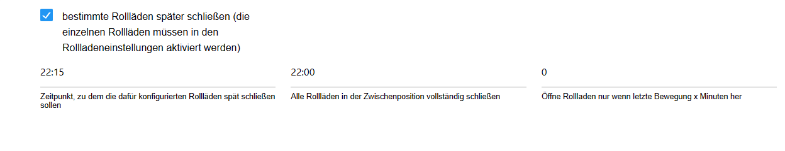

**Закрывать определенные ставни позже** *Эта опция позволяет снова опустить все ставни поздно вечером.
Это относится к ситуации, когда в обычное время закрытия окно или дверь все еще открыты.
Окно или дверь все еще открыты в обычное время закрытия, или если, например, дверь на террасу снова открывается после закрытия.
Если установлен флажок, появляется параметр **Время, когда настроенные рольставни должны закрываться позже**.

> Эту функцию необходимо активировать для каждой рольставни в [Настройки затвора](#shutter-settings), установив флажок **Закрывать рольставни с задержкой** для каждой рольставни отдельно, или деактивировать, если она не требуется.

**Полностью закройте все ставни в промежуточном положении.** *Время, когда все ставни полностью закрыты вечером (например, 22:00)*.

**Открывать рольставни только в том случае, если последнее движение произошло x минут назад:** *Роллетни открываются адаптером только по истечении заданного здесь времени.

_[Вернуться наверх](#documentation-and-instructions-for-shuttercontrol)_

---

#### Дополнительные настройки
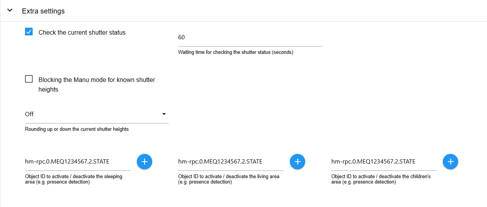

**Проверка текущего состояния затвора:** У некоторых пользователей (в том числе и у пользователей Shelly) возникает проблема с незначительным изменением уровня. Поэтому здесь есть флажок.
Если флажок активирован, Shuttercontrol проверит текущий уровень после истечения времени ожидания проверки состояния затвора, Shuttercontrol проверит текущий уровень и временно сохранит его.

**Блокировка ручного режима для известных высот жалюзи** *Округление текущих высот жалюзи в большую или меньшую сторону*.
Здесь положение рольставней можно округлять с шагом в 5 или 10.

**Идентификатор объекта триггера для спальной зоны (Авто):** *Этот триггер активирует автоматический режим спальной зоны.

**Идентификатор объекта триггера жилой зоны (Авто):** *Этот триггер активирует автоматический режим жилой зоны.

**Идентификатор объекта триггера для дочерней области (Авто):** *Этот триггер активирует автоматический режим дочерней области.

---

#### Настройки будильника
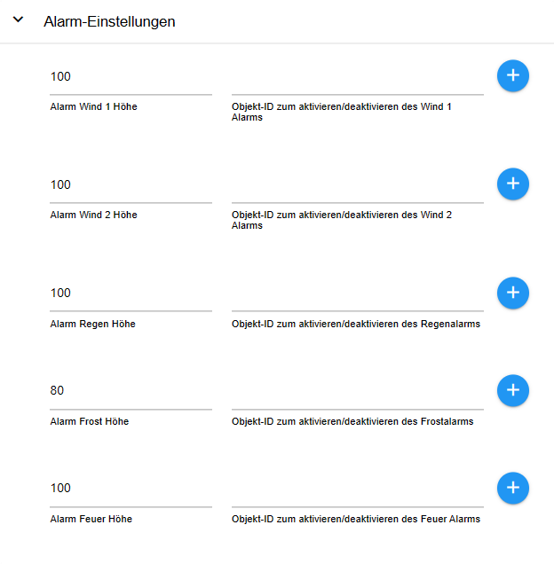

>:point_right: Для каждого сигнала тревоги требуется логическая точка данных (истина/ложь) для активации, > которая активирует **сигнал тревоги** = статус **истина** или деактивирует **сигнал тревоги** = статус **ложь**.

>:point_right: Кроме того, для каждого сигнала тревоги необходимо определить высоту (0-100%), на которую перемещается рольставень в случае срабатывания сигнала тревоги.

>point_right: В [Настройка будильника](#alarm-setting) соответствующего рольставня определяется, на какие сигналы тревоги должна реагировать рольставень.
рольставень должна реагировать.

Приоритеты отдельных сигналов тревоги:

Приоритет 1 (наивысший приоритет) --> Огонь:

Если сработает эта сигнализация, рольставни, настроенные для неё, в **любом** случае переместятся на заданную высоту.

>:восклицательный знак: В этом случае рольставни будут заблокированы и **НЕ** закроются автоматически, даже если пожарная сигнализация будет сброшена (ложная).

После сброса пожарной сигнализации необходимо повторно инициализировать жалюзи с помощью кнопок «открыть все» / «закрыть все».
Это предотвратит автоматическое повторное закрытие рольставней по любой причине в случае пожара.
Это также гарантирует, что пути эвакуации останутся открытыми, и доступ для пожарной бригады будет обеспечен.

Приоритет 2-5 (одинаковый приоритет) --> Дождь, Ветер 2, Ветер 1, Мороз:

При срабатывании этих сигналов тревоги система Shuttercontrol перемещает настроенные рольставни на последний активный уровень тревоги.

Однако при отключении отдельных сигналов тревоги соблюдается следующий приоритет: Приор 1 = Пожар Приор 2 = Дождь Приор 3 = Ветер 2 Приор 4 = Ветер 1 Приор 5 = Мороз

Сигнализация о замерзании срабатывает напрямую только в том случае, если активированные рулонные шторы уже закрыты (опасность замерзания рулонных штор). Если сигнализация о замерзании срабатывает, когда рулонная штора еще открыта, она автоматически перемещается на высоту, заданную для срабатывания сигнализации, только в закрытом состоянии.

_[Вернуться наверх](#documentation-and-instructions-for-shuttercontrol)_

---

### Настройки затвора
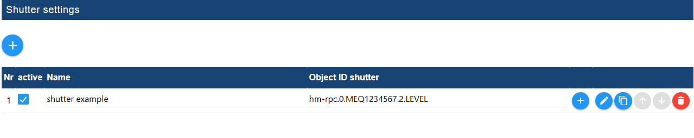

>:point_right: Пример привода *пример жалюзи* создается автоматически, пожалуйста, удалите его через корзину (5).

Теперь добавьте свои собственные приводы жалюзи, нажав на (+) (1). Откроется окно выбора идентификатора, выберите точку данных УРОВЕНЬ, которая представляет положение нужной рольставни.

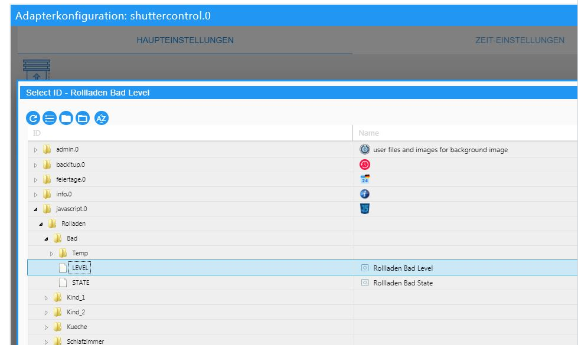

Структура таблицы:


* **№:** *порядковый номер перечисленных ставней*.

* **Активно:** *Флажок для активации/деактивации управления соответствующей рольставней*.

* **Имя:** *Имя исполнительного механизма автоматически считывается из объектов при выборе идентификатора.

и затем может быть изменено в соответствии с вашими пожеланиями.

* **Идентификатор объекта затвора:** *Уникальный идентификатор точки данных, управляемой в объектах*.

* **(+)** *Изменить выбранный привод рольставней* * **Карандаш** * *Изменить выбранный привод рольставней

* **Карандаш** *Откройте индивидуальную конфигурацию соответствующей рольставни*.

* **Двойной лист:** *Роллетная шторка для копирования*

* **Стрелки:** *Определите порядок перемещения рольставней при одинаковых настройках.

* Корзина:* *Удаляет привод жалюзи со всеми настроенными данными.*

После создания рольставней, нажатием карандаша (3) на соответствующую рольставню с помощью вкладок [ОСНОВНЫЕ НАСТРОЙКИ для рольставней](#main-shutter-settings), [НАСТРОЙКИ ЗАЩИТЫ ОТ СОЛНЦА](#sun-protection-settings) и [ДОПОЛНИТЕЛЬНЫЕ НАСТРОЙКИ]](#extra-settings) каждая рольставня дополнительно настраивается индивидуально.

---

#### Основные настройки затвора
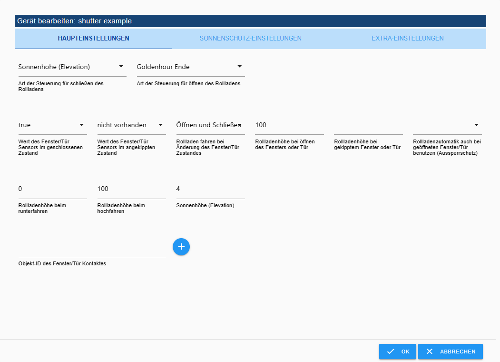

В верхней части экрана время открытия или закрытия ставней выбирается отдельно с помощью выпадающего меню.

> :point_right: Эти временные параметры уже заданы в [Настройки времени](#time-settings).

Варианты выбора:

* **Выкл.:** *Не используйте таймеры.

* **Жилая зона:** *Жалюзи перемещаются в соответствии с настройками, указанными в *Настройках жилой зоны*.

* Жилая зона (автоматически):** **Роллетные ворота перемещаются в заданное время в* астройках жилой зоны*.

Кроме того, рольставни активируются в ответ на триггер, заданный в разделе «Дополнительные настройки».
Идентификатор объекта для активации/деактивации автоматического управления жилой зоной. Если этот параметр установлен в значение «false», рольставни **не** будут перемещаться автоматически.

* Роллетные ворота перемещаются в моменты времени, заданные в *Настройках спальной зоны*.

* Роллетные ворота перемещаются в время, указанное в *Настройках спальной зоны*.

Кроме того, рольставни активируются в ответ на триггер, указанный в разделе «Дополнительные настройки».
Идентификатор объекта для активации/деактивации зоны автоматического перехода в спящий режим.
Если этот параметр установлен в значение «false», рольставни **не** будут перемещаться автоматически.

* Детская зона: **Роллетные ворота перемещаются в то время, которое задано в* астройках детской зоны*.

* Детская зона (автоматическая):* *Роллетные ворота перемещаются в заданное время в *Настройках детской зоны*.

Кроме того, затвор активируется в ответ на триггер, заданный в разделе «Дополнительные настройки».
Идентификатор объекта для активации/деактивации автоматической детской зоны.
Если этот параметр установлен в значение «false», затвор **не** будет перемещаться автоматически.

* Закат/Восход солнца:** * *Затвор срабатывает при закате или восходе солнца.

* Высота солнца: Если высота солнца опускается ниже заданного здесь значения, рольставни закрываются.

* Золотой час:** * * Рольставни закрываются в золотой час, который, в зависимости от широты и времени года, наступает примерно за 1 час до захода солнца или после восхода солнца.

до захода солнца или после восхода солнца, в зависимости от широты и времени года.

* Датчик яркости:** * * Роллетень перемещается только в соответствии с показаниями датчика яркости, которые задаются в разделе [Настройки датчика яркости](#brightness-sensor-settings).

* Только ручное управление:** * * Роллетные ворота можно перемещать вручную только в выбранном направлении.

:point_right: Перемещение с помощью кнопок под ``shuttercontrol.0.control`` невозможно.
point_right: Это может быть полезно, например, для навесов, которые не следует открывать вместе с другими рольставнями.
которые не следует открывать вместе с другими рольставнями.

**Значение датчика окна/двери в закрытом состоянии:** *Здесь определяется значение, которое может принимать триггер в **Идентификаторе объекта контакта окна/двери** (например, контакт окна или двери).

(например, контакт окна или поворотной ручки), при котором автоматическая система рольставней может двигаться неограниченно.

:point_right: Можно выбрать значения, такие как true, false, 0, 1 или 2.

> point_right: Если рольставни находятся не в верхнем положении и изменяется указанное здесь состояние датчика, рольставни перемещаются в верхнее положение.
При изменении состояния датчика рольставни перемещаются на **высоту рольставней при открытии окна или двери**.

**Значение датчика окна/двери в наклонном состоянии:** *Это значение задает триггер в разделе **Идентификатор объекта контакта окна/двери** (например, контакт окна или двери).

(например, контакт окна или поворотной ручки), при котором автоматическая система рольставней может двигаться неограниченно.

:point_right: Можно выбрать значения, такие как true, false, 0, 1 или 2.

> point_right: Если рольставни находятся не в верхнем положении и изменяется указанное здесь состояние датчика, рольставни перемещаются в верхнее положение.
При изменении состояния датчика рольставни перемещаются на **высоту рольставней при открытии окна или двери**.

> :восклицательный знак: Если отсутствует контакт окна с функцией наклона, это значение следует установить на «отсутствует».

**Перемещение рольставней при изменении состояния окна/двери:** *Выберите функцию, которая должна выполняться при срабатывании датчика окна/двери, проведя пальцем по экрану:*

**Выкл.**: нет движения

* **Открыто**: При открытии окна/двери ставня поднимается и остается в этом положении; при закрытии ставня не двигается.
* **Закрытие**: После закрытия окна/двери рольставни перемещаются в положение полного затемнения; при открытии рольставни не двигаются.

**Открытие и закрытие:** Роллетная ставня поднимается при открытии окна/двери и опускается при закрытии.

**Высота рольставней при открытии окна или двери:** *Желаемое положение рольставней от 0 до 100, например, для окон 25% для вентиляции или 100% для прохода через двери.
для прохода через двери.

**Высота рольставней при наклоне окна или двери:** *Желаемое положение рольставней от 0 до 100, например, для окон 25% для вентиляции.

**Использовать автоматические рольставни даже при открытом окне/двери (защита от блокировки)** **Если в момент автоматического закрытия датчик окна/двери __не__ соответствует введенному значению (окно/дверь закрыто), будут выполнены следующие действия в соответствии с выбранной настройкой:**

* **Выкл.**: Защита от блокировки активна в обоих направлениях, ставни не двигаются, когда окно открыто.
* **Открыто**: Допускается только поднятие. По окончании затемнения/затенения рольставни поднимаются, даже если окно открыто. Рольставни не закрываются автоматически, когда окно открыто.
* **Закрытие**: Разрешено только закрытие. В начале затемнения/затенения рольставни опускаются, несмотря на то, что окно открыто. Рольставни не открываются, когда окно открыто.
* **Открытие и закрытие**: Роллетная ставня может перемещаться в обоих направлениях, когда окно открыто.

**Также используйте эти высоты при автоматическом закрытии окна с открытым или наклоненным окном:** *Если эта опция активна и окно открыто или наклонено, когда автоматический режим опускает окно, рольставни впоследствии перемещаются на **Высоту рольставней при открытии окна или двери** или **Высоту рольставней при наклоне окна или двери**. До сих пор эти высоты использовались только при изменении показаний датчика окна/двери — с этой опцией они также применяются при автоматическом закрытии.

Если **Значение датчика окна/двери при наклоне** установлено на «недоступно», всегда используется высота для открытого окна.*

> :point_right: Роллетная ставня **сначала полностью закрывается** в положение затемнения, и только затем перемещается на высоту вентиляции. Это сделано намеренно: двигатели ставней обычно быстрее опускаются вниз, чем поднимаются вверх, поэтому тот же процент, достигаемый сверху, соответствует положению, которое достигается снизу. Начиная с закрытого крайнего положения, заданное значение всегда соответствует положению, которое используется и при открытии окна.

> :point_right: Между двумя приводами адаптер ожидает **время ожидания проверки состояния жалюзи**, заданное в **Дополнительных настройках** (по умолчанию 60 секунд). Это время должно быть как минимум равно времени работы рольставни. Подтверждение от устройства не является достаточным критерием: некоторые устройства — например, подключенные через zigbee2mqtt — сообщают целевое положение через несколько миллисекунд после команды, а не в конце работы привода. Вторая команда, отправленная во время работы двигателя, теряется на таких устройствах — рольставня в этом случае сообщает высоту вентиляции, но остается закрытой.

> :point_right: Эта опция изменяет только **целевую высоту**, а не права доступа к диску. Возможность перемещения рольставни при открытом окне по-прежнему определяется блокировкой. Если она установлена в положение «Выкл.» или «Открыто», рольставня все равно не будет двигаться при открытом окне.

> :point_right: Активная сигнализация о заморозках имеет приоритет — в этом случае по-прежнему используется положение защиты от заморозков.

> :point_right: Если окно закрыто, когда рольставни еще перемещаются в положение затемнения, они остаются в этом положении, и высота вентиляции больше не используется.

> :point_right: Положение полного затемнения сохраняется и устанавливается сразу после закрытия окна. Для этого необходимо установить параметр **«Створки перемещаются при изменении состояния окна/двери»** в положение «Закрыто» или «Открыто и закрыто», либо включить параметр **«Установка положения после закрытия окна»**.

> :point_right: Эта опция применяется ко всем автоматическим режимам понижения яркости (автоматический режим по времени, восход/закат, золотой час, высота солнца, датчик яркости и позднее понижение яркости). Защита от солнца и кнопка ручного «повышения яркости» остаются без изменений.

**Высота рольставни в опущенном состоянии:** *Значение положения в закрытом состоянии рольставни.

**Высота рольставни в поднятом состоянии:** *Значение положения в открытом состоянии рольставни*.

> :point_right: Высота рольставней должна быть указана в соответствии с используемыми приводами (0-100 или 0-255): > 0 = закрыто и 100 = открыто или 0 = открыто и 100 = закрыто.

**Идентификатор объекта контакта окна/двери:** Используйте (+) для выбора датчика (состояния), который предотвращает движение рольставни (например, контакт двери).

_[Вернуться наверх](#documentation-and-instructions-for-shuttercontrol)_

---

#### Настройки защиты от солнца
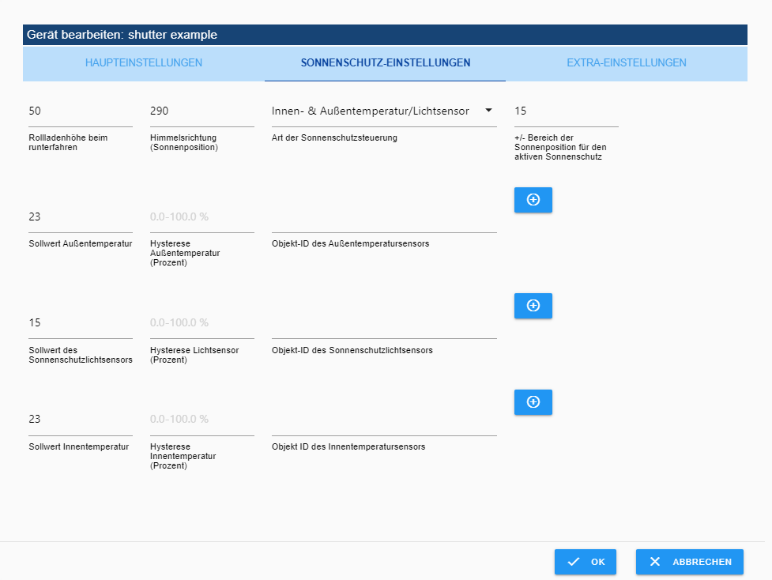

**Тип управления солнцезащитой:** Солнцезащитой можно управлять с помощью различных триггеров для регулировки степени затенения и его окончания. Следующие комбинации можно выбрать с помощью выпадающего списка:

* Из
* Датчик температуры/освещенности внутри и снаружи помещения
* Направление по компасу (положение солнца)
* Датчик температуры/освещенности внутри/снаружи помещения и направление света
* Датчик внешней температуры/освещенности и направление света
* Датчик температуры/освещенности наружного воздуха
* Температура в помещении

> :point_right: Защита от солнца срабатывает только тогда, когда ВСЕ триггеры выбранной комбинации активны (логическое И-соединение), и прекращается, когда ОДИН из триггеров становится неактивным.

> :point_right: Для ВСЕХ выбранных триггеров также необходимо сохранить идентификатор объекта.

> :point_right: Датчик освещенности всегда является необязательным и может оставаться пустым. Если датчик освещенности настроен, он связывается с другими параметрами И.

**Высота опускания рольставней:** *Значение, на которое рольставни должны быть закрыты при затенении.*

**Направление (положение солнца):** *Расположение окна на розе ветров (0° = север; 180° = юг)*

**Диапазон положения солнца +/- для активной защиты от солнца:** *Область, в которой солнце (примерно в центре) будет мешать обзору через окно. За пределами этой области затенение отсутствует.*

**Установленная температура наружного воздуха:** *Начало затенения при этом значении (или выше).*

**Гистерезис наружной температуры (в процентах):** *Здесь можно установить гистерезис в процентах, чтобы рольставни в разделе «Колебания» не поднимались и не опускались постоянно.* Гистерезис — это разница между верхним значением температуры, при котором должно начинаться затенение, и нижним значением температуры, при котором затенение прекращается.

**Идентификатор объекта наружной температуры:** Датчик, выбранный здесь с помощью (+) , не обязательно должен измерять наружную температуру. Он может предоставлять любое значение, которое может быть использовано для запуска затенения.
Это также может быть датчик тепла (датчик разницы температур).
Если в качестве триггера не выбран ни один наружный датчик, оставьте это поле пустым.

**Уставка датчика освещенности для защиты от солнца:** *Пороговое значение для начала затенения.* Это значение зависит от датчика, выбранного в поле **Идентификатор объекта для датчика освещенности для защиты от солнца**.

**Гистерезис датчика освещенности (в процентах):** Здесь вы можете установить гистерезис в процентах, чтобы рольставни не двигались постоянно вверх и вниз при колебаниях, вызванных изменением облачности.
Гистерезис — это разница между заданным значением, с которого должно начинаться затенение, и нижним значением яркости, с которого затенение должно заканчиваться.

> :point_right: Пример: Уставка датчика освещенности для защиты от солнца установлена на 30 000, гистерезис — на 40%: защита от солнца активируется с 30 000 и остается активной до тех пор, пока значение не упадет ниже 18 000.

**Идентификатор объекта датчика освещенности для защиты от солнца:** *Аналог датчика наружной температуры* Если не выбран в качестве триггера, оставьте поле пустым.

**Уставка внутренней температуры:** Здесь вы можете ввести температуру внутреннего датчика температуры, назначенного рольставням, при которой не должно быть затенения, например, для снижения теплопотерь и использования излучения зимой для поддержания отопления.

**Гистерезис внутренней температуры (в процентах):** *Здесь можно установить гистерезис в процентах, чтобы колебания внутренней температуры рольставни не были постоянными.* Гистерезис — это разница между верхним значением температуры, при котором должно начинаться затенение, и нижним значением температуры, при котором затенение прекращается.

**Идентификатор объекта датчика внутренней температуры:** Используйте знак (+) для выбора датчика температуры.
Если в качестве триггера не выбран ни один датчик внутренней температуры, оставьте это поле пустым.

_[Вернуться наверх](#documentation-and-instructions-for-shuttercontrol)_

---

#### Дополнительные настройки рольставни
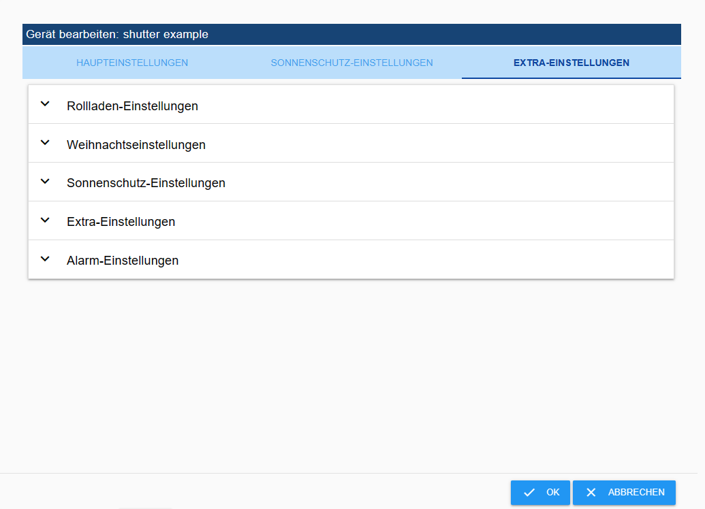

#### Настройки рольставней
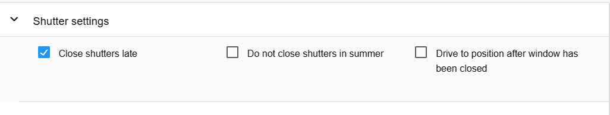

**Закрытие рольставней с задержкой** При выборе этой опции рольставни активируются в заданное время (настраивается в [Особые времена](#special-times)) и одновременно закрываются.

> :exclamation: Защита от блокировки здесь не учитывается, и рольставни опускаются, несмотря на то, что окно открыто! (Опасность оказаться запертым снаружи!!) :exclamation:

**Не закрывайте рольставни летом.** Некоторые рольставни нельзя закрывать летом. В [Летние пейзажи](#summer-settings) будет лето.

**Управление после закрытия окна** Роллетные ворота будут установлены в последнее запрошенное положение после закрытия окна/двери. Привод осуществляется по положению.

> :point_right: Это работает только в том случае, если защита от блокировки не отключена!

#### Рождественские настройки
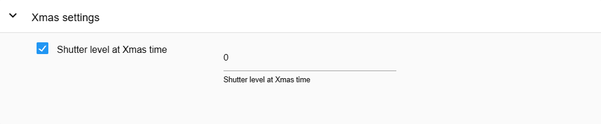

Если рольставни должны быть закрыты лишь частично в рождественское время, например, если необходимо, чтобы арка из свечей или что-то подобное оставалось видимым, можно использовать эту опцию. В этом случае рольставни не будут полностью закрыты в обычное время закрытия, а будут закрыты только до уровня, который можно установить.

**Уровень рольставней в рождественское время** виден и регулируется только в том случае, если установлен флажок **Используется уровень рольставней в рождественское время**.

Период, когда эта функция должна быть активирована, задается в разделе [Рождественские декорации](#christmas-settings).
> :point_right: Если рольставни должны быть полностью закрыты позже вечером, можно использовать эту опцию: > **Закрыть рольставни позже** или **Переместить в промежуточное положение и полностью закрыть позже**.

> :point_right: Эти две опции также можно использовать независимо от рождественских настроек.

#### Настройки защиты от солнца
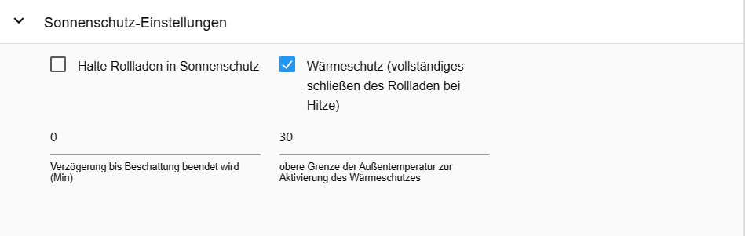

**Оставать рольставни в режиме защиты от солнца** Если эта опция включена, рольставни остаются в режиме защиты от солнца, даже если требование о защите от солнца больше не требуется, и остаются в этом режиме до тех пор, пока вечером не поступит сигнал «закрыть».
Это предотвращает многократное поднятие и опускание рольставней в течение дня.
Очень удобно при работе с жалюзи, когда высота опущена (опция включена), и нужно просто открывать и закрывать ламели.

**Задержка между понижением яркости и окончанием затемнения (минуты)** Здесь устанавливается время, по истечении которого должна произойти задержка, если штора затемнена и яркость падает ниже заданного уровня.
Значение по умолчанию — 0, при необходимости его можно изменить. Эта опция работает только в сочетании с датчиком яркости.

**Тепловая защита** Эта опция позволяет полностью закрыть рольставни в жаркую погоду.
После активации этой опции появляется поле для ввода температуры в °C.

> :point_right: Если рольставни регулируются вручную, и их положение не соответствует автоматическому, автоматическая система останавливается!

> :point_right: Если рольставни вручную перемещаются на заданную высоту для открытия, закрытия или защиты от солнца, автоматический режим сохраняется.

#### Дополнительные настройки
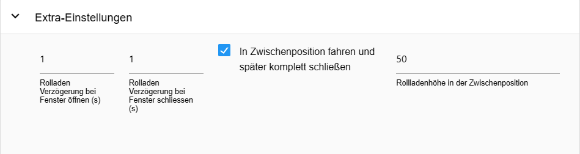

**Задержка срабатывания рольставней при открытии окна(ов)** *Параметр задержки срабатывания рольставней после открытия окна/двери (в секундах)*

**Задержка закрытия рольставней при закрытии окна(ов)** *Параметр задержки закрытия рольставней после закрытия окна/двери (в секундах)*

**Перемещение в промежуточное положение с последующим полным закрытием.** *При активации становится видна **высота рольставни в промежуточном положении**. Затем рольставня перемещается в заданное промежуточное положение при закрытии и впоследствии полностью закрывается.*

#### Настройка будильника
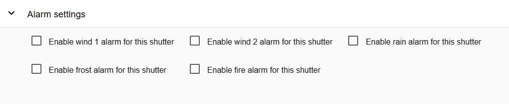

Здесь активируются или деактивируются сигналы тревоги, предварительно заданные для текущей рольставни с помощью [Настройки будильника](#alarm-setting).

_[Вернуться наверх](#documentation-and-instructions-for-shuttercontrol)_

---

## Точки данных
Shuttercontrol создает различные точки данных в следующих папках:

* shuttercontrol.x.control
* shuttercontrol.x.info
* shuttercontrol.x.shutters

> :point_right: x обозначает соответствующий установленный экземпляр

---

### Состояние рольставней
Роллетные ворота могут находиться в следующем состоянии.

* вверх: Рольставни открыты
* вниз: Рольставни закрыты
* sunProtect: Рольставни в режиме защиты от солнца
* нет: статус недоступен
* OpenInSunProtect: Окно или дверь открыты в режиме защиты от солнца
* Manu_Mode: ручной режим (роллетная ставня перемещалась вручную)
* manu_sunProtect: вручную переведен в режим защиты от солнца
* Ветер1: Сигнал тревоги уровня ветра 1
* wind2: Сигнализация 2-го уровня ветра
* Сработало: Окно открыто, и рольставни переведены в открытое положение.
* Мороз: Сигнализация о заморозках
* дождь: Сигнализация дождя
* пожар: Пожарная сигнализация

---

### Shuttercontrol0control
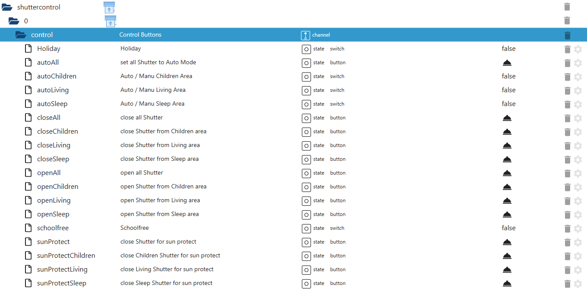

Точки данных для управления различными функциями, такими как: *Праздник *Если ```true```, рольставни перемещаются в установленное время в выходные дни и в

```false``` during weekday hours.*
> :point_right: Can use your own scripts that calculate or display vacation, days off, etc.
set to true to enable weekend settings.

* autoAll
*Button to set **all** shutters to auto mode*

* autoChildren
*If the roller shutters are controlled with **children's area (automatic)**, the automatic function is activated here
switched on with ```true``` and switched off with ```false```.*

* auto living
*If the roller shutters are controlled with **Living area (automatic)**, the automatic mode is used here
switched on with ```true``` and switched off with ```false```.*

* auto sleep
*If the roller shutters are controlled with **sleeping area (automatic)**, the automatic mode is used here
switched on with ```true``` and switched off with ```false```.*

* closeAll
*Button to close **all** roller shutters in **all areas***

* closeChildren
*Button to close **all** roller shutters in the children's area*

* closeLiving
*Button to close **all** roller shutters in the living area*

* closeSleep
*Button to close **all** shutters in the sleeping area*

* openAll
*Button to open **all** roller shutters in **all areas***

* openChildren
*Button to open **all** roller shutters in the children's area*

* openLiving
Button to open **all** roller shutters in the living area

* openSleep
*Button to open **all** shutters in the sleeping area*

* school free
*Button to manually activate the holiday season and have the roller shutters open at the set time on the weekend*

* sunProtect
*Button to move the roller shutters into the sun protection position*

* sunProtectChildren
*Button to move the roller shutters in the children's area to the sun protection position*

* sunProtectLiving
*Button to move the roller shutters in the living area to the sun protection position*

* sunProtectSleep
*Button to move the roller shutters in the sleeping area to the sun protection position*


_[Back to top](#documentation-and-instructions-for-shuttercontrol)_


---


### shuttercontrol0info
Data points for displaying calculated values and checking configured ones
Times:

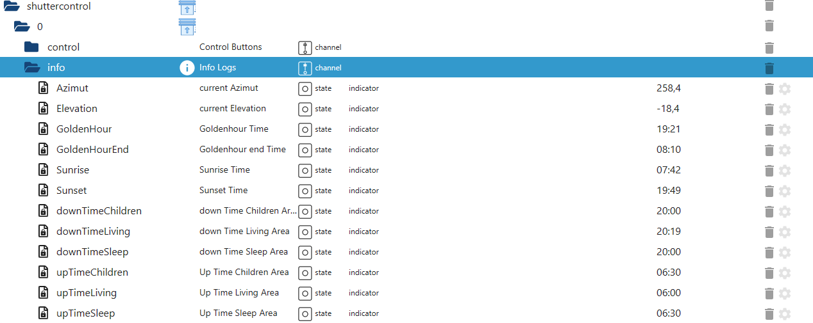


_[Back to top](#documentation-and-instructions-for-shuttercontrol)_


---


### shuttercontrol0shutters
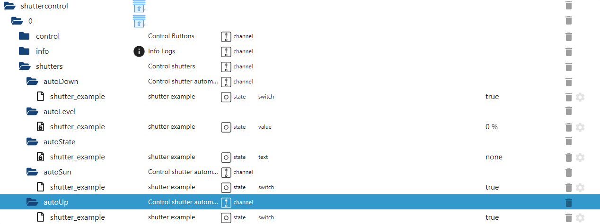

* autoDown
*For each roller shutter, automatic closing can be deactivated here with ```false```

или активировано с помощью ```true```.*

* автоуровень

*Отображает текущее положение каждой рольставни (управлять рольставнями через это окно нельзя).*

* автосостояние

*Отображает текущее состояние (вверх, вниз, режим управления, защита от солнца) для каждой рольставни (управлять рольставнями через этот интерфейс нельзя).*

* автоСолнце

*Функция защиты от солнца может быть отключена для каждой рольставни с помощью ```false``` или активирована с помощью ```true```.*

* автоВверх

*Для каждой рольставни автоматическое открытие можно отключить здесь с помощью ```false``` или включить с помощью ```true```.*

_[Вернуться наверх](#documentation-and-instructions-for-shuttercontrol)_

## Changelog
<!-- ### __WORK IN PROGRESS__ -->
### __WORK IN PROGRESS__
* (simatec) Update dependabot

### 2.1.1 (2026-08-21)
* (simatec) small Bugfix
* (simatec) Update dependabot
* (simatec) Fix Azimut & Elevation

### 2.1.0 (2026-08-18)
* (simatec) Code Cleaning
* (Eistee82) Add the ventilation height to the down automatics with an open window
* (simatec) Update dependabot

### 2.0.12 (2026-02-21)
* (simatec) License updated
* (simatec) Update dependabot

### 2.0.11 (2025-12-21)
* (simatec) Update dependabot

### 2.0.10 (2025-12-21)
* (simatec) Fix JSON Tab

[Older changelogs can be found there](CHANGELOG_OLD.md)

## License
MIT License

Copyright (c) 2019 - 2026 simatec

Permission is hereby granted, free of charge, to any person obtaining a copy
of this software and associated documentation files (the "Software"), to deal
in the Software without restriction, including without limitation the rights
to use, copy, modify, merge, publish, distribute, sublicense, and/or sell
copies of the Software, and to permit persons to whom the Software is
furnished to do so, subject to the following conditions:

The above copyright notice and this permission notice shall be included in all
copies or substantial portions of the Software.

THE SOFTWARE IS PROVIDED "AS IS", WITHOUT WARRANTY OF ANY KIND, EXPRESS OR
IMPLIED, INCLUDING BUT NOT LIMITED TO THE WARRANTIES OF MERCHANTABILITY,
FITNESS FOR A PARTICULAR PURPOSE AND NONINFRINGEMENT. IN NO EVENT SHALL THE
AUTHORS OR COPYRIGHT HOLDERS BE LIABLE FOR ANY CLAIM, DAMAGES OR OTHER
LIABILITY, WHETHER IN AN ACTION OF CONTRACT, TORT OR OTHERWISE, ARISING FROM,
OUT OF OR IN CONNECTION WITH THE SOFTWARE OR THE USE OR OTHER DEALINGS IN THE
SOFTWARE.