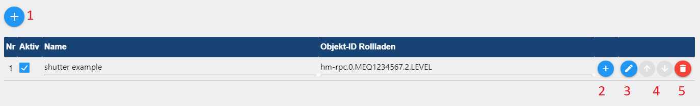

# Документация и инструкции для Shuttercontrol


---

## Поддержка разработки адаптеров
**Если вам понравился адаптер, рассмотрите возможность сделать пожертвование:**

[](https://paypal.me/mk1676)

---

## Основы
>:grey_exclamation: Руководство действительно начиная с стабильной версии 1.6.2 :grey_exclamation:

Shuttercontrol — это адаптер для комплексного управления рольставнями, жалюзи или маркизами, включающий как автоматическое затемнение, так и ночное затемнение.

>:point_right: Для простоты здесь упоминаются только рольставни.

Для управления доступно большое количество настраиваемых параметров, например:

* три разных глобальных таймера, например. гостиная, спальня и детская зона,
* различные параметры, зависящие от положения солнца, которые можно настроить индивидуально для каждой рольставни.

можно настроить индивидуально для каждой рольставни,

* Триггеры для датчиков двери/окна, которые служат защитой от блокировки или автоматического открытия на индивидуальном уровне.

открытие на индивидуальном уровне при открытии двери или окна,

* Различные регулируемые параметры затенения в зависимости, например, от

внутренняя температура, наружная температура, яркость, датчик тепла или аналогичный,

* Включение положения солнца, чтобы затемнить только те комнаты, которые на самом деле затенены.

освещены.

Все точки данных конфигурации уже предварительно заданы с примерами, чтобы адаптер был быстро готов к использованию после установки и ввода идентификаторов готового к работе затвора.

Дальнейшая конфигурация затем используется для адаптации к личным пожеланиям.

> Shuttercontrol может управлять приводами только через положение, например УРОВЕНЬ со значениями от 0 до 100 или 0-255 соответственно. Соответствующая синхронизация жалюзи или жалюзи должна быть принята на себя приводом.
взять на себя исполнительный механизм. Приводами жалюзи, которые предлагают по одному объекту для «высоты» и «угла ламелей», можно управлять с помощью двух жалюзи.
может использоваться с двумя объектами-жалюзи с одинаковой параметризацией.
использоваться.

---

## Монтаж
Адаптер находится в «стабильном» репозитории ioBroker. На вкладке «Адаптер» выбирается «shuttercontrol», и с помощью (+) создается экземпляр адаптера управления затвором.

## Конфигурация
После создания экземпляра автоматически открывается окно конфигурации с вкладками ОСНОВНЫЕ НАСТРОЙКИ, НАСТРОЙКИ ВРЕМЕНИ и ДОПОЛНИТЕЛЬНЫЕ НАСТРОЙКИ.

>:point_right: Вкладки [Настройки времени](#time-settings) и [Дополнительные настройки](#extra-settings) должны быть отредактированы в первую очередь, то есть до того, как ставни будут добавлены с помощью карандаша в ОСНОВНЫХ НАСТРОЙКАХ.

---

### ОСНОВНЫЕ НАСТРОЙКИ
 --- >:point_right: Доступ к документации на github можно получить через знак вопроса в правом верхнем углу (7).

#### Сохранить или загрузить конфигурацию адаптера
Нажмите стрелку вниз (9) в правом верхнем углу, чтобы сохранить конфигурацию адаптера в виде файла .json.
Нажмите стрелку вверх (8), чтобы загрузить существующую конфигурацию адаптера в формате .json.

_[Вернуться наверх](#documentation-and-instructions-for-shuttercontrol)_

---

### НАСТРОЙКИ ВРЕМЕНИ
Здесь выполняются основные настройки времени или астрономического времени, которые позже используются в [Настройки затвора](#shutter-settings) для каждого затвора.
[Настройки затвора](#shutter-settings) для каждой заслонки.

>:heavy_exclamation_mark: Shuttercontrol всегда закрывает ставни **пятницу** в установленное время **выходных**.
и **воскресенье** всегда в установленное время **рабочей недели** :heavy_exclamation_mark:


#### Настройки гостиной, спальной зоны и детской зоны
Отдельные настройки открываются через раскрывающийся список. Описание дано в качестве примера для жилой зоны и аналогично применимо ко всем помещениям.
для всех областей.

>:point_right: Конечно, эту классификацию не обязательно использовать для жилой, спальной или детской зоны.
детская зона, но позволяет определить три зоны в здании с разным временем движения роллет.

**Тип автоматического управления жилой зоной**

Раскрывающееся меню используется для выбора между:

* **Только время жилой зоны:**

*Рольставни управляются только по времени.

* Время гостиной с восходом и закатом солнца.

*Рольставни управляются в зависимости от восхода и захода солнца, но не поднимаются раньше самого раннего времени и не опускаются после самого позднего.

* **Время проживания с «Золотым часом»:**

*Аналогично восходу и закату солнца, но с указанием начала и конца «Золотого часа».

**Закрытие ставен в течение рабочей недели:** *Обычное время затемнения в течение недели*.

**Самое раннее время подъема ставен в течение недели:** *Это самое раннее время подъема ставен в течение недели.

**Последнее время подъема в течение недели:** *Это самое позднее время подъема рольставней в течение недели*.

**Время задержки шахматного подъема жалюзи (секунды):** *Расстояние между отдельными подъемами жалюзи этого диапазона, напр. во избежание радиопомех или для создания впечатления, что их перемещают вручную.

**Закрытие рольставней в выходные дни:** *Обычное время затемнения в выходные дни **и** в праздничные дни.

**Самое раннее время подъема в выходные дни:** *Это самое раннее время подъема ставней в выходные **и** праздничные дни.

**Последнее время подъема в выходные дни:** *В это время рольставни поднимаются в выходные дни **и** самое позднее в праздничные дни*.

>:point_right: Если рольставни никогда не должны подниматься, если солнце еще не превысило определенное положение, это время должно быть установлено на самое позднее время этого положения солнца (21.12.).

_[Вернуться наверх](#documentation-and-instructions-for-shuttercontrol)_

---

### ДОПОЛНИТЕЛЬНЫЕ НАСТРОЙКИ


#### Астронастройки


**Широта и долгота:** *Shuttercontrol берет широту и долготу из настроек системы ioBroker.
Shuttercontrol использует эти значения для расчета положения солнца.

**Выход из функции защиты от солнца с указанием высоты солнца (высоты):** *Как только солнце опускается ниже установленной здесь высоты, затенение прекращается.
затенение Shuttercontrol заканчивается.

>:point_right: Здесь можно принять во внимание возможное преждевременное затенение из-за зданий или высоких деревьев и завершить автоматическое затенение раньше.

**Задержка времени для подъема или опускания (минуты):** *Здесь можно ввести смещение +/-, на которое должны быть задержаны движения жалюзи от типа автоматического управления, выбранного в [Настройки времени](#time-settings).

**Время задержки для шахматного движения жалюзи (секунды):** *Чтобы предотвратить одновременное движение всех жалюзи, здесь можно установить глобальную задержку в секундах.

_[Вернуться наверх](#documentation-and-instructions-for-shuttercontrol)_

---

#### Летние настройки


**Начало лета** и **Конец лета:** *Здесь начало или конец лета можно установить по вашему желанию.

В разделе [Настройки затвора](#shutter-settings) соответствующей ставни установка флажка ``Do not close shutter in summer`` предотвращает закрытие этой ставни летом.

_[Вернуться наверх](#documentation-and-instructions-for-shuttercontrol)_

---

#### Рождественские настройки


**Начало рождественских периодов** и **окончание рождественских периодов:** *Здесь можно установить начало или конец рождественских периодов по вашему желанию.

В настройках [Дополнительные настройки роллет](#extra-settings-roller-shutter) «Рождество» включается желаемая функция и устанавливается желаемое положение жалюзи.

_[Вернуться наверх](#documentation-and-instructions-for-shuttercontrol)_

---

#### Настройки праздников и государственных праздников


**Использование праздничных дней:** *При установке этого флажка и выборе соответствующего экземпляра адаптера выходных ставни будут перемещаться в праздничные дни в установленное время, начиная с выходных.

>:point_right: При необходимости можно создать два экземпляра адаптера государственных праздников: > один для отображения всех возможных государственных праздников и один с праздничными днями, связанными с рабочим временем, к которому затем обращается ShutterControl.

**Идентификатор объекта для установки выходного дня: *Этот идентификатор объекта устанавливает внутреннее состояние «Выходной».
Здесь, например, можно использовать точку данных из адаптера iCal, которая возвращает значение ``true`` в случае праздника и, таким образом, позволяет ставням двигаться в выходные дни.

_[Вернуться наверх](#documentation-and-instructions-for-shuttercontrol)_

---

#### Настройки датчика яркости


Если ставни должны перемещаться автоматически с помощью датчика освещенности, это настраивается здесь.

Затем активация выполняется индивидуально для каждой заслонки в [Основные настройки затвора](#main-shutter-settings).
в разделе **Тип управления закрытием (или открытием) рольставни** выбрав запись «Датчик освещенности».

**Значение освещенности для закрытия с помощью датчика освещенности** *Значение освещенности, начиная с которого жалюзи должны быть закрыты.

**Значение освещенности для открытия с помощью датчика освещенности** *Значение освещенности, начиная с которого жалюзи должны быть открыты*.

**Идентификатор объекта датчика освещенности** *Ссылка на датчик освещенности, например от метеостанции или от уличного датчика движения или отдельного датчика освещенности.

_[Вернуться наверх](#documentation-and-instructions-for-shuttercontrol)_

---

#### Настройки школьных каникул


Здесь период каникул можно активировать либо через отдельную точку данных с **Идентификатором объекта для активации/деактивации школьных каникул**, либо путем установки галочки для установленного экземпляра Schoolfree Adaptor.
Затем жалюзи открываются в период праздников в установленное время для вождения в выходные дни.
Режим отпуска можно активировать индивидуально для каждой зоны.

_[Вернуться наверх](#documentation-and-instructions-for-shuttercontrol)_

---

#### Особые времена


**Закрыть определенные ставни позже** *Эта опция позволяет снова опустить все ставни поздно вечером.
Это охватывает сценарий, когда в обычное время закрытия окно или дверь все еще были открыты.
окно или дверь все еще были открыты в обычное время для закрытия или, например, дверь во внутренний двор снова открывается после закрытия.
Если флажок установлен, отображается настройка **Время, в которое настроенные рольставни должны закрываться поздно**.

> Эту функцию необходимо активировать для каждой ставни в [Настройки затвора](#shutter-settings) с помощью отметки **Закрывать рольставни поздно** для каждой рольставни отдельно или деактивировать, если это нежелательно.

**Полностью закройте все жалюзи в промежуточном положении** *Время, когда все жалюзи полностью закрываются вечером (например, 22:00)*.

**Рольставни открываются только в том случае, если последнее движение произошло x минут назад:** *Рольставни открываются адаптером только по истечении установленного здесь времени.
установленное здесь истекло.

_[Вернуться наверх](#documentation-and-instructions-for-shuttercontrol)_

---

#### Дополнительные настройки


**Проверка текущего статуса затвора:** У некоторых пользователей (в том числе пользователей Shelly) возникает проблема: уровень немного меняется. По этой причине здесь есть флажок.
Если флажок активирован, ShutterControl проверит текущий уровень по истечении времени ожидания проверки состояния жалюзи, Shuttercontrol проверит текущий уровень и временно сохранит его.

**Блокировка ручного режима для известной высоты жалюзи** *Округление текущей высоты жалюзи в большую или меньшую сторону*.
Здесь положение роллет можно округлять с шагом 5 или 10.

**Идентификатор объекта триггера для спальной зоны (Авто):** *Данный триггер активирует автоматический режим спальной зоны.

**Идентификатор объекта триггера жилой зоны (Авто):** *Этот триггер активирует автоматический режим жилой зоны.

**Идентификатор объекта триггера для детской области (Авто):** *Этот триггер активирует автоматический режим детской области.

---

#### Настройки будильника


>:point_right: Для каждого сигнала тревоги для активации требуется логическая точка данных (истина/ложь), > которая активирует **игнал тревоги** = статус** стина** или деактивирует **игнал тревоги** = статус** ЛОЖЬ**.
>:point_right: Кроме того, для каждого сигнала тревоги необходимо определить высоту (0–100%), на которую перемещается рольставня в случае тревоги.
>point_right: В [Настройка будильника](#alarm-setting) соответствующей жалюзи определяется, на какие сигналы тревоги должна реагировать жалюзи.
Затвор должен среагировать.

Приоритеты отдельных сигналов тревоги:

Приоритет 1 (высший приоритет) --> Пожар:

При срабатывании этого сигнала тревоги сконфигурированные для него рольставни в **любом** случае поднимутся на заданную высоту.
>:exclamation: После этого ставни блокируются и **НЕ** закрываются автоматически, даже если пожарная сигнализация сброшена (ложь).

>:point_right:После сброса пожарной сигнализации жалюзи необходимо повторно инициализировать с помощью кнопок «openAll» / «closeAll».
Это предотвращает повторное автоматическое закрытие рольставней по любой причине в случае пожара.
Это также гарантирует, что пути эвакуации остаются открытыми и гарантируется доступ пожарной команды.

Прио 2–5 (тот же приоритет) --> Дождь, Ветер2, Ветер1, Мороз:

Когда эти сигналы тревоги активированы, Shuttercontrol перемещает настроенные рольставни на последний активный уровень тревоги.

Однако при отключении отдельных сигналов тревоги соблюдается следующий приоритет: Приоритет 1 = Пожар Приоритет 2 = Дождь Приоритет 3 = Ветер 2 Приоритет 4 = Ветер 1 Приоритет 5 = Мороз

Сигнализация замерзания имеет прямой эффект только в том случае, если активированные рольставни уже закрыты (опасность замерзания рольставней). Если сигнализация замерзания срабатывает, когда рольставни все еще открыты, рольставни автоматически перемещаются на высоту, установленную для сигнализации замерзания, только при их закрытии.

_[Вернуться наверх](#documentation-and-instructions-for-shuttercontrol)_

---

### Настройки затвора


>:point_right: Пример привода *пример жалюзи* создается автоматически, удалите его через корзину (5).

Теперь добавьте свои собственные приводы жалюзи, нажав на (+) (1). Откроется выбор идентификатора и выберите точку данных LEVEL, которая представляет положение желаемой рольставни.


Структура таблицы:


* **Нет:** *порядковый номер перечисленных ставен*.

* **Активен:** *Флажок для активации/деактивации управления соответствующей рольставней*.

* **Имя:** *Имя привода автоматически считывается из объектов при выборе идентификатора.

и затем может быть изменено по вашему желанию.

* **Идентификатор объекта:** *Уникальный идентификатор точки данных, которой необходимо управлять в объектах*.

* **(+)** *Изменить выбранный привод роллет* * **Карандаш** * *Изменить выбранный привод роллет

* **Карандаш** *Откройте индивидуальную конфигурацию соответствующей роллеты*.

* **Двойной лист:** *Копирование роллет*

* **Стрелки:** *Определите порядок движения рольставней при одинаковых настройках.

* Мусорная корзина:* *Удаляет привод жалюзи со всеми настроенными данными.

После того, как рольставни созданы, нажатием карандаша (3) на соответствующую рольставню с вкладками [ОСНОВНЫЕ НАСТРОЙКИ для роллет](#main-shutter-settings), [НАСТРОЙКИ СОЛНЦА ЗАЩИТЫ](#sun-protection-settings) и [ДОПОЛНИТЕЛЬНЫЕ НАСТРОЙКИ](#extra-settings) далее настраивается каждая створка индивидуально.

---

#### Настройки главного затвора


В верхней области время открытия или закрытия жалюзи выбирается отдельно через выпадающее меню.
> :point_right: Это время уже настроено в [Настройки времени](#time-settings).

Варианты выбора:

* **Выкл.** *Не использовать таймеры.

* **Гостиная зона:** *Затвор перемещается в указанное в *Настройки гостиной* время.

* Жилая зона (автоматически):** **Рольставни перемещаются во время, указанное в* астройки жилой зоны*.

**и** кроме того, затвор активируется в ответ на триггер, определенный в дополнительных настройках.
Идентификатор объекта для активации/деактивации автоматической жилой зоны». Если для этого параметра установлено значение false, рольставни **не** будут перемещаться автоматически.

* Рольставни перемещаются во время, указанное в *Настройки спального места*.

* Рольставни перемещаются во время, указанное в *Настройках спальной зоны*.

**и** кроме того, затвор активируется в ответ на триггер, указанный в дополнительных настройках.
Идентификатор объекта для активации/деактивации зоны автосна».
Если для этого параметра установлено значение false, рольставни **не** будут перемещаться автоматически.

* Детская зона: **Рольставни перемещаются во время, указанное в* астройках детской зоны*.

* Детская зона (автоматически):* *Рольставни перемещаются во время, указанное в *Настройках детской зоны*.

**и** кроме того, затвор активируется в ответ на триггер, определенный в дополнительных настройках.
Идентификатор объекта для активации/деактивации автоматической детской зоны».
Если для этого параметра установлено значение false, затвор **не** будет перемещаться автоматически.

* Закат/восход солнца:** * *Затвор перемещается при закате или восходе солнца.

* Высота солнца: Если высота падает ниже установленного здесь значения, рольставни закрываются.

* Золотой час:** * *Рольставни закрываются в «Золотой час», который, в зависимости от широты и времени года, составляет ок. За 1 час до захода солнца или после восхода солнца.

до захода солнца или после восхода солнца, в зависимости от широты и времени года.

* Датчик освещенности:** * *Рольставни перемещаются только в соответствии с датчиком освещенности, который настроен в разделе [Настройки датчика освещенности](#brightness-sensor-settings).

* Только ручное управление:** * *Рольставни можно перемещать только вручную в выбранном направлении.

:point_right: Перемещение с помощью кнопок под ``shuttercontrol.0.control`` невозможно.
point_right: Это может быть полезно, например, для навесов, которые не следует открывать вместе с другими рольставнями.
которые не следует открывать вместе с другими ставнями.

**Значение датчика окна/двери в закрытом состоянии:** *Здесь определяется значение, которое может иметь триггер под **Идентификатор объекта контакта окна/двери** (например, оконный или дверной контакт).
(например, контакт окна или поворотной ручки), при котором автоматическая система рольставней может двигаться неограниченно долго.
:point_right: Можно выбрать такие значения, как true, false, 0, 1 или 2.

> point_right: Если рольставни не находятся в крайнем верхнем положении и указанное здесь состояние датчика изменяется, рольставни перемещаются в крайнее верхнее положение.
состояние датчика изменяется, рольставни перемещаются на **высоту роллет при открытии окна или двери**.

**Значение датчика окна/двери в наклоненном состоянии:** *Это устанавливает значение, на которое установлен триггер в разделе **Идентификатор объекта контакта окна/двери** (например, оконный или дверной контакт).
(например, контакт окна или поворотной ручки), при котором автоматическая система рольставней может двигаться неограниченно долго.
:point_right: Можно выбрать такие значения, как true, false, 0, 1 или 2.

> point_right: Если рольставни не находятся в крайнем верхнем положении и указанное здесь состояние датчика изменяется, рольставни перемещаются в крайнее верхнее положение.
состояние датчика изменяется, рольставни перемещаются на **высоту роллет при открытии окна или двери**.

> :exclamation: Если нет оконного контакта с функцией наклона, это значение должно быть установлено на «нет».

**Перемещайте рольставни при изменении состояния окна/двери:** *Потяните вниз, чтобы выбрать функцию, которая будет выполняться при перемещении датчика окна/двери:*

**Выкл.**: нет движения.

* **Открыто**: при открытии окна/двери ставня поднимается вверх и остается там, при закрытии ставня не двигается.
* **Закрыть**: После закрытия окна/двери рольставни перемещаются в положение затемнения, при открытии рольставни не двигаются.

**Открытие и закрытие:** Рольставни поднимаются вверх, когда окно/дверь открывается, и снова опускаются, когда окно закрывается.

**Высота жалюзи при открытии окна или двери:** *Желаемое положение жалюзи от 0 до 100, напр. для окон 25% на вентиляцию или 100% на проходимость дверей.
чтобы двери могли пройти.

**Высота жалюзи при наклоне окна или двери:** *Желаемое положение жалюзи от 0 до 100, напр. для окон 25% на вентиляцию.

**Используйте автоматические рольставни, даже когда окно/дверь открыты (защита от блокировки)** **Если в момент автоматического закрытия датчик окна/двери __не соответствует введенному значению (окно/дверь закрыто) ), в соответствии с выбранной настройкой будут выполнены следующие действия:**

* **Выкл.**: защита от блокировки активна в обоих направлениях, ставни не двигаются, когда окно открыто.
* **Открыть**: разрешено только повышение. По окончании затемнения/затенения рольставни поднимаются вверх, даже если окно открыто. Рольставни не закрываются автоматически при открытом окне.
* **Закрыть**: разрешено только закрытие. В начале затемнения/затенения роллеты опускаются, несмотря на открытое окно. Рольставни не открываются при открытом окне.
* **Открытие и закрытие**: Рольставни могут двигаться в обоих направлениях, когда окно открыто.

**Высота рольставни при движении вниз:** *Значение положения, когда рольставня закрыта.

**Высота жалюзи в поднятом состоянии:** *Значение положения при открытых жалюзи*.

> :point_right: Высоту рольставни необходимо ввести в соответствии с используемыми приводами (0-100 или 0-255): > 0 = закрыто и 100 = открыто или 0 = открыто и 100 = закрыто.

**Идентификатор объекта контакта окна/двери:** Используйте (+), чтобы выбрать датчик (состояние), который должен предотвратить движение рольставней (например, дверной контакт).

_[Вернуться наверх](#documentation-and-instructions-for-shuttercontrol)_

---

#### Настройки защиты от солнца


**Тип управления защитой от солнца:** Защитой от солнца можно управлять с помощью различных триггеров для затенения и его завершения. В раскрывающемся списке можно выбрать следующие комбинации:

* Снаружи
* Внутренний и наружный датчик температуры/освещенности
* Направление компаса (положение солнца)
* Внутренний/наружный датчик температуры/света и кардинальное направление
* Датчик наружной температуры/освещенности и направление
* Датчик наружной температуры/освещенности
* Температура в помещении

> :point_right: Защита от солнца срабатывает только тогда, когда ВСЕ триггеры выбранной комбинации выбраны активными (логическое соединение И) и прекращается, когда ОДИН из триггеров становится неактивным.

> :point_right: Идентификатор объекта также должен быть сохранен для ВСЕХ выбранных триггеров.

> :point_right: Датчик освещенности всегда является дополнительным и может оставаться пустым. Если датчик освещенности настроен, он связан с остальными параметрами И.

**Высота жалюзи при движении вниз:** *Значение того, насколько далеко жалюзи должны быть закрыты при затемнении.*

**Направление (положение солнца):** *Выравнивание окошка компаса (0° = север; 180° = юг)*

**+/- Диапазон положения солнца для активной защиты от солнца:** *Область, в которой солнце (вокруг центральной точки) будет мешать окну. За пределами этой области нет тени.*

**Заданное значение наружной температуры:** *Затенение начинается с этого значения (или выше).*

**Гистерез наружной температуры (в процентах):** *Здесь вы можете установить гистерезис в процентах, чтобы рольставни при колебаниях не поднимались и опускались постоянно.* Гистерезис — это разница между верхним значением температуры, при котором должно быть затенение. начало и нижнее значение температуры, при котором затенение снова прекращается.

**Идентификатор объекта наружной температуры:** Датчик, выбранный здесь с помощью (+), не обязательно должен измерять наружную температуру. Он может указать любое значение, которое можно использовать для запуска затенения.
Это также может быть термодатчик (датчик разницы температур).
Если в качестве триггера не выбран наружный датчик, оставьте это поле пустым.

**Уставка датчика освещенности для защиты от солнца:** *Пороговое значение для начала затенения.* Это значение зависит от датчика, выбранного в поле **Идентификатор объекта для датчика освещенности для защиты от солнца**.

**Гистерезис датчика освещенности (в процентах):** Здесь вы можете установить нисходящий гистерезис в процентах, чтобы рольставни не двигались постоянно вверх и вниз при колебаниях, вызванных сменой облаков.
Гистерезис — это разница между заданным значением, при котором должно начинаться затенение, и нижним значением яркости, при котором затенение должно снова начинаться.

> :point_right: Пример: Уставка датчика освещенности для защиты от солнца установлена на 30 000, гистерезис на 40 %: Защита от солнца активна с 30 000 и остается активной до тех пор, пока значение не упадет ниже 18 000.

**Идентификатор объекта датчика солнечной освещенности:** *Аналог датчика наружной температуры* Если не выбран в качестве триггера, оставьте пустым

**Заданное значение температуры в помещении:** Здесь можно ввести температуру внутреннего датчика температуры, назначенного на рольставни, при которой не должно быть затенения, например, чтобы уменьшить нагрев и использовать излучение зимой для поддержания обогрев.

**Внутренняя температура гистерезиса (в процентах):** *Здесь вы можете установить гистерезис в процентах, чтобы рольставни при колебаниях внутренней температуры не повышались и не понижались постоянно.* Гистерезис – это разница между верхним значением температуры, при котором должно начинаться затенение и наименьшее значение температуры, при котором затенение снова прекращается.

**Идентификатор объекта датчика внутренней температуры:** Используйте (+), чтобы выбрать датчик температуры.
Если в качестве триггера не выбран внутренний датчик, оставьте это поле пустым.

_[Вернуться наверх](#documentation-and-instructions-for-shuttercontrol)_

---

#### Дополнительные настройки рольставней


#### Настройки рольставней


**Закрывать рольставни поздно** При использовании этой опции рольставни активируются в определенное время (настраиваемое в [Особое время](#special-times)) и также выключаются.
> :exclamation: Здесь не учтена блокировка и рольставни опускаются, несмотря на открытое окно! (Опасность блокировки!!) :exclamation:

**Не закрывайте рольставни летом** Некоторые рольставни летом не следует закрывать. Период [Летние настройки](#summer-settings) будет летом.

**Вождение после закрытия окна** После закрытия окна/двери рольставни будут установлены на последнюю запрошенную настройку.

> :point_right: Это работает только в том случае, если для защиты от блокировки не установлено значение «Выкл.»!

#### Рождественские настройки


Если на Рождество рольставни должны быть закрыты только частично, т. к. если свечная арка или что-то подобное должно оставаться видимой, можно использовать этот вариант. В этом случае рольставни не будут полностью закрыты в обычное время закрытия, а будут закрыты только до уровня, который можно установить.
> :point_right: **Уровень роллет во время Рождества** виден и регулируется только в том случае, если установлен флажок **Уровень роллет во время Рождества** используется**.

Период, когда эта функция должна быть активирована, устанавливается в разделе [Рождественские настройки](#christmas-settings).
> :point_right: Если поздно вечером рольставни должны быть полностью закрыты, можно использовать эту опцию > **Закрыть рольставни поздно** или **Перевести в промежуточное положение и полностью закрыть позже** >.
> :point_right: Эти два параметра также можно использовать независимо от рождественских настроек.

#### Настройки защиты от солнца


**Держать рольставни в защите от солнца** Если эта опция включена, рольставни остаются под защитой от солнца, даже если больше нет требований к защите от солнца, и остаются под защитой от солнца до тех пор, пока не будет «закрыто» сигнал приходит вечером.
Это предотвращает подъем и опускание роллет несколько раз в день.
Очень практично при работе жалюзи, когда высота удерживается на низком уровне (опция проверена) и можно просто открывать и закрывать ламели.

**Теплозащита** Эта опция позволяет полностью закрыть рольставни в жаркую погоду.
После активации этой опции появится поле для ввода температуры в °C.

> :point_right: Если рольставни регулируются вручную и положение автоматически не соответствует этому, автоматика останавливается!

> :point_right: Если рольставни вручную перемещаются на заданную высоту для открытия, закрытия или защиты от солнца, автоматическая функция сохраняется.

#### Дополнительные настройки


**Задержка роллеты при открытии окна(ов)** *Параметр задержки открытия роллеты после открытия окна/двери (в секундах)*

**Задержка роллеты при закрытии окна(ов)** *Параметр задержки закрытия роллеты после закрытия окна/двери (в секундах)*

**Переместитесь в промежуточное положение, а затем полностью закройте** *При активации становится видна **высота рольставни в промежуточном положении**. Затем при закрытии рольставни перемещаются в установленное промежуточное положение, а затем полностью закрываются*

#### Настройка будильника


Здесь активируются или деактивируются сигналы тревоги, предварительно определенные для текущей рольставни через [Настройки сигналов тревоги](#alarm-setting).

_[Вернуться наверх](#documentation-and-instructions-for-shuttercontrol)_

---

## Точки данных
Shuttercontrol создает различные точки данных в следующих папках:

* Shuttercontrol.x.control
* Shuttercontrol.x.info
* Shuttercontrol.x.shutters

> :point_right: x обозначает соответствующий установленный экземпляр

---

### ShutterControl0Control


Точки данных для управления различными функциями, такими как: *Отпуск *Если ```true```, рольставни перемещаются в установленное время по выходным и в

```false``` during weekday hours.*
> :point_right: Can use your own scripts that calculate or display vacation, days off, etc.
set to true to enable weekend settings.

* autoAll
*Button to set **all** shutters to auto mode*

* autoChildren
*If the roller shutters are controlled with **children's area (automatic)**, the automatic function is activated here
switched on with ```true``` and switched off with ```false```.*

* auto living
*If the roller shutters are controlled with **Living area (automatic)**, the automatic mode is used here
switched on with ```true``` and switched off with ```false```.*

* auto sleep
*If the roller shutters are controlled with **sleeping area (automatic)**, the automatic mode is used here
switched on with ```true``` and switched off with ```false```.*

* closeAll
*Button to close **all** roller shutters in **all areas***

* closeChildren
*Button to close **all** roller shutters in the children's area*

* closeLiving
*Button to close **all** roller shutters in the living area*

* closeSleep
*Button to close **all** shutters in the sleeping area*

* openAll
*Button to open **all** roller shutters in **all areas***

* openChildren
*Button to open **all** roller shutters in the children's area*

* openLiving
Button to open **all** roller shutters in the living area

* openSleep
*Button to open **all** shutters in the sleeping area*

* school free
*Button to manually activate the holiday season and have the roller shutters open at the set time on the weekend*

* sunProtect
*Button to move the roller shutters into the sun protection position*

* sunProtectChildren
*Button to move the roller shutters in the children's area to the sun protection position*

* sunProtectLiving
*Button to move the roller shutters in the living area to the sun protection position*

* sunProtectSleep
*Button to move the roller shutters in the sleeping area to the sun protection position*


_[Back to top](#documentation-and-instructions-for-shuttercontrol)_


---


### shuttercontrol0info
Data points for displaying calculated values and checking configured ones
Times:


_[Back to top](#documentation-and-instructions-for-shuttercontrol)_


---


### shuttercontrol0shutters


* autoDown
*For each roller shutter, automatic closing can be deactivated here with ```false```

или активирован с помощью ```true```.*

* автоуровень

*Показывает текущее положение каждой рольставни (посредством этого рольставнями невозможно управлять).*

* автостатус

*Показывает текущее состояние (вверх, вниз, Manu_Mode, sunProtect) для каждой рольставни (посредством этого рольставнями невозможно управлять).*

* автоСан

*Функция защиты от солнца может быть отключена для каждой рольставни с помощью ```false``` или активирована с помощью ```true```.*

* автовверх

*Для каждой рольставни автоматическое открытие можно деактивировать здесь с помощью ```false``` или активировать с помощью ```true```.*

_[Вернуться наверх](#documentation-and-instructions-for-shuttercontrol)_

## Changelog
<!-- ### __WORK IN PROGRESS__ -->
### __WORK IN PROGRESS__
* (simatec) Dependencies updated
* (simatec) Docu updated

### 1.7.0 (2024-02-05)
* (simatec) Dependencies updated
* (simatec) @iobroker/adapter-dev added
* (simatec) Design optimizations
* (simatec) Gulp deleted
* (simatec) Docu updated
* (simatec) many small fixes

### 1.6.3 (2023-11-01)
* (simatec) Saturday added as work week
* (simatec) Dependencies updated
* (simatec) Fix Auto-Living, Auto-Sleep & Auto-Children
* (simatec) Timeout Fix
* (FredF63) Update German Docu
* (simatec) Wiki added

### 1.6.2 (2023-08-28)
* (simatec) Dependencies updated
* (simatec) node 20 tests added
* (simatec) Fix ending Sunprotect with open door/window
* (5G7K) Fix timing & some states for sunprotect

### 1.6.1 (2023-07-17)
* (simatec) Fix Heat protection

### 1.6.0 (2023-07-16)
* (simatec) Manu mode block added
* (simatec) Heat protection added
* (simatec) Added rounding of incoming shutter states
* (simatec) Ukrainian language added
* (simatec) small Bugfixes
* (simatec) Dependencies updated

### 1.5.0 (2023-06-05)
* (simatec) new Manu-Mode Check added
* (simatec) suncalc added
* (simatec) Dependencies updated

### 1.4.29 (2023-04-26)
* (simatec) Bugfix Brightness down

### 1.4.28 (2023-04-17)
* (simatec) small Fixes

### 1.4.27 (2023-04-17)
* (simatec) small Fixes

### 1.4.26 (2023-04-14)
* (simatec) Fix Sunprotect

### 1.4.25 (2023-04-13)
* (simatec) small Fixes

### 1.4.24 (2023-04-10)
* (simatec) Fix end of Sunprotect
* (simatec) small Fixes
* (simatec) Fix shutter alarm
* (simatec) Sentry fixes
* (simatec) Bugfix Brightness down
* (simatec) Dependencies updated
* (j4nv) Fix Astro Time

### 1.4.23 (2023-03-28)
* (simatec) Bugfix Brightness-Sensor
* (simatec) Dependencies updated
* (simatec) small fixes

### 1.4.22 (2023-03-18)
* (simatec) Bugfix Brightness-Sensor
* (simatec) Dependencies updated
* (simatec) Fix Alarm Settings

### 1.4.21 (2023-02-02)
* (simatec) fix Brightness Settings
* (simatec) Dependencies updated

### 1.4.20 (2023-01-30)
* (simatec) Bugfix Brightness-Sensor

### 1.4.19 (2023-01-22)
* (simatec) Time config for Brightness-Sensor added
* (simatec) small Bugfixes
* (simatec) Dependencies updated

### 1.4.18 (2022-09-24)
* (simatec) Bugfixes Button Action

### 1.4.17 (2022-09-24)
* (simatec) small Bugfixes

### 1.4.16 (2022-09-19)
* (simatec) small Bugfixes
* (simatec) Dependencies updated
* (simatec) Dev-Dependencies updated
* (simatec) Docu updated
* (simatec) travis deleted
* (simatec) update translation
* (simatec) debug for shutterstate added

### 1.4.14 (2022-06-02)
* (simatec) delay for Lightsensor added
* (simatec) Dependencies updated
* (simatec) Dev-Dependencies updated

### 1.4.13 (2022-05-24)
* (FoxRo) Bugfix Alarm handling
* (simatec) Dependencies updated
* (simatec) Dev-Dependencies updated
* (simatec) more debuglog for Trigger

### 1.4.12 (2022-04-11)
* (FoxRo) Bugfix wrongly open after deactivation of weater alarm
* (simatec) Dependencies updated
* (simatec) Dev-Dependencies updated

### 1.4.11 (2022-02-07)
* (simatec) fix objects value
* (simatec) Dependencies updated
* (simatec) Dev-Dependencies updated

### 1.4.10 (2022-01-16)
* (simatec) Bugfix xmas time
* (simatec) Bugfix Shutter delay
* (simatec) Dependencies updated
* (simatec) Dev-Dependencies updated

### 1.4.9 (2021-12-29)
* (simatec) error handling for trigger added
* (simatec) Bugfix Trigger delay
* (simatec) Dependencies updated
* (simatec) Dev-Dependencies updated

### 1.4.8 (2021-12-25)
* (simatec) error handling for trigger added
* (simatec) Bugfix Trigger delay

### 1.4.7 (2021-12-21)
* (simatec) complete error handling for states added
* (simatec) Bugfix Down Late Option
* (simatec) small Bugfixes
* (simatec) Dependencies updated
* (simatec) Dev-Dependencies updated

### 1.4.6 (2021-12-15)
* (simatec) Bugfixes shuttersettings
* (simatec) Bugfix shutter created

### 1.4.5 (2021-12-14)
* (simatec) small Bugfixes
* (simatec) Code cleaning
* (simatec) try & catch added
* (simatec) source code was converted to async
* (simatec) Dependencies updated
* (simatec) Dev-Dependencies updated

### 1.4.4 (2021-12-08)
* (simatec) Bugfix Trigger after shutter close
* (simatec) Bugfix XMas Level by frost
* (simatec) XMas Level for Elevation added
* (simatec) Summertime for Elevation added
* (simatec) small Bugfixes
* (simatec) shutter Config check added

### 1.4.3 (2021-12-05)
* (simatec) Bugfix Trigger after shutter close
* (simatec) Bugfix XMas Level by frost
* (simatec) XMas Level for GoldenHour added
* (simatec) Summertime for Goldenhour added
* (simatec) small Bugfixes

### 1.4.2 (2021-12-02)
* (simatec) Bugfix Alarm settings
* (simatec) Bugfix move shutter after closing window
* (simatec) better translation for all languages
* (simatec) small Bugfixes

### 1.4.1 (2021-12-01)
* (simatec) Code cleaning
* (simatec) Bugfix Alarm States
* (simatec) try & catch added

### 1.4.0 (2021-11-30)
* (simatec) Source code completely redesigned
* (simatec) Much of the source code was converted to async
* (simatec) many small Bugfixes
* (simatec) Dependencies updated
* (simatec) Dev-Dependencies updated

### 1.3.9 (2021-11-25)
* (simatec) Bugfix between Level
* (simatec) many small Bugfixes
* (simatec) docu updated
* (simatec) Dependencies updated
* (simatec) Dev-Dependencies updated

### 1.3.8 (2021-11-20)
* (simatec) Bugfix XMas-Level
* (simatec) Bugfix Down Complete

### 1.3.7 (2021-11-19)
* (simatec) brightness down State added
* (simatec) BrightnessSensor fix

### 1.3.6 (2021-11-17)
* (simatec) small Bugfixes

### 1.3.5 (2021-11-16)
* (simatec) Bugfix BrightnessSensor
* (simatec) Fix Delay with value 0
* (simatec) DEPENDENCIES updated
* (simatec) Dev-DEPENDENCIES updated

### 1.3.3 (2021-11-07)
* (simatec) Bugfix trigger Tilted

### 1.3.2 (2021-11-05)
* (simatec) Bugfix BrightnessSensor
* (simatec) lastAutoAction in array added
* (simatec) Bugfix Log for alarm

### 1.3.1 (2021-11-04)
* (simatec) Bugfix BrightnessSensor
* (simatec) Object-ID for school holidays added

### 1.3.0 (2021-11-03)
* (FoxRo) alarm function added
* (simatec) Trigger Tilted Window / Door added
* (FoxRo) new Feature Sunprotect end Delay added
* (FoxRo) Bugfix in window trigger
* (FoxRo/simatec) new Features in Docu added
* (simatec) many small BugFix
* (simatec) DEPENDENCIES updated
* (simatec) Dev-DEPENDENCIES updated

### 1.2.1 (2021-06-22)
* (simatec) auto-mode button added
* (simatec) many small BugFix
* (simatec) DEPENDENCIES updated
* (simatec) Dev-DEPENDENCIES updated

### 1.2.0 (2021-05-04)
* (simatec) new Feature shutterSettings added
* (simatec) new Feature brightness sensor for opening added
* (simatec) new Feature brightness sensor for closing added
* (simatec) new Feature schoolfree adapter added
* (simatec) new Feature middle position added
* (simatec) new Feature Xmas position added
* (simatec) Bugfix
* (simatec) DEPENDENCIES updated
* (simatec) Dev-DEPENDENCIES updated
* (simatec) timeout settings for shutterstatus added

### 1.1.5 (2021-01-22)
* (simatec) BugFix io-package
* (simatec) Source code structure changed
* (FoxRo) new Feature "trigger delay"
* (FoxRo) Bugfix for trigger

### 1.1.4 (2021-01-22)
* (simatec) BugFix Log
* (simatec) DEPENDENCIES updated
* (simatec) Dev-DEPENDENCIES updated

### 1.1.3 (2021-01-21)
* (simatec) small fix for objects

### 1.1.2 (2021-01-18)
* (simatec) small fix for holiday state

### 1.1.1 (2021-01-04)
* (René) bug fix xmas time
* (simatec) copy function for shutter-table added

### 1.1.0 (2020-12-08)
* (simatec) GUI redesign
* (simatec) Intermediate position added for closing

### 1.0.5 (2020-12-05)
* (Rene) fix xMas Time

### 1.0.4 (2020-10-28)
* (simatec) fix summertime for childrenarea

### 1.0.3 (2020-10-28)
* (René) bug fix: calculation IsSummerTime
* (René) bug fix: use weekend down time already on friday instead of sunday
* (René) handling of shutters in xmas time added
* (FredF63) documentation updated
* (FredF63) words.js updated
* (simatec) some Bugfixes

### 1.0.2 (2020-10-08)
* (simatec) fix uptime for childrenarea

### 1.0.1 (2020-10-06)
* (simatec) Adjustment of the configuration menu
* (simatec) time settings for the children's area added
* (simatec) button for closing the children's area added
* (simatec) button for opening the children's area added
* (simatec) button for sun protection of the children's area added

### 1.0.0 (2020-09-28)
* (simatec) some Bugfixes
* (simatec) code cleaning
* (simatec) DEPENDENCIES updated
* (simatec) Dev-DEPENDENCIES updated
* (FoxRo) Added buttons for Sunprotect Living and Sunprotect Sleep
* (FoxRo) Included Living-Auto and Sleep-Auto in Buttons for Open/Close Sleep and Living
* (FoxRo) KeepSunprotect added
* (FoxRo) Drive after close added
* (FoxRo) Extend status handling

### 0.8.7 (2020-09-22)
* (simatec) small Bugfix for weekend

### 0.8.6 (2020-08-21)
* (simatec) small Bugfixes trigger

### 0.8.5 (2020-08-03)
* (simatec) small Bugfixes
* (5G7K) bugfixes trigger
* (FredF63) new german doku

### 0.8.4 (2020-07-17)
* (simatec) small Bugfixes
* (5G7K) debug log changed
* (simatec) Dependencies updated
* (MeisterTR) Time left to detect second sleep

### 0.8.3 (2020-07-07)
* (simatec) Bugfix IsSummerTime
* (simatec) Bugfix shutter convert

### 0.8.2 (2020-07-06)
* (simatec) small Bugfixs
* (simatec) Buttons for sunprotect operation added

### 0.8.1 (2020-07-03)
* (simatec) Bugfix shutterstates
* (simatec) support for KNX

### 0.8.0 (2020-07-02)
* (simatec) added state for current shutter Action
* (simatec) added state for current shutter Level
* (simatec) added Indicator for manual operation in the states
* (simatec) code cleanup
* (simatec) complete new structure of the code
* (simatec) Buttons for manual opening and closing operation added
* (simatec) Display in the States if the shutter was moved manually
* (5G7K) Bug fix sunprotect

### 0.7.3 (2020-06-29)
* (simatec) errorhandling for sentry.io
* (simatec) bugfixes
* (simatec) cancel all schedule by unload
* (rg-engineering) bug fix and documentation

### 0.7.2 (2020-06-26)
* (simatec) Bugfix sunprotect for outsidetemp
* (simatec) better translation for all languages
* (simatec) better overview in the user interface

### 0.7.1 (2020-06-24)
* (simatec) small bugfixes
* (simatec) errorhandling for sentry.io

### 0.7.0 (2020-06-23)
* (rg-engineering) better (userfriendly) check for adjustable times
* (rg-engineering) datapoint for Holiday incl. internal check and handling
* (rg-engineering) late all down added 
* (5G7K) Extended sun protection
* (simatec) edited User Menu for Timesettings
* (simatec) Bugfix Lightvalue to 20.000 Lux
* (simatec) added better German Translation

### 0.6.2 (18.05.2020)
* (simatec) errorhandling for sentry.io
* (simatec) Bugfix getState

### 0.6.1 (11.05.2020)
* (simatec) bugfix index_m.html

### 0.6.0 (10.05.2020)
* (simatec) added sentry.io
* (simatec) added node 14 Support
* (simatec) many small Bugfixes
* (simatec) node 8 support removed
* (5G7K) added new feature for sunprotect
* (5G7K) added more debug logs

### 0.5.1 (15.04.2020)
* (simatec) Bugfix for Adapter checker
* (simatec) Added more debug logs
* (simatec) Added node Support
* (simatec) node 8 support removed
* (Rene) late all down added
* (Rene) late all down configurable per shutter
* (Rene) in summer time not to move down (configurable)

### 0.5.0 (06.04.2020)
* (simatec) Bugfix Goldenhour
* (simatec) Bugfix delay for sunprotect
* (simatec) Bugfix Goldhour with living area
* (simatec) Added auto fill for Position
* (simatec) many small Bugfixes
* (simatec) Bugfix Translations
* (simatec) Bugfix compactmode
* (5G7K) Added debug log with more Informations

### 0.4.3 (29.12.2019)
* (simatec) Bugfix update process

### 0.4.2 (22.12.2019)
* (simatec) Fix Trigger added objects

### 0.4.1 (20.10.2019)
* (simatec) Fix update process
* (simatec) Fix appveyor

### 0.4.0 (28.08.2019)
* (simatec) Fix shutdown for Elevation
* (simatec) Fix triggerHeight
* (simatec) Fix Travis

### 0.3.2 (09.07.2019)
* (simatec) Added state check for all shutter
* (simatec) Bugfix sunprotect
* (simatec) Bugfix trigger
* (simatec) Bugfix time settings
* (Homoran) Added German Docu

### 0.3.1 (02.07.2019)
* (simatec) Fix sunprotect for shelly user

### 0.3.0 (01.07.2019)
* (simatec) Fix shutter up for Sunprotect
* (simatec) Fix input for elevation
* (simatec) Fix input for Inside temperature
* (simatec) Fix input for Outside temperature
* (simatec) Fix input for Lightsensor
* (simatec) Added Object to shutter
* (simatec) Added hysteresis for Lightsensor
* (simatec) Added hysteresis for Inside temperature
* (simatec) Added hysteresis for Outside temperature
* (simatec) Added State check after running
* (simatec) Fix autodrive
* (simatec) Added check shutter up for sunprotect
* (simatec) Added Translations
* (simatec) sunprotect changed to switch
* (Homoran/simatec) Added German Docu
* (simatec) Added English Docu

### 0.2.13 (21.06.2019)
* (simatec) small Bugfix

### 0.2.12 (21.06.2019)
* (simatec) Changed Time-Settings
* (simatec) Bugfix Trigger for up and down
* (simatec) Bugfix sunprotect with azimut
* (simatec) Added sunprotect not running on state down
* (simatec) Added debug log for any shutter states

### 0.2.11 (20.06.2019)
* (simatec) Fix debug log
* (simatec) temporary storage of the state
* (simatec) automatic stop of sun protection with manual state change

### 0.2.10 (18.06.2019)
* (simatec) edit extra menu
* (simatec) clean code
* (simatec) save current states on start

### 0.2.9 (17.06.2019)
* (simatec) Bugfix PopUp
* (simatec) Fix TriggerID

### 0.2.8 (17.06.2019)
* (simatec) Menu completely revised
* (simatec) Ease of use improved
* (simatec) Example added
* (simatec) Default settings added for each roller shutter
* (simatec) fixed some bugs

### 0.2.7 (14.06.2019)
* (simatec) Beta 0.2.7

### 0.2.6 (14.06.2019)
* (simatec) Beta 0.2.6

### 0.2.5 (11.06.2019)
* (simatec) Beta 0.2.5

### 0.2.4 (11.06.2019)
* (simatec) Beta 0.2.4

### 0.2.3 (10.06.2019)
* (simatec) Fix Elevation
* (simatec) Fix direction
* (simatec) Add all translate
* (simatec) Add new popup for shutter config
* (simatec) clean table

### 0.2.2 (01.06.2019)
* (simatec) Beta 0.2.2

### 0.2.1 (01.06.2019)
* (simatec) Shutters drive when the trigger is changed
* (simatec) Add Trigger ID for Auto-Living
* (simatec) Add Trigger ID for Auto-Sleep
* (simatec) add shutter height for trigger
* (simatec) Add boolean for drive on change Trigger

### 0.2.0 (31.05.2019)
* (simatec) complete restructuring of functions

### 0.1.0 (11.05.2019)
* (simatec) First Beta

### 0.0.1 (02.04.2019)
* (simatec) initial release


*************************************************************************************************************************************

## License
MIT License

Copyright (c) 2019 - 2024 simatec

Permission is hereby granted, free of charge, to any person obtaining a copy
of this software and associated documentation files (the "Software"), to deal
in the Software without restriction, including without limitation the rights
to use, copy, modify, merge, publish, distribute, sublicense, and/or sell
copies of the Software, and to permit persons to whom the Software is
furnished to do so, subject to the following conditions:

The above copyright notice and this permission notice shall be included in all
copies or substantial portions of the Software.

THE SOFTWARE IS PROVIDED "AS IS", WITHOUT WARRANTY OF ANY KIND, EXPRESS OR
IMPLIED, INCLUDING BUT NOT LIMITED TO THE WARRANTIES OF MERCHANTABILITY,
FITNESS FOR A PARTICULAR PURPOSE AND NONINFRINGEMENT. IN NO EVENT SHALL THE
AUTHORS OR COPYRIGHT HOLDERS BE LIABLE FOR ANY CLAIM, DAMAGES OR OTHER
LIABILITY, WHETHER IN AN ACTION OF CONTRACT, TORT OR OTHERWISE, ARISING FROM,
OUT OF OR IN CONNECTION WITH THE SOFTWARE OR THE USE OR OTHER DEALINGS IN THE
SOFTWARE.