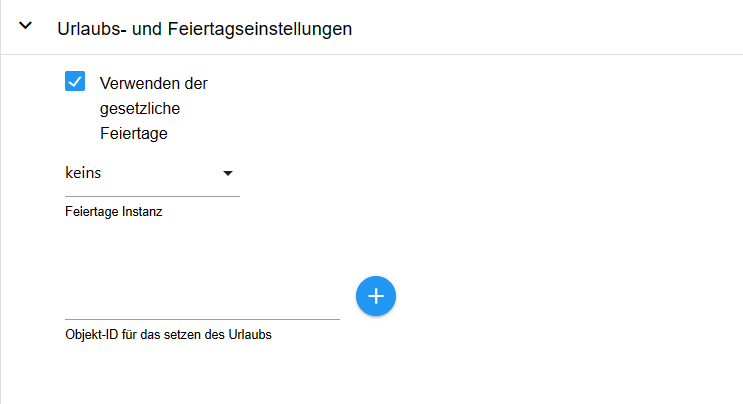
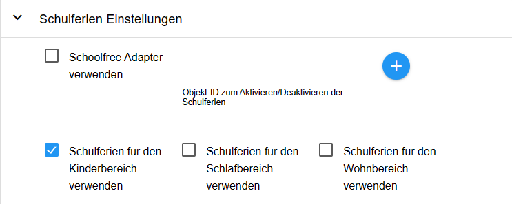
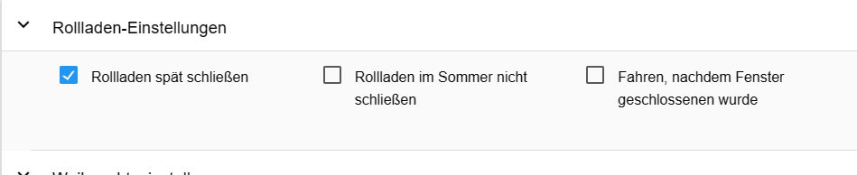
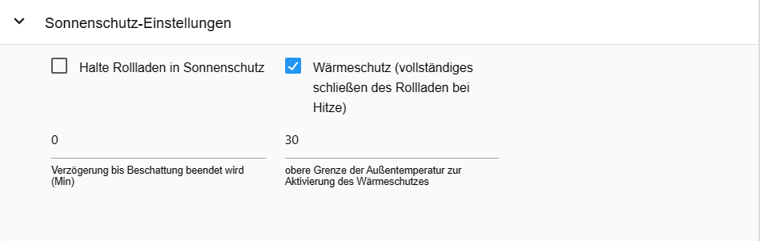
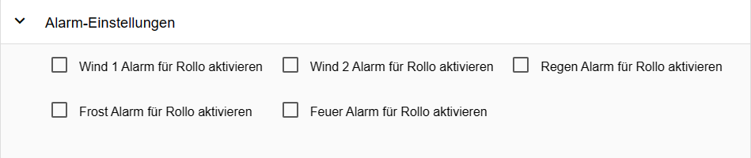

# Документация и инструкции для Shuttercontrol


---

## Поддержка разработки адаптера
**Если вам понравился адаптер, пожалуйста, рассмотрите возможность сделать пожертвование:**

[](https://paypal.me/mk1676)

---

## Основы
>:grey_exclamation: Руководство действительно с версии stable 1.6.2 :grey_exclamation:

Shuttercontrol — это адаптер для комплексного управления рольставнями, жалюзи или маркизами, включающий как автоматическое затенение, так и ночное затемнение.

>:point_right: Для простоты здесь упоминаются только рольставни.

Для управления доступно большое количество настраиваемых параметров, например:

* три разных глобальных таймера, например, для гостиной, спальни и детской зоны,
* различные параметры, зависящие от положения солнца, которые можно устанавливать индивидуально для каждой рольставни.

можно настроить индивидуально для каждой рольставни,

* Триггеры для датчиков дверей/окон, которые выполняют функцию защиты от блокировки или автоматического открытия на индивидуальном уровне.

открывание на индивидуальном уровне при открытии двери или окна,

* Различные регулируемые параметры затенения в зависимости, например:

внутренняя температура, наружная температура, яркость, датчик тепла или аналогичный,

* Учет положения солнца позволяет затемнять только те помещения, которые фактически затенены.

освещены.

Все точки данных конфигурации уже предварительно заданы с примерами, так что адаптер быстро готов к использованию после установки и ввода идентификаторов жалюзи, готовых к работе.

Дальнейшая конфигурация затем используется для адаптации к личным пожеланиям.

> Shuttercontrol может управлять приводами только через положение, например, LEVEL, со значениями от 0 до 100 или 0-255 соответственно. Соответствующее время срабатывания затвора или жалюзи должно быть принято приводом.
быть принято приводом. Приводы жалюзи, которые предлагают по одному объекту для «высоты» и «угла наклона планки», могут управляться с помощью двух жалюзи.
может использоваться с двумя объектами жалюзи с одинаковой параметризацией.
быть использовано.

---

## Установка
Адаптер находится в "stable" репозитории ioBroker. На вкладке "Adapter" выбирается "shuttercontrol" и создается экземпляр адаптера shuttercontrol через (+).

## Конфигурация
После создания экземпляра автоматически открывается окно конфигурации с вкладками ОСНОВНЫЕ НАСТРОЙКИ, НАСТРОЙКИ ВРЕМЕНИ и ДОПОЛНИТЕЛЬНЫЕ НАСТРОЙКИ.

>:point_right: Вкладки [Настройки времени](#time-settings) и [Дополнительные настройки](#extra-settings) следует редактировать в первую очередь, т. е. до того, как будут добавлены ставни с помощью карандаша в ОСНОВНЫХ НАСТРОЙКАХ.

---

### ОСНОВНЫЕ НАСТРОЙКИ
 --- >:point_right: Доступ к документации на github можно получить, нажав на вопросительный знак в правом верхнем углу (7).

#### Сохраните или загрузите конфигурацию адаптера
Нажмите на стрелку, направленную вниз (9) в правом верхнем углу, чтобы сохранить конфигурацию адаптера как файл .json.
Нажмите на стрелку вверх (8), чтобы загрузить существующую конфигурацию адаптера в формате .json.

_[Вернуться наверх](#documentation-and-instructions-for-shuttercontrol)_

---

### НАСТРОЙКИ ВРЕМЕНИ
Здесь задаются основные настройки времени или Astro, которые позже используются в [Настройки затвора](#shutter-settings) для каждого затвора.
[Настройки затвора](#shutter-settings) для каждого затвора.

>:heavy_exclamation_mark: Shuttercontrol всегда закрывает ставни **в пятницу** в установленное время **выходных**.
и **в воскресенье** всегда в установленное время **рабочей недели** :heavy_exclamation_mark:


#### Настройки для гостиной, спальной и детской зон
Индивидуальные настройки открываются через выпадающий список. Описание приведено в качестве примера для жилой зоны и аналогично применяется ко всем зонам.
для всех зон.

>:point_right: Конечно, эта категоризация не обязательно должна использоваться для жилой, спальной или детской зоны.
детской зоны, но позволяет определить три зоны в здании с разным временем движения рольставней.

**Тип автоматического управления для жилой зоны**

Выпадающий список используется для выбора между:

* **Только время в жилой зоне:**

*Рольставни работают только по таймеру.

* Время гостиной с восходом и заходом солнца.

*Рольставни управляются в зависимости от восхода и захода солнца, но не поднимаются раньше самого раннего времени и не опускаются позже самого позднего времени.

* **Время жилой зоны с Золотым часом:**

*Аналогично восходу и заходу солнца, но с отсылкой к началу и концу «Золотого часа».

**Закрытие ставен в течение рабочей недели:** *Обычное время затемнения в течение недели*.

**Самое раннее время подъема ставней в течение недели:** *Это самое раннее время подъема ставней в течение недели.

**Самое позднее время подъема рольставней в течение недели:** *Это самое позднее время, когда рольставни будут подняты в течение недели*.

**Время задержки для поэтапного подъема рольставней (секунды):** *Расстояние между отдельными подъемами рольставней данного диапазона, например, для избежания радиопомех или для создания впечатления, что они перемещаются вручную.

**Закрытие рольставней в выходные дни:** *Обычное время затемнения в выходные дни **и** в праздничные дни.

**Самое раннее время подъема ставней в выходные дни:** *Это самое раннее время, когда ставни поднимаются в выходные дни **и** в праздничные дни.

**Самое позднее время подъема в выходные дни:** *В настоящее время рольставни поднимаются в выходные дни **и** самое позднее в праздничные дни*.

>:point_right: Если рольставни никогда не должны подниматься, пока солнце еще не достигло определенного положения, это время должно быть установлено на самое позднее время этого положения солнца (21.12.).

_[Вернуться наверх](#documentation-and-instructions-for-shuttercontrol)_

---

### ДОПОЛНИТЕЛЬНЫЕ НАСТРОЙКИ


#### Астронастройки


**Широта и долгота:** *Shuttercontrol берет широту и долготу из настроек системы ioBroker.
Shuttercontrol использует эти значения для расчета положения солнца.

**Выход из функции защиты от солнца по высоте солнца (возвышению):** *Как только солнце опускается ниже установленной здесь высоты, затенение прекращается.
затенение с помощью Shuttercontrol прекращается.

>:point_right: Возможное преждевременное затенение из-за зданий или высоких деревьев можно учесть здесь и завершить автоматическое затенение раньше.

**Время задержки подъема или опускания (минуты):** *Здесь можно ввести смещение +/-, на которое движение жалюзи должно задерживаться относительно типа автоматического управления, выбранного в [Настройки времени](#time-settings).

**Временная задержка для ступенчатого движения затвора (секунды):** *Чтобы предотвратить одновременное движение всех затворов, здесь можно установить глобальную временную задержку в секундах.

_[Вернуться наверх](#documentation-and-instructions-for-shuttercontrol)_

---

#### Летние настройки


**Начало лета** и **Конец лета**:** *Здесь начало или конец лета можно установить по вашему желанию.

Установка флажка в пункте [Настройки затвора](#shutter-settings) соответствующей шторы на ``Do not close shutter in summer`` предотвращает закрытие этой шторы летом.

_[Вернуться наверх](#documentation-and-instructions-for-shuttercontrol)_

---

#### Рождественские настройки


**Начало рождественского периода** и **Окончание рождественского периода**: *Здесь начало и окончание рождественского периода можно установить в соответствии с вашими собственными пожеланиями.

В разделе [Дополнительные настройки для рольставней](#extra-settings-roller-shutter) Рождественские настройки включается нужная в это время функция и устанавливается желаемое положение рольставней.

_[Вернуться наверх](#documentation-and-instructions-for-shuttercontrol)_

---

#### Настройки праздников и государственных праздников


**Использование государственных праздников:** *Установив этот флажок и выбрав соответствующий экземпляр адаптера для государственных праздников, ставни будут перемещаться в государственные праздники в установленное время выходных.

>:point_right: При необходимости можно создать два экземпляра адаптера государственных праздников: > один для отображения всех возможных государственных праздников и один с государственными праздниками, соответствующими рабочему времени, к которому затем обращается shuttercontrol.

**Идентификатор объекта для установки праздника: *Этот идентификатор объекта устанавливает внутреннее состояние «Праздник».
Здесь, например, можно использовать точку данных из адаптера iCal, которая возвращает значение ``true`` в случае праздника и, таким образом, позволяет ставням двигаться в выходные дни.

_[Вернуться наверх](#documentation-and-instructions-for-shuttercontrol)_

---

#### Настройки датчика яркости


Если ставни должны перемещаться автоматически с помощью датчика освещенности, это настраивается здесь.

Затем активация выполняется индивидуально для каждой рольставни в разделе [Настройки основного затвора](#main-shutter-settings).
в разделе **Тип управления закрытием (или открытием) рольставни**, выбрав запись «Датчик освещенности».

**Значение яркости для закрытия с датчиком яркости** *Значение яркости, при котором ставни должны закрываться.

**Значение яркости для открытия с помощью датчика яркости** *Значение яркости, при котором должны открываться ставни*.

**Идентификатор объекта датчика яркости** *Ссылка на датчик яркости, например, от метеостанции или от наружного датчика движения или отдельного датчика яркости.

_[Вернуться наверх](#documentation-and-instructions-for-shuttercontrol)_

---

#### Настройки школьных каникул


Здесь период праздников можно активировать либо через отдельную точку данных с **Идентификатором объекта для активации/деактивации школьных каникул**, либо установив флажок для экземпляра установленного адаптера Schoolfree.
Затем ставни открываются в период праздников в установленное время для вождения в выходные дни.
Режим праздников можно активировать индивидуально для каждой области.

_[Вернуться наверх](#documentation-and-instructions-for-shuttercontrol)_

---

#### Особые времена


**Закрыть определенные ставни позже** *Эта опция позволяет снова опустить все ставни поздно вечером.
Это охватывает сценарий, когда в обычное время закрытия окно или дверь были все еще открыты.
окно или дверь были все еще открыты в обычное время закрытия, или если, например, дверь патио снова открывается после закрытия.
Когда установлен флажок, появляется настройка **Время, в которое настроенные рольставни должны закрываться поздно**.

> Эту функцию необходимо активировать для каждой рольставни в [Настройки затвора](#shutter-settings), установив флажок **Закрывать рольставни поздно** для каждой рольставни отдельно или деактивировав ее, если она не требуется.

**Полностью закрыть все ставни в промежуточном положении** *Время, когда все ставни полностью закрыты вечером (например, 22:00)*.

**Открыть рольставни только если последнее движение было x минут назад:** *Рольставни открываются адаптером только если истекло установленное здесь время.
истекло установленное здесь время.

_[Вернуться наверх](#documentation-and-instructions-for-shuttercontrol)_

---

#### Дополнительные настройки


**Проверка текущего состояния затвора:** У некоторых пользователей (в том числе пользователей Shelly) есть проблема, что уровень немного меняется. Для этого здесь есть флажок.
Если флажок активирован, shuttercontrol проверит текущий уровень после времени ожидания проверки состояния затвора, shuttercontrol проверяет текущий уровень и временно сохраняет его.

**Блокировка ручного режима для известных высот жалюзи** *Округление вверх или вниз текущих высот жалюзи*.
Здесь положение рольставней можно округлить с шагом 5 или 10.

**Идентификатор объекта триггера для спальной зоны (Авто):** *Этот триггер активирует автоматический режим спальной зоны.

**Идентификатор объекта триггера жилой зоны (Авто):** *Этот триггер активирует автоматический режим жилой зоны.

**Идентификатор объекта триггера для детской зоны (Авто):** *Этот триггер активирует автоматический режим детской зоны.

---

#### Настройки будильника


>:point_right: Для каждого сигнала тревоги требуется логическая точка данных (истина/ложь) для активации, > которая активирует **сигнал тревоги** = статус **истина** или деактивирует **сигнал тревоги** = статус **ложь**.
>:point_right: Кроме того, для каждого сигнала тревоги необходимо определить высоту (0-100%), на которую перемещается рольставня в случае сигнала тревоги.
>point_right: В [Установка будильника](#alarm-setting) соответствующего ставня затем определяется, на какие сигналы тревоги должен реагировать ставень.
ставень должен реагировать.

Приоритеты отдельных сигналов тревоги:

Приоритет 1 (наивысший приоритет) --> Пожар:

Если срабатывает эта сигнализация, настроенные для нее рольставни переместятся на заданную высоту в **любом** случае.
>:exclamation: Затем рольставни блокируются и **НЕ** закроются автоматически, даже если пожарная сигнализация будет сброшена (ложь).

>:point_right:После сброса пожарной сигнализации жалюзи необходимо повторно инициализировать с помощью кнопок «openAll» / «closeAll».
Это предотвращает автоматическое закрытие рольставней по любой причине в случае пожара.
Это также гарантирует, что пути эвакуации останутся открытыми, а доступ для пожарной бригады гарантирован.

Приоритет 2 - 5 (тот же приоритет) --> Дождь, Ветер2, Ветер1, Мороз:

При активации этих сигналов тревоги Shuttercontrol переводит настроенные рольставни на последний активный уровень сигнала тревоги.

Однако при отключении отдельных сигналов тревоги соблюдается следующий приоритет: Приоритет 1 = Пожар Приоритет 2 = Дождь Приоритет 3 = Ветер 2 Приоритет 4 = Ветер 1 Приоритет 5 = Мороз

Сигнализация замерзания действует напрямую только в том случае, если активированные рольставни уже закрыты (опасность замерзания рольставней). Если сигнализация замерзания срабатывает, когда рольставни еще открыты, рольставни автоматически перемещаются на высоту, установленную для сигнализации замерзания, только когда они закрыты.

_[Вернуться наверх](#documentation-and-instructions-for-shuttercontrol)_

---

### Настройки затвора


>:point_right: Пример привода *пример ставня* создан автоматически, пожалуйста, удалите его через мусорную корзину (5).

Теперь добавьте собственные приводы жалюзи, нажав на (+) (1). Откроется выбор идентификатора и выберите точку данных LEVEL, которая представляет положение желаемой рольставни.


Структура таблицы:


* **Нет:** *порядковый номер перечисленных ставней*.

* **Активно:** *Флажок для активации/деактивации управления соответствующей рольставней*.

* **Имя:** *Имя привода автоматически считывается из объектов при выборе идентификатора.

и затем может быть изменен в соответствии с вашими пожеланиями.

* **Идентификатор объекта затвора:** *Уникальный идентификатор точки данных, которая будет контролироваться в объектах*.

* **(+)** *Изменить выбранный привод рольставней* * **Карандаш** * *Изменить выбранный привод рольставней

* **Карандаш** *Открыть индивидуальную конфигурацию соответствующей рольставни*.

* **Двойной лист:** *Копировальная рольставня*

* **Стрелки:** *Определяют порядок движения рольставней при одинаковых настройках.

* Корзина:* *Удаляет привод жалюзи со всеми настроенными данными.

После создания рольставней, нажав карандаш (3) на соответствующей рольставне с язычками [ОСНОВНЫЕ НАСТРОЙКИ для рольставней](#main-shutter-settings), [НАСТРОЙКИ ЗАЩИТЫ ОТ СОЛНЦА](#sun-protection-settings) и [ДОПОЛНИТЕЛЬНЫЕ НАСТРОЙКИ](#extra-settings), каждая рольставня далее настраивается индивидуально.

---

#### Настройки основного затвора


В верхней области время открытия или закрытия ставня выбирается отдельно с помощью выпадающего меню.
> :point_right: Это время уже настроено в [Настройки времени](#time-settings).

Варианты выбора:

* **Выкл.:** *Не использовать таймеры.

* **Жилая зона:** *Ставни перемещаются в соответствии с настройками, заданными в *Настройках жилой зоны*.

* Жилая зона (автоматически):** **Рольставни перемещаются в соответствии с временем, заданным в* астройках для жилой зоны*.

**и** кроме того, ставни активируются в ответ на триггер, определенный в разделе Дополнительные настройки.
Идентификатор объекта для активации/деактивации автоматической жилой зоны. Если Если установлено значение false, рольставни **не** будут перемещаться автоматически.

* Рольставни перемещаются в соответствии с настройками *Настроек спальной зоны*.

* Рольставни перемещаются в соответствии с временем, заданным в *Настройках для спальной зоны*.

**и** кроме того, затвор активируется в ответ на триггер, указанный в дополнительных настройках.
Идентификатор объекта для активации/деактивации зоны автоматического сна.
Если установлено значение false, рольставни **не** будут перемещаться автоматически.

* Детская зона: **Рольставни перемещаются в соответствии с временем, указанным в* астройках детской зоны*.

* Детская зона (автоматически):* *Рольставни перемещаются в соответствии с временем, заданным в *Настройках для детской зоны*.

**и** кроме того, затвор активируется в ответ на триггер, определенный в дополнительных настройках.
Идентификатор объекта для активации/деактивации автоматической детской зоны.
Если установлено значение false, затвор **не** будет перемещаться автоматически.

* Закат/Восход:** * *Затвор движется во время заката или восхода солнца.

* Высота солнца: если высота солнца опускается ниже установленного здесь значения, рольставни закрываются.

* Золотой час:** * *Рольставни закрываются в золотой час, который, в зависимости от широты и времени года, наступает примерно за 1 час до захода солнца или после восхода солнца.

до захода солнца или после восхода солнца, в зависимости от широты и времени года.

* Датчик яркости:** * *Рольставни двигаются только в соответствии с датчиком яркости, который настраивается в разделе [Настройки датчика яркости](#brightness-sensor-settings).

* Только ручное управление:** * *Рольставни можно перемещать только вручную в выбранном направлении.

:point_right: Движение невозможно с помощью кнопок под ``shuttercontrol.0.control``.
point_right: Это может быть полезно, например, для маркиз, которые не следует открывать вместе с другими рольставнями.
которые не следует открывать вместе с другими ставнями.

**Значение датчика окна/двери в закрытом состоянии:** *Здесь определяется значение, которое может иметь триггер под **Идентификатором объекта контакта окна/двери** (например, контакт окна или двери).
(например, контакт окна или поворотной ручки), при котором автоматической системе рольставней разрешено двигаться неограниченно долго.
:point_right: Можно выбрать такие значения, как true, false, 0, 1 или 2.

> point_right: Если рольставни не находятся в самом верхнем положении и указанное здесь состояние датчика изменяется, рольставни перемещаются в самое верхнее положение.
состояние датчика изменяется, рольставни перемещаются на **высоту рольставней при открытии окна или двери**.

**Значение датчика окна/двери в наклонном состоянии:** *Это устанавливает значение, на которое устанавливается триггер под **Идентификатором объекта контакта окна/двери** (например, контакт окна или двери).
(например, контакт окна или поворотной ручки), при котором автоматической системе рольставней разрешено двигаться неограниченно долго.
:point_right: Можно выбрать такие значения, как true, false, 0, 1 или 2.

> point_right: Если рольставни не находятся в самом верхнем положении и указанное здесь состояние датчика изменяется, рольставни перемещаются в самое верхнее положение.
состояние датчика изменяется, рольставни перемещаются на **высоту рольставней при открытии окна или двери**.

> :exclamation: Если оконный контакт с функцией наклона отсутствует, это значение следует установить на «отсутствует».

**Перемещение рольставней при изменении состояния окна/двери:** *Вытяните вниз, чтобы выбрать функцию, которая должна выполняться при перемещении датчика окна/двери:*

**Выкл.**: нет движения

* **Открыто**: При открывании окна/двери рольставни поднимаются и остаются в таком положении, при закрывании рольставни не двигаются.
* **Закрыть**: После закрытия окна/двери рольставни перемещаются в положение затемнения, при открытии рольставни не перемещаются.

**Открытие и закрытие:** Рольставни поднимаются при открытии окна/двери и снова опускаются при закрытии.

**Высота рольставней при открытии окна или двери:** *Желаемое положение рольставней от 0 до 100, например, для окон 25% для вентиляции или 100% для дверей, чтобы можно было проехать.
для дверей, чтобы можно было проехать.

**Высота рольставней при наклоне окна или двери:** *Требуемое положение рольставней от 0 до 100, например, для окон 25% для вентиляции.

**Использовать автоматические рольставни даже при открытом окне/двери (защита от блокировки)** **Если во время автоматического закрытия датчик окна/двери __не__ соответствует введенному там значению (окно/дверь закрыты), то в соответствии с выбранной настройкой будут выполнены следующие действия:**

* **Выкл.**: Защита от блокировки активна в обоих направлениях, ставни не двигаются, когда окно открыто.
* **Открыто**: Разрешено только поднимать. В конце затемнения/затенения рольставни поднимаются, даже если окно открыто. Рольставни не закрываются автоматически, когда окно открыто.
* **Закрыть**: Разрешено только закрытие. В начале затемнения/затенения рольставни опускаются, несмотря на то, что окно открыто. Рольставни не открываются, когда окно открыто.
* **Открытие и закрытие**: рольставни могут двигаться в обоих направлениях, когда окно открыто.

**Высота рольставней при движении вниз:** *Значение положения при закрытой рольставне.

**Высота рольставней в поднятом состоянии:** *Значение положения при открытых рольставнях*.

> :point_right: Высота рольставней должна быть введена в соответствии с используемыми приводами (0-100 или 0-255): > 0 = закрыты и 100 = открыты или 0 = открыты и 100 = закрыты.

**Идентификатор объекта оконного/дверного контакта:** Используйте (+), чтобы выбрать датчик (состояние), который должен предотвратить движение рольставней (например, дверной контакт).

_[Вернуться наверх](#documentation-and-instructions-for-shuttercontrol)_

---

#### Настройки защиты от солнца


**Тип управления солнцезащитой:** Солнцезащитой можно управлять с помощью различных триггеров затенения и его окончания. С помощью выпадающего списка можно выбрать следующие комбинации:

* Из
* Датчик температуры/освещённости внутри и снаружи помещения
* Направление компаса (положение солнца)
* Датчик температуры/освещения в помещении/на улице и направление света
* Датчик наружной температуры/освещения и направления
* Датчик наружной температуры/освещённости
* Температура в помещении

> :point_right: Защита от солнца срабатывает только тогда, когда ВСЕ триггеры выбранной комбинации активны (логическое соединение «И»), и прекращает работу, когда ОДИН из триггеров становится неактивным.

> :point_right: Идентификатор объекта также должен быть сохранен для ВСЕХ выбранных триггеров.

> :point_right: Датчик освещенности всегда необязателен и может оставаться пустым. Если датчик освещенности настроен, он связан с другими параметрами И.

**Высота рольставней при движении вниз:** *Значение того, насколько далеко должны быть закрыты рольставни при затенении.*

**Направление (положение солнца):** *Положение окна на компасной розе (0° = север; 180° = юг)*

**+/- Диапазон положения солнца для активной защиты от солнца:** *Зона, в которой солнце (вокруг центральной точки) будет мешать окну. За пределами этой зоны затенение отсутствует.*

**Заданное значение наружной температуры:** *Затенение начинается с этого значения (или выше).*

**Гистерезис наружной температуры (в процентах):** *Здесь можно задать гистерезис в процентах, чтобы рольставни при колебаниях не ходили постоянно вверх и вниз.* Гистерезис — это разница между верхним значением температуры, при котором должно начинаться затенение, и нижним значением температуры, при котором затенение снова заканчивается.

**Идентификатор объекта температуры наружного воздуха:** Датчик, выбранный здесь с помощью (+), не обязательно должен измерять температуру наружного воздуха. Он может предоставить любое значение, которое может быть использовано для запуска затенения.
Это также может быть датчик тепла (датчик разности температур).
Если в качестве триггера не выбран ни один датчик наружного воздуха, оставьте это поле пустым.

**Уставка датчика освещенности для защиты от солнца:** *Пороговое значение для начала затенения.* Это значение зависит от датчика, выбранного в поле **Идентификатор объекта для датчика освещенности для защиты от солнца**.

**Гистерезис датчика освещенности (в процентах):** Здесь вы можете установить нисходящий гистерезис в процентах, чтобы рольставни не двигались постоянно вверх и вниз при колебаниях, вызванных изменением облачности.
Гистерезис — это разница между заданным значением, при котором должно начинаться затенение, и нижним значением яркости, при котором затенение должно начинаться и заканчиваться.

> :point_right: Пример: Уставка датчика освещенности для защиты от солнца установлена на 30 000, гистерезис на 40%. Защита от солнца активна с 30 000 и остается активной до тех пор, пока значение не опустится ниже 18 000.

**Идентификатор объекта датчика освещенности для защиты от солнца:** *Аналог датчика наружной температуры* Если не выбрано в качестве триггера, оставьте поле пустым

**Заданная температура в помещении:** Здесь можно ввести температуру внутреннего датчика температуры, назначенного рольставням, при которой не должно происходить затенения, например, для уменьшения нагрева с целью использования излучения зимой для поддержки отопления.

**Гистерезис внутренней температуры (в процентах):** *Здесь можно задать гистерезис в процентах, чтобы рольставни при колебаниях внутренней температуры не двигались постоянно вверх и вниз.* Гистерезис — это разница между верхним значением температуры, при котором должно начинаться затенение, и нижним значением температуры, при котором затенение снова заканчивается.

**Идентификатор объекта датчика температуры в помещении:** Используйте (+) для выбора датчика температуры.
Если в качестве триггера не выбран датчик температуры в помещении, оставьте это поле пустым.

_[Вернуться наверх](#documentation-and-instructions-for-shuttercontrol)_

---

#### Дополнительные настройки рольставней


#### Настройки рольставней


**Закрыть рольставни поздно** С этой опцией рольставни активируются в определенное время (регулируется в [Особые времена](#special-times)), а также закрываются.
> :exclamation: Защита от блокировки здесь не учитывается, и рольставни опускаются, несмотря на то, что окно открыто! (Опасность быть заблокированным!!) :exclamation:

**Не закрывайте рольставни летом** Некоторые рольставни не следует закрывать летом. Летом будет период в [Летние Настройки](#summer-settings).

**Управление после закрытия окна** После закрытия окна/двери рольставни будут установлены в последнюю запрошенную настройку. Позиционное управление.

> :point_right: Это работает только в том случае, если защита от блокировки не установлена на «Выкл»!

#### Рождественские настройки


Если рольставни должны быть закрыты только частично в рождественское время, например, если должна оставаться видна арка свечи или что-то подобное, можно использовать эту опцию. В таком случае рольставни не будут полностью закрыты в обычное время закрытия, а будут закрыты только до уровня, который можно задать.
> :point_right: **Уровень рольставней в рождественское время** виден и регулируется только в том случае, если установлен флажок **Уровень рольставней в рождественское время используется**.

Период, когда эта функция должна быть активирована, устанавливается в [Рождественские настройки](#christmas-settings) set.
> :point_right: Если рольставни должны быть полностью закрыты позже вечером, можно использовать эту опцию > **Закрыть рольставни поздно** или **Переместить в промежуточное положение и полностью закрыть позже** > можно использовать.
> :point_right: Эти две опции также можно использовать независимо от настроек Рождества.

#### Настройки защиты от солнца


**Держать рольставни в режиме защиты от солнца** Если эта опция включена, рольставни остаются в режиме защиты от солнца, даже если больше нет необходимости в защите от солнца, и остаются в режиме защиты от солнца до тех пор, пока вечером не поступит сигнал «закрыть». Это предотвращает подъем и опускание рольставней несколько раз в день.
Очень практично при работе в режиме жалюзи, когда высота удерживается на низком уровне (опция отмечена), и просто открывайте и закрывайте ламели.

**Задержка падения ниже яркости до окончания затенения (минуты)** Здесь задается время, по истечении которого должна произойти задержка, если затенение затемнено и яркость падает ниже установленного уровня.
Значение по умолчанию — 0, и его можно отрегулировать при необходимости. Эта опция работает только в сочетании с датчиком яркости

**Защита от перегрева** Эта опция позволяет полностью закрыть рольставни в жаркую погоду.
После активации этой опции появляется поле для ввода температуры в °C.

> :point_right: Если рольставни отрегулированы вручную и их положение не соответствует автоматическому, автоматическая система останавливается!

> :point_right: Если рольставни вручную перемещаются на заданную высоту для открытия, закрытия или защиты от солнца, автоматическая функция сохраняется.

#### Дополнительные настройки


**Задержка открывания рольставней при открытии окна (с)** *Параметр задержки открывания рольставней после открытия окна/двери (в секундах)*

**Задержка закрывания рольставней при закрытии окна (с)** *Параметр задержки закрывания рольставней после закрытия окна/двери (в секундах)*

**Перейти в промежуточное положение и позже полностью закрыть** *При активации становится видна **высота рольставни в промежуточном положении**. Затем рольставня перемещается в установленное промежуточное положение при закрытии и позже полностью закрывается*

#### Настройка будильника


Здесь активируются или деактивируются сигналы тревоги, предопределенные для текущей рольставни через [Настройки будильника](#alarm-setting).

_[Вернуться наверх](#documentation-and-instructions-for-shuttercontrol)_

---

## Точки данных
Shuttercontrol создает различные точки данных в следующих папках:

* shuttercontrol.x.control
* shuttercontrol.x.info
* shuttercontrol.x.ставни

> :point_right: x обозначает соответствующий установленный экземпляр

---

### Shuttercontrol0control


Точки данных для управления различными функциями, такими как: *Праздник *Если ```true```, рольставни будут двигаться в установленное время по выходным и в

```false``` during weekday hours.*
> :point_right: Can use your own scripts that calculate or display vacation, days off, etc.
set to true to enable weekend settings.

* autoAll
*Button to set **all** shutters to auto mode*

* autoChildren
*If the roller shutters are controlled with **children's area (automatic)**, the automatic function is activated here
switched on with ```true``` and switched off with ```false```.*

* auto living
*If the roller shutters are controlled with **Living area (automatic)**, the automatic mode is used here
switched on with ```true``` and switched off with ```false```.*

* auto sleep
*If the roller shutters are controlled with **sleeping area (automatic)**, the automatic mode is used here
switched on with ```true``` and switched off with ```false```.*

* closeAll
*Button to close **all** roller shutters in **all areas***

* closeChildren
*Button to close **all** roller shutters in the children's area*

* closeLiving
*Button to close **all** roller shutters in the living area*

* closeSleep
*Button to close **all** shutters in the sleeping area*

* openAll
*Button to open **all** roller shutters in **all areas***

* openChildren
*Button to open **all** roller shutters in the children's area*

* openLiving
Button to open **all** roller shutters in the living area

* openSleep
*Button to open **all** shutters in the sleeping area*

* school free
*Button to manually activate the holiday season and have the roller shutters open at the set time on the weekend*

* sunProtect
*Button to move the roller shutters into the sun protection position*

* sunProtectChildren
*Button to move the roller shutters in the children's area to the sun protection position*

* sunProtectLiving
*Button to move the roller shutters in the living area to the sun protection position*

* sunProtectSleep
*Button to move the roller shutters in the sleeping area to the sun protection position*


_[Back to top](#documentation-and-instructions-for-shuttercontrol)_


---


### shuttercontrol0info
Data points for displaying calculated values and checking configured ones
Times:


_[Back to top](#documentation-and-instructions-for-shuttercontrol)_


---


### shuttercontrol0shutters


* autoDown
*For each roller shutter, automatic closing can be deactivated here with ```false```

или активировано с помощью ```true```.*

* автоуровень

*Показывает текущее положение каждой рольставни (управлять рольставнями с его помощью нельзя).*

* автосостояние

*Показывает текущее состояние (вверх, вниз, Manu_Mode, sunProtect) для каждой рольставни (роллеты не могут управляться с помощью этого).*

* автоСолнце

*Функция защиты от солнца может быть отключена для каждой рольставни с помощью ```false``` или активирована с помощью ```true```.*

* автовверх

*Для каждой рольставни автоматическое открывание можно отключить здесь с помощью ```false``` или активировать с помощью ```true```.*

_[Вернуться наверх](#documentation-and-instructions-for-shuttercontrol)_

## Changelog
<!-- ### __WORK IN PROGRESS__ -->
### __WORK IN PROGRESS__
* (simatec) eslint-config fix
* (simatec) Dependencies updated

### 1.8.5 (2024-11-27)
* (simatec) Bugfix Brightness down
* (simatec) eslint-config added
* (simatec) Dependencies updated

### 1.8.4 (2024-11-07)
* (simatec) Issue Info added
* (simatec) Dependencies updated
* (simatec) Design Fix
* (simatec) Bugfix Brightness down

### 1.8.3 (2024-10-16)
* (simatec) Fix Alarm
* (simatec) Fix Design
* (simatec) Dependencies updated

### 1.8.2 (2024-09-23)
* (simatec) Responsive design Fix

### 1.8.1 (2024-09-21)
* (simatec) small Design Fix

### 1.8.0 (2024-09-16)
* (simatec) Dependencies updated
* (simatec) Fix End-Delay for Sunprotect
* (simatec) Update Translations
* (simatec) Trigger changed
* (simatec) Code revision and improvements
* (simatec) many small fixes
* (simatec) Fix Sunprotect end by Shutter up
* (simatec) Fix Shutter up when open the Window
* (simatec) Test & Release updated
* (simatec) Fix Trigger
* (simatec) Responsive Design added
* (simatec) Docu Sync2Wiki added

### 1.7.3 (2024-06-20)
* (simatec) Fix Sunprotect End-Delay

### 1.7.2 (2024-06-20)
* (simatec) Fix Shutterstate enabled

### 1.7.1 (2024-06-19)
* (simatec) Dependencies updated
* (simatec) Docu updated

### 1.7.0 (2024-02-05)
* (simatec) Dependencies updated
* (simatec) @iobroker/adapter-dev added
* (simatec) Design optimizations
* (simatec) Gulp deleted
* (simatec) Docu updated
* (simatec) many small fixes

### 1.6.3 (2023-11-01)
* (simatec) Saturday added as work week
* (simatec) Dependencies updated
* (simatec) Fix Auto-Living, Auto-Sleep & Auto-Children
* (simatec) Timeout Fix
* (FredF63) Update German Docu
* (simatec) Wiki added

### 1.6.2 (2023-08-28)
* (simatec) Dependencies updated
* (simatec) node 20 tests added
* (simatec) Fix ending Sunprotect with open door/window
* (5G7K) Fix timing & some states for sunprotect

### 1.6.1 (2023-07-17)
* (simatec) Fix Heat protection

### 1.6.0 (2023-07-16)
* (simatec) Manu mode block added
* (simatec) Heat protection added
* (simatec) Added rounding of incoming shutter states
* (simatec) Ukrainian language added
* (simatec) small Bugfixes
* (simatec) Dependencies updated

### 1.5.0 (2023-06-05)
* (simatec) new Manu-Mode Check added
* (simatec) suncalc added
* (simatec) Dependencies updated

### 1.4.29 (2023-04-26)
* (simatec) Bugfix Brightness down

### 1.4.28 (2023-04-17)
* (simatec) small Fixes

### 1.4.27 (2023-04-17)
* (simatec) small Fixes

### 1.4.26 (2023-04-14)
* (simatec) Fix Sunprotect

### 1.4.25 (2023-04-13)
* (simatec) small Fixes

### 1.4.24 (2023-04-10)
* (simatec) Fix end of Sunprotect
* (simatec) small Fixes
* (simatec) Fix shutter alarm
* (simatec) Sentry fixes
* (simatec) Bugfix Brightness down
* (simatec) Dependencies updated
* (j4nv) Fix Astro Time

### 1.4.23 (2023-03-28)
* (simatec) Bugfix Brightness-Sensor
* (simatec) Dependencies updated
* (simatec) small fixes

### 1.4.22 (2023-03-18)
* (simatec) Bugfix Brightness-Sensor
* (simatec) Dependencies updated
* (simatec) Fix Alarm Settings

### 1.4.21 (2023-02-02)
* (simatec) fix Brightness Settings
* (simatec) Dependencies updated

### 1.4.20 (2023-01-30)
* (simatec) Bugfix Brightness-Sensor

### 1.4.19 (2023-01-22)
* (simatec) Time config for Brightness-Sensor added
* (simatec) small Bugfixes
* (simatec) Dependencies updated

### 1.4.18 (2022-09-24)
* (simatec) Bugfixes Button Action

### 1.4.17 (2022-09-24)
* (simatec) small Bugfixes

### 1.4.16 (2022-09-19)
* (simatec) small Bugfixes
* (simatec) Dependencies updated
* (simatec) Dev-Dependencies updated
* (simatec) Docu updated
* (simatec) travis deleted
* (simatec) update translation
* (simatec) debug for shutterstate added

### 1.4.14 (2022-06-02)
* (simatec) delay for Lightsensor added
* (simatec) Dependencies updated
* (simatec) Dev-Dependencies updated

### 1.4.13 (2022-05-24)
* (FoxRo) Bugfix Alarm handling
* (simatec) Dependencies updated
* (simatec) Dev-Dependencies updated
* (simatec) more debuglog for Trigger

### 1.4.12 (2022-04-11)
* (FoxRo) Bugfix wrongly open after deactivation of weater alarm
* (simatec) Dependencies updated
* (simatec) Dev-Dependencies updated

### 1.4.11 (2022-02-07)
* (simatec) fix objects value
* (simatec) Dependencies updated
* (simatec) Dev-Dependencies updated

### 1.4.10 (2022-01-16)
* (simatec) Bugfix xmas time
* (simatec) Bugfix Shutter delay
* (simatec) Dependencies updated
* (simatec) Dev-Dependencies updated

### 1.4.9 (2021-12-29)
* (simatec) error handling for trigger added
* (simatec) Bugfix Trigger delay
* (simatec) Dependencies updated
* (simatec) Dev-Dependencies updated

### 1.4.8 (2021-12-25)
* (simatec) error handling for trigger added
* (simatec) Bugfix Trigger delay

### 1.4.7 (2021-12-21)
* (simatec) complete error handling for states added
* (simatec) Bugfix Down Late Option
* (simatec) small Bugfixes
* (simatec) Dependencies updated
* (simatec) Dev-Dependencies updated

### 1.4.6 (2021-12-15)
* (simatec) Bugfixes shuttersettings
* (simatec) Bugfix shutter created

### 1.4.5 (2021-12-14)
* (simatec) small Bugfixes
* (simatec) Code cleaning
* (simatec) try & catch added
* (simatec) source code was converted to async
* (simatec) Dependencies updated
* (simatec) Dev-Dependencies updated

### 1.4.4 (2021-12-08)
* (simatec) Bugfix Trigger after shutter close
* (simatec) Bugfix XMas Level by frost
* (simatec) XMas Level for Elevation added
* (simatec) Summertime for Elevation added
* (simatec) small Bugfixes
* (simatec) shutter Config check added

### 1.4.3 (2021-12-05)
* (simatec) Bugfix Trigger after shutter close
* (simatec) Bugfix XMas Level by frost
* (simatec) XMas Level for GoldenHour added
* (simatec) Summertime for Goldenhour added
* (simatec) small Bugfixes

### 1.4.2 (2021-12-02)
* (simatec) Bugfix Alarm settings
* (simatec) Bugfix move shutter after closing window
* (simatec) better translation for all languages
* (simatec) small Bugfixes

### 1.4.1 (2021-12-01)
* (simatec) Code cleaning
* (simatec) Bugfix Alarm States
* (simatec) try & catch added

### 1.4.0 (2021-11-30)
* (simatec) Source code completely redesigned
* (simatec) Much of the source code was converted to async
* (simatec) many small Bugfixes
* (simatec) Dependencies updated
* (simatec) Dev-Dependencies updated

### 1.3.9 (2021-11-25)
* (simatec) Bugfix between Level
* (simatec) many small Bugfixes
* (simatec) docu updated
* (simatec) Dependencies updated
* (simatec) Dev-Dependencies updated

### 1.3.8 (2021-11-20)
* (simatec) Bugfix XMas-Level
* (simatec) Bugfix Down Complete

### 1.3.7 (2021-11-19)
* (simatec) brightness down State added
* (simatec) BrightnessSensor fix

### 1.3.6 (2021-11-17)
* (simatec) small Bugfixes

### 1.3.5 (2021-11-16)
* (simatec) Bugfix BrightnessSensor
* (simatec) Fix Delay with value 0
* (simatec) DEPENDENCIES updated
* (simatec) Dev-DEPENDENCIES updated

### 1.3.3 (2021-11-07)
* (simatec) Bugfix trigger Tilted

### 1.3.2 (2021-11-05)
* (simatec) Bugfix BrightnessSensor
* (simatec) lastAutoAction in array added
* (simatec) Bugfix Log for alarm

### 1.3.1 (2021-11-04)
* (simatec) Bugfix BrightnessSensor
* (simatec) Object-ID for school holidays added

### 1.3.0 (2021-11-03)
* (FoxRo) alarm function added
* (simatec) Trigger Tilted Window / Door added
* (FoxRo) new Feature Sunprotect end Delay added
* (FoxRo) Bugfix in window trigger
* (FoxRo/simatec) new Features in Docu added
* (simatec) many small BugFix
* (simatec) DEPENDENCIES updated
* (simatec) Dev-DEPENDENCIES updated

### 1.2.1 (2021-06-22)
* (simatec) auto-mode button added
* (simatec) many small BugFix
* (simatec) DEPENDENCIES updated
* (simatec) Dev-DEPENDENCIES updated

### 1.2.0 (2021-05-04)
* (simatec) new Feature shutterSettings added
* (simatec) new Feature brightness sensor for opening added
* (simatec) new Feature brightness sensor for closing added
* (simatec) new Feature schoolfree adapter added
* (simatec) new Feature middle position added
* (simatec) new Feature Xmas position added
* (simatec) Bugfix
* (simatec) DEPENDENCIES updated
* (simatec) Dev-DEPENDENCIES updated
* (simatec) timeout settings for shutterstatus added

### 1.1.5 (2021-01-22)
* (simatec) BugFix io-package
* (simatec) Source code structure changed
* (FoxRo) new Feature "trigger delay"
* (FoxRo) Bugfix for trigger

### 1.1.4 (2021-01-22)
* (simatec) BugFix Log
* (simatec) DEPENDENCIES updated
* (simatec) Dev-DEPENDENCIES updated

### 1.1.3 (2021-01-21)
* (simatec) small fix for objects

### 1.1.2 (2021-01-18)
* (simatec) small fix for holiday state

### 1.1.1 (2021-01-04)
* (René) bug fix xmas time
* (simatec) copy function for shutter-table added

### 1.1.0 (2020-12-08)
* (simatec) GUI redesign
* (simatec) Intermediate position added for closing

### 1.0.5 (2020-12-05)
* (Rene) fix xMas Time

### 1.0.4 (2020-10-28)
* (simatec) fix summertime for childrenarea

### 1.0.3 (2020-10-28)
* (René) bug fix: calculation IsSummerTime
* (René) bug fix: use weekend down time already on friday instead of sunday
* (René) handling of shutters in xmas time added
* (FredF63) documentation updated
* (FredF63) words.js updated
* (simatec) some Bugfixes

### 1.0.2 (2020-10-08)
* (simatec) fix uptime for childrenarea

### 1.0.1 (2020-10-06)
* (simatec) Adjustment of the configuration menu
* (simatec) time settings for the children's area added
* (simatec) button for closing the children's area added
* (simatec) button for opening the children's area added
* (simatec) button for sun protection of the children's area added

### 1.0.0 (2020-09-28)
* (simatec) some Bugfixes
* (simatec) code cleaning
* (simatec) DEPENDENCIES updated
* (simatec) Dev-DEPENDENCIES updated
* (FoxRo) Added buttons for Sunprotect Living and Sunprotect Sleep
* (FoxRo) Included Living-Auto and Sleep-Auto in Buttons for Open/Close Sleep and Living
* (FoxRo) KeepSunprotect added
* (FoxRo) Drive after close added
* (FoxRo) Extend status handling

### 0.8.7 (2020-09-22)
* (simatec) small Bugfix for weekend

### 0.8.6 (2020-08-21)
* (simatec) small Bugfixes trigger

### 0.8.5 (2020-08-03)
* (simatec) small Bugfixes
* (5G7K) bugfixes trigger
* (FredF63) new german doku

### 0.8.4 (2020-07-17)
* (simatec) small Bugfixes
* (5G7K) debug log changed
* (simatec) Dependencies updated
* (MeisterTR) Time left to detect second sleep

### 0.8.3 (2020-07-07)
* (simatec) Bugfix IsSummerTime
* (simatec) Bugfix shutter convert

### 0.8.2 (2020-07-06)
* (simatec) small Bugfixs
* (simatec) Buttons for sunprotect operation added

### 0.8.1 (2020-07-03)
* (simatec) Bugfix shutterstates
* (simatec) support for KNX

### 0.8.0 (2020-07-02)
* (simatec) added state for current shutter Action
* (simatec) added state for current shutter Level
* (simatec) added Indicator for manual operation in the states
* (simatec) code cleanup
* (simatec) complete new structure of the code
* (simatec) Buttons for manual opening and closing operation added
* (simatec) Display in the States if the shutter was moved manually
* (5G7K) Bug fix sunprotect

### 0.7.3 (2020-06-29)
* (simatec) errorhandling for sentry.io
* (simatec) bugfixes
* (simatec) cancel all schedule by unload
* (rg-engineering) bug fix and documentation

### 0.7.2 (2020-06-26)
* (simatec) Bugfix sunprotect for outsidetemp
* (simatec) better translation for all languages
* (simatec) better overview in the user interface

### 0.7.1 (2020-06-24)
* (simatec) small bugfixes
* (simatec) errorhandling for sentry.io

### 0.7.0 (2020-06-23)
* (rg-engineering) better (userfriendly) check for adjustable times
* (rg-engineering) datapoint for Holiday incl. internal check and handling
* (rg-engineering) late all down added 
* (5G7K) Extended sun protection
* (simatec) edited User Menu for Timesettings
* (simatec) Bugfix Lightvalue to 20.000 Lux
* (simatec) added better German Translation

### 0.6.2 (18.05.2020)
* (simatec) errorhandling for sentry.io
* (simatec) Bugfix getState

### 0.6.1 (11.05.2020)
* (simatec) bugfix index_m.html

### 0.6.0 (10.05.2020)
* (simatec) added sentry.io
* (simatec) added node 14 Support
* (simatec) many small Bugfixes
* (simatec) node 8 support removed
* (5G7K) added new feature for sunprotect
* (5G7K) added more debug logs

### 0.5.1 (15.04.2020)
* (simatec) Bugfix for Adapter checker
* (simatec) Added more debug logs
* (simatec) Added node Support
* (simatec) node 8 support removed
* (Rene) late all down added
* (Rene) late all down configurable per shutter
* (Rene) in summer time not to move down (configurable)

### 0.5.0 (06.04.2020)
* (simatec) Bugfix Goldenhour
* (simatec) Bugfix delay for sunprotect
* (simatec) Bugfix Goldhour with living area
* (simatec) Added auto fill for Position
* (simatec) many small Bugfixes
* (simatec) Bugfix Translations
* (simatec) Bugfix compactmode
* (5G7K) Added debug log with more Informations

### 0.4.3 (29.12.2019)
* (simatec) Bugfix update process

### 0.4.2 (22.12.2019)
* (simatec) Fix Trigger added objects

### 0.4.1 (20.10.2019)
* (simatec) Fix update process
* (simatec) Fix appveyor

### 0.4.0 (28.08.2019)
* (simatec) Fix shutdown for Elevation
* (simatec) Fix triggerHeight
* (simatec) Fix Travis

### 0.3.2 (09.07.2019)
* (simatec) Added state check for all shutter
* (simatec) Bugfix sunprotect
* (simatec) Bugfix trigger
* (simatec) Bugfix time settings
* (Homoran) Added German Docu

### 0.3.1 (02.07.2019)
* (simatec) Fix sunprotect for shelly user

### 0.3.0 (01.07.2019)
* (simatec) Fix shutter up for Sunprotect
* (simatec) Fix input for elevation
* (simatec) Fix input for Inside temperature
* (simatec) Fix input for Outside temperature
* (simatec) Fix input for Lightsensor
* (simatec) Added Object to shutter
* (simatec) Added hysteresis for Lightsensor
* (simatec) Added hysteresis for Inside temperature
* (simatec) Added hysteresis for Outside temperature
* (simatec) Added State check after running
* (simatec) Fix autodrive
* (simatec) Added check shutter up for sunprotect
* (simatec) Added Translations
* (simatec) sunprotect changed to switch
* (Homoran/simatec) Added German Docu
* (simatec) Added English Docu

### 0.2.13 (21.06.2019)
* (simatec) small Bugfix

### 0.2.12 (21.06.2019)
* (simatec) Changed Time-Settings
* (simatec) Bugfix Trigger for up and down
* (simatec) Bugfix sunprotect with azimut
* (simatec) Added sunprotect not running on state down
* (simatec) Added debug log for any shutter states

### 0.2.11 (20.06.2019)
* (simatec) Fix debug log
* (simatec) temporary storage of the state
* (simatec) automatic stop of sun protection with manual state change

### 0.2.10 (18.06.2019)
* (simatec) edit extra menu
* (simatec) clean code
* (simatec) save current states on start

### 0.2.9 (17.06.2019)
* (simatec) Bugfix PopUp
* (simatec) Fix TriggerID

### 0.2.8 (17.06.2019)
* (simatec) Menu completely revised
* (simatec) Ease of use improved
* (simatec) Example added
* (simatec) Default settings added for each roller shutter
* (simatec) fixed some bugs

### 0.2.7 (14.06.2019)
* (simatec) Beta 0.2.7

### 0.2.6 (14.06.2019)
* (simatec) Beta 0.2.6

### 0.2.5 (11.06.2019)
* (simatec) Beta 0.2.5

### 0.2.4 (11.06.2019)
* (simatec) Beta 0.2.4

### 0.2.3 (10.06.2019)
* (simatec) Fix Elevation
* (simatec) Fix direction
* (simatec) Add all translate
* (simatec) Add new popup for shutter config
* (simatec) clean table

### 0.2.2 (01.06.2019)
* (simatec) Beta 0.2.2

### 0.2.1 (01.06.2019)
* (simatec) Shutters drive when the trigger is changed
* (simatec) Add Trigger ID for Auto-Living
* (simatec) Add Trigger ID for Auto-Sleep
* (simatec) add shutter height for trigger
* (simatec) Add boolean for drive on change Trigger

### 0.2.0 (31.05.2019)
* (simatec) complete restructuring of functions

### 0.1.0 (11.05.2019)
* (simatec) First Beta

### 0.0.1 (02.04.2019)
* (simatec) initial release


*************************************************************************************************************************************

## License
MIT License

Copyright (c) 2019 - 2024 simatec

Permission is hereby granted, free of charge, to any person obtaining a copy
of this software and associated documentation files (the "Software"), to deal
in the Software without restriction, including without limitation the rights
to use, copy, modify, merge, publish, distribute, sublicense, and/or sell
copies of the Software, and to permit persons to whom the Software is
furnished to do so, subject to the following conditions:

The above copyright notice and this permission notice shall be included in all
copies or substantial portions of the Software.

THE SOFTWARE IS PROVIDED "AS IS", WITHOUT WARRANTY OF ANY KIND, EXPRESS OR
IMPLIED, INCLUDING BUT NOT LIMITED TO THE WARRANTIES OF MERCHANTABILITY,
FITNESS FOR A PARTICULAR PURPOSE AND NONINFRINGEMENT. IN NO EVENT SHALL THE
AUTHORS OR COPYRIGHT HOLDERS BE LIABLE FOR ANY CLAIM, DAMAGES OR OTHER
LIABILITY, WHETHER IN AN ACTION OF CONTRACT, TORT OR OTHERWISE, ARISING FROM,
OUT OF OR IN CONNECTION WITH THE SOFTWARE OR THE USE OR OTHER DEALINGS IN THE
SOFTWARE.