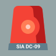
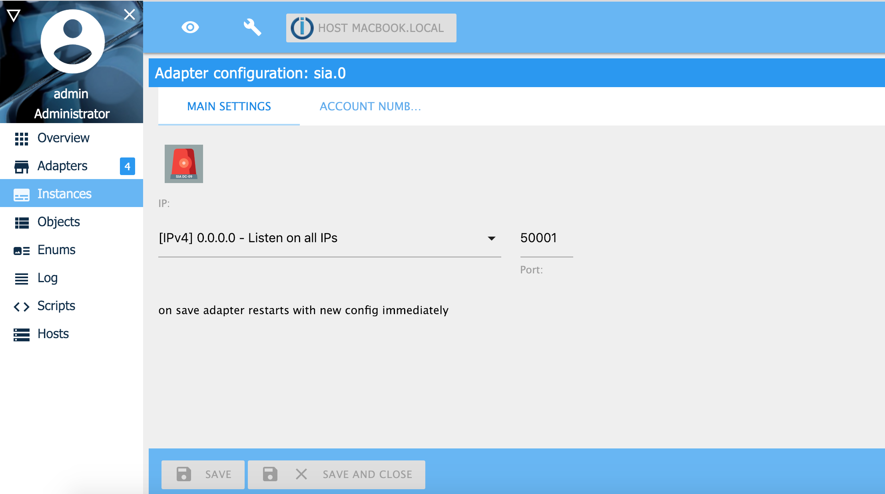
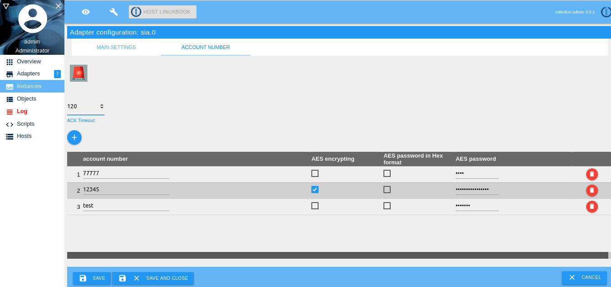
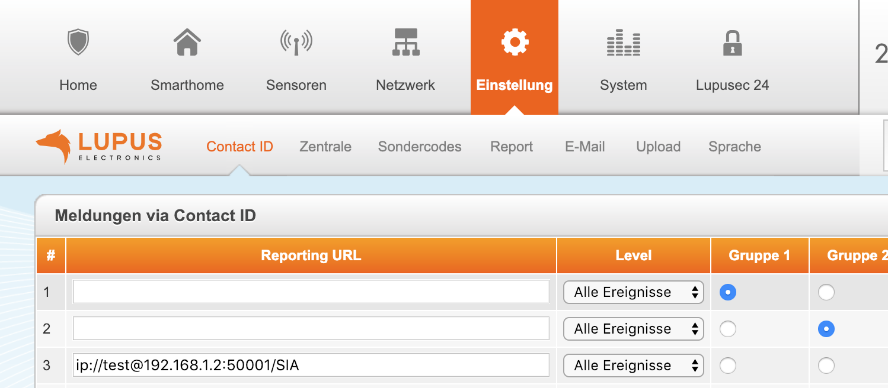
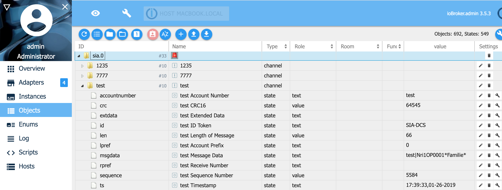

# IoBroker.sia
==================

Требуется node.js 20.0 или выше и Admin v5!

Протокол SIA DC-09 используется системами охранной сигнализации для связи с центральными станциями по каналам SIA-DCS, *SIA-DCS, ADM-CID и *ADM-CID.

Этот адаптер является сервером SIA. При срабатывании тревожного события система сигнализации отправляет по IP (TCP или UDP) сообщение sia на центральную станцию.
Поддерживаются следующие токены ID:

- SIA-DCS (СИА-DCS),
- \*SIA DCS (SIA DCS зашифрован),
- ADM-CID (контактный идентификатор Ademco),
- \*ADM-CID (зашифрованный идентификатор контакта Ademco)

Если вы используете *SIA DCS (SIA DCS зашифрованный) или *ADM-CID (Ademco Contact ID зашифрованный), вам необходимо включить шифрование AES и ввести пароль AES в формате HEX. Пароль AES должен быть для AES-128 = 32 символа HEX, AES-192 = 48 символов HEX, а для AES-256 необходимо ввести 64 символа HEX. Пример пароля для AES-128 будет: 3A1F6B8C9D4E7F20123456789ABCDEF0.

Вы можете использовать ioBroker с этим адаптером в качестве центральной станции. Например, вы можете отправить телеграмму с помощью ioBroker, если вы получили тревожное сообщение SIA.

[Протокол SIA DC-09](https://www.yumpu.com/en/document/view/47594214/dc-09-preparing-for-ansi-public-review-security-industry-)

## Установка и настройка
1. Установите адаптер.
2. Конфигурация адаптера:

Выберите IP-адрес и порт для прослушивания запросов SIA.


Зарегистрируйте номер учетной записи. Если вы используете AES, вам необходимо ввести пароль (ключ). Ключ должен быть длиной 16, 24 или 32 символа (байта).
Если флажок «Пароль AES в шестнадцатеричном формате» активен, длина пароля должна быть 32, 48 или 64 символа (байта).
В поле ACK timeout вы определяете, сколько времени может быть у сообщения в секундах. Если вы укажете 0 секунд, проверка тайм-аута не будет выполняться.

    

3. Настройте систему защиты от взлома на отправку сообщений SIA

    

    - Lupusec XT1+/XT2/XT2+/XT3/XT4 (SIA-DCS):

Einstellungen -> Идентификатор контакта: ip:/subcriber@ip-address-iobroker:port/SIA Пример: ip://A111F@192.168.20.55:55001/SIA

- Lupusec XT1+/XT2/XT2+/XT3/XT4 (\*SIA-DCS) зашифрован:

Указания -> Контактный идентификатор: ip://subcriber@ip-address-iobroker:port/SIA/KEY/(ключ длиной 128,196 или 256 бит в HEX) Пример: ip://A222F@192.168.20.55:55001/SIA/KEY/3A1F6B8C9D4E7F20123456789ABCDEF0

- Lupusec XT1+/XT2/XT2+/XT3/XT4 (ADM-CID):

Einstellungen -> Идентификатор контакта: ip://subcriber@ip-address-iobroker:port/SIA Пример: ip://A333F@192.168.20.55:55001/CID_SIA

- Lupusec XT1+/XT2/XT2+/XT3/XT4 (\*ADM-CID) зашифрован:

Указания -> Контактный идентификатор: ip://subcriber@ip-address-iobroker:port/CID_SIA/KEY/(ключ длиной 128,196 или 256 бит в HEX) Пример: ip://A444F@192.168.20.55:55001/SIA/KEY/3A1F6B8C9D4E7F20123456789ABCDEF0

- Другие системы сигнализации:

Адаптер будет работать со всеми системами сигнализации, которые поддерживают SIA-DCS, *SIA-DCS, ADM-CID или *ADM-CID

4. Объекты/состояния SIA

Если вы получаете сообщения SIA, вы видите их в дереве состояний под учетными записями каналов.

    

Для каждой учетной записи вы видите следующий объект:

| Объект | Описание |
    | ------------- | ------------------------------------------------------- |
| accountnumber | Номер счета (3-16 символов ASCII, "0"-"9", "A"-"F") |
| crc | Контрольная сумма CRC |
    | экстданные | Расширенные данные (данные ACII) |
| id | Идентификатор токена (пример SIA-DCS) |
| lpref | Префикс учетной записи |
| msgdata | Данные сообщения, всегда представленные в формате ASCII |
| rpref | Номер получателя |
| последовательность | Порядковый номер |
| ts | Метка времени (включается только в зашифрованные сообщения) |

Интересен объект: msgdata (данные сообщения). Здесь вы можете увидеть брошенное событие системы сигнализации. Как интерпретировать событие, вы должны спросить производителя вашей системы сигнализации.

Пример javascript в ioBroker для получения события:

```
// example message: A444F|1401 02 001
on({ id: 'sia.0.accounts.A444F.msgdata'/*A444F - Message Data*/ },  (obj) => {
    if(obj.state.ack === true) {
        const id = getState('sia.0.accounts.A444F.id'/*A444F - ID Token*/).val;
        if(id === 'ADM-CID' || id === '*ADM-CID') {
            const cid = parseMessage(obj.state.val);
            console.log(`Contact ID Message ${JSON.stringify(cid)}`);
            console.log(`Event: ${cid.event} for accountnumber ${cid.accountNumber}`);
        }
    }
});
```

    Выход:

```
Contact ID Message {"accountNumber":"A444F","qualifier":"1","event":"401","area":"02","zone":"001"}
Event: 401 for accountnumber A444F
```

Событие 401 означает «Удаленная постановка/снятие с охраны, когда система ставится на охрану или снимается с охраны с помощью SMS-сообщения или веб-доступа».

5. Ошибки/Проблемы

Если у вас возникли проблемы с обработкой сообщений SIA или вы обнаружили ошибку, пожалуйста, создайте задачу.
Задача должна содержать следующую информацию:

1. Производитель и тип охранной системы
2. Сообщение SIA как файл. Вы можете создать файл, если активируете его в конфигурации экземпляра.
3. Если вы используете шифрование (AES), то мне нужен ключ для расшифровки сообщения для тестирования.
4. Отладочный вывод ioBroker при обработке сообщения
5. Подробное описание ошибки

После выполнения пунктов 2 и 3, пожалуйста, измените ключ AES.
Вы можете проверить сохраненное сообщение SIA, используя следующую команду

```
# cat fileanme_of_sia_message | nc ip_address_of_iobroker sia_port
cat /tmp/sia/sia_msg_20250201_202457309.txt | nc localhost 55001
```

## Changelog
### 2.0.3 (2025-02-01)

- (Stübi) add error envent if connction close
- (Stübi) add the proctocol ADM-CID and \*ADM-CID (Ademco Contact ID)
- (Stübi) add translations
- (Stübi) fix bugs by receiving messages by udp
- (Stübi) adjust readme

### 2.0.2 (2025-01-30)

- (Stübi) add: checking accountnumber for exact syntax
- (Stübi) add: checking admin interface aes entries

### 2.0.1 (2025-01-29)

- (Stübi) Redesign of Contact ID Adapter.
- (Stübi) Wokring now with nodejs 20 and 22
- (Stübi) js-controller in version 6 and 7 will be supported
- (Stübi) Ability to save SIA messages.

### 2.0.0 (2025-01-29)

- (Stübi) Major Release

### 1.0.4 (2019-11-17)

- (Stübi) Bugfixing, changing the time calculation for ACK and NACK messages
- (Stübi) Small improvements to the SIA protocol
- (Stübi) Changed bug in encrypting. Delete appending 8 \* 0x10
- (Stübi) Support of UDP. Same port listening as TCP
- (Stübi) Saving password encrypted.
- (Stübi) ACK and NAC calculation extended.
- (Stübi) CRC can be send in 0xABCD (2 Byte) or ABCD (4 Byte, ASCII) format. Automatic recognizing
- (Stübi) AES Password can be in AES-128-CBC, AES-192-CBC or AES-256-CBC
- (Stübi) AES Password can be saved in byte or hex (length 16, 24 or 32 byte) format or hex (length 32, 48 or 64 hex) format
- (Stübi) Timeout for ACK (0 = disable, 1 - n sec)
- (Stübi) Set ioBroker States of message on ACK not on NACK
- (Stübi) Support js-controller compact mode
- (Stübi) Update Adapter Core File
- (Stübi) Bugfxing (NAK) and AES support
- (Stübi) Translations
- (Stübi) Requires nodejs 6.0 or higher
- (Stübi) Cleanup
- (Stübi) SIA regex optimized
- (Stübi) bug fixing
- (Stübi) first implementation

## License

The MIT License (MIT)

Copyright (c) 2025 Thorsten <thorsten@stueben.de>

Permission is hereby granted, free of charge, to any person obtaining a copy
of this software and associated documentation files (the "Software"), to deal
in the Software without restriction, including without limitation the rights
to use, copy, modify, merge, publish, distribute, sublicense, and/or sell
copies of the Software, and to permit persons to whom the Software is
furnished to do so, subject to the following conditions:

The above copyright notice and this permission notice shall be included in
all copies or substantial portions of the Software.

THE SOFTWARE IS PROVIDED "AS IS", WITHOUT WARRANTY OF ANY KIND, EXPRESS OR
IMPLIED, INCLUDING BUT NOT LIMITED TO THE WARRANTIES OF MERCHANTABILITY,
FITNESS FOR A PARTICULAR PURPOSE AND NONINFRINGEMENT. IN NO EVENT SHALL THE
AUTHORS OR COPYRIGHT HOLDERS BE LIABLE FOR ANY CLAIM, DAMAGES OR OTHER
LIABILITY, WHETHER IN AN ACTION OF CONTRACT, TORT OR OTHERWISE, ARISING FROM,
OUT OF OR IN CONNECTION WITH THE SOFTWARE OR THE USE OR OTHER DEALINGS IN
THE SOFTWARE.