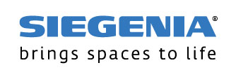

# ioBroker.siegenia

**Этот адаптер использует библиотеки Sentry для автоматического сообщения разработчикам об исключениях и ошибках в коде.** Более подробную информацию, а также инструкции по отключению отправки сообщений об ошибках см. [в документации Sentry-Plugin](https://github.com/ioBroker/plugin-sentry#plugin-sentry) ! Система отчетности Sentry используется начиная с js-controller 3.0.

Этот адаптер обеспечивает поддержку ioBroker для устройств управления климатом и кондиционированием воздуха Siegenia ( <https://www.siegenia.com> ).

Для работы адаптера требуется Nodejs версии не ниже 8.x.

## Набор функций

Данный адаптер поддерживает все современные устройства:

- АЭРОПАК
- АЭРОМАТ VT
- DRIVE axxent DK/MH
- СЕНСОЭЙР
- Атмосфера AEROVITAL
- Семья MHS
- АКС
- АЭРОТРУБКА
- Универсальный модуль
- Модуль преобразователя enOcean
- Обновление VT
- DRIVE CL
- АЭРОПЛУС

Адаптер способен автоматически обнаруживать устройства Siegenia в той же сети, что и ioBroker, и отображать их в административном интерфейсе. После обнаружения вам нужно будет только исправить имя пользователя и пароль. Однако вы также можете ввести IP-адреса и данные для входа вручную.

В объектах отображаются все доступные поля данных обнаруженного устройства, предоставляющие актуальные данные и/или позволяющие изменять данные.

Адаптер отображает таймеры и другие более сложные данные, но изменить их можно только через приложение Siegenia.

## Changelog
### 1.2.1 (2025-11-14)
* (@Apollon77) Add support for enOcean Converter Module, VT Upgrade, DRIVE CL, and AEROPLUS

### 1.1.1 (2021-07-06)
* (thost96/Apollon77) Optimize for js-controller 3.3

### 1.1.0 (2021-01-22)
* (Apollon77) Prevent crash case (Sentry IOBROKER-SIEGENIA-1)
* (Apollon77) js-controller 2.0 is now required at least

### 1.0.1 (2020-12-24)
* (Apollon77) update dependencies
* (Apollon77) disconnect device if authentication was not successful

### 1.0.0
* (Apollon77) initial release

## License
MIT License

Copyright (c) 2019-2025 Apollon77 iobroker@fischer-ka.de

Permission is hereby granted, free of charge, to any person obtaining a copy
of this software and associated documentation files (the "Software"), to deal
in the Software without restriction, including without limitation the rights
to use, copy, modify, merge, publish, distribute, sublicense, and/or sell
copies of the Software, and to permit persons to whom the Software is
furnished to do so, subject to the following conditions:

The above copyright notice and this permission notice shall be included in all
copies or substantial portions of the Software.

THE SOFTWARE IS PROVIDED "AS IS", WITHOUT WARRANTY OF ANY KIND, EXPRESS OR
IMPLIED, INCLUDING BUT NOT LIMITED TO THE WARRANTIES OF MERCHANTABILITY,
FITNESS FOR A PARTICULAR PURPOSE AND NONINFRINGEMENT. IN NO EVENT SHALL THE
AUTHORS OR COPYRIGHT HOLDERS BE LIABLE FOR ANY CLAIM, DAMAGES OR OTHER
LIABILITY, WHETHER IN AN ACTION OF CONTRACT, TORT OR OTHERWISE, ARISING FROM,
OUT OF OR IN CONNECTION WITH THE SOFTWARE OR THE USE OR OTHER DEALINGS IN THE
SOFTWARE.