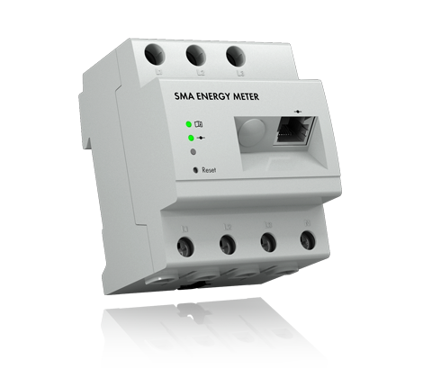

# IoBroker.sma-em

## Адаптер ioBroker для счетчика энергии SMA
**Тесты:** 

### Информация
Этот адаптер считывает информацию со счетчика энергии SMA (EMETER-20) и Sunny Home Manager 2 (HM-20).
Он поддерживает протокол SMA-EMETER-2. Таким образом, также будут работать совместимые счетчики электроэнергии других производителей.

SMA Energy Meter и Sunny Home Manager 2 ежесекундно передают многоадресные дейтаграммы с данными измерения энергии в сеть.
Адаптер счетчика энергии SMA получает эти многоадресные сообщения и сохраняет их как состояния iobroker.
Один экземпляр адаптера SMA Energy Meter Adapter обнаруживает все SMA Energy Meter и Sunny Home Manager во всех подключенных сетях.

### Состояния в нерасширенном режиме
- Мгновенные значения полной потребляемой активной мощности (pregard) и потребляемой активной мощности (psurplus)
- Значения счетчика энергии общего потребления активной мощности (pregardcounter) и подачи активной мощности (psurpluscounter)
- Счетчик тиков времени SMA, временная метка последнего полученного сообщения,
- Серийный номер, SUSyID, версия программного обеспечения SMA Energy Meter и Sunny Home Manager
- Подробные значения для каждой из отдельных фаз L1 / L2 / L3 (опционально):
  - Мгновенные значения потребляемой активной мощности (pregard) и потребляемой активной мощности (psurplus) по фазам
  - Значения счетчика энергии потребляемой активной мощности (pregardcounter) и потребляемой активной мощности (psurpluscounter) по фазам

### Состояния в расширенном режиме
Помимо состояний в нерасширенном режиме, в расширенном режиме доступны следующие значения.

- Мгновенные значения полной потребляемой реактивной мощности (qрасход) и подводимой реактивной мощности (qизб)
- Значения счетчика энергии общего потребления реактивной мощности (qregardcounter) и подаваемой реактивной мощности (qsurpluscounter)
- Мгновенные значения полной полной потребляемой мощности (sучет) и полной потребляемой мощности (sизбыток)
- Значения счетчика энергии общего кажущегося энергопотребления (sregardcounter) и кажущейся потребляемой мощности (ssurpluscounter)
- cosphi (коэффициент мощности)
- частота сети (доступно только с Sunny Home Manager 2, счетчик энергии SMA в настоящее время не предоставляет никаких значений частоты сети)
- Подробно для каждой из отдельных фаз L1/L2/L3 (опционально):
  - Мгновенные значения реактивной и полной потребляемой/вводимой мощности по фазам
  - Значения счетчиков электроэнергии реактивной и полной потребляемой/вводимой мощности по фазам
  - Напряжение и сила тока на фазу

### Параметры конфигурации

- Многоадресный IP-адрес: значение по умолчанию — 239.12.255.254.
- Многоадресный порт: значение по умолчанию для порта UDP — 9522.

  (Оба не должны быть изменены, так как устройства SMA всегда используют этот IP-адрес и порт)

- Детали L1 - L3: эти параметры выбора можно использовать для отображения подробностей каждой фазы.
- Расширенный режим: предоставляет более подробную информацию, такую как реактивная мощность, полная мощность, cosphi, частота сети, напряжение, сила тока.

  (Не настраивайте детали L1-L3 и расширенный режим одновременно, так как это сильно нагружает систему ioBroker)

<!-- Заполнитель для следующей версии (в начале строки):

### __РАБОТА ВЫПОЛНЯЕТСЯ__ -->
## Официальные уведомления
SMA и Sunny Home Manager являются зарегистрированными товарными знаками SMA Solar Technology AG <https://www.sma.de/en.html>

Все другие товарные знаки являются собственностью их соответствующих владельцев.

Авторы никоим образом не одобрены и не связаны с SMA Solar Technology AG или любыми связанными дочерними компаниями, логотипами или товарными знаками.

## Changelog
### 0.6.5 (2022-02-19)

- Updated dependencies
- Compatibility check for js-controller 4.0
- Prevent onUnload warnings

### 0.6.4 (2021-08-19)

- (TGuybrush) Bug fixes
- Prevent warnings regarding non-existent objects upon adapter instance creation and start-up under js-controller 3.2.x
- Improved check of SMA Energy Meter multicast messages to prevent ghost devices and warnings regarding unknown OBIS values.

### 0.6.3 (2021-03-04)

- (TGuybrush) The adapter binds now to all external IPv4 addresses.

### 0.6.1-beta.0 (2021-01-18)

- (TGuybrush) Bug fixes
  - Software Version string, last part is the revision as character (e.g. R = release)
  - Potential Warning during the first start
  - Revised units to follow the SI standardization (DIN 1301)
- (TGuybrush) Top level hierarchy object description indicates if the device is a SMA Energy Meter or a SMA Home Manager 2.
- (DutchmanNL) Released to the latest repo, fixed some typo's + news and translations

### 0.6.0

- (TGuybrush) Fixed wrong status information
  - Complete adapter core rewritten to extract the status values by their OBIS value instead of the absolute position in the received UDP message according to the SMA documentation.
  - Improved compatibility to future new OBIS values
- (TGuybrush) Add additional status information
  - Power grid frequency
  - Time tick counter
  - SMA SUSy ID
  - Software Version

- Add a timestamp for each received status information

## License

The MIT License (MIT)

Copyright (c) 2022 IoBroker-Community

Permission is hereby granted, free of charge, to any person obtaining a copy
of this software and associated documentation files (the "Software"), to deal
in the Software without restriction, including without limitation the rights
to use, copy, modify, merge, publish, distribute, sublicense, and/or sell
copies of the Software, and to permit persons to whom the Software is
furnished to do so, subject to the following conditions:

The above copyright notice and this permission notice shall be included in
all copies or substantial portions of the Software.

THE SOFTWARE IS PROVIDED "AS IS", WITHOUT WARRANTY OF ANY KIND, EXPRESS OR
IMPLIED, INCLUDING BUT NOT LIMITED TO THE WARRANTIES OF MERCHANTABILITY,
FITNESS FOR A PARTICULAR PURPOSE AND NONINFRINGEMENT. IN NO EVENT SHALL THE
AUTHORS OR COPYRIGHT HOLDERS BE LIABLE FOR ANY CLAIM, DAMAGES OR OTHER
LIABILITY, WHETHER IN AN ACTION OF CONTRACT, TORT OR OTHERWISE, ARISING FROM,
OUT OF OR IN CONNECTION WITH THE SOFTWARE OR THE USE OR OTHER DEALINGS IN
THE SOFTWARE.