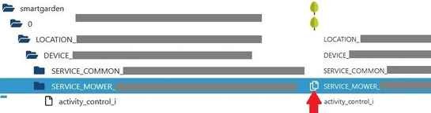

# IoBroker.smartgarden
## Адаптер ioBroker smartgarden для интеллектуальной системы GARDENA
Адаптер для интеллектуальной системы GARDENA с использованием официального [API умной системы GARDENA](https://developer.husqvarnagroup.cloud/apis/GARDENA+smart+system+API#/general) и сервиса.

Адаптер позволяет разработать приложение (например, с VIS), которое можно использовать параллельно с официальным приложением GARDENA. Адаптер и его дополнительные функции не влияют ни на одну из основных функций приложения GARDENA, и наоборот.

Адаптер не является полной заменой приложения GARDENA, а является дополнением для интеграции устройств GARDENA в умный дом с ioBroker.
Наиболее важные действия можно выполнить с помощью адаптера. Оно также дает возможность реализовать ваши собственные идеи, которые невозможны с помощью приложения GARDENA.

## Поддерживаемые устройства
  - Газонокосилки-роботы GARDENA smart SILENO
  - Умное управление поливом GARDENA
  - Умный насос давления GARDENA
  - Умный контроль воды GARDENA
  - Интеллектуальный адаптер питания GARDENA.
  - Умный датчик GARDENA

Дополнительную информацию об устройствах см. в [GARDENA немецкий сайт](https://www.gardena.com/de/produkte/smart/smartsystem/) и [здесь на английском](https://www.gardena.com/uk/products/smart/smart-system/).

## Требования
Для использования этого адаптера вам понадобятся следующие вещи:

1. учетная запись смарт-системы GARDENA.
1. ключ приложения GARDENA
1. Секрет применения GARDENA

Чтобы получить все это, перейдите на портал разработчиков Husqvarna по адресу [https://developer.husqvarnagroup.cloud/](https://developer.husqvarnagroup.cloud/).

Пожалуйста, зарегистрируйтесь или войдите в систему, если у вас уже есть учетная запись, и создайте новое приложение, чтобы получить *ключ приложения* и *секрет приложения*.

На данный момент сайт выглядит так, как показано на следующих скриншотах.

---


Нажмите кнопку **НОВОЕ ПРИЛОЖЕНИЕ**.

---


Отредактируйте форму, указав свои данные. В настоящее время поле *URL-адреса перенаправления* не используется.  Вот почему в настоящее время вы можете ввести любое значение.
Нажмите кнопку **СОЗДАТЬ**.

---


На следующей странице вы получите *ключ приложения* и *секрет приложения*.
Эти значения понадобятся вам для конфигурации экземпляра адаптера.
И вам нужно подключить API

  - API аутентификации ***и***
  - API умной системы GARDENA.

Для этого нажмите кнопку **ПОДКЛЮЧИТЬ НОВЫЙ API** и выберите первый API. И повторите для второго API.

---

**Примечание:**

  - Если у вас уже есть Husqvarna Automower® Connect или

Учетную запись интеллектуальной системы GARDENA, вы можете войти в систему с этой учетной записью и продолжить создание приложения, чтобы получить ключ приложения и секрет приложения.

	---

***И почти наверняка у вас есть учетная запись.*** *Используйте ту же учетную запись, что и для приложения GARDENA, в котором зарегистрированы ваши устройства GARDENA. В противном случае вы не получите доступа к своим устройствам.*

	---

  - Убедитесь, что вы подключили приложение к API.
    - API аутентификации ***и***
	- API умной системы GARDENA.

И, конечно же, вам нужна работающая установка ioBroker (по крайней мере, с использованием пользовательского интерфейса admin5), и у вас должен быть хотя бы один работающий [Умное устройство GARDENA](#supported-devices).

## Оглавление
  * [адаптер ioBroker smartgarden для интеллектуальной системы GARDENA](#iobroker-smartgarden-adapter-for-gardena-smart-system)
  * [Поддерживаемые устройства](#поддерживаемые-устройства)
  * [Требования](#требования)
  * [Оглавление](#оглавление)
  * [Установка](#установка)
  * [Адаптер настройки](#setup-adapter)
  * [Получение поддержки](#getting-support)
  * [Точки данных адаптера](#точки-данных-адаптера)
     * [Общие сведения, которые следует знать о точках данных](#general-things-to-know-about-data-points)
     * [Для SERVICE_MOWER](#for-service_mower)
     * [Для SERVICE_VALVE_SET](#for-service_valve_set)
     * [Для SERVICE_VALVE](#for-service_valve)
     * [Для SERVICE_POWER_SOCKET](#for-service_power_socket)
     * [Для SERVICE_SENSOR](#for-service_sensor)
     * [Для SERVICE_COMMON](#for-service_common)
  * [Ограничения скорости](#rate-limits)
  * [Полив во время кошения запрещен](#Полив-не разрешен во время кошения)
     * [В чем проблема?](#в чём-проблема)
	 * [Что делается?](#что-делается-делается)
	 * [Основное поведение -- ПРЕДУПРЕЖДЕНИЕ](#basic-behaviour----предупреждение)
  * [Пожелания к точкам данных](#Пожелания к точкам данных)
  * [Примечание](#примечание)
  * [Журнал изменений](#журнал изменений)
     * [2.0.1](#201)
     * [2.0.0](#200)
     * [предыдущие версии](#106)
  * [Кредиты](#кредиты)
  * [Лицензия](#лицензия)

## Монтаж
Адаптер доступен

- в npm: установите с помощью `npm install iobroker.smartgarden`
— на GitHub по адресу https://github.com/jpgorganizer/ioBroker.smartgarden.

Описание установки на GitHub доступно [здесь](https://www.iobroker.net/docu/index-235.htm?page_id=5379&lang=de#3_Adapter_aus_eigener_URL_installieren) (немецкий язык).

## Адаптер настройки
1. Установите адаптер
2. Создайте экземпляр адаптера.
3. Проверьте и завершите настройку экземпляра.

   **Если вы измените какое-либо значение этих настроек, перезагрузите адаптер.**

3.1 Изменение ключа приложения и секрета приложения и/или дополнительного имени пользователя и пароля в конфигурации основного экземпляра.

      | Параметр | Описание |
      | - | - |
	  |***обязательно***||
      | Ключ приложения | Ключ приложения (ключ API), например. под [Требования](#requirements) |
	  | либо *секрет приложения*<br> или *имя пользователя и пароль* \*) \*\*)||
      | Секрет приложения \*)| секрет приложения, например. в разделе [Требования](#requirements) - только если *имя пользователя* и *пароль* пусты (новое в версии 2.0.0)*|
      | Секрет приложения \*)| секрет приложения, например. в разделе [Требования](#requirements) - только если *имя пользователя* и *пароль* пусты (новое в версии 2.0.0)*|
	  |***не рекомендуется***||
      | имя пользователя \*) \*\*)| имя пользователя для умной системы GARDENA - только если *секрет приложения* пуст |
      | пароль \*) \*\*)| соответствующий пароль - только если указано *имя пользователя*|

**ПРИМЕЧАНИЯ:** \*)

     - Начиная с версии 2.0.0 **предпочтительной процедурой входа является использование *ключа приложения* и

*секрет приложения***, так как прежняя процедура входа с *имя пользователя* и *пароль* больше не поддерживается Gardena, но, тем не менее, она все еще работает для многих пользователей.
По этой причине он по-прежнему доступен здесь, но в случае ошибки его поддержка больше не поддерживается.
Поэтому рекомендуется использовать *ключ приложения* и *секрет приложения*!

     - *Ключ приложения*, *секрет приложения* и *пароль* зашифрованы и хранятся внутри

     адаптер и просто расшифровывается для аутентификации с помощью хоста приложения GARDENA.

   \*\*)

     - параметр больше не поддерживается и может быть недоступен в будущей версии.

3.2. Проверьте значения по умолчанию для различных настроек и включите/выключите параметры в конфигурации экземпляра. Для большинства пользователей значения по умолчанию подойдут.

      | Параметр | Описание |
      | - | - |
      | прогноз | использовать прогноз времени зарядки и оставшегося времени газонокосилки; включение/выключение прогноза зарядки и времени кошения косилки; по умолчанию: выключено; *(новое в версии 0.5.0)*|
      | циклы | количество циклов истории MOWER; вы можете использовать любое число от 3 (минимум), но 10 (по умолчанию) кажется подходящим значением; актуально только в том случае, если указанный выше *прогноз* включен; *(новое в версии 0.5.0)*|
      | проверка орошения| используйте проверку, разрешен ли полив во время кошения; включить/выключить; по умолчанию: выключено; *(новое в версии 0.6.0)*|
	  | лимит монитора | использовать мониторинг ограничений скорости API интеллектуальной системы Gardena; включить/выключить; по умолчанию: выключено; *(новое в версии 1.0.2)*|

3.3. Проверьте значения системных настроек по умолчанию и включите/выключите параметры в конфигурации экземпляра. **Большинству пользователей не придется ничего менять на этой вкладке.**

      | Параметр | Описание |
      | - | - |
      | Логуровень | Уровень журнала: 0 = нет записей журнала, 1 = некоторые записи журнала, 2 = еще несколько записей журнала, 3 = все записи журнала; по умолчанию: 0 – нет записей в журнале|
      | украсить журнал | сделать идентификаторы состояний короче в журнале; включить/выключить; по умолчанию: включено; *(новое в версии 1.0.5)*|
      | интервал повтора соединения | интервал повторных попыток подключения к веб-сервису Gardena в случае ошибки (в секундах); по умолчанию: 300, минимум: 60; *(новое в версии 1.0.3)*|
      | интервал пинга | Интервал отправки пингов на веб-сервис Gardena (в секундах); по умолчанию: 150, минимум: 1, максимум: 300 |
      | фактор аутентификации | Коэффициент действительности токена аутентификации; по умолчанию: 0,999 |
      | URL-адрес авторизации| URL-адрес хоста аутентификации; по умолчанию: [https://api.authentication.husqvarnagroup.dev](https://api.authentication.husqvarnagroup.dev)|
      | Базовый URL-адрес | Базовый URL-адрес веб-сервиса; по умолчанию: [https://api.smart.gardena.dev](https://api.smart.gardena.dev)|

## Получение поддержки
Чтобы получить помощь, внимательно прочитайте [README](README.md) и [FAQ](FAQ.md).
Если вам нужна дополнительная поддержка, присоединяйтесь к [ветка форума ioBroker](https://forum.iobroker.net/topic/31289/neuer-adapter-smartgarden-adapter-for-gardena-smart-system).

## Точки данных адаптера
Адаптер предназначен для мониторинга и управления устройствами умной системы GARDENA.
Для этого будет один `LOCATION` и один или несколько `DEVICE`.
Для каждого `DEVICE` будет

  - один `SERVICE_COMMON_<id>` и
  - один или несколько `SERVICE_<servicelink_type>_<id>`.

Где `<servicelink_type>` — это описание типа устройства, например MOWER или VALVE, а `<id>` — это (закодированный) идентификатор устройства GARDENA, используемый API.
См. описание ServiceLink на странице [https://developer.husqvarnagroup.cloud/apis/GARDENA+smart+system+API#/swagger](https://developer.husqvarnagroup.cloud/apis/GARDENA+smart+system+API#/swagger).

Управление/мониторинг каждого устройства возможен через `SERVICE_<servicelink_type>`, указанный в следующей таблице. `SERVICE_COMMON` предоставляет общую информацию об устройстве.

  | устройство | SERVICE_<тип_сервисной_ссылки> |
  | - | - |
  | умная роботизированная газонокосилка SILENO | SERVICE_MOWER и SERVICE_COMMON |
  | интеллектуальное управление ирригацией | SERVICE_VALVE_SET, SERVICE_VALVE и SERVICE_COMMON |
  | умный насос давления | SERVICE_VALVE и SERVICE_COMMON |
  | умный контроль воды | SERVICE_VALVE и SERVICE_COMMON |
  | умный адаптер питания | SERVICE_POWER_SOCKET и SERVICE_COMMON |
  | умный датчик | SERVICE_SENSOR и SERVICE_COMMON |

Если вам нужна дополнительная информация о точках данных, ознакомьтесь с [https://developer.husqvarnagroup.cloud/apis/GARDENA+smart+system+API#/swagger](https://developer.husqvarnagroup.cloud/apis/GARDENA+smart+system+API#/swagger).
Там вы найдете описание каждой точки данных; за исключением тех, которые отмечены как точки данных адаптера, а не API интеллектуальной системы GARDENA.

Адаптер создает свои собственные точки данных для различных функций/параметров, когда функция выбрана. Эти точки данных не удаляются автоматически, когда выбор функции отменен. Если вам больше не нужны эти точки данных, их можно удалить вручную.

### Общие сведения о точках данных, которые следует знать
Адаптер не меняет никаких значений, передаваемых API интеллектуальной системы GARDENA.
Единственное, что делается (начиная с версии 1.0.0), это проверяется тип *меток времени* и *цифр*.

| проверить | описание |
| - | - |
| временные метки | все временные метки указаны в формате UTC; если полученная временная метка не является допустимой временной меткой, вместо нее используется `01 Jan 1970 00:00:00Z` (нулевое время Unix). Поэтому, если вы увидите эту дату/время, пожалуйста, сообщите. |
| числа | если число не является допустимым, вместо него используется `-1`.  Поэтому, если вы увидите этот номер, пожалуйста, сообщите. |

Запросы на управление устройством будут успешными, как только интеллектуальный шлюз примет команду. Успешное выполнение команды на самом устройстве можно наблюдать по соответствующему изменению состояния.
*Пример:* отправка команды на запуск службы VALVE интеллектуального управления водой приведет к изменению точки данных `activity_value` после того, как устройство обработает команду.

**Примечания:**

  - Запросы на управление устройством не могут быть отправлены, пока адаптер Smartgarden не подключен.

    подключен к API интеллектуальной системы GARDENA.

  - Убедитесь, что вы установили значение для команды с `ack=false`. См. [главу «Команды и статусы» в Руководстве для разработчиков адаптеров] (https://github.com/ioBroker/ioBroker.docs/blob/master/docs/en/dev/adapterdev.md#commands-and-statuses).

### Для SERVICE_MOWER
#### Контроль
Для управления устройством используйте точку данных

- «activity_control_i»: введите «строка»

  *Эта точка данных генерируется адаптером и не требуется благодаря API интеллектуальной системы GARDENA.*

  Измените эту точку данных, чтобы запустить газонокосилку.

  - Чтобы начать в течение определенного времени, установите значение запланированной продолжительности в

  секунды (пожалуйста, используйте кратные 60; минимум — 60); рассмотрим тип данных `string`

  - для автоматической работы установите строку `START_DONT_OVERRIDE`
  - отменить текущую операцию и вернуться к использованию зарядной станции

  строка `PARK_UNTIL_NEXT_TASK`

  - чтобы отменить текущую операцию, вернитесь на зарядную станцию и проигнорируйте

  использовать в расписании строку `PARK_UNTIL_FURTHER_NOTICE`

  **Примечание.** Газонокосилка запускается только при полностью заряженном аккумуляторе.

#### Мониторинг
Все остальные точки данных предназначены только для мониторинга и информации.

Особые данные:

- `activity_mowing_i`

  *Эта точка данных генерируется адаптером и не требуется благодаря API интеллектуальной системы GARDENA.*

  Эта точка данных показывает два разных состояния газонокосилки:

  - `true`: косить или
  - `ложь`: не косить.

Эту точку данных можно использовать для дальнейших действий, когда важно знать, безопасно ли газонокосилка находится на газоне или нет.

В зависимости от значения точки данных `activity_value` устанавливается эта точка данных.
Подробную информацию см. в следующей таблице.

  | `activity_value` | `activity_mowing_i` |
  |`OK_CHARGING` Газонокосилка должна косить, но недостаточный уровень заряда удерживает ее на зарядной станции. | ложный |
  |`PARKED_TIMER` Газонокосилка припаркована по таймеру и снова запустится в заданное время. | ложный |
  |`PARKED_PARK_SELECTED` Газонокосилка припаркована до дальнейшего уведомления. | ложный |
  |`PARKED_AUTOTIMER` Газонокосилка пропускает стрижку из-за недостаточной высоты травы. | ложный |
  |`PAUSED` Газонокосилка находится в состоянии ожидания с закрытым люком. | ложный |
  |`OK_CUTTING` Косилка косит в режиме АВТО (по расписанию). | правда |
  |`OK_CUTTING_TIMER_OVERRIDDEN` Косилка режет вне графика. | правда |
  |`OK_SEARCHING` Газонокосилка ищет зарядную станцию. | правда |
  |`OK_LEAVING` Газонокосилка покидает зарядную станцию. | правда |
  |`NONE` Никаких действий не происходит, возможно, из-за ошибки. | правда |
  |`NONE` Никаких действий не происходит, возможно, из-за ошибки. | правда |
  |все остальные значения | правда |

- `batteryState_chargingTime_remain_i` *(в разделе SERVICE_COMMON...)* и<br/>

`activity_mowingTime_remain_i` *(в разделе SERVICE_MOWER...)*

  *Обе точки данных генерируются адаптером и не требуются благодаря API интеллектуальной системы GARDENA.*

Эти точки данных показывают прогноз оставшегося времени зарядки и кошения газонокосилки в секундах.
Они создаются только тогда, когда функция выбрана в конфигурации экземпляра.

Для прогнозирования значения история последних нескольких циклов зарядки и кошения сохраняется в двух состояниях: `info.saveMowingHistory` и `info.saveChargingHistory`.

Эту функцию можно включать и выключать в конфигурации экземпляра адаптера вместе с количеством сохраненных циклов зарядки и кошения в истории.

Чтобы запустить эту функцию, **убедитесь, что хотя бы один цикл кошения и зарядки проходит без ошибок (например, не прерывается вручную или сенсорным управлением).** Лучше, если хотя бы три цикла будут выполнены без ошибок.
Эта функция пытается распознать нормальный случай и изначально предполагает, что следующий процесс является нормальным. Если это неисправно, то этот ошибочный прогон рассматривается как нормальный случай, а последующие прогоны считаются неисправными. Если во время запуска возникла ошибка, остановите адаптер, удалите две точки данных и начните заново.

Дополнительную информацию об общих механизмах прогнозирования см. в [ПРОГНОЗ.md](FORECAST.md).

  **Примечания:**

    1. Значения прогноза доступны только при наличии хотя бы одного полного

	Цикл зарядки и кошения сохраняется в истории.

    2. История сохраняется в разделе «Информация», поэтому при необходимости «Местоположение»

	удалить, например в случае будущего обновления он не теряется.

    3. Если вы отключите газонокосилку от интеллектуальной системы GARDENA и

подключите его еще раз, история будет потеряна, поскольку ваша газонокосилка получит новый идентификатор в интеллектуальной системе GARDENA. Это значит, что адаптер не может распознать косилку как предыдущую – возможно, это вторая.
В этом случае рекомендуется удалить эти две точки данных и перезапустить адаптер, чтобы предыдущие (теперь старые) наборы истории не читались и не записывались постоянно. Затем адаптер начинает создавать новую историю.

	4. Эта функция должна работать более чем на одной газонокосилке, но это не так.

не проверял *(не могу, т. к. косилка у меня одна)*.
Если у вас более одной газонокосилки, протестируйте и сообщите об ошибках и, конечно же, сообщите, работает ли она должным образом. Заранее спасибо за это.

- `lastErrorCode_value`

Обратите особое внимание на точку данных `lastErrorCode_value`.
Описание возможных значений можно найти по адресу https://developer.husqvarnagroup.cloud/apis/GARDENA+smart+system+API#/swagger, см. «MowerService — LastErrorCode».

### Для SERVICE_VALVE_SET
#### Контроль
Для управления устройством используйте точку данных

- `stop_all_valves_i`: введите `string`

  *Эта точка данных генерируется адаптером и не требуется благодаря API интеллектуальной системы GARDENA.*

  Измените эту точку данных, чтобы остановить все клапаны.

  - Чтобы немедленно остановить все клапаны, используйте строку `STOP_UNTIL_NEXT_TASK`

**Примечание.** Не отображайте значение этой точки данных в своем приложении, поскольку оно в большинстве случаев не определено. Более того, эта точка данных не может служить триггером для ваших собственных действий, поскольку ей присваивается значение *null* только после запуска команды.

#### Мониторинг
Все остальные точки данных предназначены только для мониторинга и информации.

### Для SERVICE_VALVE
#### Контроль
Для управления устройством используйте точку данных

- `duration_value`: введите `string`

  Измените эту точку данных, чтобы запустить клапан.

  - Чтобы начать в течение определенного времени, установите значение в секундах.

  (пожалуйста, используйте число, кратное 60; минимум — 60); рассмотрим тип данных `string`.

**Примечание.** Допустимые значения имеют некоторые ограничения.
Пожалуйста, сообщите, если вы видите другие ограничения.

    | устройство | предел |
    | - | - |
    |GARDENA интеллектуальное управление поливом| 5400 секунд (90 минут) |
    |GARDENA умный насос | 36000 (10 часов) |
    |GARDENA умный контроль воды | 36000 (10 часов) |

  - Чтобы отменить текущий полив и продолжить работу по расписанию, используйте строку

  `STOP_UNTIL_NEXT_TASK`

  - Чтобы пропустить автоматическую операцию до указанного времени, активная в данный момент

операция может быть отменена, а может и не быть отменена (зависит от модели устройства) используйте строку `PAUSE_<number_of_seconds>`, например. `PAUSE_86400` для паузы на 24 часа (пожалуйста, используйте кратное 60; минимум — 60)

  - Чтобы восстановить автоматическую работу, если она была приостановлена, используйте строку `UNPAUSE`

- `irrigationWhileMowing_allowed_i` и `irrigationWhileMowing_mowerDefinition_i`

  *Эти данные генерируются адаптером и не требуются благодаря API интеллектуальной системы GARDENA.*

Эти точки данных дают контроль над функцией *Орошение во время кошения запрещено*.
Они создаются только тогда, когда функция выбрана в конфигурации экземпляра.
Описание этой функции см. в главе [Во время скашивания полив запрещен.](#Irrigation-not-allowed-while-mowing).

#### Мониторинг
Все остальные точки данных предназначены только для мониторинга и информации.

Специальная точка данных:

- `duration_leftover_i`

  *Эта точка данных генерируется адаптером и не требуется благодаря API интеллектуальной системы GARDENA.*

Значение описывает количество минут до закрытия клапана и прекращения полива.

    - Целое число, один («1») или более.
    - `null`, если не определено

### Для SERVICE_POWER_SOCKET
#### Контроль
Для управления устройством используйте точку данных

- `duration_value`: введите `string`

  Измените эту точку данных, чтобы запустить розетку.

  - Чтобы начать в течение определенного времени, установите значение в секундах.

  (пожалуйста, используйте число, кратное 60; минимум — 60); рассмотрим тип данных `string`

  - Чтобы включить устройство навсегда, используйте строку `START_OVERRIDE`.
  - Чтобы остановить устройство, используйте STOP_UNTIL_NEXT_TASK.
  - Пропустить автоматическую операцию до указанного времени. Текущая активная операция

НЕ будет отменено. Используйте строку `PAUSE_<number_of_seconds>`, например. `PAUSE_86400` для паузы на 24 часа (пожалуйста, используйте кратное 60; минимум — 60)

  - Чтобы восстановить автоматическую работу, если она была приостановлена, используйте строку `UNPAUSE`

#### Мониторинг
Все остальные точки данных предназначены только для мониторинга и информации.

Специальная точка данных:

- `duration_leftover_i`

  *Эта точка данных генерируется адаптером и не требуется благодаря API интеллектуальной системы GARDENA.*

  Значение описывает количество минут до отключения розетки.

    - Целое число, один («1») или более.
    - `null`, если не определено

### Для SERVICE_SENSOR
#### Контроль
Функции управления отсутствуют.

#### Мониторинг
Все точки данных предназначены только для мониторинга и информации.

### Для SERVICE_COMMON
`SERVICE_COMMON` предоставляет общую информацию об устройстве.
Описание интегрируется в описание других УСЛУГ_... там, где это необходимо.

## Ограничения скорости
Есть некоторые ограничения, о которых вам следует знать.
См. главу *Ограничения скорости* в [*ПРОЧТИ МЕНЯ*](https://developer.husqvarnagroup.cloud/apis/GARDENA+smart+system+API#/readme) описания API интеллектуальной системы GARDENA.

Чтобы помочь вам увидеть, достигли ли вы этих пределов скорости, вы можете включить мониторинг в конфигурации экземпляра с помощью параметра *monitoring Rate Limits*.

Если вы включили мониторинг, состояние `info.RateLimitCounter` актуализируется при каждом запросе.
В этом состоянии сохраняется структура данных с количеством запросов за месяц, день, час и за последние 30 и 31 день.

Структура находится в [JSON](https://en.wikipedia.org/wiki/JSON) и выглядит так:

```
{
  "2020": {                          <<< year
    "2020-08": {                     <<< month
      "count": 21,                   <<< number of requests for month
      "2020-08-27": {                <<< day
        "11": {                      <<< hour
          "count": 3                 <<< number of requests for hour
        },
        "12": {                      <<< hour
          "count": 13                <<< number of requests for hour
        },
        "count": 16                  <<< number of requests for day
      },
      "2020-08-28": {                <<< day
        "14": {                      <<< hour
          "count": 5                 <<< number of requests for hour
        },
        "count": 5                   <<< number of requests for day
      }
    }
  },
     ...
  "last30days": {
    "count": 2021                    <<< number of requests in last 30 days
  },
  "last31days": {
    "count": 2098                    <<< number of requests in last 31 days
  }
}
```

**Примечание:**

  - Этот час соответствует времени в формате UTC.
  - Что фактическое количество запросов может быть выше. Особенно как

  до тех пор, пока соответствующий период не будет полностью охвачен мониторингом.

  - Эта структура становится очень большой и никогда не удаляется

адаптер. Поэтому время от времени удаляйте его вручную или отключайте мониторинг — по крайней мере, если у вас нет проблем с лимитами скорости.

## Во время скашивания полив запрещен.
### В чем проблема?
Если у вас есть и газонокосилка, и оросительная система с выдвижными разбрызгивателями, существует риск того, что ваша газонокосилка столкнется с выдвижным разбрызгивателем во время орошения и повредит его или сама причинит ущерб.

Чтобы этого не произошло, во время кошения газонокосилкой следует отключать систему орошения, а лучше отдельные клапаны.

### Что делается?
С помощью этой функции можно остановить полив, когда газонокосилка находится на газоне. Это можно определить отдельно для каждого клапана.

Для каждого клапана можно определить одну или несколько косилок, при этом клапан не может быть открыт во время кошения газонокосилкой.
По сути, газонокосилка имеет приоритет над поливом, т.е. если возникает конфликт, что косилка косит, а клапан открыт, то клапан закрывается и выдается соответствующее предупреждение.

Дополнительно можно определить, что клапан никогда не должен открываться независимо от газонокосилки. Например. можно использовать, если клапан или труба за ним повреждены.

Всю проверку можно включить или отключить в конфигурации экземпляра с помощью параметра *проверка ирригации*.

Для каждого `SERVICE_VALVE` доступны три точки данных.
Они используются для настройки и сообщения о предупреждениях.

  | точка данных | записываемый | Описание точек данных |
  | - | - | - |
  |`irrigationWhileMowing_allowed_i` | да |установите значение `false`, если необходимо проверить, разрешен ли полив во время стрижки газона газонокосилкой, `true` в противном случае |
  |`irrigationWhileMowing_warningCode_i`| нет | Код предупреждения устанавливается, если клапан открывается. Возможные коды предупреждений см. в следующей таблице. Если установлено более одного предупреждения, коды объединяются с `+` (например, `STOPPED+UNKNOWN_MOWER`).|
  |`irrigationWhileMowing_warningCode_i`| нет | Код предупреждения устанавливается, если клапан открывается. Возможные коды предупреждений см. в следующей таблице. Если установлено более одного предупреждения, коды объединяются с помощью `+` (например, `STOPPED+UNKNOWN_MOWER`).|

* ***формат идентификатора газонокосилки***

  `smartgarden.0.LOCATION_xxxxxxxx-xxxxxx-xxxxxx-xxxxxx-xxxxxxxxxxxxxx.DEVICE_xxxxxxxx-xxxxxx-xxxxxx-xxxxxx-xxxxxxxxxxxxxx.SERVICE_MOWER_xxxxxxxx-xxxxxx-xxxxxx-xxxxxxxxxxxxxxxxxxxxx`

Вы можете скопировать этот идентификатор газонокосилки со вкладки объектов ioBroker, см. красную стрелку на следующем рисунке.

    

* ***коды предупреждений***

  | код предупреждения | описание|
  | - | - |
  |  `NO_WARNING` |нет предупреждения, клапан открыт |
  |  `STOPPED` |клапан автоматически закрывается, поскольку газонокосилка косит |
  |  `FORBIDDEN` |клапан закрыт, поскольку в точке данных `irrigationWhileMowing_mowerDefinition_i` установлен специальный код `IRRIGATION_FORBIDDEN`|
  |  `ЗАПРЕЩЕНО` |клапан закрыт, поскольку в точке данных `irrigationWhileMowing_mowerDefinition_i` установлен специальный код `IRRIGATION_FORBIDDEN`|

Эта функция запускается каждый раз, когда

- клапан открывается или
- косилка начинает косить

Он не запускается, когда вы меняете значения в точках данных, перечисленных выше.
Это означает: если возникла конфликтная ситуация и вы измените `irrigationWhileMowing_allowed_i` с `true` на `false`, конфликт не распознается и конфликт продолжится. То же самое относится и к изменению `irrigationWhileMowing_mowerDefinition_i`.

### Основное поведение — ПРЕДУПРЕЖДЕНИЕ
Эта функция не может предотвратить открытие клапана во время кошения газонокосилкой. Например. это можно сделать вручную через приложение GARDENA или автоматически по расписанию.

Эта функция позволяет закрыть клапан только как можно быстрее в случае конфликта. И конфликт тоже можно не признать.
Так что может случиться так, что вода будет пропущена.
**Например. невозможно предотвратить выдвижение выдвижных разбрызгивателей и попадание газонокосилки в выдвижные разбрызгиватели**, но вероятность того, что это произойдет, сведена к минимуму.
**Поэтому ваше приложение должно гарантировать, что этот конфликт никогда не произойдет.**

## Пожелания по датам
Этот адаптер сообщает **каждое значение** как точку данных, которая предоставляется через API интеллектуальной системы GARDENA. Если кому-то нужны дополнительные значения, свяжитесь с GARDENA и сообщите, что это значение также будет включено в API. Для этого перейдите по ссылке ***Свяжитесь с нами и оставьте отзыв*** в нижнем колонтитуле [Портал разработчиков GARDENA](https://developer.husqvarnagroup.cloud).

## Примечание
Это частный проект. Я не состою в каком-либо сотрудничестве с GARDENA или Husqvarna.

## Кредиты
Большое спасибо GARDENA/Husqvarna за предоставление [общедоступный API](https://developer.husqvarnagroup.cloud/apis/GARDENA+smart+system+API#/general) и особую благодарность вашей команде поддержки за очень хорошую и быструю поддержку.

Логотип smartgarden: http://www.freepik.com Разработано Freepik

## Changelog
### 2.0.1
* (jpgorganizer) 2024-May-25
  - fixed warning `smartgarden has an invalid jsonConfig`, e.g. 
  [Issue 72](https://github.com/jpgorganizer/ioBroker.smartgarden/issues/72)
  - fixed [Issue 64](https://github.com/jpgorganizer/ioBroker.smartgarden/issues/64)
    `Connection == true` when adapter is stopped
  - Fix comparison with `NaN` in api.js, e.g. [Pull request 67](https://github.com/jpgorganizer/ioBroker.smartgarden/pull/67)
  - some further minor changes

### 2.0.0
* (jpgorganizer) 2022-Jun-13
  - support for new login procedure to Gardena webservice: using *Application secret* and *Application key* 
    instead of *username* and *password*. 
    [Issue 47](https://github.com/jpgorganizer/ioBroker.smartgarden/issues/47)
  
    Procedure with *username* and *password* is still available, as it's still working for some users.
	
    **TODO** for all existing users: please re-enter your login data, even if you will still use *username* and *password*!
  - **support for admin4 UI removed; at least admin5 is needed!**
  - new configuration page
  - function and configuration parameter `pre-define states` removed. All Gardena data points get deleted and created again.
  - documentation has been adjusted


### 1.0.6
* (jpgorganizer) 2022-May-04
  - some minor changes in documentation, including [Issue 41](https://github.com/jpgorganizer/ioBroker.smartgarden/issues/41)
and new limit for SERVICE_VALVE (just smart Irrigation Control)
  - bug fix in error handling
  - changes due to new Gardena API v1.1.0
  - necessary changes due to changed behavior Gardena Service [Issue 43](https://github.com/jpgorganizer/ioBroker.smartgarden/issues/43)
  - tests against js-controller 4.x, [Issue 40](https://github.com/jpgorganizer/ioBroker.smartgarden/issues/40)
  
### 1.0.5
* (jpgorganizer) 2021-May-13
  - necessary adjustments due to js-controller v3.3; e.g. [Issue 29](https://github.com/jpgorganizer/ioBroker.smartgarden/issues/29)
    - nearly all data points get deleted and created again with intended role/unit
    - data types for following data points changed from `string` to `number`: 
	  - for all devices: `rfLinkLevel_value` 
      - for mower: `batteryLevel_value`, `operatingHours_value` 
      - for sensor: `batteryLevel_value`, `soilHumidity_value`, `soilTemperature_value`, `lightIntensity_value`, `ambientTemperature_value`
  - compatibility test with node.js v14 and node.js v16 and added to Travis CI test; 
    compatibility test with the upcoming Admin 5 React UI;
    e.g. [Issue 30](https://github.com/jpgorganizer/ioBroker.smartgarden/issues/30)
  - new parameter *beautify log* in instance configuration; makes state ids a little bit shorter in log if switched on

### 1.0.4
* (jpgorganizer) 2021-Feb-22
  - necessary adjustments due to js-controller v3.2
  - option `useTestVariable` in adapter/instance configuration removed

### 1.0.3
* (jpgorganizer) 2021-Jan-26
  - improved error handling
  - new parameter `connection retry interval`
  - axios vulnerability solved, using version `>=0.21.1`
  
### 1.0.2
* (jpgorganizer) 2020-Aug-30
  - monitoring rate limits, see chapter [Rate Limits](#rate-limits) and discussion at 
  [Issue 18](https://github.com/jpgorganizer/ioBroker.smartgarden/issues/18)


### 1.0.1
* (jpgorganizer) 2020-Aug-17
  - better reconnection to GARDENA smart system server in case of your internet connection was broken
  - textual changes in io-package.json
  - improved README and FAQ
  
### 1.0.0
* (jpgorganizer) 2020-Jun-13
  - code rework, no functional change expected
  - support `PAUSE` for SERVICE_VALVE, SERVICE_POWER_SOCKET. e.g. 
	[Issue 14](https://github.com/jpgorganizer/ioBroker.smartgarden/issues/14)
  - internal representation for all timestamps changed from format like 
    `2020-05-26T05:03:47.613+0000` to `2020-05-26T05:03:47.613Z` to 
    support Safari browser e.g. 
	[Issue 12](https://github.com/jpgorganizer/ioBroker.smartgarden/issues/12).
  - support forecast values for mower id's in format with suffix, 
    e.g. `d8a1faef-2ee3-421d-a3f8-f8ed577c2ad3:suffix`, e.g. 
	[Issue 12](https://github.com/jpgorganizer/ioBroker.smartgarden/issues/12)
  - making the adapter more fault tolerant at startup, e.g. trimming 
    whitespaces from username, etc.
  - README: new chapter *Getting support*, 
  - README: chapter *Known Errors* deleted, should be resolved by GARDENA 
  - README: links to GARDENA/Husqvarna developer portal adjusted to the new address

### 0.6.0
* (jpgorganizer) 2020-May-03
  - new feature *Irrigation not allowed while mowing*, 
    for detailed description see 
	[Irrigation not allowed while mowing](#Irrigation-not-allowed-while-mowing); 
    e.g. 
	[Issue 5](https://github.com/jpgorganizer/ioBroker.smartgarden/issues/5)
  - rework instance config dialog
  - improvement of documentation

### 0.5.1
* (jpgorganizer) 2020-Apr-26
  - some corrections (sensor, typo)
  - integration of travis-ci
  
### 0.5.0
* (jpgorganizer)  2020-Apr-25
  - MOWER: forecast for remaining charging time and remaining mowing time 
  integrated, e.g. [Issue 1](https://github.com/jpgorganizer/ioBroker.smartgarden/issues/1)
  - **IMPORTANT CHANGE** for existing users: the id for LOCATION, all 
    DEVICE's and all SERVICE's has changed due to support of History adapter. 
	(History adapter cannot handle id's with `%` (percent) character 
	within id's, although the `%` is not forbidden in id's in ioBroker), e.g. 
	[Issue 8](https://github.com/jpgorganizer/ioBroker.smartgarden/issues/8). 
  
    So you **must delete all states** of the adapter instance to 
    install this release and please check your application carefully for 
    necessary adjustments regarding the change of the id names.

  - devices *Water Control* and *Smart Pump* tested (many thanks to user 
    gammler2003 and xengosam at 
    [ioBroker Forum](https://forum.iobroker.net/topic/31289/neuer-adapter-smartgarden-adapter-for-gardena-smart-system/) for testing)
  - some code rework and improvement of documentation
  - dependency corrected, important for js-controller v3, e.g. 
    [Issue 7](https://github.com/jpgorganizer/ioBroker.smartgarden/issues/7)
  - adapter now available at npm
  
### 0.4.2
* (jpgorganizer) 2020-Apr-01
  - error *missing SENSOR data* fixed (many thanks to user dslraser and 
  muckel at 
  [ioBroker Forum](https://forum.iobroker.net/topic/31289/neuer-adapter-smartgarden-adapter-for-gardena-smart-system/) for testing)

### 0.4.1
* (jpgorganizer) 2020-Mar-31
  - Dependency get's resolved now
  
### 0.4.0 
* (jpgorganizer) 2020-Mar-31
  - **NOTE:** with this version an additional dependency is necessary at runtime. 
  If it does not get installed together with the installation of this adapter, 
  please install seperately with 
  `npm install https://github.com/jpgorganizer/ioBroker.utils` or 
  `npm i @jpgorganizer/utils`
  - **NOTE:** you **must delete all states** of the adapter instance to 
  install this release and please check your application carefully for 
  necessary adjustments regarding type/role changes (see below) 
  - data types of (nearly) all data points adjusted for compliance with 
  ioBroker guidance: 
    * states now have special ioBroker type and role instead of former 
	`string`/`text` where applicable, e.g. `number`/`value.battery` for 
	`batteryLevel_value`, see 
	[Issue 3](https://github.com/jpgorganizer/ioBroker.smartgarden/issues/3)
  - data point `activity_value_i` replaced by `activity_mowing_i` with 
    type/role `boolean`/`indicator.working`: `true` means *mowing*, `false` 
  means *not mowing*
  - possibility to pre-define states integrated, see new switch 
  `PreDefine States` in adapter/instance configuration, see 
  [Issue 2](https://github.com/jpgorganizer/ioBroker.smartgarden/issues/2)
  - states are readonly now; except states for commands, see 
  [Issue 4](https://github.com/jpgorganizer/ioBroker.smartgarden/issues/4)
  - input field for `useTestVariable` in adapter/instance configuration 
  switched to a *checkbox* (former: *text*); please check your settings
  - error in command  `stop_all_valves_i` in VALVE_SET fixed
  
### 0.3.0
* (jpgorganizer) 2020-Mar-25
  - create all states read/write 
  - error TypeError: Cannot read property 'val' of null with useTestVariable 
  fixed


### 0.2.0
* (jpgorganizer) 2020-Mar-24
  - **IMPORTANT** : data point for MOWER control (command) changed from  
  `duration_value` to `activity_control_i`
  - rework leftovertimer 
  - improved error handling
  - improved logging (see  loglevel in adapter configurations)

### 0.0.1 
* (jpgorganizer) 2020-Mar-01
  - initial release

## License

Copyright (c) 2020 - 2024 jpgorganizer, https://github.com/jpgorganizer 

smartgarden by jpgorganizer is licensed under a 
Creative Commons Attribution-NonCommercial-ShareAlike 4.0 International License 
[(CC-BY-NC-SA-4.0)](https://creativecommons.org/licenses/by-nc-sa/4.0/) 
Based on a work at https://github.com/jpgorganizer/ioBroker.smartgarden. 
 

<!--- SVN: $Rev: 3209 $ $Date: 2024-05-25 12:16:16 +0200 (Sa, 25 Mai 2024) $ --->
