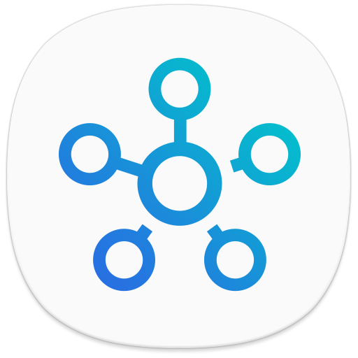

# ioBroker.smartthings

## Адаптер SmartThings для ioBroker

Адаптер для Samsung Smartthings

## Процесс входа в систему:

Откройте ссылку в настройках адаптера и войдите в систему, пока не увидите белый экран. Откройте консоль разработчика (F12 или Option + Command + I), скопируйте синий URL-адрес samsungconnect:// и вставьте его в настройки.

## Контроль

Для параметра smartthings.0.id.capabilities либо установите значение true, либо задайте предопределенное значение.

## Обсуждение и вопросы:

<https://forum.iobroker.net/topic/48091/test-adapter-samsung-smartthings-v-0-0-x>

## Changelog
### 0.3.0 (2026-01-31)
- optimize cpu usage

### 0.2.2 (2025-02-11)

- add new login process

### 0.1.2 (2024-05-19)

- Update Dependencies

- 0.1.0 Added object excluding to reduce cpu usage

- 0.0.4 Reduced cpu load while writing states

- 0.0.3 (TA2k) initial release

## License

MIT License

Copyright (c) 2021-2030 TA2k <tombox2020@gmail.com>

Permission is hereby granted, free of charge, to any person obtaining a copy
of this software and associated documentation files (the "Software"), to deal
in the Software without restriction, including without limitation the rights
to use, copy, modify, merge, publish, distribute, sublicense, and/or sell
copies of the Software, and to permit persons to whom the Software is
furnished to do so, subject to the following conditions:

The above copyright notice and this permission notice shall be included in all
copies or substantial portions of the Software.

THE SOFTWARE IS PROVIDED "AS IS", WITHOUT WARRANTY OF ANY KIND, EXPRESS OR
IMPLIED, INCLUDING BUT NOT LIMITED TO THE WARRANTIES OF MERCHANTABILITY,
FITNESS FOR A PARTICULAR PURPOSE AND NONINFRINGEMENT. IN NO EVENT SHALL THE
AUTHORS OR COPYRIGHT HOLDERS BE LIABLE FOR ANY CLAIM, DAMAGES OR OTHER
LIABILITY, WHETHER IN AN ACTION OF CONTRACT, TORT OR OTHERWISE, ARISING FROM,
OUT OF OR IN CONNECTION WITH THE SOFTWARE OR THE USE OR OTHER DEALINGS IN THE
SOFTWARE.