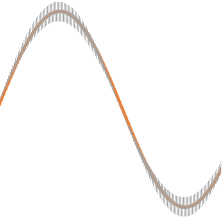

# IoBroker.smoothed

## Сглаженный адаптер для ioBroker
Этот адаптер позволяет легко выбирать некоторые значки для сглаживания в соответствии с выбранным алгоритмом и временем сглаживания (время фильтрации).
Вы можете выбрать один идентификатор несколько раз, чтобы сгладить его в разных алгоритмах и/или временах.
Назначением является идентификатор в каталоге флажера, который доставляет вам сглаженные значения.
Вы можете ограничить минимальные или максимальные значения.
Ограничьте количество десятичных знаков.
Или игнорируйте значения с высоким стандартным отклонением.

## Changelog
<!--
	Placeholder for the next version (at the beginning of the line):
	### **WORK IN PROGRESS**
-->
### 0.5.0 (2024-02-28)
* (Ben1983) do some changes in Readme and checking for vorbidden chars

### 0.4.3 (2024-02-20)
* (Ben1983) set Name of accordion content

### 0.4.2 (2023-12-23)
* (Ben1983) logging of actual ignered value improoved

### 0.4.1 (2023-12-23)
* (Ben1983) add standard deviation into last array

### 0.4.0 (2023-12-23)
* (Ben1983) calculation and limitation for changes with standard diviation

### 0.3.0 (2023-12-22)
* (Ben1983) functions outsourced in lib/modules

### 0.2.0 (2023-12-21)
* (Ben1983) lowpassfilter added to calculation type

### 0.1.0 (2023-12-20)
* (Ben1983) initial release

## License
MIT License

Copyright (c) 2024 Ben1983 <bsahrdt@gmail.com>

Permission is hereby granted, free of charge, to any person obtaining a copy
of this software and associated documentation files (the "Software"), to deal
in the Software without restriction, including without limitation the rights
to use, copy, modify, merge, publish, distribute, sublicense, and/or sell
copies of the Software, and to permit persons to whom the Software is
furnished to do so, subject to the following conditions:

The above copyright notice and this permission notice shall be included in all
copies or substantial portions of the Software.

THE SOFTWARE IS PROVIDED "AS IS", WITHOUT WARRANTY OF ANY KIND, EXPRESS OR
IMPLIED, INCLUDING BUT NOT LIMITED TO THE WARRANTIES OF MERCHANTABILITY,
FITNESS FOR A PARTICULAR PURPOSE AND NONINFRINGEMENT. IN NO EVENT SHALL THE
AUTHORS OR COPYRIGHT HOLDERS BE LIABLE FOR ANY CLAIM, DAMAGES OR OTHER
LIABILITY, WHETHER IN AN ACTION OF CONTRACT, TORT OR OTHERWISE, ARISING FROM,
OUT OF OR IN CONNECTION WITH THE SOFTWARE OR THE USE OR OTHER DEALINGS IN THE
SOFTWARE.
