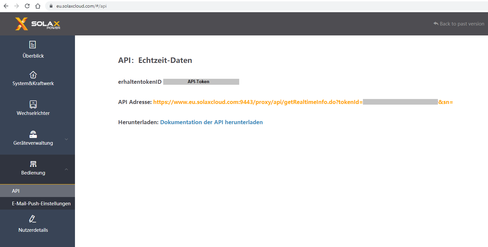

# IoBroker.solax

**************************************************************************************************************

**Если вам это нравится, рассмотрите пожертвование:**

[![PayPal] (https://www.paypalobjects.com/en_US/DK/i/btn/btn_donateCC_LG.gif)](https://www.paypal.com/cgi-bin/webscr?cmd=_s-xclick&hosted_button_id=Q4EEXQ6U96ZTQ&source=url)

**************************************************************************************************************

## Адаптер solax для ioBroker
Подключение к облаку API-интерфейса Solax Inverter

Этот адаптер вызывает данные вашего инвертора от производителя Solax в iobroker.

Для этого вам нужна учетная запись в Solax, ваш идентификатор токена и серийный номер вашего WiFi-модуля.

### Ваш API-токен

### Ваш серийный номер

**************************************************************************************************************

### Что такое Sentry.io и что сообщается серверам этой компании?
Sentry.io — это сервис для разработчиков, позволяющий получить обзор ошибок их приложений. И именно это реализовано в данном адаптере.

Когда адаптер выходит из строя или возникает другая ошибка кода, это сообщение об ошибке, которое также появляется в журнале ioBroker, отправляется в Sentry. Когда вы разрешаете iobroker GmbH собирать диагностические данные, также включается ваш идентификатор установки (это просто уникальный идентификатор **без** какой-либо дополнительной информации о вас, электронной почте, имени и т. д.). Это позволяет Sentry группировать ошибки и показывать, сколько уникальных пользователей затронуто такой ошибкой. Все это помогает мне создавать безошибочные адаптеры, которые практически никогда не дают сбоев.

**************************************************************************************************************

## Changelog
<!-- ### __WORK IN PROGRESS__ -->

### __WORK IN PROGRESS__
* (simatec) local request for Wifi Pocket Stick added
* (simatec) Dependencies updated
* (simatec) test and release updated
* (simatec) Number of days of history data added
* (simatec) Expert-Mode added
* (simatec) Docu updated
* (simatec) Bugfixes

### 0.3.7 (2021-11-17)
* (simatec) Dependencies updated
* (simatec) test and release updated

### 0.3.6 (2021-08-04)
* (simatec) deps fixed

### 0.3.5 (31.07.2021)
* (simatec) await/async functions fixed

### 0.3.4 (30.07.2021)
* (simatec) code cleanig
* (simatec) await functions fixed

### 0.3.3 (29.07.2021)
* (simatec) Formatted objects
* (simatec) await functions fixed
* (simatec) query interval changed
* (simatec) Dependencies updated

### 0.3.2 (28.07.2021)
* (simatec) fix for latest repo

### 0.3.1 (11.06.2021)
* (simatec) fix for latest repo
* (simatec) API-Token encrypted

### 0.3.0 (09.06.2021)
* (simatec) state settings changed
* (simatec) sentry plugin added
* (simatec) readme added
* (simatec) sunposition added
* (simatec) nightmode added

### 0.2.0 (07.06.2021)
* (simatec) powerdc 1-4 added
* (simatec) battPower added
* (simatec) many small bugfixes

### 0.1.1 (02.06.2021)
* (simatec) small Bugfixes

### 0.1.0 (02.06.2021)
* (simatec) first beta

## License
MIT License

Copyright (c) 2021 - 2022 simatec

Permission is hereby granted, free of charge, to any person obtaining a copy
of this software and associated documentation files (the "Software"), to deal
in the Software without restriction, including without limitation the rights
to use, copy, modify, merge, publish, distribute, sublicense, and/or sell
copies of the Software, and to permit persons to whom the Software is
furnished to do so, subject to the following conditions:

The above copyright notice and this permission notice shall be included in all
copies or substantial portions of the Software.

THE SOFTWARE IS PROVIDED "AS IS", WITHOUT WARRANTY OF ANY KIND, EXPRESS OR
IMPLIED, INCLUDING BUT NOT LIMITED TO THE WARRANTIES OF MERCHANTABILITY,
FITNESS FOR A PARTICULAR PURPOSE AND NONINFRINGEMENT. IN NO EVENT SHALL THE
AUTHORS OR COPYRIGHT HOLDERS BE LIABLE FOR ANY CLAIM, DAMAGES OR OTHER
LIABILITY, WHETHER IN AN ACTION OF CONTRACT, TORT OR OTHERWISE, ARISING FROM,
OUT OF OR IN CONNECTION WITH THE SOFTWARE OR THE USE OR OTHER DEALINGS IN THE
SOFTWARE.