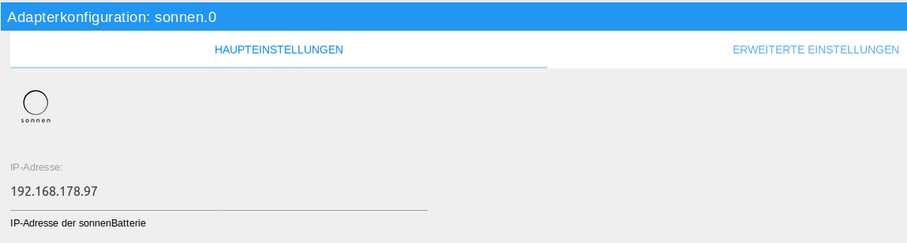
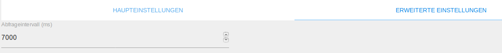
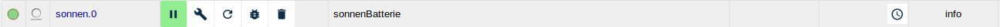
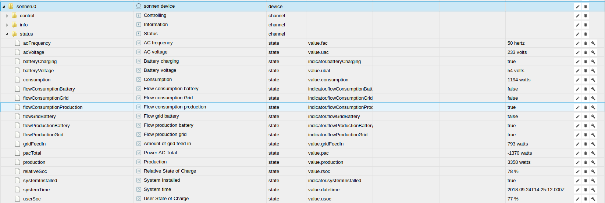

# солнечный адаптер

Адаптер sonnen позволяет интегрировать аккумулятор sonnenBatterie в ioBroker.

## обзор

### sonnenBatterie

С помощью sonnenBatterie вырабатываемая вами энергия от солнечных панелей может храниться для вашего собственного потребления и использоваться именно тогда, когда это необходимо. Это позволяет стать независимым от анонимных энергетических компаний и обеспечить себя электроэнергией самостоятельно. Благодаря встроенному менеджеру энергии, интеллектуальная высокотехнологичная система хранения энергии обеспечивает максимально эффективное снабжение вашего дома собственной электроэнергией. Это не только экономично, но и экологично! sonnenBatterie доступна в различных гибких вариантах хранения.

### солнечный адаптер

Адаптер sonnen позволяет отслеживать и контролировать работу аккумулятора sonnenBatterie в сети. С помощью адаптера обнаружения (TODO: ссылка) аккумуляторы sonnenBatterie в сети могут обнаруживаться автоматически.<br/> Адаптер создает состояния для мониторинга и управления батареей sonnenBatterie в виде объектов. Большинство состояний предназначены исключительно для мониторинга батареи, в то время как запись в некоторые состояния позволяет осуществлять дополнительное управление батареей.

## Требования перед установкой

Для работы sonnenBatterie с ioBroker батарея должна быть успешно установлена квалифицированным электриком. Батарея также должна находиться в той же сети, что и ioBroker.

### установка

Экземпляр адаптера устанавливается через административный интерфейс ioBroker. Подробные инструкции по необходимым шагам установки можно найти здесь (TODO:LINK).<br/><br/> После завершения установки экземпляра адаптера автоматически открывается окно конфигурации.

## конфигурация

### Окно «Основные настройки»



| Поле     | Описание                                              |
| :------- | :---------------------------------------------------- |
| IP-адрес | Введите здесь IP-адрес нужной батареи sonnenBatterie. |

| Поле              | Описание                                                                                                                                                                                                                                                         |
| :---------------- | :--------------------------------------------------------------------------------------------------------------------------------------------------------------------------------------------------------------------------------------------------------------- |
| токен авторизации | Здесь необходимо ввести токен аутентификации, который можно найти в веб-интерфейсе Sonnen в разделе «Интеграция с программным обеспечением». Если токен аутентификации не введен, будет использоваться неофициальный API, который можно отключить в любое время. |

### Окно «Расширенные настройки»



| Поле             | Описание                                                                                                                          |
| :--------------- | :-------------------------------------------------------------------------------------------------------------------------------- |
| Интервал запроса | Здесь можно задать альтернативное значение в миллисекундах. Состояния батареи sonnenBatterie будут обновляться с этим интервалом. |

| Поле                    | Описание                                                                                                                                                                                                               |
| :---------------------- | :--------------------------------------------------------------------------------------------------------------------------------------------------------------------------------------------------------------------- |
| Проверить онлайн-статус | Если вы хотите избежать запросов от вашей батареи к серверу Sonnen, вы можете отключить запрос состояния батареи в режиме реального времени (это актуально только для API 8080 — например, eco8 и более новых версий). |

После завершения настройки появится диалоговое окно настроек со следующим содержимым:`SPEICHERN UND SCHLIEßEN` Выход. После этого адаптер перезагрузится.

## Пример

Установка адаптера была произведена в данной зоне.`Objekte` Создан активный экземпляр адаптера Sonnen. <br/><br/><span style="color:grey"> _Первый случай_</span>

На одном сервере ioBroker можно создать несколько экземпляров адаптера sonnen. И наоборот, sonnenBatterie также может работать с несколькими серверами ioBroker. Если несколько устройств должны управляться одним сервером ioBroker, для каждой батареи следует создать отдельный экземпляр.<br/><br/> Цвет поля состояния экземпляра указывает, активирован ли адаптер или подключен к батарее. При наведении курсора мыши на значок отображается более подробная информация.

## Объекты-адаптеры

В этом районе`Objekte` Все устройства и действия, обнаруженные адаптером в хабе, отображаются в древовидной структуре. Также предоставляется информация о том, насколько бесперебойно осуществляется связь с хабом.

<span style="color:grey"> _Объекты солнечного адаптера_</span>

Объекты затем делятся на состояния и кнопки. Поскольку в зависимости от батареи используются два разных API, включены только те состояния, которые поддерживаются соответствующей батареей. Каждая точка данных указана с соответствующим типом данных и правами доступа. Права доступа могут быть чтения (R) или записи (W). Каждая точка данных может быть прочитана (R), а некоторые — записаны. Для поиска конкретной точки данных рекомендуется использовать сочетание клавиш «Ctrl + F».

### Штаты

Примечание: Состояние устаревшего API (порт 3480) и старого API (порт 7979) в настоящее время не задокументировано или задокументировано лишь частично.

#### Канал: конфигурации

В API v2 здесь можно просмотреть конфигурацию батареи в различных состояниях. Доступные для записи состояния позволяют изменять конфигурацию.

#### Канал: информация

- info.connection

  | Тип данных | Авторизация |
  | :--------: | :---------: |
  | логический |      Р      |

  _Логическое значение только для чтения, которое принимает значение true, когда установлено соединение между ioBroker и батареей._

- info.lastSync

  |   Тип данных  | Авторизация |
  | :-----------: | :---------: |
  | метка времени |      Р      |

  _Только читаемая метка времени, которая обновляется при каждом обновлении данных._

- информация.конфигурация

  | Тип данных | Авторизация |
  | :--------: | :---------: |
  |    нить    |      Р      |

  _JSON-строка только для чтения, содержащая информацию о конфигурации sonnenBatterie._ _Доступна только в API версии 1; в версии 2 для этой цели используется канал.`configurations`_

- info.powerMeter

  | Тип данных | Авторизация |
  | :--------: | :---------: |
  |    нить    |      Р      |

  _JSON-строка только для чтения, содержащая информацию об измерениях мощности от аккумулятора sonnenBatterie._

- info.inverter

  | Тип данных | Авторизация |
  | :--------: | :---------: |
  |    число   |      Р      |

  _Доступно только читаемое числовое значение, содержащее информацию об инверторе от sonnenBatterie._

- info.ios

  | Тип данных | Разрешение |
  | :--------: | :--------: |
  | логический |      Р     |

  _Доступно только читаемое логическое значение, содержащее "дискретную информацию о вводе-выводе" от sonnenBatterie._

#### Канал: статус

- статус.потребление

  | Тип данных | Авторизация |
  | :--------: | :---------: |
  |    число   |      Р      |

  _Только читаемое числовое значение, включающее текущее энергопотребление дома в ваттах._

- статус.производство

  | Тип данных | Авторизация |
  | :--------: | :---------: |
  |    число   |      Р      |

  _Доступно только читаемое числовое значение, указывающее, сколько ватт в данный момент вырабатывает фотоэлектрическая система._

- статус.пакТоал

  | Тип данных | Авторизация |
  | :--------: | :---------: |
  |    число   |      Р      |

  _Это читаемое числовое значение, указывающее на выходную мощность переменного тока инвертора. Значение больше 0 указывает на разряд батареи, а значение меньше 0 — на зарядку._

- статус.относительныйСоци

  | Тип данных | Авторизация |
  | :--------: | :---------: |
  |    число   |      Р      |

  _Числовое значение, доступное только для чтения, отображающее текущий уровень заряда батареи._

- статус.userSoc

  | Тип данных | Авторизация |
  | :--------: | :---------: |
  |    число   |      Р      |

  _Числовое значение, доступное только для чтения, отображающее текущий уровень заряда батареи._

- status.acFrequency

  | Тип данных | Авторизация |
  | :--------: | :---------: |
  |    число   |      Р      |

  _Числовое значение, доступное только для чтения, представляющее частоту переменного тока в герцах._

- статус.acНапряжение

  | Тип данных | Авторизация |
  | :--------: | :---------: |
  |    число   |      Р      |

  _Доступно только читаемое числовое значение, представляющее текущее переменное напряжение инвертора._

- статус.напряжение батареи

  | Тип данных | Авторизация |
  | :--------: | :---------: |
  |    число   |      Р      |

  _Числовое значение, доступное только для чтения, представляющее текущее напряжение постоянного тока (DC) батареи._

- статус.системноеВремя

  | Тип данных | Авторизация |
  | :--------: | :---------: |
  |    дата    |      Р      |

  _Доступна только читаемая дата в формате ISO, представляющая собой системное время батареи._

- статус.системаУстановлено

  | Тип данных | Авторизация |
  | :--------: | :---------: |
  | логический |      Р      |

  _Это только читаемое логическое значение, которое истинно, если система установлена правильно._

- статус.зарядка батареи

  | Тип данных | Авторизация |
  | :--------: | :---------: |
  | логический |      Р      |

  _Логическое значение только для чтения. Это значение истинно, если батарея sonnenBatterie в данный момент заряжается._

- статус.потокПотреблениеБатарея

  | Тип данных | Авторизация |
  | :--------: | :---------: |
  | логический |      Р      |

  _Логическое значение только для чтения. Значение равно True, если батарея в данный момент разряжается._

- статус.потокПотреблениеСетка

  | Тип данных | Авторизация |
  | :--------: | :---------: |
  | логический |      Р      |

  _Доступно только для чтения логическое значение, которое истинно, если в данный момент электроэнергия потребляется из сети._

- статус.потокПотреблениеПроизводство

  | Тип данных | Авторизация |
  | :--------: | :---------: |
  | логический |      Р      |

  _Только читаемое логическое значение. Это значение истинно, если в данный момент электроэнергия потребляется непосредственно от фотоэлектрической системы._

- статус.flowGridBattery

  | Тип данных | Авторизация |
  | :--------: | :---------: |
  | логический |      Р      |

  _Индикатор логического значения только для чтения, который принимает значение true, когда батарея в данный момент заряжается от сети._

- статус.потокПроизводствоБатарея

  | Тип данных | Авторизация |
  | :--------: | :---------: |
  | логический |      Р      |

  _Доступно только читаемое логическое значение, которое истинно, если в данный момент батарея заряжается непосредственно от фотоэлектрической системы._

- статус.потокПроизводственнаяСетка

  | Тип данных | Авторизация |
  | :--------: | :---------: |
  | логический |      Р      |

  _Логическое значение только для чтения, которое принимает значение true, если выработанная электроэнергия в данный момент подается в сеть._

- статус.gridFeedIn

  | Тип данных | Авторизация |
  | :--------: | :---------: |
  |    число   |      Р      |

  _Четко читаемое числовое значение, представляющее количество электроэнергии в ваттах, которая в данный момент поступает в сеть или потребляется из нее. Положительное значение указывает на то, что электроэнергия поступает в сеть, а отрицательное — на то, что электроэнергия потребляется из сети._

- статус.онлайнСтатус

  | Тип данных | Авторизация |
  | :--------: | :---------: |
  | логический |      Р      |

  _Только читаемое логическое значение, равное true, указывает на то, что аккумуляторная батарея sonnenBatterie находится в сети._

- статус.системныйСтатус

  | Тип данных | Авторизация |
  | :--------: | :---------: |
  |    нить    |      Р      |

  _Узнаваемая строка, указывающая, подключена ли батарея к сети._

#### Канал: управление

- контроль.заряд

  | Тип данных | Авторизация |
  | :--------: | :---------: |
  |    число   |     Р/В     |

  _Числовое значение, позволяющее установить максимальный разряд батареи в ваттах._

  _Примечание: Если задано недопустимое значение, оно все равно будет подтверждено. Подтверждение значения просто означает, что команда была передана на батарею._

  _Соответствующее заданное значение сохраняется до тех пор, пока батарея не получит новое значение заряда или разряда. Если функция VPP активна, запрос отклоняется._

  _Пример:_

  ```javascript
  setState('sonnen.0.control.charge', 1250); // Die Batterie wird mit maximal 1250 Watt geladen
  ```

- контроль.разряд

  | Тип данных | Авторизация |
  | :--------: | :---------: |
  |    число   |     Р/В     |

  _Числовое значение, позволяющее установить максимальную мощность заряда батареи в ваттах._

  _Примечание: Если задано недопустимое значение, оно все равно будет подтверждено. Подтверждение значения просто означает, что команда была передана на батарею._

  _Соответствующее заданное значение сохраняется до тех пор, пока батарея не получит новое значение заряда или разряда. Если функция VPP активна, запрос отклоняется._

  _Пример:_

  ```javascript
  setState('sonnen.0.control.discharge', 1250); // Die Batterie wird maximal mit 1250 Watt entladen
  ```

#### Канал: измеритель мощности

У этого канала есть два подканала, например:`4_1` и`4_2` где один представляет потребление, а другой — производство. Например:`4_1.kwh_imported` представляет собой общий объем производства с момента установки батареи.

Оба канала имеют идентичное состояние. Все состояния доступны только для чтения и имеют тип.`number` .

### Канал: инвертор

Канал состоит из состояний только для чтения типа`number` которые предоставляют информацию об инверторе sonnenBatterie.

### Канал: iOS

Канал состоит из состояний только для чтения типа`boolean` которые предоставляют информацию о состоянии дискретных входов/выходов батареи sonnenBatterie.

### Канал: конфигурации

Данный канал позволяет считывать и записывать значения конфигурации солнечной батареи.

### Канал: батарея

Этот канал предоставляет данные, специфичные для каждой батареи, например, количество циклов зарядки.

## Changelog
<!--
	Placeholder for the next version (at the beginning of the line):
	### __WORK IN PROGRESS__
-->
### 1.18.1 (2024-04-14)
* (foxriver76) fixed detection of legacy API

### 1.18.0 (2024-03-18)
* (foxriver76) added new inverter and powermeter states

### 1.17.0 (2023-12-20)
* (foxriver76) sync brightness status of eclipse led
* (foxriver76) fixed issue with eclipse led status (closes #293)

### 1.16.0 (2023-02-02)
* (foxriver76) added state `battery.balanceChargeRequest` (closes #258)

### 1.15.6 (2022-12-18)
* (foxriver76) added two GPIOs for CHP status

### 1.15.5 (2022-12-17)
* (foxriver76) added state list for `configurations.SH_HeaterOperatingMode'`
* (foxriver76) marked some datapoints as read-only and fixed state types

### 1.15.4 (2022-12-16)
* (foxriver76) fixed crash if v2 configurations endpoint is not available (closes #228)

### 1.15.3 (2022-12-14)
* (foxriver76) internal optimizations (Axios port)

### 1.15.2 (2022-12-14)
* (foxriver76) internal optimization (ES6 class)

### 1.15.1 (2022-12-13)
* (foxriver76) added `battery.cyclecount` state (closes #194)

### 1.15.0 (2022-12-13)
* (foxriver76) full port to v2 API (Software Version >= 1.8.7)
* (foxriver76) brings back `ios` and `inverter` endpoints
* (foxriver76) configuration request is now handled by a single call instead of one for each attribute
* (foxriver76) we fixed a lot of state roles

### 1.14.0 (2022-12-02)
* (foxriver76) implemented new state `latestData.dcShutdownReason` (closes #213)

### 1.13.1 (2022-11-24)
* (foxriver76) minor performance optimization
* (foxriver76) `info.lastSync` and `status.systemTime` are now type number
* (foxriver76) implemented silent fail on `ios` endpoint to support both API versions

### 1.13.0 (2022-10-28)
* (foxriver76) added `latestData` endpoint providing eclipse LED status and time since last full charge

### 1.12.3 (2022-10-27)
* (foxriver76) readded widget (closes #189)

### 1.12.2 (2022-10-27)
* (foxriver76) fixed issue with data types of configuration

### 1.12.1 (2022-09-26)
* (foxriver76) we now use the V2 API for the powermeter endpoint
* (foxriver76) we have ported the code to TypeScript
* (foxriver76) added configuration for V2 API, including ability to change it via adapter

### 1.11.0 (2022-06-22)
* (foxriver76) added `status.systemStatus` to indicate if the battery is connected to the grid (closes #139)

### 1.10.0 (2022-04-18)
* (rivengh) added battery discrete io states

### 1.9.8 (2021-09-27)
* (foxriver76) make requesting online status optional for 8080 api (closes #76)

### 1.9.6 (2021-08-03)
* (foxriver76) fix for horizontal flow animations in Safari (broken with 1.9.4)

### 1.9.4 (2021-07-17)
* (foxriver76) widget: make the svg smaller by using a flexbox to center the svg correctly inside the div

### 1.9.3 (2021-07-16)
* (foxriver76) also poll the configuration instead of updating it only once at start (closes #70)

### 1.9.2 (2021-07-16)
* (foxriver76) fix for legacy API

### 1.9.1 (2021-07-16)
* (foxriver76) use legacy API if old API is not completely implemented

### 1.9.0 (2021-07-16)
* (foxriver76) we now also support the legacy API (port 3480)
* (foxriver76) switch from intervals to timeouts to avoid overlapping poll runs

### 1.8.6 (2021-07-04)
* (foxriver76) widget: we removed debug logging and unnecessary template functions
* (foxriver76) widget: we now cache the jquery selectors to improve the performance

### 1.8.5 (2021-07-02)
* (foxriver76) widget: stroke width can now be configured

### 1.8.4 (2021-07-01)
* (foxriver76) widget: we made ID names more adapter specific to avoid getting wrong translations

### 1.8.3 (2021-07-01)
* (foxriver76) widget: we now allow defining the used adapter instance

### 1.8.2 (2021-06-30)
* (foxriver76) widget: css classes now have adapter specific names to avoid conflicts

### 1.8.1 (2021-06-30)
* (foxriver76) widget now has flow directions

### 1.8.0 (2021-06-30)
* (foxriver76) added widget

### 1.7.3 (2021-05-01)
* (foxriver76) we now update objects if attributes are updated, but preserve common.name attribute

### 1.7.2 (2021-04-30)
* (foxriver76) we fixed some type issues (fixes #58)

### 1.7.1 (2021-03-19)
* (foxriver76) do not log warnings on inverter endpoint if battery does not support it (closes #55)

### 1.7.0 (2020-11-12)
* (foxriver76) new channels for powermeter and inverter

### 1.6.1 (2020-11-11)
* (foxriver76) fixed charge and discharge not working with api v2

### 1.6.0 (2020-08-09)
* (foxriver76) added support for official api, automatically used when auth token is given by user

### 1.5.3 (2020-05-18)
* (foxriver76) poll online status always again if not confirmed that there are differences in api (old solution could lead to false negative)
* (foxriver76) more specific error handling

### 1.5.2 (2020-05-16)
* (foxriver76) check if onlineStatus is supported at adapter start - else do not poll it

### 1.5.0 (2020-05-04)
* (foxriver76) added online status indicator

### 1.4.2 (2020-04-16)
* (foxriver76) added more translations
* (foxriver76) optimizations for compact mode

### 1.4.0
* (foxriver76) introducing new states with power metering and inverter information (supported on :8080 API)
* (foxriver76) only minimum support until we know what users need as states

### 1.3.0
* (foxriver76) introducing new state with configuration information (supported on :8080 API)

### 1.2.0
* (foxriver76) support of another sonnen api

### 1.1.2
* (foxriver76) bugfix for control states

### 1.1.1
* (foxriver76) add compact mode compatibility

### 1.0.2
* (foxriver76) use adapter-core module

### 1.0.1
* (foxriver76) take timezone offset into account on time states

### 1.0.0
* (foxriver76) formal version increment

### 0.0.8
* (foxriver76) Enhanced debug logging
* (foxriver76) Prevent crashing when a return code is received

### 0.0.7
* (foxriver76) Only set info.connection on change

### 0.0.6
* (foxriver76) Only set states if request was successfull --> prevents adapter crash

### 0.0.5
* (foxriver76) translations on index_m.html
* (foxriver76) use 7000 as interval if poll interval is undefined

### 0.0.3
* (foxriver76) fixed links to bugs, repo etc

### 0.0.2
* (foxriver76) bugfixes on control states
* (foxriver76) big readme update
* (foxriver76) addded more states
* (foxriver76) added advanced settings

### 0.0.1
* (foxriver76) initial release

## License
The MIT License (MIT)

Copyright (c) 2018-2024 Moritz Heusinger <moritz.heusinger@gmail.com>

Permission is hereby granted, free of charge, to any person obtaining a copy
of this software and associated documentation files (the "Software"), to deal
in the Software without restriction, including without limitation the rights
to use, copy, modify, merge, publish, distribute, sublicense, and/or sell
copies of the Software, and to permit persons to whom the Software is
furnished to do so, subject to the following conditions:

The above copyright notice and this permission notice shall be included in
all copies or substantial portions of the Software.

THE SOFTWARE IS PROVIDED "AS IS", WITHOUT WARRANTY OF ANY KIND, EXPRESS OR
IMPLIED, INCLUDING BUT NOT LIMITED TO THE WARRANTIES OF MERCHANTABILITY,
FITNESS FOR A PARTICULAR PURPOSE AND NONINFRINGEMENT. IN NO EVENT SHALL THE
AUTHORS OR COPYRIGHT HOLDERS BE LIABLE FOR ANY CLAIM, DAMAGES OR OTHER
LIABILITY, WHETHER IN AN ACTION OF CONTRACT, TORT OR OTHERWISE, ARISING FROM,
OUT OF OR IN CONNECTION WITH THE SOFTWARE OR THE USE OR OTHER DEALINGS IN
THE SOFTWARE.