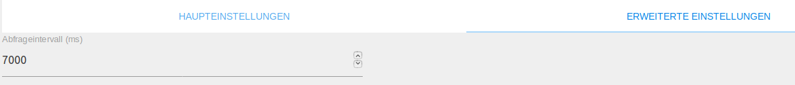
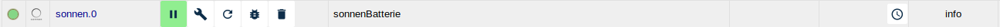

# Sonnen адаптер
Адаптер sonnen позволяет интегрировать sonnenBatterie в ioBroker.

## Обзор
### SonnenBatterie
С sonnenBatterie энергия, генерируемая солнечной системой, может храниться для личного использования и использоваться именно тогда, когда это необходимо. Это позволяет стать независимым от анонимных энергетических компаний и самодостаточным производителем электроэнергии. Благодаря встроенному энергоменеджеру интеллектуальная высокотехнологичная система хранения электроэнергии гарантирует, что домашнее хозяйство будет обеспечиваться собственной электроэнергией наилучшим образом.
Это не только недорого, но и экологически безопасно! SonnenBatterie доступен в различных и гибких моделях хранения.

### Адаптер sonnen
Адаптер sonnen может контролировать и управлять sonnenBatterie в сети. С помощью адаптера Discovery (TODO: Link) sonnenBatterien можно автоматически найти в сети.<br/> Адаптер создает состояния для мониторинга и управления sonnenBatterie в виде объектов. Большинство состояний используются только для контроля заряда батареи, а батареей также можно управлять, описывая некоторые состояния.

## Требования перед установкой
Обязательным условием для работы sonnenBatterie с ioBroker является успешная установка аккумулятора электриком. Аккумулятор также должен быть в той же сети, что и ioBroker.

### Установка
Экземпляр адаптера устанавливается через интерфейс администратора ioBroker. Подробные инструкции по необходимым этапам установки можно найти здесь (TODO: LINK).<br/><br/> После завершения установки экземпляра адаптера автоматически открывается окно конфигурации.

## Конфигурация
### Окно «Основные настройки»


| Поле | Описание |
|:-------------|:-------------|
| IP-адрес | Здесь необходимо ввести IP-адрес желаемого sonnenBatterie. |

| Поле | Описание |
|:-------------|:-------------|
| Auth-Token | Здесь необходимо ввести Auth-Token, который можно найти в веб-интерфейсе sonnen в разделе «Интеграция программного обеспечения». Если токен аутентификации не введен, используется неофициальный API, который можно отключить в любой момент. |

### Окно «Дополнительные настройки»


| Поле | Описание |
|:-------------|:-------------|
| Интервал запроса | Здесь можно установить альтернативное значение в миллисекундах. В этом интервале обновляются состояния sonnenBatterie. |

| Поле | Описание |
|:-------------|:-------------|
| Запрос онлайн-статуса | Если вы хотите избежать запросов от батареи к серверу sonnen, вы можете деактивировать онлайн-запрос статуса (актуально только для 8080 API - например, eco8 и новее) |

После завершения настройки диалоговое окно настройки закрывается с `SPEICHERN UND SCHLIEßEN`.
Это приводит к перезапуску адаптера.

## Экземпляров
При установке адаптера был создан активный экземпляр адаптера sonnen в разделе `Objekte`.<br/><br/>  <span style="color:grey">* Первая инстанция *</span>

На сервере ioBroker можно создать несколько экземпляров sonnen Adapter. И наоборот, sonnenBatterie может работать с несколькими серверами ioBroker. Если несколько устройств должны управляться одним сервером ioBroker, необходимо создать экземпляр для каждой батареи.<br/><br/> Активирован ли адаптер или подключен к аккумулятору, отображается цветом поля состояния экземпляра. Если указатель мыши указывает на символ, отображается более подробная информация.

## Объекты адаптера
В разделе `Objekte` все устройства и действия, распознаваемые адаптером в концентраторе, перечислены в древовидной структуре. Кроме того, также предоставляется информация о том, нормально ли работает связь с концентратором.

 <span style="color:grey">* Объекты соннен-адаптера *</span>

Далее объекты делятся на состояния и кнопки. Поскольку существует два разных API в зависимости от батареи, создаются только те состояния, которые поддерживаются соответствующей батареей.
Каждая точка данных указана с соответствующим типом данных и полномочиями.
Авторизация может быть прочитана (R) и записана (W). Каждая точка данных может быть по крайней мере прочитана (R), в то время как другие также могут быть записаны. Для поиска определенной точки данных мы рекомендуем использовать для поиска комбинацию клавиш «CTRL + F».

### Состояния
Примечание. Состояния устаревшего API (порт 3480) и старого API (порт 7979) в настоящее время не задокументированы или задокументированы лишь частично.

#### Канал: информация
* info.connection

    | Тип данных | авторизация |
    |:---:|:---:|
    | логическое | R |

   *Только читаемое логическое значение, которое истинно, если установлено соединение между ioBroker и батареей.*

* info.lastSync

    | Тип данных | авторизация |
    |:---:|:---:|
    | отметка времени | R |

   *Временная метка только для чтения, которая обновляется каждый раз при обновлении данных.*

* info.configuration

    | Тип данных | авторизация |
    |:---:|:---:|
    | строка | R |

   *Только читаемая строка JSON с информацией о конфигурации sonnenBatterie.*

* info.powerMeter

    | Тип данных | авторизация |
    |:---:|:---:|
    | строка | R |

   *Только читаемая строка JSON с текущей информацией об измерениях sonnenBatterie.*

* info.inverter

    | Тип данных | авторизация |
    |:---:|:---:|
    | строка | R |

   *Только читаемая строка JSON с информацией инвертора от sonnenBatterie.*

#### Канал: статус
* статус. потребление

    | Тип данных | авторизация |
    |:---:|:---:|
    | номер | R |

   *Только читаемое числовое значение, которое содержит текущее потребление дома в ваттах.*

* status.production

    | Тип данных | авторизация |
    |:---:|:---:|
    | номер | R |

   *Читаемое числовое значение, которое указывает, сколько ватт в настоящее время вырабатывается фотоэлектрической системой.*

* status.pacTotal

    | Тип данных | авторизация |
    |:---:|:---:|
    | номер | R |

*Читаемое числовое значение, которое указывает мощность переменного тока инвертора.
Если значение больше 0, батарея разряжена, если значение меньше 0, она заряжена.*

* status.relativeSoc

    | Тип данных | авторизация |
    |:---:|:---:|
    | номер | R |

   *Только читаемое числовое значение, которое представляет текущий уровень заряда аккумулятора.*

* status.userSoc

    | Тип данных | авторизация |
    |:---:|:---:|
    | номер | R |

   *Только читаемое числовое значение, которое представляет текущий уровень заряда аккумулятора.*

* status.acFrequency

    | Тип данных | авторизация |
    |:---:|:---:|
    | номер | R |

   *Только читаемое числовое значение, которое представляет частоту переменного тока в герцах.*

* status.acVoltage

    | Тип данных | авторизация |
    |:---:|:---:|
    | номер | R |

   *Только читаемое числовое значение, которое представляет текущее переменное напряжение инвертора.*

* status.batteryVoltage

    | Тип данных | авторизация |
    |:---:|:---:|
    | номер | R |

   *Только читаемое числовое значение, которое представляет текущее постоянное напряжение аккумулятора.*

* status.systemTime

    | Тип данных | авторизация |
    |:---:|:---:|
    | дата | R |

   *Дата ISO только для чтения, которая представляет системное время аккумулятора.*

* status.systemInstalled

    | Тип данных | авторизация |
    |:---:|:---:|
    | логическое | R |

   *Только читаемое логическое значение, которое истинно, если система установлена правильно.*

* status.batteryCharging

    | Тип данных | авторизация |
    |:---:|:---:|
    | логическое | R |

   *Только читаемое логическое значение. Это верно, если sonnenBatterie в настоящее время заряжается.*

* status.flowConsumingBattery

    | Тип данных | авторизация |
    |:---:|:---:|
    | логическое | R |

   *Только читаемое логическое значение. Это верно, если батарея в данный момент разряжается.*

* status.flowConsumingGrid

    | Тип данных | авторизация |
    |:---:|:---:|
    | логическое | R |

   *Только читаемое логическое значение, которое истинно, если питание в настоящее время потребляется из сети.*

* status.flowConsumingProduction

    | Тип данных | авторизация |
    |:---:|:---:|
    | логическое | R |

   *Только читаемое логическое значение. Это верно, если в настоящее время электроэнергия потребляется непосредственно фотоэлектрической системой.*

* status.flowGridBattery

    | Тип данных | авторизация |
    |:---:|:---:|
    | логическое | R |

   *Логический индикатор только для чтения, который является истинным, если аккумулятор в настоящее время заряжается от сети.*

* status.flowProductionBattery

    | Тип данных | авторизация |
    |:---:|:---:|
    | логическое | R |

   *Только читаемое логическое значение, которое истинно, если аккумулятор в настоящее время заряжается напрямую от фотоэлектрической системы.*

* status.flowProductionGrid

    | Тип данных | авторизация |
    |:---:|:---:|
    | логическое | R |

   *Только читаемое логическое значение, которое истинно, если произведенная электроэнергия в настоящее время подается в сеть.*

* status.gridFeedIn

    | Тип данных | авторизация |
    |:---:|:---:|
    | номер | R |

*Числовое значение только для чтения, которое представляет количество электроэнергии в ваттах, которая в настоящее время подается в сеть или потребляется из нее.
Если значение положительное, сеть в настоящее время подается в сеть; если отрицательное, количество электроэнергии забирается из сети.*

* status.onlineStatus

    | Тип данных | авторизация |
    |:---:|:---:|
    | логическое | R |

   *Только читаемое логическое значение, которое истинно, sonnenBatterie находится в сети.*

#### Канал: контроль
* control.charge

    | Тип данных | авторизация |
    |:---:|:---:|
    | номер | R / W |

   *Числовое значение, позволяющее указать максимальный разряд батареи в ваттах.*

*Примечание. Если установлено недопустимое значение, оно все равно будет подтверждено. Подтверждение (подтверждение) значения означает только то, что команда была передана в аккумулятор.*

*Соответствующее значение уставки сохраняется до тех пор, пока аккумулятор не получит новое значение заряда или разряда.
Если VPP активен, запрос будет отклонен.*

   *Пример:*

```javascript
setState('sonnen.0.control.charge', 1250); // Die Batterie wird mit maximal 1250 Watt geladen
```

* контроль. разряд

    | Тип данных | авторизация |
    |:---:|:---:|
    | номер | R / W |

   *Числовое значение, позволяющее указать максимальный заряд аккумулятора в ваттах.*

*Примечание. Если установлено недопустимое значение, оно все равно будет подтверждено. Подтверждение (подтверждение) значения означает только то, что команда была передана в аккумулятор.*

*Соответствующее значение уставки сохраняется до тех пор, пока аккумулятор не получит новое значение заряда или разряда.
Если VPP активен, запрос будет отклонен.*

   *Пример:*

```javascript
setState('sonnen.0.control.discharge', 1250); // Die Batterie wird maximal mit 1250 Watt entladen
```

#### Канал: измеритель мощности
Этот канал имеет два подканала, например `4_1` и `4_2`, где один представляет потребление, а другой - производство.

Два канала имеют одинаковый статус. Все состояния защищены от записи и имеют тип `number`.

### Канал: инвертор
Канал состоит из защищенных от записи статусов типа `number`, которые предоставляют информацию об инверторе солнечной батареи.

## Changelog
<!--
	Placeholder for the next version (at the beginning of the line):
	### __WORK IN PROGRESS__
-->

### 1.9.8 (2021-09-27)
* (foxriver76) make requesting online status optional for 8080 api (closes #76)

### 1.9.6 (2021-08-03)
* (foxriver76) fix for horizontal flow animations in Safari (broken with 1.9.4)

### 1.9.4 (2021-07-17)
* (foxriver76) widget: make the svg smaller by using a flexbox to center the svg correctly inside the div

### 1.9.3 (2021-07-16)
* (foxriver76) also poll the configuration instead of updating it only once at start (closes #70)

### 1.9.2 (2021-07-16)
* (foxriver76) fix for legacy API

### 1.9.1 (2021-07-16)
* (foxriver76) use legacy API if old API is not completely implemented

### 1.9.0 (2021-07-16)
* (foxriver76) we now also support the legacy API (port 3480)
* (foxriver76) switch from intervals to timeouts to avoid overlapping poll runs

### 1.8.6 (2021-07-04)
* (foxriver76) widget: we removed debug logging and unnecessary template functions
* (foxriver76) widget: we now cache the jquery selectors to improve the performance

### 1.8.5 (2021-07-02)
* (foxriver76) widget: stroke width can now be configured

### 1.8.4 (2021-07-01)
* (foxriver76) widget: we made ID names more adapter specific to avoid getting wrong translations

### 1.8.3 (2021-07-01)
* (foxriver76) widget: we now allow defining the used adapter instance

### 1.8.2 (2021-06-30)
* (foxriver76) widget: css classes now have adapter specific names to avoid conflicts

### 1.8.1 (2021-06-30)
* (foxriver76) widget now has flow directions

### 1.8.0 (2021-06-30)
* (foxriver76) added widget

### 1.7.3 (2021-05-01)
* (foxriver76) we now update objects if attributes are updated, but preserve common.name attribute

### 1.7.2 (2021-04-30)
* (foxriver76) we fixed some type issues (fixes #58)

### 1.7.1 (2021-03-19)
* (foxriver76) do not log warnings on inverter endpoint if battery does not support it (closes #55)

### 1.7.0 (2020-11-12)
* (foxriver76) new channels for powermeter and inverter

### 1.6.1 (2020-11-11)
* (foxriver76) fixed charge and discharge not working with api v2

### 1.6.0 (2020-08-09)
* (foxriver76) added support for official api, automatically used when auth token is given by user

### 1.5.3 (2020-05-18)
* (foxriver76) poll online status always again if not confirmed that there are differences in api (old solution could lead to false negative)
* (foxriver76) more specific error handling 

### 1.5.2 (2020-05-16)
* (foxriver76) check if onlineStatus is supported at adapter start - else do not poll it

### 1.5.0 (2020-05-04)
* (foxriver76) added online status indicator

### 1.4.2 (2020-04-16)
* (foxriver76) added more translations
* (foxriver76) optimizations for compact mode

### 1.4.0
* (foxriver76) introducing new states with power metering and inverter information (supported on :8080 API)
* (foxriver76) only minimum support until we know what users need as states

### 1.3.0
* (foxriver76) introducing new state with configuration information (supported on :8080 API)

### 1.2.0
* (foxriver76) support of another sonnen api

### 1.1.2
* (foxriver76) bugfix for control states

### 1.1.1
* (foxriver76) add compact mode compatibility

### 1.0.2
* (foxriver76) use adapter-core module

### 1.0.1
* (foxriver76) take timezone offset into account on time states

### 1.0.0
* (foxriver76) formal version increment

### 0.0.8
* (foxriver76) Enhanced debug logging
* (foxriver76) Prevent crashing when a return code is received

### 0.0.7
* (foxriver76) Only set info.connection on change

### 0.0.6
* (foxriver76) Only set states if request was successfull --> prevents adapter crash

### 0.0.5
* (foxriver76) translations on index_m.html
* (foxriver76) use 7000 as interval if poll interval is undefined

### 0.0.3
* (foxriver76) fixed links to bugs, repo etc

### 0.0.2
* (foxriver76) bugfixes on control states
* (foxriver76) big readme update
* (foxriver76) addded more states
* (foxriver76) added advanced settings

### 0.0.1
* (foxriver76) initial release

## License
The MIT License (MIT)

Copyright (c) 2018-2021 Moritz Heusinger <moritz.heusinger@gmail.com>

Permission is hereby granted, free of charge, to any person obtaining a copy
of this software and associated documentation files (the "Software"), to deal
in the Software without restriction, including without limitation the rights
to use, copy, modify, merge, publish, distribute, sublicense, and/or sell
copies of the Software, and to permit persons to whom the Software is
furnished to do so, subject to the following conditions:

The above copyright notice and this permission notice shall be included in
all copies or substantial portions of the Software.

THE SOFTWARE IS PROVIDED "AS IS", WITHOUT WARRANTY OF ANY KIND, EXPRESS OR
IMPLIED, INCLUDING BUT NOT LIMITED TO THE WARRANTIES OF MERCHANTABILITY,
FITNESS FOR A PARTICULAR PURPOSE AND NONINFRINGEMENT. IN NO EVENT SHALL THE
AUTHORS OR COPYRIGHT HOLDERS BE LIABLE FOR ANY CLAIM, DAMAGES OR OTHER
LIABILITY, WHETHER IN AN ACTION OF CONTRACT, TORT OR OTHERWISE, ARISING FROM,
OUT OF OR IN CONNECTION WITH THE SOFTWARE OR THE USE OR OTHER DEALINGS IN
THE SOFTWARE.