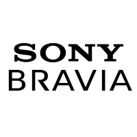

# ioBroker.sony-bravia

**Этот адаптер использует библиотеки Sentry для автоматического сообщения разработчикам об исключениях и ошибках в коде.** Более подробную информацию, а также инструкции по отключению отправки сообщений об ошибках см. [в документации Sentry-Plugin](https://github.com/ioBroker/plugin-sentry#plugin-sentry) ! Система отчетности Sentry используется начиная с js-controller 3.0.

## Адаптер для смарт-телевизора Sony Bravia Android для ioBroker

Это адаптер ioBroker для вашего смарт-телевизора Sony Bravia с ОС Android. Протестировано с KD-65X8507C.

## Настройка телевизора

- Включите телевизор
- На телевизоре перейдите в Настройки > Сеть > Настройка домашней сети > Удаленное устройство/Рендерер > Вкл.
- На телевизоре перейдите в Настройки > Сеть > Настройка домашней сети > Управление IP > Аутентификация > Обычный и предварительно общий ключ
- На телевизоре перейдите в Настройки > Сеть > Настройка домашней сети > Удаленное устройство/Рендерер > Введите предварительно заданный ключ > 0000 (или любое другое значение, которое вы хотите присвоить ключу PSK).
- На телевизоре перейдите в Настройки > Сеть > Настройка домашней сети > Удаленное устройство/Рендерер > Простое управление по IP > Вкл.

## Changelog
<!--
    Placeholder for the next version (at the beginning of the line):
    ### **WORK IN PROGRESS**
-->

### **WORK IN PROGRESS**
- (copilot) Adapter requires node.js >= 22 now
- (iobroker-bot) Adapter requires node.js >= 20 now.
- (copilot) Adapter requires admin >= 7.7.22 now
- (copilot) Adapter requires js-controller >= 6.0.11 now
- (copilot) Adapter requires admin >= 7.6.17 now

### 1.1.0 (2024-04-28)
* (mcm1957) Adapter requires node.js >= 18 and js-controller >= 5 now
* (mcm1957) Dependencies have been updated

### 1.0.9 (2022-06-27)
* (Apollon77) Fix crash case on send introduced with last version

### 1.0.8 (2022-04-25)
* (Apollon77) Fix crash cases reported by sentry

### 1.0.7 (2022-04-24)
* (Apollon77) Fix tier definition

### 1.0.6 (2022-04-23)
* (ThomasBra) Audio volume/mute control
* (ThomasBra) value lists for AV Contents
* (Apollon77) Add Sentry error reporting

[Older changelogs can be found there](https://github.com/iobroker-community-adapters/ioBroker.sony-bravia/blob/master/CHANGELOG_OLD.md)

## License
The MIT License (MIT)

Copyright (c) 2023-2026 iobroker-community-adapters <iobroker-community-adapters@gmx.de>  
Copyright (c) 2018-2022 ldittmar <iobroker@lmdsoft.de>

Permission is hereby granted, free of charge, to any person obtaining a copy
of this software and associated documentation files (the "Software"), to deal
in the Software without restriction, including without limitation the rights
to use, copy, modify, merge, publish, distribute, sublicense, and/or sell
copies of the Software, and to permit persons to whom the Software is
furnished to do so, subject to the following conditions:

The above copyright notice and this permission notice shall be included in
all copies or substantial portions of the Software.

THE SOFTWARE IS PROVIDED "AS IS", WITHOUT WARRANTY OF ANY KIND, EXPRESS OR
IMPLIED, INCLUDING BUT NOT LIMITED TO THE WARRANTIES OF MERCHANTABILITY,
FITNESS FOR A PARTICULAR PURPOSE AND NONINFRINGEMENT. IN NO EVENT SHALL THE
AUTHORS OR COPYRIGHT HOLDERS BE LIABLE FOR ANY CLAIM, DAMAGES OR OTHER
LIABILITY, WHETHER IN AN ACTION OF CONTRACT, TORT OR OTHERWISE, ARISING FROM,
OUT OF OR IN CONNECTION WITH THE SOFTWARE OR THE USE OR OTHER DEALINGS IN
THE SOFTWARE.