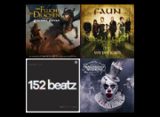
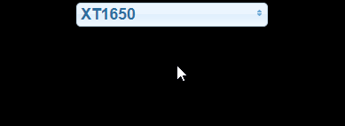

# IoBroker.spotify-премиум
    **Версия:**     **Тесты:**    

**Этот адаптер использует библиотеки Sentry для автоматического сообщения разработчикам об исключениях и ошибках кода.** Более подробную информацию и информацию о том, как отключить отчеты об ошибках, см. в [Документация по плагину Sentry](https://github.com/ioBroker/plugin-sentry#plugin-sentry)! Отчеты Sentry используются, начиная с js-controller 3.0.

Адаптер для доступа к элементам управления воспроизведением Spotify. Из-за API Spotify необходим премиум-аккаунт.

Подключение к [API Spotify Premium](https://www.spotify.com/).

## Документация
См. также [Документация API для разработчиков Spotify](https://developer.spotify.com/).

### Настройка / Авторизация
1. Войдите на https://developer.spotify.com/dashboard/
2. Создайте заявку, получите Client ID и Client Secret.
3. Установите URI перенаправления на `http://127.0.0.1` в настройках вашего приложения Spotify.
4. Введите идентификатор клиента и секретный код клиента в поля ниже.
5. Запустите экземпляр
6. Перейдите на вкладку «Объекты» и нажмите кнопку getAuthorization в `spotify-premium.0.authorization`
7. Скопируйте появившийся URL-адрес из `spotify-premium.0.authorization.authorizationUrl` в свой веб-браузер и назовите его
8. Возможно, вам потребуется войти в систему, чтобы воспользоваться Spotify и предоставить доступ.
9. Браузер будет перенаправлен на недействительный URL. Если возникает ошибка `invalid redirect uri`, пожалуйста, проверьте шаг 3
10. Скопируйте этот URL и вставьте его в `spotify-premium.0.authorization.authorizationReturnUri`
11. Значение в `spotify-premium.0.authorization.authorized` становится истинным, если все прошло успешно.

#### [Видеоурок](https://www.youtube.com/watch?v=n0m9201qABU)

### Штаты
Все состояния описаны в админ.

### Примеры использования VIS
Нажмите для просмотра исходного кода виджета.

 Запустить один определенный плейлист 
<pre> <code>[{&quot;tpl&quot;:&quot;tplJquiButtonState&quot;,&quot;data&quot;:{&quot;oid&quot;:&quot;spotify-premium.0.playlists.YourPlaylistName.playThisList&quot;,&quot;g_fixed&quot;:false,&quot;g_visibility&quot;:false,&quot;g_css_font_text&quot;:false,&quot;g_css_background&quot;:false,&quot;g_css_shadow_padding&quot;:false,&quot;g_css_border&quot;:false,&quot;g_gestures&quot;:false,&quot;g_signals&quot;:false,&quot;g_last_change&quot;:false,&quot;visibility-cond&quot;:&quot;==&quot;,&quot;visibility-val&quot;:1,&quot;visibility-groups-action&quot;:&quot;hide&quot;,&quot;buttontext&quot;:&quot;Choose Playlist&quot;,&quot;signals-cond-0&quot;:&quot;==&quot;,&quot;signals-val-0&quot;:true,&quot;signals-icon-0&quot;:&quot;/vis/signals/lowbattery.png&quot;,&quot;signals-icon-size-0&quot;:0,&quot;signals-blink-0&quot;:false,&quot;signals-horz-0&quot;:0,&quot;signals-vert-0&quot;:0,&quot;signals-hide-edit-0&quot;:false,&quot;signals-cond-1&quot;:&quot;==&quot;,&quot;signals-val-1&quot;:true,&quot;signals-icon-1&quot;:&quot;/vis/signals/lowbattery.png&quot;,&quot;signals-icon-size-1&quot;:0,&quot;signals-blink-1&quot;:false,&quot;signals-horz-1&quot;:0,&quot;signals-vert-1&quot;:0,&quot;signals-hide-edit-1&quot;:false,&quot;signals-cond-2&quot;:&quot;==&quot;,&quot;signals-val-2&quot;:true,&quot;signals-icon-2&quot;:&quot;/vis/signals/lowbattery.png&quot;,&quot;signals-icon-size-2&quot;:0,&quot;signals-blink-2&quot;:false,&quot;signals-horz-2&quot;:0,&quot;signals-vert-2&quot;:0,&quot;signals-hide-edit-2&quot;:false,&quot;lc-type&quot;:&quot;last-change&quot;,&quot;lc-is-interval&quot;:true,&quot;lc-is-moment&quot;:false,&quot;lc-format&quot;:&quot;&quot;,&quot;lc-position-vert&quot;:&quot;top&quot;,&quot;lc-position-horz&quot;:&quot;right&quot;,&quot;lc-offset-vert&quot;:0,&quot;lc-offset-horz&quot;:0,&quot;lc-font-size&quot;:&quot;12px&quot;,&quot;lc-font-family&quot;:&quot;&quot;,&quot;lc-font-style&quot;:&quot;&quot;,&quot;lc-bkg-color&quot;:&quot;&quot;,&quot;lc-color&quot;:&quot;&quot;,&quot;lc-border-width&quot;:&quot;0&quot;,&quot;lc-border-style&quot;:&quot;&quot;,&quot;lc-border-color&quot;:&quot;&quot;,&quot;lc-border-radius&quot;:10,&quot;lc-zindex&quot;:0,&quot;value&quot;:&quot;true&quot;,&quot;no_style&quot;:false},&quot;style&quot;:{&quot;left&quot;:&quot;549px&quot;,&quot;top&quot;:&quot;364px&quot;},&quot;widgetSet&quot;:&quot;jqui&quot;}]</code></pre>

 Запустите одно конкретное устройство 
<pre> <code>[{&quot;tpl&quot;:&quot;tplJquiButtonState&quot;,&quot;data&quot;:{&quot;oid&quot;:&quot;spotify-premium.0.devices.YourDeviceName.useForPlayback&quot;,&quot;g_fixed&quot;:false,&quot;g_visibility&quot;:false,&quot;g_css_font_text&quot;:false,&quot;g_css_background&quot;:false,&quot;g_css_shadow_padding&quot;:false,&quot;g_css_border&quot;:false,&quot;g_gestures&quot;:false,&quot;g_signals&quot;:false,&quot;g_last_change&quot;:false,&quot;visibility-cond&quot;:&quot;==&quot;,&quot;visibility-val&quot;:1,&quot;visibility-groups-action&quot;:&quot;hide&quot;,&quot;buttontext&quot;:&quot;Choose Device&quot;,&quot;signals-cond-0&quot;:&quot;==&quot;,&quot;signals-val-0&quot;:true,&quot;signals-icon-0&quot;:&quot;/vis/signals/lowbattery.png&quot;,&quot;signals-icon-size-0&quot;:0,&quot;signals-blink-0&quot;:false,&quot;signals-horz-0&quot;:0,&quot;signals-vert-0&quot;:0,&quot;signals-hide-edit-0&quot;:false,&quot;signals-cond-1&quot;:&quot;==&quot;,&quot;signals-val-1&quot;:true,&quot;signals-icon-1&quot;:&quot;/vis/signals/lowbattery.png&quot;,&quot;signals-icon-size-1&quot;:0,&quot;signals-blink-1&quot;:false,&quot;signals-horz-1&quot;:0,&quot;signals-vert-1&quot;:0,&quot;signals-hide-edit-1&quot;:false,&quot;signals-cond-2&quot;:&quot;==&quot;,&quot;signals-val-2&quot;:true,&quot;signals-icon-2&quot;:&quot;/vis/signals/lowbattery.png&quot;,&quot;signals-icon-size-2&quot;:0,&quot;signals-blink-2&quot;:false,&quot;signals-horz-2&quot;:0,&quot;signals-vert-2&quot;:0,&quot;signals-hide-edit-2&quot;:false,&quot;lc-type&quot;:&quot;last-change&quot;,&quot;lc-is-interval&quot;:true,&quot;lc-is-moment&quot;:false,&quot;lc-format&quot;:&quot;&quot;,&quot;lc-position-vert&quot;:&quot;top&quot;,&quot;lc-position-horz&quot;:&quot;right&quot;,&quot;lc-offset-vert&quot;:0,&quot;lc-offset-horz&quot;:0,&quot;lc-font-size&quot;:&quot;12px&quot;,&quot;lc-font-family&quot;:&quot;&quot;,&quot;lc-font-style&quot;:&quot;&quot;,&quot;lc-bkg-color&quot;:&quot;&quot;,&quot;lc-color&quot;:&quot;&quot;,&quot;lc-border-width&quot;:&quot;0&quot;,&quot;lc-border-style&quot;:&quot;&quot;,&quot;lc-border-color&quot;:&quot;&quot;,&quot;lc-border-radius&quot;:10,&quot;lc-zindex&quot;:0,&quot;value&quot;:&quot;true&quot;,&quot;no_style&quot;:false},&quot;style&quot;:{&quot;left&quot;:&quot;549px&quot;,&quot;top&quot;:&quot;364px&quot;},&quot;widgetSet&quot;:&quot;jqui&quot;}]</code></pre>

 Начать играть 
<pre> <code>[{&quot;tpl&quot;:&quot;tplSpotifyPlayButton&quot;,&quot;data&quot;:{&quot;g_fixed&quot;:false,&quot;g_visibility&quot;:false,&quot;g_css_font_text&quot;:false,&quot;g_css_background&quot;:false,&quot;g_css_shadow_padding&quot;:false,&quot;g_css_border&quot;:false,&quot;g_gestures&quot;:false,&quot;g_signals&quot;:false,&quot;g_last_change&quot;:false,&quot;visibility-cond&quot;:&quot;==&quot;,&quot;visibility-val&quot;:1,&quot;visibility-groups-action&quot;:&quot;hide&quot;,&quot;oidplay&quot;:&quot;spotify-premium.0.player.play&quot;,&quot;oidpause&quot;:&quot;spotify-premium.0.player.pause&quot;,&quot;oidstate&quot;:&quot;spotify-premium.0.player.isPlaying&quot;,&quot;colorplay&quot;:&quot;green&quot;,&quot;colorpause&quot;:&quot;green&quot;,&quot;signals-cond-0&quot;:&quot;==&quot;,&quot;signals-val-0&quot;:true,&quot;signals-icon-0&quot;:&quot;/vis/signals/lowbattery.png&quot;,&quot;signals-icon-size-0&quot;:0,&quot;signals-blink-0&quot;:false,&quot;signals-horz-0&quot;:0,&quot;signals-vert-0&quot;:0,&quot;signals-hide-edit-0&quot;:false,&quot;signals-cond-1&quot;:&quot;==&quot;,&quot;signals-val-1&quot;:true,&quot;signals-icon-1&quot;:&quot;/vis/signals/lowbattery.png&quot;,&quot;signals-icon-size-1&quot;:0,&quot;signals-blink-1&quot;:false,&quot;signals-horz-1&quot;:0,&quot;signals-vert-1&quot;:0,&quot;signals-hide-edit-1&quot;:false,&quot;signals-cond-2&quot;:&quot;==&quot;,&quot;signals-val-2&quot;:true,&quot;signals-icon-2&quot;:&quot;/vis/signals/lowbattery.png&quot;,&quot;signals-icon-size-2&quot;:0,&quot;signals-blink-2&quot;:false,&quot;signals-horz-2&quot;:0,&quot;signals-vert-2&quot;:0,&quot;signals-hide-edit-2&quot;:false,&quot;lc-type&quot;:&quot;last-change&quot;,&quot;lc-is-interval&quot;:true,&quot;lc-is-moment&quot;:false,&quot;lc-format&quot;:&quot;&quot;,&quot;lc-position-vert&quot;:&quot;top&quot;,&quot;lc-position-horz&quot;:&quot;right&quot;,&quot;lc-offset-vert&quot;:0,&quot;lc-offset-horz&quot;:0,&quot;lc-font-size&quot;:&quot;12px&quot;,&quot;lc-font-family&quot;:&quot;&quot;,&quot;lc-font-style&quot;:&quot;&quot;,&quot;lc-bkg-color&quot;:&quot;&quot;,&quot;lc-color&quot;:&quot;&quot;,&quot;lc-border-width&quot;:&quot;0&quot;,&quot;lc-border-style&quot;:&quot;&quot;,&quot;lc-border-color&quot;:&quot;&quot;,&quot;lc-border-radius&quot;:10,&quot;lc-zindex&quot;:0},&quot;style&quot;:{&quot;left&quot;:&quot;487px&quot;,&quot;top&quot;:&quot;604px&quot;},&quot;widgetSet&quot;:&quot;spotify-premium&quot;}]</code></pre>

 Воспроизвести предыдущий трек 
<pre> <code>[{&quot;tpl&quot;:&quot;tplSpotifyPreviousButton&quot;,&quot;data&quot;:{&quot;g_fixed&quot;:false,&quot;g_visibility&quot;:false,&quot;g_css_font_text&quot;:false,&quot;g_css_background&quot;:false,&quot;g_css_shadow_padding&quot;:false,&quot;g_css_border&quot;:false,&quot;g_gestures&quot;:false,&quot;g_signals&quot;:false,&quot;g_last_change&quot;:false,&quot;visibility-cond&quot;:&quot;==&quot;,&quot;visibility-val&quot;:1,&quot;visibility-groups-action&quot;:&quot;hide&quot;,&quot;oid&quot;:&quot;spotify-premium.0.player.skipMinus&quot;,&quot;colorbox&quot;:&quot;green&quot;,&quot;signals-cond-0&quot;:&quot;==&quot;,&quot;signals-val-0&quot;:true,&quot;signals-icon-0&quot;:&quot;/vis/signals/lowbattery.png&quot;,&quot;signals-icon-size-0&quot;:0,&quot;signals-blink-0&quot;:false,&quot;signals-horz-0&quot;:0,&quot;signals-vert-0&quot;:0,&quot;signals-hide-edit-0&quot;:false,&quot;signals-cond-1&quot;:&quot;==&quot;,&quot;signals-val-1&quot;:true,&quot;signals-icon-1&quot;:&quot;/vis/signals/lowbattery.png&quot;,&quot;signals-icon-size-1&quot;:0,&quot;signals-blink-1&quot;:false,&quot;signals-horz-1&quot;:0,&quot;signals-vert-1&quot;:0,&quot;signals-hide-edit-1&quot;:false,&quot;signals-cond-2&quot;:&quot;==&quot;,&quot;signals-val-2&quot;:true,&quot;signals-icon-2&quot;:&quot;/vis/signals/lowbattery.png&quot;,&quot;signals-icon-size-2&quot;:0,&quot;signals-blink-2&quot;:false,&quot;signals-horz-2&quot;:0,&quot;signals-vert-2&quot;:0,&quot;signals-hide-edit-2&quot;:false,&quot;lc-type&quot;:&quot;last-change&quot;,&quot;lc-is-interval&quot;:true,&quot;lc-is-moment&quot;:false,&quot;lc-format&quot;:&quot;&quot;,&quot;lc-position-vert&quot;:&quot;top&quot;,&quot;lc-position-horz&quot;:&quot;right&quot;,&quot;lc-offset-vert&quot;:0,&quot;lc-offset-horz&quot;:0,&quot;lc-font-size&quot;:&quot;12px&quot;,&quot;lc-font-family&quot;:&quot;&quot;,&quot;lc-font-style&quot;:&quot;&quot;,&quot;lc-bkg-color&quot;:&quot;&quot;,&quot;lc-color&quot;:&quot;&quot;,&quot;lc-border-width&quot;:&quot;0&quot;,&quot;lc-border-style&quot;:&quot;&quot;,&quot;lc-border-color&quot;:&quot;&quot;,&quot;lc-border-radius&quot;:10,&quot;lc-zindex&quot;:0},&quot;style&quot;:{&quot;left&quot;:&quot;386px&quot;,&quot;top&quot;:&quot;604px&quot;},&quot;widgetSet&quot;:&quot;spotify-premium&quot;}]</code></pre>

 Воспроизвести следующий трек 
<pre> <code>[{&quot;tpl&quot;:&quot;tplSpotifyNextButton&quot;,&quot;data&quot;:{&quot;g_fixed&quot;:false,&quot;g_visibility&quot;:false,&quot;g_css_font_text&quot;:false,&quot;g_css_background&quot;:false,&quot;g_css_shadow_padding&quot;:false,&quot;g_css_border&quot;:false,&quot;g_gestures&quot;:false,&quot;g_signals&quot;:false,&quot;g_last_change&quot;:false,&quot;visibility-cond&quot;:&quot;==&quot;,&quot;visibility-val&quot;:1,&quot;visibility-groups-action&quot;:&quot;hide&quot;,&quot;oid&quot;:&quot;spotify-premium.0.player.skipPlus&quot;,&quot;colorbox&quot;:&quot;green&quot;,&quot;signals-cond-0&quot;:&quot;==&quot;,&quot;signals-val-0&quot;:true,&quot;signals-icon-0&quot;:&quot;/vis/signals/lowbattery.png&quot;,&quot;signals-icon-size-0&quot;:0,&quot;signals-blink-0&quot;:false,&quot;signals-horz-0&quot;:0,&quot;signals-vert-0&quot;:0,&quot;signals-hide-edit-0&quot;:false,&quot;signals-cond-1&quot;:&quot;==&quot;,&quot;signals-val-1&quot;:true,&quot;signals-icon-1&quot;:&quot;/vis/signals/lowbattery.png&quot;,&quot;signals-icon-size-1&quot;:0,&quot;signals-blink-1&quot;:false,&quot;signals-horz-1&quot;:0,&quot;signals-vert-1&quot;:0,&quot;signals-hide-edit-1&quot;:false,&quot;signals-cond-2&quot;:&quot;==&quot;,&quot;signals-val-2&quot;:true,&quot;signals-icon-2&quot;:&quot;/vis/signals/lowbattery.png&quot;,&quot;signals-icon-size-2&quot;:0,&quot;signals-blink-2&quot;:false,&quot;signals-horz-2&quot;:0,&quot;signals-vert-2&quot;:0,&quot;signals-hide-edit-2&quot;:false,&quot;lc-type&quot;:&quot;last-change&quot;,&quot;lc-is-interval&quot;:true,&quot;lc-is-moment&quot;:false,&quot;lc-format&quot;:&quot;&quot;,&quot;lc-position-vert&quot;:&quot;top&quot;,&quot;lc-position-horz&quot;:&quot;right&quot;,&quot;lc-offset-vert&quot;:0,&quot;lc-offset-horz&quot;:0,&quot;lc-font-size&quot;:&quot;12px&quot;,&quot;lc-font-family&quot;:&quot;&quot;,&quot;lc-font-style&quot;:&quot;&quot;,&quot;lc-bkg-color&quot;:&quot;&quot;,&quot;lc-color&quot;:&quot;&quot;,&quot;lc-border-width&quot;:&quot;0&quot;,&quot;lc-border-style&quot;:&quot;&quot;,&quot;lc-border-color&quot;:&quot;&quot;,&quot;lc-border-radius&quot;:10,&quot;lc-zindex&quot;:0},&quot;style&quot;:{&quot;left&quot;:&quot;588px&quot;,&quot;top&quot;:&quot;604px&quot;},&quot;widgetSet&quot;:&quot;spotify-premium&quot;}]</code></pre>

 Контрольный повтор 
<pre> <code>[{&quot;tpl&quot;:&quot;tplSpotifyRepeatButton&quot;,&quot;data&quot;:{&quot;g_fixed&quot;:false,&quot;g_visibility&quot;:false,&quot;g_css_font_text&quot;:false,&quot;g_css_background&quot;:false,&quot;g_css_shadow_padding&quot;:false,&quot;g_css_border&quot;:false,&quot;g_gestures&quot;:false,&quot;g_signals&quot;:false,&quot;g_last_change&quot;:false,&quot;visibility-cond&quot;:&quot;==&quot;,&quot;visibility-val&quot;:1,&quot;visibility-groups-action&quot;:&quot;hide&quot;,&quot;oidall&quot;:&quot;spotify-premium.0.player.repeatContext&quot;,&quot;oidoff&quot;:&quot;spotify-premium.0.player.repeatOff&quot;,&quot;oidone&quot;:&quot;spotify-premium.0.player.repeatTrack&quot;,&quot;oidstate&quot;:&quot;spotify-premium.0.player.repeat&quot;,&quot;coloroff&quot;:&quot;white&quot;,&quot;colorall&quot;:&quot;green&quot;,&quot;colorone&quot;:&quot;green&quot;,&quot;signals-cond-0&quot;:&quot;==&quot;,&quot;signals-val-0&quot;:true,&quot;signals-icon-0&quot;:&quot;/vis/signals/lowbattery.png&quot;,&quot;signals-icon-size-0&quot;:0,&quot;signals-blink-0&quot;:false,&quot;signals-horz-0&quot;:0,&quot;signals-vert-0&quot;:0,&quot;signals-hide-edit-0&quot;:false,&quot;signals-cond-1&quot;:&quot;==&quot;,&quot;signals-val-1&quot;:true,&quot;signals-icon-1&quot;:&quot;/vis/signals/lowbattery.png&quot;,&quot;signals-icon-size-1&quot;:0,&quot;signals-blink-1&quot;:false,&quot;signals-horz-1&quot;:0,&quot;signals-vert-1&quot;:0,&quot;signals-hide-edit-1&quot;:false,&quot;signals-cond-2&quot;:&quot;==&quot;,&quot;signals-val-2&quot;:true,&quot;signals-icon-2&quot;:&quot;/vis/signals/lowbattery.png&quot;,&quot;signals-icon-size-2&quot;:0,&quot;signals-blink-2&quot;:false,&quot;signals-horz-2&quot;:0,&quot;signals-vert-2&quot;:0,&quot;signals-hide-edit-2&quot;:false,&quot;lc-type&quot;:&quot;last-change&quot;,&quot;lc-is-interval&quot;:true,&quot;lc-is-moment&quot;:false,&quot;lc-format&quot;:&quot;&quot;,&quot;lc-position-vert&quot;:&quot;top&quot;,&quot;lc-position-horz&quot;:&quot;right&quot;,&quot;lc-offset-vert&quot;:0,&quot;lc-offset-horz&quot;:0,&quot;lc-font-size&quot;:&quot;12px&quot;,&quot;lc-font-family&quot;:&quot;&quot;,&quot;lc-font-style&quot;:&quot;&quot;,&quot;lc-bkg-color&quot;:&quot;&quot;,&quot;lc-color&quot;:&quot;&quot;,&quot;lc-border-width&quot;:&quot;0&quot;,&quot;lc-border-style&quot;:&quot;&quot;,&quot;lc-border-color&quot;:&quot;&quot;,&quot;lc-border-radius&quot;:10,&quot;lc-zindex&quot;:0},&quot;style&quot;:{&quot;left&quot;:&quot;689px&quot;,&quot;top&quot;:&quot;614px&quot;,&quot;width&quot;:&quot;48px&quot;,&quot;height&quot;:&quot;56px&quot;},&quot;widgetSet&quot;:&quot;spotify-premium&quot;}]</code></pre>

 Управление перемешиванием 
<pre> <code>[{&quot;tpl&quot;:&quot;tplSpotifyShuffleButton&quot;,&quot;data&quot;:{&quot;g_fixed&quot;:false,&quot;g_visibility&quot;:false,&quot;g_css_font_text&quot;:false,&quot;g_css_background&quot;:false,&quot;g_css_shadow_padding&quot;:false,&quot;g_css_border&quot;:false,&quot;g_gestures&quot;:false,&quot;g_signals&quot;:false,&quot;g_last_change&quot;:false,&quot;visibility-cond&quot;:&quot;==&quot;,&quot;visibility-val&quot;:1,&quot;visibility-groups-action&quot;:&quot;hide&quot;,&quot;oidon&quot;:&quot;spotify-premium.0.player.shuffleOn&quot;,&quot;oidoff&quot;:&quot;spotify-premium.0.player.shuffleOff&quot;,&quot;oidstate&quot;:&quot;spotify-premium.0.player.shuffle&quot;,&quot;coloroff&quot;:&quot;white&quot;,&quot;coloron&quot;:&quot;green&quot;,&quot;signals-cond-0&quot;:&quot;==&quot;,&quot;signals-val-0&quot;:true,&quot;signals-icon-0&quot;:&quot;/vis/signals/lowbattery.png&quot;,&quot;signals-icon-size-0&quot;:0,&quot;signals-blink-0&quot;:false,&quot;signals-horz-0&quot;:0,&quot;signals-vert-0&quot;:0,&quot;signals-hide-edit-0&quot;:false,&quot;signals-cond-1&quot;:&quot;==&quot;,&quot;signals-val-1&quot;:true,&quot;signals-icon-1&quot;:&quot;/vis/signals/lowbattery.png&quot;,&quot;signals-icon-size-1&quot;:0,&quot;signals-blink-1&quot;:false,&quot;signals-horz-1&quot;:0,&quot;signals-vert-1&quot;:0,&quot;signals-hide-edit-1&quot;:false,&quot;signals-cond-2&quot;:&quot;==&quot;,&quot;signals-val-2&quot;:true,&quot;signals-icon-2&quot;:&quot;/vis/signals/lowbattery.png&quot;,&quot;signals-icon-size-2&quot;:0,&quot;signals-blink-2&quot;:false,&quot;signals-horz-2&quot;:0,&quot;signals-vert-2&quot;:0,&quot;signals-hide-edit-2&quot;:false,&quot;lc-type&quot;:&quot;last-change&quot;,&quot;lc-is-interval&quot;:true,&quot;lc-is-moment&quot;:false,&quot;lc-format&quot;:&quot;&quot;,&quot;lc-position-vert&quot;:&quot;top&quot;,&quot;lc-position-horz&quot;:&quot;right&quot;,&quot;lc-offset-vert&quot;:0,&quot;lc-offset-horz&quot;:0,&quot;lc-font-size&quot;:&quot;12px&quot;,&quot;lc-font-family&quot;:&quot;&quot;,&quot;lc-font-style&quot;:&quot;&quot;,&quot;lc-bkg-color&quot;:&quot;&quot;,&quot;lc-color&quot;:&quot;&quot;,&quot;lc-border-width&quot;:&quot;0&quot;,&quot;lc-border-style&quot;:&quot;&quot;,&quot;lc-border-color&quot;:&quot;&quot;,&quot;lc-border-radius&quot;:10,&quot;lc-zindex&quot;:0},&quot;style&quot;:{&quot;left&quot;:&quot;319px&quot;,&quot;top&quot;:&quot;622px&quot;,&quot;width&quot;:&quot;38px&quot;,&quot;height&quot;:&quot;40px&quot;},&quot;widgetSet&quot;:&quot;spotify-premium&quot;}]</code></pre>

 Контекстное изображение 
<pre> <code>[{&quot;tpl&quot;:&quot;tplValueStringImg&quot;,&quot;data&quot;:{&quot;oid&quot;:&quot;spotify-premium.0.player.contextImageUrl&quot;,&quot;g_fixed&quot;:false,&quot;g_visibility&quot;:false,&quot;g_css_font_text&quot;:false,&quot;g_css_background&quot;:false,&quot;g_css_shadow_padding&quot;:false,&quot;g_css_border&quot;:false,&quot;g_gestures&quot;:false,&quot;g_signals&quot;:false,&quot;g_last_change&quot;:false,&quot;visibility-cond&quot;:&quot;==&quot;,&quot;visibility-val&quot;:1,&quot;visibility-groups-action&quot;:&quot;hide&quot;,&quot;refreshInterval&quot;:&quot;0&quot;,&quot;signals-cond-0&quot;:&quot;==&quot;,&quot;signals-val-0&quot;:true,&quot;signals-icon-0&quot;:&quot;/vis/signals/lowbattery.png&quot;,&quot;signals-icon-size-0&quot;:0,&quot;signals-blink-0&quot;:false,&quot;signals-horz-0&quot;:0,&quot;signals-vert-0&quot;:0,&quot;signals-hide-edit-0&quot;:false,&quot;signals-cond-1&quot;:&quot;==&quot;,&quot;signals-val-1&quot;:true,&quot;signals-icon-1&quot;:&quot;/vis/signals/lowbattery.png&quot;,&quot;signals-icon-size-1&quot;:0,&quot;signals-blink-1&quot;:false,&quot;signals-horz-1&quot;:0,&quot;signals-vert-1&quot;:0,&quot;signals-hide-edit-1&quot;:false,&quot;signals-cond-2&quot;:&quot;==&quot;,&quot;signals-val-2&quot;:true,&quot;signals-icon-2&quot;:&quot;/vis/signals/lowbattery.png&quot;,&quot;signals-icon-size-2&quot;:0,&quot;signals-blink-2&quot;:false,&quot;signals-horz-2&quot;:0,&quot;signals-vert-2&quot;:0,&quot;signals-hide-edit-2&quot;:false,&quot;lc-type&quot;:&quot;last-change&quot;,&quot;lc-is-interval&quot;:true,&quot;lc-is-moment&quot;:false,&quot;lc-format&quot;:&quot;&quot;,&quot;lc-position-vert&quot;:&quot;top&quot;,&quot;lc-position-horz&quot;:&quot;right&quot;,&quot;lc-offset-vert&quot;:0,&quot;lc-offset-horz&quot;:0,&quot;lc-font-size&quot;:&quot;12px&quot;,&quot;lc-font-family&quot;:&quot;&quot;,&quot;lc-font-style&quot;:&quot;&quot;,&quot;lc-bkg-color&quot;:&quot;&quot;,&quot;lc-color&quot;:&quot;&quot;,&quot;lc-border-width&quot;:&quot;0&quot;,&quot;lc-border-style&quot;:&quot;&quot;,&quot;lc-border-color&quot;:&quot;&quot;,&quot;lc-border-radius&quot;:10,&quot;lc-zindex&quot;:0},&quot;style&quot;:{&quot;left&quot;:&quot;338px&quot;,&quot;top&quot;:&quot;131px&quot;,&quot;width&quot;:&quot;122px&quot;,&quot;height&quot;:&quot;122px&quot;},&quot;widgetSet&quot;:&quot;basic&quot;}]</code></pre>

 Выбрать трек текущего плейлиста 
<pre> <code>[{&quot;tpl&quot;:&quot;tplJquiSelectList&quot;,&quot;data&quot;:{&quot;oid&quot;:&quot;spotify-premium.0.player.playlist.trackList&quot;,&quot;g_fixed&quot;:false,&quot;g_visibility&quot;:false,&quot;g_css_font_text&quot;:false,&quot;g_css_background&quot;:false,&quot;g_css_shadow_padding&quot;:false,&quot;g_css_border&quot;:false,&quot;g_gestures&quot;:false,&quot;g_signals&quot;:false,&quot;g_last_change&quot;:false,&quot;visibility-cond&quot;:&quot;==&quot;,&quot;visibility-val&quot;:1,&quot;visibility-groups-action&quot;:&quot;hide&quot;,&quot;values&quot;:&quot;{spotify-premium.0.player.playlist.trackListNumber}&quot;,&quot;texts&quot;:&quot;{spotify-premium.0.player.playlist.trackListString}&quot;,&quot;height&quot;:&quot;100&quot;,&quot;signals-cond-0&quot;:&quot;==&quot;,&quot;signals-val-0&quot;:true,&quot;signals-icon-0&quot;:&quot;/vis/signals/lowbattery.png&quot;,&quot;signals-icon-size-0&quot;:0,&quot;signals-blink-0&quot;:false,&quot;signals-horz-0&quot;:0,&quot;signals-vert-0&quot;:0,&quot;signals-hide-edit-0&quot;:false,&quot;signals-cond-1&quot;:&quot;==&quot;,&quot;signals-val-1&quot;:true,&quot;signals-icon-1&quot;:&quot;/vis/signals/lowbattery.png&quot;,&quot;signals-icon-size-1&quot;:0,&quot;signals-blink-1&quot;:false,&quot;signals-horz-1&quot;:0,&quot;signals-vert-1&quot;:0,&quot;signals-hide-edit-1&quot;:false,&quot;signals-cond-2&quot;:&quot;==&quot;,&quot;signals-val-2&quot;:true,&quot;signals-icon-2&quot;:&quot;/vis/signals/lowbattery.png&quot;,&quot;signals-icon-size-2&quot;:0,&quot;signals-blink-2&quot;:false,&quot;signals-horz-2&quot;:0,&quot;signals-vert-2&quot;:0,&quot;signals-hide-edit-2&quot;:false,&quot;lc-type&quot;:&quot;last-change&quot;,&quot;lc-is-interval&quot;:true,&quot;lc-is-moment&quot;:false,&quot;lc-format&quot;:&quot;&quot;,&quot;lc-position-vert&quot;:&quot;top&quot;,&quot;lc-position-horz&quot;:&quot;right&quot;,&quot;lc-offset-vert&quot;:0,&quot;lc-offset-horz&quot;:0,&quot;lc-font-size&quot;:&quot;12px&quot;,&quot;lc-font-family&quot;:&quot;&quot;,&quot;lc-font-style&quot;:&quot;&quot;,&quot;lc-bkg-color&quot;:&quot;&quot;,&quot;lc-color&quot;:&quot;&quot;,&quot;lc-border-width&quot;:&quot;0&quot;,&quot;lc-border-style&quot;:&quot;&quot;,&quot;lc-border-color&quot;:&quot;&quot;,&quot;lc-border-radius&quot;:10,&quot;lc-zindex&quot;:0},&quot;style&quot;:{&quot;left&quot;:&quot;505px&quot;,&quot;top&quot;:&quot;369px&quot;},&quot;widgetSet&quot;:&quot;jqui&quot;}]</code></pre>

 Переключатель устройства 
<pre> <code>[{&quot;tpl&quot;:&quot;tplJquiSelectList&quot;,&quot;data&quot;:{&quot;oid&quot;:&quot;spotify-premium.0.devices.deviceList&quot;,&quot;g_fixed&quot;:false,&quot;g_visibility&quot;:false,&quot;g_css_font_text&quot;:false,&quot;g_css_background&quot;:false,&quot;g_css_shadow_padding&quot;:false,&quot;g_css_border&quot;:false,&quot;g_gestures&quot;:false,&quot;g_signals&quot;:false,&quot;g_last_change&quot;:false,&quot;visibility-cond&quot;:&quot;==&quot;,&quot;visibility-val&quot;:1,&quot;visibility-groups-action&quot;:&quot;hide&quot;,&quot;values&quot;:&quot;{spotify-premium.0.devices.availableDeviceListIds}&quot;,&quot;texts&quot;:&quot;{spotify-premium.0.devices.availableDeviceListString}&quot;,&quot;height&quot;:&quot;100&quot;,&quot;signals-cond-0&quot;:&quot;==&quot;,&quot;signals-val-0&quot;:true,&quot;signals-icon-0&quot;:&quot;/vis/signals/lowbattery.png&quot;,&quot;signals-icon-size-0&quot;:0,&quot;signals-blink-0&quot;:false,&quot;signals-horz-0&quot;:0,&quot;signals-vert-0&quot;:0,&quot;signals-hide-edit-0&quot;:false,&quot;signals-cond-1&quot;:&quot;==&quot;,&quot;signals-val-1&quot;:true,&quot;signals-icon-1&quot;:&quot;/vis/signals/lowbattery.png&quot;,&quot;signals-icon-size-1&quot;:0,&quot;signals-blink-1&quot;:false,&quot;signals-horz-1&quot;:0,&quot;signals-vert-1&quot;:0,&quot;signals-hide-edit-1&quot;:false,&quot;signals-cond-2&quot;:&quot;==&quot;,&quot;signals-val-2&quot;:true,&quot;signals-icon-2&quot;:&quot;/vis/signals/lowbattery.png&quot;,&quot;signals-icon-size-2&quot;:0,&quot;signals-blink-2&quot;:false,&quot;signals-horz-2&quot;:0,&quot;signals-vert-2&quot;:0,&quot;signals-hide-edit-2&quot;:false,&quot;lc-type&quot;:&quot;last-change&quot;,&quot;lc-is-interval&quot;:true,&quot;lc-is-moment&quot;:false,&quot;lc-format&quot;:&quot;&quot;,&quot;lc-position-vert&quot;:&quot;top&quot;,&quot;lc-position-horz&quot;:&quot;right&quot;,&quot;lc-offset-vert&quot;:0,&quot;lc-offset-horz&quot;:0,&quot;lc-font-size&quot;:&quot;12px&quot;,&quot;lc-font-family&quot;:&quot;&quot;,&quot;lc-font-style&quot;:&quot;&quot;,&quot;lc-bkg-color&quot;:&quot;&quot;,&quot;lc-color&quot;:&quot;&quot;,&quot;lc-border-width&quot;:&quot;0&quot;,&quot;lc-border-style&quot;:&quot;&quot;,&quot;lc-border-color&quot;:&quot;&quot;,&quot;lc-border-radius&quot;:10,&quot;lc-zindex&quot;:0},&quot;style&quot;:{&quot;left&quot;:&quot;578px&quot;,&quot;top&quot;:&quot;378px&quot;},&quot;widgetSet&quot;:&quot;jqui&quot;}]</code></pre>

 Переключить плейлист 
<pre> <code>[{&quot;tpl&quot;:&quot;tplJquiSelectList&quot;,&quot;data&quot;:{&quot;oid&quot;:&quot;spotify-premium.0.playlists.playlistList&quot;,&quot;g_fixed&quot;:false,&quot;g_visibility&quot;:false,&quot;g_css_font_text&quot;:false,&quot;g_css_background&quot;:false,&quot;g_css_shadow_padding&quot;:false,&quot;g_css_border&quot;:false,&quot;g_gestures&quot;:false,&quot;g_signals&quot;:false,&quot;g_last_change&quot;:false,&quot;visibility-cond&quot;:&quot;==&quot;,&quot;visibility-val&quot;:1,&quot;visibility-groups-action&quot;:&quot;hide&quot;,&quot;values&quot;:&quot;{spotify-premium.0.playlists.playlistListIds}&quot;,&quot;texts&quot;:&quot;{spotify-premium.0.playlists.playlistListString}&quot;,&quot;height&quot;:&quot;100&quot;,&quot;signals-cond-0&quot;:&quot;==&quot;,&quot;signals-val-0&quot;:true,&quot;signals-icon-0&quot;:&quot;/vis/signals/lowbattery.png&quot;,&quot;signals-icon-size-0&quot;:0,&quot;signals-blink-0&quot;:false,&quot;signals-horz-0&quot;:0,&quot;signals-vert-0&quot;:0,&quot;signals-hide-edit-0&quot;:false,&quot;signals-cond-1&quot;:&quot;==&quot;,&quot;signals-val-1&quot;:true,&quot;signals-icon-1&quot;:&quot;/vis/signals/lowbattery.png&quot;,&quot;signals-icon-size-1&quot;:0,&quot;signals-blink-1&quot;:false,&quot;signals-horz-1&quot;:0,&quot;signals-vert-1&quot;:0,&quot;signals-hide-edit-1&quot;:false,&quot;signals-cond-2&quot;:&quot;==&quot;,&quot;signals-val-2&quot;:true,&quot;signals-icon-2&quot;:&quot;/vis/signals/lowbattery.png&quot;,&quot;signals-icon-size-2&quot;:0,&quot;signals-blink-2&quot;:false,&quot;signals-horz-2&quot;:0,&quot;signals-vert-2&quot;:0,&quot;signals-hide-edit-2&quot;:false,&quot;lc-type&quot;:&quot;last-change&quot;,&quot;lc-is-interval&quot;:true,&quot;lc-is-moment&quot;:false,&quot;lc-format&quot;:&quot;&quot;,&quot;lc-position-vert&quot;:&quot;top&quot;,&quot;lc-position-horz&quot;:&quot;right&quot;,&quot;lc-offset-vert&quot;:0,&quot;lc-offset-horz&quot;:0,&quot;lc-font-size&quot;:&quot;12px&quot;,&quot;lc-font-family&quot;:&quot;&quot;,&quot;lc-font-style&quot;:&quot;&quot;,&quot;lc-bkg-color&quot;:&quot;&quot;,&quot;lc-color&quot;:&quot;&quot;,&quot;lc-border-width&quot;:&quot;0&quot;,&quot;lc-border-style&quot;:&quot;&quot;,&quot;lc-border-color&quot;:&quot;&quot;,&quot;lc-border-radius&quot;:10,&quot;lc-zindex&quot;:0},&quot;style&quot;:{&quot;left&quot;:&quot;571px&quot;,&quot;top&quot;:&quot;509px&quot;},&quot;widgetSet&quot;:&quot;jqui&quot;}]</code></pre>

## Changelog
<!--
    Placeholder for the next version (at the beginning of the line):
    ### **WORK IN PROGRESS**
-->
### **WORK IN PROGRESS**
- (aruttkamp) correct issues detected by repsoitory checker [#421]

### 1.5.3 (2025-04-15)
- (aruttkamp) redirect URI changed [#429]

### 1.5.2 (2024-12-16)
- (aruttkamp) ESLint 9 implemented

### 1.5.1 (2024-12-16)
- (aruttkamp) Testing Node 22.x implemented

### 1.5.0 (2024-04-18)
- (N1tR0) A problem has been fixed which cause 'too many requests' errors [#241, #245, #311]. The recommended update interval for playlist information is now 60 minutes.
- (N1tR0) A DNS cache has been added [#341].
- (N1tR0) Potentially fix 'Current played track is not highlighted' [#283]
- (N1tR0) Some state types have been fixed
- (mcm1957) Dependencies have been updated

### 1.4.0 (2024-04-02)
* (mcm1957) Adapter requires node.js 18 and js-controller >= 5 now
* (N1tR0) A problem has been fixed that did not correctly update the progress of playing media [#339]
* (mcm1957) Dependencies have been updated0

## License
The MIT License (MIT)

Copyright (c) 2024-2025 iobroker-community-adapters <iobroker-community-adapters@gmx.de>
Copyright (c) 2019-2023 twonky4 <twonky4@gmx.de>

Permission is hereby granted, free of charge, to any person obtaining a copy
of this software and associated documentation files (the "Software"), to deal
in the Software without restriction, including without limitation the rights
to use, copy, modify, merge, publish, distribute, sublicense, and/or sell
copies of the Software, and to permit persons to whom the Software is
furnished to do so, subject to the following conditions:

The above copyright notice and this permission notice shall be included in
all copies or substantial portions of the Software.

THE SOFTWARE IS PROVIDED "AS IS", WITHOUT WARRANTY OF ANY KIND, EXPRESS OR
IMPLIED, INCLUDING BUT NOT LIMITED TO THE WARRANTIES OF MERCHANTABILITY,
FITNESS FOR A PARTICULAR PURPOSE AND NONINFRINGEMENT. IN NO EVENT SHALL THE
AUTHORS OR COPYRIGHT HOLDERS BE LIABLE FOR ANY CLAIM, DAMAGES OR OTHER
LIABILITY, WHETHER IN AN ACTION OF CONTRACT, TORT OR OTHERWISE, ARISING FROM,
OUT OF OR IN CONNECTION WITH THE SOFTWARE OR THE USE OR OTHER DEALINGS IN
THE SOFTWARE.