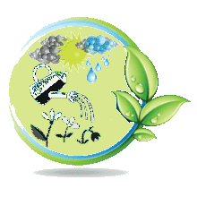
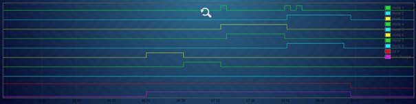
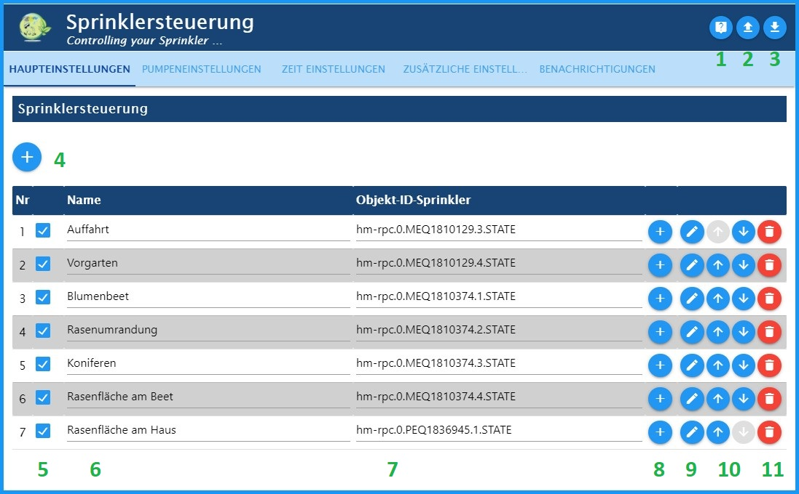
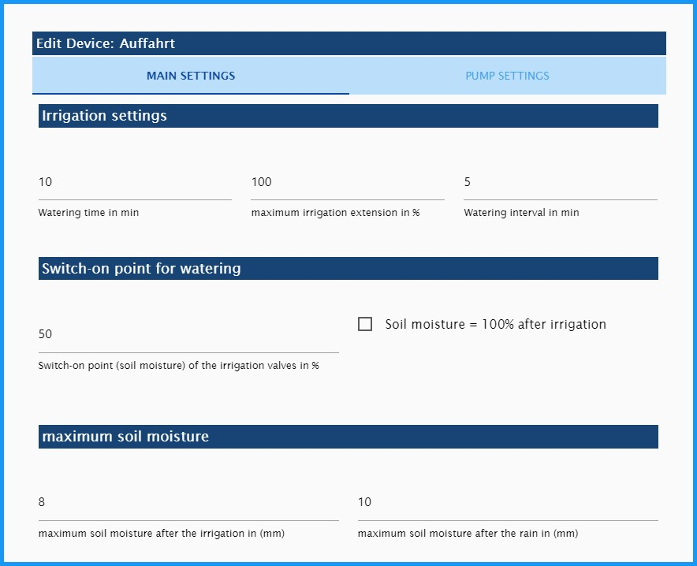
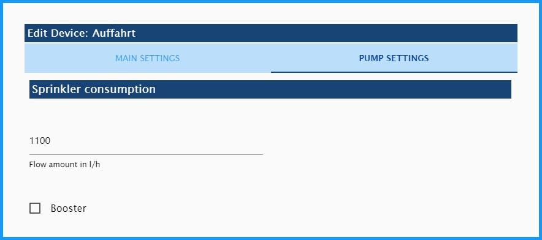
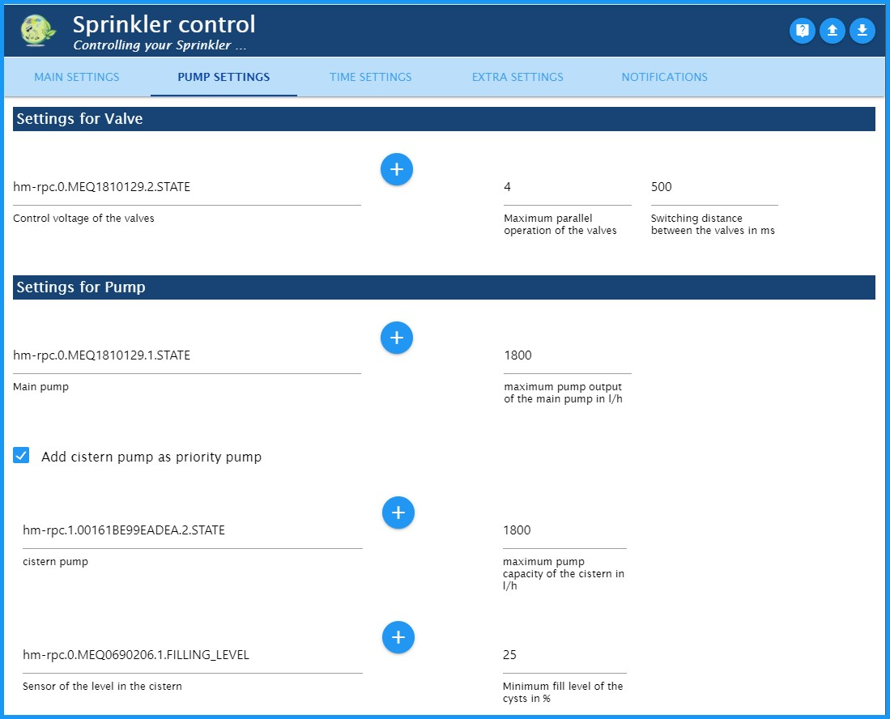
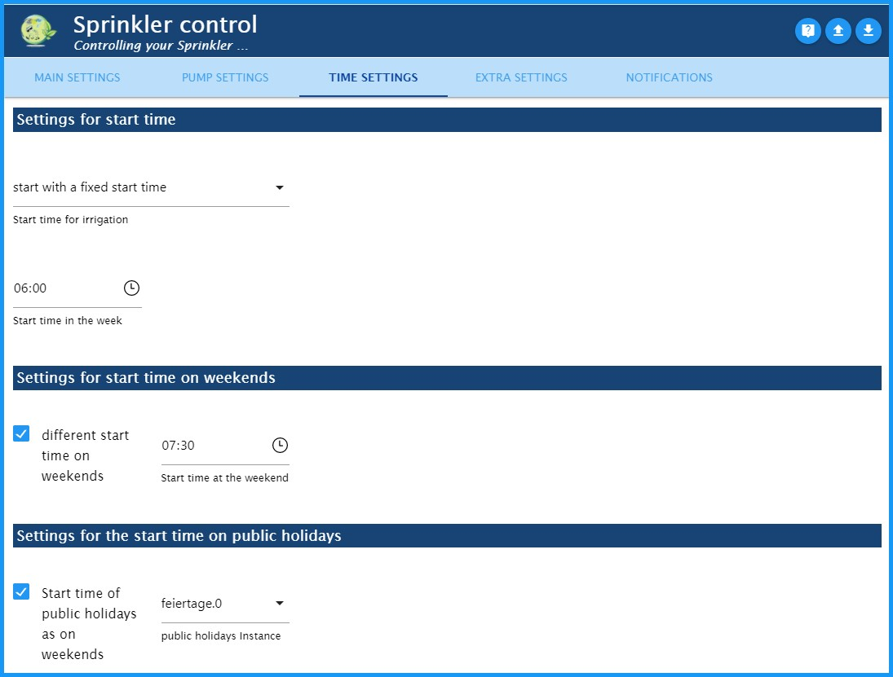
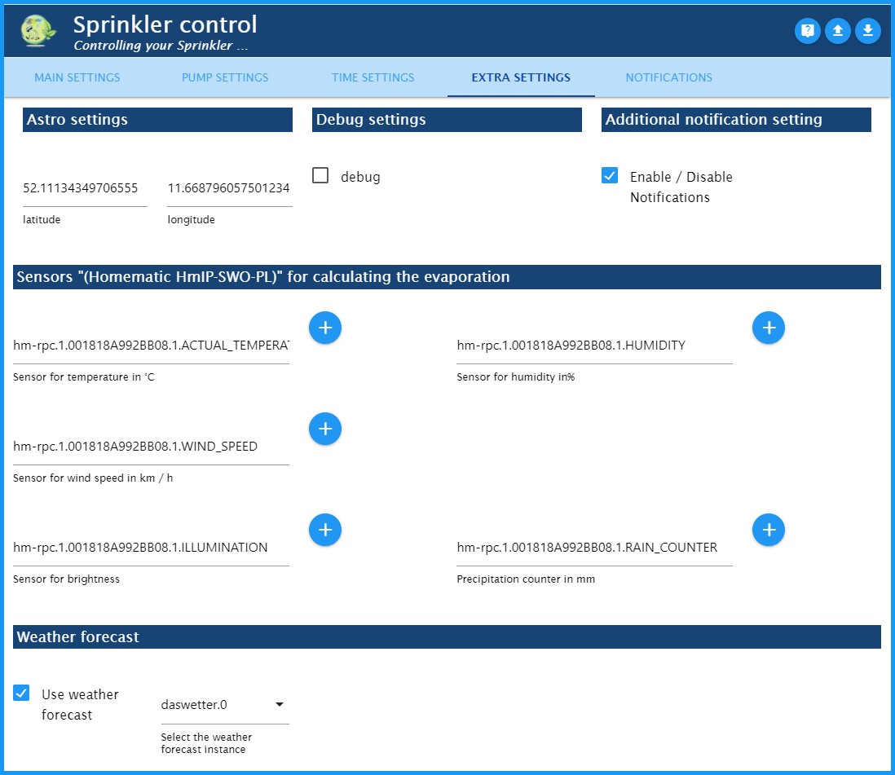
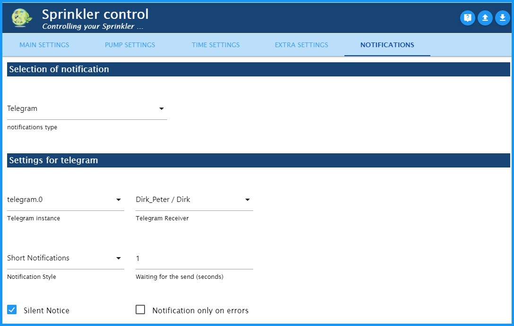
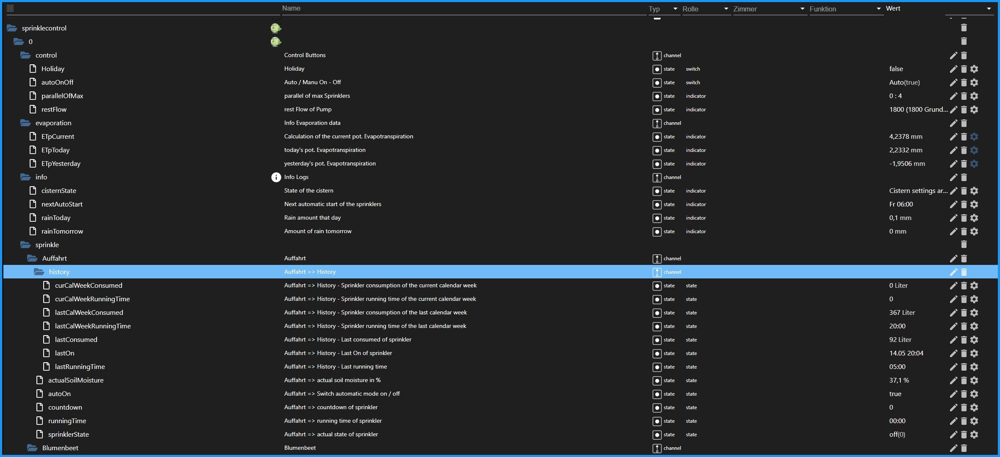

# SprinkleControl

### _Адаптер для автоматического полива сада в зависимости от погодных условий._

(с помощью метеорологического датчика HmIP-SWO-PL – plus)

К сожалению, мои знания английского языка слишком малы для описания адаптера. Буду очень благодарен за любую помощь в переводе.

---

---

## Способ действия

---

Данные об окружающей среде (температура, влажность, освещенность, скорость ветра, количество осадков) анализируются в системе управления поливом. Полученное таким образом испарение используется для определения теоретической влажности почвы на отдельных участках орошения. В момент времени, указанный в разделе «Настройки времени», активируются контуры полива, уровень влажности которых опускается ниже определенного процента. Затем эти различные контуры орошения управляются таким образом, чтобы не была превышена максимальная производительность насоса (л/ч) и максимальное количество контуров орошения. Оба параметра настраиваются.

**Пример сценария переключения режимов работы в течение дня (время начала работы всех клапанов: 6:00).**

Моя система орошения работает с IP-датчиком погоды Homematic Plus (HmIP-SWO-PL) и **тестировалась только с ним** . Однако на форуме ioBroker есть также тесты, проведенные с метеостанциями через адаптер Sainlogic.

---

---

## Установка

---

Установка адаптера управления поливом осуществляется через административный интерфейс ioBroker путем нажатия на знак плюса (+). В зависимости от активного репозитория, указанного в административном адаптере, будет установлена стабильная (по умолчанию) или бета-версия (последняя).

---

---

## Настройка адаптера - ОСНОВНЫЕ НАСТРОЙКИ

---

- 1: Перейдите на страницу Sprinkle Control на GitHub.
- 2: Загрузите конфигурацию адаптера из файла.
- 3: Сохраните конфигурацию адаптера из файла.
- 4: Добавьте новый круг полива.
- 5: Установите флажок, чтобы включить/выключить систему орошения.
- 6\. Название круга орошения автоматически считывается из объектов при выборе идентификатора и может быть изменено по мере необходимости.
- 7: Уникальный идентификатор точки данных, подлежащей управлению в объектах.
- 8: Измените выбранный привод орошения.
- 9: Откройте индивидуальные настройки соответствующего контура орошения.
- 10: Переместите линию
- 11: Удалите схему полива со всеми настроенными данными!

---

### Индивидуальная конфигурация ирригационного контура

---

Откройте индивидуальные настройки соответствующего контура орошения.

**Настройки орошения**

- _Время полива в минутах:_ Установите время полива в минутах. Это время увеличивается по мере того, как значение триггера опускается ниже «минимального процента влажности почвы».
- _Максимальное увеличение продолжительности орошения в %:_ Ограничение продолжительности орошения в процентах (100% = продолжительность орошения не увеличивается).
- _Интервал полива в минутах:_ Время полива делится на интервалы (например, 5 минут полива, не менее 5 минут перерыва, 5 минут полива и т. д.).
  - **Подсказка:** У меня у входа установлена решетка для газона. Здесь вода стекает по склону только при поливе. Мне удалось это компенсировать, поливая через определенные промежутки времени.

**Точка включения полива**

- _Точка срабатывания (влажность почвы) ирригационных клапанов в %:_ Порог срабатывания: Если это значение не достигнуто, полив начинается с заданного времени.
- _Влажность почвы = 100% после полива:_ При активации этой функции влажность почвы после полива устанавливается на 100%. В противном случае она останется чуть ниже этого значения из-за испарения во время полива.

**максимальная влажность почвы**

- _Максимальная влажность почвы после полива (мм):_ Максимальное теоретическое содержание воды в почве после полива. Чем выше это значение, тем дольше интервалы между поливами.
  - **Подсказка:** Сетка газона: 5; Клумба: 10; Площадь газона: 14
- _Максимальная влажность почвы после дождя (мм):_ Максимальное теоретическое содержание воды в почве после сильного дождя. Это значение должно быть больше, чем после полива!
  - **Подсказка:** Сетка газона: 6; Цветочная клумба: 15; Площадь газона: 19

---

#### Индивидуальная настройка ирригационной системы - ОСНОВНЫЕ НАСТРОЙКИ

---

**Потребление воды из спринклерной системы**

- _Объем расхода в л/ч:_ удельный расход воды на текущей оросительной станции.
  - **Подсказка:** часто её можно найти в инструкции по эксплуатации или в интернете.
- _Усилитель:_ отключает все активные контуры орошения от сети на 30 секунд, а затем снова включает их.
  - **Подсказка:** мой насос обеспечивает максимальную производительность 1800 л/ч, а для запуска моих садовых дождевателей требуется 1400 л/ч, но при полном давлении. Благодаря функции повышения давления я также могу поливать хвойные деревья капельным методом, для которого требуется всего 300 л/ч.
  > * **Внимание:** эту функцию следует использовать крайне осторожно, поскольку одновременно с активным усилителем полива может работать только одна оросительная система.

---

---

#### Индивидуальная настройка ирригационного контура - НАСТРОЙКИ НАСОСА

---

**Настройки для Valve**

- _Управляющее напряжение клапанов:_ Нажатие на символ (+) открывает окно «Выбор состояния ID». Здесь вы можете выбрать СОСТОЯНИЕ управляющего напряжения клапанов. Этот выход становится активным, как только один из клапанов активируется. Если вам не нужно это СОСТОЯНИЕ, оставьте это поле пустым!
- _Максимальная параллельная работа клапанов:_ здесь можно ограничить количество активных клапанов. Например, если выходной мощности управляющего трансформатора недостаточно для параллельного переключения нескольких клапанов.
- _Расстояние переключения между клапанами в миллисекундах:_ Введите время в миллисекундах. Это время ожидания до переключения следующего клапана, что означает, например, что 6 выходов переключаются один за другим, а не одновременно.

**Настройки насоса**

- _Главный насос:_ Нажатие на символ (+) открывает окно выбора идентификатора. Здесь сохраняется состояние насоса, отвечающего за водоснабжение.
- _Максимальная производительность основного насоса в л/ч:_ Здесь сохраняется максимальная производительность насоса. Это позволяет ограничить работу ирригационных контуров, чтобы на клапаны по-прежнему подавалось достаточное давление.
  - **Внимание:** здесь необходимо указывать фактическую производительность насоса, а не ту, что указана на паспортной табличке. Например, у меня насос "Gardena 5000/5 LCD", который из-за длины шланга выдает только 1800 л/ч, а не 4500 л/ч, как указано на паспортной табличке. **Добавьте насос для бачка.**
- _Добавить насос цистерны в качестве насоса с приоритетом._
  - _Насос цистерны:_ Здесь осуществляется ввод данных о насосе цистерны. Он отключается, если уровень воды в цистерне слишком низкий. В этом случае основной насос продолжает подавать воду.
  - _Максимальная производительность насоса бачка в л/ч:_ Здесь сохраняется максимальная производительность насоса в л/ч. См. раздел «Настройка основного насоса».
  - _Датчик уровня в бачке:_ СОСТОЯНИЕ датчика уровня для определения уровня в диапазоне 0 ... 100%.
    - _Встроенный:_ емкостной уровнемер Hm-Sen-Wa-Od от HomeMatic.
  - _Минимальный уровень заполнения цист в %:_ Если он не достигнут, точка переключения переключается на главный насос, и клапаны регулируются в соответствии с количеством потребленной воды во время полива.

---

---

## Настройка адаптера - НАСТРОЙКИ ВРЕМЕНИ

---

На этой вкладке можно установить время начала работы системы полива.

\###Настройки времени начала

- _Время начала полива:_
  - _Начните с фиксированного времени начала:_ здесь можно установить **время начала недели** .
  - _Начало отсчета времени восхода солнца:_ Вот время начала отсчета времени восхода солнца. Его можно изменить с -120 минут до +120 минут с помощью функции **«Сдвиг времени в минутах»** .
  - _Начало в конце золотого часа:_

\###Настройки времени начала в выходные дни

- _Разное время начала полива в выходные дни:_ Если вы хотите, например, начать полив в другое время в выходные дни, чтобы не беспокоить соседей, вы можете включить эту функцию здесь.
- _Время начала в выходные:_

\###Настройки времени начала работы в праздничные дни

- _Начало государственных праздников по выходным:_ Если государственные праздники должны рассматриваться как выходные, эту функцию можно включить здесь.
- _Экземпляр для государственных праздников._ Здесь необходимо выбрать внешний экземпляр для государственных праздников (например, адаптер "Deutsche Feiertage").

---

---

## Настройка адаптера - ДОПОЛНИТЕЛЬНЫЕ НАСТРОЙКИ

---

### астрономические настройки

SprinkleControl получает широту и долготу из системных настроек ioBroker. Используя эти значения, SprinkleControl рассчитывает положение Солнца и внеземное излучение, необходимое для испарения.

### Настройки отладки

При активации в журнале отображается дополнительная информация. Это позволяет быстрее анализировать ошибки.

### Дополнительные настройки уведомлений

Активируйте вкладку «Уведомления». Настройки связи будут выполнены на новой вкладке «Уведомления».

### Датчики "(Homematic HmIP-SWO-PL)" для расчета испарения

> - **Внимание:** программа адаптирована для метеостанции HomeMatic HmIP-SWO-PL для расчета испарения! Без этих данных схемы орошения не запускаются.

- Но на форуме я слышал, что программа также работает с данными о погоде через "адаптер Sainlogic".
- Датчики рассчитывают максимально возможное испарение потенциальной эвапотранспирации в соответствии с формулой Пенмана ETp и, таким образом, управляют системой орошения. Это происходит каждый раз при изменении температуры.

### Прогноз погоды

- Если вы активируете флажок «Использовать прогноз погоды», появится поле выбора. Здесь необходимо выбрать экземпляр адаптера «Das Wetter». В адаптере «Das Wetter» необходимо заполнить поле «Путь 2: XML-файл с 5-дневным прогнозом погоды и подробной информацией за каждые 3 часа», чтобы SprinkleControl мог получить доступ к объекту **«daswetter.0.NextDaysDetailed.Location\_1.Day\_1.rain\_value»** . Это значение затем используется для отсрочки полива в случае ожидаемого дождя.

---

---

## Настройка адаптера - УВЕДОМЛЕНИЯ

---

- После активации вкладки «УВЕДОМЛЕНИЯ» вы можете выбрать способ получения уведомлений и ввести свои данные.
- Поддерживаются следующие методы оповещения:
  - Электронная почта
  - Слабак
  - Телеграмма
  - WhatsApp

---

---

## Админ=>Объект=>sprinkcontrol.0.

---

### контроль

- **Праздник:** Если для параметра "Праздник" установлено значение "true", полив начнётся так же, как и в выходные дни, если включена опция "Выходные". Здесь также возможна связь с календарём.
- **addStartTimeSwitch** — отображается только в том случае, если в разделе «Конфигурация», «Дополнительное время запуска» выбран запуск с внешним сигналом.
- **autoOnOff:** Если параметр установлен в положение «Выкл.», автоматический режим работы системы орошения отключается.
- **autoStart** - Запуск орошения => Все активные контуры запущены!
- **parallelOfMax:** Например (3: 4). Здесь активны три из четырех возможных кругов орошения. (Это всего лишь реклама!)
- **restFlow:** Отображение возможного остаточного расхода насоса. (Это всего лишь реклама!)

### испарение

- **ETpCurrent:** Это текущее значение испарения в мм/день.
- **ETpToday:** Здесь отображается текущее суточное значение испарения. В 00:05 оно будет перенесено в ETpYesterday, а затем обнулено.
- **ETpВчера:** Здесь показано испарение за вчерашний день.

### информация

- **cisternState** При необходимости здесь отображается состояние цистерны и ее текущее состояние.
- **nextAutoStart** указывает на следующий запуск системы орошения.
- **rainToday** Здесь отображается прогноз осадков на сегодня. Для этого необходим адаптер "the weather".
- **rainTomorrow** — прогноз осадков на завтра от адаптера "the weather".

### посыпьте.\*.

- **история**
  - **curCalWeekConsumed:** Текущее недельное потребление воды в ирригационном контуре в литрах.
  - **curCalWeekRunningTime:** текущее общее недельное время работы ирригационной системы.
  - **lastCalWeekConsumed:** потребление воды в ирригационном контуре за последнюю неделю в литрах.
  - **lastCalWeekRunningTime:** общее время работы цикла полива за последнюю неделю.
  - **lastConsumed:** Потребление воды во время последнего полива (в литрах).
  - **lastOn:** последний запуск цикла полива (05.07 14:14)
  - **LastRunningTime:** продолжительность последнего полива
- **actualSoilMoisture** — это текущая виртуальная влажность почвы в % => критерий срабатывания (максимум 100% после полива, более 100% после сильного дождя). Внимание: это значение может значительно отличаться от фактической влажности почвы.
- **autoOn** Автоматическое включение (Здесь можно отключить автоматический полив данного контура, например, во время ремонта, при этом ручной полив возможен в любое время.)
- **Обратный отсчет.** Осталось время полива.
- Продолжительность полива **(runningTime)**
  - Если здесь ввести число больше 0, цикл полива начнётся на указанное время в минутах.
  - Если вы введете 0, полив в зоне полива будет завершен.
- **sprinklerState** Отображение состояния оросительного контура.
  - выкл(0) → Оросительная цепь выключена.
  - wait(1) → Оросительная система ожидает, когда станет доступна мощность насоса.
  - on(2) → Круг орошения включен.
  - break(3) → Цикл полива был прерван (конфигурация, интервал полива)
  - Boost(4) → Функция повышения давления в текущей ирригационной цепи активна (конфигурация, усилитель включен).
  - off(Boost)(5) → Оросительная цепь прервана на 30 с, поскольку активна функция повышения давления.

## Changelog

<!--
  Placeholder for the next version (at the beginning of the line):
  ### **WORK IN PROGRESS**
-->
### 1.0.11 (2026-07-31)
* (Dirk-Peter-md) sendMessage => Cancel if the message is empty

### 1.0.10 (2026-07-26)
 * (Dirk-Peter-md) Fixed error sendMessage noNotivikation
 * (Dirk-Peter-md) Fixed error history.curCalWeekConsumed

### 1.0.9 (2026-07-01)
 * (Dirk-Peter-md) Fixed error reading the soil moisture sensor

### 1.0.8 (2026-06-12)
 * (Dirk-Peter-md) Fixed error in "Command without response"
 * (Dirk-Peter-md) Water Pressure Control Revised
 * (Dirk-Peter-md) ioBroker-Bot [E6004], [W1127], [W1133], [W1134], [S6022] completed

### 1.0.7 (2026-05-24)
* (Dirk-Peter-md) Added pressure monitoring.

### Older versions

*************************************************************************************************************************************

## License
[MIT License](LICENSE)

Copyright (c) 2020-2026       Dirk-Peter-md     <dirk.peter@freenet.de>

Permission is hereby granted, free of charge, to any person obtaining a copy
of this software and associated documentation files (the "Software"), to deal
in the Software without restriction, including without limitation the rights
to use, copy, modify, merge, publish, distribute, sublicense, and/or sell
copies of the Software, and to permit persons to whom the Software is
furnished to do so, subject to the following conditions:

The above copyright notice and this permission notice shall be included in all
copies or substantial portions of the Software.

THE SOFTWARE IS PROVIDED "AS IS", WITHOUT WARRANTY OF ANY KIND, EXPRESS OR
IMPLIED, INCLUDING BUT NOT LIMITED TO THE WARRANTIES OF MERCHANTABILITY,
FITNESS FOR A PARTICULAR PURPOSE AND NONINFRINGEMENT. IN NO EVENT SHALL THE
AUTHORS OR COPYRIGHT HOLDERS BE LIABLE FOR ANY CLAIM, DAMAGES OR OTHER
LIABILITY, WHETHER IN AN ACTION OF CONTRACT, TORT OR OTHERWISE, ARISING FROM,
OUT OF OR IN CONNECTION WITH THE SOFTWARE OR THE USE OR OTHER DEALINGS IN THE
SOFTWARE.