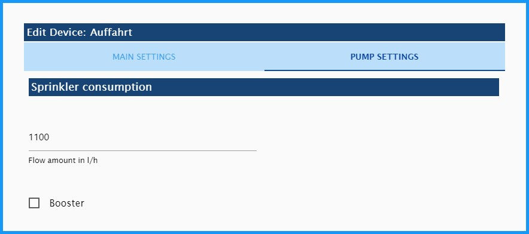

# СпринклКонтроль
### *Адаптер для автоматического полива сада в зависимости от погоды.* (с помощью датчика погоды HmIP-SWO-PL – plus)
К сожалению, мои знания английского слишком малы для описания адаптера.
Буду очень признателен за любую помощь с переводом.

---
---

## Способ действия
- - -

Окружающие данные (температура, влажность, освещенность, скорость ветра, количество дождя) оцениваются в системе управления поливом.
Определенное таким образом испарение используется для определения теоретической влажности почвы отдельных площадей орошения.
В момент времени, указанный в разделе «Настройки времени», активируются контуры полива, уровень которых ниже определенного процента.
Затем эти различные оросительные контуры регулируются таким образом, чтобы не превышались максимальная производительность насоса (л/ч) и максимальное количество оросительных контуров.
Оба настраиваемые.

**Пример переключения в течение дня (время запуска всех клапанов: 6:00)**

Мой полив работает с датчиком погоды Homematic IP plus (HmIP-SWO-PL) и **испытывался только с ним**.
Однако на форуме ioBroker также есть некоторые тесты, которые проводятся с метеостанциями через адаптер Sainlogic.

---
---

## Установка
- - -

Экземпляр Sprinkle Control Adapter устанавливается через интерфейс администратора ioBroker, нажав знак плюс (+).
В зависимости от активного репозитория, указанного в адаптере администратора, будет установлена стабильная (по умолчанию) или бета-версия (последняя).

---
---

## Конфигурация адаптера - ОСНОВНЫЕ НАСТРОЙКИ
- - -

* 1: Перейдите на страницу управления разбрызгиванием на GitHub.
* 2: Загрузить конфигурацию адаптера из файла
* 3: Сохраните конфигурацию адаптера из файла.
* 4: Добавить новый круг полива
* 5: Установите флажок для включения/выключения контура орошения.
* 6: Имя круга орошения автоматически считывается из объектов при выборе идентификатора и затем может быть изменено по мере необходимости.
* 7: Уникальный идентификатор контролируемой точки данных в объектах
* 8: Изменить выбранный привод полива
* 9: Откройте индивидуальную конфигурацию соответствующего контура орошения.
* 10: Переместить положение строки
* 11: Удалить контур полива со всеми сконфигурированными данными!

- - -

### Индивидуальная конфигурация контура орошения
- - -

Откройте индивидуальную конфигурацию соответствующего контура орошения.

**Настройки полива**

- *Время полива в мин:* Установите время полива в минутах. Это удлиняется по мере того, как триггер падает ниже «самого низкого процента влажности почвы».
- *Максимальное продление полива в %:* Ограничение продолжительности полива в процентах (100% = продолжительность полива не увеличивается).
- *Интервал полива в мин:* Время полива делится на интервал. (например, 5 минут включено, не менее 5 минут выключено, 5 минут включено и т. д.)
    - **Подсказка:** У меня газонная решетка на входе. Здесь вода стекает по склону только при орошении. Я смог противодействовать этому, заливая воду через определенные промежутки времени.

**Точка включения полива**

- *Точка включения (влажность почвы) клапанов полива в %:* Порог включения: Если это значение не достигнуто, полив начинается со времени запуска.
- *Влажность почвы = 100% после полива:* При активации влажность почвы устанавливается на 100% после полива. В противном случае она останется чуть ниже нее из-за испарения при поливе.

**максимальная влажность почвы**

- *максимальная влажность почвы после полива в (мм):* Максимальное теоретическое содержание влаги в почве после полива. Чем выше это значение, тем дольше интервалы полива.
  - **Подсказка:** Газонная сетка: 5; Клумба: 10; Площадь газона: 14
- *максимальная влажность почвы после дождя в (мм):* максимальное теоретическое содержание влаги в почве после сильного дождя. Это значение должно быть больше, чем после полива!
  - **Подсказка:** Газонная сетка: 6; Клумба: 15; Площадь газона: 19

- - -

#### Индивидуальная конфигурация контура орошения - ОСНОВНЫЕ НАСТРОЙКИ
- - -

**Расход спринклера**

- *Расход в л/ч:* Удельный расход текущей ирригационной станции
    - **Совет:** часто встречается в инструкции по эксплуатации или в Интернете.
- *Бустер:* Удаляет все активные контуры орошения из сети на 30 с, а затем снова включает их.
    - **Совет:** Мой насос развивает максимальную производительность 1800 л/ч, а моим газонным разбрызгивателям для запуска требуется 1400 л/ч, но при полном давлении. Благодаря функции бустера я также могу поливать свои хвойные деревья с помощью капельной линии, которой требуется всего 300 л/ч.

    > - **Опасно:** Эту функцию следует использовать очень экономно, так как только один контур орошения может одновременно поливать активным усилителем.

---
---

#### Индивидуальная конфигурация ирригационного контура - НАСТРОЙКИ НАСОСА
- - -

**Настройки клапана**

- *Управляющее напряжение клапанов:* Щелчок по символу (+) открывает окно Select-ID State. Здесь вы можете выбрать СОСТОЯНИЕ для управляющего напряжения клапанов. Этот выход становится активным, как только активируется один из клапанов.

  Если вам не нужен этот СОСТОЯНИЕ, оставьте это поле пустым!

- *Максимальная параллельная работа клапанов:* Здесь можно ограничить количество активных клапанов. Например, если мощности управляющего трансформатора недостаточно для параллельного включения нескольких вентилей.
- *Расстояние переключения между клапанами в мс:* Введите время в миллисекундах. Это время ожидания до переключения следующего клапана, что означает, например, что 6 выходов переключаются друг за другом, а не одновременно.

**Настройки помпы**

- *Основной насос:* При нажатии на символ (+) открывается окно «Выбор идентификатора». Здесь сохраняется СОСТОЯНИЕ насоса, отвечающего за подачу воды.
- *максимальная производительность основного насоса в л/ч:* Здесь сохраняется максимальная производительность насоса. Затем это ограничивает ирригационные контуры, так что на клапаны все еще подается достаточное давление.
  - **Опасно!** Здесь необходимо указать фактическую производительность насоса. Не тот, что на шильдике. Например, у меня есть «Gardena 5000/5 LCD», который из-за длины линии производит только 1800 л/ч, а не 4500 л/ч, как указано на заводской табличке.

**Добавить насос для цистерны**

- *Добавить насос цистерны в качестве приоритетного насоса*
    - *Насос цистерны:* Здесь вводится насос цистерны. Деактивируется, если уровень в бачке слишком низкий. В этом случае основной насос продолжает поливать.
    - *максимальная производительность насоса цистерны в л/ч:* Здесь сохраняется максимальная производительность насоса в л/ч. См. раздел Регулировка основного насоса.
    - *Датчик уровня в бачке:* СОСТОЯНИЕ датчика уровня для определения уровня в 0...100%.
      - *встроенный:* Hm-Sen-Wa-Od Емкостный измеритель уровня от HomeMatic.
    - *Минимальный уровень наполнения цист в %:* Если он не достигается, точка переключения переключается на главный насос и клапаны регулируются в соответствии с расходом во время полива.

---
---

## Конфигурация адаптера - НАСТРОЙКИ ВРЕМЕНИ
- - -

На этой вкладке можно установить время начала управления поливом.

###Настройки времени начала
- *Время начала полива:*
  - *Начать с фиксированного времени начала:* Здесь можно установить **Время начала недели**.
  - *Время начала на рассвете:* Вот время начала на рассвете. Его можно изменить с -120 мин на + 120 мин с помощью **Временной сдвиг в мин**.
  - *Время начала в конце золотого часа:*

###Настройки времени запуска в выходные дни
- *другое время начала по выходным:* Если вы хотите начать полив в другое время по выходным, чтобы не раздражать, например, соседей, вы можете активировать его здесь.
- *Время начала в выходные:*

###Настройки времени начала в праздничные дни
- *Время начала государственных праздников как выходных:* Если государственные праздники следует рассматривать как выходные, это можно активировать здесь.
- *Экземпляр государственных праздников* Затем здесь необходимо выбрать внешний экземпляр государственных праздников (например, адаптер "Deutsche Feiertage").

---
---

## Конфигурация адаптера - ДОПОЛНИТЕЛЬНЫЕ НАСТРОЙКИ
- - -

### Настройки астро
SprinkleControl берет широту и долготу из системных настроек ioBroker.
SprinkleControl использует эти значения для расчета положения солнца и внеземного излучения для испарения.

### Настройки отладки
При активации в журнале отображается дополнительная информация. Это позволяет быстрее анализировать ошибки.

### Настройка дополнительных уведомлений
Активируйте вкладку «Уведомления». Затем настройки связи выполняются на новой вкладке «Уведомления».

### Датчики "(Homematic HmIP-SWO-PL)" для расчета испарения
> - **Опасно:** Программа адаптирована к "HomeMatic метеостанции HmIP-SWO-PL" для расчета испарения! Без этих данных никакие ирригационные контуры не запускаются.

- Но я слышал на форуме, что программа работает и с данными о погоде через "Sainlogic Adapter".
- Датчики рассчитывают максимально возможное испарение потенциальной эвапотранспирации в соответствии с ETp Пенмана и, таким образом, контролируют систему орошения.

  Это происходит каждый раз при изменении температуры.

### Прогноз погоды
- Если вы активируете поле «Использовать прогноз погоды», появится окно выбора. Здесь должен быть выбран экземпляр адаптера "Das Wetter".

"Путь 2: файл XML с прогнозом погоды на 5 дней и подробной информацией на каждые 3 часа" необходимо заполнить в адаптере "Das Wetter", чтобы SprinkleControl мог получить доступ к объекту **"daswetter.0.NextDaysDetailed.Location_1.Day_1 .дождь_значение"**. Затем это значение используется для отсрочки полива, когда предполагается дождь.

---
---

## Конфигурация адаптера - УВЕДОМЛЕНИЯ
- - -

- После активации вкладки УВЕДОМЛЕНИЯ вы можете выбрать способ уведомления и ввести здесь свои данные.
- Поддерживаются следующие способы уведомления:
  - Электронное письмо
  - пустяк
  - Телеграмма
  - WhatsApp

---
---

## Admin => Objekte => spraycontrol.0.
- - -

### Контроль
- **Праздник:** Если для параметра «Праздник» установлено значение «Истина», полив начнется как в выходные, если включена настройка выходного дня. Здесь также возможна связь с календарем.
- **autoOnOff:** Если для параметра установлено значение «Выкл», автоматический режим системы полива отключен.
- **parallelOfMax:** Например (3:4). Здесь активны три из четырех возможных кругов полива. (Это всего лишь реклама!)
- **restFlow:** Отображение возможного остаточного расхода насоса. (Это всего лишь реклама!)

### Испарение
- **ETpCurrent:** Это текущее значение испарения в виде дневного значения в мм/день.
- **ETpToday:** Здесь отображается текущее дневное значение испарения. Это будет перемещено в ETpYesterday в 00:05, а затем сброшено на 0.
- **ETpYesterday:** Здесь показано вчерашнее испарение.

### Информация
- **cisternState** При необходимости здесь отображается состояние цистерны и ее статус.
- **nextAutoStart** Указывает на следующий запуск ирригационной системы.
- **rainToday** Здесь отображается прогноз осадков на сегодня. Для этого нужен адаптер "погода".
- **rainTomorrow** Прогноз осадков на завтра от адаптера "Погода".

### Посыпать.*.
- **история**
  - **curCalWeekConsumed:** текущий недельный расход ирригационного контура в литрах
  - **curCalWeekRunningTime:** текущее общее недельное время работы ирригационного контура.
  - **lastCalWeekConsumed:** потребление последней недели в литрах ирригационного контура
  - **lastCalWeekRunningTime:** общее время цикла полива за последнюю неделю.
  - **lastConsumed:** Расход воды при последнем поливе в литрах
  - **lastOn:** последний запуск цикла полива (05.07 14:14)
  - **lastRunningTime:** продолжительность последнего полива
- **actualSoilMoisture** Текущая виртуальная влажность почвы в % => критерий срабатывания (макс. 100% после полива, более 100% после сильного дождя). Внимание: Это значение может значительно отличаться от фактической влажности почвы.
- **autoOn** Автоматическое включение (Здесь можно отключить автоматический полив этого контура, например, во время ремонта, при этом ручной полив возможен в любое время.)
- **обратный отсчет** оставшееся время полива
- **runningTime** Продолжительность полива
  - Если здесь введено число больше 0, цикл полива начинается на указанное время в минутах.
  - Если вы введете 0, полив круга полива будет прекращен.
- **sprinklerState** Отображение состояния ирригационного контура.
  - off(0) → Оросительный контур выключен.
  - ожидание(1) → Оросительный контур ожидает, когда станет доступной производительность насоса.
  - вкл(2) → Круг полива включен.
  - break(3) → Цикл полива был прерван (конфигурация, интервал полива)
  - Boost(4) → Активна функция Boost текущего контура орошения (конфигурация, Booster включен).
  - off(Boost)(5) → Ирригационный контур прерывается на 30 с, так как активна функция Boost.

## Changelog
<!--
	Placeholder for the next version (at the beginning of the line):
	### **WORK IN PROGRESS**
-->

### 0.2.7 (16.10.2021)
* (Dirk-Peter-md) zusätzliche Testnachrichten gelöscht, Readme aktualisiert

### 0.2.6 (03.10.2021)
* (Dirk-Peter-md) inGreenhouse in Bewässerungsverfahren "Calculation" hinzugefügt

### 0.2.5 (18.08.2021)
* (Dirk-Peter-md) Mehrfachverwendung von Bodenfeuchte-Sensoren
* (Dirk-Peter-md) Objekte mit \"def\": ... überarbeitet

### 0.2.4 (16.08.2021)
* (Dirk-Peter-md) Triggerpunktanzeige hinzufügen
* (Dirk-Peter-md) Fehler in der Bodenfeuchteanalyse behoben

### 0.2.3 (15.08.2021)
* (Dirk-Peter-md) index_m-Fehler behoben
* (Dirk-Peter-md) timeExtension (FixDay, bistabil) Fehler behoben

### 0.2.2 (27.07.2021)
* (Dirk-Peter-md) Fehler FixDay behoben
* (Dirk-Peter-md) Anzeige actualSoilMoisture überarbeitet
* (Dirk-Peter-md) Infomeldungen überarbeitet

### 0.2.1 (13.07.2021)
* (Dirk-Peter-md) Start an festen Wochentagen (ohne Sensoren) hinzugefügt
* (Dirk-Peter-md) Fehler behoben

### 0.2.0 (03.07.2021)
* (Dirk-Peter-md) Bodenfeuchte-Sensor hinzugefügt
* (Dirk-Peter-md) Schwellwert für Wettervorhersage hinzugefügt

### 0.1.7 (22.05.2021)
* (Dirk-Peter-md) Beschreibung in englischer Sprache hinzugefügt
* (Dirk-Peter-md) bereit für stable

### 0.1.6 (18.05.2021)
* (Dirk-Peter-md) AutoOn-Schalter pro Bewässerungskreis hinzugefügt
* (Dirk-Peter-md) weitere Fehler beseitigt (js-Controller)
* (Dirk-Peter-md) Niederschlagszähler von der Verdunstung gelöst

### 0.1.5 (05.05.2021)
* (Dirk-Peter-md) Zurücksetzen der Regenmenge im 24-Stunden-Modus hinzugefügt

### 0.1.4 (21.04.2021)
* (Dirk-Peter-md) Fehler bei deaktivierter Wettervorhersage behoben

### 0.1.3 (18.04.2021)
* (Dirk-Peter-md) Schaltabstand zwischen den Ventilen eingebaut, main.js aufgeteilt

### 0.1.2 (30.12.2020)
* (Dirk-Peter-md) Beschreibung von SprinkleControl überarbeitet

### 0.1.1 (08.11.2020)
* (Dirk-Peter-md) Integration von Nachrichten per Telegramm, E-Mail, Pushover und WhatsApp

### 0.0.12 (10.10.2020)
* (Dirk-Peter-md) Bewässerung über eine 2. Pumpe (Zisterne mit Vorrangschaltung) in abhängigkeit vom Füllstand hinzugefügt.

### 0.0.11 (30.08.2020)
* (Dirk-Peter-md) Bug in der Verarbeitung der Regenvorhersage vom Adapter "Das Wetter"
* (Dirk-Peter-md) Bug auf Travis CI

*************************************************************************************************************************************

## License
MIT License

Copyright (c) 2021 Dirk Peter <dirk.peter@freenet.de>

Permission is hereby granted, free of charge, to any person obtaining a copy
of this software and associated documentation files (the "Software"), to deal
in the Software without restriction, including without limitation the rights
to use, copy, modify, merge, publish, distribute, sublicense, and/or sell
copies of the Software, and to permit persons to whom the Software is
furnished to do so, subject to the following conditions:

The above copyright notice and this permission notice shall be included in all
copies or substantial portions of the Software.

THE SOFTWARE IS PROVIDED "AS IS", WITHOUT WARRANTY OF ANY KIND, EXPRESS OR
IMPLIED, INCLUDING BUT NOT LIMITED TO THE WARRANTIES OF MERCHANTABILITY,
FITNESS FOR A PARTICULAR PURPOSE AND NON INFRINGEMENT. IN NO EVENT SHALL THE
AUTHORS OR COPYRIGHT HOLDERS BE LIABLE FOR ANY CLAIM, DAMAGES OR OTHER
LIABILITY, WHETHER IN AN ACTION OF CONTRACT, TORT OR OTHERWISE, ARISING FROM,
OUT OF OR IN CONNECTION WITH THE SOFTWARE OR THE USE OR OTHER DEALINGS IN THE
SOFTWARE.