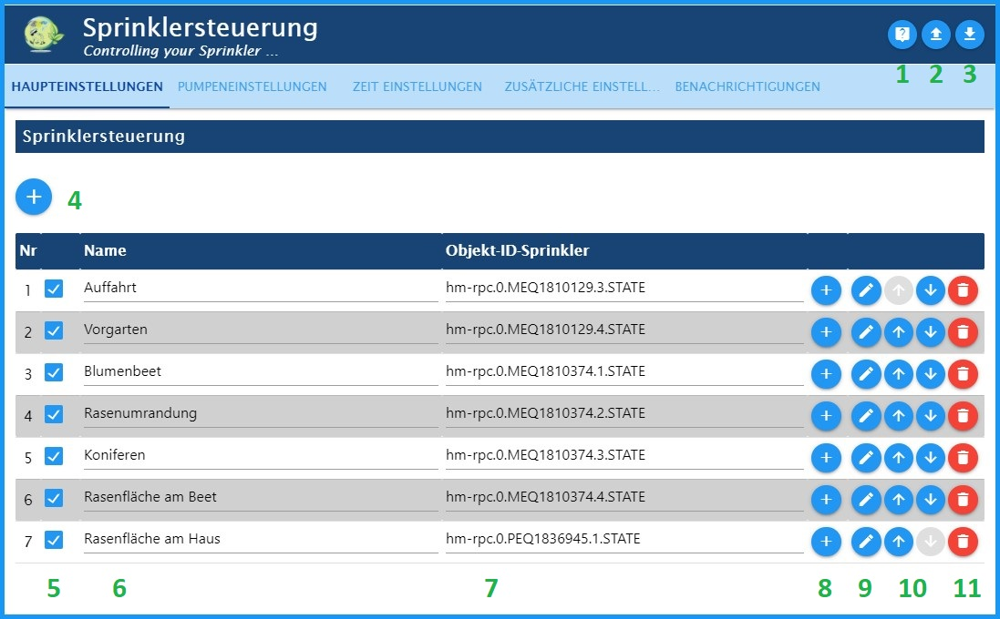
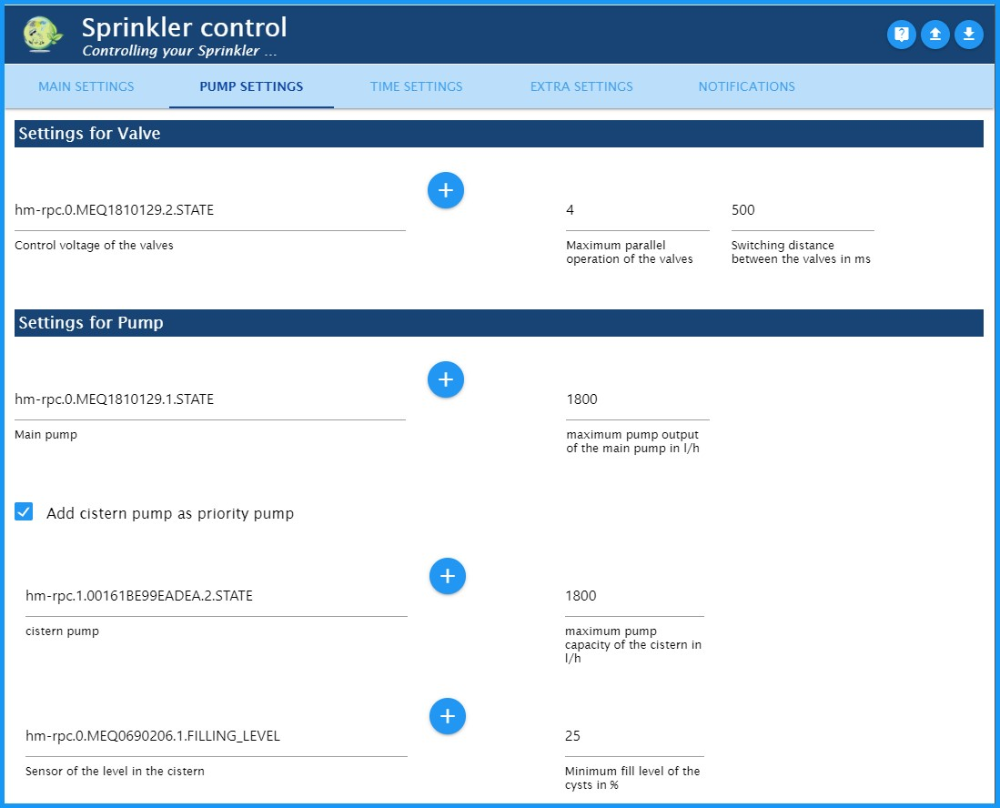

# SprinkleControl
### *Адаптер для погодозависимого автоматического полива сада.* (с помощью датчика погоды HmIP-SWO-PL – plus)
К сожалению, мои познания в английском слишком малы для описания адаптера.
Буду очень благодарен за любую помощь с переводом.

---
---

## Способ действия
- - -

Данные об окружающей среде (температура, влажность, яркость, скорость ветра, количество осадков) оцениваются в Sprinkle Control.
Определенное таким образом испарение используется для определения теоретической влажности почвы отдельных зон орошения.
В момент времени, указанный в разделе «Настройки времени», активируются контуры полива, которые опускаются ниже определенного процента.
Эти различные контуры орошения затем контролируются таким образом, чтобы максимальная производительность насоса (л/ч) и максимальное количество контуров орошения не были превышены.
Оба параметра настраиваются.

**Пример поведения переключения в течение дня (время начала работы всех клапанов: 6:00)**

Мой полив работает с датчиком погоды Homematic IP plus (HmIP-SWO-PL) и **был протестирован только с ним**.
Однако на форуме ioBroker есть также некоторые тесты, которые проводятся с метеостанциями через адаптер Sainlogic.

---
---

## Установка
- - -

Экземпляр адаптера управления поливом устанавливается через интерфейс администратора ioBroker путем нажатия на знак плюс (+).
В зависимости от активного репозитория, указанного в адаптере администратора, будет установлена стабильная (по умолчанию) или бета-версия (последняя).

---
---

## Конфигурация адаптера - ОСНОВНЫЕ НАСТРОЙКИ
- - -

* 1: Перейти на страницу Sprinkle Control на GitHub
* 2: Загрузить конфигурацию адаптера из файла
* 3: Сохранить конфигурацию адаптера из файла
* 4: Добавить новый круг полива
* 5: Флажок для включения/выключения контура орошения
* 6: Название круга полива автоматически считывается из объектов при выборе идентификатора и затем может быть изменено по мере необходимости.
* 7: Уникальный идентификатор точки данных, которая будет контролироваться в объектах
* 8: Изменить выбранный исполнительный механизм полива
* 9: Открыть индивидуальную конфигурацию соответствующего контура орошения
* 10: Переместить позицию строки
* 11: Удалить контур полива со всеми настроенными данными!

- - -

### Индивидуальная конфигурация оросительного контура
- - -

Откройте индивидуальную конфигурацию соответствующего контура орошения.

**Настройки полива**

- *Время полива в мин:* Установите время полива в минутах. Оно удлиняется по мере того, как триггер опускается ниже "самого низкого процента влажности почвы".
- *максимальное продление полива в %:* Ограничение продолжительности полива в процентах (100% = продолжительность полива не продлевается).
- *Интервал полива в мин.:* Время полива делится на интервалы. (например, 5 минут полива, не менее 5 минут перерыва, 5 минут полива и т. д.)
- **Подсказка:** У меня есть решетка для газона у входа. Здесь вода стекает по склону только при поливе. Я смог противостоять этому, поливая с интервалами.

**Точка включения полива**

- *Точка включения (влажность почвы) клапанов полива в %:* Порог включения: Если это значение не достигнуто, полив начинается с момента начала.
- *Влажность почвы = 100% после полива:* При активации влажность почвы устанавливается на 100% после полива. В противном случае она останется чуть ниже из-за испарения во время полива.

**максимальная влажность почвы**

- *максимальная влажность почвы после полива в (мм):* Максимальное теоретическое содержание воды в почве после полива. Чем выше это значение, тем длиннее интервалы полива.
- **Подсказка:** Сетка газона: 5; Клумба: 10; Площадь газона: 14
- *максимальная влажность почвы после дождя в (мм):* Максимальное теоретическое содержание воды в почве после сильного дождя. Это значение должно быть больше, чем после полива!
- **Подсказка:** Сетка газона: 6; Клумба: 15; Площадь газона: 19

- - -

#### Индивидуальная конфигурация контура полива - ОСНОВНЫЕ НАСТРОЙКИ
- - -

**Расход воды на разбрызгиватели**

- *Расход в л/ч:* Удельный расход текущей оросительной станции
- **Подсказка:** часто встречается в инструкции по эксплуатации или в Интернете.
- *Усилитель:* Удаляет все активные контуры орошения из сети на 30 секунд, а затем снова включает их.
- **Подсказка:** Мой насос выдает максимум 1800 л/ч, а моим газонным разбрызгивателям нужно 1400 л/ч, но при полном давлении, чтобы они запустились. С функцией усилителя я также могу поливать свои хвойные деревья с помощью капельной линии, которой нужно всего 300 л/ч.

> - **Опасность:** Эту функцию следует использовать очень экономно, так как только один контур полива может осуществлять полив при активном усилителе одновременно.

---
---

#### Индивидуальная конфигурация контура полива - НАСТРОЙКИ НАСОСА
- - -

**Настройки для Valve**

- *Управляющее напряжение клапанов:* Нажатие на символ (+) открывает окно Select-ID State. Здесь вы можете выбрать СОСТОЯНИЕ для управляющего напряжения клапанов. Этот выход становится активным, как только один из клапанов активен.

Если вам не нужен этот ШТАТ, оставьте это поле пустым!

- *Максимальная параллельная работа клапанов:* Здесь можно ограничить количество активных клапанов. Например, если выход управляющего трансформатора недостаточен для параллельного включения нескольких клапанов.
- *Расстояние переключения между клапанами в мс:* Введите время в миллисекундах. Это время ожидания до переключения следующего клапана, что означает, например, что 6 выходов переключаются один за другим, а не одновременно.

**Настройки для насоса**

- *Основной насос:* Нажатие на символ (+) открывает окно Select ID. СОСТОЯНИЕ насоса, отвечающего за подачу воды, сохраняется здесь.
- *максимальная производительность насоса основного насоса в л/ч:* Максимальная производительность насоса сохраняется здесь. Это затем ограничивает контуры орошения, так что достаточное давление все еще подается на клапаны.
- **Опасность:** Здесь необходимо указать фактическую производительность насоса. А не ту, что на заводской табличке. Например, у меня есть «Gardena 5000/5 LCD», которая из-за длины линии выдает производительность всего 1800 л/ч, а не 4500 л/ч, как указано на заводской табличке.

**Добавить насос для сливного бачка**

- *Добавить насос сливного бачка в качестве приоритетного насоса*
- *насос бачка:* Здесь вводится насос бачка. Он отключается, если уровень в бачке слишком низкий. В этом случае основной насос продолжает поливать.
- *максимальная производительность насоса бачка в л/ч:* Максимальная производительность насоса в л/ч сохраняется здесь. См. Регулировка основного насоса.
- *Датчик уровня в бачке:* СОСТОЯНИЕ датчика уровня для определения уровня в диапазоне 0...100%.
- *встроенный:* емкостный измеритель уровня Hm-Sen-Wa-Od от HomeMatic.
- *Минимальный уровень заполнения цист в %:* Если он не достигнут, точка переключения переключается на главный насос, а клапаны регулируются в соответствии с объемом, потребляемым во время полива.

---
---

## Конфигурация адаптера - НАСТРОЙКИ ВРЕМЕНИ
- - -

На этой вкладке можно задать время начала управления поливом.

###Настройки времени начала
- *Время начала полива:*
- *Начать с фиксированного времени начала:* **Время начала недели** можно установить здесь.
- *Время начала на восходе солнца:* Вот время начала на восходе солнца. Его можно сдвинуть от -120 мин до + 120 мин с помощью **Сдвига времени в мин**.
- *Время начала в конце золотого часа:*

###Настройки времени начала в выходные дни
- *разное время начала полива в выходные дни:* Если вы хотите начать полив в другое время в выходные дни, чтобы, например, не беспокоить соседей, вы можете активировать эту функцию здесь.
- *Время начала в выходные:*

###Настройки времени начала в праздничные дни
- *Время начала государственных праздников как выходных:* Если государственные праздники следует рассматривать как выходные, это можно активировать здесь.
- *Экземпляр государственных праздников* Затем здесь необходимо выбрать внешний экземпляр государственных праздников (например, адаптер «Deutsche Feiertage»).

---
---

## Конфигурация адаптера - ДОПОЛНИТЕЛЬНЫЕ НАСТРОЙКИ
- - -

### Астронастройки
SprinkleControl берет широту и долготу из настроек системы ioBroker.
SprinkleControl использует эти значения для расчета положения солнца и внеземного излучения для испарения.

### Настройки отладки
При активации в журнале отображается дополнительная информация. Это позволяет быстрее анализировать ошибки.

### Настройка дополнительных уведомлений
Активируйте вкладку «Уведомления». Настройки связи затем будут сделаны на новой вкладке «Уведомления».

### Датчики "(Homematic HmIP-SWO-PL)" для расчета испарения
> - **Опасность:** Программа адаптирована под "HomeMatic метеостанцию HmIP-SWO-PL" для расчета испарения! Без этих данных никакие контуры полива не запускаются.

- Но я слышал на форуме, что программа также работает с погодными данными через «Sainlogic Adapter».
- Датчики рассчитывают максимально возможное испарение потенциальной эвапотранспирации по Пенману ETp и таким образом управляют системой орошения.

Это происходит каждый раз при изменении температуры.

### Прогноз погоды
- Если вы активируете поле «Использовать прогноз погоды», появится поле выбора. Здесь необходимо выбрать экземпляр адаптера «Das Wetter».

"Путь 2: XML-файл с 5-дневным прогнозом погоды и подробной информацией на каждые 3 часа" должен быть заполнен в адаптере "Das Wetter", чтобы SprinkleControl мог получить доступ к объекту **"daswetter.0.NextDaysDetailed.Location_1.Day_1.rain_value"**. Это значение затем используется для отсрочки полива, когда предполагается дождь.

---
---

## Конфигурация адаптера - УВЕДОМЛЕНИЯ
- - -

- После активации вкладки УВЕДОМЛЕНИЯ вы можете выбрать способ уведомления и ввести здесь свои данные.
- Поддерживаются следующие методы оповещения:
  - Электронная почта
- Пустячок
- Телеграмма
- Вотсап

---
---

## Администратор => Объект =>sprinkcontrol.0.
- - -

### Контроль
- **Праздник:** Если "Праздник" установлен на true, полив начнется как в выходные, если включена настройка выходных. Здесь также возможно подключение к календарю.
- **addStartTimeSwitch** - Отображается только в том случае, если в разделе «Конфигурация», «Дополнительное время запуска» выбран запуск с внешним сигналом.
- **autoOnOff:** При значении «Выкл.» автоматический режим работы системы полива отключается.
- **autoStart** - Запуск орошения => Все активные контуры запущены!
- **parallelOfMax:** Например (3: 4). Здесь активны три из четырех возможных кругов орошения. (Это просто реклама!)
- **restFlow:** Отображение возможного остаточного расхода насоса. (Это всего лишь реклама!)

### Испарение
- **ETpCurrent:** Это текущее испарение как суточное значение в мм/день.
- **ETpToday:** Текущее суточное значение испарения отображается здесь. Оно будет перемещено в ETpYesterday в 00:05, а затем сброшено до 0.
- **ETpYesterday:** Здесь показано вчерашнее испарение.

### Информация
- **cisternState** При необходимости здесь отображается состояние сливного бачка и его статус.
- **nextAutoStart** Указывает на следующий запуск системы полива.
- **rainToday** Здесь отображается прогноз осадков на сегодня. Для этого необходим адаптер "the weather".
- **rainTomorrow** Прогноз осадков на завтра от адаптера «Погода».

### Посыпать.*.
- **история**
- **curCalWeekConsumed:** Текущее недельное потребление оросительного контура в литрах
- **curCalWeekRunningTime:** текущее общее недельное время работы оросительного контура
- **lastCalWeekConsumed:** потребление воды за последнюю неделю в литрах в контуре орошения
- **lastCalWeekRunningTime:** общее время работы цикла полива за последнюю неделю
- **lastConsumed:** Расход воды во время последнего полива в литрах
- **lastOn:** последний запуск цикла полива (05.07 14:14)
  - **lastRunningTime:** продолжительность последнего полива.
- **actualSoilMoisture** Это текущая виртуальная влажность почвы в % => критерий срабатывания (макс. 100% после орошения, более 100% после сильного дождя). Внимание: это значение может значительно отличаться от фактической влажности почвы.
- **autoOn** Автоматически включено (Здесь можно отключить автоматический полив этого контура, например, во время ремонта, при этом ручной полив возможен в любое время.)
- **обратный отсчет** оставшегося времени полива
- **runningTime** Продолжительность полива
- Если здесь введено число больше 0, цикл полива начнется через указанное время в минутах.
- Если ввести 0, полив поливного круга будет прекращен.
- **sprinklerState** Отображение состояния оросительного контура.
- выкл.(0) → Контур орошения выключен.
- wait(1) → Контур орошения ожидает, когда мощность насоса станет доступной.
- вкл(2) → Круг орошения вкл.
- break(3) → Цикл полива был прерван (конфигурация, интервал полива)
- Boost(4) → Функция усиления текущего контура орошения активна (конфигурация, усиление включено).
- выкл.(Boost)(5) → Контур орошения прерывается на 30 с, так как активна функция Boost.

## Changelog

<!--
  Placeholder for the next version (at the beginning of the line):
  ### **WORK IN PROGRESS**
-->
### 0.2.15 (2025-06-01)
* (Dirk-Peter-md) Readme updated
* (Dirk-Peter-md) Fixed an error when switching off with autoOnOff
* (Dirk-Peter-md) ioBroker-Bot [W028]

### 0.2.14 (2025-03-15)
* (Dirk-Peter-md) eslint-config added
* (Dirk-Peter-md) Dependencies updated
* (Dirk-Peter-md) Update License
* (Dirk-Peter-md) issue #92 Sprinkler im Gewächshaus solved
* (Dirk-Peter-md) add Button control.autoStart

### 0.2.13 (2022-09-06)
* (Dirk-Peter-md) various bugs fixed
* (Dirk-Peter-md) Preparing the stable release

### 0.2.12 (2022-07-17)
* (Dirk-Peter-md) fixDay(twoNd,threeRd) => postpone by one day
* (Dirk-Peter-md) Bug fixed => autoOn
* (Dirk-Peter-md) Additional post-watering => in case of high evaporation / switchable externally

### 0.2.11 (2022-05-22)
* (Dirk-Peter-md) Bug fixed => analog soil moisture sensor with negative characteristic
* (Dirk-Peter-md) Attention => maximum soil moisture in rain now in %

## License
MIT License

Copyright (c) 2020 - 2025     Dirk Peter     <dirk.peter@freenet.de>

Permission is hereby granted, free of charge, to any person obtaining a copy
of this software and associated documentation files (the "Software"), to deal
in the Software without restriction, including without limitation the rights
to use, copy, modify, merge, publish, distribute, sublicense, and/or sell
copies of the Software, and to permit persons to whom the Software is
furnished to do so, subject to the following conditions:

The above copyright notice and this permission notice shall be included in all
copies or substantial portions of the Software.

THE SOFTWARE IS PROVIDED "AS IS", WITHOUT WARRANTY OF ANY KIND, EXPRESS OR
IMPLIED, INCLUDING BUT NOT LIMITED TO THE WARRANTIES OF MERCHANTABILITY,
FITNESS FOR A PARTICULAR PURPOSE AND NON INFRINGEMENT. IN NO EVENT SHALL THE
AUTHORS OR COPYRIGHT HOLDERS BE LIABLE FOR ANY CLAIM, DAMAGES OR OTHER
LIABILITY, WHETHER IN AN ACTION OF CONTRACT, TORT OR OTHERWISE, ARISING FROM,
OUT OF OR IN CONNECTION WITH THE SOFTWARE OR THE USE OR OTHER DEALINGS IN THE
SOFTWARE.