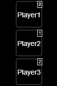
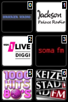
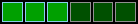
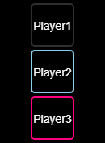
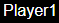
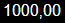
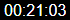
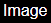
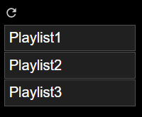
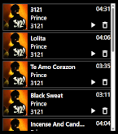

# Виджеты SqueezeboxRPC для VIS 1

В этом документе описаны все виджеты VIS 1, поставляемые с адаптером. Сначала добавьте виджет **Players** , настройте его экземпляр адаптера и ссылайтесь на этот виджет из других элементов управления и дисплеев.

## Оглавление

- [Игроки](#players)
- [Избранное](#favorites)
- [Кнопка воспроизведения](#play-button)
- [Кнопка «Вперед»](#forward-button)
- [Кнопка перемотки назад](#rewind-button)
- [Кнопка повтора](#repeat-button)
- [Кнопка перемешивания](#shuffle-button)
- [Ползунок громкости](#volume-bar)
- [SyncGroup](#syncgroup)
- [Игровой бар](#playtime-bar)
- [Нить](#string)
- [Число](#number)
- [Дата и время](#datetime)
- [Изображение](#image)
- [Плейлист](#playlist)
- [Детали плейлиста](#playlistdetail)
- [Браузер](#browser)

## Игроки

Выбирает активный LMS-плеер и выступает в качестве точки подключения для других виджетов SqueezeboxRPC.

| Параметр                                                          | По умолчанию         | Описание                                                                                                            |
| ----------------------------------------------------------------- | -------------------- | ------------------------------------------------------------------------------------------------------------------- |
| Экземпляр SqueezeboxRPC (`ainstance` )                            | —                    | Экземпляр адаптера, в котором загружены плееры.                                                                     |
| Формат виджета (`formattype` )                                    | `formatbutton`       | Отображает кнопки проигрывателя или компактное поле выбора. Для работы SyncGroup требуется указание формата кнопок. |
| Вспомогательная функция просмотра индекса (`viewindex` )          | —                    | Вспомогательная функция VIS 1 используется для обращения к настроенным записям проигрывателя.                       |
| Wrap CamelCase (`wrapcamelcase` )                                 | На                   | Позволяет переносить длинные метки проигрывателя в формате CamelCase.                                               |
| Вспомогательная функция режима редактирования (`editmodehelper` ) | На                   | Отображает индексы в редакторе для упрощения индивидуальной настройки.                                              |
| ширина / высота изображения                                       | `50` /`50` px        | Размер каждой кнопки игрока.                                                                                        |
| Непрозрачность                                                    | `0.5`                | Отображается прозрачность неактивных кнопок.                                                                        |
| Ширина/стиль границы                                              | `2px` /`solid`       | Размеры границы кнопки и стиль границы в CSS.                                                                       |
| Обычный / активный цвет границы                                   | `#2e2e2e` /`#87ceeb` | Цвета рамок для неактивных и выбранных игроков.                                                                     |
| Радиус границы                                                    | `5px`                | Радиус скругления углов.                                                                                            |
| Цвет фона                                                         | `#000000`            | Фон кнопки и сгенерированное фоновое изображение текста.                                                            |
| Отступы кнопки                                                    | `0px`                | Пространство вокруг каждой кнопки игрока.                                                                           |
| Отдельное изображение / текст                                     | —                    | Изображение и метка для замены в каждом индексе.                                                                    |

Выбранный плеер используется совместно с виджетами, на которые он ссылается. Если пользовательское изображение не настроено, имя плеера отображается в виде текстового изображения.

## Избранное

Отображает избранные треки, предоставленные LMS, и запускает воспроизведение избранного трека на выбранном плеере.

| Параметр                                                          | По умолчанию         | Описание                                                                                    |
| ----------------------------------------------------------------- | -------------------- | ------------------------------------------------------------------------------------------- |
| Виджет игроков (`widgetPlayer` )                                  | —                    | Ссылка на виджет Players, который предоставляет информацию об экземпляре и активном игроке. |
| Просмотреть индекс (`viewindex` )                                 | —                    | Вспомогательная функция VIS 1 для назначения параметров избранным.                          |
| Вспомогательная функция режима редактирования (`editmodehelper` ) | На                   | Отображает избранные индексы во время редактирования.                                       |
| ширина / высота изображения                                       | `50` /`50` px        | Размер каждой кнопки избранного.                                                            |
| Непрозрачность                                                    | `0.5`                | Прозрачность неактивных кнопок избранного.                                                  |
| Ширина/стиль границы                                              | `2px` /`solid`       | Размеры границ и стиль границ в CSS.                                                        |
| Обычный / активный цвет границы                                   | `#2e2e2e` /`#87ceeb` | Цвета границ для обычных и активных избранных элементов.                                    |
| Радиус границы                                                    | `5px`                | Радиус скругления углов.                                                                    |
| Цвет фона                                                         | `#000000`            | Фон кнопки.                                                                                 |
| Отступы кнопки                                                    | `0px`                | Пространство вокруг кнопок избранного.                                                      |
| Отдельное изображение / текст                                     | —                    | Изображение и метка для замены в каждом индексе.                                            |

Содержимое остается внутри виджета и становится доступным для вертикальной прокрутки при необходимости. Используется узкая полоса прокрутки.

## Кнопка воспроизведения

Управляет воспроизведением, паузой и остановкой активного проигрывателя и отображает его текущее состояние.

| Параметр                                        | По умолчанию   | Описание                                                          |
| ----------------------------------------------- | -------------- | ----------------------------------------------------------------- |
| Виджет игроков                                  | —              | Источник информации об активном игроке.                           |
| Пауза / воспроизведение / остановка изображения | Встроенный SVG | Дополнительное изображение для каждого состояния воспроизведения. |
| Цвет заливки/обводки в формате SVG              | Белый          | Цвета встроенной иконки.                                          |
| ширина штриха SVG                               | `0.3`          | Толщина обводки встроенной иконки.                                |

Для соответствующего состояния встроенные SVG-изображения заменяются пользовательскими.

## Кнопка «Вперед»

Отправляет команду перехода вперед через кнопку LMS активному плееру.

| Параметр                           | По умолчанию   | Описание                                                |
| ---------------------------------- | -------------- | ------------------------------------------------------- |
| Виджет игроков                     | —              | Источник информации об активном игроке.                 |
| Изображение вперед                 | Встроенный SVG | Дополнительное изображение для пользовательской кнопки. |
| Цвет заливки/обводки в формате SVG | Белый          | Цвета встроенной иконки.                                |
| ширина штриха SVG                  | `0.3`          | Толщина обводки встроенной иконки.                      |

## Кнопка перемотки назад

Отправляет команду возврата в систему управления воспроизведением (LMS) активному плееру.

| Параметр                           | По умолчанию   | Описание                                                |
| ---------------------------------- | -------------- | ------------------------------------------------------- |
| Виджет игроков                     | —              | Источник информации об активном игроке.                 |
| Перемотать изображение             | Встроенный SVG | Дополнительное изображение для пользовательской кнопки. |
| Цвет заливки/обводки в формате SVG | Белый          | Цвета встроенной иконки.                                |
| ширина штриха SVG                  | `0.3`          | Толщина обводки встроенной иконки.                      |

## Кнопка повтора

Отображение и изменения`PlaylistRepeat` для активного игрока.

| Параметр                           | По умолчанию   | Описание                                                                                      |
| ---------------------------------- | -------------- | --------------------------------------------------------------------------------------------- |
| Виджет игроков                     | —              | Источник информации об активном игроке.                                                       |
| Повторить 0 / 1 / 2 изображения    | Встроенный SVG | Дополнительное изображение для состояний "выключено", "повторить один раз" и "повторить все". |
| Цвет заливки/обводки в формате SVG | Белый          | Цвета встроенной иконки.                                                                      |
| ширина штриха SVG                  | `0.3`          | Толщина обводки встроенной иконки.                                                            |

Цикл кликов`0 → 1 → 2 → 0` . Состояние`0` показывает, что повтор отключен, состояние`1` использует значок повтора и состояние`2` Используется включенная иконка повтора. Если изображение состояния 2 не настроено, используется пользовательское изображение состояния 0 или встроенная иконка.

## Кнопка перемешивания

\

Отображение и изменения`PlaylistShuffle` для активного игрока.

| Параметр                           | По умолчанию   | Описание                                                       |
| ---------------------------------- | -------------- | -------------------------------------------------------------- |
| Виджет игроков                     | —              | Источник информации об активном игроке.                        |
| Перемешать 0 / 1 / 2 изображение   | Встроенный SVG | Дополнительные изображения для трех режимов перемешивания LMS. |
| Цвет заливки/обводки в формате SVG | Белый          | Цвета встроенной иконки.                                       |
| ширина штриха SVG                  | `0.3`          | Толщина обводки встроенной иконки.                             |

Каждый щелчок переключает колоду в следующий режим перемешивания и записывает новое значение.`PlaylistShuffle` .

## Ползунок громкости

Отображает громкость активного проигрывателя в виде сегментов и позволяет пользователю установить новый уровень громкости, щелкнув или коснувшись полосы.

| Параметр                         | По умолчанию               | Описание                                                           |
| -------------------------------- | -------------------------- | ------------------------------------------------------------------ |
| Виджет игроков                   | —                          | Источник информации об активном игроке и`Volume` состояние.        |
| Расчет (`calctype` )             | `segstep`                  | Использует шаги сегмента или точное положение указателя.           |
| Сегменты                         | `10`                       | Количество отображаемых сегментов.                                 |
| Ориентация (`position` )         | `vertical`                 | Вертикальное или горизонтальное расположение.                      |
| Обеспечить регресс               | Выключенный                | Изменяет направление визуального восприятия и сопоставление ввода. |
| Неактивное / активное заполнение | `#005000` /`#00ff00`       | Цвета заливки сегментов.                                           |
| Нормальная / активная граница    | Настройки VIS по умолчанию | Цвета границ сегментов.                                            |
| Ширина поля / границы            | `1px` /`1px`               | Межсегментное расстояние и ширина границы.                         |

## SyncGroup

Отображает всех игроков и позволяет пользователю добавлять или удалять игроков из группы синхронизации LMS выбранного игрока.

| Параметр                        | По умолчанию   | Описание                                         |
| ------------------------------- | -------------- | ------------------------------------------------ |
| Виджет игроков                  | —              | Отображает выбранного игрока и список игроков.   |
| Ширина/стиль границы            | `2px` /`solid` | Размеры границ кнопки и CSS-стили.               |
| Цвет границы без группы         | `#2e2e2e`      | Плеер не синхронизирован.                        |
| цвет границы собственной группы | `#87ceeb`      | Игрок принадлежит к группе выбранного игрока.    |
| Цвет границы другой группы      | `#ff0080`      | Игрок принадлежит к другой группе синхронизации. |
| Радиус границы                  | `5px`          | Радиус скругления углов.                         |
| Цвет фона                       | `#000000`      | Фон кнопки.                                      |
| Отступы кнопки                  | `0px`          | Пространство вокруг кнопок.                      |

Выбранного игрока нельзя переключить. Изображения и подписи игроков наследуются от виджета Players, на который дана ссылка.

## Игровой бар

Отображает прошедшее время относительно длительности трека и поддерживает перемотку при нажатии на полосу.

| Параметр             | По умолчанию   | Описание                                             |
| -------------------- | -------------- | ---------------------------------------------------- |
| Виджет игроков       | —              | Запасы`Time` ,`Duration` и состояние команды поиска. |
| Основной цвет полосы | `#909090`      | Фоновая информация на протяжении всего периода.      |
| Цвет времени игры    | `#00ff00`      | Заполнение за прошедшее время.                       |
| Ширина/стиль границы | `2px` /`solid` | Внешняя граница.                                     |
| цвет границы         | `#ffffff`      | Цвет внешней границы.                                |
| Радиус границы       | `2px`          | Радиус скругления углов.                             |

Для потоков без конечной положительной длительности индикатор выполнения остается пустым, а поиск отключен.

## Нить

Отображает строковое значение состояния активного проигрывателя, например, название, исполнитель или альбом.

| Параметр           | По умолчанию | Описание                                   |
| ------------------ | ------------ | ------------------------------------------ |
| Виджет игроков     | —            | Источник информации об активном игроке.    |
| атрибуты игрока    | —            | Отображаемое состояние игрока.             |
| HTML/тестовое поле | —            | VIS 1 поле для форматирования текста/HTML. |

## Число

Отображает числовое значение состояния игрока с возможностью форматирования.

| Параметр                     | По умолчанию   | Описание                                                               |
| ---------------------------- | -------------- | ---------------------------------------------------------------------- |
| Виджет игроков               | —              | Источник информации об активном игроке.                                |
| атрибуты игрока              | —              | Числовое значение состояния игрока для отображения.                    |
| HTML-препендинг / добавление | —              | Текст или разметка до и после значения.                                |
| Десятичные знаки (`digits` ) | Автоматический | При настройке устанавливается фиксированное количество дробных знаков. |
| Десятичная запятая           | На             | В качестве десятичного разделителя используется запятая.               |
| Разделитель тысяч            | Выключенный    | Группирует тысячи в отформатированном значении.                        |
| HTML/тестовое поле           | —              | Поле форматирования VIS 1.                                             |

## Дата и время

Форматирует числовое значение состояния игрока в виде продолжительности или даты/времени.

| Параметр                     | По умолчанию | Описание                                                                                           |
| ---------------------------- | ------------ | -------------------------------------------------------------------------------------------------- |
| Виджет игроков               | —            | Источник информации об активном игроке.                                                            |
| атрибуты игрока              | —            | Числовое состояние для форматирования.                                                             |
| HTML-препендинг / добавление | —            | Текст или разметка до и после результата.                                                          |
| Формат                       | `hh:mm:ss`   | Формат даты/времени; по умолчанию отображаются часы, минуты и секунды.                             |
| Фактор                       | `1000`       | Множитель применяется перед форматированием, что полезно для преобразования секунд в миллисекунды. |
| HTML/тестовое поле           | —            | Поле форматирования VIS 1.                                                                         |

## Изображение

Отображает URL-адрес изображения из активного проигрывателя, чаще всего`ArtworkUrl` .

| Параметр                     | По умолчанию | Описание                                                |
| ---------------------------- | ------------ | ------------------------------------------------------- |
| Виджет игроков               | —            | Источник информации об активном игроке.                 |
| атрибуты игрока              | —            | Отображаемое состояние проигрывателя в формате URL.     |
| Потягиваться                 | Выключенный  | Растягивает изображение до границ виджета.              |
| HTML-препендинг / добавление | —            | Перед отображением вокруг URL-адреса добавляется текст. |
| HTML/тестовое поле           | —            | Поле форматирования VIS 1.                              |

Виджет подписывается на обновления состояния, а также асинхронно загружает начальное значение.

## Плейлист

Открывает сохраненные плейлисты LMS и позволяет пользователю запустить или добавить выбранный плейлист.

| Параметр       | По умолчанию | Описание                                                   |
| -------------- | ------------ | ---------------------------------------------------------- |
| Виджет игроков | —            | Предоставляет активный экземпляр проигрывателя и адаптера. |

Список загружается из LMS по запросу. Этот виджет просматривает сохраненные плейлисты; используйте PlaylistDetail для отображения активной очереди.

## Детали плейлиста

Отображает все треки в текущей очереди активного проигрывателя с обложкой, метаданными, продолжительностью и действиями.

| Параметр                              | По умолчанию              | Описание                                                          |
| ------------------------------------- | ------------------------- | ----------------------------------------------------------------- |
| Виджет игроков                        | —                         | Запасы`Playlist` ,`PlaylistCurrentIndex` и команд действий.       |
| Фон строки                            | `#f5f7fa`                 | Обычный фон строки.                                               |
| Активный/при наведении курсора на фон | `#dbeafe`                 | Фон текущего трека и строк, на которые наведен курсор.            |
| Цвет/ширина/стиль границы             | `#cbd5e1` /`1px` /`solid` | Внешний вид границ строк.                                         |
| Расстояние между строками             | `4px`                     | Вертикальное пространство между рельсами.                         |
| Показать миниатюру                    | На                        | Демонстрирует произведения искусства от`ArtworkUrl` .             |
| Показать указатель                    | На                        | Перед названием отображается номер трека, начинающийся с единицы. |

Текущий трек выделен. Функция «Воспроизвести» запускает выбранный элемент очереди; функция «Удалить» удаляет его только из текущей очереди, а не из сохраненного плейлиста. Положение прокрутки сохраняется после выполнения действий.

## Браузер

Обеспечивает навигацию по иерархии меню LMS и предоставляет доступ к функциям «Далее», «Воспроизвести» и «Добавить», предлагаемым LMS.

| Параметр                      | По умолчанию | Описание                                                             |
| ----------------------------- | ------------ | -------------------------------------------------------------------- |
| Виджет игроков                | —            | Предоставляет экземпляр адаптера и активный плеер.                   |
| Отлаживать                    | Выключенный  | Выводит диагностические данные браузера в консоль браузера.          |
| Отладка получения результатов | Выключенный  | Также регистрирует необработанные ответы LMS при включенной отладке. |

Кнопка "Хлебные крошки" возвращает на предыдущий уровень меню. Доступные действия зависят от пункта меню LMS и установленных плагинов LMS.