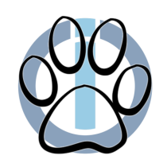

  

# ioBroker.sureflap

## Адаптер для умных устройств для домашних животных от Sure Petcare®

  

  
  

## Конфигурация

Обязательно: укажите имя пользователя и пароль от вашей учетной записи Sure Petcare® на странице настройки адаптера.

Дополнительно: Включить или отключить историю событий в формате JSON и настроить количество элементов. Дополнительно: Установить пороговые значения полного и разряженного заряда батареи при использовании перезаряжаемых батарей. Это влияет на значения процента заряда батареи.

## Описание

Адаптер предоставляет информацию о настройках и состоянии вашей дверцы для животных, дверцы для кошек, кормушки или поилки.

Также отображается местоположение ваших питомцев, а также количество потребленной ими пищи и воды (с помощью кормушки и/или поилки).

Это позволяет вам управлять режимом блокировки и временем закрытия заслонки, а также устанавливать местоположение ваших питомцев.

Для работы адаптера требуется Node 20 или более поздняя версия.

### Изменяемые значения

Следующие состояния можно изменить, и изменения вступят в силу на вашем устройстве и будут отражены в приложении Sure Petcare®.

| состояние                                                              | описание                                                                                                                                                 | допустимые значения                                                                                        |
| ---------------------------------------------------------------------- | -------------------------------------------------------------------------------------------------------------------------------------------------------- | ---------------------------------------------------------------------------------------------------------- |
| HOUSEHOLD\_NAME.HUB\_NAME.control.led\_mode                            | устанавливает яркость светодиодов ступицы.                                                                                                               | **0** - выключено  **1** - высокий  **4** - приглушенный                                             |
| HOUSEHOLD\_NAME.HUB\_NAME.DEVICE\_NAME.control.pets.PET\_NAME.assigned | назначает или отменяет назначение питомца устройству.                                                                                                    | **верно** или **неверно**                                                                                  |
| HOUSEHOLD\_NAME.HUB\_NAME.FEEDER\_NAME.control.close\_delay            | устанавливает задержку закрытия крышки подающего устройства.                                                                                             | **0** - быстро  **4** - нормальный  **20** - медленно                                                |
| HOUSEHOLD\_NAME.HUB\_NAME.FLAP\_NAME.control.curfew\_enabled           | включает или отключает настроенный комендантский час                                                                                                     | **верно** или **неверно**                                                                                  |
| HOUSEHOLD\_NAME.HUB\_NAME.FLAP\_NAME.control.current\_curfew           | устанавливает текущий комендантский час.  Поддерживает 1 (дверца для животных) или до 4 (дверца для кошек) временных интервалов ограничения движения. | **\[{"enabled":true\|false, "lock\_time":"xx:xx", "unlock\_time":"xx:xx"}, ...]**                          |
| HOUSEHOLD\_NAME.HUB\_NAME.FLAP\_NAME.control.lockmode                  | устанавливает режим блокировки                                                                                                                           | **0** - открыто  **1** - блокировка  **2** - блокировка  **3** - закрыто (замок внутри и снаружи) |
| HOUSEHOLD\_NAME.HUB\_NAME.FLAP\_NAME.control.pets.PET\_NAME.type       | устанавливает тип питомца для назначенного питомца и заслонки.                                                                                           | **2** - домашнее животное, гуляющее на улице  **3** - домашний питомец, живущий в помещении             |
| HOUSEHOLD\_NAME.pets.PET\_NAME.inside                                  | определяет, находится ли ваш питомец внутри помещения.                                                                                                   | **верно** или **неверно**                                                                                  |

### Структура

Адаптер создает следующую иерархическую структуру:

адаптер  ├ НАЗВАНИЕ\_СЕМЬИ  │ ├ HUB\_NAME  │ │ ├ онлайн  │ │ ├ serial\_number  │ │ ├ сигнал  │ │ │ ├ device\_rssi  │ │ │ └ hub\_rssi  │ │ ├ версия  │ │ │ ├ прошивка  │ │ │ └ оборудование  │ │ ├ управление  │ │ │ └ led\_mode  │ │ ├ FELAQUA\_NAME  │ │ │ ├ батарея  │ │ │ ├ процент заряда батареи  │ │ │ ├ онлайн  │ │ │ ├ serial\_number  │ │ │ ├ сигнал  │ │ │ │ ├ device\_rssi  │ │ │ │ └ hub\_rssi  │ │ │ ├ версия  │ │ │ │ ├ прошивка  │ │ │ │ └ оборудование  │ │ │ ├ вода  │ │ │ │ ├ fill\_percent  │ │ │ │ ├ last\_filled\_at  │ │ │ │ └ вес  │ │ │ └ управление  │ │ │ └ домашние животные  │ │ │ └ ИМЯ\_ПИТОМЦА  │ │ │ └ назначен  │ │ ├ ИМЯ\_КОРМИЛЬЩИКА  │ │ │ ├ батарея  │ │ │ ├ процент заряда батареи  │ │ │ ├ онлайн  │ │ │ ├ serial\_number  │ │ │ ├ сигнал  │ │ │ │ ├ device\_rssi  │ │ │ │ └ hub\_rssi  │ │ │ ├ версия  │ │ │ │ ├ прошивка  │ │ │ │ └ оборудование  │ │ │ ├ миски  │ │ │ │ └ 0..1  │ │ │ │ ├ fill\_percent  │ │ │ │ ├ food\_type  │ │ │ │ ├ last\_filled\_at  │ │ │ │ ├ Last\_zeroed\_at  │ │ │ │ ├ цель  │ │ │ │ └ вес  │ │ │ └ управление  │ │ │ ├ домашние животные  │ │ │ │ └ ИМЯ\_ПИТОМЦА  │ │ │ │ └ назначен  │ │ │ └ close\_delay  │ │ └ FLAP\_NAME  │ │ ├ батарея  │ │ ├ процент\_заряда\_батареи  │ │ ├ curfew\_active  │ │ ├ last\_enabled\_curfew  │ │ ├ онлайн  │ │ ├ serial\_number  │ │ ├ управление  │ │ │ ├ домашние животные  │ │ │ │ └ ИМЯ\_ПИТОМЦА  │ │ │ │ ├ назначен  │ │ │ │ └ тип  │ │ │ ├ curfew\_enabled  │ │ │ ├ текущий\_комендантский час  │ │ │ └ режим блокировки  │ │ ├ сигнал  │ │ │ ├ device\_rssi  │ │ │ └ hub\_rssi  │ │ └ версия  │ │ ├ прошивка  │ │ └ оборудование  │ ├ история  │ │ └ json  │ │ └ 0..24  │ └ домашние животные  │ └ ИМЯ\_ПИТОМЦА  │ ├ внутри  │ ├ имя  │ ├ с тех пор  │ ├ еда  │ │ ├ last\_time\_eaten  │ │ ├ time\_spent  │ │ ├ times\_eaten  │ │ └ сухой..влажный  │ │ └ вес  │ ├ движение  │ │ ├ last\_direction  │ │ ├ last\_flap  │ │ ├ last\_flap\_id  │ │ ├ last\_time  │ │ ├ время, проведенное\_на\_уличии  │ │ └ times\_outside  │ └ вода  │ ├ last\_time\_drunk  │ ├ time\_spent  │ ├ times\_drunk  │ └ вес  └ информация  ├ все\_устройства\_в\_сети  ├ соединение  ├ last\_update  ├ offline\_devices  └ версия 

## Примечания

SureFlap®, Sure Petcare® и Felaqua® являются зарегистрированными товарными знаками компании [SureFlap Ltd.](https://www.surepetcare.com/)

Изображения устройств SureFlap® предоставляются компанией [Sure Petcare®](https://www.surepetcare.com/en-us/press) для бесплатного использования.

## Changelog

<!--
  Placeholder for the next version (at the beginning of the line):
  ### **WORK IN PROGRESS**
-->

### **WORK IN PROGRESS**

* (Sickboy78) reduce log messages

### 3.4.3 (2026-08-29)

* (Sickboy78) dependency updates
* (copilot) Adapter requires node.js >= 22 now
* (Sickboy78) code refactoring
* (Sickboy78) added unit tests

### 3.4.2 (2026-01-09)

* (Sickboy78) dependency updates
* (Sickboy78) add AlCalzone's Release Script

### 3.4.1 (2025-10-22)

* (Sickboy78) dependency updates
* (Sickboy78) migration to npm trusted publishing

### 3.4.0 (2025-08-11)

* (Sickboy78) removed deprecated util.promisify

### 3.3.0 (2025-07-13)

* (Sickboy78) added translations for unknown pet setting

[Older changelogs can be found there](https://github.com/Sickboy78/ioBroker.sureflap/blob/master/CHANGELOG_OLD.md)

## License

MIT License

Permission is hereby granted, free of charge, to any person obtaining a copy
of this software and associated documentation files (the "Software"), to deal
in the Software without restriction, including without limitation the rights
to use, copy, modify, merge, publish, distribute, sublicense, and/or sell
copies of the Software, and to permit persons to whom the Software is
furnished to do so, subject to the following conditions:

The above copyright notice and this permission notice shall be included in all
copies or substantial portions of the Software.

THE SOFTWARE IS PROVIDED "AS IS", WITHOUT WARRANTY OF ANY KIND, EXPRESS OR
IMPLIED, INCLUDING BUT NOT LIMITED TO THE WARRANTIES OF MERCHANTABILITY,
FITNESS FOR A PARTICULAR PURPOSE AND NONINFRINGEMENT. IN NO EVENT SHALL THE
AUTHORS OR COPYRIGHT HOLDERS BE LIABLE FOR ANY CLAIM, DAMAGES OR OTHER
LIABILITY, WHETHER IN AN ACTION OF CONTRACT, TORT OR OTHERWISE, ARISING FROM,
OUT OF OR IN CONNECTION WITH THE SOFTWARE OR THE USE OR OTHER DEALINGS IN THE
SOFTWARE.

Copyright (c) 2025-2026 Sickboy78 <asmoday_666@gmx.de>