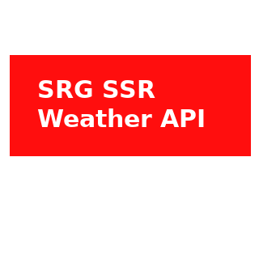
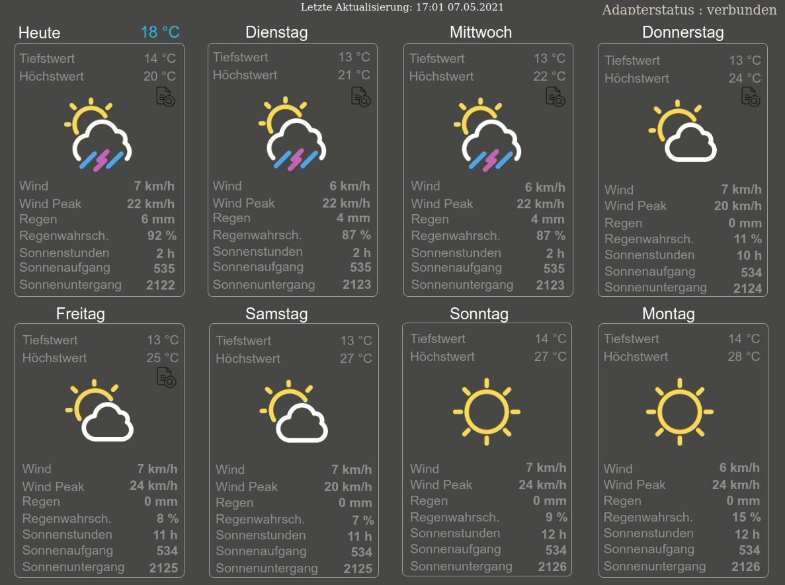
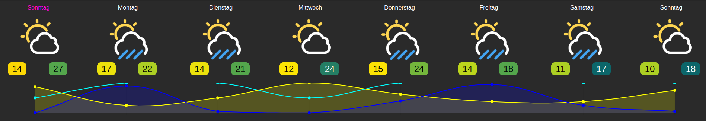

# ioBroker.swiss-weather-api

# swiss-weather-api адаптер для ioBroker

Подключается к замечательному API погоды SRF — версия 2 ( <https://developer.srgssr.ch/api-catalog/srf-weather/srf-weather-description> ). REST API погоды SRF позволяет получать прогнозы погоды и отчеты из более чем 25 000 мест по всей Швейцарии. Подписка "Freemium" предоставляет 50 запросов в день.

## **Обратите внимание:**

1. Данный адаптер поддерживает только местоположение в пределах Швейцарии.
2. Этот адаптер поддерживает SRF Weather API V2.

## **Процедура обновления версии 1.xx до 2.0.x**

- Удалите адаптер (удалите все объекты-адаптеры в ioBroker!).
- Установите адаптер заново => Будут сгенерированы новые объекты
- Поскольку SRF изменил имена путей, обновите Visual Studio: просто [повторно импортируйте представления](https://github.com/baerengraben/ioBroker.swiss-weather-api/tree/master/views) .

## Начиная

1. Получите бесплатный аккаунт на <https://developer.srgssr.ch/>
2. Перейдите в раздел «Приложения» и добавьте новое приложение. Здесь вы можете выбрать API-продукт. «SRF-MeteoProductFreemium» — это их бесплатный продукт. Если вам нужен прогноз только для одного местоположения и вы получаете всего 50 запросов в день (каждые 30 минут) или/и не хотите платить за большее количество запросов в день, выберите «SRF-MeteoProductFreemium». Теперь это создаст специальный ConsumerKey и ConsumerSecret.
3. Узнайте долготу/широту (в десятичных градусах) выбранного местоположения, для которого необходим прогноз. Эта информация необязательна, если вы указали свое местоположение в настройках ioBroker (основные настройки) (через карту). В этом случае вы можете оставить поля широты и долготы пустыми. В этом случае адаптер будет использовать настройки ioBroker. Широта и долгота, введенные в конфигурации адаптера, переопределяют настройки ioBroker.
4. Пользователи бесплатной версии: Обратите внимание, что API SRG запоминает используемое местоположение. Начиная с первого запроса и в течение определенного периода времени, используемая подписка может обрабатывать запросы только для этого одного местоположения.
5. Установите этот адаптер в ioBroker => Это может занять несколько минут (\~7 минут на Raspberry Pi 3)
6. В разделе «Конфигурация адаптера» заполните поля.
   1. Название приложения
   2. ConsumerKey of App
   3. Секрет потребителя приложения
   4. Долгота/широта выбранного вами швейцарского местоположения, для которого необходим прогноз. => Пожалуйста, используйте десятичные градусы (например, Цюрих: 47.36667 / 8.5)
   5. Интервал опроса в минутах (по умолчанию 60 минут - 25 запросов в день)

Первый запрос выполняется через 10 секунд после запуска адаптера. После первого запуска запрос будет выполняться регулярно в соответствии с параметром конфигурации (интервал опроса в минутах). Объекты в forecast.current\_hour будут созданы через 30 секунд после первого запуска и обновляться каждый час путем копирования соответствующих значений из forecast.hours.

### Пример визуализации

###### Предварительное условие:

- Адаптер [Material Design Widgets](https://github.com/Scrounger/ioBroker.vis-materialdesign) >= 0.5.7
- Адаптер [Вис](https://github.com/iobroker/iobroker.vis/blob/master/README.md)
- [Импорт представлений в визуализацию](https://github.com/baerengraben/ioBroker.swiss-weather-api/tree/master/views)

###### Пример

Простой пример:

Расширенный пример:

Пример обзора недели:

## Changelog
### 2.2.2 (2024-11-01)
* (baerengraben) Fix for https://github.com/baerengraben/ioBroker.swiss-weather-api/issues/125

### 2.2.1 (2024-11-01)
* (baerengraben) Fix for https://github.com/baerengraben/ioBroker.swiss-weather-api/issues/78

### 2.2.0 (2024-10-30)
* (baerengraben) [Wochensicht_reduziert neu als View und mit Legende](https://github.com/baerengraben/ioBroker.swiss-weather-api/issues/112)

### 2.1.1 (2024-10-29)
* (baerengraben) Fix for https://github.com/baerengraben/ioBroker.swiss-weather-api/issues/124
* (baerengraben) Fix for https://github.com/baerengraben/ioBroker.swiss-weather-api/issues/123
* (baerengraben) Fix for https://github.com/baerengraben/ioBroker.swiss-weather-api/issues/122
* (baerengraben) Fix for https://github.com/baerengraben/ioBroker.swiss-weather-api/issues/121

### 2.1.0 (2024-01-10)
* (baerengraben) Added additional Week-View. Credits goes to https://github.com/pingus01

## License
MIT License

Copyright (c) 2024 baerengraben <baerengraben@intelli.ch>

Permission is hereby granted, free of charge, to any person obtaining a copy
of this software and associated documentation files (the "Software"), to deal
in the Software without restriction, including without limitation the rights
to use, copy, modify, merge, publish, distribute, sublicense, and/or sell
copies of the Software, and to permit persons to whom the Software is
furnished to do so, subject to the following conditions:

The above copyright notice and this permission notice shall be included in all
copies or substantial portions of the Software.

THE SOFTWARE IS PROVIDED "AS IS", WITHOUT WARRANTY OF ANY KIND, EXPRESS OR
IMPLIED, INCLUDING BUT NOT LIMITED TO THE WARRANTIES OF MERCHANTABILITY,
FITNESS FOR A PARTICULAR PURPOSE AND NONINFRINGEMENT. IN NO EVENT SHALL THE
AUTHORS OR COPYRIGHT HOLDERS BE LIABLE FOR ANY CLAIM, DAMAGES OR OTHER
LIABILITY, WHETHER IN AN ACTION OF CONTRACT, TORT OR OTHERWISE, ARISING FROM,
OUT OF OR IN CONNECTION WITH THE SOFTWARE OR THE USE OR OTHER DEALINGS IN THE
SOFTWARE.