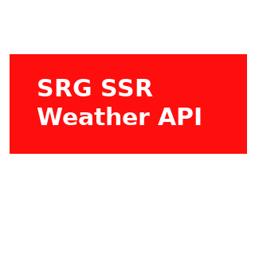

# IoBroker.swiss-weather-api
** Процедура обновления с версии 1.0.1 до 1.0.x **

- Просто обновите в ioBroker. Никаких специальных дополнительных действий не требуется

** Процедура обновления с версии 1.0.0 до 1.0.1 **

- В версии 1.0.1 я исправляю проблему https://github.com/baerengraben/ioBroker.swiss-weather-api/issues/57
- На основании обсуждения [этого] (https://forum.iobroker.net/topic/46975/vis-widgethintergrund-farbe-durch-objektdatenpunkt-steuern) в идентификаторах нельзя использовать двоеточия. Поэтому я удалил двоеточия, которые использовались для часов, без замены, а также опустил секунды. например старый 01:00:00 => новый 0100)

Это изменение требует повторного создания идентификаторов. Итак, чтобы установить версию 1.0.1, текущий работающий экземпляр адаптера должен быть полностью удален и заменен новым экземпляром.

- Поскольку идентификаторы изменились с версией 1.0.1, визуальные представления также пришлось адаптировать. Вы можете получить обновленные представления [здесь] (https://github.com/baerengraben/ioBroker.swiss-weather-api/tree/master/views) и импортировать их в ioBroker-Visu.

** Процедура обновления версии 0.3.2 до 0.9.x **SRG полностью перестроила свой API. Старый API (<= версия адаптера 0.3.2) больше НЕ поддерживается. Начиная с версии адаптера 0.9.x используется новый API SRG. Вот почему необходимо создать новое приложение SRG (например, продукт «Freemium») (https://developer.srgssr.ch/apis/srf-weather). См. Также Readme, раздел «Начало работы» (ниже). Также обратите внимание, что новый API также будет создавать совершенно новые объекты.
Хорошая новость заключается в том, что новый API также предоставляет больше данных. ;)**

Итак, моя рекомендация по обновлению с 0.3.2 до 0.9.x:

- удалите старый адаптер перед установкой версии 0.9.x.
   - обратите внимание, что объекты данных также будут удалены соответственно.
- создать новое бесплатное приложение на портале разработчика srg (https://developer.srgssr.ch/apis/srf-weather)
- установите новую версию 0.9.x и настройте конфигурацию с помощью новых ключей consumerkey и consumersecret
  - при запуске новый адаптер создаст новые, разные объекты данных.

## Swiss-weather-api адаптер для ioBroker
Подключается к отличному API погоды SRF (https://developer.srgssr.ch/apis/srf-weather).
API-интерфейс SRF Weather REST позволяет получать прогнозы погоды и отчеты из более чем 25 000 мест по всей Швейцарии. Подписка «Freemium» позволяет получать 50 запросов в день.

## **Иконки**
Начиная с версии 0.1.8, SRG-SSR предоставляет собственные значки. Таким образом, каждая точка данных предоставляет URL-адрес соответствующей погодной ситуации (цветные, темные и светлые значки).

## **Имейте в виду, что этот адаптер поддерживает только местоположения в Швейцарии.**
### Начиная
1. Получите бесплатный аккаунт на https://developer.srgssr.ch/.
1. Перейдите в «Мои приложения» и создайте новое приложение. Здесь вы можете выбрать товар. «Freemium» - это их бесплатный продукт. Если вы хотите выполнять только 50 запросов в день (каждые 30 минут) или / и не хотите платить за большее количество запросов в день, вы хотите выбрать «Freemium». Теперь это создаст определенные ConsumerKey и ConsumerSecret.
1. Узнайте долготу / широту (в десятичных градусах) выбранного места, для которого требуется прогноз. Эта информация не является обязательной, если вы указали свое местоположение в настройках ioBroker (основные настройки) (через карту). В этом случае вы можете оставить поля широты и долготы пустыми. Затем адаптер принимает настройки ioBroker. Широта и долгота, введенные в конфигурации адаптера, имеют приоритет над настройками ioBroker.
1. Установите этот адаптер на ioBroker => Это может занять несколько минут (~ 7 минут на Raspberry Pi 3).
1. В разделе «Конфигурация адаптера» введите
   1. Название приложения
   1. ConsumerKey приложения
   1. ConsumerSecret приложения
   1. Долгота / широта выбранного швейцарского местоположения, для которого требуется прогноз. => Используйте десятичные градусы (например, Цюрих: 47,36667 / 8,5)
   1. Интервал опроса в минутах (по умолчанию 30 минут - 50 запросов в день)

Первый запрос выполняется через 10 секунд после запуска адаптера. После первого запуска запрос будет выполняться регулярно в соответствии с параметром конифугирования (Интервал опроса в минутах).
Объекты в файле прогноз.current_hour будут созданы через 30 секунд после первого запуска и обновляться каждый час путем копирования соответствующих значений из прогноза за 60 минут.

### Пример визуализации
###### Предпосылка:
* Адаптер [Виджеты материального дизайна] (https://github.com/Scrounger/ioBroker.vis-materialdesign)> = 0.5.7
* Адаптер [Vis] (https://github.com/iobroker/iobroker.vis/blob/master/README.md)
* [Импортировать просмотры в Vis] (https://github.com/baerengraben/ioBroker.swiss-weather-api/tree/master/views)

###### Пример

## Changelog

### 1.0.2
* (baerengraben) Fixing https://github.com/baerengraben/ioBroker.swiss-weather-api/issues/51
* (baerengraben) Fixing https://github.com/baerengraben/ioBroker.swiss-weather-api/issues/53

### 1.0.1
* (baerengraben) Fixing https://github.com/baerengraben/ioBroker.swiss-weather-api/issues/57
This change makes it necessary to regenerate IDs. So, to install version 1.0.1, the currently running adapter instance must be completely removed and replaced with a new instance.

### 1.0.0
* (baerengraben) Bugfix https://github.com/baerengraben/ioBroker.swiss-weather-api/issues/64  

### 0.9.9
* (baerengraben) Workaround for SRG Certificate Problem: https://github.com/baerengraben/ioBroker.swiss-weather-api/issues/63  

### 0.9.8
* (jobe451)  Bugfix: JsonChart is missing 15h and 16h as x-labels

### 0.9.7
* (baerengraben)  Bugfix - RC2 for stable release.

### 0.9.6
* (baerengraben)  Bugfix - RC for stable release.

### 0.9.5
* (baerengraben)  Some small improvements

### 0.9.4
* (baerengraben)  Bugfix: https://github.com/baerengraben/ioBroker.swiss-weather-api/issues/47 

### 0.9.3
* (baerengraben)  Function Update: Added day_name to identify weekday from "forecast.day.day0.day_name" to "forecast.day.day7.day_name". 
* (baerengraben)  Added last_run as Object on swiss-weather-api.0.info.lastrun.
* (baerengraben)  Added JsonChart Object on swiss-weather-api.0.forecast.60minutes.day(0-4).JsonChart.
* (baerengraben)  Added some Examples how to do visualisation (folder views) based on https://forum.iobroker.net/topic/32232/material-design-widgets-wetter-view 

### 0.9.2
* (baerengraben)  Function Update: The current weather information is provided as a forecast.current_hour object. Every hour this information is updated. This is done every hour by copying the corresponding values from forecast.60minutes.day0.<current_time>. So no new http request will be executed. The values are only copied from the forecast objects. This makes it easier to display the current weather in the visualization.

### 0.9.1
* (baerengraben)  Fix to reduce amount of Rest-Calls: https://github.com/baerengraben/ioBroker.swiss-weather-api/issues/41
* (baerengraben)  Fix for https://github.com/baerengraben/ioBroker.swiss-weather-api/issues/32 (Crashes when no Internet Connection is available)
* (baerengraben)  Partly Fix for https://github.com/baerengraben/ioBroker.swiss-weather-api/issues/24: Handling Adapter State Info.

### 0.9.0
* (baerengraben)  Removed NodeJs 10 support and added NodeJs 16 support 
* (baerengraben)  Update to new SRF Weater API (https://developer.srgssr.ch/apis/srf-weather). Attention: Old Weather-API (Adapter Version 0.3.2 and earlier) will be decommissioned on Sept. 2021)
* (baerengraben)  Removed Icon-Support from https://erikflowers.github.io/weather-icons/ since SRF is providing their own icons.

### 0.3.2
* (baerengraben)  Fix for https://github.com/baerengraben/iobroker.swiss-weather-api/issues/13.

### 0.3.1
* (baerengraben)  Adapter-Config attributes longitude & latitude is optional now. If no longitude/latitude is set, the adpater is getting the longitude/latitude from ioBroker System-Attributes (https://github.com/baerengraben/iobroker.swiss-weather-api/issues/6).

### 0.3.0
* (baerengraben)  Change from Scheduled Adapter to Deamon Adapter(https://github.com/baerengraben/iobroker.swiss-weather-api/issues/11). The query interval is now configurable by parameter. The first query is made 10s after the adapter was started. Attention: For installing this version, please delete the older adapter version completely and install it again.

### 0.2.3
* (baerengraben) Update Dependencies

### 0.2.2
* (baerengraben) Some bug fixing
* (baerengraben) Enhancement https://github.com/baerengraben/iobroker.swiss-weather-api/issues/10

### 0.2.0
* (baerengraben) Updates in order to commit to iobroker stable

### 0.1.9
* (baerengraben) Dependency- and Vulnerabilites-Updates

### 0.1.8
* (baerengraben) Added Icons provided by SRGSSR => Thank you!! :)
* (baerengraben) Added new Object icon-url-srgssr => Contains the url-link to the srgssr Icon

### 0.1.7
**Attention**: If you have already installed a previous Version of swiss-weather-api (<= 0.1.6) please remove the adapter and install it completely new. This makes shure you get the new Unit-Names for "fff" and "ffx3" which where corrected by SRG. 
* (baerengraben) Added Icon-Codes -17 to -30 => These are not yet confirmed by srf - but I beleave these are correct.  
* (baerengraben) SRG is now providing the correct unit-names for "fff" and "ffx3". Adaptet this in the swiss-weather-adapter. **Attention**: You have to reinstall the swiss-weather-api (remove and install new Version) to make shure the Object-Name gets this Update.

### 0.1.6
* (baerengraben) Some fixes based on Feedback of forum.iobroker.net

### 0.1.5
* (baerengraben) Some fixes based on Feedback of forum.iobroker.net

### 0.1.4
* (baerengraben) Added Travis CI testing

### 0.1.3
* (baerengraben) Role-Definitions updated and added attribute 'icon-name'.

### 0.1.2
* (baerengraben) Some fixes.

### 0.1.0
* (baerengraben) Running version. Reads the complete weather forecast from https://api.srgssr.ch

### 0.0.2
* (baerengraben) first running version. Reads Current Forecast (https://api.srgssr.ch/forecasts/v1.0/weather/current)

### 0.0.1
* (baerengraben) initial release

## License
MIT License

Copyright (c) 2021 baerengraben <baerengraben@intelli.ch>

Permission is hereby granted, free of charge, to any person obtaining a copy
of this software and associated documentation files (the "Software"), to deal
in the Software without restriction, including without limitation the rights
to use, copy, modify, merge, publish, distribute, sublicense, and/or sell
copies of the Software, and to permit persons to whom the Software is
furnished to do so, subject to the following conditions:

The above copyright notice and this permission notice shall be included in all
copies or substantial portions of the Software.

THE SOFTWARE IS PROVIDED "AS IS", WITHOUT WARRANTY OF ANY KIND, EXPRESS OR
IMPLIED, INCLUDING BUT NOT LIMITED TO THE WARRANTIES OF MERCHANTABILITY,
FITNESS FOR A PARTICULAR PURPOSE AND NONINFRINGEMENT. IN NO EVENT SHALL THE
AUTHORS OR COPYRIGHT HOLDERS BE LIABLE FOR ANY CLAIM, DAMAGES OR OTHER
LIABILITY, WHETHER IN AN ACTION OF CONTRACT, TORT OR OTHERWISE, ARISING FROM,
OUT OF OR IN CONNECTION WITH THE SOFTWARE OR THE USE OR OTHER DEALINGS IN THE
SOFTWARE.