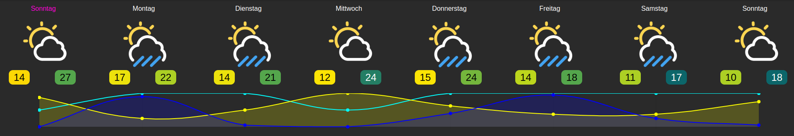

# IoBroker.swiss-weather-api
# Адаптер swiss-weather-api для ioBroker
Подключается к великолепному погодному API SRF — версия 2 (https://developer.srgssr.ch/api-catalog/srf-weather/srf-weather-description).
API REST погоды SRF позволяет получать прогнозы погоды и отчеты из более чем 25 000 мест по всей Швейцарии. Подписка «Freemium» позволяет вам получать 25 запросов в день.

## **Пожалуйста, будьте осторожны:**
1. Этот адаптер поддерживает только территории Швейцарии.
1. SRF Weather API V1 поддерживается до версии адаптера 1.0.6. SRF Weather API V2 поддерживается начиная с версии 2.0.0.

## **Процедура обновления версии 1.x.x до 2.0.x**
- Удалить адаптер (удалить все объекты-адаптеры в ioBroker!)
- Установите полностью новый адаптер => Будут созданы новые объекты.
- Поскольку SRF изменил имена путей, вам необходимо обновить Visu. Просто [повторно импортируйте представления](https://github.com/baerengraben/ioBroker.swiss-weather-api/tree/master/views).

## Начиная
1. Получите бесплатный аккаунт на https://developer.srgssr.ch/.
1. Перейдите в «Приложения» и добавьте новое приложение. Здесь вы можете выбрать API-Продукт. «SRF-MeteoProductFreemium» — их бесплатный продукт. Если вам нужен прогноз только для одного местоположения и вы получаете только 25 запросов в день (каждые 60 минут) или/и не хотите платить за больше запросов в день, вам следует выбрать «SRF-MeteoProductFreemium». Теперь это создаст определенные ConsumerKey и ConsumerSecret.
1. Узнайте долготу/широту (десятичные градусы) выбранного места, для которого нужен прогноз. Эта информация является необязательной, если вы указали свое местоположение в настройках ioBroker (основные настройки) (через карту). В этом случае вы можете оставить поля широты и долготы пустыми. Затем адаптер использует настройки ioBroker. Широта и долгота, введенные в конфигурации адаптера, переопределяют настройки ioBroker.
1. Установите этот адаптер на ioBroker => Это может занять несколько минут (~7 минут на Raspberry Pi 3).
1. В конфигурации адаптера заполните
   1. Название приложения
   1. ConsumerKey приложения
   1. Потребительский секрет приложения
   1. Долгота/широта выбранного местоположения в Швейцарии, для которого нужен прогноз. => Пожалуйста, используйте десятичные градусы (например, Цюрих: 47,36667 / 8,5)
   1. Интервал опроса в минутах (по умолчанию 60 минут — 25 запросов в день)

Первый запрос делается через 10 секунд после запуска адаптера. После первого запуска запрос будет выполняться регулярно согласно параметру конифугации (Интервал опроса в минутах).
Объекты в прогнозе.current_hour будут созданы через 30 секунд после первого запуска и обновляться каждый час путем копирования соответствующих значений из прогноза.часы.

### Пример визуализации
###### Предварительное условие:
* Адаптер [Виджеты Material Design] (https://github.com/Scrounger/ioBroker.vis-materialdesign) >= 0.5.7
* Адаптер [Vis](https://github.com/iobroker/iobroker.vis/blob/master/README.md)
* [Импорт представлений в Vis](https://github.com/baerengraben/ioBroker.swiss-weather-api/tree/master/views)
* [Импортировать виджет в Vis](https://github.com/baerengraben/ioBroker.swiss-weather-api/tree/master/widgets)

###### Пример
Простой пример: .

Расширенный пример: 

Пример виджета недели: 

## Changelog
### 2.1.0 (2024-01-10)
* (baerengraben) Added additional Week-View. Credits goes to https://github.com/pingus01

### 2.0.4-alpha.2 (2023-09-06)
* (baerengraben) Dummy-Deploy - because npm did not get 2.0.4-alpha.1 (2nd try...)

### 2.0.4-alpha.1 (2023-09-05)
* (baerengraben) Fixing https://github.com/baerengraben/ioBroker.swiss-weather-api/issues/102
* (baerengraben) Using ioBroker "formatDate" to format date_time attribut to "TT.MM.JJJJ SS:mm:ss"
* (baerengraben) Fixing https://github.com/baerengraben/ioBroker.swiss-weather-api/issues/105
* (baerengraben) Fixing https://github.com/baerengraben/ioBroker.swiss-weather-api/issues/104 
* (baerengraben) Fixing https://github.com/baerengraben/ioBroker.swiss-weather-api/issues/103

### 2.0.4-alpha.0 (2023-08-03)
* (baerengraben) Adding four new hour-based Views 
* (baerengraben) JSON-Chart is now starting with 00:00 instead of 01:00 
* (baerengraben) SRF sometimes delivers more and sometimes less daily data. This can lead to old data in certain objects. To prevent this, I delete the entire object tree with each new call to rebuild it.

### 2.0.3 (2023-08-01)
* (baerengraben) Fixing https://github.com/baerengraben/ioBroker.swiss-weather-api/issues/94

## License
MIT License

Copyright (c) 2024 baerengraben <baerengraben@intelli.ch>

Permission is hereby granted, free of charge, to any person obtaining a copy
of this software and associated documentation files (the "Software"), to deal
in the Software without restriction, including without limitation the rights
to use, copy, modify, merge, publish, distribute, sublicense, and/or sell
copies of the Software, and to permit persons to whom the Software is
furnished to do so, subject to the following conditions:

The above copyright notice and this permission notice shall be included in all
copies or substantial portions of the Software.

THE SOFTWARE IS PROVIDED "AS IS", WITHOUT WARRANTY OF ANY KIND, EXPRESS OR
IMPLIED, INCLUDING BUT NOT LIMITED TO THE WARRANTIES OF MERCHANTABILITY,
FITNESS FOR A PARTICULAR PURPOSE AND NONINFRINGEMENT. IN NO EVENT SHALL THE
AUTHORS OR COPYRIGHT HOLDERS BE LIABLE FOR ANY CLAIM, DAMAGES OR OTHER
LIABILITY, WHETHER IN AN ACTION OF CONTRACT, TORT OR OTHERWISE, ARISING FROM,
OUT OF OR IN CONNECTION WITH THE SOFTWARE OR THE USE OR OTHER DEALINGS IN THE
SOFTWARE.
