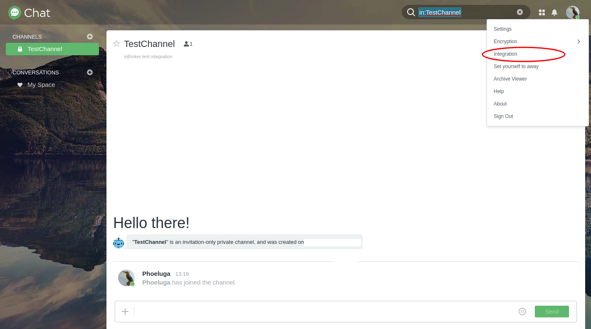
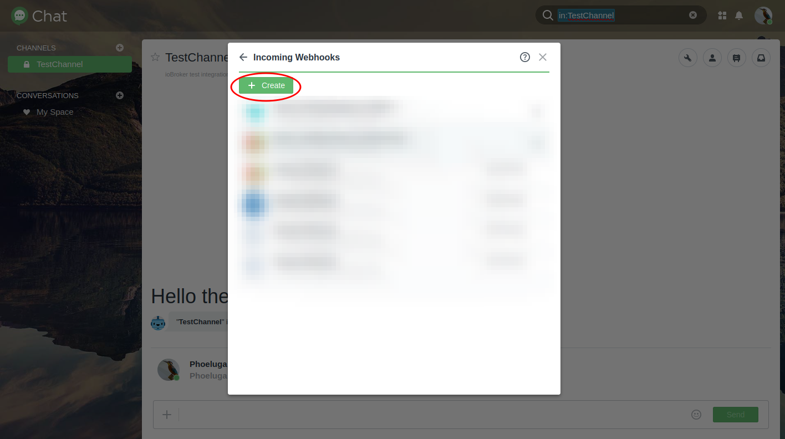

# Адаптер Synology-Chat для ioBroker


[![Пожертвовать][donate-badge2]][donate-link]

## Что это такое?
Этот адаптер обеспечивает интерфейс между Synology Chat и ioBroker. Для этой цели используются стандартные функции интеграции, предоставляемые Synology Chat, и соответствующие конечные точки REST API.
Интеграция входящих и исходящих сообщений может использоваться для отправки сообщений на сервер Synology Chat или обновления объекта сообщения в экземпляре ioBroker для получения сообщений.

---

# Руководство
## 1. Установка
Экземпляр адаптера можно создать в разделе адаптеров вашей установки ioBroker.

Дополнительную информацию можно найти в официальном документе [Документация ioBroker](https://www.iobroker.net/#de/documentation/admin/adapter.md).

## 2. Конфигурация
<div id="synology-chat-configuration"></div>

### 2.1. Конфигурация чата Synology
- Synology Chat позволяет обрабатывать входящие и исходящие сообщения. Далее оба варианта будут рассмотрены более подробно.

- Для создания сообщений через интерфейс Synology Chat необходимо создать интеграцию в Synology Chat:

 

#### 2.1.1. Входящая интеграция
Для интеграции входящего сообщения в чат Synology необходим токен, который можно получить из URL-адреса, сгенерированного при создании сообщения.
 

	<div id="synologyChatConfigurationOutgoingIntegration"></div>

#### 2.1.2. Исходящая интеграция
Для интеграции исходящего сообщения в чат Synology необходимо предоставить URL-адрес веб-перехватчика. Этот URL-адрес веб-перехватчика будет получен из объектов экземпляра после создания адаптера `synochat`. Подробнее см. в разделе [3. Использование > 3.1 Общие положения](#web-hook-location)  

***ПРИМЕЧАНИЕ:*** *Тип канала (входящий; исходящий) указывается с точки зрения чата Synology. Например, «Входящий» означает, что сообщения будут отправляться на сервер чата Synology.*

Более подробную информацию об интеграции в чате Synology см. в официальной документации Synology [ЗДЕСЬ](https://kb.synology.com/DSM/help/Chat/chat_integration)

### 2.2. Конфигурация экземпляра адаптера ioBroker
- Настройку данного адаптера можно выполнить в настройках экземпляра.

#### 2.2.1. Основные настройки:
	

* **URL/IP-адрес Synology**

С помощью этого свойства будет предоставлен URL-адрес вашего приложения Synology-Chat. Обратите внимание: необходимо использовать абсолютный URL-адрес, включающий `http://` или `https://`, и не добавлять постфикс, например, `/`.
Конкретный порт можно указать после URL-адреса, как обычно, с помощью `:`.

***Пример допустимых значений:***

- https://mychat.mydomain.tld
- https://192.168.1.1:8080

* **Проверка SSL-сертификата**

Конечно, всегда рекомендуется шифровать передаваемые данные.
Часто для зашифрованных соединений в домашних условиях используются самоподписанные сертификаты. В этом случае может потребоваться отключить проверку SSL-сертификата для HTTP-соединения.
Отключите это свойство, чтобы отключить проверку сертификата.

* **Имя хоста/IP-адрес экземпляра ioBroker**

Это свойство позволяет указать имя хоста или IP-адрес, по которому ваш экземпляр ioBroker будет доступен по URL. Это значение автоматически устанавливается равным текущему IP-адресу операционной системы хоста, на которой установлен ваш ioBroker, после первоначального создания экземпляра адаптера.

В случае использования ioBroker в качестве экземпляра Docker может потребоваться изменить это значение, например, если для доступа к экземпляру ioBroker используется обратный прокси-сервер или что-то подобное.

Это значение используется для создания URL-адреса веб-перехватчика для каналов, которые получают сообщения с сервера чата Synology.

	<div id="configurationAdapterWebInstance"></div>

* **Веб-экземпляр для сообщений, отправляемых из чата Synology в экземпляр адаптера ioBroker**

Адаптер `synochat` использует адаптер `web` для предоставления веб-перехватчиков. Вам необходимо выбрать конкретный экземпляр адаптера `web`, чтобы предоставить выделенный веб-перехватчик для интеграции чата Synology.

	<div id="channel-configuration"></div>

#### 2.2.2. Управление/конфигурация каналов:
	

* **Канал включен**

Эту опцию можно использовать для отключения обработки входящих или исходящих сообщений.

Это может быть полезно, например, если пользователь хочет временно отключить использование канала и сохранить настройки, такие как токен доступа или что-то подобное, чтобы предотвратить их повторный сбор.

* **Название канала**

Этот параметр определяет имя канала, с которого/на который отправляются сообщения. Это имя можно выбрать произвольно для каналов типа `Send data to Synology chat server - Incoming integration`, и оно используется для ссылок.

Имя канала, которое нужно здесь настроить, должно совпадать с именем канала чата Synology.

Для каналов типа `Get data from Synology chat server - Outgoing integration` имя должно совпадать с именем канала чата Synology для получения сообщений.
Сопоставление названий каналов чувствительно к регистру (необходимо учитывать заглавные и строчные буквы).

* **Токен канала**

Этот параметр предоставляет токен доступа к каналу чата Synology. Процедура его создания различается в зависимости от типа канала.
Подробнее см. в главе [Конфигурация чата Synology](#synology-chat-configuration).

***ПРИМЕЧАНИЕ:***\ *В зависимости от интеграции, при создании интеграции чата Synology вы получите ссылку, похожую на следующую:*

https://mychat.mydomain.tld/webapi/entry.cgi?api=SYNO.Chat.External&method=incoming&version=2&token=%22QF5DWyG7M47Ls3cv%22

*В этом примере токен включён в URL. Закодированные управляющие символы — `%22` — указаны здесь в начале и конце настройки.\ **Их необходимо удалить!**\ В этом примере токен, который нужно ввести, будет `QF5DWyG7M47Ls3cv`.*

* **Тип канала**

***ПРИМЕЧАНИЕ:***\ *Тип канала необходимо указывать с точки зрения чата Synology. Например, выбор «Входящие» в настройках означает, что сообщения будут отправляться в чат Synology.*

Этот параметр определяет тип канала чата Synology, который будет использоваться в зависимости от выбранной интеграции в чате Synology.

* **Отправка данных на сервер чата Synology — входящая интеграция**\

Эта опция позволяет каналу отправлять новое значение объекта сообщения ioBroker ([см. главу об использовании](#usage)) сразу после изменения значения объекта.

* **Получение данных с сервера чата Synology — Исходящая интеграция**\

Этот параметр позволяет каналу получать сообщения от сервера чата Synology и обновлять новое значение объекта сообщения ioBroker ([см. главу об использовании](#usage)).

Обратите внимание, что при использовании этого типа канала имя канала конфигурации экземпляра адаптера ioBroker должно совпадать с именем канала чата Synology для получения сообщений.
Сопоставление имён каналов чувствительно к регистру (необходимо учитывать заглавные и строчные буквы).

> Примечание: Пожалуйста, не выбирайте опцию «*реагировать на*» для исходящих каналов.

Если канал необходимо настроить как для отправки, так и для получения сообщений, просто добавьте второй канал с тем же именем и выберите другой тип канала.

* **Шаблон значения объекта**

Если значение объекта сообщения канала содержит значение JSON, вы можете выбрать шаблон, который преобразует это значение объекта в понятное для человека значение перед его отправкой в канал чата Synology.

Соответствующий шаблон сообщения можно настроить в разделе [Шаблоны сообщений](#message-templates).

* **Реагировать на менеджер уведомлений**

Устройство `synochat` может получать сообщения от [ioBroker Notification-Manager](https://github.com/foxriver76/ioBroker.notification-manager). Этот параметр позволяет выбрать, будет ли соответствующий канал реагировать на сообщения от диспетчера уведомлений и пересылать их в Synology Chat.

Соответствующий шаблон сообщения можно настроить в разделе [Шаблоны сообщений](#messageTemplates).

* **Реагировать на все сообщения ioBroker**

Помимо сообщений от [ioBroker Notification-Manager](https://github.com/foxriver76/ioBroker.notification-manager), `synochat` может получать также другие сообщения от других адаптеров. Этот параметр позволяет выбрать, должен ли соответствующий канал реагировать на сообщения от всех остальных отправителей и пересылать их в Synology Chat.

Экземпляр адаптера может принимать сообщения. Эти сообщения состоят из объекта с несколькими атрибутами, которые можно включить в качестве параметров в шаблон сообщения. Эти параметры соответствующим образом заменяются перед отправкой сообщения.

Соответствующий шаблон сообщения можно настроить в разделе [Шаблоны сообщений](#message-templates).

* **Проверка SSL-сертификата — для нетекстовых сообщений**

Если для входящего канала требуется отправка контента, отличного от текста, например изображения, это указывается через URL-адрес HTTP-источника. Если этот контент предоставляется с самоподписанным сертификатом, проверку сертификата можно включить или отключить с помощью этого параметра.
Подробнее об отправке нетекстового контента см. в главе [Конфигурация чата Synology](#synology-chat-configuration).

	<div id="message-templates"></div>

#### 2.2.3. Шаблоны сообщений:
Можно определить шаблоны сообщений, которые обрабатываются перед отправкой сообщения на Synology Chat Server. Эти шаблоны могут содержать шаблоны, которые заменяются в процессе отправки.

	

Шаблоны всегда должны начинаться с `${` и заканчиваться на `}`. Например, `${foo}`. При обработке сообщения шаблон `${foo}` будет заменен соответствующим JSON-значением атрибута `foo`.

	**Образец:**

Если канал, настроенный для отправки данных в Synology Chat, получает изменение объекта сообщения, он может содержать значение JSON, подобное следующему:

	```json
    {
        "sensor": {
            "id": "temp0815",
            "name": "Temperature - Living room",
            "type": "temperature",
            "location": "living room",
            "value": "23.4"
        }
    }
	```

Доступ к внутренним атрибутам этого значения можно получить, указав их в пути, например, `${sensor.value}`.

Если вы хотите отправить текст типа > Температура в гостиной изменилась на 23,4°C

Ваш шаблон сообщения будет выглядеть так:

`The ${sensor.type} in the ${sensor.location} changed to ${sensor.value}°C`

**ПРИМЕЧАНИЕ И ОГРАНИЧЕНИЯ:**

1. Если вы пытаетесь получить доступ к атрибуту с ключом, содержащим точки (`.`), вам необходимо экранировать их символами `/-`!

например, если значение объекта вашего сообщения выглядит так:

```JSON
{
       "category": {
           "instances": {
               "system.adapter.notification-manager.0": {
                   "notification": "Test notification",
               }
           }
       }
   }
```

и вы хотите получить доступ к атрибуту `notification`, ваш шаблон будет `${category.instances.system/-adapter/-notification-manager/-0.notification}`

2. Невозможно получить доступ к определенным элементам в массивах.

например, если значение объекта вашего сообщения выглядит так:

```JSON
{
       "messages": [
           {
           "text": "Lorem"
           },
           {
           "text": "Ipsum"
           }
       ]
   }
```

Вы не можете получить доступ к атрибуту `text` в объекте `message`. В этом случае необходимо подготовить значение объекта вне этого адаптера перед его передачей в объект сообщения канала `synochat`.

* **Шаблон для отправки сообщений, полученных через ioBroker Notification-Manager**

Этот шаблон будет определять содержание сообщений, полученных от Notification-Manager. В качестве параметров в шаблоне можно использовать имена атрибутов объекта `iobroker.Message` и встроенного объекта сообщения Notification-Manager.

Внутренний полученный объект имеет тип `iobroker.Message`:

		```javascript
		/** A message being passed between adapter instances */
        interface Message {
            /** The command to be executed */
            command: string;
            /** The message payload */
            message: MessagePayload;
            /** The source of this message */
            from: string;
            /** ID of this message */
            _id: number;
            /** Callback information. This is set when the source expects a response */
            callback: MessageCallbackInfo;
        }
		```

Согласно описанию, Notification-Manager предоставит собственный объект сообщения, встроенный в атрибут `message` как часть `iobroker.Message`.

Доступ к этим данным можно получить через атрибут `message`, используя шаблон `${message.NOTIFICATION_MANAGER_ATTRIBUTES}`.

**Доступные шаблоны:**

* `${command}` — шаблон, связанный с объектом `iobroker.Message`
* `${message}` — шаблон, связанный с объектом `iobroker.Message`
* `${from}` — шаблон, связанный с объектом `iobroker.Message`
* `${_id}` — шаблон, связанный с объектом `iobroker.Message`
* `${instances}` - Шаблон будет заменен списком экземпляров, связанных с полученным уведомлением Notification-Manager
* `${contextData}` — шаблон, предоставляющий дополнительные contextData, которые также хранятся вместе с информацией уведомления.

Более подробная информация о структуре [Объект сообщения Notification-Manager](https://github.com/foxriver76/ioBroker.notification-manager) можно найти в [README](https://github.com/foxriver76/ioBroker.notification-manager).

> Примечание: Пожалуйста, не выбирайте опцию «*реагировать на*» для исходящих каналов.

* **Шаблон для отправки сообщений всех остальных полученных сообщений**

Тот же объект `iobroker.Message`, который описан выше, используется для отправки всех видов сообщений экземпляру адаптера.

		```javascript
		/** A message being passed between adapter instances */
        interface Message {
            /** The command to be executed */
            command: string;
            /** The message payload */
            message: MessagePayload;
            /** The source of this message */
            from: string;
            /** ID of this message */
            _id: number;
            /** Callback information. This is set when the source expects a response */
            callback: MessageCallbackInfo;
        }
		```

Из этого объекта можно использовать следующие шаблоны для доступа к значениям связанных атрибутов.

**Доступные шаблоны:**

* `${command}` — шаблон, связанный с объектом `iobroker.Message`
* `${message}` — шаблон, связанный с объектом `iobroker.Message`
* `${from}` — шаблон, связанный с объектом `iobroker.Message`
* `${_id}` — шаблон, связанный с объектом `iobroker.Message`

Шаблон `${message}` всегда будет содержать информацию от соответствующего отправителя. Если сообщение содержит только `String`, вам достаточно указать шаблон `${message}`. Если сообщение содержит значение JSON, вы также можете получить доступ к внутренним атрибутам, указав путь к значению, например, `${message.foo.bar}`.

> Примечание: Пожалуйста, не выбирайте опцию «*реагировать на*» для исходящих каналов.

* **Шаблон 1-10 — Шаблон для применения на определенном канале**

Вы также можете предоставить значение JSON объекту сообщения определенного канала. В этом случае вы можете определить до десяти пользовательских шаблонов, которые можно применить перед отправкой сообщения на сервер Synology Chat.

Доступ к атрибутам JSON можно получить, указав путь к значению в виде шаблона, например `${foo.bar}`.

Шаблон может быть связан с каналом в [Конфигурация канала](#channel-configuration).

**Доступные шаблоны:**

Доступные шаблоны связаны со значением JSON клиента, которое будет предоставлено объекту сообщения канала.

#### 2.2.4. Помощь:
* Эта вкладка обычно перенаправляет на официальную страницу GitHub этого проекта, где дана подробная справка и инструкции по использованию.
* Если у вас есть какие-либо открытые вопросы, предложения по изменениям, нежелательное поведение или ошибки, пожалуйста, создайте [задачу GitHub](https://github.com/phoeluga/ioBroker.synochat/issues/new/choose), чтобы гарантировать качество этого проекта.

<div id="configurationWebInstance"></div>

### 2.3. Конфигурация экземпляра `web`
Для получения сообщений с сервера чата Synology необходимо настроить исходящую интеграцию — см. [Исходящая интеграция](#synologyChatConfigurationOutgoingIntegration).

Для этого требуется, чтобы экземпляр адаптера `web` был запущен и настроен в [настроен экземпляр адаптера `synochat`](#configurationAdapterWebInstance).

Если используемый экземпляр `web` настроен на использование безопасного соединения по протоколу HTTPS, **убедитесь, что вы предоставили действительный сертификат, или импортируйте свой собственный сертификат в список доверенных сертификатов вашей системы Synology**. В противном случае сообщения с сервера чата Synology на ваш экземпляр адаптера ioBroker отправляться не будут.
Соединение не будет установлено, и, к сожалению, на обоих сайтах пользователю не будет предоставлено прямого уведомления о том, что сообщение было отклонено из-за недействительного сертификата.

<div id="usage"></div>

## 3. Использование
### 3.1 Общие положения
* После настройки экземпляра адаптера для каждого настроенного канала в объектах соответствующего экземпляра адаптера создается папка с именем канала.

	

* В этой папке можно найти объект сообщения соответствующего канала, который представляет отправленное или полученное сообщение.

***ПРИМЕЧАНИЕ:***\ *При отправке сообщения или изменении объекта сообщения пользователем убедитесь, что флаг Ack не установлен. Флаг Ack будет установлен адаптером после подтверждения успешного получения сообщения сервером чата Synology.*\ **Если флаг Ack установлен пользователем при изменении значения сообщения в представлении объекта ioBroker, сообщение не будет обработано!***

	

* Если объект сообщения изменен и тип канала установлен на «Отправить данные на сервер чата Synology», это сообщение передается в чат Synology.

	

* Для получения сообщений от Synology Chat Server и соответствующего обновления объекта сообщения убедитесь, что настроенное «Слово-триггер» (см. [Конфигурация чата Synology](#synology-chat-configuration)) присутствует в сообщении без знаков препинания. Поэтому оно должно быть отдельным.

**Пример:**\ Если `Trigger word` будет `Alarm`, сообщение в чате Synology должно выглядеть следующим образом:\ `An alarm was triggered in the hallway.`

Обратите внимание, что `Trigger word` чувствителен к регистру (необходимо учитывать заглавные и строчные буквы).

<div id="web-hook-location"></div>

* URL-адрес веб-перехватчика/адрес будет предоставлен как значение объекта в папке info экземпляра адаптера и действителен для всех каналов в пределах одного экземпляра адаптера.

	

### 3.2 Тип содержимого сообщения
Помимо отправки обычных текстовых сообщений, на входящий канал можно отправлять и другие типы контента, например, изображения. Для этого контент должен быть доступен как веб-ресурс. Чтобы отправить изображение, просто укажите URL-адрес в качестве значения объекта сообщения экземпляра адаптера Syno-Chat, упомянутого в [3. Использование > 3.1 Общие положения](#usage).

**Пример использования камеры наблюдения:**\ Многие камеры наблюдения предоставляют поток или интерфейс для получения изображения, которое обновляется с указанным интервалом времени или при обнаружении движения.\ Этот URL-адрес предоставляет изображение, которое необходимо задать в качестве значения объекта сообщения.

### 3.3 Отладка в случае возникновения проблем
Чтобы получить более подробную информацию о поведении адаптера в случае возникновения проблем, можно повысить уровень ведения журнала экземпляра адаптера `synochat` до `debug`.

Поскольку этот адаптер использует экземпляр адаптера `web` для предоставления веб-подключений к серверу чата Synology, настроенный экземпляр `web` выполняет некоторые функции. Чтобы получить более подробную информацию о проблемах с получением сообщений, необходимо повысить уровень журнала настроенного экземпляра `web` до `debug`. Сообщения журнала, относящиеся к адаптеру `synochat`, можно идентифицировать по префиксу `synochat.<INSTANCE_NUMBER>`.

---

## Другие раскрытия информации
#### Атрибуция ресурсов
- [Иконки чата созданы Pixel Perfect - Flaticon](https://www.flaticon.com/free-icons/chat)

[donate-badge]:https://img.shields.io/static/v1?label=Treat%20a%20coffee&message=donate%20a%20tip&color=2a9cde&logo=data:image/svg+xml;base64,PHN2ZyB2aWV3Qm94PSIwIDAgMjQgMjQiIHhtbG5zPSJodHRwOi8vd3d3LnczLm9yZy8yMDAwL3N2ZyI+PHBhdGggZD0iTTcgMjJoMTBhMSAxIDAgMCAwIC45OS0uODU4TDE5Ljg2NyA4SDIxVjZoLTEuMzgybC0xLjcyNC0zLjQ0N0EuOTk4Ljk5OCAwIDAgMCAxNyAySDdjLS4zNzkgMC0uNzI1LjIxNC0uODk1LjU1M0w0LjM4MiA2SDN2MmgxLjEzM0w2LjAxIDIxLjE0MkExIDEgMCAwIDAgNyAyMnptMTAuNDE4LTExSDYuNTgybC0uNDI5LTNoMTEuNjkzbC0uNDI4IDN6bS05LjU1MSA5LS40MjktM2g5LjEyM2wtLjQyOSAzSDcuODY3ek03LjYxOCA0aDguNzY0bDEgMkg2LjYxOGwxLTJ6IiBmaWxsPSIjZWRmMmZhIiBjbGFzcz0iZmlsbC0wMDAwMDAiPjwvcGF0aD48L3N2Zz4=

[donate-badge2]:https://img.shields.io/static/v1?label=Treat%20a%20coffee&message=donate%20a%20tip&color=2a9cde&logo=data:image/svg+xml;base64,PHN2ZyBkYXRhLW5hbWU9IkxheWVyIDEiIHZpZXdCb3g9IjAgMCAzMiAzMiIgeG1sbnM9Imh0dHA6Ly93d3cudzMub3JnLzIwMDAvc3ZnIj48cGF0aCBkPSJNMjYuNSAxNUgyNnYtMWEyIDIgMCAwIDAtMi0ySDJhMiAyIDAgMCAwLTIgMnY2YTEwLjY0IDEwLjY0IDAgMCAwIDExIDExaDRhMTAuNzkgMTAuNzkgMCAwIDAgOS4zMS01aDIuMTlhNS41IDUuNSAwIDAgMCAwLTExWk0xNSAyN2gtNGE2LjcgNi43IDAgMCAxLTctN3YtNGgxOHY0YTYuNzcgNi43NyAwIDAgMS03IDdabTExLjQ0LTQuNzdoLS43OGExMy43NSAxMy43NSAwIDAgMCAuMi0yLjMxdi0xLjE1aC41OGExLjczIDEuNzMgMCAwIDEgMCAzLjQ2Wk0xMyAxMGEyIDIgMCAwIDAgMi0yVjJhMiAyIDAgMSAwLTQgMHY2YTIgMiAwIDAgMCAyIDJaTTIwIDEwYTIgMiAwIDAgMCAyLTJWN2EyIDIgMCAwIDAtNCAwdjFhMiAyIDAgMCAwIDIgMlpNNiAxMGEyIDIgMCAwIDAgMi0yVjZhMiAyIDAgMCAwLTQgMHYyYTIgMiAwIDAgMCAyIDJaIiBmaWxsPSIjZjBmNWZhIiBjbGFzcz0iZmlsbC1iYTYzYzYiPjwvcGF0aD48L3N2Zz4=

[donate-link]: https://www.paypal.com/donate/?hosted_button_id=9MLB29CKX5674

## Changelog
<!--
    Placeholder for the next version (at the beginning of the line):
    ### **WORK IN PROGRESS**
-->
### 1.4.2 (2025-10-04)
- *[@phoeluga]* Adding channelToken and channels properties to protectedNative and encryptedNative object type
- *[@phoeluga]* Enhanced template handling to properly ignore non-JSON objects, preventing them from being processed as JSON objects
- *[@OlliMartin]* Allow to be used in message templates - #34
- *[@phoeluga]* Adding compatibility check and testing for node.js 24 - #35
- *[@phoeluga]* Updated dependencies to the current minimum versions and according to - #36 ; #38 ; #39

### 1.3.3 (2025-01-26)
- *[@phoeluga]* Updated admin UI to fix desponsive design (mobile view) - #28

### 1.3.2 (2025-01-04)
- *[@phoeluga]* Fixed issue with 5 digit port number when using a IP for property Synology URL/IP - #20
- *[@phoeluga]* Addressed W[171],W[105],W[109] - #18
- *[@phoeluga]* Updated admin style.css and classes to support scrolling on mobile device view - #24
- *[@phoeluga]* Updated several dependencies to met the current overall config - #21
- *[@phoeluga]* Update test-workflow to be prepared for Node.js v22 - #22
- *[@phoeluga]* Bumped min. Node.js version to v18 - #22
- *[@phoeluga]* Bumped @iobroker/adapter-core to version >= 3.x.x - #23
- *[@phoeluga]* Updated ESLint usage and config - Migration to ESLint 9 - #25

### 1.3.1 (2023-08-13)
- *[@phoeluga]* Fixed TypeError issue with empty initial value of outgoing channels - #13
- *[@phoeluga]* Updated information about handling of outgoing channels - #14
- *[@phoeluga]* Fixed special character escaping issue - #16
- *[@phoeluga]* Added text mapping for 'human readable' descriptions of the message parent objects - #14

### 1.3.0 (2023-07-23)
- *[@phoeluga]* Added feature to react on messages from Notification-Manager - #9
- *[@phoeluga]* Added feature to react on general received messages sent to the `synochat` adapter instance.
- *[@phoeluga]* Added message templates for received messages from other adapters.
- *[@phoeluga]* Added message templates for object values related to an associated channel.

### 1.2.1 (2022-05-18)
- *[@phoeluga]* The IP family check to determine the local IP address of the ioBroker instance has been adjusted.

### 1.2.0 (2022-05-17)

- *[@phoeluga]* Added enhancement #6 - Delayed sending of messages has been added to work around the limitations of messages sent to the Synology Chat Server in a certain time interval.
- *[@phoeluga]* Regarding #6, a message queue has been added to ensure that the order of messages to be sent is respected when the sending of messages is delayed.
- *[@phoeluga]* Implementation of the [requirements](https://github.com/ioBroker/ioBroker.repositories/pull/1759#issuecomment-1127520995) for adding the adapter in the ioBroker repository - Adding MIT license hint to the Readme.
- *[@phoeluga]* Implementation of the [requirements](https://github.com/ioBroker/ioBroker.repositories/pull/1759#issuecomment-1127520995) for adding the adapter in the ioBroker repository - Moved adapter instance object subscription after initial connectivity check.
- *[@phoeluga]* Implementation of the [requirements](https://github.com/ioBroker/ioBroker.repositories/pull/1759#issuecomment-1127520995) for adding the adapter in the ioBroker repository - Added exception handling to cover https://github.com/nodejs/node/issues/43014 in Nodejs 18
- *[@phoeluga]* Implementation of the [requirements](https://github.com/ioBroker/ioBroker.repositories/pull/1759#issuecomment-1127527703) for adding the adapter in the ioBroker repository - Added axios as dependency in package.json

### 1.1.1 (2022-04-16)

- *[@phoeluga]* Fixed issue #4 - Issue while migrating data from version < 1.1.0
- *[@phoeluga]* Added collecting and loading of default values when loading the initial configuration of the adapter instance
- *[@phoeluga]* The channel search behavior has been adjusted to react accordingly to deactivated channels and to query the remaining channels.

### 1.1.0 (2022-04-14)

- *[@phoeluga]* Added the ability to manage multiple channels in one adapter instance per Synology chat server.
- *[@phoeluga]* A possibility of ioBroker hostname / IP address configuration has been introduced.\
(May be helpful when using an ioBroker Docker instance).
- *[@phoeluga]* A functionality to receive incoming messages from the Synology chat server using WebHooks has been added.\
(An instance of the web adapter is required to use this feature)
- *[@phoeluga]* The translation of the UI properties was added.
- *[@phoeluga]* Added function to migrate channel data from an older version to a new channel object in the list approach.
- *[@phoeluga]* Added possibility for a user to disable dedicated channels from being processed.

### 1.0.1 (2022-04-06)

- *[@phoeluga]* Resolved #1 - Unable to send messages with special characters
- *[@phoeluga]* Resolved #2 - Send images


### 1.0.0 (2022-04-05)

- *[@phoeluga]* Initial release


### 0.0.1 (2022-04-03) - ALPHA

- *[@phoeluga]* Start of development

## License

This code is licensed under 'The MIT License (MIT)' license specified in the [LICENSE](./LICENSE) file.

Copyright (c) 2025 phoeluga <phoeluga@gmail.com>