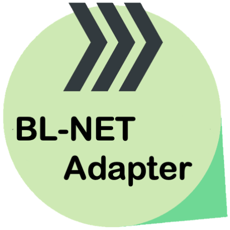

# IoBroker.ta-blnet
**Тесты:** 

## Адаптер ta-blnet для ioBroker
Адаптер ioBroker для считывания данных с одного или до восьми климатических контроллеров с помощью [Техническая Альтернатива](http://www.ta.co.at) с использованием BL-NET.

После установки вам необходимо создать экземпляр и настроить пользовательские значения для IP-адреса, номера порта и интервала обновления, которые должен использовать экземпляр.

Пожалуйста, убедитесь, что вы являетесь владельцем устройства BL-NET, а не более нового продукта CMI. Устройство BL-NET выглядит следующим образом:  Руководство по BL-NET можно найти здесь: https://www.ta.co.at/fileadmin/Downloads/Betriebsanleitungen/00_Auslauftypen/BL-NET/Manual_BL-Net_V2.19-2_EN.pdf

## Changelog

<!--
Placeholder for next version:  ### **WORK IN PROGRESS**
-->
### 1.0.30 (2024-12-16)

-   added eslint9 config, removed eslint8 config

### 1.0.29 (2024-12-13)

-   added translation and documentation to data object config

### 1.0.28 (2024-12-13)

-   improved JSON Status Code logging
-   added data_objects per can_node to config for CMI requests

### 1.0.27 (2024-12-13)

-   added additional sections processing to CMI mode

### 1.0.26 (2024-12-12)

-   used uvr_type_code as capital letter string
-   node name for channel is now 4 digid

### 1.0.25 (2024-12-10)

-   improved error handling on CMI return codes
-   improved node names

### 1.0.24 (2024-12-08)

-   fixed lint errors

### 1.0.23 (2024-12-08)

-   added initial CMI support

### 1.0.22 (2024-12-01)

-   fixed negative current_heat_power

### 1.0.21 (2024-12-01)

-   added 2DL reading
-   renamed main class to TaBlnet and port to 'TA port'
-   fixed negative current_heat_power

### 1.0.20 (2024-11-30)

-   renamed adapter and git repo from ioBroker.uvr16xx-blnet to ioBroker.ta-blnet
-   published new package to npm

### 1.0.19 (2024-11-29)

-   removed onStateChange;
-   streamlined object node names;
-   improved node typing;
-   explicitely created every node;
-   improved outputs value filter;
-   ensured calls to setObjectNotExistsAsync happen only once;
-   removed data_frame_number parameter
-   introduced limit for poll intervall
-   removed obsolete react admin GUI settings and artefacts
-   use this.setTimeout instead of this.setInterval
-   finalized changes because of review findings

### 1.0.18 (2024-11-28)

-   introduced multiple data_frame_reading and population of multiple devices in adapter object tree

### 1.0.17 (2024-11-26)

-   added number of CAN frames to uvr_mode_str
-   improved recognition of retry necessity on 'keep patient' messages from BL-NET

### 1.0.16 (2024-11-25)

-   improved reading of flow rate
-   code refactoring

### 1.0.15 (2024-11-24)

-   refactorings and improved code documentation

### 1.0.14 (2024-11-23)

-   added frame index to options

### 1.0.13 (2024-11-22)

-   improved CAN bus mode reading

### 1.0.12 (2024-11-22)

-   lint fixes

### 1.0.11 (2024-11-22)

-   improved CAN bus mode reading

### 1.0.10 (2024-11-21)

-   improved reading device info
-   fixed handling of negative temperatures

### 1.0.9 (2024-11-21)

-   improved logging and introduced a new socket for each command

### 1.0.8 (2024-11-21)

-   improving logging in order to analyse system using CAN bus
-   added retry for reading UVR HEADER in order to identify uvr_mode

### 1.0.7 (2024-11-19)

-   testing deployment via "npm run release"

### 1.0.6 (2024-11-19)

-   testing deployment via "npm run release"

### 1.0.5 (2024-11-17)

-   improve build and deploy using github workflow (workflow>test-and-release.yml, ioBroker Check and Service Bot)
-   added compliance with ioBrokers adapter repository (https://github.com/ioBroker/ioBroker.repositories?tab=readme-ov-file#how-to-publish-on-npm)

### 1.0.1 (2024-11-17)

-   improve build and deploy

### 1.0.0 (2024-11-17)

-   (Klaus Weber) initial release

### 0.0.1

-   initial working version

## License

MIT License

Copyright (c) 2024 Klaus Weber <klausatweberesprit@gmail.com>

Permission is hereby granted, free of charge, to any person obtaining a copy
of this software and associated documentation files (the "Software"), to deal
in the Software without restriction, including without limitation the rights
to use, copy, modify, merge, publish, distribute, sublicense, and/or sell
copies of the Software, and to permit persons to whom the Software is
furnished to do so, subject to the following conditions:

The above copyright notice and this permission notice shall be included in all
copies or substantial portions of the Software.

THE SOFTWARE IS PROVIDED "AS IS", WITHOUT WARRANTY OF ANY KIND, EXPRESS OR
IMPLIED, INCLUDING BUT NOT LIMITED TO THE WARRANTIES OF MERCHANTABILITY,
FITNESS FOR A PARTICULAR PURPOSE AND NONINFRINGEMENT. IN NO EVENT SHALL THE
AUTHORS OR COPYRIGHT HOLDERS BE LIABLE FOR ANY CLAIM, DAMAGES OR OTHER
LIABILITY, WHETHER IN AN ACTION OF CONTRACT, TORT OR OTHERWISE, ARISING FROM,
OUT OF OR IN CONNECTION WITH THE SOFTWARE OR THE USE OR OTHER DEALINGS IN THE
SOFTWARE.