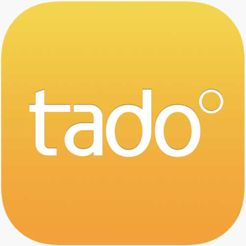

# IoBroker.tado

 

## Адаптер tado для ioBroker
Tado° (https://www.tado.com) — эксперт в области интеллектуального отопления и управления энергопотреблением для вашего дома, разработанный и произведенный в Германии. Экономьте энергию и сокращайте расходы навсегда вместе с нами — наслаждайтесь уютным и экологичным домом.

**Этот адаптер использует библиотеки Sentry для автоматического сообщения разработчикам об исключениях и ошибках в коде.** Для получения более подробной информации и сведений о том, как отключить отправку сообщений об ошибках, см. [Документация по плагину Sentry](https://github.com/ioBroker/plugin-sentry#plugin-sentry)! Отправка сообщений Sentry используется начиная с js-controller 3.0.

## !ВАЖНО! Tado° ввела ограничения на количество вызовов API.
Tado ввела ограничение на количество вызовов API. Пользователи без подписки Auto-Assist ограничены 100 вызовами в день.
Для получения дополнительной информации см. статью [этот](https://support.tado.com/en/articles/12165739-limitation-for-rest-api-usage).
В адаптер Tado ioBroker добавлена новая функция, предоставляющая новые возможности настройки для управления использованием API. Тем не менее, ежедневное ограничение в 100 вызовов означает, что адаптер не работает без подписки Auto-Assist. Это означает всего около четырех запросов в час, что значительно ограничивает функциональность адаптера.
Если вас не устраивает решение Tado, вы должны сообщить им об этом в [знать](https://support.tado.com/de/articles/3590239-wie-kann-ich-den-kundensupport-von-tado-kontaktieren)!

## Тадо° X
Базовая поддержка Tado° X доступна.
Если ваша конфигурация не работает, пожалуйста, создайте запрос [билет](https://github.com/DrozmotiX/ioBroker.tado/issues/new?assignees=HGlab01&labels=enhancement&projects=&template=Enhancement.md&title=). Вам потребуется обеспечить отладку и взаимодействовать с разработчиком адаптера для улучшения функций Tado° X.

## Чем можно управлять на Tado° V3+, V3, V2
| Штат | Описание |
| ----- | ----------- |
| tado.[x].[yyyyyy].Rooms.[z].setting.power | Включение/выключение устройства |
| tado.[x].[yyyyyy].Rooms.[z].setting.temperature.celsius | Определить температуру |
| tado.[x].[yyyyyy].Rooms.[z].overlayClearZone | Переключиться в автоматический режим |
| tado.[x].[yyyyyy].Rooms.[z].overlay.termination.typeSkillBasedApp | Установить режим расписания |
| tado.[x].[yyyyyy].Rooms.[z].overlay.termination.durationInSeconds | Установите продолжительность действия режима расписания |
| tado.[x].[yyyyyy].Rooms.[z].devices.[RUaaaaaaaaaa].offset.offsetCelsius | Смещение температуры |
| tado.[x].[yyyyyy].Rooms.[z].devices.[RUaaaaaaaaaa].childLockEnabled | Включение/выключение блокировки от детей |
| tado.[x].[yyyyyy].Rooms.[z].timeTables.tt_id | Выберите активное расписание |
| tado.[x].[yyyyyy].Rooms.[z].openWindowDetection.openWindowDetectionEnabled | Включить/отключить обнаружение открытого окна на термостате |
| tado.[x].[yyyyyy].Rooms.[z].openWindowDetection.timeoutInSeconds | Время ожидания отключения термостатов при обнаружении открытого окна |
| tado.[x].[yyyyyy].Rooms.[z].activateOpenWindow | Отключать термостаты при обнаружении открытого окна (работает только если термостат обнаруживает открытое окно) |
| tado.[x].[yyyyyy].Rooms.[z].setting.mode | Режим AC (только для устройств переменного тока) |
| tado.[x].[yyyyyy].Rooms.[z].setting.fanspeed | Скорость вентилятора (только для устройств переменного тока с версиями V3 и выше) |
| tado.[x].[yyyyyy].Rooms.[z].setting.fanLebel | Fanlebel (только для устройств переменного тока версии V3+) |
| tado.[x].[yyyyyy].Rooms.[z].setting.verticalSwing | Вертикальное качание (только для устройств переменного тока версии V3+) |
| tado.[x].[yyyyyy].Rooms.[z].setting.horizontalSwing | Горизонтальное качание (только для устройств переменного тока с версией V3 и более старыми версиями) |
| tado.[x].[yyyyyy].Home.state.presence | Установить режим ДОМА, ВНЕ ДОМА или АВТО |
| tado.[x].[yyyyyy].Home.masterswitch | Включить/выключить все устройства |
| tado.[x].[yyyyyy].meterReadings | JSON-объект с {"date":"YYYY-MM-DD","reading": 1234} можно использовать для загрузки показаний счетчика в Energy IQ |

## Чем можно управлять на Tado° X
| Штат | Описание |
| ----- | ----------- |
| tado.[x].[yyyyyy].Rooms.[z].setting.power | Включение/выключение устройства |
| tado.[x].[yyyyyy].Rooms.[z].setting.temperature.value | Определить температуру |
| tado.[x].[yyyyyy].Rooms.[z].manualControlTermination.controlType | Установить режим расписания |
| tado.[x].[yyyyyy].Rooms.[z].manualControlTermination.remainingTimeInSeconds | Время работы таймера |
| tado.[x].[yyyyyy].Rooms.[z].resumeScheduleRoom | Вернуться в автоматический режим для этой комнаты |
| tado.[x].[yyyyyy].Rooms.[z].devices.[VAaaaaaaaaaa].temperatureOffset | Изменить смещение устройства |
| tado.[x].[yyyyyy].Rooms.resumeScheduleHome | Возврат в автоматический режим для всех комнат |
| tado.[x].[yyyyyy].Rooms.allOff | Выключить все комнаты |
| tado.[x].[yyyyyy].Rooms.boost | Переключить все комнаты в режим ускорения |
| tado.[x].[yyyyyy].Home.state.presence | Установить режим ДОМА, ВНЕ ДОМА или АВТО |
| tado.[x].[yyyyyy].meterReadings | JSON-объект с {"date":"YYYY-MM-DD","reading": 1234} можно использовать для загрузки показаний счетчика в Energy IQ |

## Требует
* Node.js 20 или выше
* ioBroker host (js-controller) 7.0.6 или выше
* iorBroker.admin 7.7.2 или выше

## Changelog
<!--
    Placeholder for the next version (at the beginning of the line):
    ### __WORK IN PROGRESS__
-->
### 0.8.4 (2026-02-24)
* (HGlab01) checkExpire for termination-attributes
* (HGlab01) add attributes 'smartReminders' & 'smartRemindersInAppEnabled'
* (HGlab01) fix #1107 masterswitch turning OFF does not work any longer
* (HGlab01) fix #1117 Request failed with status code 400 with response "Unsupported content type"
* (HGlab01) bump axios to 1.13.5

### 0.8.3 (2025-11-13)
* (HGlab01) add capability to set OffSet [TadoX]
* (HGlab01) Implement deboucing also for TadoX
* (HGlab01) fix nextScheduleChange is missing the required property "common.type" [TadoX]

### 0.8.2 (2025-11-07)
* (HGlab01) add retry mechanism when it comes to timeouts
* (HGlab01) add attribute 'isRoomLinkRestricted'
* (HGlab01) finally fix definition missing for 'awayMode' with value 'null' [TadoX]
* (HGlab01) finally fix definition missing for 'holidayMode' with value 'null' [TadoX]
* (HGlab01) bump iobroker-jsonExplorer to 0.2.2
* (HGlab01) bump axios to 1.13.2

### 0.8.1 (2025-11-04)
* (HGlab01) code refactorings
* (HGlab01) fix issue 'definition missing for holidayMode' [TadoX]
* (HGlab01) fix issue 'cannot read properties of undefined (reading 'match')'
* (HGlab01) fix issue openWindow data not up to date #1086

### 0.8.0 (2025-10-07)
* (HGlab01) new configuration capabilities to manage API usage quota (#1047, #1048)
* (HGlab01) Implement API debouncing
* (HGlab01) Refactorings Tado API calls
* (HGlab01) fix issue 'definition missing for awayMode' [TadoX]
* (HGlab01) fix issue 'definition missing for preheating' [TadoX]
* (HGlab01) Additional guidance/log when it comes to RefreshToken issue
* (HGlab01) fix Object of state "tado.0.xxxxx.Rooms.y.openWindow" is missing the required property "common.type" (#1059)
* (HGlab01) Bump axios to 1.12.2
* (HGlab01) Bump iobroker-jsonexplorer to 0.2.0

## License
MIT License

Copyright (c) 2020-2026 HGlab01 <myiobrokeradapters@gmail.com>

Permission is hereby granted, free of charge, to any person obtaining a copy
of this software and associated documentation files (the "Software"), to deal
in the Software without restriction, including without limitation the rights
to use, copy, modify, merge, publish, distribute, sublicense, and/or sell
copies of the Software, and to permit persons to whom the Software is
furnished to do so, subject to the following conditions:

The above copyright notice and this permission notice shall be included in all
copies or substantial portions of the Software.

THE SOFTWARE IS PROVIDED "AS IS", WITHOUT WARRANTY OF ANY KIND, EXPRESS OR
IMPLIED, INCLUDING BUT NOT LIMITED TO THE WARRANTIES OF MERCHANTABILITY,
FITNESS FOR A PARTICULAR PURPOSE AND NONINFRINGEMENT. IN NO EVENT SHALL THE
AUTHORS OR COPYRIGHT HOLDERS BE LIABLE FOR ANY CLAIM, DAMAGES OR OTHER
LIABILITY, WHETHER IN AN ACTION OF CONTRACT, TORT OR OTHERWISE, ARISING FROM,
OUT OF OR IN CONNECTION WITH THE SOFTWARE OR THE USE OR OTHER DEALINGS IN THE

SOFTWARE.