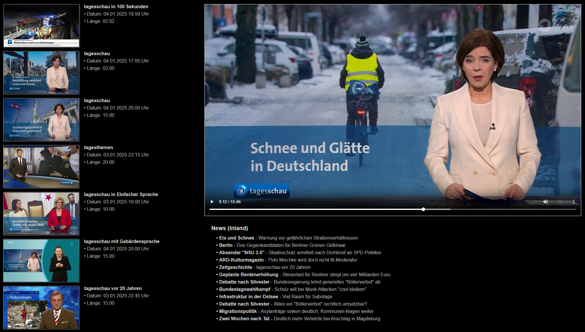
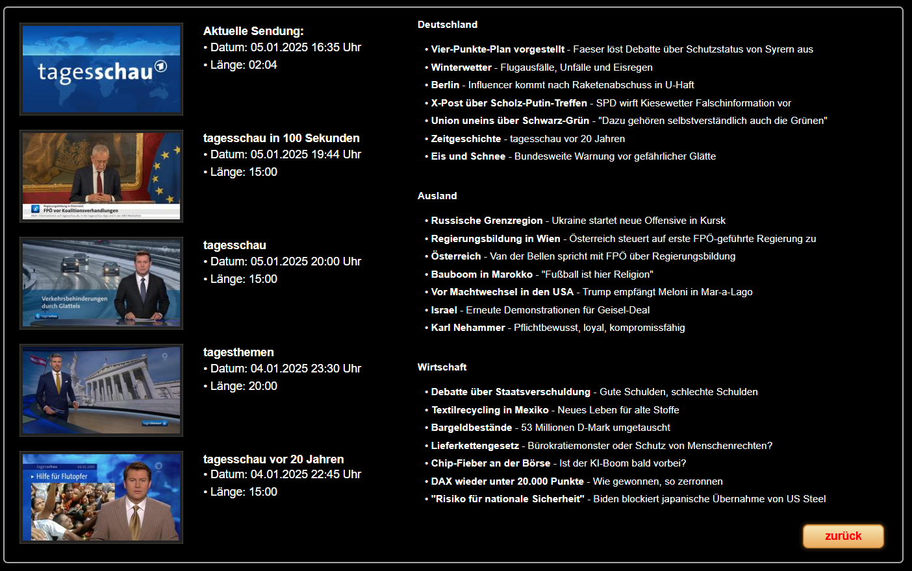

# ioBroker.tagesschau

## адаптер tagesschau для ioBroker

Новости Ruft и видеоссылки от Tagesschau ab.

Installieren - Im Admin gewünschtes einstellen - Fertig.

**Laut Tagesschau api sind 60 Abfragen pro Stunde в Орднунге. Используйте темы и видео с 1 сокращением. 30 минут для активного погружения. Keine Ahnung wie genau die das nehmen.**

Бичтен:

1. Если вы не активируете видео или активируете видео, вы можете отключить адаптер
2. Активация адаптера активируется только при включении конфигурации 1 Thema и 1 Bundesland ausgewählt.
3. Die Schlüsselwörter werden aus den Nachrichten gewonnen und sind erst nach dem ersten Durchlauf verfügbar. Es werden mit der Zeit immer mehr! Это не лучший выбор для ваших видеороликов.

Die Scrollmöglichkeiten sollten soweit selbsterklärend sein, findet man unter news.controls

- Если при автоматической настройке функции прокрутки все синхронные прокрутки будут отключены, будут установлены все интервалы и адаптер будет отключен.
- Beim Einstellen des Intervalls bedenken, dass fast alle States unter News neu geschrieben werden. Das können je nach Auswahl ein paar tausend sein. (мин. 2 секунды – nicht empfohlen)

Beispiel был с VIS möglich ist: Weiteres zu den Bilder: <https://forum.iobroker.net/post/1235111>