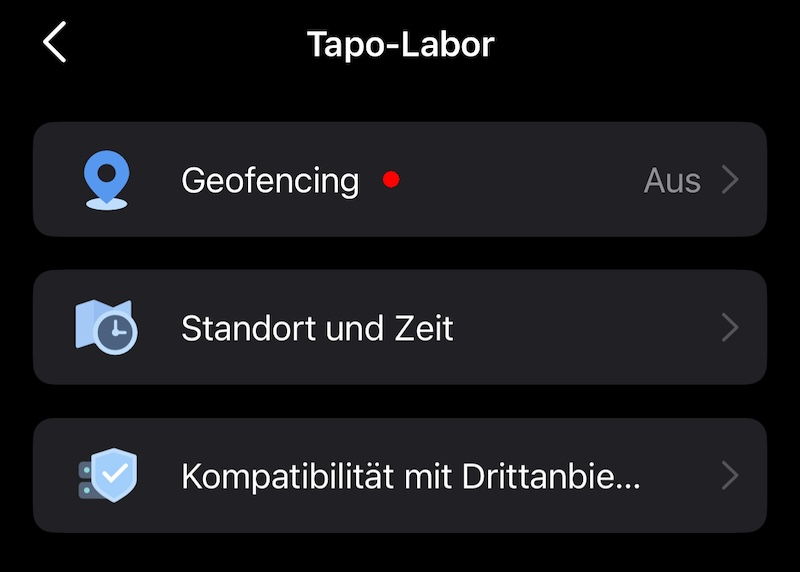

# IoBroker.tapo
**Тесты:** 

## Адаптер tapo для ioBroker
Адаптер для TP-Link Tapo

на основе https://github.com/apatsufas/homebridge-tapo-p100

## Логинаблауф
Выберите «Почта и пароль». Es werden die Geräte через Cloud abgerufen, aber local gesteuert.
Если IP-адрес не используется, вам нужно вручную использовать Tapo.0.id.ip.

## Status-Werte (eingehend)
Alle Geraete werden regelmaessig gepollt. Die Werte werden werden автоматически под `tapo.0.id.*` ангельтом.

### Alle Geraete
Коды: `tapo.0.80A5897B21C7.nickname`, `tapo.0.80A5897B21C7.device_on`

| Верт | Введите | Бесшрайбунг |
| ------------ | ------- | -------------------------- |
| никнейм | строка | Geraetename |
| device_id | string | Geraete-ID |
| модель | строка | Моделирование |
| fw_ver | string | Версия прошивки |
| hw_ver | string | Hardware-Version |
| мак | строка | MAC-адрес |
| устройство_на | логическое | Geraet ein/aus |
| время_включения | номер | Айншальддауэр в Секундене |
| rssi | номер | WLAN-сигнализаторы |
| уровень сигнала | число | Сигнальные звезды (1-3) |
| SSID | строка | Имя беспроводной сети |
| IP | строка | IP-адрес |
| перегретый | логическое | Статус Ueberhitzungs |

### Lampen (zusaetzlich)
Коды: `tapo.0.80A5897B21C7.brightness`, `tapo.0.80A5897B21C7.hue`

| Верт | Введите | Бесшрайбунг |
| ---------- | ------ | --------------------------------- |
| яркость | номер | Хеллигкейт (0-100) |
| цвет_темп | номер | Фарбтемпература в Кельвинах |
| оттенок | номер | Фарбтон (0-360, от L530/L630) |
| насыщенность | номер | Сеттигун (0-100, от L530/L630) |

### P110/P115 Энергетические данные (zusaetzlich)
Коды: `tapo.0.80A5897B21C7.current_power`, `tapo.0.80A5897B21C7.voltage_mv`

| Верт | Введите | Бесшрайбунг |
| --------------------- | ------ | -------------------------------- |
| текущая_мощность | номер | Актуэль Лейстунг (мВт) |
| сегодня_энергия | номер | Energieverbrauch heute (Втч) |
| месяц_энергия | номер | Энергивербраух Монат (Втч) |
| напряжение_мВ | число | Диапазон (мВ) |
| current_ma | number | Strom (mA) |
| мощность_МВ | номер | Лейстунг (мВт) |
| ток (потребление) | номер | Aktuelle Leistung (W, бережнет) |
| всего (потребление) | номер | Энергия тепла (кВтч, бережнет) |

### Hub-Sensoren (Детские устройства)
Пример: `tapo.0.80A5897B21C7.child_SENSOR_ID.current_temp`

| Датчик | Верте | Бесшрайбунг |
| ------------------------ | ---------------------------------------------------------- | ------------------------------- |
| Т100 (Бевегунг) | обнаружен | Будьте осторожны |
| Т110 (Контакт) | открыть | Туер/Фенстер |
| T300 (Wasserleck) | water_leak_status, in_alarm | Wasserleck-Status |
| T310/T315 (Темп/Фейхте) | текущая_температура, текущая_влажность, единица измерения температуры | Температура и люфтфеухтигкейт |
| KE100 (Термостат) | target_temp, current_temp, frost_protection_on, trv_states | Состояние термостата |

Все сенсорные датчики включают `battery_percentage`, `at_low_battery` и `signal_level`.

### Статус камеры
Коды: `tapo.0.80A5897B21C7.alarm`, `tapo.0.80A5897B21C7.personDetection`

| Верт | Введите | Бесшрайбунг |
| ------------------- | ------- | ----------------------------------------------- |
| сигнализация | логическое | Активация сигнализации |
| глаза | логическое | Режим конфиденциальности (инвертированный: true = Камера) |
| уведомления | логическое | Push-Benachrichtigungen актив |
| обнаружение движения | логическое | Активное управление |
| светодиод | логический | активный светодиод |
| autoTrack | логическое значение | Активация автоматического отслеживания |
| Обнаружение человека | логическое | Персональный актив |
| Обнаружение транспортных средств | логическое | Активный актив |
| обнаружение домашних животных | логическое | Активный актив |
| babyCryDetection | логическое | Baby-Schrei-Erkennung актив |
| обнаружение коры | логическое | Беллен-Эркеннунг актив |
| мяуобнаружение | логическое | Miauen-Erkennung актив |
| Обнаружение разбития стекла | логическое | Glasbruch-Erkennung актив |
| Обнаружение несанкционированного доступа | логическое | Манипуляции-Erkennung aktiv |
| изображениеПеревернуть | логическое | Изображение вертикального рисунка |
| ООО | логическое | Linsenverzerrungscorrektur актив |
| записьАудио | логическое | Аудио-Aufnahme актив |
| автообновление | логическое | Активировано автоматическое обновление прошивки |

Nicht jedes Geraet Lifert alle Werte. Felder die das Geraet nicht unterstuetzt werden nicht angelegt.

### Камера-Erkennungsereignisse
Коды: `tapo.0.80A5897B21C7.detection.active`, `tapo.0.80A5897B21C7.detection.events.0.alarm_type`

Die Kamera wird local gepollt und Lifert Erkennungs-Events (Bewegung, Personen и т. д.). Die letzten 10 Events werden abgerufen (`searchDetectionList`), neuestes Event zurst.

| Верт | Введите | Бесшрайбунг |
| ----------------------------- | ------- | ---------------------------------------------- |
| обнаружение.активно | логическое | правда, когда мы проходим через 30 секунд |
| обнаружение.eventCount | номер | Anzahl Ereignisse в летах 10 минут |
| detection.events.0.start_time | number | Unix-Timestamp Start des neuesten Events |
| detection.events.0.end_time | number | Unix-Timestamp Ende des neuesten Events |
| обнаружение.events.0.alarm_type | номер | Erkennungstyp (siehe Tablele unten) |
| обнаружение.events.1.start_time | номер | Zweitneuestes Event (usw. bis 9) |
| движениеEvent | логическое | ONVIF Echtzeit-Bewegungserkennung |

#### Alarm_type Werte
| удостоверение личности | Бесшрайбунг |
| --- | ---------------------------------- |
| 2 | Бевегунг (движение) |
| 3 | Манипуляция (подделка) |
| 4 | Linienueberquerung (пересечение линии) |
| 5 | Интрузия Берейхса (интрузия территории) |
| 6 | Человек |
| 7 | Бэби-Шрай (детский плач) |
| 8 | Фарцойг (транспортное средство) |
| 9 | Уровень (питомец) |
| 11 | Беллен (кора) |
| 12 | Мяуэн (мяу) |
| 13 | Разбивание стекла |
| 14 | Rauch (дым) |
| 15 | Paket abgelegt (доставка посылок) |
| 16 | Paket abgeholt (самовывоз посылки) |
| 20 | Gesichtserkennung (распознавание лиц) |
| 32 | Херумлунжерн (бездельничает) |

Nicht jede Kamera Lifert alle Typen. Die verfuegbaren Werte haengen von Modell und Firmware ab.

### Настройка сигнализации
Коды: `tapo.0.80A5897B21C7.alarmInfo.enabled`, `tapo.0.80A5897B21C7.alarmInfo.alarm_volume`

| Верт | Введите | Бесшрайбунг |
| ----------------------------- | ------ | ------------------------------- |
| alarmInfo.enabled | string | Активация будильника (вкл/выкл) |
| alarmInfo.alarm_modus | mixed | Alarm-Modus (z.B. sound, light) |
| AlarmInfo.alarm_volume | строка | Лаутштаерке |
| AlarmInfo.alarm_duration | строка | Дауэр в Секундене |
| AlarmInfo.alarm_type | строка | Сиренен-Тип |
| alarmInfo.light_type | string | Licht-Typ |
| alarmInfo.light_alarm_enabled | string | Licht-Alarm aktiv (on/off) |
| alarmInfo.sound_alarm_enabled | string | Активация звуковой сигнализации (вкл/выкл) |

### Alarm-Event-Typen (выбор типа сигнала тревоги)
Коды: `tapo.0.80A5897B21C7.alertEventTypes.motion`, `tapo.0.80A5897B21C7.alertEventTypes.person`

| Верт | Введите | Бесшрайбунг |
| ----------------------- | ------- | ------------------ |
| alertEventTypes.motion | логическое | Сигнализация в Bewegung |
| alertEventTypes.person | boolean | Alarm bei Person |
| alertEventTypes.vehicle | логическое | Сигнализация в Фарцойге |
| alertEventTypes.pet | boolean | Alarm bei Tier |

### Бенахрихтигунген айнрихтен
Скрипт для ioBroker-скрипта при запуске `detection.events.0.start_time`:

```javascript
const alarmTypen = {
  2: "Bewegung",
  3: "Manipulation",
  4: "Linienueberquerung",
  5: "Bereichsintrusion",
  6: "Person",
  7: "Baby-Schrei",
  8: "Fahrzeug",
  9: "Tier",
  11: "Bellen",
  12: "Miauen",
  13: "Glasbruch",
  14: "Rauch",
  15: "Paket abgelegt",
  16: "Paket abgeholt",
  20: "Gesicht",
  32: "Herumlungern",
};

on({ id: "tapo.0.DEVICE_ID.detection.events.0.start_time", change: "ne" }, (obj) => {
  const typ = getState("tapo.0.DEVICE_ID.detection.events.0.alarm_type").val;
  sendTo("telegram.0", {
    text: (alarmTypen[typ] || "Typ " + typ) + " um " + new Date(obj.state.val * 1000).toLocaleString(),
  });
});
```

Blockly-Beispiel (также как XML importierbar):

```xml
<xml xmlns="https://developers.google.com/blockly/xml">
  <block type="on_ext" x="38" y="13">
    <mutation xmlns="http://www.w3.org/1999/xhtml" items="1"></mutation>
    <field name="CONDITION">ne</field>
    <field name="ACK_CONDITION"></field>
    <value name="OID0">
      <shadow type="field_oid">
        <field name="oid">tapo.0.DEVICE_ID.detection.events.0.start_time</field>
      </shadow>
    </value>
    <statement name="STATEMENT">
      <block type="telegram">
        <field name="INSTANCE">.0</field>
        <field name="LOG"></field>
        <value name="MESSAGE">
          <block type="text_join">
            <mutation items="3"></mutation>
            <value name="ADD0">
              <block type="text">
                <field name="TEXT">Tapo Erkennung: Typ </field>
              </block>
            </value>
            <value name="ADD1">
              <block type="get_value">
                <field name="ATTR">val</field>
                <field name="OID">tapo.0.DEVICE_ID.detection.events.0.alarm_type</field>
              </block>
            </value>
            <value name="ADD2">
              <block type="text">
                <field name="TEXT"> erkannt</field>
              </block>
            </value>
          </block>
        </value>
      </block>
    </statement>
  </block>
</xml>
```

Интервал опроса находится в конфигурационной панели Adapteinstellungen (стандартно: 10 секунд). Alles local, kein Cloud-Zugriff noetig.

## Steuern
Tapo.0.id.remote auf true/false setzen steuert den jeweiligen Befehl. Der Befehl wird locale и das Gerät gendet.

### Вилки / Выключатели (P100, P110, P115, ...)
| Удаленный | Введите | Бесшрайбунг |
| --------------------------- | ------- | --------------------------------------------------------- |
| обновление | логическое значение | Обновление статуса ручного управления |
| установитьPowerState | логическое | Эйн/Аус |
| setPowerStateChild | строка | Управление дочерним устройством: `childId,true` или `childId,false` |
| setLedEnabled | логическое | Светодиодный индикатор в/в |
| установитьАвтоВыкл | логическое | Таймер автовыключения ein/aus |
| setAutoOffDelay | номер | Автоматическое отключение в течение нескольких минут |
| установитьЗащиту Детей | логическое | Tastensperre (Блокировка кнопок) ein/aus |
| установитьPowerProtection | логическое | Ueberlastschutz ein/aus |
| setPowerProtectionThreshold | номер | Ueberlast-Schwellwert в Ватте |
| установитьавтообновление | логическое | Автоматическое обновление прошивки ein/aus |

P110/P115liefern zusaetzlich Energiedaten (Leistung, Spannung, Strom).

###Лампен (L510E, L520E, L530, L630, L900, L920, ...)
Alle Plug-Remote plus:

| Удаленный | Введите | Бесшрайбунг |
| --------------- | ------- | ------------------------------- |
| установитьЯркость | номер | Хеллигкейт сетцен |
| установитьКолорТемп | номер | Фарбтемпература (2500-6500К) |
| установитьЦвет | строка | Фарбе setzen: `hue, saturation` |
| установитьLightEffect | строка | Идентификатор эффекта или выключен |
| установитьГрадуалВклВыкл | логическое | Санфтес-Эйн-/Аусшалтен |

### Фанаты (F1xx)
| Удаленный | Введите | Бесшрайбунг |
| ---------------- | ------- | ----------------------------- |
| setFanSpeedLevel | номер | Geschwindigkeit 0-4 (0 = австралия) |
| setFanSleepMode | логическое | Schlafmodus ein/aus |

### Центральная колонка (H100, H200)
| Удаленный | Введите | Бесшрайбунг |
| ---------------- | ------- | --------------------------------------- |
| игратьТревога | логическое | Абспилен сигнализации |
| стоп-сигнализация | логическое | Сигнализация стоп |
| setAlarmVolume | строка | Сигнализация Lautstaerke: без звука/низкий/нормальный/высокий |
| setAlarmDuration | номер | Сигнализация Дауэр в Секундене |

### Термостат / термостатический клапан (KE100)
| Удаленный | Введите | Бесшрайбунг |
| -------------------- | ------- | ------------------------------ |
| setTargetTemperature | номер | Температура воздуха |
| setTemperatureOffset | номер | Смещение температуры (-10 до 10) |
| установитьFrostProtection | логическое | Frostschutz ein/aus |

###Хаб-сенсорен (T100, T110, T300, T310, T315)
Датчики данных (температура, люфтфойчтигкейт, настройки, контакт, вассерлек) автоматически передаются через `getChildDeviceList` и т.д.

### Камеры (C200, C310, C520, TC70, ...)
| Удаленный | Введите | Бесшрайбунг |
| ----------------------------- | ------- | ------------------------------------------- |
| обновление | логическое значение | Обновление статуса ручного управления |
| установитьAlertConfig | логическое | Сигнализация ein/aus |
| setLensMaskConfig | boolean | Privacy (Eyes) ein/aus |
| setForceWhitelampState | логическое | Weisslicht ein/aus |
| установитьЛедСтатус | логическое | Светодиоды в/в |
| setMsgPushConfig | логическое | Бенахрихтигунген в/аус |
| setDetectionConfig | логическое | Bewegungserkennung ein/aus |
| установитьAutoTrackTarget | логическое | Автоматическое отслеживание в/в |
| setPersonDetection | логическое | Персональные данные в/в |
| установитьVehicleDetection | логическое | Fahrzeugerkennung ein/aus |
| установитьPetDetection | логическое | Tiererkennung ein/aus |
| setBabyCryDetection | логическое | Baby-Schrei-Erkennung ein/aus |
| установитьBarkDetection | логическое | Bellen-Erkennung ein/aus |
| setMeowDetection | логическое | Miauen-Erkennung ein/aus |
| setGlassBreakDetection | логическое | Glasbruch-Erkennung ein/aus |
| setTamperDetection | логическое | Манипуляции-Erkennung ein/aus |
| setImageFlipVertical | логическое | Изображение вертикального шпигеля |
| setLensDistortionCorrection | логическое | Linsenverzerrungscorrektur ein/aus |
| установитьRecordAudio | логическое | Звуковое сопровождение в/в |
| установитьАвтообновление | логическое | Автоматическое обновление прошивки ein/aus |
| установитьHDR | логическое | HDR здесь/Австралии |
| setCoverConfig | логическое значение | Зоны конфиденциальности ein/aus |
| установитьРекордПлан | логическое | SD-Карта Aufnahme ein/aus |
| ходМотор | строка | Изменение камеры: `x, y` (-360..360, -45..45) |
| переместитьМоторШаг | строка | Шритвинкель (0-360) |
| переместитьToPreset | строка | Zu Preset по Фарену (ID) |
| калиброватьМотор | логическое | Моторные калибры |
| сохранитьПресет | строка | Предустановленный звук (Имя) |
| deletePreset | string | Preset loeschen (ID) |
| setCruise | string | Patrol: x/y/off |
| запускРучнойТревога | логическое | Мануэльлен Запуск сигнализации |
| стопРучнойТревога | логическое | Мануэльлен Сигнализация стоп |
| setAlarmMode | string | Alarm-Modus: both/light/ound/off |
| установитьDayNightMode | строка | Тег/Режим ночи: авто/вкл/выкл |
| setLightFrequencyMode | строка | Частота: авто/50/60 |
| установитьSpeakerVolume | номер | Лаутпрехер-Лаутштаерке (0-100) |
| установитьГромкость микрофона | номер | Микрофон-Лаутштаерке (0-100) |
| setMotionDetectionSensitivity | string | Bewegungs-Sensitivity: high/normal/low |
| setPersonDetectionSensitivity | строка | Персонен-чувствительность: высокая/нормальная/низкая |
| установитьОсд | строка | Текст OSD |
| перезагрузка | логическое | Камера Нойстартен |
| форматSdCard | логическое | Форматирование SD-карты |

Не используйте камеру для всех функций. Ничего не нужно делать, если вы хотите, чтобы ваш журнал вышел из журнала.

## Kamerasteuerung aktivieren
 

## Обсуждение и вопросы
<https://forum.iobroker.net/topic/57336/test-adapter-tp-link-tapo/>

## Changelog
### 0.5.5 (2026-05-25)

- added udp detection for better device detection

### 0.5.4 (2026-04-02)

- Support for TPAP/SPAKE2+ protocol (P100 FW 1.4.3+ and newer devices)
- Support for KLAP v1 (md5) handshake
- Fix camera connection for firmware 1.9.1+ (C310 etc.)
- 30+ new camera remotes (detection, motor, alarm, cruise, presets, image/audio, OSD)
- New data points for camera status and detection events
- New remotes for plugs, lamps, fans, hubs and thermostats
- Device-specific remotes (only relevant controls per device type)
- Energy data (voltage, current) for P110/P115
- Automatic reconnect for devices that go offline and come back
- Less log spam for unreachable devices

### 0.4.8 (2025-02-04)

- disable sentry to prevent crashes

### 0.4.7 (2025-01-14)

- disable battery devices
- improved wrong formatted mail adresses

### 0.4.6 (2025-01-10)

- add checks for battery devices

### 0.4.5 (2024-12-16)

- fix camera remotes

### 0.4.4 (2024-12-12)

- improve handshake if e-mail is not entered in lowercase

### 0.4.3 (2024-12-09)

- fix handshake for device with HW v1.20

### 0.4.1 (2024-11-29)

- fixed Get Device Info failed error

### 0.3.4 (2024-11-10)

- update Tapo local lib

### 0.3.3 (2024-06-17)

- ignore ssl legacy error
-

### 0.3.2 (2024-05-27)

update onvif lib to fix issues with newer cameras

### 0.2.9 (2024-01-30)

- fix tapo Plugs and setLensMask

### 0.0.2

- (TA2k) initial release

## License

MIT License

Copyright (c) 2024-2030 TA2k <tombox2020@gmail.com>

Permission is hereby granted, free of charge, to any person obtaining a copy
of this software and associated documentation files (the "Software"), to deal
in the Software without restriction, including without limitation the rights
to use, copy, modify, merge, publish, distribute, sublicense, and/or sell
copies of the Software, and to permit persons to whom the Software is
furnished to do so, subject to the following conditions:

The above copyright notice and this permission notice shall be included in all
copies or substantial portions of the Software.

THE SOFTWARE IS PROVIDED "AS IS", WITHOUT WARRANTY OF ANY KIND, EXPRESS OR
IMPLIED, INCLUDING BUT NOT LIMITED TO THE WARRANTIES OF MERCHANTABILITY,
FITNESS FOR A PARTICULAR PURPOSE AND NONINFRINGEMENT. IN NO EVENT SHALL THE
AUTHORS OR COPYRIGHT HOLDERS BE LIABLE FOR ANY CLAIM, DAMAGES OR OTHER
LIABILITY, WHETHER IN AN ACTION OF CONTRACT, TORT OR OTHERWISE, ARISING FROM,
OUT OF OR IN CONNECTION WITH THE SOFTWARE OR THE USE OR OTHER DEALINGS IN THE
SOFTWARE.