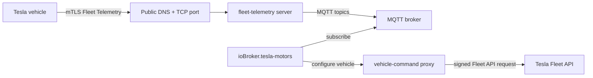

# Руководство по настройке системы телеметрии флота

В этом руководстве объясняется, как использовать Tesla Fleet Telemetry совместно с...`ioBroker.tesla-motors` Мост MQTT.

Функция телеметрии флота является необязательной. Если вы её не включите, адаптер продолжит работать в обычном режиме опроса API флота.

> \[!ВАЖНО] Для работы системы телеметрии автопарка требуется сервер, доступный из общедоступного интернета, и немного знаний Docker/сетевых технологий. Адаптер **не** запускает сам сервер телеметрии автопарка Tesla. Он только принимает сообщения MQTT и настраивает автомобиль через него.`vehicle-command` прокси.

## Что вы строите



Важное различие заключается в следующем:

- **Сервер телеметрии автопарка** : получает данные в режиме реального времени непосредственно от автомобиля.
- **MQTT-брокер** : передает декодированные телеметрические сообщения в ioBroker.
- **vehicle-command proxy** : подписывает запрос на настройку телеметрии автопарка.
- **Адаптер ioBroker** : подписывается на MQTT и записывает значения в существующее дерево состояний Tesla.

## Прежде чем начать

Вам потребуется:

1. Приложение Tesla Developer, которое уже работает с этим адаптером.
2. Открытый ключ приложения зарегистрирован в Tesla.
3. Виртуальный ключ, сопряженный с автомобилем.
4. Автомобиль Tesla с поддержкой системы Fleet Telemetry:
   - прошивка`2024.26` или более поздняя версия для стандартной поддержки телеметрии флота.
   - Согласно текущей документации Tesla по системе телеметрии автопарка, для автомобилей Model S/X с компьютерами Intel Atom требуется более новая версия прошивки.
5. Сервер или виртуальная машина/контейнер, способный запускать Docker.
6. Например, общедоступное DNS-имя.`tesla-telemetry.example.com` .
7. Публичный TCP-маршрут из интернета к серверу Fleet Telemetry.
8. MQTT-брокер, доступный с хоста ioBroker.

## Важное замечание по работе с сетью: используйте сквозную передачу TCP.

Автомобили Tesla подключаются к серверу Fleet Telemetry с использованием взаимного TLS (mTLS). Обычный обратный прокси-сервер HTTPS обычно разрывает TLS-соединение, а затем открывает новое TLS-соединение с бэкэндом. Это разрывает mTLS-соединение, если прокси-сервер не настроен очень специфическим образом.

Для первой настройки предпочтительнее следующее:

```text
Internet TCP 443 -> router/firewall/NPM stream/TCP proxy -> fleet-telemetry:443
```

Для точки доступа Fleet Telemetry следует избегать следующего:

```text
Internet HTTPS 443 -> normal HTTPS reverse proxy -> fleet-telemetry:443
```

Использование Nginx Proxy Manager допустимо, если вы настроили **хост для потоковой передачи/TCP-трафика** , а не обычный прокси-сервер. Публичное DNS-имя в адаптере должно разрешаться из интернета в указанный TCP-маршрут.

## Пример структуры файла

На хосте Docker:

```text
/opt/tesla-telemetry/
├── docker-compose.yml
├── config/
│   └── fleet-telemetry.json
├── certs/
│   ├── telemetry-ca.crt
│   ├── telemetry-server.crt
│   ├── telemetry-server.key
│   ├── proxy-tls-cert.pem
│   └── proxy-tls-key.pem
└── secrets/
    └── fleet-key.pem
```

Никогда не принимайте решения`secrets/` или закрытые ключи к Git.

## Шаг 1: подготовка сертификатов

Для работы системы Fleet Telemetry требуется серверный сертификат для публичного имени хоста телеметрии. Автомобиль должен иметь возможность проверить этот сертификат, используя PEM-файл центра сертификации, который вы указали в настройках адаптера.

Самый простой вариант с самостоятельным размещением — это небольшой частный центр сертификации для сервера телеметрии. Замените`tesla-telemetry.example.com` с вашим реальным публичным именем хоста:

```sh
mkdir -p /opt/tesla-telemetry/certs /opt/tesla-telemetry/secrets
cd /opt/tesla-telemetry

# Private CA for the telemetry endpoint.
openssl genrsa -out certs/telemetry-ca.key 4096
openssl req -x509 -new -nodes \
  -key certs/telemetry-ca.key \
  -sha256 -days 3650 \
  -out certs/telemetry-ca.crt \
  -subj "/CN=Tesla Fleet Telemetry local CA"

# Server certificate for the public telemetry hostname.
openssl genrsa -out certs/telemetry-server.key 2048
cat > certs/telemetry-server.cnf <<'CERTCONF'
[req]
default_bits = 2048
prompt = no
default_md = sha256
distinguished_name = dn
req_extensions = req_ext

[dn]
CN = tesla-telemetry.example.com

[req_ext]
subjectAltName = @alt_names

[alt_names]
DNS.1 = tesla-telemetry.example.com
CERTCONF

openssl req -new \
  -key certs/telemetry-server.key \
  -out certs/telemetry-server.csr \
  -config certs/telemetry-server.cnf

openssl x509 -req \
  -in certs/telemetry-server.csr \
  -CA certs/telemetry-ca.crt \
  -CAkey certs/telemetry-ca.key \
  -CAcreateserial \
  -out certs/telemetry-server.crt \
  -days 825 -sha256 \
  -extfile certs/telemetry-server.cnf \
  -extensions req_ext
```

Содержание`certs/telemetry-ca.crt` Впоследствии в поле адаптера вставляется текст **«Сервер телеметрии CA / полная цепочка PEM»** .

Он`vehicle-command` Для работы прокси-сервера также необходим TLS-сертификат. Для прокси-сервера, работающего только в локальной сети, обычно достаточно самоподписанного сертификата, если включить опцию адаптера **«Разрешить небезопасный TLS для прокси-сервера управления транспортными средствами»** :

```sh
openssl req -x509 -newkey rsa:2048 -nodes \
  -keyout certs/proxy-tls-key.pem \
  -out certs/proxy-tls-cert.pem \
  -days 3650 \
  -subj "/CN=vehicle-command.local"
```

## Шаг 2: поместите закрытый ключ приложения Tesla.

Он`vehicle-command` Для работы прокси-сервера необходим тот же закрытый ключ, что и открытый ключ зарегистрированного приложения Tesla.

Сохранить как:

```text
/opt/tesla-telemetry/secrets/fleet-key.pem
```

Пример:

```sh
nano /opt/tesla-telemetry/secrets/fleet-key.pem
chmod 600 /opt/tesla-telemetry/secrets/fleet-key.pem
```

Не вставляйте этот ключ в сообщения об ошибках, журналы или скриншоты.

## Шаг 3: Создайте конфигурацию сервера телеметрии флота.

Создавать`/opt/tesla-telemetry/config/fleet-telemetry.json` :

```json
{
  "host": "0.0.0.0",
  "port": 443,
  "status_port": 8080,
  "log_level": "info",
  "json_log_enable": false,
  "namespace": "tesla_telemetry",
  "transmit_decoded_records": true,
  "mqtt": {
    "broker": "192.168.1.10:1883",
    "client_id": "fleet-telemetry",
    "topic_base": "tesla-telemetry",
    "qos": 0,
    "retained": false,
    "connect_timeout_ms": 30000,
    "publish_timeout_ms": 2500,
    "keep_alive_seconds": 30
  },
  "records": {
    "V": ["mqtt"],
    "connectivity": ["mqtt"],
    "errors": ["mqtt"],
    "alerts": ["mqtt"]
  },
  "monitoring": {
    "prometheus_metrics_host": "0.0.0.0",
    "prometheus_metrics_port": 9090
  },
  "tls": {
    "server_cert": "/etc/tesla/certs/server/telemetry-server.crt",
    "server_key": "/etc/tesla/certs/server/telemetry-server.key"
  }
}
```

Регулировать:

- `mqtt.broker` : ваш MQTT-брокер в качестве`host:port` .
- `mqtt.topic_base` : должно соответствовать настройкам адаптера. По умолчанию -`tesla-telemetry` .
- Добавлять`mqtt.username` и`mqtt.password` если ваш MQTT-брокер требует авторизации.

`transmit_decoded_records=true` Это важно, потому что адаптер ожидает JSON-данные в формате MQTT, а не в формате protobuf.

## Шаг 4: создайте Docker Compose

Создавать`/opt/tesla-telemetry/docker-compose.yml` :

```yaml
services:
  fleet-telemetry:
    image: tesla/fleet-telemetry:latest
    container_name: fleet-telemetry
    restart: unless-stopped
    command:
      - /fleet-telemetry
      - -config=/etc/fleet-telemetry/config.json
    environment:
      SUPPRESS_TLS_HANDSHAKE_ERROR_LOGGING: "true"
    volumes:
      - ./config/fleet-telemetry.json:/etc/fleet-telemetry/config.json:ro
      - ./certs:/etc/tesla/certs/server:ro
    ports:
      # Public Fleet Telemetry endpoint. Forward your public TCP port to this.
      - "443:443"
      # Optional local status/metrics ports. Do not expose these publicly.
      - "127.0.0.1:8080:8080"
      - "127.0.0.1:9090:9090"

  vehicle-command:
    image: tesla/vehicle-command:latest
    container_name: vehicle-command
    restart: unless-stopped
    command:
      - -tls-key
      - /config/proxy-tls-key.pem
      - -cert
      - /config/proxy-tls-cert.pem
      - -key-file
      - /run/secrets/fleet-key.pem
      - -host
      - 0.0.0.0
      - -port
      - "4443"
    volumes:
      - ./certs:/config:ro
      - ./secrets:/run/secrets:ro
    ports:
      # If ioBroker runs on the same host, keep this on 127.0.0.1.
      # If ioBroker runs on another LAN host, bind this to the LAN IP instead.
      - "127.0.0.1:4443:4443"
```

Если ваш хост ioBroker не совпадает с хостом Docker, измените последнюю строку на привязку только для локальной сети, например:

```yaml
      - "192.168.1.20:4443:4443"
```

Не подвергать`vehicle-command` в общедоступный интернет.

Запуск сервисов:

```sh
cd /opt/tesla-telemetry
docker compose up -d
docker compose ps
```

Проверьте журналы:

```sh
docker logs --tail 100 fleet-telemetry
docker logs --tail 100 vehicle-command
```

## Шаг 5: предоставить доступ к конечной точке Fleet Telemetry.

Настройте DNS и маршрутизацию для вашего публичного имени хоста, например:

```text
tesla-telemetry.example.com -> your public IP
```

Перенаправьте публичный TCP-порт на хост Docker:

```text
public tesla-telemetry.example.com:443 -> docker-host:443
```

Если вы используете Nginx Proxy Manager, используйте **потоки** / **переадресацию TCP** , а не обычный HTTPS-прокси-сервер.

Затем проверьте общедоступную конечную точку извне вашей сети. Tesla предоставляет`check_server_cert.sh` Скрипт находится в репозитории Fleet Telemetry. Запустите его для того же имени хоста и порта, которые вы укажете в адаптере.

## Шаг 6: настройка адаптера

Откройте конфигурацию экземпляра адаптера в ioBroker.

### Вкладка «Телеметрия флота»

Набор:

| Настройка адаптера                                         | Пример                                           | Примечания                                                     |
| ---------------------------------------------------------- | ------------------------------------------------ | -------------------------------------------------------------- |
| Включить режим телеметрии флота                            | включено                                         | Включает прием данных по протоколу MQTT.                       |
| URL-адрес прокси-сервера управления транспортным средством | `https://192.168.1.20:4443`                      | LAN/внутренний URL прокси-сервера.                             |
| Разрешить небезопасный прокси-сервер TLS                   | включено для самоподписанного прокси-сертификата | Отключить, если сертификат прокси-сервера является доверенным. |
| имя хоста сервера телеметрии                               | `tesla-telemetry.example.com`                    | Доступ к общедоступному имени хоста для автомобиля.            |
| порт сервера телеметрии                                    | `443`                                            | Должен соответствовать общедоступному маршруту TCP.            |
| Сервер телеметрии CA / полная цепочка PEM                  | содержание`telemetry-ca.crt`                     | Центр сертификации, проверяющий сертификат сервера.            |
| MQTT-брокер                                                | `192.168.1.10:1883`                              | Брокер доступен через ioBroker.                                |
| Тематическая база MQTT                                     | `tesla-telemetry`                                | Должно совпадать`mqtt.topic_base` .                            |
| Обычный интервал обновления                                | например`7200` или`0`                            | Периодическая синхронизация Fleet API;`0` отключает его.       |

### вкладка "Поля телеметрии флота"

Начните с предустановленных настроек по умолчанию. Они оптимизированы для распространенных сценариев зарядки и состояния автомобиля. Поля разделены на сворачиваемые группы категорий в административном интерфейсе, поэтому достаточно открыть только ту категорию, которую вы редактируете.

Полезные значения по умолчанию:

- `Soc` : интервал`1` минимальное значение дельты`1` проценты.
- `Location` : интервал`10` минимальное значение дельты`100 m` .
- Поля зарядки/блокировки/кабеля: короткие интервалы, поскольку они редко меняются, но должны быстро отражаться.

Tesla по-прежнему отправляет значения только тогда, когда выполняются оба условия:

1. сконфигурированный`interval_seconds` прошло, и
2. Значение изменилось настолько, что было отправлено.

Для числовых полей с`minimum_delta` Незначительные изменения подавляются до того, как они создадут сигналы, за которые взимается плата.

## Шаг 7: выполните действия администратора.

Используйте кнопки на странице администрирования адаптера в следующем порядке:

1. **Проверить состояние флота**
   - Проверяет, что Tesla сообщает о состоянии вашего автомобиля и ключа.
2. **Настройка телеметрии автопарка**
   - отправляет сгенерированную конфигурацию транспортному средству через`vehicle-command` .
3. **Ознакомьтесь с конфигурацией флота.**
   - проверяет, что Tesla сообщает о конфигурации и`synced=true` .

Ожидаемые состояния адаптера:

```text
tesla-motors.0.info.telemetryConfigured = true
tesla-motors.0.info.telemetrySynced     = true
tesla-motors.0.info.telemetryConnected  = true
```

## Шаг 8: проверка входящих данных

На MQTT-брокере подпишитесь на базу тем:

```sh
mosquitto_sub -h 192.168.1.10 -p 1883 -t 'tesla-telemetry/#' -v
```

Вы должны увидеть такие темы, как:

```text
tesla-telemetry/<VIN>/connectivity {...}
tesla-telemetry/<VIN>/v/Soc 57.2
tesla-telemetry/<VIN>/v/DetailedChargeState "DetailedChargeStateCharging"
```

В ioBroker проверьте обновленные данные о состоянии Tesla, например:

```text
tesla-motors.0.<VIN>.charge_state.battery_level
tesla-motors.0.<VIN>.charge_state.charging_state
tesla-motors.0.<VIN>.charge_state.conn_charge_cable
tesla-motors.0.<VIN>.vehicle_state.locked
tesla-motors.0.<VIN>.telemetry.connectivity
```

Неотображенные, но выбранные поля доступны в виде необработанных телеметрических данных в следующем разделе:

```text
tesla-motors.0.<VIN>.telemetry.fields.<FieldName>
```

## Поиск неисправностей

| Симптом / ошибка                                               | Вероятная причина                                                                                                                                    | Что проверить                                                                                                                                                   |
| -------------------------------------------------------------- | ---------------------------------------------------------------------------------------------------------------------------------------------------- | --------------------------------------------------------------------------------------------------------------------------------------------------------------- |
| `missing_key`                                                  | Виртуальный ключ не привязан к автомобилю.                                                                                                           | Открыть`https://tesla.com/_ak/<your-domain>` на телефоне с приложением Tesla и выполните сопряжение ключа.                                                      |
| `unsupported_firmware`                                         | Встроенная прошивка автомобиля слишком устарела для системы Fleet Telemetry.                                                                         | Обновите прошивку автомобиля и проверьте текущие требования Tesla.                                                                                              |
| `streaming_toggle_disabled`                                    | Потоковая передача телеметрических данных от транспортного средства отключена.                                                                       | Проверьте настройки транспортного средства/автопарка и поддержку прошивки.                                                                                      |
| `max_configs`                                                  | В автомобиле уже слишком много настроек телеметрии автопарка.                                                                                        | Удалите неиспользуемую конфигурацию из другого приложения или воспользуйтесь функцией **«Удалить конфигурацию флота»** для этого приложения.                    |
| `telemetrySynced=false`                                        | Tesla приняла конфигурацию, но автомобиль еще не синхронизировал ее.                                                                                 | Разбудите автомобиль, подождите несколько минут, затем снова воспользуйтесь **функцией «Чтение конфигурации автопарка»** .                                      |
| MQTT подключен, но данные о транспортном средстве отсутствуют. | Автомобиль находится в спящем режиме, конфигурация не синхронизирована, неправильный маршрут общего пользования или неправильный центр сертификации. | Проверять`fleet-telemetry` просмотрите логи, запустите скрипт проверки сертификатов Tesla, проверьте публичную передачу TCP-трафика.                            |
| Нет полей местоположения                                       | Область действия OAuth`vehicle_location` отсутствует.                                                                                                | Добавьте область действия в приложении Tesla Developer, сбросьте информацию для входа/токен в адаптере, повторно авторизуйтесь и перенастройте Fleet Telemetry. |
| Ошибки рукопожатия TLS в логах                                 | Часто это случайные интернет-сканеры или неправильный режим прокси.                                                                                  | Если данные всё ещё поступают, шум сканера можно игнорировать; в противном случае проверьте сквозную передачу TCP и цепочку сертификатов.                       |
| Адаптер показывает`telemetryLastError`                         | Последняя ошибка MQTT/proxy/config.                                                                                                                  | Для получения подробной информации ознакомьтесь с журналом значений состояния и журналом адаптера.                                                              |

## Безопасный откат

Если что-то не работает, отключите **режим Fleet Telemetry** в адаптере и перезапустите экземпляр. После этого адаптер вернется к своему обычному режиму опроса.

Чтобы удалить конфигурацию телеметрии со стороны транспортного средства для этого приложения, используйте действие администратора **«Удалить конфигурацию автопарка»** .

## Контрольный список безопасности

- Не подвергать`vehicle-command` публично.
- Держать`fleet-key.pem` частный.
- Предпочтительнее использовать правила брандмауэра, чтобы доступ к серверу был разрешен только хосту ioBroker.`vehicle-command` .
- Откройте для доступа в интернет только порт Fleet Telemetry mTLS.
- Регулярно обновляйте образы Docker.
- Используйте выделенный поддомен для телеметрии флота.

## Ссылки

- Документация по системе телеметрии автопарка Tesla: <https://developer.tesla.com/docs/fleet-api/fleet-telemetry>
- Справочный сервер телеметрии автопарка Tesla: <https://github.com/teslamotors/fleet-telemetry>
- Хранилище данных MQTT для телеметрии автопарка Tesla: <https://github.com/teslamotors/fleet-telemetry/tree/main/datastore/mqtt>
- Прокси для управления автомобилем Tesla: <https://github.com/teslamotors/vehicle-command>