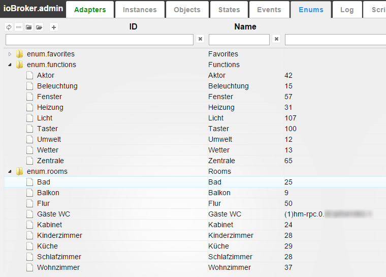

# IoBroker.text2command
## Описание
Этот адаптер может преобразовывать обычные предложения, например `Switch light in kitchen on`, в определенную команду и устанавливает состояние `adapter.0.device.kitchenLight` в `true`.

Этот адаптер нет смысла активировать отдельно. Его следует использовать с другими адаптерами, например, с Telegram или приложением для Android **`iobroker.vis`**.

## Использование
Чтобы выполнить команду, введите state **`text2command.<INSTANCE>.text`** с предложением. Вы всегда получите ответ в `text2command.<INSTANCE>.response`.

Если вы укажете **Ответ на ID**, ответ также будет записан в этот ID. Это необходимо, например, для реализации голосовых подтверждений.

Вы можете отправить сообщение через `sendTo` из `javascript`. Ответ придёт в ответном сообщении:

```js
sendTo('text2command', 'Switch light in kitchen on', function (err, response) {
    console.log('Response is: ' + response);
});
```

Можно использовать регулярные выражения, например: `/^light\son|^lamp\son/`. Регулярные выражения всегда нечувствительны к регистру.

Чтобы использовать функцию «Включение/выключение по функции», вам следует позаботиться о функциях.

Ключевые слова работают следующим образом:

- пробел разделяет ключевые слова
- для запуска правила в предложении должны присутствовать все ключевые слова: например, ключевое слово `light on` сработает при `switch light on`, `make light on everywhere` и не сработает при `switch on`, `make light`.
- одно ключевое слово может иметь множество форм. Вариации ключевого слова должны быть разделены символом «/». Например, ключевые слова: `switch/make/do light on/true` сработают при: `do light true`, `make please light on`.
- если ключевое слово может встречаться во многих падежах (имя, род, винительный падеж, множественное число, ...), все они должны быть перечислены как варианты, например: `включить свет/свет`.

Следующие функции будут интерпретироваться как

`enum.functions`:

**`enum.functions.light`** (Лихт | Свет):

- роли - `level.dimmer`
- роли - `switch.light`

**`enum.functions.backlight`** (Белеухтунг | Подсветка):

- роли - `level.backlight`
- роли - `switch.backlight`

**`enum.functions.blinds/shutter`** (Rollladen | Жалюзи/окна)

- роли - `level.blind`
- роли - `switch.blind`

**`enum.functions.curtain`** (Переход | Шторы)

- роли - `level.curtain`
- роли - `switch.curtain`

**`enum.functions.heating`** (Heizung | Отопление/Подогрев)

- роли - `уровень.температура`
- роли - `switch.temperature`

**`enum.functions.music`** (Музыка | Музыка)

- роли - `button.play`
- роли - `button.stop` / `button.pause`

**`enum.functions.alarm/security`** (Аварийная сигнализация / Тревога | Охрана)

- роли - `switch.security`

**`enum.functions.lock`** (Замок / Замок | Замок)

- роли - `switch.open`
- роли - `switch.lock`

Поддерживаются следующие комнаты:

| ключевое слово во фразе | Возможные enum.rooms на английском | на немецком | на русском |
|-----------------------|---------------------------------|--------------------------|-------------------|
| везде | везде | - | - |
| жить | гостиная | вонзиммер | зал |
| спальня | спальня/спальня | шлафциммер | спальня |
| ванна | ванная/ванна | бадециммер/плохой | ванна |
| работа/офис | офис | арбайтциммер | кабинет |
| дети/ребенок/ясли | питомник | детский сад | детский |
| гостевой туалет/гостевой шкаф | гость | gästewc | гостевой туалет |
| туалет/гардероб | туалет | туалет | туалет |
| этаж/вход | пол | диель/банда/флюр | коридор/прихожая |
| кухня | кухня | куче/куче | кухня |
| балкон/терраса/патио | терраса | балкон/терраса | терраса/балкон |
| столовая | столовая | эсциммер | столовая |
| гараж | гараж | гараж | гараж |
| лестница | лестницы | трепе/треппенхаус | лестница |
| сад | сад | сад | сад |
| двор/двор | суд | хоф | двор |
| комната для гостей | комната для гостей | гестезиммер | гостевая |
| чердак | чердак | спикер | кладовка |
| roof | roof | dachstuhl | крыша |
| терминал | терминал | аншлюсраум | сени |
| умывальная | туалет | васраум | прачечная |
| тепловая комната | тепловая комната | помещение с отоплением/центральное помещение | котельная |
| лачуга | лачуга | шуппен/шойне | сарай |
| летний домик | беседка | садовый дом | теплица |

В благодарностях можно использовать следующие шаблоны:

- `%s`: значение
- `%u`: единица измерения
- `%n`: имя (планируется!)
- `{objectId}`: здесь будет храниться состояние этого objectID. Фактически, это будут те же привязки, которые поддерживает [iobroker.vis](https://github.com/ioBroker/ioBroker.vis#bindings-of-objects), за исключением специальных привязок.

Поддерживаются следующие команды:

### Который сейчас час?
Ответ: 14:56 (текущее время)

### Как вас зовут?
Ответ можно настроить. По умолчанию: `My name is Alpha`

### Какая температура на улице?
Пользователь должен указать идентификатор штата, в котором будет считываться наружная температура.
Ответ можно изменить. Значение по умолчанию: `Outside temperature is %s %u` **`%s`** будет заменено на значение температуры, округлённое до целого числа. **`%u`** будет заменено на единицы измерения этого штата или единицы измерения температуры системы.

### Какая температура внутри?
Пользователь должен указать идентификатор состояния, в котором будет считываться внутренняя температура.
Ответ можно изменить. Значение по умолчанию: `Inside temperature is %s %u` **`%s`** будет заменено на значение температуры, округлённое до целого числа. **`%u`** будет заменено на единицы измерения этого состояния или единицы измерения температуры системы.

### Включение/выключение по функции
Эта команда считывает информацию из перечислений. Она использует `enum.functions` для определения типа устройства (например, свет, будильник, музыка) и `enum.rooms` для определения названия комнаты.

Пример на немецком языке: 

Ключевые слова для включения: *включить*, например `switch rear light in bath on`

Ключевые слова для отключения: *выключить*, например `switch light in living room off`

При желании ответ будет сгенерирован автоматически: `Switch off %function% in %room%`, где `%function%` и `%room%` будут заменены найденным типом устройства и местоположением.

Команда также принимает числовое значение. Оно имеет приоритет, например, команда `switch light off in living room on 15%` установит яркость света на 15%, а не в состояние *выкл*.

Вы можете определить комнату по умолчанию в []. Например, `switch the light on[sleepingroom]`

### Открыть/закрыть жалюзи
Эта команда считывает информацию из перечислений. Она использует **`enum.functions.blind`** для определения типа жалюзи или ставен и **`enum.rooms`** для определения названия комнаты.

Ключевые слова для подъема жалюзи: *жалюзи вверх*, например `set blinds up in sleeping room`

Ключевые слова для опускания жалюзи: *опускание жалюзи*, например `move blinds down in office`

Вы можете указать точное положение шторки в процентах, например, `move blinds to 40 percent in office`

При желании ответ будет сгенерирован автоматически: ` in %room%`, где %room% будет заменен найденным типом устройства и местоположением.

### Включить/выключить что-нибудь
Пользователь должен указать идентификатор состояния устройства, которое необходимо контролировать, и значение, которое необходимо записать.

Вам следует создать правило для каждой позиции (например, для `on` и для `off`).

Ответ можно настроить. По умолчанию: `Switched on`

Например.:

- `Деактивировать сигнализацию`, идентификатор объекта: `hm-rpc.0.alarm`, значение: `false`, ответ: `Тревога деактивирована/Деактивирована`. В этом случае ответ будет случайным образом выбран между *Тревога деактивирована* и *Деактивирована*.
- `Активировать сигнал тревоги`, ID объекта: `hm-rpc.0.alarm`, Значение: `true`, Ответ: `Тревога активирована/Активирована/Готово`. В этом случае ответ будет случайным образом выбран между *Тревога активирована*, *Активирована* и *Готово*.

*Деактивировать* должно быть первым в списке, так как оно длиннее.

В управляющих командах можно использовать числа с плавающей точкой. Если в тексте присутствует числовое значение, оно будет использовано в качестве управляющего значения, а предопределенное значение будет проигнорировано.

Например, для правила:

- `Установить уровень освещенности`, ID объекта: `hm-rpc.0.light.STATE`, Значение: `10`, Ответ: `Уровень установлен на %s%`.

Если команда имеет вид `Set light level to 50%`, то в `hm-rpc.0.light.STATE` будет записано 50 и ответ будет `Level set to 50%`.

Если команда имеет вид `Set light level`, то в `hm-rpc.0.light.STATE` будет записано 10 и ответ будет `Level set to 10%`.

### Спросить о чем-нибудь
Пользователь должен указать идентификатор состояния устройства, значение которого будет считано.
Этот шаблон вернет информацию о состоянии.

Например.:

- `windows opened`, ID объекта: `javascript.0.countOpenedWindows`, Подтверждение: `Фактически открыто %s окон`
- `температура в спальне`, идентификатор объекта: `hm-rpc.0.sleepingRoomSensor.TEMPERATURE`, подтверждение: `Фактическая температура в спальне: %s %u/%s %u`. В этом случае ответ будет рандомизирован между *Фактическая температура в спальне: %s %u* и *%s %u*.

### Отправить текст в штат
Вы можете записать текст в состояние. Для записи текста необходимо указать идентификатор состояния.

Например, правило: `email [to] wife`, идентификатор объекта: `javascript.0.emailToWife`, подтверждение: `Email sent`, текст: `Send email to my wife: I will be late`. Адаптер ищет последнее слово в ключевых словах (в данном случае `wife`), извлекает текст из следующего слова (в данном случае `I will be late`) и записывает его в `javascript.0.emailToWife`.
Слово `to` не требуется для срабатывания правила, но будет удалено из текста.

### Ты молодец (Просто ради развлечения)
Ответ можно настроить. По умолчанию: `Thank you` или `You are welcome`

### Спасибо (просто ради развлечения)
Ответ можно настроить. По умолчанию: `No problem` или `You are welcome`

### Создать ответ
Вы можете сгенерировать ответ с привязками {objectId} в подтверждении. Используется для Alexa.

Например.:

- `windows opened`, Подтверждение: `Фактически открыто {javascript.0.countOpenedWindows} окон`
- `температура в спальне`, подтверждение: `Фактическая температура в спальне составляет {t: hm-rpc.0.sleepingRoomSensor.TEMPERATURE; Math.round(t)}/{hm-rpc.0.sleepingRoomSensor.TEMPERATURE; round(1)} градусов`. В этом случае ответ будет рандомизирован между *Фактическая температура в спальне составляет <ЗНАЧЕНИЕ>* и *<ЗНАЧЕНИЕ>*.

Подробнее о привязках можно прочитать здесь: (Привязки объектов)[https://github.com/ioBroker/ioBroker.vis#bindings-of-objects]

Кроме того, вы можете узнать время до настоящего момента с помощью `{hm-rpc.0.light.STATE.lc;dateinterval}` (2 минуты и 12 секунд) или `{hm-rpc.0.light.STATE.lc;dateinterval(true)}` (2 минуты и 12 секунд **назад**)

## Внешние правила с `javascript`
Существует возможность использовать движок `javascript` для обработки команд в `text2command`.
Для этого необходимо указать состояние в поле «Идентификатор состояния процессора» (в расширенных настройках) и отслеживать это состояние в каком-либо JS- или блочном скрипте.
Вы можете создать состояние вручную в панели администратора или в скрипте. Скрипт обработки может выглядеть следующим образом:

```js
createState("textProcessor", '', function () {
    // text2command writes the value with ack=false. Change "any" is important too, to process repeated commands.
    on({id: "javascript.0.textProcessor", ack: false, change: 'any'}, function (obj) {
         var task = JSON.parse(obj.state.val);
         // value looks like
         // {
         //     "command":      "text to process", // command that was received by text2command
         //     "language":     "en",              // language in command or system language
         //     "withLanguage": false              // indicator if language was defined in command (true) or used default language (false)
         // }
         // response to text2command with ack=true
         if (task.command === 'switch light on') {
            setState("hm-rpc.0.light", true);
            setState("javascript.0.textProcessor", 'light is on', true);
         } else {
            // let it process with predefined rules
            setState("javascript.0.textProcessor", '', true);
         }
    });
});
```

Установите в настройках `text2command` **ИД состояния процессора** как *`javascript.0.textProcessor`*, чтобы этот пример работал.

Во-первых, команда будет обработана вашим `javascript`, и если `javascript` ответит «» или не ответит в течение предопределенного времени (по умолчанию 1 секунда), команда будет обработана по правилам.

### Вариант: Записывать в ответ на каждую команду
Если активировано таким образом, то каждой командой (независимо от того, пришел ли запрос через state или sendTo) будет записан `text2command.X.response` вместе с ответом.

# Задача
- на русском языке, мужские и женские ответы.

<!-- Заполнитель для следующей версии (в начале строки):

### **РАБОТА В ХОДЕ** -->

## Changelog
### 4.0.0 (2025-11-03)
* (bluefox) GUI was updated to vite
* (bluefox) Minimal nodejs version is 20.x

### 3.0.3 (2023-12-18)
* (bluefox) Corrected GUI

### 3.0.2 (2023-02-27)
* (bluefox) Corrected link from admin

### 3.0.1 (2023-02-21)
* (bluefox) Corrected many GUI errors

### 2.3.1 (2023-02-03)
* (bluefox) Migrated GUI to v5

### 2.2.2 (2022-06-17)
* (Apollon77) Fix crash cases reported by Sentry

### 2.2.1 (2022-02-21)
* (bluefox) Checked the existence of `sayit` instance before output
* (bluefox) Added the decimal places settings to temperature  
* (bluefox) Added the second object ID to user queries
* (bluefox) Added the option: "No negative answer"

### 2.1.6 (2022-02-16)
* (bluefox) Corrected GUI

### 2.1.4 (2022-02-16)
* (bluefox) Some errors will be caught at the start

### 2.1.2 (2022-02-13)
* (bluefox) Updated GUI.
* (bluefox) Updated releaser

### 2.1.1 (2021-06-15)
* (PeterVoronov) Corrected usage of regex

### 2.1.0 (2021-05-24)
* (bluefox) Updated GUI.

### 2.0.7 (2020-12-12)
* (Apollon77) Prevent crash case (Sentry IOBROKER-TEXT2COMMAND-J)

### 2.0.6 (2020-12-03)
* (Apollon77) Prevent crash case (Sentry IOBROKER-TEXT2COMMAND-D, IOBROKER-TEXT2COMMAND-C)

### 2.0.5 (2020-09-5)
* (bluefox) Updated the select ID dialog.

### 2.0.3 (2020-07-14)
* (bluefox) Fixed GUI errors

### 2.0.2 (2020-07-13)
* (bluefox) Fixed GUI errors

### 2.0.1 (2020-07-08)
* (bluefox) Fixed select ID dialog

### 2.0.0 (2020-07-06)
* (bluefox) New GUI

### 1.3.1 (2019-07-18)
* (unltdnetworx) changed copyright year to 2019, according to issue #41
* (unltdnetworx) additional words for blinds and functions in english and german
* (unltdnetworx) fixed typo

### 1.3.0 (2019-07-18)
* (bluefox) Using the defined language by words

### 1.2.5 (2019-02-12)
* (unltdnetworx) description in german corrected
* (unltdnetworx) added percent to true/false rules

### 1.2.4 (2018-05-05)
* (Apollon77) Fix

### 1.2.3 (2018-05-01)
* (bluefox) Support of bindings in answer {objId}

### 1.2.0 (2018-04-23)
* (bluefox) Support of Admin3 (but not materialize style)

### 1.1.7 (2018-04-04)
* (bluefox) The parsing error was fixed

### 1.1.6 (2017-10-05)
* (bluefox) Check if units are undefined

### 1.1.5 (2017-08-14)
* (bluefox) Support of iobroker.pro

### 1.1.4 (2017-03-27)
* (bluefox) translations

### 1.1.3 (2016-08-30)
* (bluefox) russian translations

### 1.1.2 (2016-08-29)
* (bluefox) fix the russian temperature text
* (bluefox) extend rule "control device" with option 0/1
* (bluefox) use by control of devices min/max values if set

### 1.1.1 (2016-08-19)
* (bluefox) add additional info for external text processor

### 1.1.0 (2016-08-16)
* (bluefox) add text processor state ID

### 1.0.2 (2016-07-22)
* (bluefox) fix error with detection of numeric values

### 1.0.1 (2016-06-01)
* (bluefox) fix: send text command

### 1.0.0 (2016-05-05)
* (bluefox) replace special chars in input text: #'"$&/\!?.,;:(){}^

### 0.1.10 (2016-03-20)
* (bluefox) fix double pronunciation of some answers

### 0.1.9 (2016-03-20)
* (bluefox) ignore spaces

### 0.1.8 (2016-03-15)
* (bluefox) fix error with enums

### 0.1.7 (2016-03-12)
* (bluefox) implement "say something"

### 0.1.6 (2016-02-24)
* (bluefox) fix temperature

### 0.1.5 (2016-02-23)
* (bluefox) fix russian outputs

### 0.1.4 (2016-02-22)
* (bluefox) fix russian outputs

### 0.1.3 (2016-02-21)

* (bluefox) round temperature in answers

### 0.1.2 (2016-02-21)
* (bluefox) implement russian time

### 0.1.1 (2016-02-19)
* (bluefox) check invalid commands

### 0.1.0 (2016-02-19)
* (bluefox) fix problem with controlling of channels
* (bluefox) enable write JSON as argument

### 0.0.3 (2016-02-14)
* (bluefox) remove unused files

### 0.0.2 (2016-02-10)
* (bluefox) extend readme

### 0.0.1 (2016-02-09)
* (bluefox) initial commit

## License

The MIT License (MIT)

Copyright (c) 2014-2025, bluefox <dogafox@gmail.com>

Permission is hereby granted, free of charge, to any person obtaining a copy
of this software and associated documentation files (the "Software"), to deal
in the Software without restriction, including without limitation the rights
to use, copy, modify, merge, publish, distribute, sublicense, and/or sell
copies of the Software, and to permit persons to whom the Software is
furnished to do so, subject to the following conditions:

The above copyright notice and this permission notice shall be included in
all copies or substantial portions of the Software.

THE SOFTWARE IS PROVIDED "AS IS", WITHOUT WARRANTY OF ANY KIND, EXPRESS OR
IMPLIED, INCLUDING BUT NOT LIMITED TO THE WARRANTIES OF MERCHANTABILITY,
FITNESS FOR A PARTICULAR PURPOSE AND NONINFRINGEMENT. IN NO EVENT SHALL THE
AUTHORS OR COPYRIGHT HOLDERS BE LIABLE FOR ANY CLAIM, DAMAGES OR OTHER
LIABILITY, WHETHER IN AN ACTION OF CONTRACT, TORT OR OTHERWISE, ARISING FROM,
OUT OF OR IN CONNECTION WITH THE SOFTWARE OR THE USE OR OTHER DEALINGS IN
THE SOFTWARE.